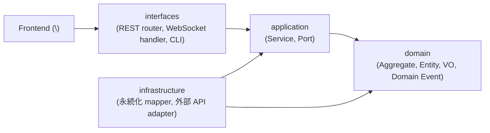

# システム全体アーキテクチャ

プロジェクトのシステム構造を Clean Architecture / DDD の観点で俯瞰する。詳細は [`domain-model.md`](domain-model.md) / [`tech-stack.md`](tech-stack.md) / [`threat-model.md`](threat-model.md) を参照。

## レイヤー構成

\<例: Backend は Clean Architecture の依存方向（外側 → 内側）に従う。\>

依存方向: `interfaces → application → domain ← infrastructure`

- **domain** は何にも依存しない（純粋な業務ロジック）
- **application** は domain だけに依存（Port パターン）
- **infrastructure** は domain と application を実装する（依存性逆転）
- **interfaces** は application を呼び出す

## ドメインモデル概観

主要な Aggregate:

| Aggregate | 役割 | 詳細 |
|---|---|---|
| \<Aggregate A\> | \<業務的な役割\> | [`domain-model.md §A`](domain-model.md) |
| \<Aggregate B\> | \<役割\> | [`domain-model.md §B`](domain-model.md) |
| \<Aggregate C\> | \<役割\> | [`domain-model.md §C`](domain-model.md) |

詳細は [`domain-model.md`](domain-model.md) を参照。

## 採用技術概観

| レイヤー | 主要技術 | 詳細 |
|---|---|---|
| Frontend | \<例: React / Vue\> | [`tech-stack.md`](tech-stack.md) |
| Backend | \<例: FastAPI / Spring\> | 同上 |
| 永続化 | \<例: SQLite / PostgreSQL\> | 同上 |
| 外部連携 | \<例: gRPC / REST\> | 同上 |

詳細は [`tech-stack.md`](tech-stack.md) を参照。

## 脅威モデル概観

主要な攻撃面と対策:

| 攻撃面 | 対策 | 詳細 |
|---|---|---|
| \<攻撃面 1\> | \<対策\> | [`threat-model.md`](threat-model.md) |
| \<攻撃面 2\> | \<対策\> | 同上 |
| \<攻撃面 3\> | \<対策\> | 同上 |

詳細は [`threat-model.md`](threat-model.md) を参照。

## 関連

- [`domain-model.md`](domain-model.md) — DDD ドメインモデルの詳細
- [`tech-stack.md`](tech-stack.md) — 採用技術と根拠
- [`threat-model.md`](threat-model.md) — 脅威モデル / OWASP Top 10
- [`../requirements/system-context.md`](../requirements/system-context.md) — システムコンテキスト図（要件定義レベル、本書とは粒度が異なる）
