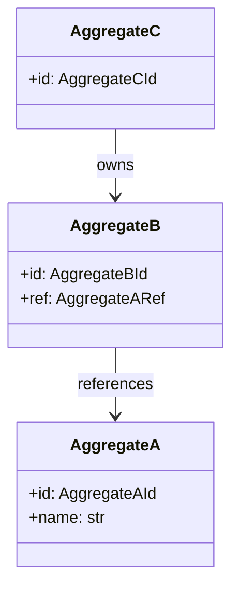

# ドメインモデル

DDD の Aggregate / Entity / Value Object / Domain Event の関係を凍結する。各 feature の業務仕様（[`../features/<feature-name>/feature-spec.md`](../features/)）が本書を引用して業務概念を共有する。

## Aggregate 一覧

## Aggregate 詳細

### \<Aggregate A\>

| 区分 | 内容 |
|---|---|
| 役割 | \<業務概念としての役割\> |
| 不変条件 | \<Aggregate 内で守る制約\> |
| ふるまい | \<提供するメソッド群\> |
| 関連 | \<他 Aggregate との関係\> |

### \<Aggregate B\>

...

## Value Object 一覧

| VO | 用途 | 制約 |
|---|---|---|
| \<VO A\> | \<例: 識別子 / 名前 / 範囲付き値\> | \<例: 不変、特定範囲、規則化された文字列\> |
| \<VO B\> | ... | ... |

## Domain Event 一覧

| Event | 発生契機 | Aggregate | 用途 |
|---|---|---|---|
| \<Event A\> | \<契機\> | \<発火元 Aggregate\> | \<外部通知 / 副作用駆動 等\> |
| \<Event B\> | ... | ... | ... |

## 関連

- [`architecture.md`](architecture.md) — システム全体構造
- [`tech-stack.md`](tech-stack.md) — 採用技術
- [`../features/`](../features/) — 各 feature の詳細設計
