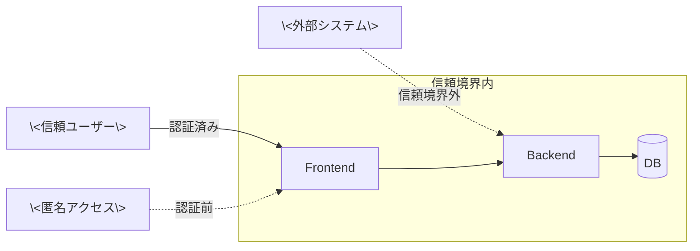

# 脅威モデル

プロジェクトの信頼境界・攻撃面・OWASP Top 10 対応方針を凍結する。新規外部入力 / 外部出力経路を追加した場合は本書を更新する。

## 信頼境界

## 想定攻撃者と攻撃経路

| 攻撃者カテゴリ | 攻撃経路 | 保護資産 |
|---|---|---|
| 外部攻撃者（匿名）| ネットワーク経由（HTTP / WebSocket）| \<個人情報 / 認証情報 / 業務データ\> |
| 内部攻撃者（権限濫用）| 認証済みセッション | \<権限境界を超えるリソース\> |
| 外部システム経由 | \<外部 API / Webhook\> | \<システムの整合性\> |

## OWASP Top 10 対応方針

| # | カテゴリ | 対応方針 |
|---|---|---|
| A01 | Broken Access Control | \<認可境界、ロールベースアクセス制御の方針\> |
| A02 | Cryptographic Failures | \<暗号化方針、HTTPS 強制\> |
| A03 | Injection | \<入力検証、ORM 使用\> |
| A04 | Insecure Design | \<セキュア設計の原則、Fail Fast\> |
| A05 | Security Misconfiguration | \<設定管理、CI でのチェック\> |
| A06 | Vulnerable Components | \<依存監査（pip-audit / pnpm audit / Dependabot）\> |
| A07 | Auth Failures | \<認証方式、セッション管理\> |
| A08 | Data Integrity Failures | \<署名検証、audit_log\> |
| A09 | Logging Failures | \<ログ設計、機密情報マスキング\> |
| A10 | SSRF | \<外部 URL fetch の制限\> |

## 主要な攻撃面と対策

| 攻撃面 | 対策 | 関連 feature |
|---|---|---|
| \<攻撃面 1: 例 - 添付ファイル経由の XSS\> | \<対策: filename サニタイズ + MIME ホワイトリスト\> | \<feature 名\> |
| \<攻撃面 2: 例 - シークレット流入\> | \<対策: 永続化前 masking gateway\> | \<feature 名\> |
| \<攻撃面 3: 例 - 外部 IP からの不正接続\> | \<対策: localhost バインド + reverse proxy\> | \<feature 名\> |

## 関連

- [`architecture.md`](architecture.md) — システム全体構造
- [`../requirements/non-functional.md`](../requirements/non-functional.md) — 非機能要件（セキュリティ）
- [`../requirements/external-integrations.md`](../requirements/external-integrations.md) — 外部連携（攻撃面の出処）
