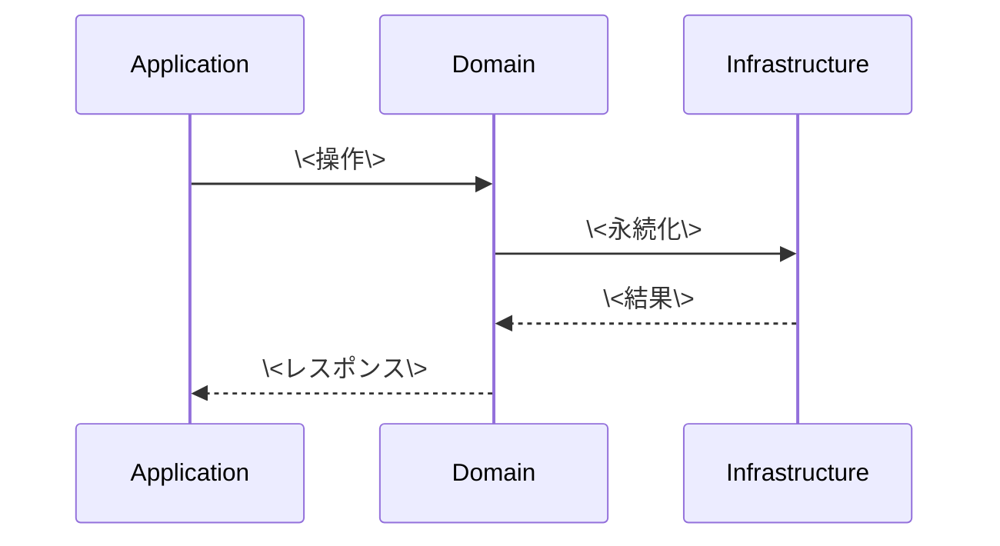

# 基本設計書

> feature: `<feature-name>` / sub-feature: `<sub-feature>`
> 親業務仕様: [`../feature-spec.md`](../feature-spec.md)
> 関連: [`basic-design.md §モジュール契約`](basic-design.md)

## 本書の役割

本書は **階層 3: モジュール（sub-feature）の基本設計**（Module-level Basic Design）を凍結する。階層 1 の [`docs/design/`](../../../design/) で凍結されたシステム全体構造を、本 sub-feature レベルに展開した細部を扱う（Vモデル「基本設計」工程の階層的トップダウン分解）。命名が同じ「基本設計」でも、対象スコープ（システム全体 / モジュール）で区別される。

機能要件（REQ-XX-NNN、入力 / 処理 / 出力 / エラー時の入出力契約）は本書 §モジュール契約 として統合される（旧 `requirements.md` は廃止）。本書は **構造契約と処理フローを凍結する** — 「どのモジュールが・どの順で・何を担うか」のレベルで凍結する。

**書くこと**:
- モジュール構成（機能 ID → ディレクトリ → 責務）
- モジュール契約（機能要件の入出力、業務記述）
- クラス設計（概要、属性は名前のみ列挙、型・制約は detailed-design.md）
- 処理フロー（ユースケース単位、設計戦略レベル）
- シーケンス図 / 脅威モデル / エラーハンドリング方針

**書かないこと**（後段の設計書へ追い出す）:
- メソッド呼び出しの細部 → [`detailed-design.md`](detailed-design.md) §確定事項
- 属性の型・制約 → [`detailed-design.md`](detailed-design.md) §クラス設計（詳細）
- MSG 確定文言 → [`detailed-design.md`](detailed-design.md) §MSG 確定文言表

## 記述ルール（必ず守ること）

基本設計に **疑似コード・サンプル実装（言語コードブロック）を書かない**。
ソースコードと二重管理になりメンテナンスコストしか生まない。
必要なのは構造契約（クラス・モジュール・データの関係）であり、実装の細部は [`detailed-design.md`](detailed-design.md) で凍結する。

## モジュール構成

| 機能 ID | モジュール | ディレクトリ | 責務 |
|---|---|---|---|
| REQ-XX-001, ... | \<モジュール名\> | \<ディレクトリ\> | \<責務\> |

```
ディレクトリ構造（本 sub-feature で追加・変更されるファイル）:

.
├── backend/src/...
└── frontend/src/...
```

## モジュール契約（機能要件）

本 sub-feature が提供するモジュールの入出力契約を凍結する。各 REQ-XX-NNN は親 [`feature-spec.md §5`](../feature-spec.md) ユースケース UC-XX-NNN と 1:1 または N:1 で対応する（孤児要件を作らない）。

**書くこと**:
- 業務的なパラメータ名・制約（実装型ではなく業務記述）
- 業務記述（"重複チェック → OK なら追加" レベル、実装手順ではない）

**書かないこと**（後段の設計書へ追い出す）:
- 実装手順 → [`detailed-design.md §確定事項`](detailed-design.md)
- 確定文言（`[FAIL] xxx must be ...`）→ [`detailed-design.md §MSG 確定文言表`](detailed-design.md)

### REQ-XX-001: \<機能名\>

| 項目 | 内容 |
|---|---|
| 入力 | \<業務的パラメータ名と制約\> |
| 処理 | \<業務記述、実装手順ではない\> |
| 出力 | \<返り値\> |
| エラー時 | \<例外 / エラーレスポンス、MSG-XX-NNN を表示\> |

### REQ-XX-002: \<機能名\>

| 項目 | 内容 |
|---|---|
| 入力 | ... |
| 処理 | ... |
| 出力 | ... |
| エラー時 | ... |

## ユーザー向けメッセージ一覧

| ID | 種別 | メッセージ（要旨） | 表示条件 |
|---|---|---|---|
| MSG-XX-001 | エラー | \<要旨\> | \<条件\> |
| MSG-XX-002 | 成功 | \<要旨\> | \<条件\> |

各メッセージの確定文言は [`detailed-design.md §MSG 確定文言表`](detailed-design.md) で凍結する。

## 依存関係

| 区分 | 依存 | バージョン方針 | 備考 |
|---|---|---|---|
| ランタイム | \<例: Python 3.12+\> | \<pyproject.toml\> | 既存 |
| 外部ライブラリ | \<例: pydantic v2\> | \<pyproject.toml\> | 既存 |

## クラス設計（概要）

```mermaid
classDiagram
    class \<Aggregate\> {
        +id: AggregateId
        +behavior_method()
    }
    class \<Entity\> {
        +id: EntityId
    }
    \<Aggregate\> "1" *-- "N" \<Entity\>
```

**凝集のポイント**:
- \<ポイント 1\>
- \<ポイント 2\>

## 処理フロー

### ユースケース 1: \<UC 名\>

1. \<ステップ 1\>
2. \<ステップ 2\>
3. \<ステップ 3\>

### ユースケース 2: \<UC 名\>

1. ...

## シーケンス図



## アーキテクチャへの影響

- [`docs/design/domain-model.md`](../../../design/domain-model.md) への変更: \<変更内容 / なし\>
- [`docs/design/tech-stack.md`](../../../design/tech-stack.md) への変更: \<変更内容 / なし\>
- 既存 feature への波及: \<波及内容 / なし\>

## 外部連携

| 連携先 | 目的 | プロトコル | 認証 | タイムアウト / リトライ |
|---|---|---|---|---|
| \<連携先\> | \<目的\> | \<プロトコル\> | \<認証\> | \<タイムアウト\> |

## UX 設計

| シナリオ | 期待される挙動 |
|---|---|
| \<シナリオ\> | \<挙動\> |

**アクセシビリティ方針**: \<方針\>

## セキュリティ設計

### 脅威モデル

| 想定攻撃者 | 攻撃経路 | 保護資産 | 対策 |
|---|---|---|---|
| **T1: \<攻撃者カテゴリ\>** | \<経路\> | \<資産\> | \<対策\> |
| **T2: ...** | ... | ... | ... |

詳細な信頼境界は [`docs/design/threat-model.md`](../../../design/threat-model.md)。

## ER 図

```mermaid
erDiagram
    \<Aggregate\> ||--o{ \<Entity\> : "owns"
    \<Entity\> {
        string id PK
        string aggregate_id FK
    }
```

## エラーハンドリング方針

| 例外種別 | 処理方針 | ユーザーへの通知 |
|---|---|---|
| \<例外名\> | \<方針\> | MSG-XX-NNN |
