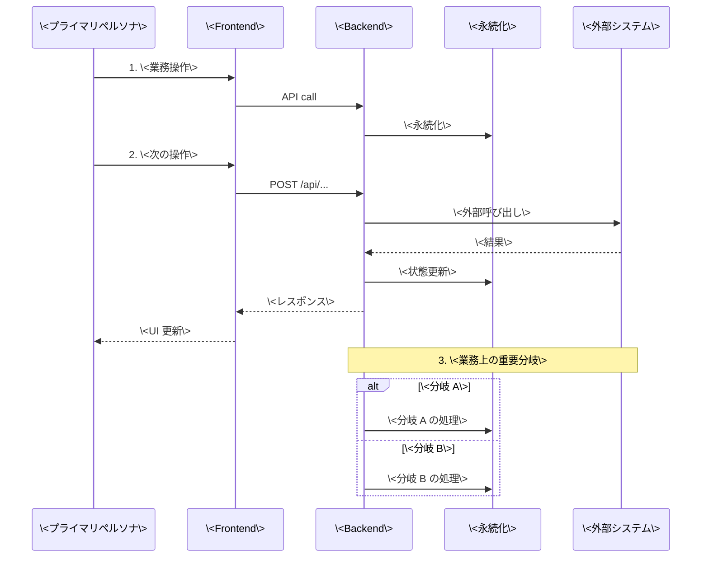

# 主要ユースケース

プロジェクトの代表的な業務シナリオをシーケンス図で凍結する。本ファイルは [`../acceptance-tests/scenarios/`](../acceptance-tests/scenarios/) の根拠となる。

## ユースケース 1: \<業務シナリオ名\>



## ユースケース 2: \<次の業務シナリオ\>

```mermaid
sequenceDiagram
    ...
```

## 関連

- [`system-context.md`](system-context.md) — システムコンテキスト図 + アクター
- [`functional-scope.md`](functional-scope.md) — 機能スコープ
- [`acceptance-criteria.md`](acceptance-criteria.md) — 受入基準
- [`../acceptance-tests/scenarios/`](../acceptance-tests/scenarios/) — 本ユースケースを E2E で検証する受入テスト
