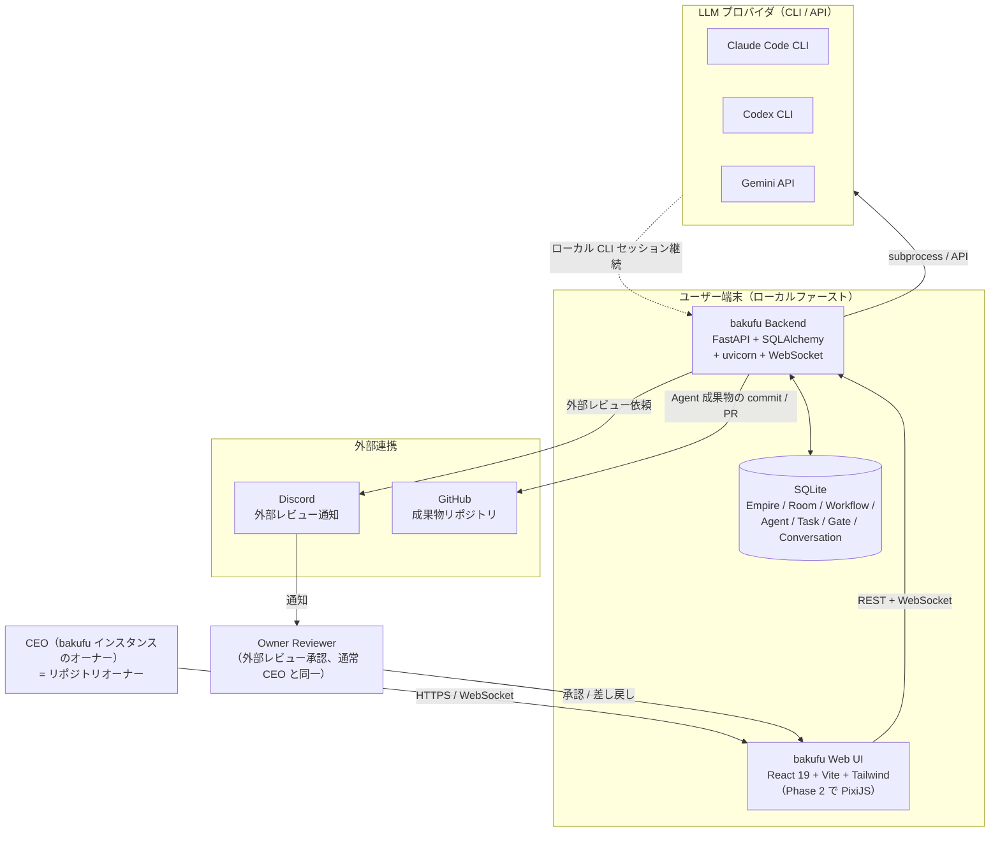
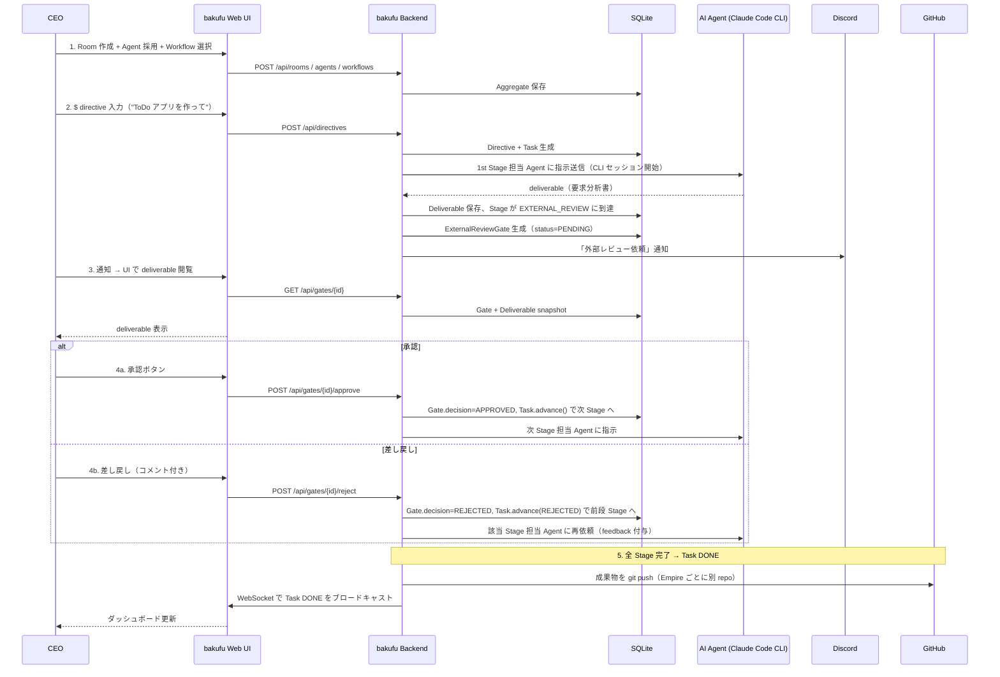

# System Context — bakufu

> **本書の位置づけ**: bakufu の **システムコンテキスト概観**。「何を作ろうとしているか」をプロダクト全体・アクター・主要ユースケース・スコープ・外部連携の観点で凍結する。実装担当（ai-team 開発室）が個別 feature の Vモデル設計書を起こす際の前提となる真実源。
>
> ドメインモデル（Aggregate / Entity / VO）は [`domain-model.md`](domain-model.md)、技術スタックは [`tech-stack.md`](tech-stack.md)、MVP の機能境界は [`mvp-scope.md`](mvp-scope.md) を参照。

## 1. プロダクト概要

**bakufu**（幕府）は、UI で **Room（部屋）** を自由に編成し、AI エージェント群が任意のワークフロー（Vモデル / アジャイル / 雑談 / アシスタント等）で協業する、ローカルファーストのエージェント・エンパイア・オーケストレーター。各工程の **外部レビュー（人間承認）** を一級概念として扱い、AI 協業による品質向上を人間のチェックポイントで担保する。

### 着想元と差別化

| 着想元 | 引き継ぐ思想 | bakufu での扱い |
|----|----|----|
| **ai-team**（同オーナー運営、Discord ベース AI エージェント協業） | 「**開発室**」概念、Vモデル工程強制、`#外部レビュー` チャネルでの人間承認、複数 AI エージェントの役割分担 | **コア思想を bakufu に移植**。Discord チャネルを Web UI の Room に、`#外部レビュー` を `ExternalReviewGate` Aggregate として一級概念に昇格 |
| **ClawEmpire**（OSS、AI agent office simulator） | Empire / Department、git worktree 隔離、`$` プレフィックス CEO directive、ローカルファースト | 思想は踏襲、ただしコード品質に課題があるため**ゼロから DDD で再設計** |
| **shikomi**（同オーナー運営、Rust 製クリップボードツール） | dev-workflow（lefthook + just + convco + gitleaks）、Vモデルで開発フロー自体を機能として定義する手法 | dev-workflow を Python+TypeScript に翻訳して移植 |

### bakufu と ai-team の関係

- **ai-team は bakufu の実装担当**: ai-team の各エージェント（リーダー・設計責任者・プログラマー・テスト担当・品質担当）が Discord 上の協業で bakufu を開発する
- **bakufu は将来 ai-team を吸収しうる後継プロダクト**: Web UI ベースで運用しやすく、Discord 環境に閉じない
- **bakufu の MVP 達成後**、ai-team の運用機能（雑談 Room / アシスタント Room / ブログ編集部）を bakufu に順次移植する想定（Phase 2）

## 2. システムコンテキスト図

## 3. アクター

| アクター | 役割 | 期待 |
|---------|-----|------|
| CEO | bakufu インスタンスのオーナー、Empire / Room / Agent / Workflow を編成 | UI から数クリックで部屋を作成・採用、`$` directive で AI 群に指示できる |
| Owner Reviewer | 外部レビューゲートで承認/差し戻しを行う人間（通常 CEO 兼任） | Discord 通知から UI へ遷移し、deliverable を確認して 1 クリックで判断 |
| AI Agent | 採用された LLM エージェント（Claude Code / Codex / Gemini） | Room の Workflow に従い、Stage の deliverable を生成 |
| 外部 LLM プロバイダ | Anthropic / OpenAI / Google 等 | bakufu Backend が CLI / API 経由で会話継続つきで呼び出す |
| 外部メッセンジャー | Discord（MVP）、Slack ほか（Phase 2） | 外部レビュー依頼の通知配送 |
| GitHub | bakufu 自身のリポジトリ + 各 Empire が生成する成果物リポジトリ | コミット / PR / Issue の連携 |

## 4. ペルソナ

設計判断の軸として、代表ペルソナを 3 名定義する。後続 feature の要件定義・UX 検討は本ペルソナに対する価値で判断する。

### ペルソナ A: 個人開発者 CEO — **プライマリ**

- **背景**: フリーランス / インディー開発者。複数の小規模プロジェクトを並行で進める
- **技術レベル**: GitHub / Docker / CLI を日常使用、ローカル LLM ツール（Claude Code 等）の経験あり
- **利用シーン**: 新規 OSS プロジェクトの要求分析〜実装を AI エージェント群に分担させる、自分は外部レビューと方針決定に集中する
- **期待**: 「Discord に閉じない Web UI で運用したい」「Vモデルの工程ロックで品質を担保したい」「AI が暴走しないよう人間チェックポイントを必ず通したい」
- **ペインポイント**: 単独開発で全工程を回す時間がない。AI エージェントだけに任せると品質ばらつきと脱線が発生する

### ペルソナ B: AI Agent — **Agent-C 系**

- **本体**: Claude Code / Codex / Gemini 等の LLM CLI エージェント
- **能力**: ファイル読み書き、bash/PowerShell 実行、Web 検索、git 操作
- **利用文脈**: bakufu Backend からプロンプト + コンテキスト + 過去会話を渡され、Stage の deliverable を生成する
- **期待**: 「会話セッションが工程をまたいで継続する（CLI セッション ID 保持）」「Agent ごとの persona / role / skills が事前注入されている」「他 Agent の発言を Conversation ログから引ける」
- **制約**: AI 生成フッター（`Co-Authored-By: Claude` 等）をコミットメッセージに含めない（CONTRIBUTING.md §AI 生成フッターの禁止）

### ペルソナ C: チームレビュワー — **セカンダリ**

- **背景**: CEO と分離したい場合の品質責任者（小規模チームの技術リード）
- **技術レベル**: コードレビュー経験あり、ドメイン知識保持
- **利用シーン**: 複数 Empire の外部レビューゲートを横断で担当、Discord 通知から UI を開いて承認 / 差し戻し
- **期待**: 「複数 Empire のレビュー待ちが 1 ダッシュボードで見える」「差し戻し履歴が監査ログとして残る」「コメントだけ書いて差し戻し処理を実行できる」

## 5. 解決する課題

| # | 課題 | bakufu の対応 |
|---|----|----|
| 1 | ai-team の Discord ベースはチャネル運用が口頭規律で揺らぎ、Vモデル工程の遵守が個人の意識に依存する | Workflow / Stage / Transition を **ドメインモデル上の Aggregate として強制**。工程ロック・差し戻し経路は UI で逸脱不能 |
| 2 | 外部レビューが「忘れられがち」「差し戻し履歴がチャネル発言に埋もれて追えない」 | **`ExternalReviewGate` を独立 Aggregate**として一級昇格。複数ラウンドの判断履歴・閲覧監査ログを保持 |
| 3 | 「複数 AI エージェントを協業させる」セットアップに開発者の時間が取られる（プロンプト設計、役割定義、会話継続） | UI で **Empire / Room / Agent / Workflow を編成可能**。プリセット（Vモデル開発室 / アジャイル開発室）からの 1 クリック生成 |
| 4 | Discord 上では各 Agent の発言が時系列に流れ、後から特定 Stage の議論を遡るのが困難 | Conversation を **Stage ごとに分離**して保持。UI に Stage 別タブで表示 |
| 5 | ClawEmpire は同方向だがコード品質に課題があり、長期運用に不安 | **DDD + Clean Architecture でゼロから設計**。Aggregate 境界を文章で固めてから実装（ai-team 開発室が担当） |
| 6 | 個人開発者が複数プロジェクトを並行で進める際、各 Empire の状況を一画面で把握できない | bakufu Web UI のダッシュボードで **全 Empire / Room / Task の状態を可視化** |

## 6. スコープ

詳細は [`mvp-scope.md`](mvp-scope.md) を参照。本書では概観のみ。

### In Scope（MVP / v0.1.0）

- Empire / Room / Agent CRUD（UI から作成・編集・アーカイブ）
- Workflow Designer（プリセット選択 + JSON 編集）
- Vモデル開発室 1 部屋 + Agent 5 体でタスク完走
- **ExternalReviewGate**（人間承認画面、複数ラウンド・コメントつき差し戻し）
- Discord 通知（外部レビュー依頼時）
- Claude Code CLI Adapter
- WebSocket リアルタイム同期
- SQLite ローカル永続化

### Out of Scope（Phase 2 以降）

- 雑談 Room / アシスタント Room / ブログ編集部 Room（ai-team から順次移植）
- マルチプロバイダ（Codex / Gemini / OpenCode）
- ピクセルアート UI（PixiJS）
- ビジュアル Workflow Designer（react-flow 等）
- メッセンジャー多対応（Slack / Telegram / iMessage）
- マルチユーザー / RBAC（bakufu はシングルユーザー前提）
- bakufu インスタンス間の連携

## 7. 主要ユースケース

## 8. 非機能要件（概要、詳細は各 feature の requirements.md に展開）

| 区分 | 指標 | 目標 |
|-----|------|------|
| パフォーマンス | API 応答（CRUD） | p95 200ms 以下 |
| パフォーマンス | WebSocket イベント配信 | p95 100ms 以下 |
| パフォーマンス | Agent CLI セッション初回確立 | p95 5 秒以下（CLI 起動時間に依存） |
| 可用性 | ローカルファースト | ネットワーク断時も既存 Task の閲覧・履歴参照は可能（LLM 呼び出しのみネットワーク必須） |
| 永続化 | SQLite WAL モード | 単一プロセス運用、ファイル所有者 0600 |
| 対応 OS | 最低ライン | Windows 10 21H2+ / macOS 12+ / Linux（glibc 2.35+） |
| ランタイム | バックエンド | Python 3.12+ |
| ランタイム | フロントエンド / ツール | Node.js 20 LTS+ |
| ライセンス | — | MIT（OSS 公開・貢献容易性優先） |
| セキュリティ | コミット署名 | 必須（branch protection で強制、SSH/GPG 鍵） |
| セキュリティ | secret 検知 | pre-commit gitleaks + CI audit-secrets の二重防護 |
| セキュリティ | サプライチェーン | 全開発ツールバイナリ SHA256 検証 |
| 監査性 | 外部レビュー判断履歴 | ExternalReviewGate.audit_trail に永続記録（誰がいつ何を見たか） |

## 9. 外部連携

### Phase 1（MVP）

| 連携先 | 目的 | プロトコル | 認証 |
|----|----|----|----|
| Claude Code CLI | Agent の LLM 実行 | subprocess + stdin/stdout（stream-json） | Claude Max plan OAuth（`~/.claude/`） |
| Discord | 外部レビュー依頼通知 | discord.py（websocket + REST） | Bot Token |
| GitHub | bakufu 成果物のリポ管理 | gh CLI / GitHub REST | gh OAuth トークン |
| pypi.org / npmjs.com / GitHub Releases | 開発ツール配布（uv / just / convco / lefthook / gitleaks / ruff / pyright / pip-audit / biome） | HTTPS + SHA256 検証 | 不要（公開 registry） |

### Phase 2 以降（拡張）

| 連携先 | 目的 |
|----|----|
| Codex CLI / Gemini API / OpenCode / Kimi / GitHub Copilot | マルチプロバイダ Agent |
| Slack / Telegram / iMessage / WhatsApp / Signal | メッセンジャー多対応 |
| BigQuery / GA4 / Drive / Gmail | アシスタント Room の連携機能（ai-team の `assistant` チャネル相当） |

## 10. ai-team 開発室との運用合意

bakufu の実装は ai-team 開発室で行う。ai-team の各エージェント（イーロン / ダリオ / リーナス等）が本書および `domain-model.md` / `tech-stack.md` / `mvp-scope.md` / `docs/features/dev-workflow/` を読み、機能ごとに `docs/features/<feature-name>/` 配下に Vモデル 5 ファイル（requirements-analysis / requirements / basic-design / detailed-design / test-design）を起こして実装する。

### ai-team 開発室への実装依頼の前提

- **GitFlow 運用**: feature/* → develop → release/* → main（CONTRIBUTING.md §ブランチ戦略）
- **Conventional Commits**: PR タイトルおよびコミットメッセージは規約準拠（CI の `pr-title-check` で検証）
- **コミット署名必須**: `main` / `develop` ともに `required_signatures = true`（SSH または GPG）
- **AI 生成フッター禁止**: `Co-Authored-By: Claude` 等の trailer をコミットメッセージに含めない（commit-msg フック + 人間レビューで二重防護）
- **CODEOWNERS 保護**: `lefthook.yml` / `justfile` / `scripts/setup.{sh,ps1}` / `scripts/ci/` / `docs/architecture/` / `docs/features/` はオーナー（`@kkm-horikawa`）レビュー必須
- **`--no-verify` 禁止**: ローカルフックバイパスは規約違反、CI の同等ジョブで再検査される
- **CI 7 ジョブ必須**: branch-policy / pr-title-check / lint / typecheck / test-backend / test-frontend / audit すべて緑が PR マージ条件

### 最初に着手する feature

[`mvp-scope.md`](mvp-scope.md) §マイルストーン M1（ドメイン骨格）から：

1. `feature/empire-aggregate`: Empire Aggregate Root 実装（domain/empire.py）
2. `feature/room-aggregate`: Room Aggregate（domain/room.py）
3. `feature/workflow-aggregate`: Workflow + Stage + Transition（domain/workflow.py）
4. `feature/agent-aggregate`: Agent Aggregate（domain/agent.py）
5. `feature/task-aggregate`: Task Aggregate + 状態遷移（domain/task.py）
6. `feature/external-review-gate`: ExternalReviewGate Aggregate（domain/external_review.py）

各 feature は単一 Aggregate に閉じる粒度で起こし、`docs/features/<aggregate-name>/` に Vモデル 5 ファイルを置いてから実装する。

### bakufu 自身が完成すれば、bakufu で bakufu の機能拡張ができる

MVP 達成後、bakufu インスタンスを立ち上げて bakufu Empire を作成し、bakufu 自身の Phase 2 機能拡張を ai-team から bakufu へ移植する経路が成立する（自己ホスティング、dogfooding）。
