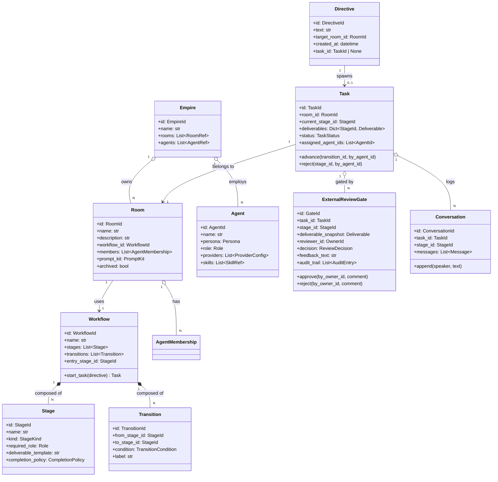

# bakufu ドメインモデル設計書

bakufu のドメインモデルを Aggregate / Entity / Value Object 単位で定義する。本書は実装の境界線（モジュール分割・トランザクション境界・整合性ルール）を凍結する真実源であり、ランタイムコードはここで定義された境界に従って配置される。

> **着想**: shikomi の dev-workflow 設計書と同じく、ドメイン設計をコード前に文章で固める。実装は本書の境界に従う。

## 設計指針

- **Domain-Driven Design**: 業務概念（Empire / Room / Agent / Workflow / ExternalReviewGate 等）をそのままドメインオブジェクトとして表現する。技術的詳細は infrastructure 層に閉じ込める
- **Aggregate Root のトランザクション境界**: 1 トランザクションで 1 Aggregate のみを更新。複数 Aggregate にまたがる整合性は Domain Event 経由で結果整合
- **依存方向**: domain → application → interfaces / infrastructure（外側が内側を知り、内側は外側を知らない）
- **不変条件は Aggregate Root が守る**: 状態遷移・参照整合性は Aggregate Root のメソッドで強制
- **Value Object は不変**: ID・列挙型・座標等は frozen dataclass / Pydantic v2 frozen model で表現

## ドメインの全体像



## Aggregate / Entity 詳細

### Empire（Aggregate Root、シングルトン）

| 属性 | 型 | 制約 | 意図 |
|----|----|----|----|
| `id` | `EmpireId`（UUID） | 不変 | bakufu インスタンスの一意識別 |
| `name` | `str` | 1〜80 文字 | 人間が認識する名前（例: "山田の幕府"） |
| `rooms` | `List[RoomRef]` | — | 編成された Room の参照（実体は別 Aggregate） |
| `agents` | `List[AgentRef]` | — | 採用された Agent の参照 |

**不変条件**:
- bakufu インスタンスにつき Empire は 1 つ（CEO = リポジトリオーナー）
- `rooms` / `agents` は参照のみ。実体は別 Aggregate なので Empire 経由での更新不可

**ふるまい**:
- `hire_agent(agent_data) -> AgentId`: Agent Aggregate を作成し、Empire の agents リストに追加
- `establish_room(room_data) -> RoomId`: Room Aggregate を作成し、Empire の rooms リストに追加
- `archive_room(room_id)`: Room を archived 状態に遷移。物理削除はしない（履歴保持）

### Room（Aggregate Root）

| 属性 | 型 | 制約 | 意図 |
|----|----|----|----|
| `id` | `RoomId`（UUID） | 不変 | Room の一意識別 |
| `name` | `str` | 1〜80 文字、Empire 内で一意 | 部屋名（例: "Vモデル開発室"、"アジャイル開発室"、"雑談部屋"） |
| `description` | `str` | 0〜500 文字 | 部屋の用途説明 |
| `workflow_id` | `WorkflowId` | 既存 Workflow を指す | 採用するワークフロー定義 |
| `members` | `List[AgentMembership]` | 同一 Agent の重複不可 | 採用された Agent と Role の対応 |
| `prompt_kit` | `PromptKit`（VO） | — | 部屋固有のシステムプロンプト（前置き） |
| `archived` | `bool` | デフォルト False | アーカイブ状態 |

**AgentMembership（Value Object）**:

| 属性 | 型 | 制約 |
|----|----|----|
| `agent_id` | `AgentId` | 既存 Agent を指す |
| `role` | `Role` | leader / developer / tester / reviewer / ux / security / discussant / writer 等 |
| `joined_at` | `datetime` | UTC |

**不変条件**:
- `workflow_id` は既存 Workflow を指す（参照整合性）
- `members` 内に同一 `agent_id` × 同一 `role` の重複なし
- `members` 内に少なくとも 1 名の `role == leader` の Agent が存在（Workflow が leader を要求する場合）

**ふるまい**:
- `add_member(agent_id, role)`: メンバー追加。`agent_id` の存在は application 層で検証
- `remove_member(agent_id, role)`: メンバー削除
- `update_prompt_kit(prompt_kit)`: プロンプト更新
- `archive()`: アーカイブ状態に遷移

### Workflow（Aggregate Root）

| 属性 | 型 | 制約 | 意図 |
|----|----|----|----|
| `id` | `WorkflowId`（UUID） | 不変 | Workflow の一意識別 |
| `name` | `str` | 1〜80 文字 | "V モデル開発フロー"、"アジャイル 1 週間スプリント" 等 |
| `stages` | `List[Stage]` | 1 件以上 | 工程ノード |
| `transitions` | `List[Transition]` | 0 件以上 | 工程間の遷移エッジ（DAG、差し戻しループ可） |
| `entry_stage_id` | `StageId` | `stages` 内に存在 | タスク開始時の初期 Stage |

**Stage（Entity within Workflow Aggregate）**:

| 属性 | 型 | 制約 |
|----|----|----|
| `id` | `StageId`（UUID） | 不変 |
| `name` | `str` | 1〜80 文字（例: "要求分析"、"基本設計"、"実装"、"外部レビュー"） |
| `kind` | `StageKind` | `WORK` / `INTERNAL_REVIEW` / `EXTERNAL_REVIEW` |
| `required_role` | `Role` | この Stage を担当する Role |
| `deliverable_template` | `str` | Markdown テンプレ（成果物の形式） |
| `completion_policy` | `CompletionPolicy` | 完了判定ロジック（Value Object、例: "approved by reviewer" / "all checklist items checked"） |
| `notify_channels` | `List[NotifyChannel]` | `EXTERNAL_REVIEW` のときのみ必須 | Discord / Slack / Email 等の通知先 |

**Transition（Entity within Workflow Aggregate）**:

| 属性 | 型 | 制約 |
|----|----|----|
| `id` | `TransitionId`（UUID） | 不変 |
| `from_stage_id` | `StageId` | `stages` 内に存在 |
| `to_stage_id` | `StageId` | `stages` 内に存在 |
| `condition` | `TransitionCondition` | `APPROVED` / `REJECTED` / `CONDITIONAL` / `TIMEOUT` |
| `label` | `str` | UI 表示ラベル（例: "差し戻し"、"次工程へ"） |

**不変条件**:
- 全 Stage は `entry_stage_id` から到達可能（孤立 Stage 禁止）
- 全 Transition の `from_stage_id` / `to_stage_id` は `stages` 内に存在
- 終端 Stage（外向き Transition なし）が 1 件以上存在
- `EXTERNAL_REVIEW` Stage は `notify_channels` を持つ
- 同じ `from_stage_id` × `condition` の Transition は重複しない（決定論的）

**ふるまい**:
- `add_stage(stage_data) -> StageId`
- `add_transition(transition_data) -> TransitionId`
- `remove_stage(stage_id)`: 関連 Transition も削除。entry_stage_id を指す Stage は削除不可
- `validate() -> None`: 不変条件チェック。違反時は `WorkflowInvariantViolation` を raise（Fail Fast）

### Agent（Aggregate Root）

| 属性 | 型 | 制約 | 意図 |
|----|----|----|----|
| `id` | `AgentId`（UUID） | 不変 | Agent の一意識別 |
| `name` | `str` | 1〜40 文字、Empire 内で一意 | 表示名 |
| `persona` | `Persona`（VO） | — | キャラクター設定（自然言語）、システムプロンプトに展開される |
| `role` | `Role` | — | 役割テンプレ（Room 採用時の既定値） |
| `providers` | `List[ProviderConfig]` | 1 件以上 | LLM プロバイダ設定（Claude Code / Codex / Gemini / OpenCode 等） |
| `skills` | `List[SkillRef]` | 0 件以上 | 添付スキル（Markdown プロンプト） |
| `archived` | `bool` | デフォルト False | アーカイブ状態 |

**ProviderConfig（Value Object）**:

| 属性 | 型 |
|----|----|
| `provider_kind` | `ProviderKind`（CLAUDE_CODE / CODEX / GEMINI / OPENCODE / KIMI / COPILOT 等） |
| `model` | `str`（例: "sonnet"、"opus"、"gpt-5-codex"） |
| `is_default` | `bool` |

**Persona（Value Object）**:

| 属性 | 型 |
|----|----|
| `display_name` | `str` |
| `archetype` | `str`（例: "イーロン・マスク風 CEO"） |
| `prompt_body` | `str`（Markdown、システムプロンプトに展開される自然言語） |

**不変条件**:
- `providers` のうち `is_default == True` は 1 件のみ
- `name` は Empire 内で一意（人間がチャネルで識別する基準）

### Task（Aggregate Root）

| 属性 | 型 | 制約 | 意図 |
|----|----|----|----|
| `id` | `TaskId`（UUID） | 不変 | Task の一意識別 |
| `room_id` | `RoomId` | 既存 Room を指す | 所属する Room |
| `directive_id` | `DirectiveId` | 既存 Directive を指す | 起点となった指令 |
| `current_stage_id` | `StageId` | Room の Workflow 内の Stage | 現在進行中の工程 |
| `deliverables` | `Dict[StageId, Deliverable]` | — | Stage ごとの成果物スナップショット |
| `status` | `TaskStatus` | PENDING / IN_PROGRESS / AWAITING_EXTERNAL_REVIEW / DONE / CANCELLED | 全体状態 |
| `assigned_agent_ids` | `List[AgentId]` | Room の members 内 | 現 Stage に割当中の Agent |
| `created_at` / `updated_at` | `datetime` | UTC | 監査用 |

**Deliverable（Value Object）**:

| 属性 | 型 |
|----|----|
| `stage_id` | `StageId` |
| `body_markdown` | `str` |
| `attachments` | `List[Attachment]` |
| `committed_by` | `AgentId` |
| `committed_at` | `datetime` |

**TaskStatus 遷移**:

```
PENDING
   ↓ (assign agents)
IN_PROGRESS
   ↓ (Stage が EXTERNAL_REVIEW に到達)
AWAITING_EXTERNAL_REVIEW
   ↓ (Gate APPROVED)
IN_PROGRESS（次 Stage へ）
   ↓ (終端 Stage に到達 + APPROVED)
DONE

任意時点 → CANCELLED（CEO 判断）
AWAITING_EXTERNAL_REVIEW + REJECTED → IN_PROGRESS（差し戻し先 Stage へ）
```

**不変条件**:
- `current_stage_id` は Room の Workflow 内の Stage を指す
- `assigned_agent_ids` は Room の members に含まれる
- `status == DONE` の Task は更新不可

**ふるまい**:
- `assign(agent_ids)`: Agent を current_stage に割当
- `commit_deliverable(stage_id, deliverable, by_agent_id)`: 成果物登録
- `request_external_review() -> ExternalReviewGate`: 外部レビューゲートを生成（別 Aggregate）
- `advance(transition_id, by_owner_id)`: Stage を進める（Transition 経由）
- `cancel(by_owner_id, reason)`: 中止

### Directive（Aggregate Root）

| 属性 | 型 | 制約 | 意図 |
|----|----|----|----|
| `id` | `DirectiveId`（UUID） | 不変 | 指令の一意識別 |
| `text` | `str` | 1〜10000 文字 | CEO directive 本文（`$` プレフィックスから始まる） |
| `target_room_id` | `RoomId` | 既存 Room | 委譲先の部屋 |
| `created_at` | `datetime` | UTC | 発行時刻 |
| `task_id` | `TaskId | None` | — | 生成された Task（未着手なら None） |

**ふるまい**:
- `spawn_task() -> Task`: 委譲先 Room の Workflow から Task を生成

### ExternalReviewGate（独立 Aggregate Root）

| 属性 | 型 | 制約 | 意図 |
|----|----|----|----|
| `id` | `GateId`（UUID） | 不変 | Gate の一意識別 |
| `task_id` | `TaskId` | 既存 Task | 対象タスク |
| `stage_id` | `StageId` | EXTERNAL_REVIEW Stage | 対象工程 |
| `deliverable_snapshot` | `Deliverable`（VO） | — | レビュー対象の成果物（凍結） |
| `reviewer_id` | `OwnerId` | — | 人間レビュワー（既定は CEO） |
| `decision` | `ReviewDecision` | PENDING / APPROVED / REJECTED | 判断結果 |
| `feedback_text` | `str` | 0〜10000 文字 | 差し戻し理由・承認コメント |
| `audit_trail` | `List[AuditEntry]` | — | 誰がいつ何を見たかの監査ログ |
| `created_at` / `decided_at` | `datetime` | UTC | 監査用 |

**設計上の重要ポイント**: ExternalReviewGate は Stage の属性ではなく **独立した Aggregate**。理由:

- **エンティティ寿命が Stage と一致しない**: 差し戻し後も履歴を保持する必要がある（複数ラウンド可）
- **トランザクション境界が異なる**: Task の状態遷移と Gate の判断は別の人間（Agent vs CEO）が異なるタイミングで行う
- **AI 協業による品質向上を、人間チェックポイントで担保**するという bakufu の核心要件をモデル上で明示

**不変条件**:
- `decision == APPROVED` または `decision == REJECTED` への遷移は 1 回限り（不変）
- `decided_at` は `decision != PENDING` 時のみ非 None
- `deliverable_snapshot` は Gate 生成時に凍結、以後不変

**ふるまい**:
- `approve(by_owner_id, comment)`: PENDING → APPROVED、Task に `advance` を要求するイベント発火
- `reject(by_owner_id, comment)`: PENDING → REJECTED、Task に `advance(transition_id=REJECTED)` を要求するイベント発火
- `record_view(by_owner_id, viewed_at)`: audit_trail に追加（閲覧記録）

### Conversation（Entity、Task に従属）

| 属性 | 型 | 制約 | 意図 |
|----|----|----|----|
| `id` | `ConversationId`（UUID） | 不変 | 一意識別 |
| `task_id` | `TaskId` | — | 所属タスク |
| `stage_id` | `StageId` | — | 所属工程 |
| `messages` | `List[Message]` | 時系列順 | Agent 間の対話ログ |

**Message（Value Object）**:

| 属性 | 型 |
|----|----|
| `id` | `MessageId` |
| `speaker_kind` | `SpeakerKind`（AGENT / OWNER / SYSTEM） |
| `speaker_id` | `AgentId | OwnerId | None` |
| `body_markdown` | `str` |
| `timestamp` | `datetime` |

ai-team の「チャネル」概念に相当。Web UI では Room の対話空間として表示される。

## Domain Event 一覧

| イベント | 発火元 | 受け手 / 効果 |
|---------|------|------------|
| `DirectiveIssued` | Directive 作成時 | Task 生成（application 層） |
| `TaskAssigned` | Task.assign() | Agent 通知、UI 更新 |
| `DeliverableCommitted` | Task.commit_deliverable() | 次 Stage の自動開始判定 |
| `ExternalReviewRequested` | Task.request_external_review() | ExternalReviewGate 生成、reviewer 通知（Discord/Slack） |
| `ExternalReviewApproved` | Gate.approve() | Task.advance() |
| `ExternalReviewRejected` | Gate.reject() | Task.advance(transition_id=REJECTED で差し戻し) |
| `TaskCompleted` | Task が終端 Stage で APPROVED | Empire 全体への通知、CEO ダッシュボード更新 |
| `TaskCancelled` | Task.cancel() | 関連 Gate を CANCELLED 化 |

イベントは **同期メソッド呼び出し**ではなく、application 層の Use Case が次の Aggregate を更新する形で実現する（複数 Aggregate にまたがる更新は結果整合）。

## ID / 列挙型 / 主要 Value Object

| 名前 | 種別 | 値 |
|----|----|----|
| `EmpireId` / `RoomId` / `WorkflowId` / `StageId` / `TransitionId` / `AgentId` / `TaskId` / `DirectiveId` / `GateId` / `ConversationId` / `MessageId` / `OwnerId` | UUID（VO） | UUIDv4 |
| `StageKind` | enum | `WORK` / `INTERNAL_REVIEW` / `EXTERNAL_REVIEW` |
| `TransitionCondition` | enum | `APPROVED` / `REJECTED` / `CONDITIONAL` / `TIMEOUT` |
| `Role` | enum | `LEADER` / `DEVELOPER` / `TESTER` / `REVIEWER` / `UX` / `SECURITY` / `ASSISTANT` / `DISCUSSANT` / `WRITER` / `SITE_ADMIN` |
| `TaskStatus` | enum | `PENDING` / `IN_PROGRESS` / `AWAITING_EXTERNAL_REVIEW` / `DONE` / `CANCELLED` |
| `ReviewDecision` | enum | `PENDING` / `APPROVED` / `REJECTED` |
| `ProviderKind` | enum | `CLAUDE_CODE` / `CODEX` / `GEMINI` / `OPENCODE` / `KIMI` / `COPILOT` |
| `SpeakerKind` | enum | `AGENT` / `OWNER` / `SYSTEM` |

## モジュール配置（提案）

```
backend/src/bakufu/
├── domain/                      # ドメイン層（外側を知らない）
│   ├── empire.py                # Empire Aggregate
│   ├── room.py                  # Room Aggregate
│   ├── workflow.py              # Workflow Aggregate (Stage / Transition 含む)
│   ├── agent.py                 # Agent Aggregate
│   ├── task.py                  # Task Aggregate
│   ├── directive.py             # Directive Aggregate
│   ├── external_review.py       # ExternalReviewGate Aggregate
│   ├── conversation.py          # Conversation Entity
│   ├── value_objects.py         # 列挙型 / Value Object 共通
│   ├── events.py                # Domain Event
│   └── exceptions.py            # ドメイン例外
├── application/                 # ユースケース層
│   ├── empire_service.py
│   ├── room_service.py
│   ├── workflow_service.py
│   ├── agent_service.py
│   ├── task_service.py
│   ├── external_review_service.py
│   └── ports/                   # ポート（Repository / LLMProvider 等の抽象）
│       ├── repositories.py
│       ├── llm_provider.py
│       └── notifier.py
├── infrastructure/              # 外部接続層
│   ├── persistence/
│   │   ├── sqlite/              # SQLAlchemy mappers / repositories
│   │   └── memory/              # テスト用インメモリ Repository
│   ├── llm/
│   │   ├── claude_code_client.py    # ai-team から切り出し
│   │   ├── codex_cli_client.py
│   │   ├── gemini_client.py
│   │   └── anthropic_api_client.py
│   └── notifier/
│       ├── discord.py
│       └── slack.py
└── interfaces/                  # 入出力境界
    ├── http/                    # FastAPI router
    │   ├── empire.py
    │   ├── room.py
    │   ├── workflow.py
    │   ├── agent.py
    │   ├── task.py
    │   └── external_review.py
    └── ws/                      # WebSocket（リアルタイム同期）
        └── event_stream.py
```

依存方向: `interfaces` → `application` → `domain` ← `infrastructure`（DI で注入）

## トランザクション境界の実例

### CEO directive 受付 → Task 生成

1. **Tx-1**: Directive Aggregate を保存
2. （Domain Event `DirectiveIssued` 発火）
3. **Tx-2**: Workflow を読み、Task Aggregate を生成して保存
4. （Domain Event `TaskAssigned` 発火）
5. **Tx-3**: Notifier 経由で Agent 通知（Discord / Slack）— 失敗してもリトライ可、結果整合

### Stage 完了 → 外部レビュー要求

1. **Tx-1**: Task.commit_deliverable() で Deliverable 登録
2. （Stage が EXTERNAL_REVIEW なら）
3. **Tx-2**: Task.request_external_review() で ExternalReviewGate を生成保存（status を AWAITING_EXTERNAL_REVIEW に更新）
4. （Domain Event `ExternalReviewRequested` 発火）
5. **Tx-3**: Notifier 経由で reviewer 通知 — 失敗してもリトライ可

### 外部レビュー承認 → 次 Stage へ

1. **Tx-1**: Gate.approve() で decision を APPROVED に
2. （Domain Event `ExternalReviewApproved` 発火）
3. **Tx-2**: Task.advance() で current_stage_id を遷移先に更新

各 Tx は単一 Aggregate の更新に閉じる。**複数 Aggregate を 1 Tx で更新しない**。

## レンダリング例（V モデル開発室）

```
Workflow: V モデル開発フロー
├── Stage: 要求分析 (WORK, REQUIRED_ROLE=LEADER)
├── Stage: 要求分析レビュー (EXTERNAL_REVIEW, notify=[Discord])
├── Stage: 要件定義 (WORK, REQUIRED_ROLE=LEADER+UX)
├── Stage: 要件定義レビュー (EXTERNAL_REVIEW, notify=[Discord])
├── Stage: 基本設計 (WORK, REQUIRED_ROLE=DEVELOPER+UX)
├── Stage: 基本設計レビュー (EXTERNAL_REVIEW, notify=[Discord])
├── Stage: 詳細設計 (WORK, REQUIRED_ROLE=DEVELOPER)
├── Stage: 詳細設計レビュー (EXTERNAL_REVIEW)
├── Stage: 実装 (WORK, REQUIRED_ROLE=DEVELOPER)
├── Stage: ユニットテスト (WORK, REQUIRED_ROLE=TESTER)
├── Stage: 結合テスト (WORK, REQUIRED_ROLE=TESTER)
├── Stage: E2E テスト (WORK, REQUIRED_ROLE=TESTER)
└── Stage: 完了レビュー (EXTERNAL_REVIEW, notify=[Discord])

Transitions:
- 要求分析 ─APPROVED→ 要件定義
- 要求分析 ─REJECTED→ 要求分析（自己ループで再作成）
- 要件定義 ─APPROVED→ 基本設計
- 要件定義 ─REJECTED→ 要求分析（差し戻し 1 段）
- 基本設計 ─REJECTED→ 要件定義（差し戻し 1 段）
- ...
- 完了レビュー ─APPROVED→ （終端、Task DONE）
- 完了レビュー ─REJECTED→ 該当工程（差し戻し）
```

DAG なので任意の差し戻し経路を定義可能。UI 側は `react-flow` 等でビジュアル編集できる想定（MVP では JSON 編集 / プリセットから選択で OK）。

## 残課題（後続 Issue で扱う）

- **永続化スキーマ詳細**: SQLAlchemy mapper / migration スクリプト
- **WebSocket イベント仕様**: クライアント側のリアルタイム反映プロトコル
- **Agent CLI セッション継続**: ai-team の `claude_code_client.py` 移植
- **権限モデル**: マルチユーザー化時の RBAC（MVP はシングルユーザー前提、YAGNI）
- **メッセンジャー多対応**: Discord 以外（Slack/Telegram/iMessage 等）
- **メッセージ検索**: Conversation の全文検索（インデックス設計）
