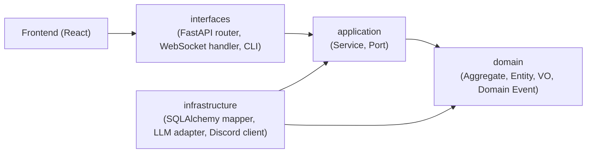

# システム全体アーキテクチャ

bakufu のシステム構造を Clean Architecture / DDD の観点で俯瞰する。詳細は [`domain-model.md`](domain-model.md) / [`tech-stack.md`](tech-stack.md) / [`threat-model.md`](threat-model.md) を参照。

## レイヤー構成

bakufu Backend は Clean Architecture の依存方向（外側 → 内側）に従う:

依存方向: `interfaces → application → domain ← infrastructure`

- **domain** は何にも依存しない（純粋な業務ロジック）
- **application** は domain だけに依存（Port パターン）
- **infrastructure** は domain と application を実装する（依存性逆転）
- **interfaces** は application を呼び出す

## ドメインモデル概観

bakufu の中核 Aggregate:

| Aggregate | 役割 | 詳細 |
|---|---|---|
| Empire | 最上位コンテナ（CEO の組織） | [`domain-model.md §Empire`](domain-model.md) |
| Room | 部屋（業務単位） | [`domain-model.md §Room`](domain-model.md) |
| Workflow | 業務フロー（Stage の DAG） | [`domain-model.md §Workflow`](domain-model.md) |
| Agent | AI エージェント | [`domain-model.md §Agent`](domain-model.md) |
| Task | 業務タスク + 状態遷移 | [`domain-model.md §Task`](domain-model.md) |
| ExternalReviewGate | 外部レビュー（人間承認） | [`domain-model.md §ExternalReviewGate`](domain-model.md) |

詳細は [`domain-model.md`](domain-model.md) を参照。

## 採用技術概観

| レイヤー | 主要技術 | 詳細 |
|---|---|---|
| Frontend | React 19 / Vite / Tailwind | [`tech-stack.md`](tech-stack.md) |
| Backend | FastAPI / SQLAlchemy 2.x async / Pydantic v2 | 同上 |
| 永続化 | SQLite (WAL mode) | 同上 |
| LLM | Claude Code CLI (subprocess) | 同上 |
| 通知 | Discord Bot | 同上 |

詳細は [`tech-stack.md`](tech-stack.md) を参照。

## 脅威モデル概観

主要な攻撃面と対策:

| 攻撃面 | 対策 | 詳細 |
|---|---|---|
| LLM 出力経由のシークレット流入 | 永続化前 masking gateway | [`threat-model.md`](threat-model.md) |
| 添付ファイル経由の XSS / パストラバーサル | filename サニタイズ + MIME ホワイトリスト | 同上 |
| 外部 IP からの不正接続 | `127.0.0.1:8000` バインド + reverse proxy 制御 | 同上 |

詳細は [`threat-model.md`](threat-model.md) を参照。

## 関連

- [`domain-model.md`](domain-model.md) — DDD ドメインモデルの詳細
- [`tech-stack.md`](tech-stack.md) — 採用技術と根拠
- [`threat-model.md`](threat-model.md) — 脅威モデル / OWASP Top 10
- [`../requirements/system-context.md`](../requirements/system-context.md) — システムコンテキスト図（要件定義レベル、本書とは粒度が異なる）
