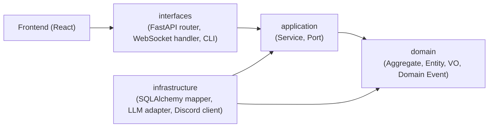

# システム全体アーキテクチャ

bakufu のシステム構造を Clean Architecture / DDD の観点で俯瞰する。詳細は [`domain-model.md`](domain-model.md) / [`tech-stack.md`](tech-stack.md) / [`threat-model.md`](threat-model.md) を参照。

## レイヤー構成

bakufu Backend は Clean Architecture の依存方向（外側 → 内側）に従う:



依存方向: `interfaces → application → domain ← infrastructure`

- **domain** は何にも依存しない（純粋な業務ロジック）
- **application** は domain だけに依存（Port パターン）
- **infrastructure** は domain と application を実装する（依存性逆転）
- **interfaces** は application を呼び出す

### interfaces レイヤー詳細（M3 http-api-foundation で確定）

`backend/src/bakufu/interfaces/` は外部からの入力を application 層に橋渡しするレイヤー。FastAPI router / WebSocket handler / Admin CLI が含まれる。

```
backend/src/bakufu/interfaces/
└── http/
    ├── app.py                  # FastAPI app 初期化・lifespan・CORS・error handler 登録
    ├── connection_manager.py   # ConnectionManager（接続プール管理・ブロードキャスト）+ make_ws_bridge_handler()（M4 websocket-broadcast Issue #159）
    ├── dependencies.py         # get_session() / get_*_repository() / get_*_service() / get_connection_manager() DI ファクトリ
    ├── error_handlers.py       # 例外 → {"error": {"code": ..., "message": ...}} ErrorResponse 変換
    ├── schemas/
    │   └── common.py           # ErrorResponse / PaginatedResponse[T] 汎用 Pydantic モデル
    └── routers/
        ├── health.py           # GET /health（M3 http-api-foundation）
        ├── empire.py           # Empire CRUD（M3 後続 Issue B）
        ├── room.py             # Room CRUD（M3 後続 Issue C）
        ├── workflow.py         # Workflow CRUD（M3 後続 Issue D）
        ├── agent.py            # Agent CRUD（M3 後続 Issue E）
        ├── task.py             # Task CRUD（M3 後続 Issue F）
        ├── external_review_gate.py  # ExternalReviewGate CRUD（M3 後続 Issue G）
        └── ws.py               # GET /ws WebSocket endpoint（M4 websocket-broadcast Issue #159）
```

interfaces レイヤーの規律:
- **domain 層への直接 import 禁止**: interfaces は application/services/ 経由でのみ domain を操作する（依存方向の物理的保証）
- **エラーハンドリングは境界のみ**: `error_handlers.py` が唯一の例外キャッチポイント。router 内で try/except を書かない（ただし `ws.py` の `WebSocketDisconnect` catch は切断処理のための正常フロー扱い）
- **エラーレスポンス形式の統一**: 全 REST エンドポイントが `{"error": {"code": str, "message": str}}` 形式を使う（feature-spec.md §7 R1-1 で凍結）
- **DI ファクトリ経由のセッション管理**: `get_session()` が lifespan で初期化した `async_sessionmaker` からセッションを yield し、リクエスト完了後に close する
- **WebSocket handler の切断処理**: `ws.py` は `WebSocketDisconnect` を `ConnectionManager` に委譲し、router 内で接続管理の詳細を持たない。切断は他クライアントへのブロードキャストをブロックしない（feature-spec.md §7 R1-5）
- **ConnectionManager の責務**: `ConnectionManager` は接続プール管理（connect/disconnect）とブロードキャストのみを担う。業務ロジックを含まない。`make_ws_bridge_handler(cm)` が EventBus handler を生成し `ConnectionManager` をキャプチャする。Router は `ConnectionManager` を DI 注入（`get_connection_manager()`）で受け取り、EventBus に直接依存しない

### application レイヤー詳細（M3 http-api-foundation で骨格確定）

`backend/src/bakufu/application/services/` は interfaces 層からの呼び出しを domain 操作に変換する thin ファサード層。

```
backend/src/bakufu/application/
├── ports/
│   ├── empire_repository.py                    # EmpireRepositoryPort
│   ├── room_repository.py                      # RoomRepositoryPort
│   ├── workflow_repository.py                  # WorkflowRepositoryPort
│   ├── agent_repository.py                     # AgentRepositoryPort
│   ├── task_repository.py                      # TaskRepositoryPort
│   ├── directive_repository.py                 # DirectiveRepositoryPort
│   ├── external_review_gate_repository.py      # ExternalReviewGateRepositoryPort
│   ├── internal_review_gate_repository.py      # InternalReviewGateRepositoryPort（M5-B #164）
│   ├── event_bus.py                            # EventBusPort（M4 websocket-broadcast Issue #158）
│   ├── llm_provider_port.py                    # LLMProviderPort（M5 stage-executor Issue #163）
│   └── internal_review_gate_executor_port.py   # InternalReviewGateExecutorPort（M5-A #163 定義、M5-B #164 実装）
└── services/
    ├── empire_service.py               # EmpireService（M3 骨格、M3-B で肉付け）
    ├── room_service.py                 # RoomService（M3 骨格、M3-C で肉付け）
    ├── workflow_service.py             # WorkflowService（M3 骨格、M3-D で肉付け）
    ├── agent_service.py                # AgentService（M3 骨格、M3-E で肉付け）
    ├── task_service.py                 # TaskService（M3 骨格、M3-F で肉付け、M4 で event publish 追加）
    ├── external_review_gate_service.py # ExternalReviewGateService（M3 骨格、M3-G で肉付け、M4 で event publish 追加）
    ├── directive_service.py            # DirectiveService（M4 で event publish 追加）
    ├── internal_review_service.py      # InternalReviewService（M5-B #164）
    │                                   #   Gate CRUD / Verdict 集約 / ALL_APPROVED→ExternalReviewGate / REJECTED→Task差し戻し
    │                                   #   Workflow DAG traversal で前段 WORK Stage ID を算出（ジェンセン決定 ③）
    └── stage_executor_service.py       # StageExecutorService（M5-A stage-executor Issue #163）
                                        #   StageKind dispatch（WORK/INTERNAL_REVIEW/EXTERNAL_REVIEW）
                                        #   LLMProviderError 5 分類 → Task.block()
                                        #   retry_blocked_task() エントリポイント（M5-C #165 が利用）
```

StageExecutorService / InternalReviewService 追加に伴う infrastructure レイヤーへの追加（M5-A / M5-B）:

```
backend/src/bakufu/infrastructure/
├── worker/
│   └── stage_worker.py   # StageWorker（asyncio.Queue + asyncio.Semaphore、Bootstrap Stage 6.5 で起動）
└── reviewers/             # M5-B #164: InternalReviewGate 実行インフラ
    ├── __init__.py
    ├── internal_review_gate_executor.py  # InternalReviewGateExecutorPort 実装
    │                                     #   asyncio.gather() で全 GateRole 並列 LLM 実行
    │                                     #   session_id = 各 GateRole ごとの独立 UUID v4（ジェンセン決定 ②）
    │                                     #   _parse_verdict_decision(): ambiguous → REJECTED（R1-F）
    └── prompts/
        ├── __init__.py
        └── default.py                    # 汎用 GateRole プロンプトテンプレート（role 別カスタム拡張可能）
```

application レイヤーの規律:
- **Port パターン**: 各 Service は Repository Port（インターフェース型）を `__init__` で受け取る。`AsyncSession` を直接参照しない
- **EventBus Port パターン**: M4 以降、状態変化操作を持つ Service は `EventBusPort` を `__init__` で受け取り、操作成功後に `await event_bus.publish(event)` を呼ぶ（[`docs/features/websocket-broadcast/domain/basic-design.md §REQ-WSB-008`](../features/websocket-broadcast/domain/basic-design.md)）
- **audit_log 記録責務**: 各 Service が業務操作（Empire 作成・hire_agent 等）完了時に audit_log に記録する（`threat-model.md §A09` の申し送り事項）
- **薄い変換のみ**: domain の業務ロジックを application 層で複製しない

## ドメインモデル概観

bakufu の中核 Aggregate:

| Aggregate | 役割 | 詳細 |
|---|---|---|
| Empire | 最上位コンテナ（CEO の組織） | [`domain-model.md §Empire`](domain-model.md) |
| Room | 部屋（業務単位） | [`domain-model.md §Room`](domain-model.md) |
| Workflow | 業務フロー（Stage の DAG） | [`domain-model.md §Workflow`](domain-model.md) |
| Agent | AI エージェント | [`domain-model.md §Agent`](domain-model.md) |
| Task | 業務タスク + 状態遷移 | [`domain-model.md §Task`](domain-model.md) |
| InternalReviewGate | 内部レビュー（AI エージェント並列審査、ExternalReviewGate 前段の品質保証）| [`domain-model.md §InternalReviewGate`](domain-model.md) |
| ExternalReviewGate | 外部レビュー（人間承認、InternalReviewGate 全合格後に生成）| [`domain-model.md §ExternalReviewGate`](domain-model.md) |

詳細は [`domain-model.md`](domain-model.md) を参照。

## 採用技術概観

| レイヤー | 主要技術 | 詳細 |
|---|---|---|
| Frontend | React 19 / Vite / Tailwind | [`tech-stack.md`](tech-stack.md) |
| Backend | FastAPI / SQLAlchemy 2.x async / Pydantic v2 | 同上 |
| 永続化 | SQLite (WAL mode) | 同上 |
| LLM | Claude Code CLI (subprocess) | 同上 |
| リアルタイム通信 | FastAPI WebSocket + InMemoryEventBus | 同上 |
| 通知 | Discord Bot | 同上 |

詳細は [`tech-stack.md`](tech-stack.md) を参照。

## 脅威モデル概観

主要な攻撃面と対策:

| 攻撃面 | 対策 | 詳細 |
|---|---|---|
| LLM 出力経由のシークレット流入 | 永続化前 masking gateway | [`threat-model.md`](threat-model.md) |
| 添付ファイル経由の XSS / パストラバーサル | filename サニタイズ + MIME ホワイトリスト | 同上 |
| 外部 IP からの不正接続 | `127.0.0.1:8000` バインド + reverse proxy 制御 | 同上 |

詳細は [`threat-model.md`](threat-model.md) を参照。

## 関連

- [`domain-model.md`](domain-model.md) — DDD ドメインモデルの詳細
- [`tech-stack.md`](tech-stack.md) — 採用技術と根拠
- [`threat-model.md`](threat-model.md) — 脅威モデル / OWASP Top 10
- [`../requirements/system-context.md`](../requirements/system-context.md) — システムコンテキスト図（要件定義レベル、本書とは粒度が異なる）
