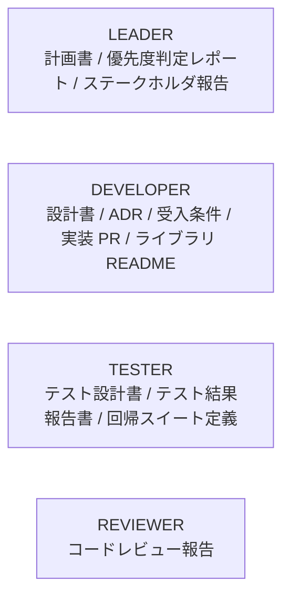
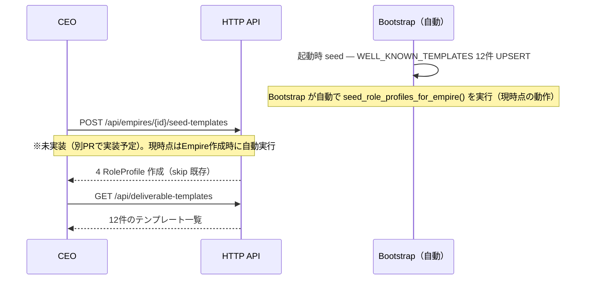
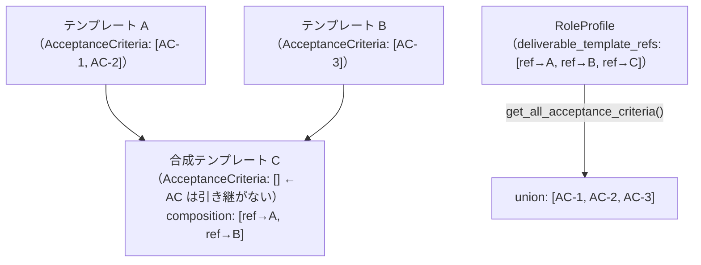

# DeliverableTemplate 設計指針 — CEO 向け利用ガイド

> 対象読者: bakufu を使って AI 協業プロジェクトを運営する CEO（Empire オーナー）
> 関連: [`docs/features/deliverable-template/feature-spec.md`](../../features/deliverable-template/feature-spec.md) / [`docs/design/domain-model/aggregates.md`](../domain-model/aggregates.md) §DeliverableTemplate
> 実装: [`backend/src/bakufu/application/services/template_library/definitions.py`](../../../backend/src/bakufu/application/services/template_library/definitions.py)

## このドキュメントの役割

DeliverableTemplate は「AI エージェントが作るべき成果物の定義」を業務概念として表現する Aggregate だ。本書は CEO が DeliverableTemplate を **設計・カスタマイズ・バージョン管理・構成合成**する際の設計指針を凍結する。

「何をどう作ればいいか」の暗黙知を明文化し、bakufu の核心コンセプトである **「設計を真実とする」** を実践するための運用ガイドとして機能する。

---

## 1. Vモデルプリセット — ai-team 標準テンプレート群

bakufu 起動時に自動で 12 件の既定 DeliverableTemplate がロードされる（startup upsert / `template-library` sub-feature）。これらは ai-team の **5 ロール固定運用で蓄積された暗黙知を Bakufu Method に移植**したものだ。

### 1.1 WELL_KNOWN_TEMPLATES（12 件）

| slug | ロール | テンプレート名 | 説明 |
|---|---|---|---|
| `leader-plan` | LEADER | 計画書 | タスクの背景・目標・スコープ・マイルストーンを記述する計画文書 |
| `leader-priority` | LEADER | 優先度判定レポート | 複数候補の優先順位を比較根拠とともに記述するレポート |
| `leader-stakeholder` | LEADER | ステークホルダ報告 | 進捗・リスク・決定事項を人間向けに要約する報告文書 |
| `dev-design` | DEVELOPER | 設計書 | システム設計・データモデル・コンポーネント構成を記述する設計文書 |
| `dev-adr` | DEVELOPER | ADR | Architecture Decision Record — 決定の背景・選択肢・根拠を記録 |
| `dev-acceptance` | DEVELOPER | 受入条件 | 機能の受入基準（Given / When / Then 形式推奨）を記述する文書 |
| `dev-impl-pr` | DEVELOPER | 実装 PR | Pull Request の概要・変更点・テスト方法・レビュー観点を記述 |
| `dev-lib-readme` | DEVELOPER | ライブラリ README | ライブラリの目的・インストール・使用例・API リファレンスを記述 |
| `tester-testdesign` | TESTER | テスト設計書 | テスト戦略・テストケース（TC-XX-NNN）・カバレッジ方針を記述 |
| `tester-report` | TESTER | テスト結果報告書 | テスト実施結果・バグ件数・品質評価を記述する報告文書 |
| `tester-regression` | TESTER | 回帰スイート定義 | 回帰テスト対象範囲・実行条件・合否基準を記述する文書 |
| `reviewer-review` | REVIEWER | コードレビュー報告 | コード品質・設計上の問題・改善提案を構造化して記述する報告 |

**全件共通の属性**: `type=MARKDOWN` / `version=1.0.0` / `acceptance_criteria=[]`（初期値）/ `composition=[]`（単独テンプレート）

**UUID 決定方式**: `UUID5(BAKUFU_TEMPLATE_NS, slug)` — slug が変わらない限り、再起動・再デプロイで同一 UUID が保証される（冪等性）

### 1.2 PRESET_ROLE_TEMPLATE_MAP（4 ロールのプリセット RoleProfile）

`seed_role_profiles_for_empire(empire_id)` を呼び出すと、Empire に以下のプリセット RoleProfile が作成される。



各参照の `minimum_version = 1.0.0`。**既に RoleProfile が存在する Role は skip（上書きしない）**。CEO が意図的に設定した内容は保護される。

---

## 2. プリセットの活用方法

### 2.1 そのまま使う（推奨スタート）

bakufu 起動直後から WELL_KNOWN_TEMPLATES の 12 件が HTTP API（`GET /api/deliverable-templates`）で取得可能。RoleProfile のプリセットも `seed_role_profiles_for_empire()` で即時適用できる。

**適用フロー**:



### 2.2 カスタマイズする（COPY 推奨）

プリセットテンプレートを直接編集することは **推奨しない**。理由:

- bakufu のバージョンアップ時に起動 UPSERT で definitions.py の内容が上書きされる（仕様：§確定 D）
- `acceptance_criteria` を手動追加しても、次回起動時に空になる（MVP 範囲の既知動作）

**推奨する手順**:
1. `GET /api/deliverable-templates/{preset_id}` でプリセットの内容を取得
2. `POST /api/deliverable-templates` で **別 UUID の新規テンプレートを作成**（`name` を変えて保存）
3. RoleProfile の `deliverable_template_refs` を新規テンプレートに差し替え

これにより、bakufu アップデート後もカスタマイズ内容が保持される。

### 2.3 独自テンプレートを作る（HTTP API）

CEO が定義した独自テンプレートは `POST /api/deliverable-templates` で作成する。プリセットとは独立した UUID を持ち、bakufu のバージョンアップによって影響を受けない。

| 属性 | 設計指針 |
|---|---|
| `name` | 役割・目的が一読で分かる名称（例: 「V モデル設計書 v2」「スプリントレビュー報告」）|
| `type` | Markdown 自然言語の場合は `MARKDOWN`。JSON Schema 形式の場合は `JSON_SCHEMA`（構文検証あり）|
| `schema` | `type=MARKDOWN`: ガイドライン文字列。`type=JSON_SCHEMA`: 有効な JSON Schema（不正な場合は Fail Fast）|
| `version` | 初版は `1.0.0`。SemVer ルールに従って更新する（§3 参照）|
| `acceptance_criteria` | AI が合否を判定する基準。`required=true` の基準が 1 件でも FAILED で全体 FAILED になる|

---

## 3. バージョン管理指針（SemVer）

DeliverableTemplate はバージョン管理される。Room 作成時にテンプレートへの参照（`DeliverableTemplateRef`）がスナップショットとして記録され、以降のテンプレート変更によって過去の Room は影響を受けない。

### 3.1 MAJOR / MINOR / PATCH の意味

| バージョン変更 | 業務的意味 | 例 |
|---|---|---|
| `PATCH` (+0.0.1) | 誤字修正・説明の補足（意味は変わらない）| `1.0.0 → 1.0.1` |
| `MINOR` (+0.1.0) | AcceptanceCriterion 追加・schema 拡充（後方互換あり）| `1.0.0 → 1.1.0` |
| `MAJOR` (+1.0.0) | スキーマ構造の破壊的変更・TemplateType 変更 | `1.x.x → 2.0.0` |

### 3.2 minimum_version の解釈（業務ルール R1-A）

`DeliverableTemplateRef.minimum_version` は「**この version 以上の同 MAJOR 系列を受け入れる**」を意味する。

```
minimum_version = 1.0.0 の場合:
  ✅ v1.0.0  — 同一 (exact)
  ✅ v1.1.0  — MINOR up (後方互換)
  ✅ v1.2.3  — MINOR up + PATCH up
  ❌ v2.0.0  — MAJOR 変更（後方互換なし）
  ❌ v0.9.0  — minimum より古い
```

### 3.3 バージョンアップのタイミング

| 状況 | 推奨アクション |
|---|---|
| 独自テンプレートに AcceptanceCriterion を追加したい | `create_new_version(minor_bump)` → MINOR up（1.0.0 → 1.1.0） |
| schema の大幅な再設計が必要 | `create_new_version(major_bump)` → MAJOR up（1.x.x → 2.0.0）+ 既存 Room への影響分析 |
| 単純な誤字修正 | `create_new_version(patch_bump)` → PATCH up（既存 Room は自動で最新 PATCH を使用可能） |
| プリセットを更新したい | **COPY して独自テンプレートを作成**（プリセット直接変更は再起動で上書き）|

---

## 4. composition 設計の指針

複数のテンプレートを 1 つに合成したい場合、`composition` フィールドを使う。

### 4.1 composition の目的と制約

`composition` は「このテンプレートを使う際に一緒に参照すべきテンプレート群への参照リスト」を宣言する。**AcceptanceCriteria は composition で引き継がれない**（業務ルール R1-E）。AcceptanceCriteria の union は `RoleProfile.get_all_acceptance_criteria` の責務。



### 4.2 DAG 制約（循環参照禁止）

composition の参照グラフは **有向非循環グラフ（DAG）** でなければならない。

- 自己参照禁止: テンプレート A の `composition` に A 自身を指定してはならない（Aggregate 構築時 Fail Fast）
- 推移的循環禁止: A → B → A のような間接循環（application 層が検証責務）

**良い例**: `C[計画書+ADR]` → `composition: [ref→leader-plan, ref→dev-adr]`
**悪い例**: `D` → `composition: [ref→D]`（自己参照 → Fail Fast）

### 4.3 AcceptanceCriteria の union と required 優先

`RoleProfile.get_all_acceptance_criteria` は `deliverable_template_refs` の順番で AcceptanceCriteria を収集し:

1. `required=True` の基準を先頭グループに配置
2. `required=False` の基準を後続グループに配置
3. 同一 `id` は最初の出現を保持（重複は除外、エラーにしない）

AI は `required=True` の全基準が PASSED の場合のみ全体 PASSED と判定する。

---

## 5. テンプレート追加・変更手順

### 5.1 プリセット（WELL_KNOWN_TEMPLATES）への追加

プリセットへの追加は **bakufu コードベースの変更**が必要。PR レビューで人間の承認を得ること。

| ステップ | 内容 |
|---|---|
| 1. slug を決定 | `{role}-{purpose}` 形式（例: `leader-kickoff`）。既存 slug と衝突しないこと |
| 2. `definitions.py` の `_TEMPLATES_BY_SLUG` に追記 | `_build_template(slug=..., name=..., description=..., schema=...)` を追加 |
| 3. 必要なら `PRESET_ROLE_TEMPLATE_MAP` を更新 | 対象 Role の ref リストに `_ref("新slug")` を追加 |
| 4. バージョンは `1.0.0` から開始 | 新規テンプレートは常に `v1.0.0` |
| 5. PR レビュー → merge → 次回起動で自動 UPSERT | `startup event + upsert` で既存 DB を最新版に同期 |

**注意**: 既存テンプレートの slug は **変更禁止**。slug が変わると UUID5 の算出値が変わり、DB の既存レコードと乖離する（dangling reference リスク）。

**テンプレートの削除も禁止**: 既存の `DeliverableTemplateRef` が dangling reference になる。

### 5.2 CEO 独自テンプレートの作成（HTTP API 経由）

| ステップ | 内容 |
|---|---|
| 1. `POST /api/deliverable-templates` でテンプレートを作成 | `name` / `type` / `schema` / `version="1.0.0"` / `acceptance_criteria` を指定 |
| 2. レスポンスの `id`（UUID）を記録 | この UUID が永続的な参照キー |
| 3. RoleProfile に追加 | `PUT /api/empires/{id}/role-profiles/{role}` で `deliverable_template_refs` を更新 |
| 4. バージョンアップ | `POST /api/deliverable-templates/{id}/version` で MAJOR / MINOR / PATCH を指定 |

---

## 6. TemplateType 選択指針

| TemplateType | 用途 | schema フィールド | 検証 |
|---|---|---|---|
| `MARKDOWN` | 自然言語ガイドライン・Markdown 形式の成果物 | Markdown テンプレート文字列（任意書式）| なし（自由記述） |
| `JSON_SCHEMA` | 構造化データ（API スペック等）の検証 | 有効な JSON Schema 文字列 | Aggregate 構築時 Fail Fast（不正形式は即エラー）|
| `OPENAPI` | OpenAPI Spec の検証 | 有効な JSON Schema（OpenAPI 形式）| 同上 |
| `CODE_SKELETON` | コードの雛形提供 | コードテンプレート文字列 | なし |
| `PROMPT` | AI プロンプトテンプレート | プロンプト文字列 | なし |

**MVP 範囲のプリセットは全件 `MARKDOWN`**。`JSON_SCHEMA` / `OPENAPI` / `CODE_SKELETON` / `PROMPT` は CEO が独自テンプレートで活用できる（MINOR バージョンアップで段階的に整備予定）。

---

## 7. よくある設計判断とアンチパターン

### アンチパターン 1: プリセットを直接 AcceptanceCriteria で厳格化する

**問題**: プリセットに AcceptanceCriteria を追加しても、次回 bakufu 起動時に空に上書きされる（§確定 D）。

**推奨**: プリセットを COPY して独自テンプレートを作り、そこに AcceptanceCriteria を追加する。

### アンチパターン 2: composition で AcceptanceCriteria を引き継ごうとする

**問題**: `compose` ふるまいは `composition` フィールドを設定するだけで AcceptanceCriteria は引き継がない（業務ルール R1-E）。

**推奨**: AcceptanceCriteria の union は `RoleProfile.get_all_acceptance_criteria` で行う。RoleProfile に複数テンプレートを `deliverable_template_refs` として登録することで union が得られる。

### アンチパターン 3: MAJOR バージョンアップを軽視する

**問題**: MAJOR を上げると既存 Room の `minimum_version` が新バージョンと互換なくなる。`minimum_version=1.x.x` の参照は `v2.0.0` を受け入れない。

**推奨**: MAJOR 変更前に既存 Room への影響を分析し、必要に応じて既存 Room の `required_deliverables` を更新する計画を立ててから実施する。

### アンチパターン 4: slug に大文字・スペースを含める

**問題**: slug は `UUID5` の入力値であり、変更禁止。大文字・スペースを含むと命名の一貫性が壊れる。

**推奨**: slug は kebab-case の英小文字のみ（例: `leader-kickoff`）。

---

## 8. 参考リンク

| リソース | 内容 |
|---|---|
| [`feature-spec.md`](../../features/deliverable-template/feature-spec.md) | 業務ルール R1-A〜G（SemVer / composition / RoleProfile / AcceptanceCriteria の凍結仕様）|
| [`domain-model/aggregates.md`](../domain-model/aggregates.md) | DeliverableTemplate / RoleProfile Aggregate の属性・不変条件 |
| [`features/deliverable-template/template-library/`](../../features/deliverable-template/template-library/) | プリセット実装の設計書（basic-design / detailed-design / test-design）|
| [`features/deliverable-template/http-api/`](../../features/deliverable-template/http-api/) | HTTP API エンドポイント設計（DeliverableTemplate / RoleProfile CRUD）|
| [`features/deliverable-template/ai-validation/`](../../features/deliverable-template/ai-validation/) | AI による AcceptanceCriterion 自動評価設計 |
