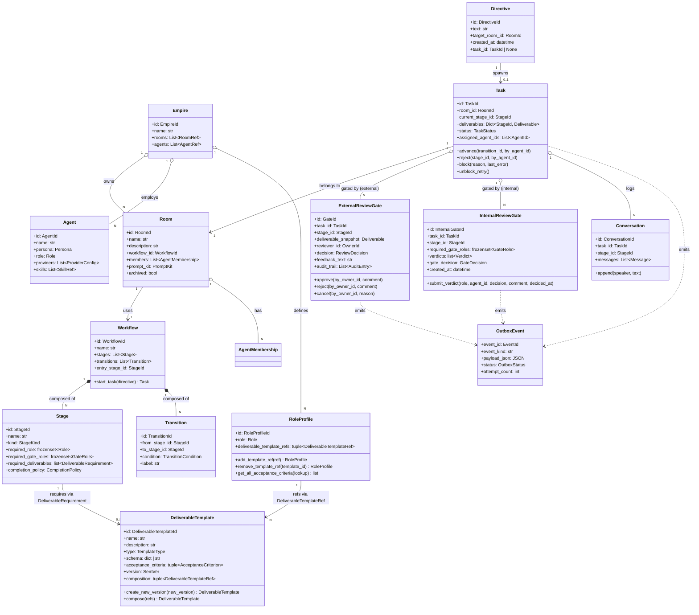

# bakufu ドメインモデル設計書

bakufu のドメインモデルを Aggregate / Entity / Value Object 単位で定義する。本書は実装の境界線（モジュール分割・トランザクション境界・整合性ルール）を凍結する真実源であり、ランタイムコードはここで定義された境界に従って配置される。

> **着想**: shikomi の dev-workflow 設計書と同じく、ドメイン設計をコード前に文章で固める。実装は本書の境界に従う。

> **本書はインデックスである**: 規模が増えたため、Aggregate 詳細・Value Object・Domain Event / Outbox・添付保存方式・Tx 境界例は [`domain-model/`](domain-model/) 配下に分割している。本書は概観・全体クラス図・モジュール配置・残課題に専念する。

## 設計指針

- **Domain-Driven Design**: 業務概念（Empire / Room / Agent / Workflow / ExternalReviewGate / InternalReviewGate 等）をそのままドメインオブジェクトとして表現する。技術的詳細は infrastructure 層に閉じ込める
- **Aggregate Root のトランザクション境界**: 1 トランザクションで 1 Aggregate のみを更新。複数 Aggregate にまたがる整合性は Domain Event 経由で結果整合
- **依存方向**: domain → application → interfaces / infrastructure（外側が内側を知り、内側は外側を知らない）
- **不変条件は Aggregate Root が守る**: 状態遷移・参照整合性は Aggregate Root のメソッドで強制
- **Value Object は不変**: ID・列挙型・座標等は frozen dataclass / Pydantic v2 frozen model で表現
- **Aggregate Root は常に valid**: pre-validate 方式により、不正状態の窓を一瞬も開かない（[`domain-model/aggregates.md`](domain-model/aggregates.md) §Workflow.validate() 参照）

## 補章一覧

| ファイル | 内容 |
|----|----|
| [`domain-model/aggregates.md`](domain-model/aggregates.md) | Empire / Room / Workflow / Agent / Task / Directive / ExternalReviewGate / InternalReviewGate / Conversation の属性・不変条件・ふるまい。`validate()` ロールバック方式（pre-validate）の確定 |
| [`domain-model/value-objects.md`](domain-model/value-objects.md) | ID / 列挙型 / 主要 Value Object（Persona / ProviderConfig / AgentMembership / Stage / Transition / Message / AuditEntry 等） |
| [`domain-model/events-and-outbox.md`](domain-model/events-and-outbox.md) | Domain Event 一覧と Transactional Outbox 設計（Dispatcher / Retry / Dead-letter / 受信側冪等性 / Admin CLI 連携） |
| [`domain-model/storage.md`](domain-model/storage.md) | Deliverable / Attachment 保存方式（content-addressable filesystem）、filename サニタイズ、MIME ホワイトリスト、配信時セキュリティヘッダ、シークレットマスキング規則、孤児 GC |
| [`domain-model/transactions.md`](domain-model/transactions.md) | Tx 境界例（directive → task / 外部レビュー / BLOCKED / admin retry）と V モデル開発室の Workflow 構成例 |

セキュリティ全般の信頼境界・攻撃面・OWASP Top 10 対応は [`threat-model.md`](threat-model.md) を参照。

## ドメインの全体像



## モジュール配置（提案）

```
backend/src/bakufu/
├── domain/                      # ドメイン層（外側を知らない）
│   ├── empire.py                # Empire Aggregate
│   ├── room.py                  # Room Aggregate
│   ├── workflow.py              # Workflow Aggregate (Stage / Transition 含む)
│   ├── agent.py                 # Agent Aggregate
│   ├── task.py                  # Task Aggregate
│   ├── directive.py             # Directive Aggregate
│   ├── external_review.py       # ExternalReviewGate Aggregate
│   ├── internal_review_gate/    # InternalReviewGate Aggregate（Issue #65）
│   │   ├── __init__.py
│   │   ├── internal_review_gate.py
│   │   ├── aggregate_validators.py
│   │   └── state_machine.py
│   ├── deliverable_template/    # DeliverableTemplate / RoleProfile Aggregate（Issue #115）
│   │   ├── __init__.py
│   │   ├── deliverable_template.py
│   │   ├── role_profile.py
│   │   └── invariant_validators.py
│   ├── conversation.py          # Conversation Entity
│   ├── value_objects.py         # 列挙型 / Value Object 共通
│   ├── events.py                # Domain Event 定義
│   └── exceptions.py            # ドメイン例外
├── application/                 # ユースケース層
│   ├── empire_service.py
│   ├── room_service.py
│   ├── workflow_service.py
│   ├── agent_service.py
│   ├── task_service.py
│   ├── external_review_service.py
│   ├── outbox_dispatcher.py     # Outbox polling / dispatch
│   └── ports/                   # ポート（Repository / LLMProvider 等の抽象）
│       ├── repositories.py
│       ├── llm_provider.py
│       ├── notifier.py
│       └── attachment_store.py  # 添付ファイルストレージの抽象
├── infrastructure/              # 外部接続層
│   ├── persistence/
│   │   ├── sqlite/              # SQLAlchemy mappers / repositories
│   │   └── memory/              # テスト用インメモリ Repository
│   ├── llm/
│   │   ├── claude_code_client.py    # ai-team から切り出し
│   │   ├── codex_cli_client.py
│   │   ├── gemini_client.py
│   │   ├── anthropic_api_client.py
│   │   └── pid_registry.py      # subprocess pidfile 管理
│   ├── notifier/
│   │   ├── discord.py
│   │   └── slack.py
│   ├── storage/
│   │   ├── attachment_fs.py     # content-addressable filesystem 実装
│   │   └── gc.py                # 孤児ファイル GC
│   └── security/
│       ├── masking.py           # シークレットマスキングの単一ゲートウェイ
│       └── audit_log.py         # audit_log 永続化
├── interfaces/                  # 入出力境界
│   ├── http/                    # FastAPI router
│   │   ├── empire.py
│   │   ├── room.py
│   │   ├── workflow.py
│   │   ├── agent.py
│   │   ├── task.py
│   │   ├── external_review.py
│   │   └── attachment.py        # 添付配信（セキュリティヘッダ強制）
│   ├── ws/                      # WebSocket（リアルタイム同期）
│   │   └── event_stream.py
│   └── cli/                     # Admin CLI
│       └── admin.py             # retry-task / cancel-task / retry-event / list-blocked / list-dead-letters
└── main.py                      # 起動時 GC + Dispatcher 常駐起動
```

依存方向: `interfaces` → `application` → `domain` ← `infrastructure`（DI で注入）

## 残課題（後続 Issue で扱う）

- **永続化スキーマ詳細**: SQLAlchemy mapper / migration スクリプト → `docs/features/persistence/` で扱う
- **WebSocket イベント仕様**: クライアント側のリアルタイム反映プロトコル → `docs/features/realtime-sync/` で扱う
- **権限モデル**: マルチユーザー化時の RBAC（MVP はシングルユーザー前提、YAGNI）
- **メッセンジャー多対応**: Discord 以外（Slack/Telegram/iMessage 等） → Phase 2
- **メッセージ検索**: Conversation の全文検索（インデックス設計） → Phase 2

## Phase 0 で確定済みの運用方針

以下は当初「残課題」に積んでいたが、Phase 0（アーキ凍結）で方針を確定した。各 feature 設計書はこの方針に従って詳細実装を書く。

- **Workflow.validate() 呼びタイミングとロールバック方式**: [`domain-model/aggregates.md`](domain-model/aggregates.md) §`validate()` 呼びタイミングとロールバック方式
- **Domain Event 補償（Outbox / Dispatcher）**: [`domain-model/events-and-outbox.md`](domain-model/events-and-outbox.md)
- **Deliverable 添付ファイル保存方式 / snapshot 凍結 / シークレットマスキング**: [`domain-model/storage.md`](domain-model/storage.md)
- **Claude Code CLI クラッシュ回復・セッション TTL・孤児プロセス管理**: [`tech-stack.md`](tech-stack.md) §LLM Adapter 運用方針
- **脅威モデル / TLS / OWASP Top 10**: [`threat-model.md`](threat-model.md)
