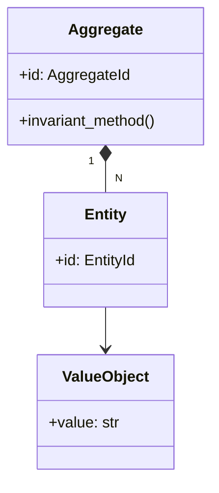
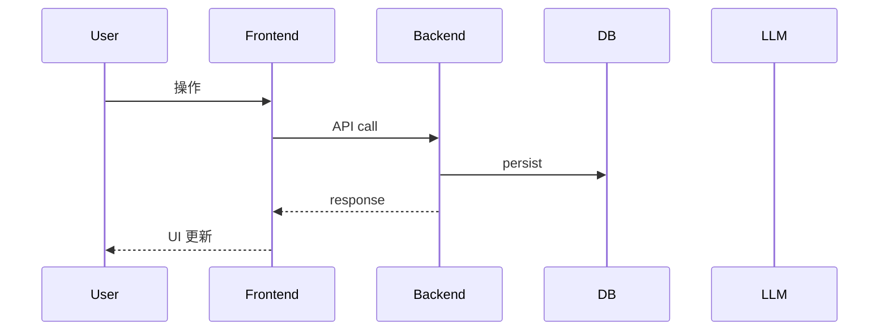
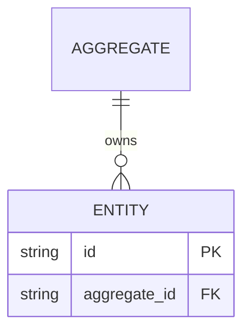

# 基本設計書

<!-- 詳細設計書（detailed-design.md）とは別ファイル。統合禁止。 -->
<!-- feature 単位で 1 ファイル。requirements.md の機能要件をどう実装するかを「モジュール構成 / 処理フロー / セキュリティ」の観点で凍結する。 -->
<!-- 配置先: docs/features/<feature-name>/basic-design.md -->

## 記述ルール（必ず守ること）

基本設計に**疑似コード・サンプル実装（python/ts/sh/yaml 等の言語コードブロック）を書くな**。
ソースコードと二重管理になりメンテナンスコストしか生まない。
必要なのは構造契約（クラス・モジュール・データの関係）であり、実装の細部は detailed-design.md で凍結する。

## モジュール構成

<!-- requirements.md の機能要件 ID を「どのモジュール（ファイル / ディレクトリ）で実現するか」にマッピングする。 -->
<!-- 配置先と責務を 1 行で書く。 -->

| 機能 ID | モジュール | ディレクトリ | 責務 |
|--------|----------|------------|------|
| REQ-XX-001, ... | ... | `backend/src/bakufu/domain/...` | ... |
| REQ-XX-002, ... | ... | `frontend/src/...` | ... |

```
ディレクトリ構造（本 feature で追加・変更されるファイル）:

.
├── backend/src/bakufu/...
└── frontend/src/...
```

## クラス設計（概要）

<!-- mermaid classDiagram で概要を示す。詳細は detailed-design.md。 -->



**凝集のポイント**:
- ...
- ...

## 処理フロー

<!-- ユースケース単位で「ユーザー操作 → 内部処理 → 副作用 → 応答」を箇条書き。 -->

### ユースケース 1: <名前>

1. ...
2. ...
3. ...

### ユースケース 2: <名前>

1. ...

## シーケンス図



## アーキテクチャへの影響

<!-- docs/architecture/ への変更が必要なら明記。Aggregate の追加・削除は domain-model.md を同 PR で更新する。 -->

- `docs/architecture/domain-model.md` への変更: ...
- `docs/architecture/tech-stack.md` への変更: ...
- 既存 feature への波及: ...

## 外部連携

| 連携先 | 目的 | プロトコル | 認証 | タイムアウト / リトライ |
|-------|------|----------|-----|--------------------|
| ... | ... | ... | ... | ... |

## UX 設計

<!-- フロー図 / 画面遷移 / ローディング・エラー時の挙動を凍結。 -->

| シナリオ | 期待される挙動 |
|---------|------------|
| ... | ... |

**アクセシビリティ方針**: ...

## セキュリティ設計

### 脅威モデル

| 想定攻撃者 | 攻撃経路 | 保護資産 | 対策 |
|-----------|---------|---------|------|
| **T1: ...** | ... | ... | ... |
| **T2: ...** | ... | ... | ... |

### OWASP Top 10 対応

| # | カテゴリ | 対応状況 |
|---|---------|---------|
| A01 | Broken Access Control | ... |
| A02 | Cryptographic Failures | ... |
| A03 | Injection | ... |
| A04 | Insecure Design | ... |
| A05 | Security Misconfiguration | ... |
| A06 | Vulnerable Components | ... |
| A07 | Auth Failures | ... |
| A08 | Data Integrity Failures | ... |
| A09 | Logging Failures | ... |
| A10 | SSRF | ... |

## ER 図

<!-- domain Aggregate の永続化スキーマを概観。詳細は detailed-design.md のキー構造表で凍結。 -->



## エラーハンドリング方針

| 例外種別 | 処理方針 | ユーザーへの通知 |
|---------|---------|----------------|
| ... | ... | MSG-XX-NNN |
