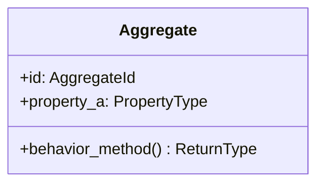

# 詳細設計書

<!-- 基本設計書（basic-design.md）とは別ファイル。統合禁止。 -->
<!-- 実装直前の構造契約・確定文言・キー構造を凍結する。Sub-issue 実装 PR は本書を改変せず参照する。設計変更が必要なら本書を先に更新する PR を立てる。 -->
<!-- 配置先: docs/features/<feature-name>/detailed-design.md -->

## 記述ルール（必ず守ること）

詳細設計に**疑似コード・サンプル実装（python/ts/sh/yaml 等の言語コードブロック）を書くな**。
ソースコードと二重管理になりメンテナンスコストしか生まない。
必要なのは「構造契約（属性名・型・制約）」と「確定文言（メッセージ文字列）」と「実装の意図（なぜこの API 形になるか）」であり、コードそのものは Sub-issue の実装 PR で書く。

## クラス設計（詳細）

<!-- 各 Aggregate / Entity / VO の属性・型・制約を凍結。 -->

### Aggregate Root: <名前>

| 属性 | 型 | 制約 | 意図 |
|----|----|----|----|
| `id` | `AggregateId`（UUID v4） | 不変 | 一意識別 |
| ... | ... | ... | ... |

**不変条件**:
- ...
- ...

**ふるまい**:
- `method_a(args) -> ReturnType`: ...
- `method_b()`: ...

### Entity within Aggregate: <名前>

| 属性 | 型 | 制約 |
|----|----|----|
| ... | ... | ... |

### Value Object: <名前>

| 属性 | 型 |
|----|----|
| ... | ... |

## 確定事項（先送り撤廃）

<!-- requirements-analysis.md §確定 R1-A 等で凍結した内容のうち、構造契約レベルでさらに細部を確定するものをここで凍結。 -->

### 確定 A: ...

<根拠と決定事項>

### 確定 B: ...

<根拠と決定事項>

## 設計判断の補足

<!-- 「なぜこの API 形か」「なぜこのデフォルト値か」など、コードを読んでも分からない判断理由を残す。 -->

#### なぜ ... か

- ...

## ユーザー向けメッセージの確定文言

`requirements.md §ユーザー向けメッセージ一覧` で ID のみ定義した MSG を、本書で**正確な文言**として凍結する。実装者が勝手に改変できない契約。変更は本書の更新 PR のみで許可。

### プレフィックス統一

| プレフィックス | 意味 |
|--------------|-----|
| `[FAIL]` | 処理中止を伴う失敗 |
| `[OK]` | 成功完了 |
| `[SKIP]` | 冪等実行による省略 |
| `[WARN]` | 警告（処理は継続） |
| `[INFO]` | 情報提供（処理は継続） |

### MSG 確定文言表

| ID | 出力先 | 文言（必要なら 2 行構造） |
|----|------|----------------------|
| MSG-XX-001 | stderr / Toast | `[FAIL] <要約>` / `次のコマンド: <復旧 1 行>` |
| MSG-XX-002 | stdout / Banner | `[OK] <成功内容>` |

## データ構造（永続化キー）

<!-- SQLAlchemy mapper / Pydantic schema / API request/response の最終的なキー構造。 -->

### `<table_name>` テーブル

| カラム | 型 | 制約 | 意図 |
|-------|----|----|----|
| `id` | `UUID` | PK, NOT NULL | ... |
| ... | ... | ... | ... |

### `/api/<endpoint>` リクエスト / レスポンス

| フィールド | 型 | 必須 | 説明 |
|----------|----|----|----|
| ... | ... | ... | ... |

## API エンドポイント詳細

<!-- requirements.md の API 仕様外形を、HTTP ステータス・エラーコード・WebSocket イベント名まで凍結する。 -->

### POST /api/<resource>

| 項目 | 内容 |
|----|----|
| 用途 | ... |
| 認証 | ... |
| リクエスト Body | ... |
| 成功レスポンス | 200 OK + `<schema>` |
| 失敗レスポンス | 400 / 404 / 409 / 500 + `<error schema>` |
| 副作用 | Domain Event 発火: `EventName` |

## 出典・参考

<!-- 公式ドキュメント / RFC / 学術論文 / OWASP / 業界標準ガイドラインの URL を列挙。検証可能性を担保する。 -->

- ...
- ...
