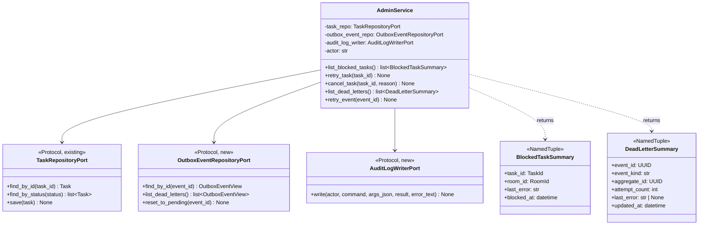
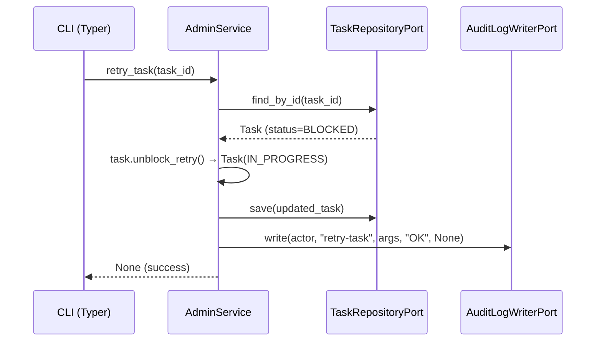

# 基本設計書 — admin-cli / application

> feature: `admin-cli`（業務概念）/ sub-feature: `application`
> 親業務仕様: [`../feature-spec.md`](../feature-spec.md)
> 関連 Issue: [#165 feat(M5-C): admin-cli実装](https://github.com/bakufu-dev/bakufu/issues/165)

## 本書の役割

本書は **階層 3: admin-cli / application の基本設計**（Module-level Basic Design）を凍結する。AdminService の責務範囲・依存する Port インターフェース・ Value Object を定義し、実装者が詳細設計書（[`detailed-design.md`](detailed-design.md)）とあわせて実装できる構造契約を確定する。

**書くこと**:
- モジュール構成（機能 ID → ディレクトリ → 責務）
- モジュール契約（REQ-AC-NNN、入力 / 処理 / 出力 / エラー時）
- クラス設計（概要）
- 処理フロー（ユースケース単位）
- セキュリティ設計

**書かないこと**（後段の設計書へ追い出す）:
- メソッド呼び出しの細部 → [`detailed-design.md §確定事項`](detailed-design.md)
- 属性の型・制約 → [`detailed-design.md §クラス設計（詳細）`](detailed-design.md)
- MSG 確定文言 → [`detailed-design.md §MSG 確定文言表`](detailed-design.md)

## 記述ルール（必ず守ること）

基本設計に **疑似コード・サンプル実装（言語コードブロック）を書かない**。
ソースコードと二重管理になりメンテナンスコストしか生まない。
必要なのは構造契約（クラス・モジュール・データの関係）であり、実装の細部は [`detailed-design.md`](detailed-design.md) で凍結する。

## §モジュール契約（機能要件）

### REQ-AC-001: BLOCKED Task 一覧取得

| 項目 | 内容 |
|---|---|
| 入力 | なし |
| 処理 | `TaskRepositoryPort` から `status=BLOCKED` の全 Task を取得し `BlockedTaskSummary` リストに変換する。audit_log に `command=list-blocked` / `result=OK` を記録する |
| 出力 | `list[BlockedTaskSummary]`（task_id / room_id / last_error / blocked_at を含む）|
| エラー時 | DB アクセスエラー → audit_log に `result=FAIL` / `error_text=<masked>` を記録してから例外を再 raise |

### REQ-AC-002: BLOCKED Task retry（IN_PROGRESS 化）

| 項目 | 内容 |
|---|---|
| 入力 | `task_id: TaskId` |
| 処理 | Task を取得 → status=BLOCKED を検証（R1-2: Fail Fast）→ `Task.unblock_retry()` で IN_PROGRESS に変換 → 保存 → audit_log に `command=retry-task` / `result=OK` を記録 |
| 出力 | なし |
| エラー時 | task_id 不在 → MSG-AC-001 / audit_log `result=FAIL`。status≠BLOCKED → MSG-AC-002 / audit_log `result=FAIL` |

### REQ-AC-003: Task キャンセル

| 項目 | 内容 |
|---|---|
| 入力 | `task_id: TaskId`、`reason: str`（キャンセル理由、任意）|
| 処理 | Task を取得 → status ∈ {BLOCKED, PENDING, IN_PROGRESS} を検証（R1-3: Fail Fast）→ `Task.cancel(by_owner_id=SYSTEM_AGENT_ID, reason=reason)` で CANCELLED に変換 → 保存 → audit_log に `command=cancel-task` / `result=OK` を記録 |
| 出力 | なし |
| エラー時 | task_id 不在 → MSG-AC-001 / audit_log `result=FAIL`。status 不適 → MSG-AC-003 / audit_log `result=FAIL` |

### REQ-AC-004: dead-letter Event 一覧取得

| 項目 | 内容 |
|---|---|
| 入力 | なし |
| 処理 | `OutboxEventRepositoryPort` から `status=DEAD_LETTER` の全 OutboxRow を取得し `DeadLetterSummary` リストに変換する。audit_log に `command=list-dead-letters` / `result=OK` を記録する |
| 出力 | `list[DeadLetterSummary]`（event_id / event_kind / aggregate_id / attempt_count / last_error / updated_at を含む）|
| エラー時 | DB アクセスエラー → audit_log に `result=FAIL` を記録してから例外を再 raise |

### REQ-AC-005: dead-letter Event retry（Outbox 再投入）

| 項目 | 内容 |
|---|---|
| 入力 | `event_id: UUID` |
| 処理 | OutboxRow を取得 → status=DEAD_LETTER を検証（R1-5: Fail Fast）→ `status=PENDING` / `attempt_count=0` / `next_attempt_at=now(UTC)` にリセット → 保存 → audit_log に `command=retry-event` / `result=OK` を記録 |
| 出力 | なし |
| エラー時 | event_id 不在 → MSG-AC-004 / audit_log `result=FAIL`。status≠DEAD_LETTER → MSG-AC-005 / audit_log `result=FAIL` |

## ユーザー向けメッセージ一覧

| ID | 種別 | メッセージ（要旨）| 表示条件 |
|---|---|---|---|
| MSG-AC-001 | エラー | Task が見つからない | task_id 不在 |
| MSG-AC-002 | エラー | Task が BLOCKED 状態ではない | retry-task に BLOCKED 以外の Task |
| MSG-AC-003 | エラー | Task がキャンセル可能な状態ではない | cancel-task に DONE/CANCELLED/AWAITING_EXTERNAL_REVIEW の Task |
| MSG-AC-004 | エラー | dead-letter Event が見つからない | event_id 不在 |
| MSG-AC-005 | エラー | Outbox Event が DEAD_LETTER 状態ではない | retry-event に DEAD_LETTER 以外の Event |

各メッセージの確定文言は [`detailed-design.md §MSG 確定文言表`](detailed-design.md) で凍結する。

## 依存関係

| 区分 | 依存 | バージョン方針 | 備考 |
|---|---|---|---|
| Port（既存）| `TaskRepositoryPort` | `application/ports/task_repository.py` | list-blocked / retry / cancel で使用 |
| Port（新規）| `OutboxEventRepositoryPort` | `application/ports/outbox_event_repository.py`（本 Issue で追加）| dead-letter 操作で使用 |
| Port（新規）| `AuditLogWriterPort` | `application/ports/audit_log_writer.py`（本 Issue で追加）| 全コマンドで audit_log 記録に使用 |
| domain | `Task.unblock_retry()` / `Task.cancel()` | `domain/task.py` | 既存 domain メソッドを使用 |
| domain | `SYSTEM_AGENT_ID` | `domain/value_objects/identifiers.py` | cancel-task の `by_owner_id` に使用（M5-B で追加済み）|

## クラス設計（概要）

**新規 Port の配置先**:
- `backend/src/bakufu/application/ports/outbox_event_repository.py`
- `backend/src/bakufu/application/ports/audit_log_writer.py`

**凝集のポイント**:
- AdminService は業務操作（Task / Outbox 状態変更）と監査記録（audit_log）の両方を担う。これは「Admin 操作は必ず audit_log を伴う」という不変条件を単一クラスで強制するため（Fail Fast + Tell, Don't Ask）
- audit_log 記録は try/finally 等で操作の成否に依らず確実に実行する（操作証跡の完全性）
- `OutboxEventRepositoryPort` と `AuditLogWriterPort` は新規 Port として application/ports/ に配置し、infrastructure 実装（SQLAlchemy）を application 層に持ち込まない（Clean Architecture の依存方向保全）

## 処理フロー

### ユースケース 1: UC-AC-002 — retry-task（BLOCKED Task を IN_PROGRESS に戻す）

1. `task_repo.find_by_id(task_id)` で Task を取得（不在 → MSG-AC-001 で Fail Fast）
2. `task.status == BLOCKED` を検証（失敗 → MSG-AC-002 で Fail Fast）
3. `task.unblock_retry()` で新たな Task インスタンス（status=IN_PROGRESS）を生成
4. `task_repo.save(updated_task)` で永続化
5. `audit_log_writer.write(actor, "retry-task", {"task_id": ...}, "OK", None)` で記録
6. 正常終了（bakufu サーバーの StageWorker が IN_PROGRESS Task を自動ピックアップ）

### ユースケース 2: UC-AC-005 — retry-event（dead-letter Event を Outbox に再投入）

1. `outbox_event_repo.find_by_id(event_id)` で OutboxEventView を取得（不在 → MSG-AC-004 で Fail Fast）
2. `event.status == DEAD_LETTER` を検証（失敗 → MSG-AC-005 で Fail Fast）
3. `outbox_event_repo.reset_to_pending(event_id)` で `status=PENDING` / `attempt_count=0` / `next_attempt_at=now(UTC)` にリセット
4. `audit_log_writer.write(actor, "retry-event", {"event_id": ...}, "OK", None)` で記録
5. 正常終了（Outbox Dispatcher の次回ポーリングサイクルで自動 dispatch）

## シーケンス図

## アーキテクチャへの影響

- [`docs/design/architecture.md`](../../../design/architecture.md) への変更: interfaces/cli レイヤー追記（本 PR で同時更新）
- [`docs/design/domain-model.md`](../../../design/domain-model.md) への変更: なし（Task domain メソッドは既存）
- 新規 Port 追加: `OutboxEventRepositoryPort` / `AuditLogWriterPort`（`application/ports/` に配置）
- 既存 feature への波及: `feature/stage-executor`（`retry_blocked_task()` エントリポイントは本 feature では使用しない。AdminService が Task domain メソッドを直接呼ぶ）

## 外部連携

| 連携先 | 目的 | プロトコル | 認証 | タイムアウト / リトライ |
|---|---|---|---|---|
| SQLite DB | Task / OutboxRow / audit_log の読み書き | SQLAlchemy async（file I/O）| なし（同一ホスト）| タイムアウト: SQLite デフォルト / リトライ: なし（即 FAIL）|

## UX 設計

| シナリオ | 期待される挙動 |
|---|---|
| デフォルト出力 | テーブル形式（tabulate）で stdout に出力。カラム幅は自動調整 |
| `--json` 出力 | JSON 配列を stdout に出力。`jq` でパイプ処理可能 |
| コマンド失敗時 | stderr にエラーメッセージ（MSG-AC-NNN）を出力し、exit code 1 で終了 |
| 空結果（0 件）| list 系コマンドは「0 件」を正常（exit code 0）として返す。エラーではない |

**アクセシビリティ方針**: 該当なし — 理由: CLI のため視覚的アクセシビリティは対象外。スクリーンリーダー対応は OS の CLI サポートに委ねる。

## セキュリティ設計

### 脅威モデル

| 想定攻撃者 | 攻撃経路 | 保護資産 | 対策 |
|---|---|---|---|
| **T1: 外部アクター** | CLI 実行環境（同一ホスト必須）| BLOCKED Task / dead-letter Event 情報 | 同一ホスト上の bakufu 実行ユーザーのみが実行可能（OS レベルの制御）|
| **T2: 内部コード誤実装** | audit_log への `comment` / `payload_json` raw 値の混入 | シークレット漏洩（OWASP T3 相当）| `AuditLogWriterPort` の入力を `task_id` / `event_id` 等の識別子のみに限定。`last_error` / `payload_json` raw 値を `args_json` に含めない（`MaskedText` は永続化時のみ作動するため）|
| **T3: audit_log 改ざん** | DELETE / UPDATE による証跡消去 | 操作証跡の完全性 | SQLite トリガが DELETE を拒否（既存スキーマ）。UPDATE は `result` / `error_text` の NULL → 値遷移のみ許容 |

詳細な信頼境界は [`docs/design/threat-model.md`](../../../design/threat-model.md)。

## ER 図

本 sub-feature は新規テーブルを追加しない。使用する既存テーブル:

| テーブル | 用途 |
|---|---|
| `tasks` | BLOCKED Task 一覧取得・Task 状態変更 |
| `domain_event_outbox` | DEAD_LETTER Event 一覧取得・status リセット |
| `audit_log` | 全操作の証跡記録 |

## エラーハンドリング方針

| 例外種別 | 処理方針 | ユーザーへの通知 |
|---|---|---|
| `TaskNotFoundError` | audit_log `result=FAIL` 記録 → CLI に伝播 → stderr 出力 + exit 1 | MSG-AC-001 |
| `IllegalTaskStateError` | 同上 | MSG-AC-002 または MSG-AC-003 |
| `OutboxEventNotFoundError` | 同上 | MSG-AC-004 |
| `IllegalOutboxStateError` | 同上 | MSG-AC-005 |
| DB アクセスエラー（SQLAlchemy） | audit_log `result=FAIL` 記録（best effort）→ CLI に伝播 → stderr 出力 + exit 1 | `[FAIL] DB エラーが発生しました。詳細は logs を確認してください。` |
