# 詳細設計書 — admin-cli / application

> feature: `admin-cli` / sub-feature: `application`
> 親業務仕様: [`../feature-spec.md`](../feature-spec.md)
> 関連: [`basic-design.md`](basic-design.md)
> 担当 Issue: [#165 feat(M5-C): admin-cli実装](https://github.com/bakufu-dev/bakufu/issues/165)

## 本書の役割

本書は **階層 3: admin-cli / application の詳細設計**（Module-level Detailed Design）を凍結する。M5-C の実装者が参照する **構造契約・確定事項・MSG 文言** を確定する。

**書くこと**:
- クラス属性・型・制約（構造契約の詳細）
- `§確定 A〜E`（ジェンセン決定論点 + M5-C 固有の実装方針）
- MSG 確定文言（実装者が改変できない契約）

**書かないこと**:
- ソースコードそのもの / 疑似コード

## 記述ルール（必ず守ること）

詳細設計に **疑似コード・サンプル実装（python/ts/sh/yaml 等の言語コードブロック）を書かない**。

## クラス設計（詳細）

```mermaid
classDiagram
    class AdminService {
        -task_repo: TaskRepositoryPort
        -outbox_event_repo: OutboxEventRepositoryPort
        -audit_log_writer: AuditLogWriterPort
        -actor: str
        +async list_blocked_tasks() list~BlockedTaskSummary~
        +async retry_task(task_id: TaskId) None
        +async cancel_task(task_id: TaskId, reason: str) None
        +async list_dead_letters() list~DeadLetterSummary~
        +async retry_event(event_id: UUID) None
        -async _write_audit(command, args_json, result, error_text) None
    }
    class OutboxEventRepositoryPort {
        <<Protocol>>
        +async find_by_id(event_id: UUID) OutboxEventView
        +async list_dead_letters() list~OutboxEventView~
        +async reset_to_pending(event_id: UUID) None
    }
    class AuditLogWriterPort {
        <<Protocol>>
        +async write(actor: str, command: str, args_json: dict, result: str, error_text: str | None) None
    }
    class BlockedTaskSummary {
        <<NamedTuple>>
        +task_id: TaskId
        +room_id: RoomId
        +last_error: str
        +blocked_at: datetime
    }
    class DeadLetterSummary {
        <<NamedTuple>>
        +event_id: UUID
        +event_kind: str
        +aggregate_id: UUID
        +attempt_count: int
        +last_error: str | None
        +updated_at: datetime
    }
    class OutboxEventView {
        <<NamedTuple>>
        +event_id: UUID
        +event_kind: str
        +aggregate_id: UUID
        +status: str
        +attempt_count: int
        +last_error: str | None
        +updated_at: datetime
    }
```

### Service: AdminService

| 属性 | 型 | 意図 |
|---|---|---|
| `task_repo` | `TaskRepositoryPort` | BLOCKED Task の一覧取得・Task 状態変更 |
| `outbox_event_repo` | `OutboxEventRepositoryPort` | DEAD_LETTER Event の一覧取得・status リセット |
| `audit_log_writer` | `AuditLogWriterPort` | 全操作の audit_log 追記（操作証跡） |
| `actor` | `str` | OS ユーザー名（`AuditLogRow.actor` に使用）。DI 時に注入する |

**ふるまいの不変条件**:
- 全 public メソッドは操作の成否に依らず audit_log を記録する（§確定 A）
- `retry_task()` は Task.status = BLOCKED 以外で即座に `IllegalTaskStateError` を送出する（§確定 B: Fail Fast）
- `cancel_task()` は Task.status ∉ {BLOCKED, PENDING, IN_PROGRESS} で即座に `IllegalTaskStateError` を送出する（§確定 B: Fail Fast）
- `retry_event()` は OutboxRow.status ≠ DEAD_LETTER で即座に `IllegalOutboxStateError` を送出する（§確定 C: Fail Fast）

### Port: OutboxEventRepositoryPort（新規）

| メソッド | シグネチャ | 制約 |
|---|---|---|
| `find_by_id` | `(event_id: UUID) -> OutboxEventView` | 不在時は `OutboxEventNotFoundError` を raise |
| `list_dead_letters` | `() -> list[OutboxEventView]` | `status == 'DEAD_LETTER'` の行のみを返す。0 件は空リスト（エラーではない）|
| `reset_to_pending` | `(event_id: UUID) -> None` | `status = 'PENDING'` / `attempt_count = 0` / `next_attempt_at = now(UTC)` / `updated_at = now(UTC)` に更新。不在時は `OutboxEventNotFoundError` を raise |

**配置先**: `backend/src/bakufu/application/ports/outbox_event_repository.py`

### Port: AuditLogWriterPort（新規）

| メソッド | シグネチャ | 制約 |
|---|---|---|
| `write` | `(actor: str, command: str, args_json: dict[str, object], result: str, error_text: str \| None) -> None` | `result` は `'OK'` または `'FAIL'` の 2 値。書き込み失敗時は例外を握り潰さず再 raise（audit_log の欠落は許容しない） |

**配置先**: `backend/src/bakufu/application/ports/audit_log_writer.py`

### VO: BlockedTaskSummary

| 属性 | 型 | 制約 | 意図 |
|---|---|---|---|
| `task_id` | `TaskId`（UUID） | 不変 | 一意識別 |
| `room_id` | `RoomId`（UUID） | 不変、参照のみ | 所属 Room |
| `last_error` | `str` | 1〜10000 文字（Task.last_error から取得、BLOCKED なら必ず非 None / 非空）| 障害理由（masked）|
| `blocked_at` | `datetime` | UTC、tz-aware | Task.updated_at（最後に BLOCKED に遷移した時刻）|

### VO: DeadLetterSummary

| 属性 | 型 | 制約 | 意図 |
|---|---|---|---|
| `event_id` | `UUID` | 不変 | 一意識別 |
| `event_kind` | `str` | 1〜64 文字 | Domain Event 種別（例: `TaskBlocked`）|
| `aggregate_id` | `UUID` | 不変 | 対象 Aggregate の ID |
| `attempt_count` | `int` | ≥ 0 | dispatch 試行回数（≥ DEFAULT_MAX_ATTEMPTS で DEAD_LETTER 化）|
| `last_error` | `str \| None` | masked | 最後の dispatch エラーメッセージ |
| `updated_at` | `datetime` | UTC、tz-aware | DEAD_LETTER 化した時刻 |

### VO: OutboxEventView（内部用、Port 返却型）

| 属性 | 型 | 制約 | 意図 |
|---|---|---|---|
| `event_id` | `UUID` | 不変 | 一意識別 |
| `event_kind` | `str` | 1〜64 文字 | Domain Event 種別 |
| `aggregate_id` | `UUID` | 不変 | 対象 Aggregate の ID |
| `status` | `str` | `'PENDING'` / `'DISPATCHING'` / `'DONE'` / `'DEAD_LETTER'` のいずれか | Outbox 行の状態 |
| `attempt_count` | `int` | ≥ 0 | dispatch 試行回数 |
| `last_error` | `str \| None` | masked | 最後の dispatch エラーメッセージ |
| `updated_at` | `datetime` | UTC、tz-aware | 最終更新時刻 |

### Exception: OutboxEventNotFoundError

| 属性 | 型 | 意図 |
|---|---|---|
| `event_id` | `UUID` | 検索に失敗した event_id |
| `message` | `str` | MSG-AC-004 由来の文言 |

**配置先**: `backend/src/bakufu/domain/exceptions/outbox.py`（または `domain/exceptions.py` 追記）

### Exception: IllegalOutboxStateError

| 属性 | 型 | 意図 |
|---|---|---|
| `event_id` | `UUID` | 操作対象の event_id |
| `current_status` | `str` | 実際の status 値 |
| `message` | `str` | MSG-AC-005 由来の文言 |

## 確定事項（先送り撤廃）

### 確定 A: 全 public メソッドは操作の成否に依らず必ず audit_log を記録する

`_write_audit(command, args_json, result, error_text)` は private helper メソッドとして AdminService に定義する。try/finally 構造で操作の成否に依らず audit_log 記録を保証する。

| 段階 | `result` | `error_text` |
|-----|---------|-------------|
| 操作成功 | `'OK'` | `None` |
| 操作失敗（業務エラー）| `'FAIL'` | マスキング済み例外メッセージ |
| 操作失敗（DB エラー）| `'FAIL'` | マスキング済み例外メッセージ（best effort: audit_log 書き込み自体が失敗した場合はログのみ）|

**根拠**: 受入基準 #14 + OWASP A09。audit_log は操作証跡として完全性が必要。失敗操作も `result=FAIL` で記録することで「試みた事実」が残る。

**audit_log の `args_json` に含めてよいフィールド**: `task_id` / `event_id` / `reason`（文字列）等の識別子のみ。`last_error` / `payload_json` のような可能性のある raw テキストは含めない（T2 対策: `MaskedText` TypeDecorator は SQLAlchemy `process_bind_param`（永続化時）に初めて作動するため、`args_json` に渡す時点ではマスキング済みではない）。

### 確定 B: `retry_task()` と `cancel_task()` は Task.status を直接検証する（Fail Fast）

`task_repo.find_by_id(task_id)` で取得した `Task.status` を直接確認する。domain メソッド（`Task.unblock_retry()` / `Task.cancel()`）が呼ばれる前に application 層で事前検証を行う。

**`retry_task()` 検証**:
- `task.status != BLOCKED` → `IllegalTaskStateError` を raise（MSG-AC-002）
- `task.status == BLOCKED` → `task.unblock_retry()` → 保存（R1-2）

**`cancel_task()` 検証**:
- `task.status ∉ {BLOCKED, PENDING, IN_PROGRESS}` → `IllegalTaskStateError` を raise（MSG-AC-003）
- 上記以外 → `task.cancel(by_owner_id=SYSTEM_AGENT_ID, reason=reason)` → 保存（R1-3）

**根拠**: Fail Fast 原則。domain メソッド内でも状態検証は行われるが（`state_machine.lookup()` が `TaskInvariantViolation` を raise）、application 層で先に検証することで「どのルールで拒否したか」を明確な MSG として返せる。

### 確定 C: `retry_event()` は OutboxRow.status を直接検証する（Fail Fast）

`outbox_event_repo.find_by_id(event_id)` で取得した `OutboxEventView.status` を直接確認する。

- `status != 'DEAD_LETTER'` → `IllegalOutboxStateError` を raise（MSG-AC-005）
- `status == 'DEAD_LETTER'` → `outbox_event_repo.reset_to_pending(event_id)`（R1-5）

**根拠**: `retry_event()` が PENDING / DISPATCHING 行を誤ってリセットすると、処理中のイベントが重複 dispatch される。Fail Fast で拒否する（§確定 B と同方針）。

### 確定 D: `OutboxEventRepositoryPort` と `AuditLogWriterPort` を新規 Port として定義する（Clean Architecture 保全）

application 層の AdminService から SQLAlchemy の `AsyncSession` / ORM クラス（`OutboxRow` / `AuditLogRow`）を直接 import してはならない。2 つの新規 Port Protocol を `application/ports/` に配置し、infrastructure 層が実装する。

**背景**: `AuditLogRow` / `OutboxRow` は `infrastructure/persistence/sqlite/tables/` に配置された SQLAlchemy ORM クラスであり、application 層からの直接 import は依存方向違反（infrastructure → application ではなく application → infrastructure になる）。

**実装クラスの配置先（infrastructure 層）**:
- `OutboxEventRepositoryPort` 実装: `backend/src/bakufu/infrastructure/persistence/sqlite/repositories/outbox_event_repository.py`
- `AuditLogWriterPort` 実装: `backend/src/bakufu/infrastructure/persistence/sqlite/repositories/audit_log_writer.py`

### 確定 E: `actor` は DI 時に OS ユーザー名を渡す

`AdminService.__init__` の `actor` 引数に CLI 起動時の OS ユーザー名（`getpass.getuser()` 相当）を渡す。AdminService 自体が OS ユーザー名を取得しない（依存性逆転: actor の解決は呼び出し元 CLI の責務）。

**根拠**: AdminService は業務ロジックのみを担い、環境依存の情報（OS ユーザー名）を知るべきではない（Single Responsibility + Testability: テスト時はダミー actor を注入できる）。

## 設計判断の補足

### なぜ `StageExecutorService.retry_blocked_task()` を使わないのか

M5-C の `retry-task` は Task.status を BLOCKED → IN_PROGRESS に変更するだけで、CLI プロセス内での LLM 実行は行わない。`StageExecutorService.retry_blocked_task()` は StageWorker への再キュー（`enqueue_fn`）を含む in-process の実行継続を前提とする。admin-cli は bakufu サーバーとは別プロセスであり、サーバーの asyncio Queue へのアクセス手段がない。AdminService が Task domain メソッド（`Task.unblock_retry()`）を直接呼ぶことで、サーバーの StageWorker が IN_PROGRESS Task を自動ピックアップするという分業が成立する（ジェンセン決定）。

### なぜ `cancel_task()` が `AWAITING_EXTERNAL_REVIEW` を拒否するのか

ExternalReviewGate は独立した Aggregate Root（`feature/external-review-gate`）であり、Task.cancel() を呼んだだけでは Gate のライフサイクルが適切に処理されない。Gate を無効化してから Task をキャンセルする処理は Phase 2 以降で ExternalReviewGateService との協調設計が必要（Q-OPEN-1 参照）。MVP では Fail Fast で拒否し、誤操作を防ぐ。

## ユーザー向けメッセージの確定文言

### プレフィックス統一

| プレフィックス | 意味 |
|---|---|
| `[FAIL]` | 処理中止を伴う失敗 |
| `[OK]` | 成功完了 |

### MSG 確定文言表

| ID | 例外型 | 出力先 | 文言（1 行目: failure / 2 行目: next action）|
|----|------|-------|---|
| MSG-AC-001 | `TaskNotFoundError` | CLI stderr | `[FAIL] Task {task_id} が見つかりません。` / `Next: task_id を確認し、'bakufu admin list-blocked' で存在確認してください。` |
| MSG-AC-002 | `IllegalTaskStateError`（retry）| CLI stderr | `[FAIL] Task {task_id} は BLOCKED 状態ではありません（現在: {current_status}）。` / `Next: 'bakufu admin list-blocked' で BLOCKED Task を確認してください。` |
| MSG-AC-003 | `IllegalTaskStateError`（cancel）| CLI stderr | `[FAIL] Task {task_id} はキャンセル可能な状態ではありません（現在: {current_status}）。` / `Next: キャンセル対象は BLOCKED / PENDING / IN_PROGRESS 状態の Task のみです。` |
| MSG-AC-004 | `OutboxEventNotFoundError` | CLI stderr | `[FAIL] Outbox Event {event_id} が見つかりません。` / `Next: event_id を確認し、'bakufu admin list-dead-letters' で存在確認してください。` |
| MSG-AC-005 | `IllegalOutboxStateError` | CLI stderr | `[FAIL] Outbox Event {event_id} は DEAD_LETTER 状態ではありません（現在: {current_status}）。` / `Next: 'bakufu admin list-dead-letters' で DEAD_LETTER Event を確認してください。` |

## データ構造（永続化キー）

本 sub-feature は新規テーブルを追加しない。使用する既存テーブルのキー:

### `tasks` テーブル（参照のみ、更新あり）

| カラム | 型 | 更新操作 |
|---|---|---|
| `id` | UUID | 検索キー |
| `status` | str | `retry_task()`: `'BLOCKED'` → `'IN_PROGRESS'` / `cancel_task()`: → `'CANCELLED'` |
| `last_error` | MaskedText | `retry_task()` 後: NULL にクリア |
| `updated_at` | datetime | 各操作時に now(UTC) に更新 |

### `domain_event_outbox` テーブル（参照のみ、更新あり）

| カラム | 型 | 更新操作 |
|---|---|---|
| `event_id` | UUID | 検索キー |
| `status` | str | `retry_event()`: `'DEAD_LETTER'` → `'PENDING'` |
| `attempt_count` | int | `retry_event()`: → `0` にリセット |
| `next_attempt_at` | datetime | `retry_event()`: → `now(UTC)` に設定 |
| `updated_at` | datetime | `retry_event()` 後: → `now(UTC)` に更新 |

### `audit_log` テーブル（追記専用）

| カラム | 型 | 値 |
|---|---|---|
| `id` | UUID | 新規 UUID v4 |
| `actor` | str | OS ユーザー名（`getpass.getuser()` 相当）|
| `command` | str | `'list-blocked'` / `'retry-task'` / `'cancel-task'` / `'list-dead-letters'` / `'retry-event'` |
| `args_json` | MaskedJSONEncoded | `{"task_id": "<uuid>"}` 等（識別子のみ。raw テキスト禁止: §確定 A）|
| `result` | str | `'OK'` または `'FAIL'` |
| `error_text` | MaskedText | 失敗時のマスキング済み例外メッセージ / 成功時は NULL |
| `executed_at` | datetime | now(UTC) |

## API エンドポイント詳細

該当なし — 理由: 本 sub-feature は HTTP API を持たない。admin-cli は CLI コマンドとして実行され、HTTP エンドポイントは提供しない。
