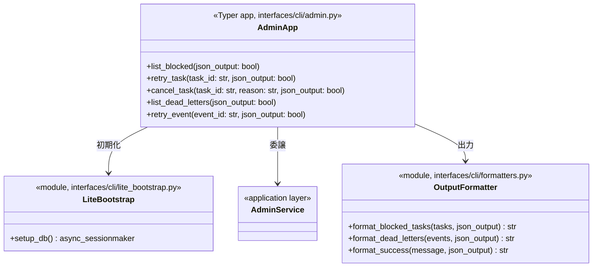
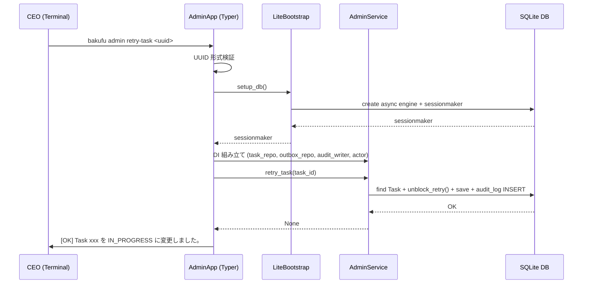

# 基本設計書 — admin-cli / cli

> feature: `admin-cli`（業務概念）/ sub-feature: `cli`
> 親業務仕様: [`../feature-spec.md`](../feature-spec.md)
> 関連: [`../application/basic-design.md`](../application/basic-design.md)
> 担当 Issue: [#165 feat(M5-C): admin-cli実装](https://github.com/bakufu-dev/bakufu/issues/165)

## 本書の役割

本書は **階層 3: admin-cli / cli の基本設計**（Module-level Basic Design）を凍結する。CEO が実行する 5 コマンドの CLI 定義・出力フォーマット・lite DB 初期化の構造契約を定義する。

**書くこと**:
- モジュール構成（コマンド → ディレクトリ → 責務）
- モジュール契約（REQ-AC-CLI-NNN）
- クラス設計（概要）
- 処理フロー（コマンド実行の流れ）
- lite Bootstrap 設計

**書かないこと**（後段の設計書へ追い出す）:
- Typer コマンドの詳細パラメータ → [`detailed-design.md §確定事項`](detailed-design.md)
- 出力フォーマットの詳細 → [`detailed-design.md §確定事項`](detailed-design.md)
- MSG 確定文言 → [`detailed-design.md §MSG 確定文言表`](detailed-design.md)

## 記述ルール（必ず守ること）

基本設計に **疑似コード・サンプル実装（言語コードブロック）を書かない**。
ソースコードと二重管理になりメンテナンスコストしか生まない。
必要なのは構造契約（クラス・モジュール・データの関係）であり、実装の細部は [`detailed-design.md`](detailed-design.md) で凍結する。

## §モジュール契約（機能要件）

### REQ-AC-CLI-001: `bakufu admin list-blocked` コマンド

| 項目 | 内容 |
|---|---|
| 入力 | `--json`（任意フラグ）|
| 処理 | lite Bootstrap で DB を初期化 → `AdminService.list_blocked_tasks()` を呼び出す → 結果を出力フォーマッタに渡す |
| 出力 | テーブル形式（デフォルト）または JSON 配列（`--json`）を stdout に出力 |
| エラー時 | stderr に MSG-AC-001〜003 相当のエラーメッセージを出力し exit code 1 で終了 |

### REQ-AC-CLI-002: `bakufu admin retry-task <task_id>` コマンド

| 項目 | 内容 |
|---|---|
| 入力 | `task_id: str`（UUID 文字列）、`--json`（任意フラグ）|
| 処理 | lite Bootstrap → `AdminService.retry_task(TaskId(task_id))` を呼び出す → 成功メッセージを出力 |
| 出力 | 成功メッセージを stdout（またはデフォルト形式 / JSON）に出力 |
| エラー時 | stderr に MSG-AC-001 / MSG-AC-002 を出力し exit code 1 |

### REQ-AC-CLI-003: `bakufu admin cancel-task <task_id>` コマンド

| 項目 | 内容 |
|---|---|
| 入力 | `task_id: str`（UUID 文字列）、`--reason TEXT`（任意、デフォルト `"Admin CLI による手動キャンセル"`）、`--json`（任意フラグ）|
| 処理 | lite Bootstrap → `AdminService.cancel_task(TaskId(task_id), reason)` を呼び出す → 成功メッセージを出力 |
| 出力 | 成功メッセージを stdout に出力 |
| エラー時 | stderr に MSG-AC-001 / MSG-AC-003 を出力し exit code 1 |

### REQ-AC-CLI-004: `bakufu admin list-dead-letters` コマンド

| 項目 | 内容 |
|---|---|
| 入力 | `--json`（任意フラグ）|
| 処理 | lite Bootstrap → `AdminService.list_dead_letters()` を呼び出す → 結果を出力フォーマッタに渡す |
| 出力 | テーブル形式（デフォルト）または JSON 配列（`--json`）を stdout に出力 |
| エラー時 | stderr にエラーメッセージを出力し exit code 1 |

### REQ-AC-CLI-005: `bakufu admin retry-event <event_id>` コマンド

| 項目 | 内容 |
|---|---|
| 入力 | `event_id: str`（UUID 文字列）、`--json`（任意フラグ）|
| 処理 | lite Bootstrap → `AdminService.retry_event(UUID(event_id))` を呼び出す → 成功メッセージを出力 |
| 出力 | 成功メッセージを stdout に出力 |
| エラー時 | stderr に MSG-AC-004 / MSG-AC-005 を出力し exit code 1 |

### REQ-AC-CLI-006: lite Bootstrap（DB 接続のみ初期化）

| 項目 | 内容 |
|---|---|
| 入力 | `BAKUFU_DATA_DIR` 環境変数（DB ファイルパスの解決に使用）|
| 処理 | フル Bootstrap（8 Stage）を起動せず、DB 接続確立に必要な最小限の初期化のみ実行（§確定 A 参照）|
| 出力 | `async_sessionmaker[AsyncSession]` インスタンス（AdminService DI に使用）|
| エラー時 | DB ファイル不在 / 接続失敗 → MSG-AC-CLI-001 を stderr に出力し exit code 1 |

## ユーザー向けメッセージ一覧

| ID | 種別 | メッセージ（要旨）| 表示条件 |
|---|---|---|---|
| MSG-AC-CLI-001 | エラー | DB 接続失敗 | lite Bootstrap が DB に接続できない場合 |
| MSG-AC-CLI-002 | エラー | `task_id` / `event_id` が無効な UUID | UUID パース失敗 |

各メッセージの確定文言は [`detailed-design.md §MSG 確定文言表`](detailed-design.md) で凍結する。

## 依存関係

| 区分 | 依存 | バージョン方針 | 備考 |
|---|---|---|---|
| CLI フレームワーク | Typer | `pyproject.toml` に追加 | 既存 fastapi + pydantic と相性が良く型安全 |
| 表形式出力 | tabulate | `pyproject.toml` に追加 | デフォルトのテーブル形式出力に使用 |
| application | `AdminService` | 本 Issue で新規追加 | `admin-cli/application` sub-feature に依存 |
| DB 接続 | SQLAlchemy asyncio | 既存 `pyproject.toml` | `async_sessionmaker` / `AsyncEngine` を使用 |

## クラス設計（概要）



**凝集のポイント**:
- `AdminApp` は CLI の入力解析・出力フォーマットのみを担う。業務ロジックは AdminService に委譲（Tell, Don't Ask）
- `LiteBootstrap` は DB 接続初期化のみ（StageWorker / Outbox Dispatcher / FastAPI 起動なし）
- `OutputFormatter` は出力形式の切り替え（テーブル / JSON）を担う独立モジュール

**ファイル構成**:

```
backend/src/bakufu/interfaces/cli/
├── __init__.py
├── admin.py          # Typer app / 5 コマンド定義 / DI 組み立て
├── lite_bootstrap.py # lite DB 初期化（DB Engine + sessionmaker のみ）
└── formatters.py     # テーブル / JSON 出力フォーマッタ

backend/src/bakufu/application/ports/
├── outbox_event_repository.py  # OutboxEventRepositoryPort（新規）
└── audit_log_writer.py         # AuditLogWriterPort（新規）

backend/src/bakufu/application/services/
└── admin_service.py            # AdminService（新規）

backend/src/bakufu/infrastructure/persistence/sqlite/repositories/
├── outbox_event_repository.py  # OutboxEventRepositoryPort 実装（新規）
└── audit_log_writer.py         # AuditLogWriterPort 実装（新規）
```

## 処理フロー

### ユースケース 1: `bakufu admin retry-task <task_id>`（正常系）

1. Typer が `task_id` を str として受け取る
2. UUID 形式を検証（無効 → MSG-AC-CLI-002 で Fail Fast）
3. `LiteBootstrap.setup_db()` で DB 接続確立（失敗 → MSG-AC-CLI-001 で Fail Fast）
4. `AdminService` を DI 組み立て（task_repo / outbox_event_repo / audit_log_writer / actor 注入）
5. `asyncio.run(admin_service.retry_task(TaskId(task_id)))` で非同期処理実行
6. `OutputFormatter.format_success(message, json_output)` で stdout に出力
7. exit code 0 で終了

### ユースケース 2: `bakufu admin list-blocked --json`

1. Typer が `--json` フラグを受け取る
2. `LiteBootstrap.setup_db()` で DB 接続確立
3. AdminService DI 組み立て
4. `asyncio.run(admin_service.list_blocked_tasks())`
5. `OutputFormatter.format_blocked_tasks(tasks, json_output=True)` で JSON 配列を stdout に出力
6. exit code 0 で終了

## シーケンス図



## アーキテクチャへの影響

- [`docs/design/architecture.md`](../../../design/architecture.md) への変更: `interfaces/cli/` レイヤーを `interfaces` 詳細ディレクトリ構造に追記（本 PR で同時更新）
- [`docs/design/tech-stack.md`](../../../design/tech-stack.md) への変更: Typer / tabulate を CLI 依存ライブラリとして追記
- 既存 feature への波及: `feature/stage-executor`（`StageExecutorService.retry_blocked_task()` は本 feature では使用しない。代わりに AdminService が domain メソッドを直接呼ぶ）

## 外部連携

| 連携先 | 目的 | プロトコル | 認証 | タイムアウト / リトライ |
|---|---|---|---|---|
| SQLite DB（ローカルファイル）| Task / Outbox / audit_log の読み書き | SQLAlchemy asyncio（file I/O）| なし（同一ホスト）| SQLite デフォルト / リトライなし |

## UX 設計

| シナリオ | 期待される挙動 |
|---|---|
| デフォルト出力（テーブル形式）| `tabulate` でカラム幅自動調整のテーブルを stdout に出力 |
| `--json` フラグ | UTF-8 JSON 配列を stdout に出力（`jq` でパイプ処理可能）|
| エラー発生時 | `[FAIL] <メッセージ>` を stderr に出力し exit code 1 |
| 0 件結果 | "（BLOCKED Task はありません）" 等の人間に優しいメッセージを表示（--json 時は空配列 `[]`）|
| 無効な UUID | "task_id が有効な UUID ではありません: {raw}" を stderr に出力し exit code 1 |

**アクセシビリティ方針**: 該当なし — 理由: CLI ツールのため視覚的アクセシビリティは OS の CLI サポートに委ねる。`--json` フラグはスクリプト連携用の機械可読形式を提供する。

## セキュリティ設計

### 脅威モデル

| 想定攻撃者 | 攻撃経路 | 保護資産 | 対策 |
|---|---|---|---|
| **T1: 不正 CLI 実行者** | bakufu DB ファイルへの直接アクセス権を持つ OS ユーザー | Task / Outbox 状態・audit_log | OS ファイルパーミッション（BAKUFU_DATA_DIR のアクセス制御）。admin-cli は DB 接続のみで HTTP/API 認証なし（同一ホスト上の信頼実行環境を前提）|
| **T2: CLI 引数インジェクション** | `reason` / `task_id` 等の CLI 引数に注入された特殊文字列 | DB 整合性 / audit_log | Typer の型アノテーションによる入力バリデーション。`reason` は文字列として audit_log の `args_json` に含めない（§確定 A 参照）|

詳細な信頼境界は [`docs/design/threat-model.md`](../../../design/threat-model.md)。

## ER 図

該当なし — 理由: 本 sub-feature は新規テーブルを追加しない。永続化スキーマは application sub-feature の `detailed-design.md §データ構造` を参照。

## エラーハンドリング方針

| 例外種別 | 処理方針 | ユーザーへの通知 |
|---|---|---|
| UUID パースエラー（ValueError）| Typer が catch → stderr 出力 + exit 1 | MSG-AC-CLI-002 |
| DB 接続エラー | LiteBootstrap が catch → stderr 出力 + exit 1 | MSG-AC-CLI-001 |
| `TaskNotFoundError` / `OutboxEventNotFoundError` | AdminService から伝播 → stderr 出力 + exit 1 | MSG-AC-001 / MSG-AC-004 |
| `IllegalTaskStateError` / `IllegalOutboxStateError` | AdminService から伝播 → stderr 出力 + exit 1 | MSG-AC-002 / MSG-AC-003 / MSG-AC-005 |
| 予期しない例外 | stderr に `[FAIL] 予期しないエラーが発生しました。` + exit 1 | ログに詳細を出力 |
