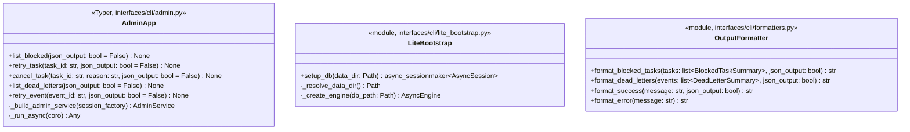

# 詳細設計書 — admin-cli / cli

> feature: `admin-cli` / sub-feature: `cli`
> 親業務仕様: [`../feature-spec.md`](../feature-spec.md)
> 関連: [`basic-design.md`](basic-design.md) / [`../application/detailed-design.md`](../application/detailed-design.md)
> 担当 Issue: [#165 feat(M5-C): admin-cli実装](https://github.com/bakufu-dev/bakufu/issues/165)

## 本書の役割

本書は **階層 3: admin-cli / cli の詳細設計**（Module-level Detailed Design）を凍結する。M5-C の実装者が参照する **コマンド定義・lite Bootstrap 設計・出力フォーマット仕様・MSG 文言** を確定する。

**書くこと**:
- Typer コマンドの詳細パラメータ定義
- lite Bootstrap の確定ステップ
- 出力フォーマット仕様（テーブル列・JSON スキーマ）
- `§確定 A〜D`（M5-C 固有の実装方針）
- MSG 確定文言

**書かないこと**:
- ソースコードそのもの / 疑似コード

## 記述ルール（必ず守ること）

詳細設計に **疑似コード・サンプル実装（python/ts/sh/yaml 等の言語コードブロック）を書かない**。

## クラス設計（詳細）



### Module: AdminApp（`interfaces/cli/admin.py`）

| 属性 / メソッド | 型 / シグネチャ | 制約 | 意図 |
|---|---|---|---|
| Typer app インスタンス | `typer.Typer(name="admin")` | モジュールレベル定数 | `bakufu admin` サブコマンドグループ |
| `list_blocked` | `(json_output: bool = False) -> None` | `typer.Option("--json")` で受け取る | REQ-AC-CLI-001 |
| `retry_task` | `(task_id: str, json_output: bool = False) -> None` | `task_id` は `typer.Argument()` | REQ-AC-CLI-002 |
| `cancel_task` | `(task_id: str, reason: str = "Admin CLI による手動キャンセル", json_output: bool = False) -> None` | `reason` は `typer.Option("--reason")` | REQ-AC-CLI-003 |
| `list_dead_letters` | `(json_output: bool = False) -> None` | `typer.Option("--json")` | REQ-AC-CLI-004 |
| `retry_event` | `(event_id: str, json_output: bool = False) -> None` | `event_id` は `typer.Argument()` | REQ-AC-CLI-005 |
| `_build_admin_service` | `(session_factory) -> AdminService` | private。DI 組み立てを集約 | テスト時に差し替え可能にする |
| `_run_async` | `(coro: Coroutine) -> Any` | `asyncio.run(coro)` のラッパー | 非同期 AdminService メソッドを同期コンテキストから呼ぶ |

### Module: LiteBootstrap（`interfaces/cli/lite_bootstrap.py`）

| メソッド | シグネチャ | 制約 | 意図 |
|---|---|---|---|
| `setup_db` | `(data_dir: Path | None = None) -> async_sessionmaker[AsyncSession]` | async 関数。`data_dir=None` 時は `BAKUFU_DATA_DIR` 環境変数を参照 | DB 接続確立（§確定 A の lite Bootstrap）|
| `_resolve_data_dir` | `() -> Path` | `BAKUFU_DATA_DIR` が未設定 / 不在 → `MSG-AC-CLI-001` で Fail Fast | DATA_DIR 解決 |
| `_create_engine` | `(db_path: Path) -> AsyncEngine` | WAL モード設定。接続失敗 → `MSG-AC-CLI-001` で Fail Fast | SQLite asyncio engine 生成 |

### Module: OutputFormatter（`interfaces/cli/formatters.py`）

| 関数 | シグネチャ | 制約 | 意図 |
|---|---|---|---|
| `format_blocked_tasks` | `(tasks: list[BlockedTaskSummary], json_output: bool) -> str` | 0 件時は "（BLOCKED Task はありません）" を返す（JSON 時は `[]`）| list-blocked 出力 |
| `format_dead_letters` | `(events: list[DeadLetterSummary], json_output: bool) -> str` | 0 件時は "（dead-letter Event はありません）" を返す（JSON 時は `[]`）| list-dead-letters 出力 |
| `format_success` | `(message: str, json_output: bool) -> str` | JSON 時は `{"result": "ok", "message": "<message>"}` | 変更コマンドの成功出力 |
| `format_error` | `(message: str) -> str` | 常に文字列返却（`[FAIL] <message>` 形式）| stderr 出力用 |

## 確定事項（先送り撤廃）

### 確定 A: lite Bootstrap は Stage 1（DATA_DIR 解決）+ Stage 4（DB engine 初期化）のみ実行する

フル Bootstrap の 8 Stage のうち、admin-cli に必要なのは以下のみ:

| Bootstrap Stage | admin-cli での扱い |
|---|---|
| Stage 1: DATA_DIR 確認 | **実施**（DB ファイルパスの解決に必須）|
| Stage 2: umask 設定 | **スキップ**（DB ファイルは既存。新規作成しない前提）|
| Stage 3: Alembic migration | **スキップ**（bakufu サーバーが起動時に適用済みと前提。CLI は migration を実行しない）|
| Stage 4: SQLAlchemy engine + sessionmaker 初期化 | **実施**（DB 接続確立に必須）|
| Stage 5: attachment root 確認 | **スキップ**（CLI は添付ファイルを扱わない）|
| Stage 6: Outbox Dispatcher 起動 | **スキップ**（CLI は short-lived プロセス）|
| Stage 6.5: StageWorker 起動 | **スキップ**（同上）|
| Stage 7: pid_registry GC | **スキップ**（CLI は LLM subprocess を起動しない）|
| Stage 8: FastAPI 起動 | **スキップ**（CLI は HTTP サーバーを起動しない）|

`LiteBootstrap.setup_db()` は `asyncio.run()` 内で同期的に実行される。`async_sessionmaker` を返却し、AdminService DI に渡す。

**DB ファイル不在時の挙動**: `BAKUFU_DATA_DIR` が指す DB ファイルが存在しない場合は MSG-AC-CLI-001 を stderr に出力して exit 1。CLI は DB ファイルを新規作成しない（既存の bakufu 実行環境が前提）。

**根拠**: admin-cli は bakufu サーバーが稼働中の DB に対して操作を行う。Migration 適用はサーバー起動時の責務（Bootstrap Stage 3）。CLI が Migration を重複実行することは Lock 競合のリスクになる。

### 確定 B: UUID パースエラーは Typer callback で Fail Fast する

`task_id` / `event_id` の引数が有効な UUID v4 文字列でない場合、AdminService を呼ぶ前に Typer コマンド内で `UUID(task_id)` を試み、`ValueError` を catch して MSG-AC-CLI-002 を stderr に出力し exit 1 する。

AdminService は `TaskId`（UUID 型）を受け取ることを前提とし、文字列 UUID のパースを行わない（責務の分離）。

**根拠**: Fail Fast 原則。UUID 形式でない引数はそもそも有効な Task / Event を識別できないため、DB アクセス前に拒否する。これにより AdminService への不正入力を構造的に排除できる。

### 確定 C: コマンドの exit code は 0（成功）/ 1（エラー）の 2 値

`typer.Exit(code=0)` / `typer.Exit(code=1)` のみを使用する。

| 状況 | exit code |
|-----|-----------|
| コマンド成功（list 0 件を含む）| 0 |
| UUID パースエラー | 1 |
| DB 接続失敗 | 1 |
| 業務エラー（Task 不在 / 状態不正 等）| 1 |
| 予期しない例外 | 1 |

**根拠**: UNIX CLI の慣習（0=成功、非ゼロ=失敗）。スクリプト連携時に `$?` でエラー判定できる。

### 確定 D: 出力フォーマットの詳細仕様

#### `list-blocked` テーブル形式

| カラム名 | 元フィールド | フォーマット |
|---------|------------|------------|
| TASK ID | `BlockedTaskSummary.task_id` | UUID 文字列（full）|
| ROOM ID | `BlockedTaskSummary.room_id` | UUID 文字列（full）|
| BLOCKED AT | `BlockedTaskSummary.blocked_at` | `YYYY-MM-DD HH:MM:SS UTC` |
| LAST ERROR | `BlockedTaskSummary.last_error` | 先頭 80 文字（超過分は `...` でトランケート）|

`tabulate(tablefmt="simple")` を使用。

#### `list-blocked` JSON 形式（`--json`）

```
[
  {
    "task_id": "<uuid>",
    "room_id": "<uuid>",
    "blocked_at": "<ISO 8601 UTC>",
    "last_error": "<str>"
  },
  ...
]
```

#### `list-dead-letters` テーブル形式

| カラム名 | 元フィールド | フォーマット |
|---------|------------|------------|
| EVENT ID | `DeadLetterSummary.event_id` | UUID 文字列（full）|
| KIND | `DeadLetterSummary.event_kind` | 文字列（64 文字以内）|
| AGGREGATE ID | `DeadLetterSummary.aggregate_id` | UUID 文字列（full）|
| ATTEMPTS | `DeadLetterSummary.attempt_count` | 整数 |
| UPDATED AT | `DeadLetterSummary.updated_at` | `YYYY-MM-DD HH:MM:SS UTC` |
| LAST ERROR | `DeadLetterSummary.last_error` | 先頭 80 文字（超過分は `...`）/ None 時は `-` |

#### `list-dead-letters` JSON 形式（`--json`）

```
[
  {
    "event_id": "<uuid>",
    "event_kind": "<str>",
    "aggregate_id": "<uuid>",
    "attempt_count": <int>,
    "last_error": "<str | null>",
    "updated_at": "<ISO 8601 UTC>"
  },
  ...
]
```

#### 変更コマンド（retry-task / cancel-task / retry-event）の成功出力

テーブル形式（デフォルト）: `[OK] Task {task_id} を IN_PROGRESS に変更しました。` 等の確定文言を stdout に出力。

JSON 形式（`--json`）: `{"result": "ok", "command": "<command>", "id": "<uuid>"}` を stdout に出力。

**根拠**: CLI の `--json` フラグはスクリプト連携用。変更コマンドも JSON で確認できることでスクリプトが `jq '.result'` でパース可能になる。

## 設計判断の補足

### なぜ Typer を採用するのか

既存 bakufu は CLI フレームワークを持たない（`main.py` は FastAPI 起動スクリプト）。Typer は:
- Python 3.12+ の型アノテーションと完全統合（`str` / `bool` 引数を型安全に宣言できる）
- FastAPI と同じ作者（sebastián-ramirez）による設計で、既存チームの習熟コストが低い
- `typer.Typer(name="admin")` でサブコマンドグループを自然に定義できる

Click は Typer の基盤ライブラリだが、型アノテーション統合が Typer より劣るため不採用。

出典: [Typer 公式ドキュメント](https://typer.tiangolo.com/)

### なぜ lite Bootstrap で Alembic Migration をスキップするのか

§確定 A に記載の通り。加えて、SQLite の WAL モードでは読み書きが並行できるが、Alembic の DDL 操作（`ALTER TABLE` 等）は排他ロックを要求する。bakufu サーバーが起動中に CLI が Migration を再実行すると Lock タイムアウトが発生するリスクがある。CLI は "DB は既にマイグレーション済み" を前提とし、接続確立のみを行う。

## ユーザー向けメッセージの確定文言

### プレフィックス統一

| プレフィックス | 意味 |
|---|---|
| `[FAIL]` | 処理中止を伴う失敗 |
| `[OK]` | 成功完了 |

### MSG 確定文言表（CLI レイヤー固有）

| ID | 出力先 | 文言（1 行目: failure / 2 行目: next action）|
|---|---|---|
| MSG-AC-CLI-001 | stderr | `[FAIL] bakufu DB に接続できませんでした（path: {db_path}）。` / `Next: BAKUFU_DATA_DIR 環境変数と DB ファイルの存在を確認してください。` |
| MSG-AC-CLI-002 | stderr | `[FAIL] {arg_name} が有効な UUID ではありません: {raw_value}` / `Next: 'bakufu admin list-blocked' または 'bakufu admin list-dead-letters' で正しい ID を確認してください。` |

### MSG 確定文言表（変更コマンド成功出力）

| コマンド | stdout 文言 |
|---|---|
| `retry-task <task_id>` | `[OK] Task {task_id} を BLOCKED → IN_PROGRESS に変更しました。bakufu サーバーの StageWorker が自動的に再実行します。` |
| `cancel-task <task_id>` | `[OK] Task {task_id} を CANCELLED に変更しました。` |
| `retry-event <event_id>` | `[OK] Outbox Event {event_id} を DEAD_LETTER → PENDING にリセットしました。Outbox Dispatcher が次回ポーリングで再 dispatch します。` |

application 層の MSG（MSG-AC-001〜005）の確定文言は [`../application/detailed-design.md §MSG 確定文言表`](../application/detailed-design.md) で凍結。CLI はそれらを stderr にそのまま転送する。

## データ構造（永続化キー）

該当なし — 理由: 本 sub-feature は永続化を直接担当しない。DB アクセスは AdminService / Port 経由で行われ、具体的なテーブル構造は [`../application/detailed-design.md §データ構造`](../application/detailed-design.md) で定義する。

## API エンドポイント詳細

該当なし — 理由: 本 sub-feature は HTTP API を提供しない。エントリポイントは CLI コマンド（`bakufu admin <subcommand>`）のみ。

## 出典・参考

- [Typer 公式ドキュメント](https://typer.tiangolo.com/) — CLI フレームワーク選定根拠
- [tabulate PyPI](https://pypi.org/project/tabulate/) — テーブル形式出力
- [SQLAlchemy asyncio ドキュメント](https://docs.sqlalchemy.org/en/20/orm/extensions/asyncio.html) — `async_sessionmaker` の使用方法
- [Python asyncio.run()](https://docs.python.org/3/library/asyncio-runner.html) — 同期コンテキストからの非同期実行
