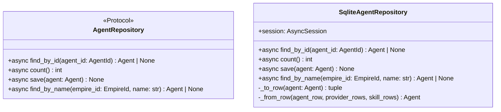

# 詳細設計書

> feature: `agent-repository`
> 関連: [basic-design.md](basic-design.md) / [`docs/features/empire-repository/detailed-design.md`](../empire-repository/detailed-design.md) **テンプレート真実源** / [`docs/features/workflow-repository/detailed-design.md`](../workflow-repository/detailed-design.md) **2 件目テンプレート** / [`docs/features/agent/detailed-design.md`](../agent/detailed-design.md)

## 記述ルール（必ず守ること）

詳細設計に**疑似コード・サンプル実装（python/ts/sh/yaml 等の言語コードブロック）を書かない**。
ソースコードと二重管理になりメンテナンスコストしか生まない。
必要なのは「構造契約（属性名・型・制約）」と「確定文言（メッセージ文字列）」と「実装の意図」。

## クラス設計（詳細）



### Protocol: AgentRepository（`application/ports/agent_repository.py`）

| メソッド | 引数 | 戻り値 | 制約 |
|----|----|----|----|
| `find_by_id(agent_id: AgentId)` | AgentId | `Agent \| None` | 不在時 None。SQLAlchemy 例外は上位伝播 |
| `count()` | なし | `int` | 全 Agent 数（empire-repo §確定 D 同 SQL `COUNT(*)` 契約） |
| `save(agent: Agent)` | Agent | None | 同一 Tx 内で agents + agent_providers + agent_skills を delete-then-insert（empire-repo §確定 B 踏襲）|
| `find_by_name(empire_id: EmpireId, name: str)` | EmpireId + name 文字列 | `Agent \| None` | **第 4 method**、Empire スコープでの一意検査（§確定 R1-C）。不在時 None |

`@runtime_checkable` は付与しない（empire-repo §確定 A）。

### Class: SqliteAgentRepository（`infrastructure/persistence/sqlite/repositories/agent_repository.py`）

| 属性 | 型 | 制約 |
|----|----|----|
| `session` | `AsyncSession` | コンストラクタで注入、Tx 境界は外側 service が管理 |

| 関数 | 引数 | 戻り値 | 制約 |
|----|----|----|----|
| `__init__(session: AsyncSession)` | session | None | session を保持するだけ、Tx は開かない |
| `find_by_id(agent_id)` | AgentId | `Agent \| None` | agents SELECT → 不在なら None。存在すれば agent_providers を `ORDER BY provider_kind` / agent_skills を `ORDER BY skill_id` で SELECT（§BUG-EMR-001 規約）→ `_from_row` で構築 |
| `count()` | なし | int | `select(func.count()).select_from(AgentRow)` で SQL `COUNT(*)`、`scalar_one()` で int 取得。**全行ロード+ Python `len()` パターン禁止** |
| `save(agent)` | Agent | None | §確定 B の delete-then-insert（5 段階手順、後述） |
| `find_by_name(empire_id, name)` | EmpireId + str | `Agent \| None` | `SELECT id FROM agents WHERE empire_id = :empire_id AND name = :name LIMIT 1` で AgentId 取得 → 存在すれば `find_by_id(found_id)` で子テーブル含めて Agent 復元（§確定 G）|
| `_to_row(agent)` | Agent | `tuple[dict, list[dict], list[dict]]` | (agents_row, provider_rows, skill_rows) に分離（empire-repo §確定 C） |
| `_from_row(agent_row, provider_rows, skill_rows)` | dict, list[dict], list[dict] | Agent | VO 構造で復元（§確定 H で `prompt_body` の masked 復元を凍結） |

### Tables（既存 M2 永続化基盤の table モジュール群に追加）

| テーブル | モジュール | カラム |
|----|----|----|
| `agents` | `infrastructure/persistence/sqlite/tables/agents.py`（新規）| `id: UUIDStr PK` / `empire_id: UUIDStr FK CASCADE` / `name: String(40) NOT NULL`（DB UNIQUE なし）/ `role: String(32) NOT NULL` / `display_name: String(80) NOT NULL` / `archetype: String(80) NOT NULL DEFAULT ''` / **`prompt_body: MaskedText NOT NULL DEFAULT ''`** / `archived: Boolean NOT NULL DEFAULT FALSE` |
| `agent_providers` | `infrastructure/persistence/sqlite/tables/agent_providers.py`（新規）| `agent_id: UUIDStr FK CASCADE` / `provider_kind: String(32)` / `model: String(80)` / `is_default: Boolean DEFAULT FALSE` / UNIQUE(agent_id, provider_kind) / **partial unique index `WHERE is_default = 1`** |
| `agent_skills` | `infrastructure/persistence/sqlite/tables/agent_skills.py`（新規）| `agent_id: UUIDStr FK CASCADE` / `skill_id: UUIDStr` / `name: String(80)` / `path: String(500)` / UNIQUE(agent_id, skill_id) |

すべて `bakufu.infrastructure.persistence.sqlite.base.Base` を継承。

## 確定事項（先送り撤廃）

### 確定 A: empire-repo / workflow-repo テンプレート 100% 継承（再凍結）

empire-repository PR #29/#30 の §確定 A〜F + §Known Issues §BUG-EMR-001 規約 + workflow-repository PR #41 の §確定 E（CI 三層防衛 正のチェック）を**そのまま継承**。本 PR で再議論しない項目:

| empire/workflow 確定 | 本 PR への適用 |
|---|---|
| empire §確定 A | `application/ports/agent_repository.py` 新規、Protocol、`@runtime_checkable` なし |
| empire §確定 B | `save()` で agents UPSERT + agent_providers DELETE/INSERT + agent_skills DELETE/INSERT、Repository 内 commit/rollback なし |
| empire §確定 C | `_to_row` / `_from_row` を private method に閉じる |
| empire §確定 D | `count()` は SQL `COUNT(*)` 限定 |
| empire §確定 E | CI 三層防衛 Layer 1 + Layer 2 + Layer 3 全部に Agent 3 テーブル明示登録 |
| empire §BUG-EMR-001 規約 | `find_by_id` 子テーブル SELECT は `ORDER BY provider_kind` / `ORDER BY skill_id` 必須 |
| workflow §確定 E（正のチェック）| `agents.prompt_body` の `MaskedText` 必須を grep + arch test で物理保証 |

### 確定 B: `save()` 5 段階手順（empire-repo §確定 B の Agent 適用）

| 順 | 操作 | SQL（概要） |
|---|---|---|
| 1 | agents UPSERT | `INSERT INTO agents (id, empire_id, name, role, display_name, archetype, prompt_body, archived) VALUES (...) ON CONFLICT (id) DO UPDATE SET name=..., prompt_body=...`（**`prompt_body` は `MaskedText.process_bind_param` 経由でマスキング**）|
| 2 | agent_providers DELETE | `DELETE FROM agent_providers WHERE agent_id = :agent_id` |
| 3 | agent_providers bulk INSERT | `INSERT INTO agent_providers (agent_id, provider_kind, model, is_default) VALUES ...`（agent.providers 件数分）|
| 4 | agent_skills DELETE | `DELETE FROM agent_skills WHERE agent_id = :agent_id` |
| 5 | agent_skills bulk INSERT | `INSERT INTO agent_skills (agent_id, skill_id, name, path) VALUES ...`（agent.skills 件数分）|

##### Tx 境界の責務分離（再凍結）

`SqliteAgentRepository.save()` は **明示的な commit / rollback をしない**。呼び出し側 service が `async with session.begin():` で UoW 境界を管理（empire-repo §確定 B 踏襲）。

### 確定 C: domain ↔ row 変換契約（empire-repo §確定 C の Agent 適用）

##### `_to_row(agent: Agent)` 契約

| 入力 | 出力 |
|---|---|
| `Agent`（Aggregate Root インスタンス） | `tuple[dict, list[dict], list[dict]]` |

戻り値:
1. `agents_row: dict[str, Any]` — `{'id': ..., 'empire_id': ..., 'name': ..., 'role': ..., 'display_name': agent.persona.display_name, 'archetype': agent.persona.archetype, 'prompt_body': agent.persona.prompt_body, 'archived': ...}`
2. `provider_rows: list[dict[str, Any]]` — 各 ProviderConfig を `{'agent_id': ..., 'provider_kind': ..., 'model': ..., 'is_default': ...}` に変換
3. `skill_rows: list[dict[str, Any]]` — 各 SkillRef を `{'agent_id': ..., 'skill_id': ..., 'name': ..., 'path': ...}` に変換

##### `_from_row(agent_row, provider_rows, skill_rows)` 契約

| 入力 | 出力 |
|---|---|
| `agent_row: dict` / `provider_rows: list[dict]` / `skill_rows: list[dict]` | `Agent` |

戻り値: `Agent(id=..., empire_id=..., name=..., role=..., persona=Persona(display_name=..., archetype=..., prompt_body=masked_str), providers=[...], skills=[...], archived=...)`。Aggregate Root の不変条件は構築時の `model_validator(mode='after')` で再走（agent #17 で凍結済み）。

##### masked `prompt_body` 復元の不可逆性凍結（§確定 H）

`prompt_body` は DB 上で masked された文字列で保存されているため、`_from_row` で読み出した値は raw 復元不能。`Persona(prompt_body=masked_str)` で構築するが、当該 Agent を LLM Adapter に配送すると `<REDACTED:*>` が prompt に流れる。MVP では「CEO が再 hire」運用、後続 `feature/llm-adapter` で警告経路を凍結（§Known Issues §申し送り）。

### 確定 D: `count()` SQL 契約（empire-repo §確定 D 踏襲）

| 採用 | 不採用 | 理由 |
|---|---|---|
| `select(func.count()).select_from(AgentRow)` で SQL `COUNT(*)` 発行、`scalar_one()` で int 取得 | `select(AgentRow.id)` で全行を取得して Python `len(list(result.scalars().all()))` | 後続 PR が `count()` を実装する際、本 PR の実装パターンを真似する。Agent provider / skill は 100+ 件まで膨れ得るため、**全行ロード+ Python `len()` パターン伝播禁止** |

### 確定 E: CI 三層防衛 Agent 拡張（**正/負のチェック併用**、workflow-repo §確定 E パターン）

##### Layer 1: grep guard（`scripts/ci/check_masking_columns.sh`）

| 登録内容 | 期待結果 |
|---|---|
| `tables/agents.py` の `prompt_body` カラム宣言行に `MaskedText` が含まれる | grep ヒット必須 → pass（**正のチェック**、Schneier #3 実適用 grep 物理保証）|
| `tables/agents.py` の `prompt_body` 以外のカラムに `MaskedText` / `MaskedJSONEncoded` が登場しない | grep 1 ヒット限定 → pass（過剰マスキング防止）|
| `tables/agent_providers.py` 全体に `MaskedText` / `MaskedJSONEncoded` が登場しない | grep ゼロヒット → pass |
| `tables/agent_skills.py` 全体に同上 | 同上 |

##### Layer 2: arch test（`backend/tests/architecture/test_masking_columns.py`）

| 入力 | 期待 assertion |
|---|---|
| `Base.metadata.tables['agents']` の `prompt_body` カラム | `column.type.__class__ is MaskedText`（**正のチェック**）|
| `Base.metadata.tables['agents']` の `prompt_body` 以外のカラム | `column.type.__class__` が `MaskedText` でも `MaskedJSONEncoded` でもない |
| `Base.metadata.tables['agent_providers']` | 全カラム masking なし |
| `Base.metadata.tables['agent_skills']` | 全カラム masking なし |

##### Layer 3: storage.md 逆引き表更新（REQ-AGR-005）

`docs/architecture/domain-model/storage.md` §逆引き表に Agent 関連 2 行追加（既存 `Persona.prompt_body` 行は本 PR で実適用済みに更新）。

### 確定 F: `find_by_name(empire_id, name)` 第 4 method 契約（§確定 R1-C 詳細）

##### 採用方針: Empire スコープで `(empire_id, name)` 複合検索

| 候補 | 採否 | 理由 |
|---|---|---|
| **(a) `find_by_name(empire_id, name)` で `WHERE empire_id=? AND name=?`** | ✓ 採用 | name 一意性が Empire 内なので empire_id を必須引数にとる |
| (b) `find_by_name(name)` で全 Empire を検索 | ✗ 不採用 | 異 Empire で同 name を持つ Agent が存在し得るため、複数行返って判定が壊れる |
| (c) `find_by_id` を全件 SELECT して filter | ✗ 不採用 | N+1、後続 PR が真似すると数千 Agent でメモリ枯渇 |

##### 実装契約

| 段階 | 動作 |
|---|---|
| 1 | `SELECT id FROM agents WHERE empire_id = :empire_id AND name = :name LIMIT 1` で AgentId 取得 |
| 2 | 不在なら `None` を返す |
| 3 | 存在すれば `await self.find_by_id(found_id)` を呼んで子テーブル含めて Agent 復元 |
| 4 | Agent or `None` を返す（None は概念上「ヒットしたが復元失敗」が起こり得ないので返らない、Step 1 で None 確定）|

##### `find_by_id` 経由で復元する根拠

`find_by_name` が独立して agents + agent_providers + agent_skills の 3 SELECT を実装すると、`find_by_id` のロジックと重複する。`_from_row` 系の責務散在を防ぐため、**`find_by_name` は AgentId だけ取得 → `find_by_id` に委譲**する。

### 確定 G: `is_default` partial unique index 二重防衛（§確定 R1-D 詳細）

##### Alembic での生成

```
op.create_index(
    'uq_agent_providers_default',
    'agent_providers',
    ['agent_id'],
    unique=True,
    sqlite_where=sa.text('is_default = 1'),
)
```

##### 違反時の挙動

| 経路 | 違反検出層 | 例外 |
|---|---|---|
| Aggregate 内（既存）| `_validate_provider_is_default_unique` で list を走査（agent #17 凍結） | `AgentInvariantViolation(kind='default_provider_uniqueness')` |
| **DB partial unique index（本 PR 新規）** | INSERT/UPDATE で `WHERE is_default=1` の集合に違反する行が来たら raise | `sqlalchemy.IntegrityError` |

二重防衛の意図: Aggregate 検査が壊れた場合（VO バグ / 直 SQL 流入）の最終防衛線として DB レベルで物理拒否、Defense in Depth。

### 確定 H: `prompt_body` masking の不可逆性凍結（Schneier #3 実適用の副作用）

##### 採用方針: masking は永続化前のみ実施、復元時は復元できないことを許容

`agents.prompt_body` は **`MaskedText.process_bind_param` で永続化前マスキング**。`MaskingGateway.mask()` は不可逆操作（API key 形式正規表現マッチ → `<REDACTED:ANTHROPIC_KEY>` 等）で、DB から読み出した文字列から元の token は復元できない。

| シナリオ | 想定挙動 |
|---|---|
| `save(agent)` で raw `prompt_body='ANTHROPIC_API_KEY=sk-ant-XXX...'` を渡す | DB には `<REDACTED:ENV:ANTHROPIC_API_KEY>` or `<REDACTED:ANTHROPIC_KEY>` が永続化（適用順序は storage.md §マスキング規則の通り）|
| `find_by_id(agent.id)` で復元 | `Persona.prompt_body` には masked 文字列が入る、Pydantic 構築は通過（PROMPT_BODY_MAX 内、文字種制約なし）|
| LLM Adapter が `Persona.prompt_body` を prompt に展開 | `<REDACTED:*>` がそのまま LLM に流れる、品質劣化 |

##### 申し送り（Agent 後続申し送り #1）: LLM Adapter での masked 検出 + 警告

後続 `feature/llm-adapter` で「`Persona.prompt_body` に `<REDACTED:*>` を含む Agent はログ警告 + 配送停止」契約を凍結する責務。本 PR では Repository 層の masking 不可逆性のみ凍結し、配送側は範囲外。

| 候補 | 採否 |
|---|---|
| (a) Repository が復元時に masked 検出して警告を上げる | ✗ 不採用（Repository は単機能 CRUD、警告は LLM Adapter / application 層責務） |
| (b) `Persona` VO 側で masked 検出 | ✗ 不採用（VO は raw / masked を区別せず保持、構造的制約のみ）|
| **(c) `feature/llm-adapter` で配送前検出 + 警告 + 配送停止** | ✓ **採用**（責務分離、本 PR は masking 適用のみで完結） |

### 確定 I: テスト責務の 4 ファイル分割（empire-repo PR #29 / workflow-repo PR #41 教訓を最初から反映）

empire-repo PR #29 で 506 行 → 500 行ルール違反でディレクトリ分割した教訓、workflow-repo PR #41 で 502 行 → 同じく分割した教訓を踏襲。本 PR は**最初から 4 ファイル分割**:

| ファイル | 責務 |
|---|---|
| `test_agent_repository/test_protocol_crud.py` | save → find_by_id 経路の正常系、count() の SQL 契約、find_by_name の Empire スコープ検索 |
| `test_agent_repository/test_save_semantics.py` | delete-then-insert の物理保証、ORDER BY 規約（§BUG-EMR-001 継承）|
| `test_agent_repository/test_constraints_arch.py` | UNIQUE 制約 / **partial unique index `WHERE is_default=1`** / FK CASCADE / pyright Protocol 充足 |
| `test_agent_repository/test_masking_persona.py` | **Schneier #3 実適用専用**: raw `prompt_body` を渡して DB に `<REDACTED:*>` が永続化されることを raw SQL で物理確認、masking 不可逆性の物理確認 |

各ファイルは 200 行を目安、500 行ルール厳守。

## 設計判断の補足

### なぜ `find_by_name` を Protocol に追加するか（empire-repo の 3 method を超える初の Repository）

empire-repo §確定 A では Protocol を 3 method（find_by_id / count / save）で凍結したが、Agent には「name の Empire 内一意」という Aggregate 不変条件のうち**集合知識**（DB SELECT を要する）が必要。application 層が `find_by_id` を全件呼び出して filter する実装は N+1 / メモリ枯渇のテンプレを後続 PR に伝染させる経路（empire-repo §確定 D の `count()` 教訓と同方針）。

`find_by_name(empire_id, name)` を Repository に追加することで、**Aggregate 不変条件の集合知識を Repository が SQL レベルで吸収**する責務分離テンプレートを確立。後続 PR（room / directive / task）が同パターンを真似できる。

### なぜ `agents.name` に DB UNIQUE を張らないか

`agents(empire_id, name)` の複合 UNIQUE を張ると、application 層が MSG-AG-NNN を出す前に `IntegrityError` が raise され、ユーザー向けメッセージの統一が崩れる（agent feature §確定 R1-B 凍結済みの責務分離方針）。`find_by_name` 経由で application 層検査の経路を残し、DB UNIQUE は張らない。

`is_default` の partial unique index は別問題（§確定 G）: こちらは Aggregate 内検査の最終防衛線として **DB レベルで物理拒否**することに意味がある（壊れたデータが Aggregate 復元時に valid 判定をすり抜ける経路を物理的に塞ぐ）。

### なぜ `prompt_body` を `MaskedText` にするか（Schneier #3 実適用の根拠）

CEO が persona 設計時に prompt_body に「`環境変数 ANTHROPIC_API_KEY=sk-ant-...` を使え」と書く経路は現実にあり得る。masking しないと:

1. DB 直読み / バックアップで token 流出
2. SQL ログで token 流出
3. 監査ログで token 流出
4. 後続 PR の `find_all()` 系で token 流出

application 層でマスキングする方針は実装漏れリスクが高く、**永続化前の単一ゲートウェイ**（persistence-foundation §確定 R1-D）を信じて `MaskedText` で TypeDecorator 経由のマスキング強制が正解。

## ユーザー向けメッセージの確定文言

該当なし — 理由: Repository は内部 API、ユーザー向けメッセージは application 層 / HTTP API 層が定義する。Repository は SQLAlchemy 例外 + `pydantic.ValidationError` を上位伝播するのみ。

## データ構造（永続化キー）

### `agents` テーブル

| カラム | 型 | 制約 | 意図 |
|----|----|----|----|
| `id` | `UUIDStr` | PK, NOT NULL | AgentId |
| `empire_id` | `UUIDStr` | FK → `empires.id` ON DELETE CASCADE, NOT NULL | 所属 Empire |
| `name` | `String(40)` | NOT NULL（DB UNIQUE なし、application 層責務）| 表示名 |
| `role` | `String(32)` | NOT NULL（Role enum）| 役割テンプレ |
| `display_name` | `String(80)` | NOT NULL | Persona.display_name |
| `archetype` | `String(80)` | NOT NULL DEFAULT '' | Persona.archetype |
| `prompt_body` | **`MaskedText`** | NOT NULL DEFAULT '' | Persona.prompt_body（**Schneier #3 実適用、§確定 H 不可逆性凍結**）|
| `archived` | `Boolean` | NOT NULL DEFAULT FALSE | アーカイブ状態 |

### `agent_providers` テーブル

| カラム | 型 | 制約 | 意図 |
|----|----|----|----|
| `agent_id` | `UUIDStr` | FK → `agents.id` ON DELETE CASCADE, NOT NULL | 所属 Agent |
| `provider_kind` | `String(32)` | NOT NULL（ProviderKind enum）| LLM プロバイダ |
| `model` | `String(80)` | NOT NULL | model 名 |
| `is_default` | `Boolean` | NOT NULL DEFAULT FALSE | 既定 provider |
| UNIQUE | `(agent_id, provider_kind)` | — | 同 Agent 内で provider_kind 重複禁止 |
| **partial unique** | `(agent_id) WHERE is_default = 1` | — | **§確定 G 二重防衛、Aggregate `_validate_provider_is_default_unique` の最終防衛線** |

### `agent_skills` テーブル

| カラム | 型 | 制約 | 意図 |
|----|----|----|----|
| `agent_id` | `UUIDStr` | FK → `agents.id` ON DELETE CASCADE, NOT NULL | 所属 Agent |
| `skill_id` | `UUIDStr` | NOT NULL | SkillId |
| `name` | `String(80)` | NOT NULL | SkillRef.name |
| `path` | `String(500)` | NOT NULL | SkillRef.path（H1〜H10 検証は VO 構築時に完了済み）|
| UNIQUE | `(agent_id, skill_id)` | — | 同 Agent 内で skill_id 重複禁止 |

### Alembic 4th revision キー構造（`0004_agent_aggregate.py`）

| 項目 | 値 |
|----|----|
| revision id | `0004_agent_aggregate`（固定） |
| down_revision | `0003_workflow_aggregate`（workflow-repo PR #41 で凍結済み）|

| 操作 | 対象 |
|----|----|
| `op.create_table('agents', ...)` | 8 カラム |
| `op.create_table('agent_providers', ...)` | 4 カラム + UNIQUE(agent_id, provider_kind) |
| `op.create_index('uq_agent_providers_default', 'agent_providers', ['agent_id'], unique=True, sqlite_where=sa.text('is_default = 1'))` | partial unique index |
| `op.create_table('agent_skills', ...)` | 4 カラム + UNIQUE(agent_id, skill_id) |

`downgrade()` は `op.drop_table` で逆順実行（agent_skills → agent_providers → agents、CASCADE で子から先に削除）。

##### Alembic chain 一直線の物理保証

CI で head が分岐していないことを検査する既存スクリプト（M2 永続化基盤で凍結）が `0001 → 0002 → 0003 → 0004` の単一 chain を assert。

## API エンドポイント詳細

該当なし — 理由: 本 feature は infrastructure 層のみ。HTTP API は `feature/http-api` で凍結する。

## Known Issues

### 申し送り #1: masked `prompt_body` の LLM Adapter 配送経路（§確定 H）

`find_by_id` で復元される Agent の `Persona.prompt_body` には masked 文字列が入る。LLM Adapter が prompt に展開すると `<REDACTED:*>` がそのまま流れて品質劣化。後続 `feature/llm-adapter` で「masked 検出 + ログ警告 + 配送停止」契約を凍結する責務（本 PR スコープ外）。

## 出典・参考

- [SQLAlchemy 2.0 — async / AsyncEngine / AsyncSession](https://docs.sqlalchemy.org/en/20/orm/extensions/asyncio.html)
- [SQLAlchemy 2.0 — TypeDecorator](https://docs.sqlalchemy.org/en/20/core/custom_types.html#augmenting-existing-types) — `MaskedText` の `process_bind_param` 経路
- [SQLite — Partial Indexes](https://www.sqlite.org/partialindex.html) — §確定 G の `WHERE is_default = 1` 根拠
- [Alembic Tutorial](https://alembic.sqlalchemy.org/en/latest/tutorial.html)
- [`docs/features/persistence-foundation/`](../persistence-foundation/) — M2 永続化基盤（PR #23、`MaskedText` + Schneier #3 hook 構造）
- [`docs/features/empire-repository/`](../empire-repository/) — **テンプレート真実源**（§確定 A〜F + §BUG-EMR-001 規約）
- [`docs/features/workflow-repository/`](../workflow-repository/) — **2 件目テンプレート**（masking 対象あり版、CI 三層防衛 正のチェック）
- [`docs/features/agent/`](../agent/) — Agent domain 設計（PR #17 マージ済み、§確定 K で `is_default` 一意性、§確定 H で SkillRef path 検証 H1〜H10 凍結）
- [`docs/architecture/domain-model/storage.md`](../../architecture/domain-model/storage.md) — 逆引き表（本 PR で Agent 行追加 + 既存 `Persona.prompt_body` 行を実適用済みに更新）
- [`docs/architecture/threat-model.md`](../../architecture/threat-model.md) — A02 / A04 / A08 / A09 対応根拠
