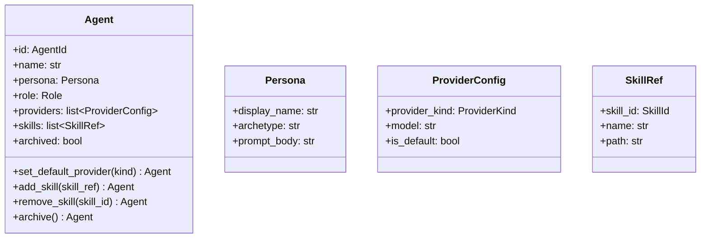

# 詳細設計書

> feature: `agent`
> 関連: [basic-design.md](basic-design.md) / [`docs/architecture/domain-model/aggregates.md`](../../architecture/domain-model/aggregates.md) §Agent

## 記述ルール（必ず守ること）

詳細設計に**疑似コード・サンプル実装（python/ts/sh/yaml 等の言語コードブロック）を書かない**。
ソースコードと二重管理になりメンテナンスコストしか生まない。
必要なのは「構造契約（属性名・型・制約）」と「確定文言（メッセージ文字列）」と「実装の意図」。

## クラス設計（詳細）

### Aggregate Root: Agent

| 属性 | 型 | 制約 | 意図 |
|----|----|----|----|
| `id` | `AgentId`（UUIDv4） | 不変 | 一意識別 |
| `name` | `str` | 1〜40 文字（NFC 正規化、前後空白除去後）| 表示名 |
| `persona` | `Persona`（VO） | — | キャラクター設定 |
| `role` | `Role`（enum） | — | 役割テンプレ |
| `providers` | `list[ProviderConfig]` | 1〜10 件、`provider_kind` 重複なし、`is_default == True` が 1 件のみ | LLM プロバイダ設定 |
| `skills` | `list[SkillRef]` | 0〜20 件、`skill_id` 重複なし | スキル参照 |
| `archived` | `bool` | デフォルト False | アーカイブ状態 |

`model_config`:
- `frozen = True`
- `arbitrary_types_allowed = False`
- `extra = 'forbid'`

**不変条件（model_validator(mode='after')）**:
1. `name` は 1〜40 文字
2. `providers` は 1 件以上、上限 10 件
3. `providers` 内 `provider_kind` の重複なし
4. `providers` 内 `is_default == True` が **ちょうど 1 件**
5. `skills` 上限 20 件、`skill_id` 重複なし

**不変条件（application 層責務）**:
- 同 Empire 内の他 Agent との `name` 衝突なし — `AgentService.hire()` が Repository SELECT で判定

**ふるまい**:
- `set_default_provider(provider_kind: ProviderKind) -> Agent`: 指定プロバイダの `is_default=True` に切替（他は False）
- `add_skill(skill_ref: SkillRef) -> Agent`: skills に追加
- `remove_skill(skill_id: SkillId) -> Agent`: skills から削除
- `archive() -> Agent`: `archived=True` の**新 Agent インスタンス**を返す。既に `archived=True` の Agent に対しても同手順（`model_validate` 再構築）で**新インスタンス**を返す（冪等性は結果状態の同値性で担保、オブジェクト同一性ではない）。詳細は §確定 D

### Value Object: Persona

| 属性 | 型 | 制約 |
|----|----|----|
| `display_name` | `str` | 1〜40 文字（NFC 正規化）|
| `archetype` | `str` | 0〜80 文字（例: "イーロン・マスク風 CEO"）|
| `prompt_body` | `str` | 0〜10000 文字、Markdown |

`model_config.frozen = True`。`prompt_body` の永続化前マスキングは Repository 層で適用（[`storage.md`](../../architecture/domain-model/storage.md)）。

### Value Object: ProviderConfig

| 属性 | 型 | 制約 |
|----|----|----|
| `provider_kind` | `ProviderKind`（enum） | enum 定義は CLAUDE_CODE / CODEX / GEMINI / OPENCODE / KIMI / COPILOT の 6 種。**MVP で LLM Adapter が実装されているのは CLAUDE_CODE のみ**。詳細は §確定 I |
| `model` | `str` | 1〜80 文字（例: "sonnet" / "opus" / "gpt-5-codex"） |
| `is_default` | `bool` | — |

`model_config.frozen = True`。

### Value Object: SkillRef

| 属性 | 型 | 制約 |
|----|----|----|
| `skill_id` | `SkillId`（UUIDv4） | 不変 |
| `name` | `str` | 1〜80 文字（§確定 E の正規化パイプライン NFC + strip 適用後）|
| `path` | `str` | §確定 H の path traversal 防御を**完全充足**する `bakufu-data/skills/<rest>` 形式の POSIX 相対パスのみ。違反時は `AgentInvariantViolation(kind='skill_path_invalid')` を Fail Fast |

`model_config.frozen = True`。

### 確定 H: SkillRef.path の path traversal 防御（VO レベルでの第一防衛線）

[`docs/architecture/threat-model.md`](../../architecture/threat-model.md) §A1 添付ファイル経路の方針（NFC 正規化 + 拒否文字 + `os.path.basename()` 二重防護を VO レベルで強制）に揃える。Empire / Workflow が `Attachment.filename` を VO 受領時に Fail Fast している方針の **path 版**を本書で凍結する。

**「別 feature 責務」と書かない**: ファイル配信レイヤ（Phase 2 の Skill ローダー）でも検証するが、**VO レベルが第一防衛線**。Defense in Depth の崩壊を防ぐ。

#### 検査仕様（順序固定、`field_validator('path', mode='after')` で実行）

| # | 検査項目 | 規則 | 違反時の Fail Fast 理由 |
|---|----|----|----|
| H1 | NFC 正規化 | `unicodedata.normalize('NFC', raw_path)` を最初に適用 | 同形異字符・分解形による迂回を物理層で塞ぐ |
| H2 | 文字数 | `1 <= len(normalized) <= 500` | DoS / メモリ攻撃防御、Empire / Workflow と同方針 |
| H3 | 拒否文字 | NUL（`\0`）/ ASCII 制御文字（0x00〜0x1F、0x7F）/ バックスラッシュ（`\`）を含む場合は拒否 | NUL バイト経由の文字列終端攻撃 / Windows パス区切り混入 |
| H4 | 先頭文字 | 先頭が `/`（POSIX 絶対パス）/ Windows 絶対パス（`^[A-Za-z]:[\\/]`）/ `~`（ホームディレクトリ）の場合は拒否 | 絶対パス経由の base directory escape |
| H5 | path traversal シーケンス | 連続した `..`、先頭 / 末尾の `.`、先頭 / 末尾の空白を含む場合は拒否 | `../` による parent 参照 |
| H6 | パース | `pathlib.PurePosixPath(normalized)` で正規化、`parts` を取得 | プラットフォーム独立の path 解釈 |
| H7 | プレフィックス | `parts[0] == 'bakufu-data'` かつ `parts[1] == 'skills'` を強制（`len(parts) >= 3` 必須）| skills 配下以外への参照を物理層で拒否 |
| H8 | 各 part の正規化 | 全 `parts` に対し各々 H3 の拒否文字検査を再実行（PurePosixPath 経由でも残る制御文字を再確認）| パース後にも残る攻撃文字列の検出 |
| H9 | Windows 予約名 | 任意の `parts[i]` が `CON` / `PRN` / `AUX` / `NUL` / `COM1`〜`COM9` / `LPT1`〜`LPT9`（拡張子有無問わず、case-insensitive）に一致する場合は拒否 | クロスプラットフォーム互換性 / Empire `Attachment.filename` と同方針 |
| H10 | 物理 base escape 検証 | `(BAKUFU_DATA_DIR / normalized).resolve()` が `(BAKUFU_DATA_DIR / 'skills').resolve()` の subpath であることを `Path.is_relative_to()` で確認。symlink 経由の escape も resolve() で検出される | base directory escape の物理保証（実 filesystem に問い合わせる最終防衛線） |

すべての検査は `field_validator('path', mode='after')` で実行し、違反時は `AgentInvariantViolation(kind='skill_path_invalid')` を Fail Fast。`detail` に違反した検査項目（H1〜H10 のいずれか）を含める。

**`BAKUFU_DATA_DIR` の解決**: `os.environ.get('BAKUFU_DATA_DIR')` 経由で取得（[`storage.md`](../../architecture/domain-model/storage.md) §物理配置 と同じ規約）。`AgentInvariantViolation` 生成時にこの環境変数が未設定の場合は H10 を skip し、`AgentInvariantViolation(kind='skill_path_invalid', detail={'check': 'H10', 'reason': 'BAKUFU_DATA_DIR not set'})` を raise する（Fail Fast、後段の Skill ローダーで未検証のまま動作させない）。

#### 拒否すべき入力例（テストでカバー必須）

| 入力 | 拒否理由 |
|---|---|
| `'bakufu-data/skills/../etc/passwd'` | H5（連続 `..`）|
| `'/etc/passwd'` | H4（POSIX 絶対）|
| `'C:\\Windows\\system32'` | H3（バックスラッシュ）+ H4（Windows 絶対）|
| `'~/secret/file'` | H4（ホーム展開）|
| `'bakufu-data/skills/sub/../../../escape'` | H10（resolve 後 base escape）|
| `'bakufu-data\\skills\\test'` | H3（バックスラッシュ）|
| `'bakufu-data/skills/file\0.md'` | H3（NUL バイト）|
| `'bakufu-data/skills/CON'` | H9（Windows 予約名）|
| `'wrong-prefix/skills/file'` | H7（prefix 不正）|
| `'bakufu-data/wrong/file'` | H7（subdir 不正）|
| `' bakufu-data/skills/file'` | H5（先頭空白）|
| `'bakufu-data/skills/'` | H7（末尾なし、`len(parts) < 3`）|
| `'a' * 501` | H2（500 文字超過）|

#### Empire `Attachment.filename` との関係

| 項目 | Empire `Attachment.filename` | Agent `SkillRef.path` |
|---|---|---|
| 対象 | 単一ファイル名（パス無し） | 多階層パス |
| 防御範囲 | basename のみ | 階層全体 + base directory escape |
| `os.path.basename()` 二重防護 | ✓ | ✓（H8 で各 part に対し再検査）|
| 実 filesystem 検証 | content-addressable（sha256）で迂回不能 | ✓（H10 で `is_relative_to()` 物理確認）|

両者は **責務が異なるが、`threat-model.md` §A1 の「VO レベル多層防御」原則を共有**する。「別 feature 責務」として VO 検証を放棄しない。

### Exception: AgentInvariantViolation

| 属性 | 型 | 制約 |
|----|----|----|
| `message` | `str` | MSG-AG-NNN 由来 |
| `detail` | `dict[str, object]` | 違反の文脈 |
| `kind` | `Literal['name_range', 'no_provider', 'default_not_unique', 'provider_duplicate', 'persona_too_long', 'provider_not_found', 'skill_duplicate', 'skill_not_found', 'skill_path_invalid', 'archetype_too_long', 'display_name_range', 'provider_not_implemented']` | 違反種別 |

## 確定事項（先送り撤廃）

### 確定 A: pre-validate 方式は Pydantic v2 model_validate 経由

`set_default_provider` / `add_skill` / `remove_skill` / `archive` 共通の手順:

1. `self.model_dump(mode='python')` で現状を dict 化
2. dict 内の該当キーを更新
3. `Agent.model_validate(updated_dict)` を呼ぶ — `model_validator` が走る
4. `model_validate` は失敗時に `ValidationError` を raise し、Agent 内では `AgentInvariantViolation` に変換して raise

### 確定 B: `is_default` 一意制約の実装

`model_validator(mode='after')` で `sum(1 for p in providers if p.is_default)` をカウント。0 または 2 以上で raise。1 件のみ許容。

### 確定 C: providers / skills の容量上限

`len(providers) <= 10` / `len(skills) <= 20`。MVP の実用範囲（V モデル開発室で 1 Agent あたり 1〜3 プロバイダ、5 スキル程度）の数倍を上限に設定。

### 確定 D: archive の冪等性と返り値

**返り値は常に新 `Agent` インスタンス**。冪等性は「結果状態の同値性」（`new.archived == True`）として担保し、**オブジェクト同一性ではない**。

実装手順（状態に依らず固定）:

1. `self.model_dump(mode='python')` で現状を dict 化
2. dict 内の `archived` を `True` に差し替え
3. `Agent.model_validate(updated_dict)` で新インスタンスを再構築（`model_validator(mode='after')` が走る）
4. 通過時のみ新 Agent を返す

| 入力 Agent の状態 | 返り値 | オブジェクト同一性 |
|----|----|----|
| `archived == False` | 新 `Agent`（`archived = True`） | 別オブジェクト（id() が異なる） |
| `archived == True`（既に archived） | 新 `Agent`（`archived = True`、属性は構造的等価） | **別オブジェクト**（id() が異なる）|

エラーにしない理由: UI からの誤操作 / API 再送 / リトライで例外を出すと UX が悪い。冪等な操作として扱う。

**「同じ Agent を返す」と書いてはいけない理由**: Pydantic v2 frozen は `model_validate` 経由で必ず新オブジェクトを生成する。「同インスタンス返却」は frozen + pre-validate 方式と矛盾する。テストでは `before_agent is not after_agent` かつ `before_agent.archived == after_agent.archived == True`（`==` は構造的等価）を確認する形になる。

### 確定 I: provider_kind の MVP 実装範囲と AgentService 責務

`ProviderKind` enum は将来拡張を見越して **6 種**（CLAUDE_CODE / CODEX / GEMINI / OPENCODE / KIMI / COPILOT）を定義するが、**MVP で実装される LLM Adapter は CLAUDE_CODE のみ**（[`tech-stack.md`](../../architecture/tech-stack.md) §LLM Adapter / [`mvp-scope.md`](../../architecture/mvp-scope.md) 参照）。

#### 責務分離

| 検査 | 責務レイヤ | 失敗時の挙動 |
|---|---|---|
| `provider_kind` が enum 値か | Pydantic 型強制（VO レベル）| `pydantic.ValidationError` |
| `is_default == True` がちょうど 1 件か | Aggregate 内不変条件（Agent.model_validator）| `AgentInvariantViolation(kind='default_not_unique')` |
| `provider_kind` が **MVP で実装済みの Adapter かどうか** | **`AgentService.hire()` の application 層責務** | `AgentInvariantViolation(kind='provider_not_implemented')` |

#### `AgentService.hire()` の責務（凍結、別 Issue で実装）

application 層の `AgentService.hire(empire_id, agent_data)` は以下を**順次実行**:

1. `AgentRepository.find_by_name(empire_id, agent_data.name)` で名前重複検査（既存規定）
2. `agent_data.providers` 内の **すべての** `provider_kind` が「MVP 実装済み Adapter」リストに含まれることを検査:
   - MVP 実装済みリスト: `{ProviderKind.CLAUDE_CODE}`（環境変数 / 設定経由で `BAKUFU_IMPLEMENTED_PROVIDERS` として注入、テストで上書き可能）
   - 未実装プロバイダが含まれる場合は `AgentInvariantViolation(kind='provider_not_implemented', detail={'provider_kind': '<name>'})` を raise（Fail Fast）
3. 通過時のみ Agent を構築・保存

#### MVP 実装済みでない provider_kind を許してはいけない理由

**未実装 `provider_kind` を持つ Agent が永続化されると、Task 実行時に LLM Adapter Not Found エラーが発生し、Task が `BLOCKED` 化する経路が増える**。これは:

- ユーザー視点で「採用したのに使えない Agent」という UX 上の混乱
- 監視メトリクス上で「LLM Adapter 未実装エラー」が `BLOCKED` 件数を底上げし、本物のエラー（`AuthExpired` 等）が埋もれる
- セキュリティ視点で「未検証コードパスを将来運用に紛れ込ませる」温床

を生む。**hire() の入口で Fail Fast** することで、Aggregate 永続化前にエラーを返す。

#### Phase 2 の解禁手順

新プロバイダ（例: CODEX）を解禁する際は:

1. `infrastructure/llm/codex_cli_client.py` を実装し `LLMProviderPort` を満たす
2. DI コンテナで CODEX Adapter を登録
3. `BAKUFU_IMPLEMENTED_PROVIDERS` に `CODEX` を追加（環境変数 / 設定）
4. 既存 Agent を再構築せずとも、**新規 hire() 時に CODEX が許可される**

VO の enum 値追加は不要（既に 6 種定義済み）。Adapter 実装と DI 登録だけで解禁可能。

### 確定 E: name 系の正規化パイプラインと長さ判定（Agent.name / Persona.display_name の両方）

本書は **`Agent.name` と `Persona.display_name` の両方** に対して、Empire `feature/empire` §確定 B と同等の正規化パイプラインを凍結する。

#### 正規化パイプライン（順序固定）

1. 入力 `raw` を受け取る
2. `normalized = unicodedata.normalize('NFC', raw)` で NFC 正規化
3. `cleaned = normalized.strip()` で前後の ASCII 空白 + Unicode 空白を除去
4. `length = len(cleaned)` で Unicode コードポイント数を計上
5. 範囲判定（`Agent.name`: `1 <= length <= 40` / `Persona.display_name`: `1 <= length <= 40`）
6. 通過時のみ属性として `cleaned` を保持（生入力ではなく正規化後の値）

#### MSG-AG-001 の `{length}` 定義（worked-example）

`{length}` は手順 4 の `len(cleaned)`、すなわち **NFC 正規化 + strip 適用後の Unicode コードポイント数**。worked-example:

| 入力 `raw` | NFC 後 | strip 後 `cleaned` | `{length}` |
|---|---|---|---|
| `'   '`（半角空白 3） | `'   '` | `''` | `0` |
| `'  ダリオ  '` | `'  ダリオ  '` | `'ダリオ'` | `3` |
| `'a' * 41` | 同上 | 同上 | `41` |
| `'ダリオ'`（合成形 3 cp） | `'ダリオ'`（変化なし） | 同上 | `3` |
| `'ダリオ'`（分解形 6 cp、ダ=タ+濁点 等） | `'ダリオ'`（合成形 3 cp に変換） | 同上 | `3` |

これにより「空白のみ入力で `(got 0)`」「分解形でも合成形と同じ length」が保証される。

#### 適用範囲（明文化）

| 属性 | 範囲 | 適用 |
|----|----|----|
| `Agent.name` | 1〜40 文字（cleaned 後）| ✓ パイプライン全段 |
| `Persona.display_name` | 1〜40 文字（cleaned 後）| ✓ パイプライン全段 |
| `Persona.archetype` | 0〜80 文字（cleaned 後）| ✓ パイプライン全段（空文字列は許容、長さ上限のみ判定）|
| `Persona.prompt_body` | 0〜10000 文字 | NFC 正規化のみ適用、strip は行わない（Markdown の前後改行を保持するため）|
| `ProviderConfig.model` | 1〜80 文字 | strip のみ（モデル名 ASCII 想定、NFC 必須ではないが NFC をかけても無害）|
| `SkillRef.name` | 1〜80 文字 | strip + NFC |

#### MSG-AG-001 / MSG-AG-005 の `{length}` 注記

両者の `{length}` は本節の正規化パイプライン手順 4 の値。MSG 確定文言表に注記を追加（後述）。

## 設計判断の補足

### なぜ `is_default` を ProviderConfig 内のフラグにするか

代替案として「Agent.default_provider_kind」を別フィールドにする案もあったが、その場合 `provider_kind` の存在検査と整合性検査が分散する。VO 内に `is_default` を持つことで、不変条件「ちょうど 1 件 True」だけで完結する。

### なぜ skills は SkillRef（参照）で実体を持たないか

Skill 本体は Phase 2 で実装される。MVP では Skill markdown ファイルが filesystem に置かれている前提で、Agent はそこへの参照のみ持つ。実体 Aggregate を作ると Repository が増え、MVP のスコープが膨らむ。

### なぜ application 層で name 一意検査をするか

「同 Empire 内の他 Agent と name が重複しない」は Empire スコープの集合知識。Agent Aggregate の整合性に閉じない。Repository SELECT で判定する application 層の責務。

### なぜ archive が冪等か

UI / CLI で「アーカイブ」ボタンを連打したり、API 再送が発生したりするケースに対し、エラーを返すと運用がぎこちない。冪等にすることで、操作回数に依らず最終状態が同じになり、UX とリトライ耐性が両立。

## ユーザー向けメッセージの確定文言

### プレフィックス統一

| プレフィックス | 意味 |
|--------------|-----|
| `[FAIL]` | 処理中止を伴う失敗 |
| `[OK]` | 成功完了 |

### MSG 確定文言表

| ID | 出力先 | 文言 |
|----|------|----|
| MSG-AG-001 | 例外 message | `[FAIL] Agent name must be 1-40 characters (got {length})` — `{length}` は §確定 E の正規化パイプライン（NFC + `strip()`）適用後の `len()` 値（Persona.display_name の MSG も同手順を経た length） |
| MSG-AG-002 | 例外 message | `[FAIL] Agent must have at least one provider` |
| MSG-AG-003 | 例外 message | `[FAIL] Exactly one provider must have is_default=True (got {count})` |
| MSG-AG-004 | 例外 message | `[FAIL] Duplicate provider_kind: {kind}` |
| MSG-AG-005 | 例外 message | `[FAIL] Persona.prompt_body must be 0-10000 characters (got {length})` — `{length}` は §確定 E の通り `prompt_body` のみ NFC 正規化後の `len()`（strip は行わない） |
| MSG-AG-006 | 例外 message | `[FAIL] provider_kind not registered: {kind}` |
| MSG-AG-007 | 例外 message | `[FAIL] Skill already added: skill_id={skill_id}` |
| MSG-AG-008 | 例外 message | `[FAIL] Skill not found in agent: skill_id={skill_id}` |
| MSG-AG-009 | 例外 message | `[FAIL] SkillRef.path validation failed (check {check_id}): {detail}` — `{check_id}` は §確定 H の `H1`〜`H10`、`{detail}` はマスキング適用後の path（path 自体に secret は含まれない想定だが、Defense in Depth として `<HOME>` 置換を適用）|
| MSG-AG-010 | 例外 message | `[FAIL] Persona.archetype must be 0-80 characters (got {length})` — `{length}` は §確定 E の NFC + strip 適用後 |
| MSG-AG-011 | 例外 message | `[FAIL] Persona.display_name must be 1-40 characters (got {length})` — `{length}` は §確定 E の NFC + strip 適用後 |
| MSG-AG-012 | 例外 message | `[FAIL] provider_kind not implemented in MVP: {kind}; implemented={implemented_list}` — `AgentService.hire()` が §確定 I で raise |

メッセージは ASCII 範囲。日本語化は UI 側 i18n（Phase 2）。

## データ構造（永続化キー）

該当なし — 理由: 本 feature は domain 層のみで永続化スキーマは含まない。永続化は `feature/persistence` で扱う。

参考の概形:

| カラム | 型 | 制約 | 意図 |
|-------|----|----|----|
| `agents.id` | `UUID` | PK | AgentId |
| `agents.empire_id` | `UUID` | FK to `empires.id` | 所属 Empire |
| `agents.name` | `VARCHAR(40)` | NOT NULL, UNIQUE(empire_id, name) | 表示名（Empire 内一意は DB 制約でも担保） |
| `agents.role` | `VARCHAR` | NOT NULL | enum |
| `agents.archived` | `BOOLEAN` | NOT NULL DEFAULT FALSE | アーカイブ状態 |
| `agent_providers.agent_id` | `UUID` | FK | 所属 Agent |
| `agent_providers.provider_kind` | `VARCHAR` | NOT NULL | enum |
| `agent_providers.model` | `VARCHAR(80)` | NOT NULL | モデル名 |
| `agent_providers.is_default` | `BOOLEAN` | NOT NULL | 既定フラグ（DB 制約として 1 Agent あたり TRUE が 1 件のみは partial unique index で担保） |

## API エンドポイント詳細

該当なし — 理由: 本 feature は domain 層のみ。API は `feature/http-api` で凍結する。

## 出典・参考

- [Pydantic v2 — model_validator / model_validate](https://docs.pydantic.dev/latest/concepts/validators/) — pre-validate 方式の実装根拠
- [Pydantic v2 — frozen models](https://docs.pydantic.dev/latest/concepts/models/) — 不変モデルの挙動
- [`docs/architecture/domain-model/aggregates.md`](../../architecture/domain-model/aggregates.md) — Agent 凍結済み設計
- [`docs/architecture/domain-model/storage.md`](../../architecture/domain-model/storage.md) — シークレットマスキング規則（Persona.prompt_body 永続化時に適用）
- [`docs/architecture/threat-model.md`](../../architecture/threat-model.md) — A04 対応根拠
