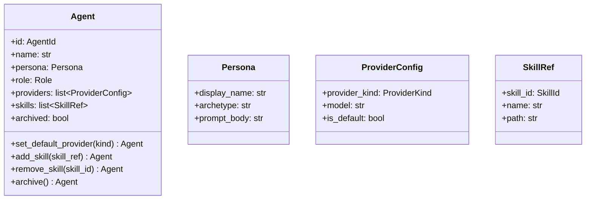

# 詳細設計書

> feature: `agent`
> 関連: [basic-design.md](basic-design.md) / [`docs/architecture/domain-model/aggregates.md`](../../architecture/domain-model/aggregates.md) §Agent

## 記述ルール（必ず守ること）

詳細設計に**疑似コード・サンプル実装（python/ts/sh/yaml 等の言語コードブロック）を書かない**。
ソースコードと二重管理になりメンテナンスコストしか生まない。
必要なのは「構造契約（属性名・型・制約）」と「確定文言（メッセージ文字列）」と「実装の意図」。

## クラス設計（詳細）

### Aggregate Root: Agent

| 属性 | 型 | 制約 | 意図 |
|----|----|----|----|
| `id` | `AgentId`（UUIDv4） | 不変 | 一意識別 |
| `name` | `str` | 1〜40 文字（NFC 正規化、前後空白除去後）| 表示名 |
| `persona` | `Persona`（VO） | — | キャラクター設定 |
| `role` | `Role`（enum） | — | 役割テンプレ |
| `providers` | `list[ProviderConfig]` | 1〜10 件、`provider_kind` 重複なし、`is_default == True` が 1 件のみ | LLM プロバイダ設定 |
| `skills` | `list[SkillRef]` | 0〜20 件、`skill_id` 重複なし | スキル参照 |
| `archived` | `bool` | デフォルト False | アーカイブ状態 |

`model_config`:
- `frozen = True`
- `arbitrary_types_allowed = False`
- `extra = 'forbid'`

**不変条件（model_validator(mode='after')）**:
1. `name` は 1〜40 文字
2. `providers` は 1 件以上、上限 10 件
3. `providers` 内 `provider_kind` の重複なし
4. `providers` 内 `is_default == True` が **ちょうど 1 件**
5. `skills` 上限 20 件、`skill_id` 重複なし

**不変条件（application 層責務）**:
- 同 Empire 内の他 Agent との `name` 衝突なし — `AgentService.hire()` が Repository SELECT で判定

**ふるまい**:
- `set_default_provider(provider_kind: ProviderKind) -> Agent`: 指定プロバイダの `is_default=True` に切替（他は False）
- `add_skill(skill_ref: SkillRef) -> Agent`: skills に追加
- `remove_skill(skill_id: SkillId) -> Agent`: skills から削除
- `archive() -> Agent`: `archived=True` に遷移（既に True なら同じ Agent を返す、冪等）

### Value Object: Persona

| 属性 | 型 | 制約 |
|----|----|----|
| `display_name` | `str` | 1〜40 文字（NFC 正規化）|
| `archetype` | `str` | 0〜80 文字（例: "イーロン・マスク風 CEO"）|
| `prompt_body` | `str` | 0〜10000 文字、Markdown |

`model_config.frozen = True`。`prompt_body` の永続化前マスキングは Repository 層で適用（[`storage.md`](../../architecture/domain-model/storage.md)）。

### Value Object: ProviderConfig

| 属性 | 型 | 制約 |
|----|----|----|
| `provider_kind` | `ProviderKind`（enum） | CLAUDE_CODE / CODEX / GEMINI / OPENCODE / KIMI / COPILOT |
| `model` | `str` | 1〜80 文字（例: "sonnet" / "opus" / "gpt-5-codex"） |
| `is_default` | `bool` | — |

`model_config.frozen = True`。

### Value Object: SkillRef

| 属性 | 型 | 制約 |
|----|----|----|
| `skill_id` | `SkillId`（UUIDv4） | 不変 |
| `name` | `str` | 1〜80 文字 |
| `path` | `str` | 1〜500 文字、`bakufu-data/skills/...` 配下の相対パス（path traversal 拒否は別 feature／ファイル配信責務） |

### Exception: AgentInvariantViolation

| 属性 | 型 | 制約 |
|----|----|----|
| `message` | `str` | MSG-AG-NNN 由来 |
| `detail` | `dict[str, object]` | 違反の文脈 |
| `kind` | `Literal['name_range', 'no_provider', 'default_not_unique', 'provider_duplicate', 'persona_too_long', 'provider_not_found', 'skill_duplicate', 'skill_not_found']` | 違反種別 |

## 確定事項（先送り撤廃）

### 確定 A: pre-validate 方式は Pydantic v2 model_validate 経由

`set_default_provider` / `add_skill` / `remove_skill` / `archive` 共通の手順:

1. `self.model_dump(mode='python')` で現状を dict 化
2. dict 内の該当キーを更新
3. `Agent.model_validate(updated_dict)` を呼ぶ — `model_validator` が走る
4. `model_validate` は失敗時に `ValidationError` を raise し、Agent 内では `AgentInvariantViolation` に変換して raise

### 確定 B: `is_default` 一意制約の実装

`model_validator(mode='after')` で `sum(1 for p in providers if p.is_default)` をカウント。0 または 2 以上で raise。1 件のみ許容。

### 確定 C: providers / skills の容量上限

`len(providers) <= 10` / `len(skills) <= 20`。MVP の実用範囲（V モデル開発室で 1 Agent あたり 1〜3 プロバイダ、5 スキル程度）の数倍を上限に設定。

### 確定 D: archive の冪等性

`archive()` は `archived == True` の Agent に対しても呼べる。返り値は同じ状態の Agent（新インスタンス）。エラーにしない理由: UI からの誤操作 / リトライで例外を出すと UX が悪い。冪等な操作として扱う。

### 確定 E: name の Unicode NFC 正規化

Empire / Workflow と同じく、`name` は NFC 正規化を構築前に実施。前後空白除去後の長さで判定。

## 設計判断の補足

### なぜ `is_default` を ProviderConfig 内のフラグにするか

代替案として「Agent.default_provider_kind」を別フィールドにする案もあったが、その場合 `provider_kind` の存在検査と整合性検査が分散する。VO 内に `is_default` を持つことで、不変条件「ちょうど 1 件 True」だけで完結する。

### なぜ skills は SkillRef（参照）で実体を持たないか

Skill 本体は Phase 2 で実装される。MVP では Skill markdown ファイルが filesystem に置かれている前提で、Agent はそこへの参照のみ持つ。実体 Aggregate を作ると Repository が増え、MVP のスコープが膨らむ。

### なぜ application 層で name 一意検査をするか

「同 Empire 内の他 Agent と name が重複しない」は Empire スコープの集合知識。Agent Aggregate の整合性に閉じない。Repository SELECT で判定する application 層の責務。

### なぜ archive が冪等か

UI / CLI で「アーカイブ」ボタンを連打したり、API 再送が発生したりするケースに対し、エラーを返すと運用がぎこちない。冪等にすることで、操作回数に依らず最終状態が同じになり、UX とリトライ耐性が両立。

## ユーザー向けメッセージの確定文言

### プレフィックス統一

| プレフィックス | 意味 |
|--------------|-----|
| `[FAIL]` | 処理中止を伴う失敗 |
| `[OK]` | 成功完了 |

### MSG 確定文言表

| ID | 出力先 | 文言 |
|----|------|----|
| MSG-AG-001 | 例外 message | `[FAIL] Agent name must be 1-40 characters (got {length})` |
| MSG-AG-002 | 例外 message | `[FAIL] Agent must have at least one provider` |
| MSG-AG-003 | 例外 message | `[FAIL] Exactly one provider must have is_default=True (got {count})` |
| MSG-AG-004 | 例外 message | `[FAIL] Duplicate provider_kind: {kind}` |
| MSG-AG-005 | 例外 message | `[FAIL] Persona.prompt_body must be 0-10000 characters (got {length})` |
| MSG-AG-006 | 例外 message | `[FAIL] provider_kind not registered: {kind}` |
| MSG-AG-007 | 例外 message | `[FAIL] Skill already added: skill_id={skill_id}` |
| MSG-AG-008 | 例外 message | `[FAIL] Skill not found in agent: skill_id={skill_id}` |

メッセージは ASCII 範囲。日本語化は UI 側 i18n（Phase 2）。

## データ構造（永続化キー）

該当なし — 理由: 本 feature は domain 層のみで永続化スキーマは含まない。永続化は `feature/persistence` で扱う。

参考の概形:

| カラム | 型 | 制約 | 意図 |
|-------|----|----|----|
| `agents.id` | `UUID` | PK | AgentId |
| `agents.empire_id` | `UUID` | FK to `empires.id` | 所属 Empire |
| `agents.name` | `VARCHAR(40)` | NOT NULL, UNIQUE(empire_id, name) | 表示名（Empire 内一意は DB 制約でも担保） |
| `agents.role` | `VARCHAR` | NOT NULL | enum |
| `agents.archived` | `BOOLEAN` | NOT NULL DEFAULT FALSE | アーカイブ状態 |
| `agent_providers.agent_id` | `UUID` | FK | 所属 Agent |
| `agent_providers.provider_kind` | `VARCHAR` | NOT NULL | enum |
| `agent_providers.model` | `VARCHAR(80)` | NOT NULL | モデル名 |
| `agent_providers.is_default` | `BOOLEAN` | NOT NULL | 既定フラグ（DB 制約として 1 Agent あたり TRUE が 1 件のみは partial unique index で担保） |

## API エンドポイント詳細

該当なし — 理由: 本 feature は domain 層のみ。API は `feature/http-api` で凍結する。

## 出典・参考

- [Pydantic v2 — model_validator / model_validate](https://docs.pydantic.dev/latest/concepts/validators/) — pre-validate 方式の実装根拠
- [Pydantic v2 — frozen models](https://docs.pydantic.dev/latest/concepts/models/) — 不変モデルの挙動
- [`docs/architecture/domain-model/aggregates.md`](../../architecture/domain-model/aggregates.md) — Agent 凍結済み設計
- [`docs/architecture/domain-model/storage.md`](../../architecture/domain-model/storage.md) — シークレットマスキング規則（Persona.prompt_body 永続化時に適用）
- [`docs/architecture/threat-model.md`](../../architecture/threat-model.md) — A04 対応根拠
