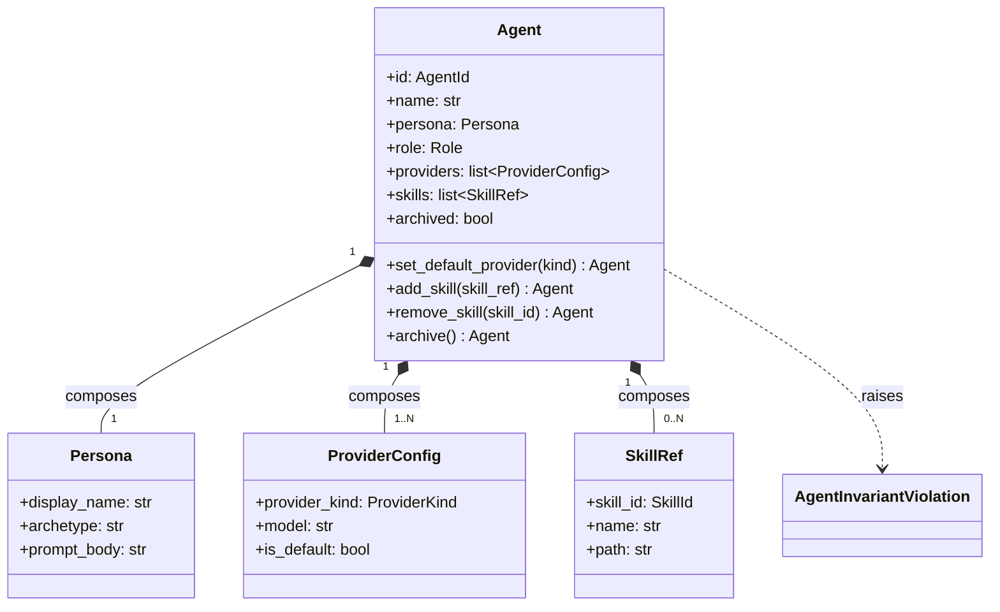
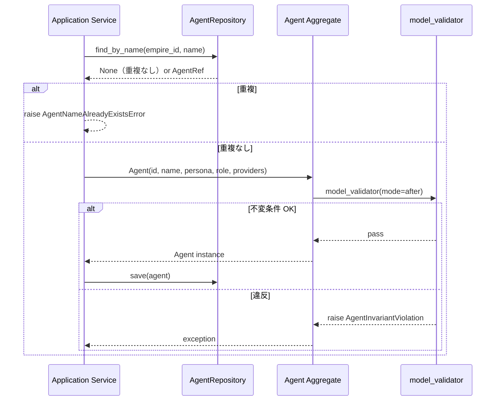

# 基本設計書 — agent / domain

> feature: `agent`（業務概念）/ sub-feature: `domain`
> 親業務仕様: [`../feature-spec.md`](../feature-spec.md)
> 関連 Issue: [#10 feat(agent): Agent Aggregate Root (M1)](https://github.com/bakufu-dev/bakufu/issues/10)
> 凍結済み設計: [`docs/design/domain-model/aggregates.md`](../../../design/domain-model/aggregates.md) §Agent

## 記述ルール（必ず守ること）

基本設計に**疑似コード・サンプル実装（python/ts/sh/yaml 等の言語コードブロック）を書かない**。
ソースコードと二重管理になりメンテナンスコストしか生まない。
必要なのは構造契約（クラス・モジュール・データの関係）であり、実装の細部は [detailed-design.md](detailed-design.md) で凍結する。

## §モジュール契約（機能要件）

本 sub-feature が満たすべき機能要件（入力 / 処理 / 出力 / エラー時）を凍結する。業務根拠は [`../feature-spec.md §9 受入基準`](../feature-spec.md) を参照。

### REQ-AG-001: Agent 構築

| 項目 | 内容 |
|------|------|
| 入力 | `id: AgentId`、`name: str`（1〜40）、`persona: Persona`、`role: Role`、`providers: list[ProviderConfig]`（1 件以上）、`skills: list[SkillRef]`（0 件以上、デフォルト []）|
| 処理 | Pydantic 型バリデーション → `model_validator(mode='after')` で不変条件検査 → 通過時のみ Agent を返す |
| 出力 | `Agent` インスタンス（frozen、`archived=False`）|
| エラー時 | `AgentInvariantViolation` を raise。MSG-AG-001〜005 |

### REQ-AG-002: Provider 切替

| 項目 | 内容 |
|------|------|
| 入力 | 現 Agent + `provider_kind: ProviderKind` |
| 処理 | 1) providers 内で `provider_kind` が一致するエントリを探す 2) 見つからなければ raise（MSG-AG-006） 3) 全 providers の `is_default` を再計算（対象を True、他を False） 4) 仮 Agent を `model_validate(updated_dict)` で再構築（不変条件検査） 5) 通過時のみ仮 Agent を返す |
| 出力 | 更新された Agent（新インスタンス） |
| エラー時 | provider_kind 未登録なら `AgentInvariantViolation`（MSG-AG-006）|

### REQ-AG-003: Skill 追加

| 項目 | 内容 |
|------|------|
| 入力 | 現 Agent + `skill_ref: SkillRef` |
| 処理 | 現 `skills` に追加した新リストを構築 → 仮 Agent を再構築 → 不変条件検査 |
| 出力 | 更新された Agent |
| エラー時 | 同一 `skill_id` 重複で `AgentInvariantViolation`（MSG-AG-007）|

### REQ-AG-004: Skill 削除

| 項目 | 内容 |
|------|------|
| 入力 | 現 Agent + `skill_id: SkillId` |
| 処理 | 1) `skills` から該当 SkillRef を除外した新リストを構築 2) 該当が存在しなければ raise（MSG-AG-008） 3) 仮 Agent を再構築・検査 |
| 出力 | 更新された Agent |
| エラー時 | `skill_id` 未登録で `AgentInvariantViolation` |

### REQ-AG-005: アーカイブ

| 項目 | 内容 |
|------|------|
| 入力 | 現 Agent |
| 処理 | `archived=True` に更新した仮 Agent を再構築 |
| 出力 | 更新された Agent（新インスタンス） |
| エラー時 | 既に `archived=True` の Agent に `archive()` を呼ぶと冪等で同じ状態を返す（エラーにしない） |

### REQ-AG-006: 不変条件検査

| 項目 | 内容 |
|------|------|
| 入力 | Agent インスタンス（コンストラクタ末尾 / 状態変更ふるまい末尾で自動呼び出し） |
| 処理 | `model_validator(mode='after')` で: ①`name` 1〜40 文字 ②`providers` 内 `is_default == True` が 1 件のみ ③`providers` 内 `provider_kind` の重複なし ④`skills` 内 `skill_id` の重複なし |
| 出力 | None |
| エラー時 | いずれか違反で `AgentInvariantViolation`（kind に違反種別） |

---

## モジュール構成

| 機能 ID | モジュール | ディレクトリ | 責務 |
|--------|----------|------------|------|
| REQ-AG-001〜006 | `Agent` Aggregate Root | `backend/src/bakufu/domain/agent.py` | Agent の属性・不変条件・ふるまい |
| REQ-AG-001 | `Persona` VO | `backend/src/bakufu/domain/value_objects.py`（既存ファイル更新） | Persona 値オブジェクト |
| REQ-AG-001, 002 | `ProviderConfig` VO | 同上 | プロバイダ設定 VO |
| REQ-AG-003, 004 | `SkillRef` VO | 同上 | Skill 参照 VO |
| REQ-AG-001 | `AgentInvariantViolation` 例外 | `backend/src/bakufu/domain/exceptions.py`（既存ファイル更新） | ドメイン例外 |
| 共通 | `AgentId` / `SkillId` / `Role` / `ProviderKind` | `backend/src/bakufu/domain/value_objects.py` | 既存定義／本 feature で SkillId のみ追加 |

```
ディレクトリ構造（本 feature で追加・変更されるファイル）:

.
└── backend/
    ├── src/
    │   └── bakufu/
    │       └── domain/
    │           ├── agent.py             # 新規: Agent Aggregate Root
    │           ├── value_objects.py     # 既存更新: Persona / ProviderConfig / SkillRef / SkillId
    │           └── exceptions.py        # 既存更新: AgentInvariantViolation
    └── tests/
        └── domain/
            └── test_agent.py            # 新規: ユニットテスト
```

## クラス設計（概要）



**凝集のポイント**:
- Persona / ProviderConfig / SkillRef は frozen VO で構造的等価判定
- Agent 自身も frozen（Pydantic v2 `model_config.frozen=True`）
- 状態変更ふるまい（`set_default_provider` / `add_skill` / `remove_skill` / `archive`）は新インスタンスを返す
- `is_default` 一意制約は **Aggregate 内部で守る**（Aggregate の整合性に閉じる責務）
- `name` の Empire 内一意は **application 層責務**（外部知識を要するため）

## 処理フロー

### ユースケース 1: Agent 採用（構築）

1. application 層が `EmpireService.hire_agent(empire_id, name, persona, role, providers)` を呼び出す
2. application 層が `AgentRepository.find_by_name(empire_id, name)` で名前重複検査（ヒットしたら raise）
3. application 層が `Agent(id=..., name=..., persona=..., role=..., providers=..., skills=[])` を構築
4. Pydantic 型バリデーション → `model_validator` で `is_default` 一意性等を検査
5. valid なら Agent を保存（`AgentRepository.save`）

### ユースケース 2: Provider 切替（set_default_provider）

1. application 層が `agent.set_default_provider(ProviderKind.CODEX)` を呼び出す
2. providers 内で CODEX エントリを探す（線形探索）
3. 見つからなければ raise（MSG-AG-006）
4. 全 providers を走査し、`provider_kind == CODEX` のエントリの `is_default=True` に、その他を `is_default=False` に更新した新 list を構築
5. `model_validate(updated_dict)` で仮 Agent を再構築 → 不変条件検査
6. 通過時のみ仮 Agent を返す

### ユースケース 3: Skill 追加（add_skill）

1. application 層が `agent.add_skill(skill_ref)` を呼び出す
2. 現 `skills` に追加した新 list を構築
3. `model_validate` で仮 Agent を再構築 → 不変条件検査（`skill_id` 重複等）
4. 通過時のみ返す

### ユースケース 4: アーカイブ（archive）

1. application 層が `agent.archive()` を呼び出す
2. 状態に依らず `self.model_dump(mode='python')` で現状を dict 化し `archived=True` に差し替え
3. `Agent.model_validate(updated_dict)` で**新インスタンス**を再構築（既に `archived=True` の Agent に対しても同手順を踏む、冪等）
4. 不変条件検査（`model_validator(mode='after')`）が走り、通過時のみ新 Agent を返す

**返り値は常に新 `Agent` インスタンス**（同状態でも別オブジェクト）。詳細は [detailed-design.md](detailed-design.md) §確定 D。

## シーケンス図



## アーキテクチャへの影響

- `docs/design/domain-model.md` への変更: なし
- `docs/design/tech-stack.md` への変更: なし
- 既存 feature への波及: なし。後続 `feature/room` は `AgentMembership` を介して Agent を参照するが、本 feature 範囲では参照されない（非対称）

## 外部連携

該当なし — 理由: domain 層のみのため外部システムへの通信は発生しない。

| 連携先 | 目的 | プロトコル | 認証 | タイムアウト / リトライ |
|-------|------|----------|-----|--------------------|
| 該当なし | — | — | — | — |

## UX 設計

該当なし — 理由: domain 層のため UI は持たない。Agent 編集 UI は `feature/agent-ui` で扱う。

| シナリオ | 期待される挙動 |
|---------|------------|
| 該当なし | — |

**アクセシビリティ方針**: 該当なし（UI なし）。

## セキュリティ設計

### 脅威モデル

本 feature 範囲では以下の 2 件。詳細な信頼境界は [`docs/design/threat-model.md`](../../../design/threat-model.md)。

| 想定攻撃者 | 攻撃経路 | 保護資産 | 対策 |
|-----------|---------|---------|------|
| **T1: Persona.prompt_body 経由の prompt injection** | UI / API から悪意ある自然言語 prompt を投入 → Conversation・Deliverable に伝搬 | LLM Agent の整合性 / 他 Agent の Conversation | Agent ドメイン内ではサニタイズせず、永続化前の単一ゲートウェイ（`storage.md` §シークレットマスキング規則）で secret を伏字化。LLM 出力を直接 shell 実行する経路は提供しない（`threat-model.md` §A2） |
| **T2: 不正な ProviderConfig による LLM Adapter 誤動作** | 存在しない `provider_kind` / `model` 名で Agent を構築 → LLM Adapter が落ちる | Agent / Adapter の整合性 | Pydantic enum で `provider_kind` を Fail Fast 拒否。`model` 文字列は LLM Adapter 側でホワイトリスト検証（別 feature 責務） |

### OWASP Top 10 対応

| # | カテゴリ | 対応状況 |
|---|---------|---------|
| A01 | Broken Access Control | 該当なし（domain 層） |
| A02 | Cryptographic Failures | 該当なし |
| A03 | Injection | 該当なし（Pydantic 型強制） |
| A04 | Insecure Design | **適用**: pre-validate 方式、frozen model、`is_default` 一意性検査 |
| A05 | Security Misconfiguration | 該当なし |
| A06 | Vulnerable Components | Pydantic v2 / pyright |
| A07 | Auth Failures | 該当なし |
| A08 | Data Integrity Failures | **適用**: frozen model |
| A09 | Logging Failures | 該当なし |
| A10 | SSRF | 該当なし（外部 URL fetch なし） |

## ER 図

該当なし — 理由: 本 sub-feature は domain 層のみで永続化スキーマは含まない。永続化は [`repository/`](../repository/) sub-feature で扱う。

## エラーハンドリング方針

| 例外種別 | 処理方針 | ユーザーへの通知 |
|---------|---------|----------------|
| `AgentInvariantViolation` | application 層で catch、HTTP API 層で 400 / 422 にマッピング（別 feature） | MSG-AG-001 〜 008 |
| `pydantic.ValidationError` | 構築時の型違反。application 層で catch | MSG-AG-001（汎用） |
| その他 | 握り潰さない、application 層へ伝播 | 汎用エラーメッセージ |

## 依存関係

| 区分 | 依存 | バージョン方針 | 導入経路 | 備考 |
|-----|------|-------------|---------|------|
| ランタイム | Python 3.12+ | pyproject.toml | uv | 既存 |
| Python 依存 | `pydantic` v2 | `pyproject.toml` | uv | 既存 |
| Python 依存 | `pyright` (strict) | `pyproject.toml` dev | uv tool | 既存 |
| Python 依存 | `ruff` | 同上 | uv tool | 既存 |
| Python 依存 | `pytest` / `pytest-cov` | 同上 | uv | 既存 |
| Node 依存 | 該当なし | — | — | バックエンド単独 |
| 外部サービス | 該当なし | — | — | domain 層 |
