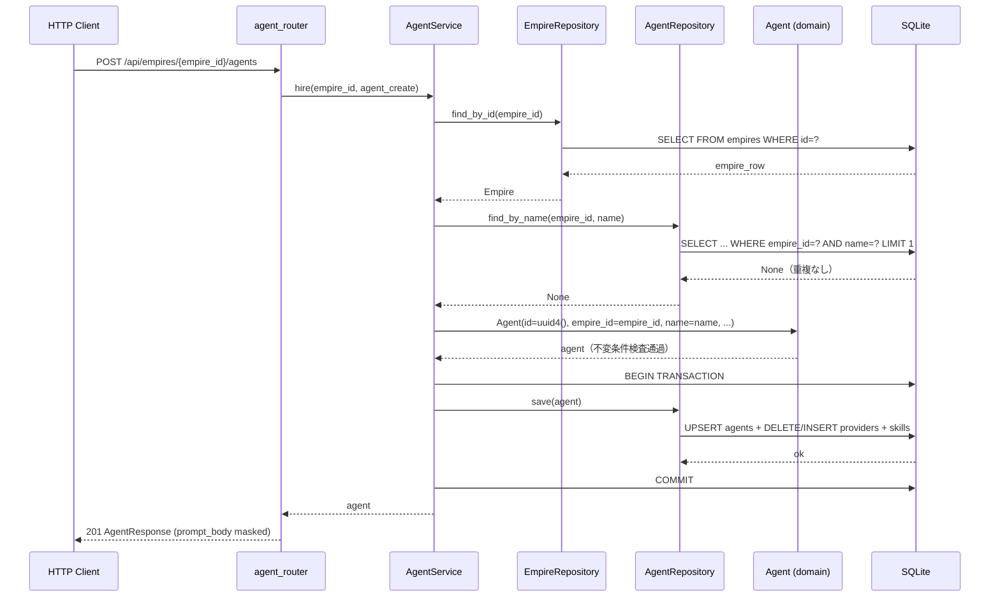

# 基本設計書

> feature: `agent` / sub-feature: `http-api`
> 関連 Issue: [#59 feat(agent-http-api): Agent CRUD HTTP API (M3)](https://github.com/bakufu-dev/bakufu/issues/59)
> 関連: [`../feature-spec.md`](../feature-spec.md) / [`../domain/basic-design.md`](../domain/basic-design.md) / [`../repository/basic-design.md`](../repository/basic-design.md) / [`../../http-api-foundation/http-api/basic-design.md`](../../http-api-foundation/http-api/basic-design.md)
> 凍結済み設計参照: [`docs/design/architecture.md §interfaces レイヤー詳細`](../../../design/architecture.md) / [`docs/design/threat-model.md`](../../../design/threat-model.md)

## 記述ルール（必ず守ること）

基本設計に**疑似コード・サンプル実装（python/ts/sh/yaml 等の言語コードブロック）を書かない**。
ソースコードと二重管理になりメンテナンスコストしか生まない。
必要なのは構造契約（クラス・モジュール・データの関係）であり、実装の細部は [detailed-design.md](detailed-design.md) で凍結する。

## 前提条件（実装着手前に充足すること）

本 sub-feature の実装前に以下の変更が必要である:

| 前提 | 対象ファイル | 内容 |
|---|---|---|
| **P-1: AgentRepository 拡張** | `backend/src/bakufu/application/ports/agent_repository.py` + `backend/src/bakufu/infrastructure/persistence/sqlite/repositories/agent_repository.py` | `find_all_by_empire(empire_id: EmpireId) -> list[Agent]` を第 5 メソッドとして Protocol + SQLite 実装に追加する（REQ-AG-HTTP-002 の Empire 内 Agent 一覧取得に必要）。SQL: `SELECT * FROM agents WHERE empire_id = :empire_id ORDER BY name`|
| **P-2: AgentNotFoundError 正式移転** | `backend/src/bakufu/application/exceptions/agent_exceptions.py`（新規）/ `room_exceptions.py`（変更）/ `error_handlers.py`（変更）| `room_exceptions.py` に暫定定義されている `AgentNotFoundError` を `agent_exceptions.py` に正式移転する。`room_exceptions.py` では `from bakufu.application.exceptions.agent_exceptions import AgentNotFoundError` に変更し暫定定義を削除。`error_handlers.py` の import 元も同様に更新 |

## モジュール構成

本 sub-feature で追加・変更するモジュール一覧。

| 機能 ID | モジュール | ディレクトリ | 責務 |
|---|---|---|---|
| REQ-AG-HTTP-001〜005 | `agent_router` | `backend/src/bakufu/interfaces/http/routers/agents.py` | Agent CRUD エンドポイント（5 本）|
| REQ-AG-HTTP-001〜005 | `AgentService` | `backend/src/bakufu/application/services/agent_service.py` | http-api-foundation で骨格確定済み（`__init__(repo: AgentRepository)`）。本 sub-feature で `hire / find_by_empire / find_by_id / update / archive` メソッドを肉付け。コンストラクタに `empire_repo: EmpireRepository` + `session: AsyncSession` を追加 |
| REQ-AG-HTTP-001〜005 | `AgentSchemas` | `backend/src/bakufu/interfaces/http/schemas/agent.py` | Pydantic v2 リクエスト / レスポンスモデル（新規ファイル）|
| 横断 | `agent 例外ハンドラ群` | `backend/src/bakufu/interfaces/http/error_handlers.py`（既存追記）| `AgentNotFoundError` / `AgentNameAlreadyExistsError` / `AgentArchivedError` / `AgentInvariantViolation` → `ErrorResponse` 変換 |
| 横断 | `application 例外定義` | `backend/src/bakufu/application/exceptions/agent_exceptions.py`（新規）| `AgentNotFoundError` / `AgentNameAlreadyExistsError` / `AgentArchivedError`（room_exceptions.py の暫定定義を正式移転）|
| REQ-AG-HTTP-001, 002 | `AgentService` DI 拡張 | `backend/src/bakufu/interfaces/http/dependencies.py`（既存追記）| `get_agent_service()` を `EmpireRepository` + `session` を受け取る形に拡張 |

```
本 sub-feature で追加・変更されるファイル:

backend/
└── src/bakufu/
    ├── application/
    │   ├── exceptions/
    │   │   └── agent_exceptions.py          # 新規: AgentNotFoundError / AgentNameAlreadyExistsError / AgentArchivedError
    │   ├── ports/
    │   │   └── agent_repository.py          # 既存追記: find_all_by_empire 追加（前提条件 P-1）
    │   └── services/
    │       └── agent_service.py             # 既存追記: hire / find_by_empire / find_by_id / update / archive
    └── interfaces/http/
        ├── dependencies.py                  # 既存追記: get_agent_service() 拡張
        ├── error_handlers.py                # 既存追記: agent 例外ハンドラ群 + AgentNotFoundError import 元変更（前提条件 P-2）
        ├── routers/
        │   └── agents.py                    # 新規: 5 エンドポイント
        └── schemas/
            └── agent.py                     # 新規: Pydantic スキーマ群
```

## モジュール契約（機能要件）

本 sub-feature が提供するモジュールの入出力契約を凍結する。各 REQ-AG-HTTP-NNN は親 [`../feature-spec.md §5`](../feature-spec.md) ユースケース UC-AG-NNN と 1:1 で対応する（孤児要件なし）。

### REQ-AG-HTTP-001: Agent 採用（POST /api/empires/{empire_id}/agents）

| 項目 | 内容 |
|---|---|
| 入力 | パスパラメータ `empire_id: UUID` / リクエスト Body `AgentCreate`（`name: str` + `persona: PersonaCreate` + `role: str` + `providers: list[ProviderConfigCreate]`（1 件以上）+ `skills: list[SkillRefCreate]`（省略可、デフォルト `[]`））|
| 処理 | `AgentService.hire(empire_id, agent_create)` → 1) `EmpireRepository.find_by_id(empire_id)` → None → `EmpireNotFoundError` 2) `AgentRepository.find_by_name(empire_id, name)` → 存在 → `AgentNameAlreadyExistsError`（R1-6）3) `Agent(id=uuid4(), empire_id=empire_id, name=name, persona=Persona(...), role=Role(role), providers=[...], skills=[...])` 構築（R1-1〜4 失敗時 `AgentInvariantViolation`）4) `async with session.begin()`: `AgentRepository.save(agent)` |
| 出力 | HTTP 201, `AgentResponse`（id / empire_id / name / persona / role / providers / skills / archived=false）|
| エラー時 | Empire 不在 → 404 (MSG-EM-HTTP-002) / name 重複 → 409 (MSG-AG-HTTP-002) / 不変条件違反 → 422 (MSG-AG-HTTP-004) / 不正 UUID → 422 |

### REQ-AG-HTTP-002: Empire の Agent 一覧取得（GET /api/empires/{empire_id}/agents）

| 項目 | 内容 |
|---|---|
| 入力 | パスパラメータ `empire_id: UUID` |
| 処理 | `AgentService.find_by_empire(empire_id)` → `EmpireRepository.find_by_id(empire_id)` で Empire 存在確認 → `AgentRepository.find_all_by_empire(empire_id)` で全 Agent 取得 |
| 出力 | HTTP 200, `AgentListResponse(items: list[AgentResponse], total: int)`（0 件も 200 で返す。アーカイブ済み Agent も含む）|
| エラー時 | Empire 不在 → 404 (MSG-EM-HTTP-002) / 不正 UUID → 422 |

### REQ-AG-HTTP-003: Agent 単件取得（GET /api/agents/{id}）

| 項目 | 内容 |
|---|---|
| 入力 | パスパラメータ `id: UUID` |
| 処理 | `AgentService.find_by_id(agent_id)` → `AgentRepository.find_by_id(agent_id)` → None → `AgentNotFoundError` |
| 出力 | HTTP 200, `AgentResponse`（persona / providers / skills 込み）|
| エラー時 | 不在 → 404 (MSG-AG-HTTP-001) / 不正 UUID → 422 |

### REQ-AG-HTTP-004: Agent 更新（PATCH /api/agents/{id}）

| 項目 | 内容 |
|---|---|
| 入力 | パスパラメータ `id: UUID` + `AgentUpdate(name: str \| None, persona: PersonaUpdate \| None, role: str \| None, providers: list[ProviderConfigCreate] \| None, skills: list[SkillRefCreate] \| None)`（None は変更なし）|
| 処理 | `AgentService.update(agent_id, ...)` → 1) `find_by_id` → None → 404 / archived → 409 (R1-5) 2) name 変更時: `find_by_name(agent.empire_id, new_name)` → 存在 → 409 (R1-6) 3) 変更フィールドのみ差し替えた dict で `Agent.model_validate(updated_dict)` 再構築（不変条件 R1-1〜4 再検査）4) `async with session.begin()`: `AgentRepository.save(updated_agent)` |
| 出力 | HTTP 200, 更新済み `AgentResponse` |
| エラー時 | 不在 → 404 (MSG-AG-HTTP-001) / archived → 409 (MSG-AG-HTTP-003) / name 重複 → 409 (MSG-AG-HTTP-002) / 不変条件違反 → 422 (MSG-AG-HTTP-004) / 不正 UUID → 422 |

### REQ-AG-HTTP-005: Agent 引退（DELETE /api/agents/{id}）

| 項目 | 内容 |
|---|---|
| 入力 | パスパラメータ `id: UUID` |
| 処理 | `AgentService.archive(agent_id)` → `find_by_id` → None → `AgentNotFoundError` → `agent.archive()` → `async with session.begin()`: `AgentRepository.save(archived_agent)` |
| 出力 | HTTP 204 No Content |
| エラー時 | 不在 → 404 (MSG-AG-HTTP-001) / 不正 UUID → 422 |

## ユーザー向けメッセージ一覧

確定文言は [`detailed-design.md §MSG 確定文言表`](detailed-design.md) で凍結する。

| ID | 種別 | 条件 | HTTP ステータス |
|---|---|---|---|
| MSG-AG-HTTP-001 | エラー（不在）| Agent が見つからない | 404 |
| MSG-AG-HTTP-002 | エラー（競合）| 同 Empire 内で Agent 名が重複している（R1-6 違反）| 409 |
| MSG-AG-HTTP-003 | エラー（競合）| アーカイブ済み Agent への更新操作（R1-5 違反）| 409 |
| MSG-AG-HTTP-004 | エラー（検証）| `AgentInvariantViolation` の業務ルール違反本文（R1-1〜4）| 422 |

Empire 不在エラー（MSG-EM-HTTP-002）は empire http-api 既存ハンドラが処理する。

## 依存関係

| 区分 | 依存 | バージョン方針 | 備考 |
|---|---|---|---|
| ランタイム | Python 3.12+ | pyproject.toml | 既存 |
| HTTP フレームワーク | FastAPI / Pydantic v2 / httpx | pyproject.toml | http-api-foundation で確定済み |
| DI パターン | `get_session()` / `get_agent_service()` | http-api-foundation 確定E | `dependencies.py` の `get_agent_service()` を拡張 |
| application 例外 | `AgentNotFoundError` / `AgentNameAlreadyExistsError` / `AgentArchivedError` | 本 PR で正式定義 | `application/exceptions/agent_exceptions.py` |
| domain | `Agent` / `AgentId` / `EmpireId` / `Persona` / `ProviderConfig` / `SkillRef` / `Role` / `ProviderKind` / `SkillId` / `AgentInvariantViolation` | M1 確定済み | agent domain sub-feature（Issue #10）|
| repository | `AgentRepository` Protocol（`find_all_by_empire` 追加）/ `SqliteAgentRepository` | M2 確定 + 本 PR で拡張 | agent repository sub-feature（Issue #32）|
| empire 参照 | `EmpireRepository.find_by_id` | empire repository（Issue #25）確定 | Empire 存在確認のため |
| empire 例外 | `EmpireNotFoundError` | empire http-api（Issue #56）確定 | Empire 不在確認のため |
| masking utility | `bakufu.application.security.masking.mask` | application/security（§確定I で昇格凍結 — 薄いアダプタ、実体は infrastructure/security/masking.py）| GET / POST / PATCH 全レスポンスの prompt_body 伏字化（field_serializer 全パス発火・冪等、R1-9 / A02 防御）|
| 基盤 | http-api-foundation（ErrorResponse / lifespan / CSRF / CORS）| M3-A 確定（Issue #55）| 全 error handler / app.state.session_factory を引き継ぐ |

## クラス設計（概要）

```mermaid
classDiagram
    class AgentRouter {
        <<FastAPI APIRouter>>
        +POST /api/empires/{empire_id}/agents
        +GET /api/empires/{empire_id}/agents
        +GET /api/agents/{id}
        +PATCH /api/agents/{id}
        +DELETE /api/agents/{id}
    }
    class AgentService {
        -_agent_repo: AgentRepository
        -_empire_repo: EmpireRepository
        -_session: AsyncSession
        +__init__(agent_repo, empire_repo, session)
        +hire(empire_id, agent_create) Agent
        +find_by_empire(empire_id) list[Agent]
        +find_by_id(agent_id) Agent
        +update(agent_id, name, persona, role, providers, skills) Agent
        +archive(agent_id) None
    }
    class AgentRepository {
        <<Protocol>>
        +find_by_id(agent_id) Agent | None
        +find_all_by_empire(empire_id) list[Agent]
        +find_by_name(empire_id, name) Agent | None
        +count() int
        +save(agent) None
    }
    class EmpireRepository {
        <<Protocol>>
        +find_by_id(empire_id) Empire | None
    }
    class AgentCreate {
        <<Pydantic BaseModel>>
        +name: str
        +persona: PersonaCreate
        +role: str
        +providers: list~ProviderConfigCreate~
        +skills: list~SkillRefCreate~
    }
    class AgentUpdate {
        <<Pydantic BaseModel>>
        +name: str | None
        +persona: PersonaUpdate | None
        +role: str | None
        +providers: list~ProviderConfigCreate~ | None
        +skills: list~SkillRefCreate~ | None
    }
    class AgentResponse {
        <<Pydantic BaseModel>>
        +id: str
        +empire_id: str
        +name: str
        +persona: PersonaResponse
        +role: str
        +providers: list~ProviderConfigResponse~
        +skills: list~SkillRefResponse~
        +archived: bool
    }
    class PersonaResponse {
        <<Pydantic BaseModel>>
        +display_name: str
        +archetype: str
        +prompt_body: str (masked — R1-9)
    }
    class AgentListResponse {
        <<Pydantic BaseModel>>
        +items: list~AgentResponse~
        +total: int
    }

    AgentRouter --> AgentService : uses (DI)
    AgentService --> AgentRepository : uses (Port)
    AgentService --> EmpireRepository : uses (Port, Empire 存在確認)
    AgentRouter ..> AgentCreate : deserializes
    AgentRouter ..> AgentUpdate : deserializes
    AgentRouter ..> AgentResponse : serializes
    AgentRouter ..> AgentListResponse : serializes
```

## 処理フロー

### ユースケース 1: Agent 採用（POST /api/empires/{empire_id}/agents）

1. Router が `empire_id: UUID` をパスパラメータとして受け取る（不正形式 → 422）
2. Router が `AgentCreate` を Pydantic でデシリアライズ（422 on 失敗）
3. `AgentService.hire(empire_id, agent_create)` 呼び出し
4. Empire 存在確認（`EmpireRepository.find_by_id` → None → `EmpireNotFoundError` → 404）
5. 名前重複確認（`AgentRepository.find_by_name(empire_id, name)` → 存在 → `AgentNameAlreadyExistsError` → 409）
6. `Agent(id=uuid4(), empire_id=empire_id, name=name, persona=Persona(...), role=Role(role), providers=[...], skills=[...])` 構築（R1-1〜4 失敗時 `AgentInvariantViolation` → 422）
7. `async with session.begin()`: `AgentRepository.save(agent)`
8. HTTP 201, `AgentResponse`（prompt_body は field_serializer で masked）を返す

### ユースケース 2: Empire の Agent 一覧取得（GET /api/empires/{empire_id}/agents）

1. `empire_id: UUID` パスパラメータ取得（不正形式 → 422）
2. Empire 存在確認（`EmpireRepository.find_by_id` → None → `EmpireNotFoundError` → 404）
3. `AgentService.find_by_empire(empire_id)` → `AgentRepository.find_all_by_empire(empire_id)` で全 Agent 取得
4. `AgentListResponse(items=[...], total=N)` で HTTP 200（0 件も 200 で返す）

### ユースケース 3: Agent 単件取得（GET /api/agents/{id}）

1. `id: UUID` パスパラメータ取得（不正形式 → 422）
2. `AgentService.find_by_id(agent_id)` → None → `AgentNotFoundError` → 404
3. `AgentResponse`（prompt_body は DB 復元の masked 値）で HTTP 200

### ユースケース 4: Agent 更新（PATCH /api/agents/{id}）

1. `id: UUID` + `AgentUpdate` 取得
2. `AgentService.update(agent_id, ...)` → `find_by_id` → None → 404 / archived → 409 (R1-5)
3. name 変更時: `find_by_name(agent.empire_id, new_name)` → 存在 → 409 (R1-6)
4. 変更フィールドのみ差し替えた dict で `Agent.model_validate(updated_dict)` 再構築（不変条件再検査）
5. `async with session.begin()`: `AgentRepository.save(updated_agent)`
6. `AgentResponse` で HTTP 200

### ユースケース 5: Agent 引退（DELETE /api/agents/{id}）

1. `id: UUID` 取得（不正形式 → 422）
2. `AgentService.archive(agent_id)` → `find_by_id` → None → 404
3. `agent.archive()` → `archived=True` の新 Agent（冪等）
4. `async with session.begin()`: `AgentRepository.save(archived_agent)`
5. HTTP 204 No Content

## シーケンス図



## アーキテクチャへの影響

- **`docs/design/architecture.md`**: 変更なし（http-api-foundation で routers/ の配置はすでに明示済み）
- **`docs/design/tech-stack.md`**: 変更なし
- 既存 feature への波及: `error_handlers.py` に agent 専用ハンドラを追記するが、既存ハンドラ（HTTPException / ValidationError / generic / empire / room / workflow 専用）は変更しない。前提条件 P-2 により `AgentNotFoundError` の import 元を `room_exceptions.py` → `agent_exceptions.py` に変更する

## 外部連携

| 連携先 | 目的 | プロトコル | 認証 | タイムアウト / リトライ |
|---|---|---|---|---|
| 該当なし | — | — | — | — |

外部連携なし — 理由: Agent HTTP API は SQLite ローカル永続化のみで完結し、外部 API 呼び出しを行わない。LLM Adapter 呼び出しは `feature/llm-adapter` の責務。

## UX 設計

| シナリオ | 期待される挙動 |
|---|---|
| 同 Empire 内で同名 Agent を採用しようとする | 409 `{"error": {"code": "conflict", "message": "Agent with this name already exists in the Empire."}}` |
| アーカイブ済み Agent を PATCH しようとする | 409 `{"error": {"code": "conflict", "message": "Agent is archived and cannot be modified."}}` |
| providers を 0 件で Agent 採用 | 422（R1-2 違反、`AgentInvariantViolation` 前処理済み本文）|
| `is_default == True` が 2 件の providers | 422（R1-3 違反、`AgentInvariantViolation` 前処理済み本文）|
| `DELETE /api/agents/{id}` を 2 回呼び出し（冪等）| 2 回目も 204（`archive()` は冪等）|
| GET レスポンスの `persona.prompt_body` | `PersonaResponse` field_serializer が発火し、DB 復元済み masked 値（`<REDACTED:*>`）に `application.security.masking.mask()` を適用して返す（冪等のため値は変化しないが R1-9 が独立防御として機能）|
| POST / PATCH レスポンスの `persona.prompt_body` | `PersonaResponse` field_serializer が発火し、in-memory raw 値を `application.security.masking.mask()` で伏字化して返す（raw token 非露出、R1-9 / A02）|
| 不正 UUID でパスパラメータ | 422 FastAPI validation_error |

**アクセシビリティ方針**: 該当なし（HTTP API のため）。

## セキュリティ設計

### 脅威モデル

| 想定攻撃者 | 攻撃経路 | 保護資産 | 対策 |
|---|---|---|---|
| **T1: CSRF 経由での Agent 採用 / 更新 / 引退** | ブラウザ経由の不正 POST / PATCH / DELETE | Agent の組織整合性 | http-api-foundation 確定D: CSRF Origin 検証ミドルウェア（Origin ヘッダ不一致なら 403）|
| **T2: スタックトレース露出** | 500 エラーレスポンスへのスタックトレース混入 | 内部実装情報 | http-api-foundation 確定A: generic_exception_handler が `internal_error` のみを返す |
| **T3: 不正 UUID によるパスインジェクション** | `empire_id` / `id` に不正値を注入 | DB 整合性 | FastAPI `UUID` 型強制（422 on 不正形式）+ SQLAlchemy ORM |
| **T4: prompt_body 経由での秘密情報漏洩（A02）** | CEO が POST / PATCH で API key / GitHub PAT を `prompt_body` に含めた場合、または DB への raw token 直接 INSERT バイパスが発生した場合、HTTP レスポンスに raw token が露出 | API key / GitHub PAT | `PersonaResponse.prompt_body` の `field_serializer` が GET / POST / PATCH 全パスで `application.security.masking.mask()` を呼び出す。冪等のため DB 復元済み masked 値も安全。DB バイパス経路でも R1-9 が独立防御として機能する。`prompt_body` は pydantic regex 制約なしのフリーテキストのため、workflow R1-16 の pydantic.ValidationError は発生しない（R1-9 / §確定I 凍結）|
| **T5: SkillRef.path によるパストラバーサル** | 不正 path を SkillRef に含めた Agent を採用 | ファイルシステム | domain `SkillRef.path` の H1〜H10 パストラバーサル防御（`AgentInvariantViolation` → 422）|

### OWASP Top 10 対応

| # | カテゴリ | 対応状況 |
|---|---|---|
| A01 | Broken Access Control | loopback バインド（`127.0.0.1:8000`）+ CSRF Origin 検証（http-api-foundation 確定D）|
| A02 | Cryptographic Failures | **Persona.prompt_body**: `PersonaResponse` の `field_serializer` が GET / POST / PATCH 全レスポンスパスで `application.security.masking.mask()` を呼び出す（§確定I 凍結）。POST/PATCH は raw 値を伏字化、GET は DB 復元済み masked 値に冪等で再適用。DB への raw token 直接 INSERT バイパスでも HTTP レスポンスには露出しない（R1-8 永続化 masking + R1-9 HTTP レスポンス masking による独立した二重防御）|
| A03 | Injection | SQLAlchemy ORM 経由（raw SQL 不使用）|
| A04 | Insecure Design | domain の pre-validate + frozen Agent で不整合状態を物理的に防止 |
| A05 | Security Misconfiguration | http-api-foundation の lifespan / CORS 設定を引き継ぐ |
| A06 | Vulnerable Components | 依存 CVE は CI `pip-audit` で監視 |
| A07 | Auth Failures | MVP 設計上 意図的な認証なし（loopback バインドで代替）|
| A08 | Data Integrity Failures | delete-then-insert + UoW（repository sub-feature 確定済み）|
| A09 | Logging Failures | 内部エラーは application 層でログ、スタックトレースはレスポンスに含めない |
| A10 | SSRF | T5 対策: domain `SkillRef.path` のパストラバーサル防御が SSRF 生成を防止 |

## ER 図

本 sub-feature は DB スキーマを変更しない（`agents` / `agent_providers` / `agent_skills` テーブルは repository sub-feature で確定済み）。ER は [`../repository/basic-design.md §ER 図`](../repository/basic-design.md) を参照。

## エラーハンドリング方針

| 例外種別 | 発生箇所 | 処理方針 | HTTP ステータス |
|---|---|---|---|
| `AgentNotFoundError` | `AgentService.find_by_id`（None 時）/ `archive` / `update`（None 時）| `error_handlers.py` 専用ハンドラ → HTTP 404 | 404 |
| `AgentNameAlreadyExistsError` | `AgentService.hire`（find_by_name ヒット時）/ `update`（name 変更かつ find_by_name ヒット時）| 専用ハンドラ → HTTP 409 (MSG-AG-HTTP-002) | 409 |
| `AgentArchivedError` | `AgentService.update`（archived=True 時）| 専用ハンドラ → HTTP 409 (MSG-AG-HTTP-003) | 409 |
| `AgentInvariantViolation` | domain Agent 構築 / update 時（不変条件違反 R1-1〜4）| 専用ハンドラ → HTTP 422 (MSG-AG-HTTP-004 前処理済み本文）| 422 |
| `EmpireNotFoundError` | `AgentService.hire` / `find_by_empire`（Empire 不在時）| empire http-api 既存ハンドラが処理 | 404 |
| `RequestValidationError` | FastAPI Pydantic（入力形式不正）| http-api-foundation の既存ハンドラ | 422 |
| その他例外 | どこでも | http-api-foundation generic_exception_handler | 500（スタックトレース非露出）|

Router 内に `try/except` は書かない（http-api-foundation architecture 規律）。
