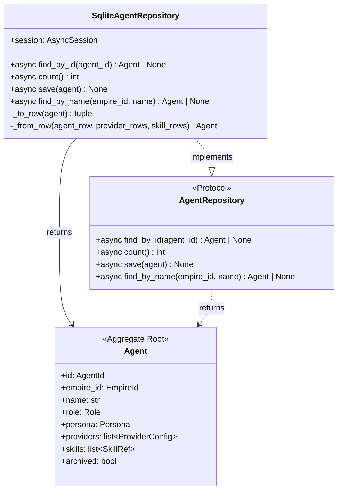
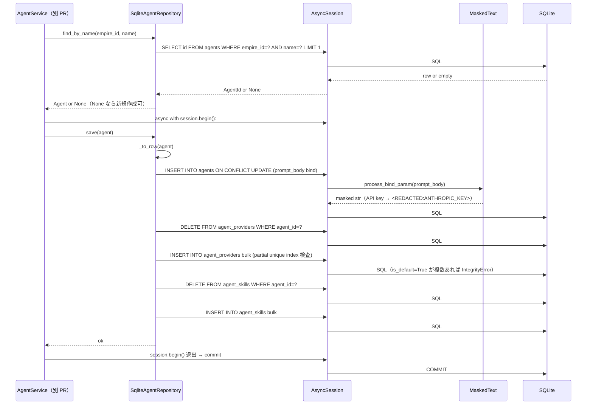
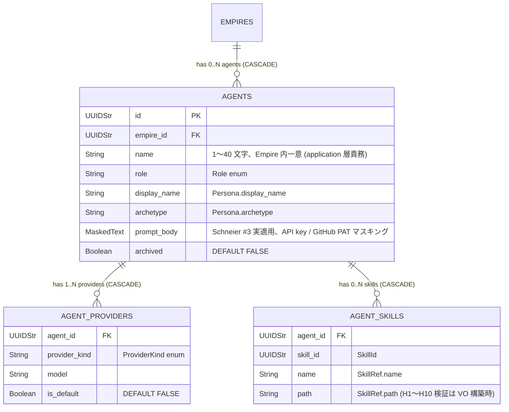

# 基本設計書 — agent / repository

> feature: `agent`（業務概念）/ sub-feature: `repository`
> 親業務仕様: [`../feature-spec.md`](../feature-spec.md)
> 関連 Issue: [#32 feat(agent-repository): Agent SQLite Repository (M2)](https://github.com/bakufu-dev/bakufu/issues/32)
> 関連: [`../../empire/repository/basic-design.md`](../../empire/repository/basic-design.md) **テンプレート真実源** / [`../../empire/repository/`](../../empire/repository/) — empire が先行例

## 記述ルール（必ず守ること）

基本設計に**疑似コード・サンプル実装（python/ts/sh/yaml 等の言語コードブロック）を書かない**。
ソースコードと二重管理になりメンテナンスコストしか生まない。
必要なのは構造契約（クラス・モジュール・データの関係）であり、実装の細部は [detailed-design.md](detailed-design.md) で凍結する。

## §モジュール契約（機能要件）

本 sub-feature が満たすべき機能要件（入力 / 処理 / 出力 / エラー時）を凍結する。業務根拠は [`../feature-spec.md §9 受入基準`](../feature-spec.md) を参照。

### REQ-AGR-001: AgentRepository Protocol 定義

| 項目 | 内容 |
|------|------|
| 入力 | 該当なし（Protocol 定義） |
| 処理 | `application/ports/agent_repository.py` で `AgentRepository(Protocol)` を定義。**4 method**（empire-repo の 3 method + 第 4 method `find_by_name`、§確定 R1-C）: `find_by_id(agent_id: AgentId) -> Agent \| None` / `count() -> int` / `save(agent: Agent) -> None` / `find_by_name(empire_id: EmpireId, name: str) -> Agent \| None`。すべて `async def`、`@runtime_checkable` なし |
| 出力 | Protocol 定義。pyright strict で SqliteAgentRepository が満たすことを型レベル検証 |
| エラー時 | 該当なし |

### REQ-AGR-002: SqliteAgentRepository 実装

| 項目 | 内容 |
|------|------|
| 入力 | `AsyncSession`（コンストラクタ引数）、各 method の引数 |
| 処理 | `find_by_id`: `agents` SELECT → 不在なら None。存在すれば `agent_providers` を `ORDER BY provider_kind` / `agent_skills` を `ORDER BY skill_id` で SELECT（§BUG-EMR-001 規約） → `_from_row()` で Agent 復元。`count`: `select(func.count()).select_from(AgentRow)` で SQL `COUNT(*)`。`save`: §確定 R1-A の delete-then-insert（5 段階手順）。`find_by_name`: `SELECT ... WHERE empire_id=:empire_id AND name=:name LIMIT 1`、子テーブル含めて Agent 復元 or None |
| 出力 | `find_by_id` / `find_by_name`: `Agent \| None`、`count`: `int`、`save`: `None` |
| エラー時 | SQLAlchemy `IntegrityError`（partial unique index 違反等）/ `OperationalError` を上位伝播。Repository 内で明示的 `commit` / `rollback` はしない |

### REQ-AGR-003: Alembic 0004 revision

| 項目 | 内容 |
|------|------|
| 入力 | workflow-repo の 0003 revision（`down_revision="0003_workflow_aggregate"` で chain 一直線）|
| 処理 | `0004_agent_aggregate.py` で 3 テーブル追加: (a) `agents`（id PK / empire_id FK → empires.id CASCADE / name String(40) / role String(32) / display_name String(80) / archetype String(80) / **prompt_body Text MaskedText** / archived Boolean、UNIQUE 制約は張らない — name 一意は application 層責務）、(b) `agent_providers`（agent_id FK CASCADE / provider_kind String(32) / model String(80) / is_default Boolean、UNIQUE(agent_id, provider_kind)、**partial unique index `WHERE is_default = 1`**）、(c) `agent_skills`（agent_id FK CASCADE / skill_id UUIDStr / name String(80) / path String(500)、UNIQUE(agent_id, skill_id)） |
| 出力 | 3 テーブル + UNIQUE 制約 + partial unique index が SQLite に存在 |
| エラー時 | migration 失敗 → `BakufuMigrationError`、Bootstrap stage 3 で Fail Fast |

### REQ-AGR-004: CI 三層防衛の Agent 拡張（**正/負のチェック併用**）

| 項目 | 内容 |
|------|------|
| 入力 | `scripts/ci/check_masking_columns.sh`（Layer 1）と `backend/tests/architecture/test_masking_columns.py`（Layer 2）|
| 処理 | (a) Layer 1 grep guard: `tables/agents.py` の `prompt_body` カラム宣言行に **`MaskedText` 必須**（正のチェック、Schneier #3 実適用 grep 物理保証）。`tables/agent_providers.py` / `tables/agent_skills.py` 全体に登場しない（負のチェック）。(b) Layer 2 arch test: parametrize に Agent 3 テーブル追加、`agents.prompt_body` の `column.type.__class__ is MaskedText` を assert |
| 出力 | CI が Agent 3 テーブルで「`agents.prompt_body` は `MaskedText` 必須、その他は masking なし」を物理保証 |
| エラー時 | 後続 PR が誤って `prompt_body` を `Text`（masking なし）に変更 → Layer 2 arch test で落下、PR ブロック |

### REQ-AGR-005: storage.md 逆引き表更新

| 項目 | 内容 |
|------|------|
| 入力 | `docs/design/domain-model/storage.md` §逆引き表（既存 `Persona.prompt_body` 行は persistence-foundation #23 で「`feature/agent-repository`（後続）」と表記） |
| 処理 | §逆引き表に Agent 関連 2 行追加: (a) `agents.prompt_body: MaskedText`（Schneier #3 **実適用**）、(b) `agents` 残カラム + `agent_providers` 全カラム + `agent_skills` 全カラムは masking 対象なし。既存の `Persona.prompt_body` 行は本 PR で**実適用済み**を明示するよう更新 |
| 出力 | storage.md §逆引き表が「Agent 関連の masking 対象は `agents.prompt_body` のみ、Schneier #3 実適用済み」状態 |
| エラー時 | 該当なし |

---

## モジュール構成

| 機能 ID | モジュール | ディレクトリ | 責務 |
|--------|----------|------------|------|
| REQ-AGR-001 | `AgentRepository` Protocol | `backend/src/bakufu/application/ports/agent_repository.py` | Repository ポート定義（4 method、empire-repo の 3 method + 第 4 method `find_by_name`、§確定 R1-C） |
| REQ-AGR-002 | `SqliteAgentRepository` | `backend/src/bakufu/infrastructure/persistence/sqlite/repositories/agent_repository.py` | SQLite 実装、§確定 R1-A〜D |
| REQ-AGR-003 | Alembic 0004 revision | `backend/alembic/versions/0004_agent_aggregate.py` | 3 テーブル + UNIQUE + partial unique index 追加、`down_revision="0003_workflow_aggregate"` |
| REQ-AGR-004 | CI 三層防衛拡張 Layer 1 | `scripts/ci/check_masking_columns.sh`（既存ファイル更新）| Agent 3 テーブル明示登録、`agents.prompt_body` の `MaskedText` 必須を assert（正のチェック）|
| REQ-AGR-004 | CI 三層防衛拡張 Layer 2 | `backend/tests/architecture/test_masking_columns.py`（既存ファイル更新）| parametrize に Agent 3 テーブル追加 |
| REQ-AGR-005 | storage.md 逆引き表更新 | `docs/design/domain-model/storage.md`（既存ファイル更新）| Agent 関連 2 行追加（既存 `Persona.prompt_body` 行を本 PR で実適用済みに更新） |
| 共通 | tables/agents.py / agent_providers.py / agent_skills.py | `backend/src/bakufu/infrastructure/persistence/sqlite/tables/` | 新規 3 ファイル |

```
ディレクトリ構造（本 feature で追加・変更されるファイル）:

.
├── backend/
│   ├── alembic/
│   │   └── versions/
│   │       └── 0004_agent_aggregate.py             # 新規: 3 テーブル + UNIQUE + partial unique index
│   ├── src/
│   │   └── bakufu/
│   │       ├── application/
│   │       │   └── ports/
│   │       │       └── agent_repository.py         # 新規: Protocol（4 method）
│   │       └── infrastructure/
│   │           └── persistence/
│   │               └── sqlite/
│   │                   ├── repositories/
│   │                   │   └── agent_repository.py # 新規: SqliteAgentRepository
│   │                   └── tables/
│   │                       ├── agents.py           # 新規（prompt_body は MaskedText、Schneier #3 実適用）
│   │                       ├── agent_providers.py  # 新規（partial unique index WHERE is_default=1）
│   │                       └── agent_skills.py     # 新規
│   └── tests/
│       ├── infrastructure/
│       │   └── persistence/
│       │       └── sqlite/
│       │           └── repositories/
│       │               └── test_agent_repository/   # 新規ディレクトリ（500 行ルール、最初から分割）
│       │                   ├── __init__.py
│       │                   ├── test_protocol_crud.py
│       │                   ├── test_save_semantics.py
│       │                   ├── test_constraints_arch.py
│       │                   └── test_masking_persona.py  # Schneier #3 実適用専用テスト
│       └── architecture/
│           └── test_masking_columns.py             # 既存更新: Agent 3 テーブル parametrize 追加
├── scripts/
│   └── ci/
│       └── check_masking_columns.sh                # 既存更新: Agent 3 テーブル明示登録
└── docs/
    └── design/
        └── domain-model/
            └── storage.md                          # 既存更新: 逆引き表に Agent 行追加
```

## クラス設計（概要）



**凝集のポイント**:

- `AgentRepository` Protocol は application 層、domain は知らない（empire-repo §確定 A）
- `SqliteAgentRepository` は infrastructure 層、Protocol を型レベルで満たす
- domain ↔ row 変換は `_to_row()` / `_from_row()` の private method（empire-repo §確定 C）
- `save()` は同一 Tx 内で 3 テーブル delete-then-insert（empire-repo §確定 B、Agent では 5 段階手順）
- 呼び出し側 service が `async with session.begin():` で UoW 境界を管理
- **`find_by_name(empire_id, name)` は第 4 method**、Empire スコープ検索（§確定 R1-C）

## 処理フロー

### ユースケース 1: Agent の新規 hire（save 経路、`AgentService.hire()` 起点）

1. application 層 `AgentService.hire(empire_id, name, persona, providers, skills)` を呼ぶ（本 PR スコープ外、別 PR）
2. application 層が `AgentRepository.find_by_name(empire_id, name)` で重複検査 → None なら新規作成、既存なら `AgentNameAlreadyExistsError` で 409
3. `Agent(id=uuid4(), empire_id=..., name=name, persona=..., providers=..., skills=..., archived=False)` を構築
4. service が `async with session.begin():` で UoW 境界を開く
5. service が `AgentRepository.save(agent)` を呼ぶ
6. `SqliteAgentRepository.save(agent)` が以下を順次実行（同一 Tx 内、5 段階）:
   - `_to_row(agent)` で `agents_row` / `provider_rows` / `skill_rows` に分離
   - agents UPSERT（`prompt_body` は `MaskedText` 経由で `MaskingGateway.mask()` 適用、Schneier #3 実適用）
   - agent_providers DELETE → bulk INSERT（partial unique index `WHERE is_default=1` が DB レベル一意性を保証）
   - agent_skills DELETE → bulk INSERT
7. `session.begin()` ブロック退出で commit

### ユースケース 2: Agent の取得（find_by_id 経路）

1. application 層が `AgentRepository.find_by_id(agent_id)` を呼ぶ
2. `SqliteAgentRepository.find_by_id(agent_id)` が以下を実行:
   - `SELECT * FROM agents WHERE id = :agent_id`（不在なら None）
   - `SELECT * FROM agent_providers WHERE agent_id = :agent_id ORDER BY provider_kind`（§BUG-EMR-001 規約）
   - `SELECT * FROM agent_skills WHERE agent_id = :agent_id ORDER BY skill_id`（同上）
   - `_from_row(agent_row, provider_rows, skill_rows)` で Agent 復元（**`prompt_body` は masked 文字列のまま** で `Persona` 構築、不可逆性、申し送り）
3. valid な Agent を返却

### ユースケース 3: Agent の Empire 内一意検索（find_by_name 経路）

1. application 層 `AgentService.hire()` 内で `AgentRepository.find_by_name(empire_id, name)` を呼ぶ
2. `SqliteAgentRepository.find_by_name(empire_id, name)`:
   - `SELECT id FROM agents WHERE empire_id = :empire_id AND name = :name LIMIT 1`
   - 不在なら None
   - 存在すれば `find_by_id(found_id)` を呼んで子テーブル含めて Agent を復元
3. application 層が結果で重複判定（None → 新規作成可、Agent → 409）

## シーケンス図



## アーキテクチャへの影響

- `docs/design/domain-model.md` への変更: なし
- `docs/design/domain-model/storage.md` への変更: **§逆引き表に Agent 関連 2 行追加 + 既存 `Persona.prompt_body` 行を本 PR で実適用済みに更新**（§確定 R1-E、本 PR で同一コミット）
- `docs/design/migration-plan.md` への変更: なし
- 既存 feature への波及:
  - `feature/persistence-foundation` の `MaskedText` TypeDecorator + Schneier #3 hook 構造の上に乗る、本 PR で実適用配線
  - `feature/empire` repository sub-feature のテンプレート踏襲
  - `agent/domain/` の Agent / Persona / ProviderConfig / SkillRef を import するのみ、domain 設計書は変更しない

## 外部連携

該当なし — 理由: infrastructure 層に閉じる。

| 連携先 | 目的 | プロトコル | 認証 | タイムアウト / リトライ |
|-------|------|----------|-----|--------------------|
| 該当なし | — | — | — | — |

## UX 設計

該当なし — 理由: UI を持たない infrastructure 層。

| シナリオ | 期待される挙動 |
|---------|------------|
| 該当なし | — |

**アクセシビリティ方針**: 該当なし。

## セキュリティ設計

### 脅威モデル

詳細な信頼境界は [`docs/design/threat-model.md`](../../../design/threat-model.md)。本 sub-feature 範囲では以下の 3 件。

| 想定攻撃者 | 攻撃経路 | 保護資産 | 対策 |
|-----------|---------|---------|------|
| **T1: `agents.prompt_body` 経由の API key / GitHub PAT 漏洩**（Schneier #3 中核）| CEO が persona 設計時に prompt_body に secret を書く → DB 直読み / バックアップ / 監査ログ経路で token 流出 | API key / GitHub PAT / OAuth token | `agents.prompt_body` を **`MaskedText`** で宣言、`process_bind_param` で `MaskingGateway.mask()` 経由マスキング。CI 三層防衛 Layer 1 + Layer 2 で `MaskedText` 必須を物理保証 |
| **T2: `is_default` 複数違反でデータ破損** | Aggregate 内検査を迂回する経路で `is_default=True` が複数行 INSERT される | Agent の整合性 | DB レベル **partial unique index** (`UNIQUE WHERE is_default = 1`) で INSERT/UPDATE を物理拒否 → IntegrityError |
| **T3: 永続化 Tx の半端終了による参照整合性破損** | `save()` 中にクラッシュ → 子テーブルが中途半端な状態 | Agent の整合性 | 同一 Tx 内の delete-then-insert + WAL crash safety + foreign_keys ON |

### OWASP Top 10 対応

| # | カテゴリ | 対応状況 |
|---|---------|---------|
| A01 | Broken Access Control | 該当なし（infrastructure 層、認可は別 feature） |
| A02 | Cryptographic Failures | **適用**: `agents.prompt_body` の API key / GitHub PAT を `MaskedText` で永続化前マスキング（**Schneier #3 実適用**） |
| A03 | Injection | **適用**: SQLAlchemy ORM 経由で SQL injection 防御 |
| A04 | Insecure Design | **適用**: Repository ポート分離 + delete-then-insert + partial unique index による二重防衛 |
| A05 | Security Misconfiguration | M2 永続化基盤の PRAGMA 強制の上に乗る |
| A06 | Vulnerable Components | SQLAlchemy 2.x / Alembic / aiosqlite |
| A07 | Auth Failures | 該当なし |
| A08 | Data Integrity Failures | **適用**: foreign_keys ON + ON DELETE CASCADE + Tx 原子性 + partial unique index で `is_default` 二重防衛 |
| A09 | Logging Failures | **適用**: `agents.prompt_body` のマスキングにより SQL ログ / 監査ログ経路で token 漏洩なし |
| A10 | SSRF | 該当なし（外部 URL fetch なし）|

## ER 図



UNIQUE 制約:

- `agent_providers(agent_id, provider_kind)`: 同 Agent 内で provider_kind 重複禁止
- `agent_providers (agent_id) WHERE is_default = 1`: **partial unique index、§確定 R1-D**
- `agent_skills(agent_id, skill_id)`: 同 Agent 内で skill_id 重複禁止

masking 対象カラム: `agents.prompt_body` のみ（`MaskedText`）。CI 三層防衛で物理保証。

## エラーハンドリング方針

| 例外種別 | 処理方針 | ユーザーへの通知 |
|---------|---------|----------------|
| `sqlalchemy.IntegrityError`（FK / UNIQUE / partial unique index 違反）| application 層に伝播、HTTP API 層で 409 Conflict | application 層 / HTTP API の MSG（別 feature） |
| `sqlalchemy.OperationalError`（接続切断、ロック timeout）| application 層に伝播、HTTP API 層で 503 | 同上 |
| `pydantic.ValidationError`（domain Agent 構築時）| Repository 内で catch せず application 層に伝播、データ破損として扱う | application 層 / HTTP API の MSG |
| その他 | 握り潰さない、application 層へ伝播 | 汎用エラーメッセージ |

**Repository 内で明示的な commit / rollback はしない**: 呼び出し側 service が `async with session.begin():` で UoW 境界を管理（empire-repo §確定 B 踏襲）。

## 依存関係

| 区分 | 依存 | バージョン方針 | 導入経路 | 備考 |
|-----|------|-------------|---------|------|
| ランタイム | Python 3.12+ | pyproject.toml | uv | 既存 |
| Python 依存 | SQLAlchemy 2.x / Alembic / aiosqlite | pyproject.toml | uv | 既存（M2 永続化基盤）|
| Python 依存 | typing.Protocol | 標準ライブラリ | — | Python 3.12 標準 |
| ドメイン | `Agent` / `AgentId` / `EmpireId` / `Persona` / `ProviderConfig` / `ProviderKind` / `SkillRef` / `SkillId` / `Role` | `domain/agent.py` / `domain/value_objects.py` | 内部 import | 既存（agent domain sub-feature）|
| インフラ | `Base` / `UUIDStr` / `MaskedText` / `MaskingGateway` | `infrastructure/persistence/sqlite/base.py` / `infrastructure/security/masking.py` | 内部 import | 既存（M2 永続化基盤）|
| インフラ | `AsyncSession` / `async_sessionmaker` | `infrastructure/persistence/sqlite/session.py` | 内部 import | 既存 |
| 外部サービス | 該当なし | — | — | infrastructure 層、外部通信なし |
