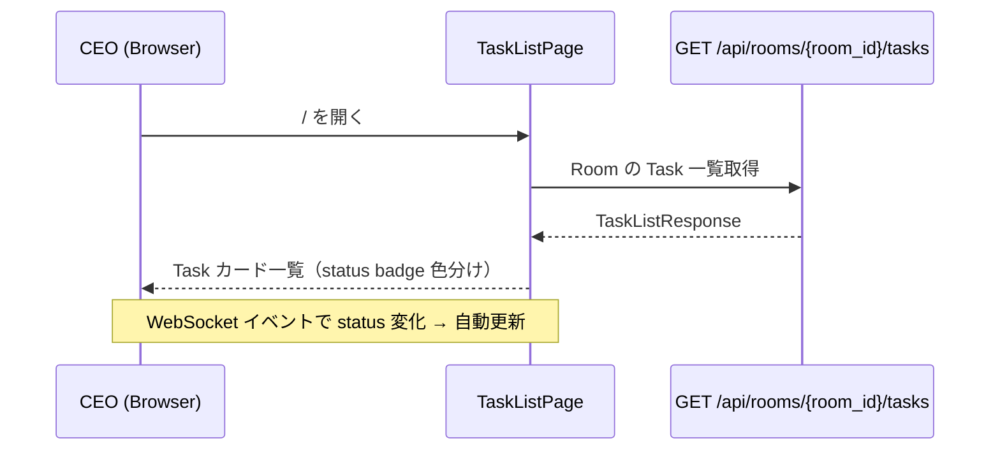
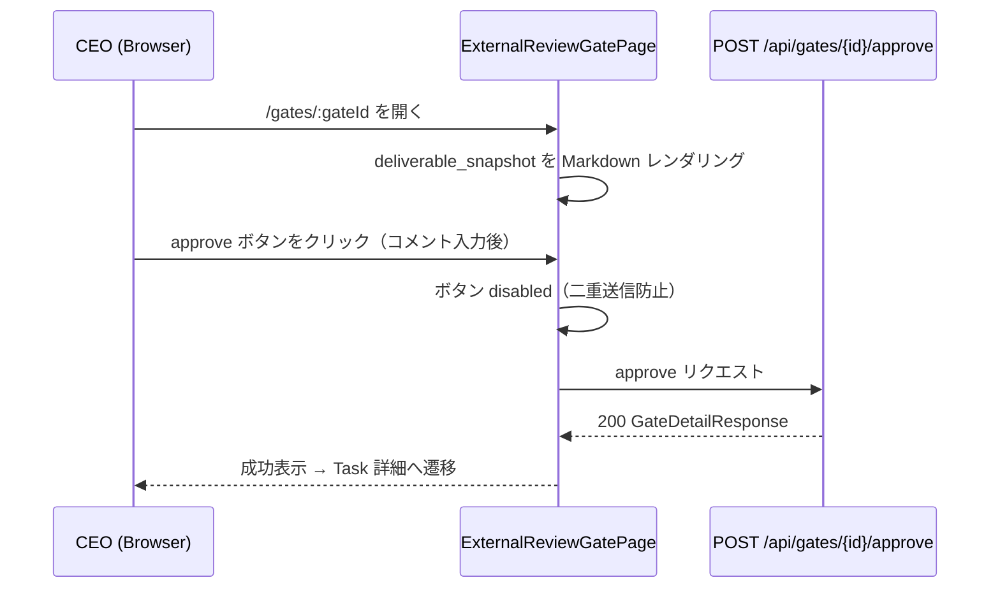

# 業務仕様書（feature-spec）— ceo-dashboard

> feature: `ceo-dashboard`（業務概念単位）
> sub-features: [`ui/`](ui/)
> 関連 Issue: [#167 feat(M6-B): React フロントエンドUI実装（ExternalReviewGate操作画面 + WebSocket連携 + ルーティング基盤）](https://github.com/bakufu-dev/bakufu/issues/167)
> 関連設計: [`docs/design/architecture.md`](../../design/architecture.md) / [`docs/features/external-review-gate/feature-spec.md`](../external-review-gate/feature-spec.md) / [`docs/features/task/feature-spec.md`](../task/feature-spec.md) / [`docs/features/directive/feature-spec.md`](../directive/feature-spec.md)

## 本書の役割

本書は **ceo-dashboard という業務概念全体の業務仕様** を凍結する。bakufu MVP ゴール「CEO が bakufu で bakufu 自立開発を指示できる状態」を React SPA として実現するための業務観点の要件を凍結する。実装レイヤー（React Router / Tailwind / WebSocket 等）への依存なく、CEO が観察可能な業務ふるまいを定義する。Vモデル正規工程では **要件定義（業務）** 相当。

各 sub-feature（[`ui/`](ui/)）は本書を **業務根拠の真実源** として参照する。sub-feature は本書の業務ルール R1-X を実装方針 §確定 A〜Z として展開し、本書には逆流させない。

**書くこと**:
- CEO が ceo-dashboard で達成できるユースケース（4 画面 + WebSocket）
- 業務ルール（WebSocket 再接続・ローディング・エラー表示・Gate 操作安全性等）
- E2E で観察可能な受入基準

**書かないこと**（sub-feature へ追い出す）:
- React コンポーネント設計・状態管理手法 → [`ui/basic-design.md`](ui/basic-design.md)
- API 呼び出しマッピング・WebSocket 再接続バックオフ値 → [`ui/detailed-design.md`](ui/detailed-design.md)
- テスト戦略（IT / UT） → [`ui/test-design.md`](ui/test-design.md)（テスト担当作成）

## 1. この feature の位置付け

bakufu MVP の最後の未実装ピース。バックエンド（M1〜M5-C）が全て完成した状態で、CEO が操作する唯一のフロントエンド SPA を実装する。

| レイヤー | feature | CEO から見た役割 |
|---|---|---|
| 業務UI | **ceo-dashboard（本 feature）** | Task 監視 / Gate 操作 / Directive 投入の操作端末 |
| バックエンドAPI | 複数 feature（task / directive / external-review-gate / websocket-broadcast）| UI の HTTP REST + WebSocket データソース |

**MVP での人間アクション**: CEO が行う操作は 2 種類のみ — **Directive 投入**（bakufu にタスクを依頼する）と **ExternalReviewGate の approve / reject**（AI 成果物を人間が確認する）。それ以外（Stage 実行・Agent 制御・InternalReviewGate）は bakufu が自律制御する。

## 2. 人間の要求

> Issue #167（M6-B）:
>
> 現在プレースホルダー（「bakufu — UI is coming soon」）のフロントエンドを本実装する。MVP ゴール「bakufuでbakufu自立開発を指示できる状態」に必要な最小画面セットを React で構築する。ExternalReviewGate の承認 / 差し戻し操作（人間が行う唯一のアクション）が中心。
>
> MVPは「動けばいい」レベルのシンプルUI。デザインより機能優先。モバイル対応はMVP外。

## 3. 背景・痛点

### 現状の痛点

1. `frontend/src/main.tsx` が `"bakufu — UI is coming soon"` のプレースホルダーのままであり、CEO が bakufu を操作する手段がブラウザ UI で存在しない
2. バックエンド API（Task / Gate / Directive / WebSocket）は全て M3〜M5 で実装済みだが、UI がないため ExternalReviewGate の approve / reject 操作は CLI / 直接 API 呼び出しのみで行える状態
3. Stage 実行の進行状況（IN_PROGRESS / AWAITING_EXTERNAL_REVIEW / DONE）がリアルタイムで視覚化されないため、CEO が bakufu の自律動作を把握できない

### 解決されれば変わること

- CEO がブラウザで `http://localhost:5173` にアクセスし、Directive を投入 → Task 監視 → Gate 承認/差し戻し という一連の業務フローを完結できる
- WebSocket によるリアルタイム更新で、手動リロードなく Task 進行状況を把握できる
- MVP ゴール「bakufu で bakufu の自立開発を指示できる状態」が UI 観点で達成される

## 4. ペルソナ

bakufu システム全体のペルソナは [`docs/analysis/personas.md`](../../analysis/personas.md) を参照。

| ペルソナ名 | 役割 | 達成したいゴール |
|-----------|------|---------------|
| 個人開発者 CEO（堀川さん想定）| bakufu に開発タスクを依頼し、AI 成果物を確認・承認する | Directive を投入して Task が自動完走する様子を監視し、Gate が届いたら成果物を確認して承認する |

### CEO のジャーニー（MVP）

1. `http://localhost:5173` でブラウザを開く
2. **Task 一覧画面**（`/`）で現在の Task 状況を一目で確認する
3. **Directive 投入画面**（`/directives/new`）で Room を選択し directive テキストを送信する → Task が起票され、Task 一覧に追加される
4. Task が IN_PROGRESS になり Stage が進行する様子を WebSocket リアルタイム更新で監視する
5. Task が AWAITING_EXTERNAL_REVIEW になると Gate が生成される → **Task 詳細画面**（`/tasks/:taskId`）でその旨を確認し、Gate リンクをたどる
6. **Gate 詳細画面**（`/gates/:gateId`）で AI の成果物（Markdown）を読み、approve / reject を判断して操作する
7. 承認後、Task が次 Stage に進み、最終的に DONE になるのを確認する

## 5. ユースケース

| UC ID | ペルソナ | ユーザーストーリー | 優先度 | 主担当 sub-feature |
|-------|---------|-----------------|-------|------|
| UC-CD-001 | CEO | Task 一覧画面で全 Task の status を色分け表示で確認できる | 必須 | ui |
| UC-CD-002 | CEO | Task 詳細画面で Stage 進行状況・現在の deliverable・関連 Gate を確認できる | 必須 | ui |
| UC-CD-003 | CEO | Gate 詳細画面で deliverable_snapshot（Markdown）を確認し、approve / reject / cancel できる | 必須 | ui |
| UC-CD-004 | CEO | Directive 投入画面で Room を選択してテキストを入力し、送信すると Task が起票される | 必須 | ui |
| UC-CD-005 | CEO | Task / Gate の状態変化が WebSocket でリアルタイムに UI に反映される（手動リロード不要） | 必須 | ui |
| UC-CD-006 | CEO | WebSocket 切断時に自動再接続が試みられ、接続状態が UI で確認できる | 必須 | ui |

### ユースケース詳細

#### UC-CD-001: Task 一覧表示

#### UC-CD-003: Gate 操作

## 6. スコープ

### In Scope

- 4 画面（Task 一覧 / Task 詳細 / Gate 詳細 / Directive 投入）の実装
- WebSocket 接続管理・自動再接続
- React Router 7 による SPA ルーティング
- Tailwind CSS によるスタイリング（status badge 色分け含む）
- react-markdown による deliverable_snapshot Markdown レンダリング

### Out of Scope（MVP 外・Phase 2 以降）

| 項目 | 理由 |
|---|---|
| Empire / Room / Agent / Workflow の CRUD 画面 | Issue #167 が「MVPから逆算した最小セット」として除外。API 直接呼び出し or CLI で代替可能 |
| 認証・ログイン画面 | MVP は単一ユーザー・単一ホスト前提。認証レイヤーは Phase 2 以降 |
| モバイル対応 | Issue #167 明示除外 |
| Discord 通知画面 | M6-A は post-MVP |
| Agent 操作画面 | bakufu が自律制御するため不要 |
| Workflow 編集 UI | JSON 定義で十分（MVP） |
| Dark mode | デザイン優先度低 |

## 7. 業務ルール

### R1-1: WebSocket 切断時は自動再接続する

WebSocket が切断（`onclose` / `onerror`）した場合、UI は自動的に再接続を試みる。再接続試行中は接続状態インジケータで CEO に通知する。接続が回復した際は画面データを再取得（クエリ再検証）して最新状態に戻す。

### R1-2: Gate 操作ボタンは二重送信を防止する

approve / reject / cancel ボタンは API リクエスト中は disabled 状態とする。リクエストが完了（成功 / 失敗）するまで CEO が再操作できないようにする。

### R1-3: reject 操作には feedback_text の入力を UI で促す

reject 時に feedback_text が空の場合、UI はサブミット前に警告を表示する。ただし API 側バリデーション（1 文字以上必須）が最終防衛線であり、UI は重複チェックとして機能する。

### R1-4: `<REDACTED:...>` マスキングテキストはそのまま表示する

バックエンドが masking gateway 適用後の `<REDACTED:DISCORD_WEBHOOK>` 等を返す場合、UI はそのまま文字列として表示する。UI 側での追加マスキング・置換は行わない。

### R1-5: API エラー時はエラーコードとメッセージを表示する

API が非 2xx を返した場合、UI はバックエンドの `{"error": {"code": str, "message": str}}` を読んでインラインエラーとして表示する。画面遷移は行わない。

### R1-6: Task 一覧はデフォルトで全 Room の Task を表示する

MVP では Empire 内の全 Room を横断した Task 一覧を表示する。Room フィルタは UI コントロールで絞り込めるが、初期状態は全表示とする。

### R1-7: Directive 投入には Room の選択が必要

Directive は特定の Room に対して発行するため、投入前に Room を選択させる。`VITE_EMPIRE_ID` 環境変数から Empire を特定し、Room 一覧をロードする。`VITE_EMPIRE_ID` が未設定の場合は設定エラーを画面に表示する。

## 8. 受入基準（E2E で観察可能な事象）

本 feature の受入基準は `docs/requirements/acceptance-criteria.md` の受入基準 #5（UI で承認 / 差し戻し）/ #6（差し戻し履歴表示）/ #7（Task DONE 表示）/ #9（WebSocket リアルタイム更新）と対応する。

| # | 受入基準 | 対応 UC |
|---|---|---|
| 1 | Task 一覧画面（`/`）で全 Task の status が色分け表示される（PENDING=gray / IN_PROGRESS=blue / AWAITING_EXTERNAL_REVIEW=yellow / DONE=green / BLOCKED=red / CANCELLED=gray）| UC-CD-001 |
| 2 | Task 詳細画面（`/tasks/:taskId`）で Stage 進行状況（Stage 名 + status バッジ）が表示される | UC-CD-002 |
| 3 | Task 詳細画面で現在の Stage の deliverable（本文）が Markdown レンダリングされて表示される（存在する場合）| UC-CD-002 |
| 4 | Task に PENDING Gate がある場合、Task 詳細画面から Gate 詳細画面へのリンクが表示される | UC-CD-002 |
| 5 | Gate 詳細画面（`/gates/:gateId`）で deliverable_snapshot が Markdown レンダリングされて表示される | UC-CD-003 |
| 6 | Gate 詳細画面で audit_trail（誰がいつ何をしたか）が時系列で表示される | UC-CD-003 |
| 7 | Gate 詳細画面で approve ボタン押下後、Gate status が APPROVED に変化し、Task が次 Stage に進む（WebSocket で確認可能）| UC-CD-003 |
| 8 | Gate 詳細画面で reject ボタン押下後、Gate status が REJECTED に変化し、Task が前段 Stage に戻る（WebSocket で確認可能）| UC-CD-003 |
| 9 | reject 操作は feedback_text 未入力の場合に UI 警告を表示し、空送信を防ぐ | UC-CD-003 |
| 10 | API リクエスト中は approve / reject / cancel ボタンが disabled になる（二重送信防止）| UC-CD-003 |
| 11 | Directive 投入画面（`/directives/new`）で Room 選択後にテキスト入力して送信すると、Task 一覧に新しい Task が追加される | UC-CD-004 |
| 12 | Task / Gate の status 変化が WebSocket イベント受信時に画面を手動リロードせず反映される（受入基準 #9 対応）| UC-CD-005 |
| 13 | WebSocket 切断時に接続状態インジケータが「切断中」を表示し、再接続成功後に「接続済み」に戻る | UC-CD-006 |
| 14 | API エラー時（404 / 409 / 422）に エラーメッセージがインライン表示される | 全 UC |

システムテスト戦略の詳細は [`system-test-design.md`](system-test-design.md) を参照。

## 9. sub-feature 責務分離マップ

| 実装レイヤー | sub-feature | 業務観点での役割 |
|---|---|---|
| SPA ルーティング + 全画面 | [`ui/`](ui/) | React Router 7 による 4 画面ルーティング、React Query によるデータ取得、WebSocket 接続管理、Tailwind CSS スタイリング、Gate 操作フォーム |
| バックエンド API | 既実装（task / directive / external-review-gate / websocket-broadcast）| REST エンドポイント・WebSocket イベントソース。本 feature からは参照のみ |

## 10. 開発者品質基準（CI 担保、業務要求ではない）

| 基準 | 内容 |
|---|---|
| 型チェック | `tsc --noEmit` strict mode で 0 error |
| Lint | `biome check` で 0 error |
| Unit/IT テスト | `vitest run` で全テスト green |
| バンドルサイズ | Vite build 成功（サイズ上限は MVP では設定しない）|
| 依存監査 | `osv-scanner` で既知 CVE 0 件（high/critical）|

## 11. 開放論点 (Open Questions)

| # | 論点 | 起票先 |
|---|---|---|
| Q-OPEN-1 | `VITE_EMPIRE_ID` が未設定の場合の UX（設定画面 vs エラーページ vs 自動検出）| Phase 2 検討 |
| Q-OPEN-2 | Empire / Room / Agent / Workflow CRUD 画面は何 Issue で実装するか | #172 MVP前最終確認で判断 |
| Q-OPEN-3 | WebSocket の認証（MVP では認証なし前提だが、Phase 2 以降で Bearer token 等が必要になるか）| Phase 2 設計 |
