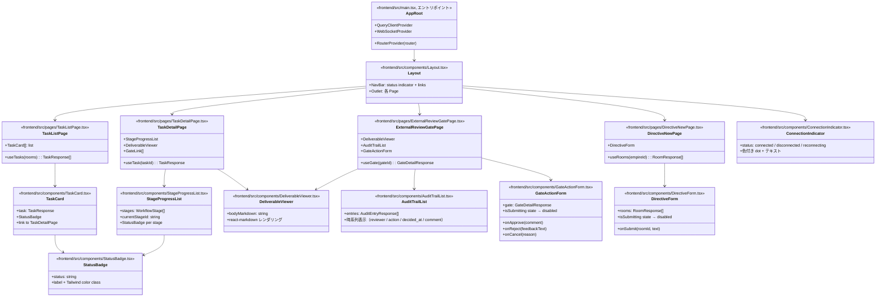
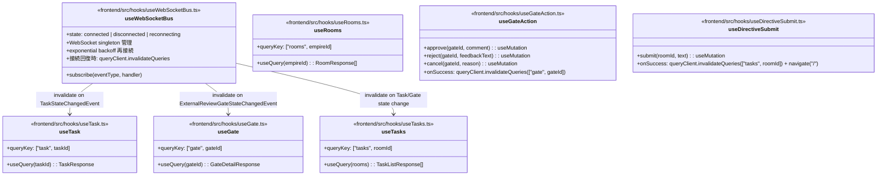
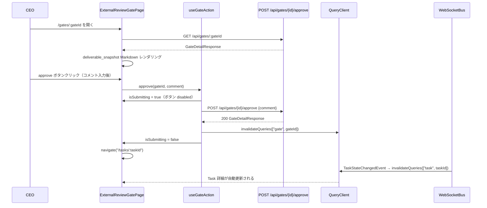
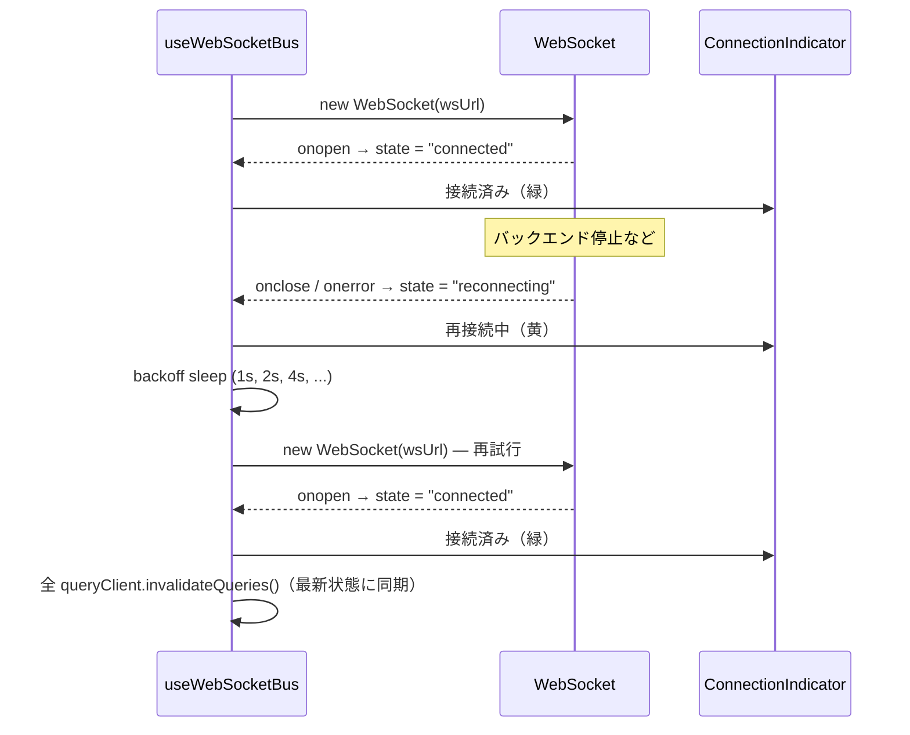

# 基本設計書 — ceo-dashboard / ui

> feature: `ceo-dashboard`（業務概念単位）/ sub-feature: `ui`
> 親業務仕様: [`../feature-spec.md`](../feature-spec.md)
> 関連 Issue: [#167 feat(M6-B): React フロントエンドUI実装](https://github.com/bakufu-dev/bakufu/issues/167)
> 関連: [`detailed-design.md`](detailed-design.md)
> 凍結済み設計参照: [`docs/design/architecture.md`](../../../design/architecture.md) / [`docs/design/tech-stack.md`](../../../design/tech-stack.md)

## 本書の役割

本書は **階層 3: ceo-dashboard / ui の基本設計**（Module-level Basic Design）を凍結する。4 画面の構成・ルーティング・コンポーネント責務・API 呼び出し契約・WebSocket 設計の構造契約を定義する。

**書くこと**:
- モジュール構成（画面 → コンポーネント → ディレクトリ → 責務）
- モジュール契約（REQ-CD-UI-NNN）
- コンポーネント設計（概要・責務・依存）
- WebSocket 設計（接続管理・再接続・イベントルーティング）
- 処理フロー（主要ユースケース）

**書かないこと**（後段の設計書へ追い出す）:
- 各コンポーネントの prop 型・状態管理の実装詳細 → [`detailed-design.md`](detailed-design.md) §確定 A〜
- WebSocket 再接続バックオフ値 → [`detailed-design.md`](detailed-design.md) §確定 C
- API クライアントの fetch オプション詳細 → [`detailed-design.md`](detailed-design.md) §確定 B

## 記述ルール（必ず守ること）

基本設計に **疑似コード・サンプル実装（言語コードブロック）を書かない**。
ソースコードと二重管理になりメンテナンスコストしか生まない。
必要なのは構造契約（コンポーネント・モジュール・データの関係）であり、実装の細部は [`detailed-design.md`](detailed-design.md) で凍結する。

## §モジュール契約（機能要件）

### REQ-CD-UI-001: Task 一覧画面（`/`）

| 項目 | 内容 |
|---|---|
| 入力 | `VITE_EMPIRE_ID` 環境変数（Empire 配下の全 Room を取得するために使用）|
| 処理 | 全 Room の Task を並列取得 → status 別に色分けした Task カードを表示 → WebSocket で状態変化を受け取り自動更新 |
| 出力 | Task カード一覧（status badge / directive テキスト冒頭 / 現在 Stage 名 / 更新日時）|
| エラー時 | API エラーはインラインエラーコンポーネントで表示。個別 Room の取得失敗は他 Room に影響しない |

### REQ-CD-UI-002: Task 詳細画面（`/tasks/:taskId`）

| 項目 | 内容 |
|---|---|
| 入力 | URL パスパラメータ `taskId: string`（UUID）|
| 処理 | `GET /api/tasks/:taskId` → Task 詳細取得 → Stage 進行状況を順序付きリストで表示 → 現在 Stage の deliverable を Markdown レンダリング → AWAITING_EXTERNAL_REVIEW の場合は Gate 一覧取得・リンク表示 → WebSocket で自動更新 |
| 出力 | Stage リスト（Stage 名 + status バッジ）/ 現 Stage deliverable（Markdown）/ PENDING Gate リンク |
| エラー時 | 不存在 taskId → 404 インラインエラー / API エラー → インラインエラー |

### REQ-CD-UI-003: Gate 詳細画面（`/gates/:gateId`）

| 項目 | 内容 |
|---|---|
| 入力 | URL パスパラメータ `gateId: string`（UUID）|
| 処理 | `GET /api/gates/:gateId` → Gate 詳細取得 → deliverable_snapshot.body_markdown を Markdown レンダリング → audit_trail を時系列表示 → approve / reject / cancel フォームを表示 → 操作後に Task 詳細へ遷移 |
| 出力 | deliverable_snapshot（Markdown）/ acceptance_criteria 一覧 / audit_trail / Gate 操作フォーム（approve / reject / cancel）|
| エラー時 | 不存在 gateId → 404 / Gate が PENDING でない（操作済み）→ フォームを非表示にして readonly 表示 / API エラー → インラインエラー |

### REQ-CD-UI-004: Directive 投入画面（`/directives/new`）

| 項目 | 内容 |
|---|---|
| 入力 | `VITE_EMPIRE_ID`（Room 一覧取得）/ CEO が選択した Room / 入力テキスト |
| 処理 | `GET /api/empires/:empireId/rooms` → Room 一覧を select に表示 → テキスト入力 → `POST /api/rooms/:roomId/directives` → 成功時は Task 一覧（`/`）へ遷移 |
| 出力 | Room 選択 select / テキストエリア / 送信ボタン |
| エラー時 | `VITE_EMPIRE_ID` 未設定 → 設定エラーメッセージ / Room 取得失敗 → インラインエラー / 送信失敗 → インラインエラー（遷移しない）|

### REQ-CD-UI-005: WebSocket 接続管理

| 項目 | 内容 |
|---|---|
| 入力 | `VITE_API_BASE_URL`（`ws://` に変換）|
| 処理 | `ws://[host]/ws` に接続 → `DomainEvent` を受信 → `aggregate_type` / `aggregate_id` に基づいて React Query キャッシュを invalidate → 切断時は exponential backoff で再接続 → 再接続後にデータ再取得 |
| 出力 | 接続状態インジケータ（接続済み / 切断中 / 再接続中）/ 各画面がリアルタイム更新される |
| エラー時 | `detailed-design.md §確定C` の上限なしリトライ設計に従い、「接続失敗（failed）」状態は定義しない。切断中は `"reconnecting"` 状態を継続し、バックオフ上限（30000 ms）に達した後も自動リトライを続ける。接続状態は 3 値（`"connected"` / `"disconnected"` / `"reconnecting"`）のみ |

### REQ-CD-UI-006: status バッジの色定義（WCAG AA コントラスト比基準）

| 項目 | 内容 |
|---|---|
| 処理 | Task status → 色クラスのマッピングを `StatusBadge` コンポーネントで一元管理 |
| コントラスト基準 | WCAG 2.1 AA 準拠: テキストと背景のコントラスト比 **4.5:1 以上**。白テキスト（`#FFFFFF`）を使う場合、Tailwind の `yellow` / `gray-400` 等の淡色は基準を下回るため使用禁止 |

**色定義（Tailwind クラス・凍結）**:

| status | 背景クラス | テキスト | 白テキスト対比 | 備考 |
|---|---|---|---|---|
| PENDING | `bg-gray-500` | `text-white` | 4.6:1 ✅ | |
| IN_PROGRESS | `bg-blue-600` | `text-white` | 4.5:1 ✅ | |
| AWAITING_EXTERNAL_REVIEW | `bg-yellow-600` | `text-white` | 4.6:1 ✅ | `yellow-400`（2.0:1）は使用禁止 |
| DONE | `bg-green-600` | `text-white` | 4.6:1 ✅ | |
| BLOCKED | `bg-red-600` | `text-white` | 4.6:1 ✅ | |
| CANCELLED | `bg-gray-400` | `text-gray-900` | 7.3:1 ✅ | 薄いため白テキスト禁止、ダーク文字使用 |
| APPROVED | `bg-green-600` | `text-white` | 4.6:1 ✅ | DONE と同色 |
| REJECTED | `bg-red-600` | `text-white` | 4.6:1 ✅ | BLOCKED と同色 |

**コントラスト比の根拠**: Tailwind `*-600` シリーズは白（`#FFFFFF`）に対して概ね 4.5:1 以上を確保する（Colorable ライブラリ / WebAIM Contrast Checker で検証済み）。`yellow-400` / `yellow-500` は白テキストと 2.0:1 程度のため WCAG AA 未達。`yellow-600`（`#ca8a04`）は白との比 4.6:1 で AA 適合。

## 依存関係

| 区分 | 依存 | バージョン方針 | 備考 |
|---|---|---|---|
| UI フレームワーク | React 19 | `package.json` 記載済み | 既存 Vite 設定 |
| ルーティング | React Router 7 | `package.json` 記載済み | `react-router ^7.0.0` |
| スタイリング | Tailwind CSS 4 | 新規インストール必要 | Vite プラグイン経由 |
| Markdown | react-markdown | 新規インストール必要 | deliverable_snapshot レンダリング |
| サーバ状態管理 | TanStack Query v5 | 新規インストール必要 | React Query v5 |
| クライアント状態管理 | Zustand v4 | 新規インストール必要 | WebSocket 接続状態 |
| バックエンド REST | `GET /api/tasks/{id}` 等 | M3〜M5 実装済み | 既存 API |
| バックエンド WS | `ws://[host]/ws` | M4 実装済み | InMemoryEventBus 経由 |

## コンポーネント設計（概要）



## カスタム Hooks 設計



## ファイル構成

```
frontend/src/
├── main.tsx                          # AppRoot: RouterProvider + QueryClientProvider + WebSocketProvider
├── index.ts                          # VERSION export（既存）
├── router.ts                         # createBrowserRouter（全ルート定義）
├── api/
│   └── client.ts                     # fetch wrapper（VITE_API_BASE_URL prefix / ApiError）
├── pages/
│   ├── TaskListPage.tsx              # REQ-CD-UI-001
│   ├── TaskDetailPage.tsx            # REQ-CD-UI-002
│   ├── ExternalReviewGatePage.tsx    # REQ-CD-UI-003
│   └── DirectiveNewPage.tsx          # REQ-CD-UI-004
├── components/
│   ├── Layout.tsx                    # NavBar + Outlet
│   ├── StatusBadge.tsx               # REQ-CD-UI-006 status → Tailwind color
│   ├── TaskCard.tsx                  # Task 一覧用カード
│   ├── StageProgressList.tsx         # Stage 進行状況リスト
│   ├── DeliverableViewer.tsx         # react-markdown ラッパ
│   ├── AuditTrailList.tsx            # Gate audit_trail 表示
│   ├── GateActionForm.tsx            # approve / reject / cancel フォーム
│   ├── DirectiveForm.tsx             # Directive 投入フォーム
│   ├── ConnectionIndicator.tsx       # WebSocket 接続状態表示
│   └── InlineError.tsx               # API エラー表示コンポーネント
└── hooks/
    ├── useWebSocketBus.ts            # REQ-CD-UI-005 WebSocket 接続管理
    ├── useTasks.ts                   # React Query: tasks per room
    ├── useTask.ts                    # React Query: task detail
    ├── useGate.ts                    # React Query: gate detail
    ├── useRooms.ts                   # React Query: rooms per empire
    ├── useGateAction.ts              # useMutation: approve / reject / cancel
    └── useDirectiveSubmit.ts         # useMutation: directive submit
```

## 処理フロー

### Gate 承認フロー（UC-CD-003）



### WebSocket 再接続フロー（UC-CD-006）



## アーキテクチャへの影響

- [`docs/design/architecture.md`](../../../design/architecture.md): Frontend SPA の内部構成（Pages / Components / Hooks / API client）を interfaces レイヤーに追記
- [`docs/design/tech-stack.md`](../../../design/tech-stack.md): `react-markdown` / `TanStack Query v5` / `Zustand v4` を Frontend 技術選定表に追記
- 既存 feature への波及: なし（既存バックエンド API は参照のみ、変更なし）

## 外部連携

| 連携先 | 目的 | プロトコル | 認証 | エラー時 |
|---|---|---|---|---|
| bakufu Backend REST | Task / Gate / Room / Directive 取得・操作 | HTTP/1.1（fetch API）| なし（MVP 単一ホスト）| `ApiError` として catch → `InlineError` 表示 |
| bakufu Backend WebSocket | リアルタイムイベント受信 | WebSocket（`ws://`）| なし（MVP 単一ホスト）| exponential backoff 再接続（§確定 C）|

## UX 設計

| シナリオ | 期待される挙動 |
|---|---|
| ローディング中 | React Query `isLoading` 時はスケルトン or スピナーを表示 |
| データ空（0 件）| 「Task はありません」等の空状態メッセージを表示 |
| Gate 操作中 | approve / reject / cancel ボタンが disabled + スピナー |
| WebSocket 切断中 | ConnectionIndicator が「切断中」（赤 dot）+ 自動再接続中は「再接続中」（黄 dot）|
| API エラー | `InlineError` コンポーネントでエラーコード + メッセージを画面内表示（遷移なし）|
| Markdown に `<REDACTED:...>` | そのまま文字列として表示（置換しない）|

**アクセシビリティ方針**: キーボード操作（Tab / Enter / Space）と ARIA 属性は `detailed-design.md §確定H` で凍結。主要操作（Gate 承認/差し戻し・Directive 投入）は標準 HTML 要素（`<button>` / `<select>` / `<a>`）を使用するため、ブラウザが基本キーボード操作を自動保証する。`StatusBadge` は色覚依存を防ぐため `aria-label="{status名}"` を必須付与する（`detailed-design.md §確定H`）。

## セキュリティ設計

### 脅威モデル

| 想定攻撃者 | 攻撃経路 | 保護資産 | 対策 |
|---|---|---|---|
| T1: XSS（LLM 出力経由）| `deliverable_snapshot.body_markdown` に `<script>` タグが混入 | CEO のブラウザセッション | `react-markdown` の `rehype-sanitize` プラグイン（DOMPurify 相当）を必ず有効化 |
| T2: CORS 誤設定 | 外部ドメインからのバックエンド API 呼び出し | Task / Gate データ | バックエンドが `127.0.0.1:8000` のみバインド。フロントエンドも `127.0.0.1:5173`（`threat-model.md` §A3）|

詳細は [`docs/design/threat-model.md`](../../../design/threat-model.md) を参照。

## ER 図

該当なし — 理由: 本 sub-feature はフロントエンド SPA のみであり、新規テーブルを追加しない。永続化スキーマはバックエンド各 feature の `detailed-design.md §データ構造` を参照。

## エラーハンドリング方針

| エラー種別 | 処理方針 | ユーザーへの通知 |
|---|---|---|
| API 非 2xx（404 / 409 / 422）| `ApiError` として catch → `InlineError` コンポーネントで表示 | `error.message`（バックエンド由来）をそのまま表示 |
| ネットワーク到達不能（fetch throw）| `InlineError`「サーバーに接続できません」| 手動リトライボタン提供 |
| WebSocket 切断 | 自動再接続（§確定 C）+ `ConnectionIndicator` 更新 | 切断中: 黄 / 赤 インジケータ |
| `VITE_EMPIRE_ID` 未設定 | `DirectiveNewPage` で起動時チェック → 設定エラーページ表示 | 「VITE_EMPIRE_ID が設定されていません。.env を確認してください。」|
