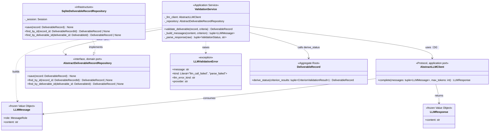
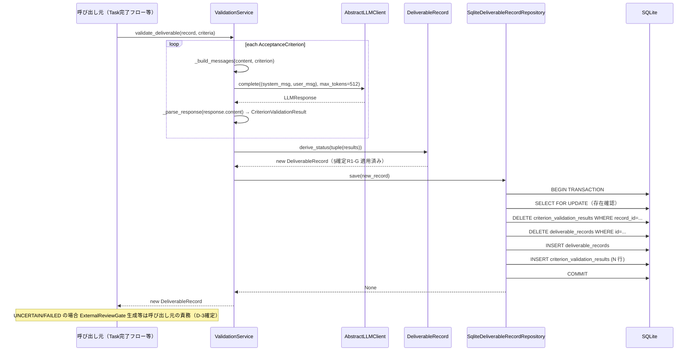
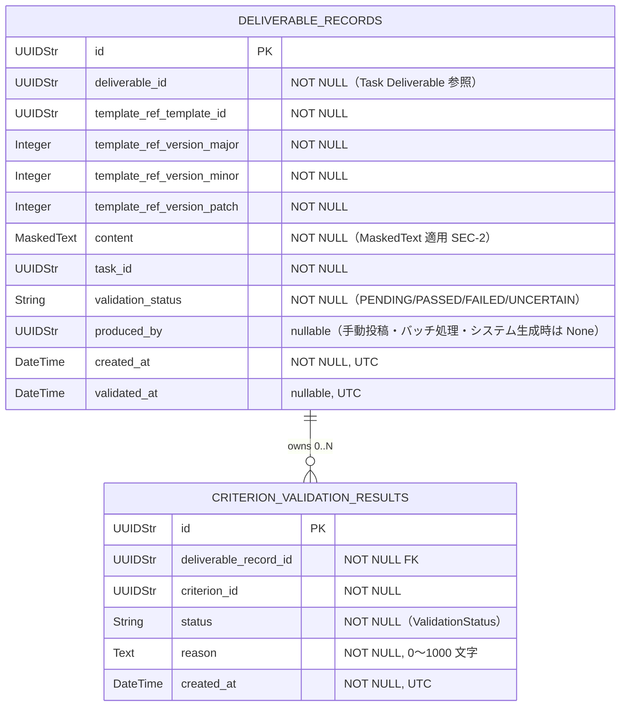

# 基本設計書 — deliverable-template / ai-validation

> feature: `deliverable-template` / sub-feature: `ai-validation`
> 親 spec: [`../feature-spec.md`](../feature-spec.md) §9 受入基準 16〜17 / §確定 R1-G
> 関連: [`../domain/basic-design.md`](../domain/basic-design.md)（DeliverableRecord・derive_status 定義元）/ [`../../external-review-gate/domain/basic-design.md`](../../external-review-gate/domain/basic-design.md)（7 段階 save() パターン継承元）/ [`../../llm-client/domain/basic-design.md`](../../llm-client/domain/basic-design.md)（AbstractLLMClient・LLMClientError 定義元）

## 本書の役割

本書は **階層 3: モジュール（sub-feature）の基本設計**（Module-level Basic Design）を凍結する。`ai-validation` sub-feature は `deliverable-template` feature が定義する `DeliverableRecord` Aggregate に対して **LLM による受入基準評価** を実行し、評価済み `DeliverableRecord` を永続化する Application Service / infrastructure 実装群を担う。

LLM 呼び出し方式は **CLIサブプロセス経由**（`ClaudeCodeLLMClient` / `CodexLLMClient`）を採用する。APIキー直接管理は一切行わない。

**書くこと**: モジュール構成・モジュール契約・クラス設計（概要）・処理フロー・シーケンス図・脅威モデル・エラーハンドリング方針。
**書かないこと**: メソッド呼び出し細部・属性型・制約・MSG 確定文言 → [`detailed-design.md`](detailed-design.md)。

## 記述ルール（必ず守ること）

基本設計に**疑似コード・サンプル実装（python/ts/sh/yaml 等の言語コードブロック）を書かない**。
ソースコードと二重管理になりメンテナンスコストしか生まない。
必要なのは構造契約（クラス・モジュール・データの関係）であり、実装の細部は [`detailed-design.md`](detailed-design.md) で凍結する。

## §モジュール契約（機能要件）

| 要件ID | 概要 | 入力 | 処理 | 出力 | エラー時 | 親 spec 参照 |
|--------|------|------|------|------|---------|-------------|
| REQ-AIVM-001 | ValidationService.validate_deliverable（LLM 検証フロー orchestration）| `record: DeliverableRecord`（PENDING 状態）/ `criteria: tuple[AcceptanceCriterion, ...]` | ① 各 criterion について `LLMMessage` タプルを構築 ② `AbstractLLMClient.complete((system_msg, user_msg), max_tokens=512)` を呼び評価 ③ `response.content` を JSON パース → `CriterionValidationResult` を収集 ④ `record.derive_status(tuple(results))` で評価済み record を生成 ⑤ 評価済み record を `AbstractDeliverableRecordRepository.save(record)` で永続化 ⑥ updated record を返す | 評価済み `DeliverableRecord`（`validation_status` が PASSED / FAILED / UNCERTAIN に更新）| `LLMValidationError`: LLM 呼び出し失敗（MSG-AIVM-001）/ `LLMValidationError`: 応答パース失敗（MSG-AIVM-002）| §9 AC#16, 17 |
| REQ-AIVM-002 | ValidationService 内プロンプト構築（構造化 LLMMessage タプル生成）| `content: str`（DeliverableRecord.content）/ `criterion: AcceptanceCriterion` | System メッセージ（役割指示 + 出力フォーマット指定）と User メッセージ（Criterion block + Content block delimiter 分離）を構築し `tuple[LLMMessage, LLMMessage]` を返す | `tuple[LLMMessage, LLMMessage]` | 該当なし（純粋関数）| §9 AC#16, 17 |
| REQ-AIVM-003 | SqliteDeliverableRecordRepository（3 method: save / find_by_id / find_by_deliverable_id）| save: `record: DeliverableRecord` / find_by_id: `record_id: DeliverableRecordId` / find_by_deliverable_id: `deliverable_id: DeliverableId` | save: 7 段階 save() パターン（ExternalReviewGate repository 踏襲）— ① BEGIN TRANSACTION ② SELECT FOR UPDATE（存在確認）③ DELETE 既存 criterion_validation_results ④ DELETE 既存 deliverable_records ⑤ INSERT deliverable_records ⑥ INSERT criterion_validation_results ⑦ COMMIT / find_by_id: `deliverable_records` + JOIN `criterion_validation_results` で 1 件取得、デシリアライズ / find_by_deliverable_id: deliverable_id で 1 件取得（最新評価結果）| save: `None` / find_by_id: `DeliverableRecord \| None` / find_by_deliverable_id: `DeliverableRecord \| None` | `sqlalchemy.exc.SQLAlchemyError` を `RepositoryError` にラップして伝播 | §9 AC#16 |
| REQ-AIVM-004 | Alembic migration 0015（deliverable_records + criterion_validation_results テーブル）| なし（マイグレーション実行コンテキスト）| `deliverable_records` テーブルと `criterion_validation_results` テーブルを新規作成。`down_revision="0014_external_review_gate_criteria"` | なし | Alembic 実行エラー（`alembic upgrade head` で検出）| §9 AC#16 |

## モジュール構成

| 機能 ID | モジュール | ディレクトリ | 責務 |
|--------|----------|------------|------|
| REQ-AIVM-001, 002 | `ValidationService` Application Service | `backend/src/bakufu/application/services/validation_service.py`（新規）| DeliverableRecord 評価フローの orchestration。プロンプト構築・LLM 呼び出し・応答パース・status 導出・永続化。DI: `AbstractLLMClient` + `AbstractDeliverableRecordRepository` |
| REQ-AIVM-001 | `AbstractLLMClient` （利用のみ） | `backend/src/bakufu/application/ports/llm_client.py`（llm-client feature 提供）| `complete(messages, max_tokens) -> LLMResponse` を提供する Protocol。ValidationService が DI で受け取る |
| REQ-AIVM-003 | `AbstractDeliverableRecordRepository` | `backend/src/bakufu/domain/ports/deliverable_record_repository.py`（新規）| Repository の domain port インターフェース（`save` / `find_by_id` / `find_by_deliverable_id`）|
| REQ-AIVM-003 | `SqliteDeliverableRecordRepository` | `backend/src/bakufu/infrastructure/repository/sqlite_deliverable_record_repository.py`（新規）| SQLite + SQLAlchemy ORM による concrete repository 実装。7 段階 save() パターン |
| REQ-AIVM-003 | ORM テーブル定義 | `backend/src/bakufu/infrastructure/persistence/sqlite/tables/deliverable_records.py`（新規）/ `criterion_validation_results.py`（新規）| `deliverable_records` / `criterion_validation_results` の SQLAlchemy Table 定義（CI スキャン対象ディレクトリ）|
| REQ-AIVM-004 | Alembic migration 0015 | `backend/migrations/versions/0015_deliverable_records.py`（新規）| `deliverable_records` + `criterion_validation_results` テーブル作成 |
| REQ-AIVM-001〜003 | CI 三層防衛 | `backend/tests/application/services/test_validation_service.py` / `backend/tests/infrastructure/repository/test_sqlite_deliverable_record_repository.py`（新規）| UT: ValidationService / IT: SqliteDeliverableRecordRepository（SQLite in-memory）|
| REQ-AIVM-001〜002 | `LLMValidationError` 例外 | `backend/src/bakufu/domain/exceptions/deliverable_template.py`（既存ファイル更新）| LLM 呼び出し失敗 / 応答パース失敗の共通例外型（typed フィールド構造）|

```
ディレクトリ構造（本 sub-feature で追加・変更されるファイル）:

.
├── backend/
│   ├── src/
│   │   └── bakufu/
│   │       ├── domain/
│   │       │   ├── ports/
│   │       │   │   └── deliverable_record_repository.py    # AbstractDeliverableRecordRepository (新規)
│   │       │   └── exceptions/
│   │       │       └── deliverable_template.py             # 既存更新: LLMValidationError 追加
│   │       ├── application/
│   │       │   ├── ports/
│   │       │   │   └── llm_client.py                       # AbstractLLMClient (llm-client feature 提供)
│   │       │   └── services/
│   │       │       └── validation_service.py               # ValidationService (新規)
│   │       └── infrastructure/
│   │           ├── persistence/
│   │           │   └── sqlite/
│   │           │       └── tables/
│   │           │           ├── deliverable_records.py       # ORM テーブル定義 (新規, CI スキャン対象)
│   │           │           └── criterion_validation_results.py  # ORM テーブル定義 (新規, CI スキャン対象)
│   │           └── repository/
│   │               └── sqlite_deliverable_record_repository.py  # SqliteDeliverableRecordRepository (新規)
│   ├── migrations/
│   │   └── versions/
│   │       └── 0015_deliverable_records.py                 # Alembic 0015 (新規)
│   └── tests/
│       ├── application/
│       │   └── services/
│       │       └── test_validation_service.py              # UT: ValidationService (新規)
│       ├── infrastructure/
│       │   └── repository/
│       │       └── test_sqlite_deliverable_record_repository.py  # IT: Repository (新規)
│       └── factories/
│           └── deliverable_record.py                        # DeliverableRecordFactory (新規)
└── docs/
    └── features/
        └── deliverable-template/
            └── ai-validation/                               # 本 sub-feature 設計書群
```

## クラス設計（概要）



**凝集のポイント**:

- `ValidationService` が orchestration・プロンプト構築・応答パースを一元管理。LLM API 詳細・DB 詳細を知らない（依存方向: Application → Application Port ← Infrastructure）
- `AbstractLLMValidationPort`（旧 domain port 2段階構造）は廃止。`AbstractLLMClient` を ValidationService が直接 DI で受け取る 1段階 Port 設計
- `DeliverableRecord.derive_status(criterion_results)` は純粋関数。domain Aggregate への infrastructure Port 注入（旧 `validate_criteria(criteria, llm_port)` パターン）を廃止し DDD 違反を解消
- `SqliteDeliverableRecordRepository` は ExternalReviewGate repository と同一の 7 段階 save() パターン（一貫性）
- ORM テーブル定義を `infrastructure/persistence/sqlite/tables/` に配置することで CI 自動スキャンの対象に含める（タブリーズ SEC-1 解消）

## 処理フロー

### ユースケース 1: 正常系 — DeliverableRecord AI 検証

1. 呼び出し元（Task 完了フロー等）が `ValidationService.validate_deliverable(record, criteria)` を呼ぶ
2. `ValidationService` が各 `AcceptanceCriterion` について `_build_messages(content, criterion)` で `tuple[LLMMessage, LLMMessage]` を構築
3. `self._llm_client.complete((system_msg, user_msg), max_tokens=512)` を呼び `LLMResponse` を取得
4. `_parse_response(response.content)` で `(ValidationStatus, reason: str)` を抽出し `CriterionValidationResult` を収集
5. `new_record = record.derive_status(tuple(results))` で pure 関数的に評価済み record を生成（§確定 R1-G 適用）
6. `self._repository.save(new_record)` で永続化
7. `new_record` を呼び出し元に返す
8. 呼び出し元が `validation_status` を確認し UNCERTAIN / FAILED の場合は ExternalReviewGate 生成等を実施（呼び出し元の責務、**D-3 確定**）

### ユースケース 2: LLM 失敗 Fail Fast

1. `self._llm_client.complete()` が `LLMClientError` サブクラスを raise（`LLMTimeoutError` / `LLMRateLimitError` / `LLMAuthError` / `LLMAPIError`）
2. `ValidationService` が catch → `LLMValidationError(kind='llm_call_failed', llm_error_kind=<サブクラス識別>, provider=exc.provider)` に変換して raise（握り潰し禁止）
3. 呼び出し元が MSG-AIVM-001 を表示し処理中断

### ユースケース 3: 応答パース失敗

1. `self._llm_client.complete()` は成功するが `response.content` が期待 JSON 形式でない
2. `_parse_response()` が `LLMValidationError(kind='parse_failed', llm_error_kind='', provider=<現在のプロバイダ>)` を raise
3. 呼び出し元が MSG-AIVM-002 を表示し処理中断

### ユースケース 4: Alembic 0015 初期化

1. `alembic upgrade head` 実行時に `0015_deliverable_records.py` が適用される
2. `deliverable_records` テーブルを `deliverable_id` / `validation_status` インデックス付きで作成
3. `criterion_validation_results` テーブルを `deliverable_record_id` FK + インデックス付きで作成
4. `down_revision="0014_external_review_gate_criteria"` で順序を保証

## シーケンス図



## ユーザー向けメッセージ一覧

| ID | 種別 | メッセージ（要旨） | 表示条件 |
|---|---|---|---|
| MSG-AIVM-001 | エラー | LLM 呼び出し失敗（CLIサブプロセスタイムアウト / 認証エラー等）| `LLMValidationError(kind='llm_call_failed')` raise 時 |
| MSG-AIVM-002 | エラー | LLM 応答の JSON パース失敗 | `LLMValidationError(kind='parse_failed')` raise 時 |

各メッセージの確定文言は [`detailed-design.md §MSG 確定文言表`](detailed-design.md) で凍結する。

## 依存関係

| 区分 | 依存 | バージョン方針 | 備考 |
|---|---|---|---|
| ランタイム | Python 3.12+ | `pyproject.toml` | 既存 |
| ランタイム | `pydantic` v2 | `pyproject.toml` | 既存。`CriterionValidationResult` に使用 |
| application port | `AbstractLLMClient` | llm-client feature（Issue #144）| `complete(messages, max_tokens)` Protocol。CLIサブプロセス経由で LLM 呼び出し |
| infrastructure | `ClaudeCodeLLMClient` / `CodexLLMClient` | llm-client feature 提供 | DI で `AbstractLLMClient` として注入される concrete 実装 |
| ランタイム | `sqlalchemy` v2 | `pyproject.toml` | 既存。SqliteDeliverableRecordRepository に使用 |
| ランタイム | `alembic` | `pyproject.toml` | 既存。migration 0015 に使用 |
| 廃止 | `anthropic` SDK / `openai` SDK | — | 旧設計（PR #147 クローズ済み）で依存。新設計では不要 |
| 廃止 | `BAKUFU_LLM_VALIDATION_PROVIDER` / `BAKUFU_LLM_VALIDATION_API_KEY` | — | LLM プロバイダ設定は `LLMClientConfig`（llm-client feature）が一元管理。ai-validation は環境変数を直接管理しない |

## アーキテクチャへの影響

- [`docs/design/domain-model/storage.md`](../../../design/domain-model/storage.md) への変更: `deliverable_records` / `criterion_validation_results` テーブル追加（Alembic 0015 で実装）
- [`docs/design/domain-model/aggregates.md`](../../../design/domain-model/aggregates.md) への変更: §DeliverableRecord Aggregate 追加（本 PR で記述）
- [`docs/design/tech-stack.md`](../../../design/tech-stack.md) への変更: `anthropic` SDK / `openai` SDK を削除。llm-client feature の CLI サブプロセス方式を追記
- 既存 feature への波及: `external-review-gate` feature は本 sub-feature から変更不要。D-3 確定により呼び出し元が ExternalReviewGate 生成を判断（疎結合）

## 外部連携

| 連携先 | 目的 | プロトコル / 方式 | 認証 | タイムアウト / リトライ |
|-------|------|----------|-----|-------------------|
| Claude Code CLI（`claude` コマンド）| AcceptanceCriterion 単位の LLM 評価 | CLIサブプロセス（`claude -p <prompt> --output-format stream-json --verbose`）| OAuthトークン自動認証（環境変数不要）| llm-client feature の `LLMClientConfig` が管理 |
| Codex CLI（`codex` コマンド）| 同上（Codex プロバイダ選択時）| CLIサブプロセス（`codex exec --json --ephemeral`）| サブスク認証（OpenAI auth）| 同上 |

## UX 設計

該当なし — 理由: infrastructure / application 層のみ。直接 UI はない。LLM 検証結果（validation_status）の UI 表現は将来の `deliverable-template/http-api` sub-feature で扱う。

## セキュリティ設計

### 脅威モデル

| ID | 想定攻撃者 | 攻撃経路 | 保護資産 | 対策 |
|---|-----------|---------|---------|------|
| **T1** | Prompt Injection | `DeliverableRecord.content` に LLM 操作コマンドを埋め込み、LLM の応答を改ざんする | 評価結果の信頼性（ValidationStatus の正確性）| 構造化プロンプト（System / User / Criterion の明確な役割分離）。content は `--- BEGIN CONTENT ---` / `--- END CONTENT ---` delimiter 内に閉じ込め。system msg にユーザー入力を含まない（§確定 B）|
| **T2** | 機密情報漏洩 | LLM 呼び出しエラー時に内部情報がログや例外 detail に混入 | システム内部情報 | `LLMValidationError` の typed フィールド（`message` / `kind` / `llm_error_kind` / `provider`）に機密情報を含めない設計。`LLMClientError.provider` の値（"claude-code" / "codex"）のみを `provider` フィールドに格納 |
| **T3** | content 機密情報の LLM 送信 | `DeliverableRecord.content` に PII 等が含まれる場合、LLM CLI 経由で第三者に送信される | ユーザーデータ / 業務機密 | `deliverable_records.content` に `MaskedText` を適用（agent 出力への APIキー等の混入防止）。詳細は §MaskedText 適用（下記）参照 |
| **T4** | 任意コマンド実行 | CLIサブプロセスの引数を操作して任意コマンドを実行 | システムセキュリティ | `ClaudeCodeLLMClient` / `CodexLLMClient` は引数リストを固定。プロンプト文字列のみ変動パラメータとして渡し、シェルインジェクションが不可能な `subprocess` の list 形式を使用（llm-client feature §確定 参照）|

### MaskedText 適用（SEC-2 解消）

`deliverable_records.content` カラムに `MaskedText` を適用する。エージェントが出力した成果物テキストに APIキー・トークン等の機密情報が混入する可能性があるため、永続化前にマスキングを実施する。

### CI 申し送り（SEC-4 解消）

実装 PR は `scripts/ci/check_masking_columns.sh` の `NO_MASK_FILES` または `PARTIAL_MASK_FILES` に以下を追加すること:
- `infrastructure/persistence/sqlite/tables/deliverable_records.py`
- `infrastructure/persistence/sqlite/tables/criterion_validation_results.py`

### OWASP Top 10 対応

| # | カテゴリ | 対応状況 |
|---|---------|---------|
| A01 | Broken Access Control | 該当なし（application / infrastructure 層。アクセス制御は上位層責務）|
| A02 | Cryptographic Failures | **適用**: APIキー直接管理なし。CLIサブプロセスの OAuth/サブスク認証に委任 |
| A03 | Injection | **適用**: T1 Prompt Injection 対策（構造化プロンプト・delimiter 分離）/ T4 シェルインジェクション対策（list 形式サブプロセス）|
| A04 | Insecure Design | **適用**: Fail Fast（LLMClientError は即 LLMValidationError に変換）/ domain port パターン（依存逆転）/ UNCERTAIN/FAILED の escalation 責務分離（D-3 確定）|
| A05 | Security Misconfiguration | **適用**: llm-client feature の `LLMClientConfig` が一元管理。ai-validation は設定責務を持たない |
| A06 | Vulnerable and Outdated Components | `anthropic` SDK / `openai` SDK への直接依存を廃止。CLIツールのバージョン管理は llm-client feature 責務 |
| A07 | Auth Failures | 該当なし（認証・認可は application 層上位の責務）|
| A08 | Data Integrity Failures | **適用**: 7 段階 save() / `derive_status` 純粋関数 / `model_validate` による不変条件再検査 |
| A09 | Logging Failures | **適用**: `LLMValidationError` は typed フィールドのみ。機密情報をフィールドに含めない設計 |
| A10 | SSRF | **適用**: CLIサブプロセスで外部 URL を直接指定しない。エンドポイントは CLI ツール固定 |

## ER 図



## エラーハンドリング方針

| 例外種別 | 起源 | 処理方針 | ユーザーへの通知 |
|---------|------|---------|----------------|
| `LLMClientError` サブクラス（`LLMTimeoutError` / `LLMRateLimitError` / `LLMAuthError` / `LLMAPIError`）| `AbstractLLMClient.complete()` | `ValidationService` で catch → `LLMValidationError(kind='llm_call_failed', llm_error_kind=<サブクラス識別>, provider=exc.provider)` に変換して raise | MSG-AIVM-001 |
| JSON パース失敗（`response.content` が期待 JSON 形式でない）| `ValidationService._parse_response()` | `LLMValidationError(kind='parse_failed', llm_error_kind='', provider=<現在のプロバイダ>)` を raise | MSG-AIVM-002 |
| `pydantic.ValidationError`（DeliverableRecord 再構築）| `DeliverableRecord.derive_status()` | application 層で catch、500 Internal にマッピング（domain 不変条件違反は呼び元バグ）| 汎用エラーメッセージ |
| `sqlalchemy.exc.SQLAlchemyError` | `SqliteDeliverableRecordRepository.save()` | `RepositoryError` にラップして伝播。トランザクションロールバック | 汎用エラーメッセージ |
| その他未捕捉例外 | — | 握り潰さない、application 層へ伝播（Fail Fast 原則）| 汎用エラーメッセージ |
