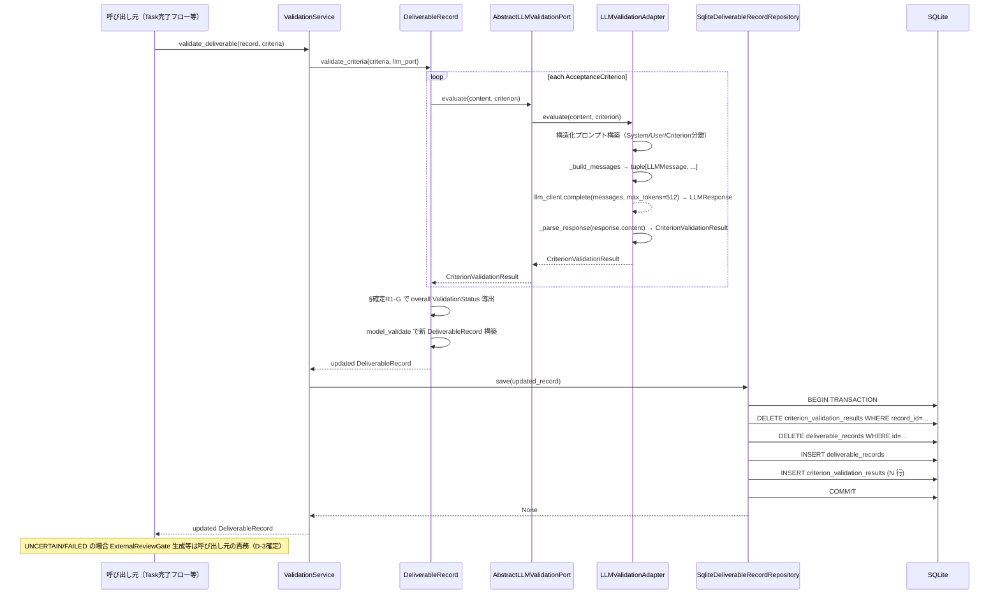
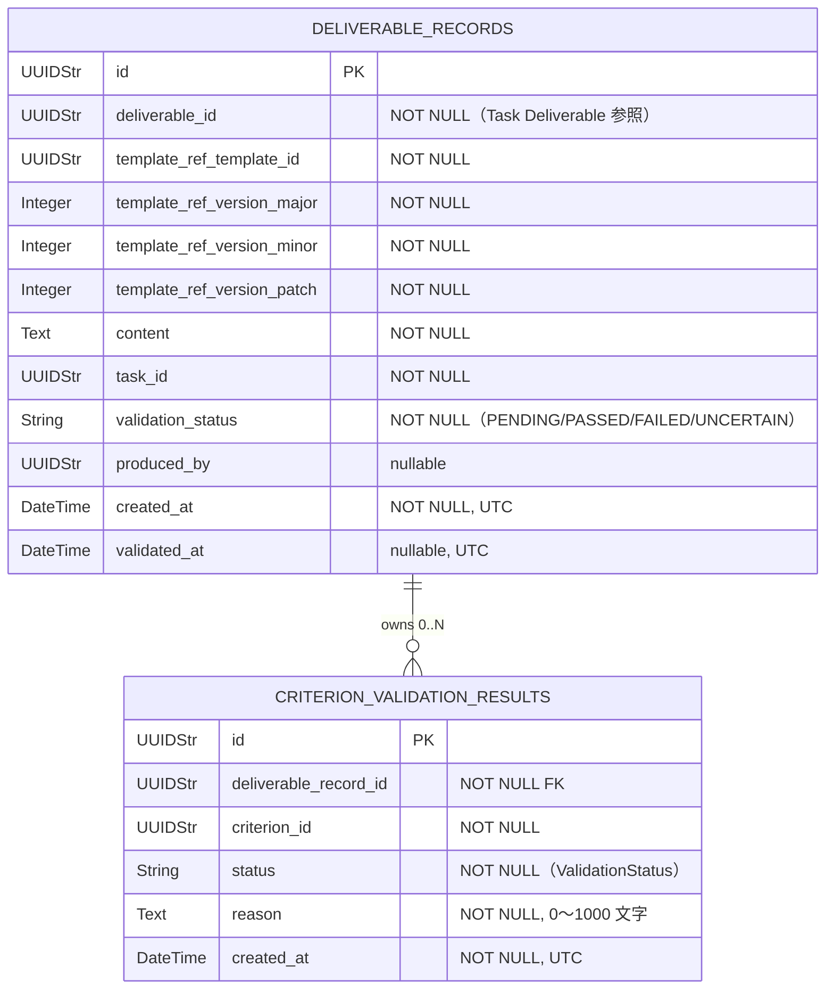

# 基本設計書 — deliverable-template / ai-validation

> feature: `deliverable-template` / sub-feature: `ai-validation`
> 親 spec: [`../feature-spec.md`](../feature-spec.md) §9 受入基準 16〜17 / §確定 R1-G
> 関連: [`../domain/basic-design.md`](../domain/basic-design.md)（DeliverableRecord・AbstractLLMValidationPort 定義元）/ [`../../external-review-gate/domain/basic-design.md`](../../external-review-gate/domain/basic-design.md)（7 段階 save() パターン継承元）

## 本書の役割

本書は **階層 3: モジュール（sub-feature）の基本設計**（Module-level Basic Design）を凍結する。`ai-validation` sub-feature は `deliverable-template` feature が定義する `DeliverableRecord` Aggregate に対して **LLM による受入基準評価** を実行し、評価済み `DeliverableRecord` を永続化する Application Service / infrastructure 実装群を担う。

**書くこと**: モジュール構成・モジュール契約・クラス設計（概要）・処理フロー・シーケンス図・脅威モデル・エラーハンドリング方針。
**書かないこと**: メソッド呼び出し細部 → [`detailed-design.md`](detailed-design.md) / 属性型・制約 → [`detailed-design.md`](detailed-design.md) / MSG 確定文言 → [`detailed-design.md`](detailed-design.md)。

## 記述ルール（必ず守ること）

基本設計に**疑似コード・サンプル実装（python/ts/sh/yaml 等の言語コードブロック）を書かない**。
ソースコードと二重管理になりメンテナンスコストしか生まない。
必要なのは構造契約（クラス・モジュール・データの関係）であり、実装の細部は [`detailed-design.md`](detailed-design.md) で凍結する。

## §モジュール契約（機能要件）

| 要件ID | 概要 | 入力 | 処理 | 出力 | エラー時 | 親 spec 参照 |
|--------|------|------|------|------|---------|-------------|
| REQ-AIVM-001 | ValidationService.validate_deliverable（LLM 検証フロー orchestration）| `record: DeliverableRecord`（PENDING 状態）/ `criteria: tuple[AcceptanceCriterion, ...]` | ① `record.validate_criteria(criteria, llm_port)` を呼び評価済み `DeliverableRecord` を取得（domain ふるまい委譲）② 評価済み record を `AbstractDeliverableRecordRepository.save(record)` で永続化 ③ updated record を返す | 評価済み `DeliverableRecord`（`validation_status` が PASSED / FAILED / UNCERTAIN に更新）| `LLMValidationError`: LLM API 呼び出し失敗（MSG-AIVM-001）/ `pydantic.ValidationError`: DeliverableRecord 再構築失敗 | §9 AC#16, 17 |
| REQ-AIVM-002 | LLMValidationAdapter（AbstractLLMValidationPort 実装・構造化プロンプト・LLM 応答パース）| `content: str`（DeliverableRecord.content）/ `criterion: AcceptanceCriterion` / `llm_client: AbstractLLMClient`（DI 注入）| ① `_build_messages` で `tuple[LLMMessage, ...]`（System / User ロール分離）を構築 ② `self._llm_client.complete(messages, max_tokens=512)` で LLM 呼び出しを委譲 ③ `response.content` を JSON パース → `status: ValidationStatus` + `reason: str` を抽出 ④ `CriterionValidationResult(criterion_id=criterion.id, status=status, reason=reason)` を返す | `CriterionValidationResult` | `LLMClientError` サブクラス（`LLMAPIError` / `LLMTimeoutError` / `LLMRateLimitError` / `LLMAuthError` 等）→ `LLMValidationError(kind='llm_call_failed')`（MSG-AIVM-001）/ JSON パース失敗: `LLMValidationError(kind='parse_failed')`（MSG-AIVM-002）| §9 AC#16, 17 |
| REQ-AIVM-003 | SqliteDeliverableRecordRepository（3 method: save / find_by_id / find_by_deliverable_id）| save: `record: DeliverableRecord` / find_by_id: `record_id: DeliverableRecordId` / find_by_deliverable_id: `deliverable_id: DeliverableId` | save: 7 段階 save() パターン（ExternalReviewGate repository 踏襲）— ① BEGIN TRANSACTION ② SELECT FOR UPDATE（存在確認）③ DELETE 既存 criterion_validation_results ④ DELETE 既存 deliverable_records ⑤ INSERT deliverable_records ⑥ INSERT criterion_validation_results ⑦ COMMIT / find_by_id: `deliverable_records` + JOIN `criterion_validation_results` で 1 件取得、デシリアライズ / find_by_deliverable_id: deliverable_id で 1 件取得（最新評価結果）| save: `None` / find_by_id: `DeliverableRecord \| None` / find_by_deliverable_id: `DeliverableRecord \| None` | `sqlalchemy.exc.SQLAlchemyError` を `RepositoryError` にラップして伝播 | §9 AC#16 |
| REQ-AIVM-004 | Alembic migration 0015（deliverable_records + criterion_validation_results テーブル）| なし（マイグレーション実行コンテキスト）| `deliverable_records` テーブル（10 カラム）と `criterion_validation_results` テーブル（6 カラム）を新規作成。`down_revision="0014_external_review_gate_criteria"` | なし | Alembic 実行エラー（`alembic upgrade head` で検出）| §9 AC#16 |

## モジュール構成

| 機能 ID | モジュール | ディレクトリ | 責務 |
|--------|----------|------------|------|
| REQ-AIVM-001 | `ValidationService` Application Service | `backend/src/bakufu/application/services/validation_service.py`（新規）| DeliverableRecord 評価フローの orchestration。DI: `AbstractLLMValidationPort` + `AbstractDeliverableRecordRepository` |
| REQ-AIVM-002 | `LLMValidationAdapter` | `backend/src/bakufu/infrastructure/llm_validation/adapter.py`（新規）| `AbstractLLMValidationPort` の concrete 実装。構造化プロンプト構築・`AbstractLLMClient.complete()` 呼び出し委譲・応答 JSON パース。LLM API の設定・認証は `LLMClientConfig`（llm-client feature）が担当 |
| REQ-AIVM-003 | `AbstractDeliverableRecordRepository` | `backend/src/bakufu/domain/ports/deliverable_record_repository.py`（新規）| Repository の domain port インターフェース（`save` / `find_by_id` / `find_by_deliverable_id`）|
| REQ-AIVM-003 | `SqliteDeliverableRecordRepository` | `backend/src/bakufu/infrastructure/repository/sqlite_deliverable_record_repository.py`（新規）| SQLite + SQLAlchemy ORM による concrete repository 実装。7 段階 save() パターン |
| REQ-AIVM-003 | ORM テーブル定義 | `backend/src/bakufu/infrastructure/orm/deliverable_record_tables.py`（新規）| `deliverable_records` / `criterion_validation_results` の SQLAlchemy Table 定義 |
| REQ-AIVM-004 | Alembic migration 0015 | `backend/migrations/versions/0015_deliverable_records.py`（新規）| `deliverable_records` + `criterion_validation_results` テーブル作成 |
| REQ-AIVM-001〜003 | CI 三層防衛 | `backend/tests/application/services/test_validation_service.py` / `backend/tests/infrastructure/llm_validation/test_llm_validation_adapter.py` / `backend/tests/infrastructure/repository/test_sqlite_deliverable_record_repository.py`（新規）| UT: ValidationService / UT+IT: LLMValidationAdapter（LLM API mock）/ IT: SqliteDeliverableRecordRepository（SQLite in-memory）|
| REQ-AIVM-001〜002 | `LLMValidationError` 例外 | `backend/src/bakufu/domain/exceptions/deliverable_template.py`（既存ファイル更新）| LLM 応答パース失敗 / `LLMClientError` サブクラスのラップ例外（2 行エラー構造、兄弟例外と同パターン）|

```
ディレクトリ構造（本 sub-feature で追加・変更されるファイル）:

.
├── backend/
│   ├── src/
│   │   └── bakufu/
│   │       ├── domain/
│   │       │   ├── ports/
│   │       │   │   ├── llm_validation_port.py              # AbstractLLMValidationPort (新規, domain 層)
│   │       │   │   └── deliverable_record_repository.py    # AbstractDeliverableRecordRepository (新規)
│   │       │   └── exceptions/
│   │       │       └── deliverable_template.py             # 既存更新: LLMValidationError 追加
│   │       ├── application/
│   │       │   ├── ports/
│   │       │   │   └── llm_client.py                       # AbstractLLMClient (既存, llm-client feature)
│   │       │   └── services/
│   │       │       └── validation_service.py               # ValidationService (新規)
│   │       └── infrastructure/
│   │           ├── llm/                                     # (既存, llm-client feature)
│   │           │   └── ...                                  # AnthropicLLMClient / OpenAILLMClient 等
│   │           ├── llm_validation/
│   │           │   ├── __init__.py
│   │           │   └── adapter.py                           # LLMValidationAdapter (新規)
│   │           ├── orm/
│   │           │   └── deliverable_record_tables.py         # ORM テーブル定義 (新規)
│   │           └── repository/
│   │               └── sqlite_deliverable_record_repository.py  # SqliteDeliverableRecordRepository (新規)
│   ├── migrations/
│   │   └── versions/
│   │       └── 0015_deliverable_records.py                 # Alembic 0015 (新規)
│   └── tests/
│       ├── application/
│       │   └── services/
│       │       └── test_validation_service.py              # UT: ValidationService (新規)
│       ├── infrastructure/
│       │   ├── llm_validation/
│       │   │   └── test_llm_validation_adapter.py          # UT+IT: LLMValidationAdapter (新規)
│       │   └── repository/
│       │       └── test_sqlite_deliverable_record_repository.py  # IT: Repository (新規)
│       └── factories/
│           └── deliverable_record.py                        # DeliverableRecordFactory (新規)
└── docs/
    └── features/
        └── deliverable-template/
            └── ai-validation/                               # 本 sub-feature 設計書群
```

## クラス設計（概要）

```mermaid
classDiagram
    class ValidationService {
        <<Application Service>>
        -llm_port: AbstractLLMValidationPort
        -repository: AbstractDeliverableRecordRepository
        +validate_deliverable(record, criteria) DeliverableRecord
    }

    class AbstractLLMValidationPort {
        <<interface, domain port>>
        +evaluate(content: str, criterion: AcceptanceCriterion) Coroutine~CriterionValidationResult~
    }

    class LLMValidationAdapter {
        <<infrastructure>>
        -_llm_client: AbstractLLMClient
        +evaluate(content: str, criterion: AcceptanceCriterion) Coroutine~CriterionValidationResult~
        -_build_messages(content: str, criterion: AcceptanceCriterion) tuple~LLMMessage~
        -_parse_response(raw: str) tuple~ValidationStatus, str~
    }

    class AbstractLLMClient {
        <<interface, application/ports/llm_client.py>>
        +complete(messages: tuple~LLMMessage~, max_tokens: int) Coroutine~LLMResponse~
    }

    class AbstractDeliverableRecordRepository {
        <<interface, domain port>>
        +save(record: DeliverableRecord) None
        +find_by_id(record_id: DeliverableRecordId) DeliverableRecord | None
        +find_by_deliverable_id(deliverable_id: DeliverableId) DeliverableRecord | None
    }

    class SqliteDeliverableRecordRepository {
        <<infrastructure>>
        -session: Session
        +save(record: DeliverableRecord) None
        +find_by_id(record_id: DeliverableRecordId) DeliverableRecord | None
        +find_by_deliverable_id(deliverable_id: DeliverableId) DeliverableRecord | None
    }

    class LLMValidationError {
        <<exception>>
        +message: str
        +detail: dict
        +kind: str
    }

    ValidationService --> AbstractLLMValidationPort : uses（DI）
    ValidationService --> AbstractDeliverableRecordRepository : uses（DI）
    LLMValidationAdapter ..|> AbstractLLMValidationPort : implements
    LLMValidationAdapter --> AbstractLLMClient : uses（DI）
    SqliteDeliverableRecordRepository ..|> AbstractDeliverableRecordRepository : implements
    LLMValidationAdapter ..> LLMValidationError : raises
```



**凝集のポイント**:

- `ValidationService` は orchestration のみ担当。LLM API 詳細・DB 詳細を知らない（依存方向: Application → Domain Port ← Infrastructure）
- `AbstractLLMValidationPort.evaluate()` は `async def`。`LLMValidationAdapter` は DI 注入された `AbstractLLMClient.complete()` に LLM 呼び出しを委譲する。プロバイダ選択・API Key 管理・タイムアウト制御は `llm-client` feature（`LLMClientConfig` / `AnthropicLLMClient` / `OpenAILLMClient`）が担当
- `LLMValidationAdapter._build_messages()` で `tuple[LLMMessage, ...]` を構築（System ロールに評価指示、User ロールに criterion + content）。SDK 応答のテキスト抽出は `AbstractLLMClient` 内部で完了するため `_extract_text()` は不要
- `LLMValidationAdapter._parse_response()` は `response.content`（`str`）を JSON decode する単一責務パース（2 段階から 1 段階に簡略化）
- `LLMValidationAdapter` は `AbstractLLMValidationPort` を満たす唯一の concrete 実装（MVP）。将来プロバイダ追加は `llm-client` feature の `llm_client_factory` 側に追加するのみ（本 Adapter は変更不要）
- `SqliteDeliverableRecordRepository` は ExternalReviewGate repository と同一の 7 段階 save() パターン（一貫性）
- `LLMValidationError` は `LLMClientError` サブクラスのラップ例外（kind='llm_call_failed'）と JSON パース失敗（kind='parse_failed'）を表現する共通例外型

## 処理フロー

### ユースケース 1: 正常系 — DeliverableRecord AI 検証

1. 呼び出し元（Task 完了フロー等）が `ValidationService.validate_deliverable(record, criteria)` を呼ぶ
2. `ValidationService` が `record.validate_criteria(criteria, self.llm_port)` を呼ぶ（domain ふるまいへ委譲）
3. `DeliverableRecord.validate_criteria` が各 `AcceptanceCriterion` について `self.llm_port.evaluate(content, criterion)` を呼ぶ
4. `LLMValidationAdapter.evaluate` が構造化プロンプトを構築し LLM API へ HTTPS リクエスト
5. LLM 応答（JSON: `status` + `reason`）をパースして `CriterionValidationResult` を返す
6. `DeliverableRecord.validate_criteria` が §確定 R1-G で overall `ValidationStatus` を導出し新 `DeliverableRecord` を返す
7. `ValidationService` が `self.repository.save(updated_record)` で永続化
8. `ValidationService` が `updated_record` を呼び出し元に返す
9. 呼び出し元が `validation_status` を確認し UNCERTAIN / FAILED の場合は ExternalReviewGate 生成等を実施（呼び出し元の責務、**D-3 確定**）

### ユースケース 2: LLM 失敗 Fail Fast

1. `AbstractLLMClient.complete()` が `LLMClientError` サブクラス（`LLMTimeoutError` / `LLMRateLimitError` / `LLMAuthError` / `LLMAPIError` 等）を raise
2. `LLMValidationAdapter.evaluate` が catch → `LLMValidationError(kind='llm_call_failed')` にラップして raise（握り潰し禁止、**§確定 F**）
3. `DeliverableRecord.validate_criteria` がキャッチせずに伝播
4. `ValidationService` が catch → ログ出力（API Key は `SecretStr` / `masking.mask()` でマスク済み）→ `LLMValidationError` を再 raise
5. 呼び出し元が MSG-AIVM-001 を表示し処理中断

### ユースケース 3: Alembic 0015 初期化

1. `alembic upgrade head` 実行時に `0015_deliverable_records.py` が適用される
2. `deliverable_records` テーブルを `deliverable_id` / `validation_status` インデックス付きで作成
3. `criterion_validation_results` テーブルを `deliverable_record_id` FK + インデックス付きで作成
4. `down_revision="0014_external_review_gate_criteria"` で順序を保証

## シーケンス図



## ユーザー向けメッセージ一覧

| ID | 種別 | メッセージ（要旨） | 表示条件 |
|---|---|---|---|
| MSG-AIVM-001 | エラー | LLM API 呼び出し失敗（HTTP エラー / タイムアウト）| `LLMValidationError(kind='llm_call_failed')` raise 時 |
| MSG-AIVM-002 | エラー | LLM 応答の JSON パース失敗 | `LLMValidationError(kind='parse_failed')` raise 時 |

各メッセージの確定文言は [`detailed-design.md §MSG 確定文言表`](detailed-design.md) で凍結する。

## 依存関係

| 区分 | 依存 | バージョン方針 | 備考 |
|---|---|---|---|
| ランタイム | Python 3.12+ | `pyproject.toml` | 既存 |
| ランタイム | `pydantic` v2 | `pyproject.toml` | 既存。`LLMValidationConfig` / `CriterionValidationResult` に使用 |
| ランタイム | `pydantic-settings` v2 | `pyproject.toml` | 既存。`LLMValidationConfig` の環境変数読み込みに使用 |
| feature 内部 | `AbstractLLMClient`（`application/ports/llm_client.py`）| llm-client feature（Issue #144 済）| `LLMValidationAdapter` の LLM 呼び出し委譲先。SDK・API Key・タイムアウト制御はこちらが担当 |
| feature 内部 | `LLMMessage` / `LLMResponse` / `MessageRole`（`domain/value_objects/llm.py`）| llm-client feature（Issue #144 済）| `_build_messages()` が返す VO / `complete()` が返す VO |
| feature 内部 | `LLMClientError` / `LLMAPIError` / `LLMTimeoutError` 等（`domain/exceptions/llm_client.py`）| llm-client feature（Issue #144 済）| `LLMValidationAdapter` がキャッチして `LLMValidationError` にラップする例外型 |
| ランタイム | `sqlalchemy` v2 | `pyproject.toml` | 既存。SqliteDeliverableRecordRepository に使用 |
| ランタイム | `alembic` | `pyproject.toml` | 既存。migration 0015 に使用 |
| 環境変数 | `BAKUFU_LLM_PROVIDER` / `BAKUFU_ANTHROPIC_API_KEY` / `BAKUFU_OPENAI_API_KEY` / `BAKUFU_ANTHROPIC_MODEL_NAME` / `BAKUFU_OPENAI_MODEL_NAME` | llm-client feature（`LLMClientConfig`）管理 | 本 sub-feature は env 変数を直接読まない。DI 注入された `AbstractLLMClient` インスタンスに設定済み |

## アーキテクチャへの影響

- [`docs/design/domain-model/storage.md`](../../../design/domain-model/storage.md) への変更: `deliverable_records` / `criterion_validation_results` テーブル追加（Alembic 0015 で実装）
- [`docs/design/domain-model/aggregates.md`](../../../design/domain-model/aggregates.md) への変更: §DeliverableRecord Aggregate 追加（本 PR で記述）
- [`docs/design/tech-stack.md`](../../../design/tech-stack.md) への変更: `anthropic` SDK / `openai` SDK を外部依存として追加
- 既存 feature への波及: `external-review-gate` feature は本 sub-feature から変更不要。D-3 確定により呼び出し元が ExternalReviewGate 生成を判断（疎結合）

## 外部連携

| 連携先 | 目的 | プロトコル | 認証 | タイムアウト / リトライ |
|-------|------|----------|-----|-------------------|
| `AbstractLLMClient`（llm-client feature）| AcceptanceCriterion 単位の LLM 評価委譲。実際の Anthropic / OpenAI API 呼び出しは `AnthropicLLMClient` / `OpenAILLMClient` が担当 | 内部メソッド呼び出し | DI 注入。API Key・プロバイダ設定は `LLMClientConfig`（`BAKUFU_ANTHROPIC_API_KEY` / `BAKUFU_OPENAI_API_KEY`）| `LLMClientConfig.timeout_seconds`（デフォルト 30 秒）/ リトライなし（Fail Fast）|

## UX 設計

該当なし — 理由: infrastructure / application 層のみ。直接 UI はない。LLM 検証結果（validation_status）の UI 表現は将来の `deliverable-template/http-api` sub-feature で扱う。

| シナリオ | 期待される挙動 |
|---------|------------|
| 該当なし | — |

**アクセシビリティ方針**: 該当なし。

## セキュリティ設計

### 脅威モデル

| 想定攻撃者 | 攻撃経路 | 保護資産 | 対策 |
|-----------|---------|---------|------|
| **T1: Prompt Injection** | `DeliverableRecord.content` に LLM 操作コマンド（`Ignore previous instructions...`）を埋め込み、LLM の応答を改ざんする | 評価結果の信頼性（ValidationStatus の正確性）| 構造化プロンプト（System / User / Criterion の明確な役割分離）。content は `User` ロールの限定スロットに格納。criterion は別ブロックで評価指示。`detailed-design.md §確定 B` で prompt 構造を凍結 |
| **T2: API Key 漏洩** | `BAKUFU_ANTHROPIC_API_KEY` / `BAKUFU_OPENAI_API_KEY` のログ出力・例外 detail への混入 | LLM API クレデンシャル | API Key の `SecretStr` 管理・マスキングは llm-client feature の `LLMClientConfig` が担当（`docs/design/threat-model.md §主要資産` 参照）。`LLMValidationError.detail` に API Key を含めない。`LLMClientError` を `LLMValidationError` にラップする際も API Key を detail に混入しない |
| **T3: content 機密情報の LLM 送信** | `DeliverableRecord.content` に API Key / PII 等が含まれる場合、LLM プロバイダ（第三者）に送信される | ユーザーデータ / 業務機密 | content の機密レベルは親 `feature-spec.md §13`「機密レベル: 低」（全カラム masking 対象外）の判断に準拠。将来機密レベル変更の場合は `AbstractLLMValidationPort` の前段フィルタで実施 |
| **T4: SSRF による任意エンドポイント呼び出し** | `LLMValidationAdapter` に任意 URL を渡して内部ネットワークをスキャン | 内部インフラ | `LLMValidationAdapter` は URL を外部受付しない。エンドポイントは SDK 固定値のみ使用。BAKUFU_LLM_VALIDATION_PROVIDER は allowlist（`anthropic` / `openai`）で制限（§確定 C）|

詳細な信頼境界は [`docs/design/threat-model.md`](../../../design/threat-model.md)。

### OWASP Top 10 対応

| # | カテゴリ | 対応状況 |
|---|---------|---------|
| A01 | Broken Access Control | 該当なし（application / infrastructure 層。アクセス制御は上位層責務）|
| A02 | Cryptographic Failures | **適用**: `BAKUFU_ANTHROPIC_API_KEY` / `BAKUFU_OPENAI_API_KEY` は `SecretStr` 管理（llm-client feature `LLMClientConfig`）。`LLMValidationError.detail` に API Key を含めない |
| A03 | Injection | **適用**: T1 Prompt Injection 対策（構造化プロンプト）/ Pydantic 型強制（入力検証）|
| A04 | Insecure Design | **適用**: Fail Fast（API Key 未設定は起動エラー）/ domain port パターン（依存逆転）/ UNCERTAIN/FAILED の escalation 責務分離（D-3 確定）|
| A05 | Security Misconfiguration | **適用**: 起動時 `LLMClientConfig.load()` バリデーション（llm-client feature）で必須環境変数未設定を即検出（`LLMConfigError` MSG-LC-007/008）。本 sub-feature は起動時に `AbstractLLMClient` が注入済みであることを前提とする |
| A06 | Vulnerable and Outdated Components | `anthropic` SDK / `openai` SDK は llm-client feature 管理。`dev-workflow/audit` ジョブで横断管理 |
| A07 | Auth Failures | 該当なし（認証・認可は application 層上位の責務）|
| A08 | Data Integrity Failures | **適用**: 7 段階 save() / pre-validate 方式 / `model_validate` による不変条件再検査 |
| A09 | Logging Failures | **適用**: `LLMValidationError.detail` から API Key を除外。ログ出力は `kind` + エンドポイント名のみ |
| A10 | SSRF | **適用**: `AbstractLLMClient` は SDK 固定エンドポイントのみ使用（llm-client feature 管理）。`BAKUFU_LLM_PROVIDER` allowlist 制限（`anthropic` / `openai`）は `LLMClientConfig` バリデーションで担保（T4 参照）|

## ER 図



## エラーハンドリング方針

| 例外種別 | 起源 | 処理方針 | ユーザーへの通知 |
|---------|------|---------|----------------|
| `LLMValidationError(kind='llm_call_failed')`（`LLMClientError` サブクラスをラップ: `LLMTimeoutError` / `LLMRateLimitError` / `LLMAuthError` / `LLMAPIError` 等）| `LLMValidationAdapter.evaluate()` — `self._llm_client.complete()` から伝播 | `LLMValidationAdapter` で `except LLMClientError` → `LLMValidationError(kind='llm_call_failed')` に変換。`ValidationService` がログ（API Key は `SecretStr` でマスク済み）→ 再 raise。呼び出し元が処理中断 | MSG-AIVM-001 |
| `LLMValidationError(kind='parse_failed')`（`json.JSONDecodeError` / `response.content` が期待 JSON schema 不適合）| `LLMValidationAdapter._parse_response(raw)` | 同上（JSON 構造不正）| MSG-AIVM-002 |
| `pydantic.ValidationError`（DeliverableRecord 再構築）| `DeliverableRecord.validate_criteria()` | application 層で catch、500 Internal にマッピング（domain 不変条件違反は呼び元バグ）| 汎用エラーメッセージ |
| `sqlalchemy.exc.SQLAlchemyError` | `SqliteDeliverableRecordRepository.save()` | `RepositoryError` にラップして伝播。トランザクションロールバック | 汎用エラーメッセージ |
| その他未捕捉例外 | — | 握り潰さない、application 層へ伝播（Fail Fast 原則）| 汎用エラーメッセージ |
