# 詳細設計書 — deliverable-template / ai-validation

> feature: `deliverable-template` / sub-feature: `ai-validation`
> 親 spec: [`../feature-spec.md`](../feature-spec.md) §9 受入基準 16〜17 / §確定 R1-G
> 関連: [`basic-design.md`](basic-design.md) / [`../domain/detailed-design.md`](../domain/detailed-design.md)（§確定 F: LLM Validation Port Pattern / §確定 A09: ログ制約）/ [`../../external-review-gate/domain/detailed-design.md`](../../external-review-gate/domain/detailed-design.md)（7 段階 save() 実装パターン継承元）

## 本書の役割

本書は **階層 3: モジュール（sub-feature）の詳細設計**（Module-level Detailed Design）を凍結する。[`basic-design.md`](basic-design.md) で凍結されたモジュール基本設計を、実装直前の **構造契約・確定文言・キー構造** として詳細化する。実装 PR は本書を改変せず参照する。設計変更が必要なら本書を先に更新する PR を立てる。

**書くこと**: 各クラスの属性・型・制約 / §確定事項（業務ルールの実装方針展開）/ MSG 確定文言 / DBスキーマ詳細。
**書かないこと**: ソースコードそのもの（実装 PR で書く）/ 業務ルールの議論（`feature-spec.md §確定 R1-G` 凍結済み）。

## 記述ルール（必ず守ること）

詳細設計に**疑似コード・サンプル実装（python/ts/sh/yaml 等の言語コードブロック）を書かない**。
ソースコードと二重管理になりメンテナンスコストしか生まない。
必要なのは「構造契約（属性名・型・制約）」と「確定文言（メッセージ文字列）」と「実装の意図（なぜこの API 形になるか）」であり、コードそのものは実装 PR で書く。

## クラス設計（詳細）

```mermaid
classDiagram
    class ValidationService {
        <<Application Service>>
        -_llm_port: AbstractLLMValidationPort
        -_repository: AbstractDeliverableRecordRepository
        +validate_deliverable(record: DeliverableRecord, criteria: tuple~AcceptanceCriterion~) DeliverableRecord
    }

    class LLMValidationAdapter {
        <<infrastructure>>
        -_llm_client: AbstractLLMClient
        +evaluate(content: str, criterion: AcceptanceCriterion) Coroutine~CriterionValidationResult~
        -_build_messages(content: str, criterion: AcceptanceCriterion) tuple~LLMMessage~
        -_parse_response(raw: str) tuple~ValidationStatus, str~
    }

    class AbstractLLMClient {
        <<Protocol, application/ports/llm_client.py>>
        +complete(messages: tuple~LLMMessage~, max_tokens: int) Coroutine~LLMResponse~
    }

    class AbstractDeliverableRecordRepository {
        <<interface>>
        +save(record: DeliverableRecord) None
        +find_by_id(record_id: DeliverableRecordId) DeliverableRecord | None
        +find_by_deliverable_id(deliverable_id: DeliverableId) DeliverableRecord | None
    }

    class SqliteDeliverableRecordRepository {
        <<infrastructure>>
        -_session: Session
        +save(record: DeliverableRecord) None
        +find_by_id(record_id: DeliverableRecordId) DeliverableRecord | None
        +find_by_deliverable_id(deliverable_id: DeliverableId) DeliverableRecord | None
        -_to_orm(record: DeliverableRecord) tuple~Row, list~Row~~
        -_from_orm(row: Row, result_rows: list~Row~) DeliverableRecord
    }

    class LLMValidationError {
        <<exception>>
        +message: str
        +detail: dict
        +kind: Literal~"llm_call_failed", "parse_failed"~
    }

    ValidationService --> AbstractLLMValidationPort : DI
    ValidationService --> AbstractDeliverableRecordRepository : DI
    LLMValidationAdapter ..|> AbstractLLMValidationPort
    LLMValidationAdapter --> AbstractLLMClient : DI
    LLMValidationAdapter ..> LLMValidationError : raises
    SqliteDeliverableRecordRepository ..|> AbstractDeliverableRecordRepository
```

### Application Service: ValidationService

| 属性 | 型 | 制約 | 意図 |
|----|----|----|----|
| `_llm_port` | `AbstractLLMValidationPort` | DI で注入、None 不可 | Port 差し替えを可能にする（DIP）|
| `_repository` | `AbstractDeliverableRecordRepository` | DI で注入、None 不可 | DB 差し替えを可能にする（DIP）|

**ふるまい**:
- `validate_deliverable(record, criteria) -> DeliverableRecord`: `record.validate_criteria(criteria, self._llm_port)` → `self._repository.save(updated_record)` → `updated_record` 返却。UNCERTAIN/FAILED 時の ExternalReviewGate 生成は行わない（**D-3 確定**: 責務分離）

### Infrastructure: LLMValidationAdapter

| 属性 | 型 | 制約 | 意図 |
|----|----|----|----|
| `_llm_client` | `AbstractLLMClient` | DI で注入、None 不可 | LLM 呼び出しを委譲する Port。プロバイダ・API Key・タイムアウト設定は `llm_client_factory` が生成時に組み込み済み |

| メソッド | 説明 |
|---------|------|
| `evaluate(content, criterion)` | `async def`。`_build_messages(content, criterion)` → `self._llm_client.complete(messages, max_tokens=512)` → `_parse_response(response.content)` → `CriterionValidationResult` 返却。`LLMClientError` サブクラスを `LLMValidationError(kind='llm_call_failed')` にラップして raise |
| `_build_messages(content, criterion)` | §確定 B の構造化プロンプトを構築。`tuple[LLMMessage, ...]` を返す。`LLMMessage(role=MessageRole.SYSTEM, content=<評価指示>)` と `LLMMessage(role=MessageRole.USER, content=<criterion block>\n<content block>)` の 2 要素タプル |
| `_parse_response(raw)` | `raw` が期待 JSON schema 不適合（`json.JSONDecodeError` / `status` / `reason` キー不在）の場合は即 `LLMValidationError(kind='parse_failed')` raise。正常時は `(ValidationStatus, str)` タプルを返す |

**不変条件**:
- `evaluate()` は `async def`。タイムアウト制御は `AbstractLLMClient` 内部の `asyncio.wait_for()` が担当（`LLMClientConfig.timeout_seconds` 設定）
- `LLMClientError` サブクラスは全て `LLMValidationError(kind='llm_call_failed')` にラップして raise（握り潰し禁止、§確定 F: Fail Secure）
- `_llm_client` はコンストラクタ DI のみ。Adapter 内部で `llm_client_factory` を呼び出さない（依存逆転原則）

### Infrastructure: SqliteDeliverableRecordRepository

| メソッド | 説明 |
|---------|------|
| `save(record)` | 7 段階 save() パターン（BEGIN → SELECT FOR UPDATE → DELETE results → DELETE record → INSERT record → INSERT results → COMMIT）|
| `find_by_id(record_id)` | `deliverable_records` + `criterion_validation_results` を JOIN して1件取得。`_from_orm` でデシリアライズ |
| `find_by_deliverable_id(deliverable_id)` | `deliverable_id` で最新1件取得。`created_at DESC LIMIT 1` |
| `_to_orm(record)` | `DeliverableRecord` → `(deliverable_records 行, [criterion_validation_results 行])` のタプルに変換 |
| `_from_orm(row, result_rows)` | ORM 行 → `DeliverableRecord` に変換（`model_validate` 経由で不変条件再検査）|

**不変条件**:
- `save()` は冪等。既存 `id` の record が存在する場合は DELETE → INSERT で完全上書き（7 段階 save() パターン）
- トランザクション外でのデータ変更は禁止（ACID 保証）

## 確定事項（先送り撤廃）

### 確定 A: ValidationStatus 導出アルゴリズム（§確定 R1-G 実装展開）

親 `feature-spec.md §確定 R1-G` を実装方針として展開する。

`DeliverableRecord.validate_criteria` の ValidationStatus 導出手順:

1. 全 `criteria` について `llm_port.evaluate(content, criterion)` を呼び `criterion_results: tuple[CriterionValidationResult, ...]` を収集
2. `required=True` の criterion のみを抽出してフィルタ
3. 導出規則（§確定 R1-G）:
   - `required=True` の criterion に `status=FAILED` が 1 件以上存在する → overall `FAILED`
   - `required=True` の criterion に `status=UNCERTAIN` が 1 件以上かつ `FAILED` が 0 件 → overall `UNCERTAIN`
   - `required=True` の criterion が全件 `status=PASSED` → overall `PASSED`
   - `criteria` が空（0 件）の場合: overall `PASSED`（評価基準なし = 合格）
4. `CriterionValidationResult` にない `required=False` の criterion は overall status 計算に影響しない（参考情報として `criterion_results` には含む）

**実装上の注意**: 導出は純粋関数として `validate_criteria` 内に閉じて実装する。外部状態を参照しない。

### 確定 B: LLM 構造化プロンプト構造（Prompt Injection T1 対策）

LLM API へのリクエストは以下の役割分離構造で構築する（`LLMValidationAdapter._build_messages()` が担当）。`ai-team` `AnthropicClient` の実証済みパターンに倣い、`system` と `messages` を **分離パラメータ** で渡す:

| パラメータ | 内容 | Injection 対策 |
|-----------|------|---------------|
| `system: str` | 評価者としての役割指示 + 出力フォーマット指定（JSON: `{"status": "PASSED\|FAILED\|UNCERTAIN", "reason": "<str>"}` のみ出力するよう指示）| ユーザー入力を含まない固定テキスト。実行時に変更不可 |
| `messages: list[dict]` | `[{"role": "user", "content": "<criterion block>\n<content block>"}]` の 1 要素リスト | criterion と content を同一 user メッセージ内で区別（delimiter 分離）|

`messages[0]["content"]` の構造:

| ブロック | 位置 | 内容 | Injection 対策 |
|---------|------|------|---------------|
| Criterion block | 先頭 | `criterion.description`（評価基準の説明）+ `required: true/false` | content より前に配置。criterion は固定テキストに近い（テンプレート定義）|
| Content block | 後続 | `--- BEGIN CONTENT ---` / `{content}` / `--- END CONTENT ---` の delimiter で囲む | delimiter によるスコープ限定。content 内の命令テキストは delimiter 外に影響しない |

**凍結事項**:
- System prompt のテキストは実装 PR で確定（設計書では構造のみ凍結）
- Content delimiter は `--- BEGIN CONTENT ---` / `--- END CONTENT ---` 固定。変更は本書の更新 PR が必要
- `messages` は **1 要素のみ**（role=`user`）。anthropic / openai 両 SDK 互換のフォーマット
- LLM 応答の期待 JSON schema: `{"status": "PASSED" | "FAILED" | "UNCERTAIN", "reason": "<str, 0〜1000文字>"}`

### 確定 C: LLM プロバイダ設定と DI 注入方針

本 sub-feature は LLM プロバイダ設定を **直接管理しない**。設定は llm-client feature（Issue #144）の `LLMClientConfig` が担当する。

| 項目 | 担当 | 詳細 |
|-----|------|------|
| プロバイダ選択 | `LLMClientConfig`（`BAKUFU_LLM_PROVIDER`）| `anthropic` / `openai` の allowlist 制御 |
| API Key | `LLMClientConfig`（`BAKUFU_ANTHROPIC_API_KEY` / `BAKUFU_OPENAI_API_KEY`）| `SecretStr` 管理・ログマスク |
| モデル名 | `LLMClientConfig`（`BAKUFU_ANTHROPIC_MODEL_NAME` / `BAKUFU_OPENAI_MODEL_NAME`）| デフォルト値あり |
| タイムアウト | `LLMClientConfig`（`BAKUFU_LLM_TIMEOUT_SECONDS`、デフォルト 30 秒）| `asyncio.wait_for()` で制御 |
| クライアント生成 | `llm_client_factory(config)` | `AnthropicLLMClient` / `OpenAILLMClient` を返す |

**DI 注入フロー**: アプリ起動時に `LLMClientConfig.load()` → `llm_client_factory(config)` → `AbstractLLMClient` → `LLMValidationAdapter(__init__)` に注入 → `ValidationService(__init__)` に注入。

**Fail Secure 規約**（`domain/detailed-design.md §確定 F` 引用）:
- `AbstractLLMValidationPort` が DI で None の場合は `LLMValidationError` を即 raise。評価をバイパスして PASSED を返すことを禁止する

**将来プロバイダ追加時の変更箇所**: llm-client feature 側（`LLMClientConfig` Literal 拡張 + `llm_client_factory` 分岐追加）のみ。本 `LLMValidationAdapter` は変更不要（単一変更点、OCP 遵守）

### 確定 E: AbstractLLMClient 統合パターン

`LLMValidationAdapter.evaluate()` は SDK を直接使わず `AbstractLLMClient.complete()` に委譲する（Issue #144 llm-client feature で実現済み）:

| 項目 | 旧設計（DRY 違反）| 新設計（AbstractLLMClient DI）|
|-----|----------------|-----------------------------|
| 非同期クライアント | `LLMValidationAdapter` が `anthropic.AsyncAnthropic` / `openai.AsyncOpenAI` を直接保持 | `AbstractLLMClient` を DI 注入。SDK インスタンスは Adapter が保持しない |
| タイムアウト制御 | `asyncio.wait_for(sdk_call, timeout=_config.timeout_seconds)` を Adapter 内実装 | `AbstractLLMClient` 内部の `asyncio.wait_for()` が担当（`LLMClientConfig.timeout_seconds`）|
| エラー変換 | `asyncio.TimeoutError` / `anthropic.APIError` / `openai.APIError` を catch して変換 | `LLMClientError` サブクラス（`LLMTimeoutError` / `LLMAPIError` 等）を `except LLMClientError` で一括 catch → `LLMValidationError(kind='llm_call_failed')` に変換 |
| text 抽出 | `_extract_text(response)` — SDK 応答オブジェクトをパース | 不要。`AbstractLLMClient.complete()` は `LLMResponse(content=str)` を返す（`min_length=1` 保証済み）|
| max_tokens | Adapter 内定数 `MAX_TOKENS = 512` | `self._llm_client.complete(messages, max_tokens=512)` の引数として明示 |
| プロバイダ分岐 | `if _config.provider == "anthropic": ... elif _config.provider == "openai": ...` | 不要。`AbstractLLMClient` が抽象化済み |

**設計根拠**:
- `max_tokens=512` の根拠: `{"status": "FAILED", "reason": "<1000文字以内>"}` の JSON 出力に十分。不必要に大きいトークン数はコスト増加を招く
- `LLMClientError` の一括 catch: `LLMTimeoutError` / `LLMRateLimitError` / `LLMAuthError` / `LLMAPIError` は全て検証失敗として同等に扱う（`kind='llm_call_failed'`）。呼び出し元が再試行判断を持つ場合は `detail` の `llm_error_type` フィールドで区別可能にする

### 確定 D: 7 段階 save() パターン詳細

`SqliteDeliverableRecordRepository.save()` の実装は ExternalReviewGate repository の 7 段階 save() パターンを踏襲する:

| ステップ | 操作 | 目的 |
|---------|------|------|
| 1 | `BEGIN TRANSACTION` | ACID 保証 |
| 2 | `SELECT ... FOR UPDATE WHERE id=record.id` | 存在確認 + 排他ロック |
| 3 | `DELETE FROM criterion_validation_results WHERE deliverable_record_id=record.id` | 旧評価結果削除 |
| 4 | `DELETE FROM deliverable_records WHERE id=record.id` | 旧レコード削除（FK 制約のため child 先に削除）|
| 5 | `INSERT INTO deliverable_records VALUES (...)` | 新レコード挿入 |
| 6 | `INSERT INTO criterion_validation_results VALUES (...) * N` | 新評価結果挿入（N 件）|
| 7 | `COMMIT` | 確定 |

ロールバック: ステップ 2〜6 のいずれかで例外発生時は `ROLLBACK` → `RepositoryError` にラップして raise。中途半端な状態を DB に残さない（Fail Fast 原則）。

## 設計判断の補足

### なぜ D-1: DeliverableRecord = 独立 Aggregate Root か

DDD の「定義とインスタンスの分離」原則に基づく。`DeliverableTemplate` / `AcceptanceCriterion` は **定義エンティティ**（不変の業務ルールを記述）。`DeliverableRecord` は **運用エンティティ**（評価実行のライフサイクルを持つ）。両者を同一 Aggregate に置くと定義の変更が評価結果の整合性に影響し、トランザクション境界が曖昧になる。独立 Aggregate にすることで各々の独立したライフサイクル・整合性境界を保証できる。

### なぜ D-3: ValidationService は ExternalReviewGate を生成しないか

Single Responsibility Principle（SRP）に基づく。`ValidationService` の責務は「DeliverableRecord を評価し評価済み record を返す」こと。「UNCERTAIN/FAILED 時にどう対処するか」はビジネスフロー（Task 完了フロー / Workflow 等）の責務であり、ValidationService が知るべきでない。Gate 生成を ValidationService に混入すると、将来の「UNCERTAIN 時は人間レビュー不要」等の要件変更で ValidationService を書き直す羽目になる。呼び出し元が policy を持つことで変更を局所化できる。

### なぜ D-2: 新 AbstractLLMValidationPort か（ProviderKind 不使用）

`ProviderKind`（CLAUDE_CODE / CODEX / GEMINI 等）はコーディングエージェントの実行バックエンド識別子であり、LLM API provider（Anthropic / OpenAI）とは異なる概念。同一の型に両方の意味を混入すると将来「Claude で書いて GPT-4 で検証」等の構成で型が機能しなくなる。新規 `AbstractLLMValidationPort` を domain port として定義することで、検証用 LLM プロバイダの独立した設定・差し替えが可能になる（参考: `domain/detailed-design.md §確定 F`）。

## ユーザー向けメッセージの確定文言

[`basic-design.md §ユーザー向けメッセージ一覧`](basic-design.md) で ID のみ定義した MSG を、本書で **正確な文言** として凍結する。実装者が勝手に改変できない契約。変更は本書の更新 PR のみで許可。

### プレフィックス統一

| プレフィックス | 意味 |
|---|---|
| `[FAIL]` | 処理中止を伴う失敗 |
| `[OK]` | 成功完了 |
| `[SKIP]` | 冪等実行による省略 |
| `[WARN]` | 警告（処理は継続）|
| `[INFO]` | 情報提供（処理は継続）|

### MSG 確定文言表

| ID | 出力先 | 文言（必要なら 2 行構造）|
|---|---|---|
| MSG-AIVM-001 | `stderr` | `[FAIL] LLM validation API call failed: provider={provider}, model={model}, error={error_type}.` / `Next: Check BAKUFU_LLM_PROVIDER / BAKUFU_ANTHROPIC_API_KEY (or BAKUFU_OPENAI_API_KEY) environment variables and LLM API availability.` |
| MSG-AIVM-002 | `stderr` | `[FAIL] LLM validation response could not be parsed: expected JSON with 'status' and 'reason' fields.` / `Next: Check LLM model compatibility or update prompt structure in LLMValidationAdapter._build_messages.` |

**注意**:
- `{provider}` には `LLMClientConfig.provider`（`anthropic` / `openai`）を展開。`LLMClientError.detail` 等から取得
- `{model}` には `LLMClientConfig.anthropic_model_name` / `openai_model_name` を展開
- `{error_type}` には `LLMClientError` サブクラス名（`LLMTimeoutError` / `LLMRateLimitError` / `LLMAuthError` / `LLMAPIError` 等）を展開。スタックトレース・API Key は含めない（§確定 A09 ログ制約）
- API Key は `LLMClientConfig` の `SecretStr` 型で管理。`LLMValidationAdapter` は API Key にアクセスしない。`LLMClientError` をラップする際も API Key を `LLMValidationError.detail` に混入しない

## データ構造（永続化キー）

### `deliverable_records` テーブル

| カラム | 型 | 制約 | 意図 |
|-------|---|------|------|
| `id` | `VARCHAR(36)` | PK, NOT NULL | `DeliverableRecordId`（UUID v4 文字列）|
| `deliverable_id` | `VARCHAR(36)` | NOT NULL, INDEX | Task Deliverable 参照 ID |
| `template_ref_template_id` | `VARCHAR(36)` | NOT NULL | `DeliverableTemplateRef.template_id`（UUID 文字列）|
| `template_ref_version_major` | `INTEGER` | NOT NULL | `DeliverableTemplateRef.minimum_version.major` |
| `template_ref_version_minor` | `INTEGER` | NOT NULL | `DeliverableTemplateRef.minimum_version.minor` |
| `template_ref_version_patch` | `INTEGER` | NOT NULL | `DeliverableTemplateRef.minimum_version.patch` |
| `content` | `TEXT` | NOT NULL | `DeliverableRecord.content`（body_markdown コピー）|
| `task_id` | `VARCHAR(36)` | NOT NULL | `TaskId`（UUID 文字列）|
| `validation_status` | `VARCHAR(20)` | NOT NULL | `ValidationStatus` StrEnum 値（`PENDING` / `PASSED` / `FAILED` / `UNCERTAIN`）|
| `produced_by` | `VARCHAR(36)` | nullable | `AgentId`（UUID 文字列、省略可）|
| `created_at` | `DATETIME` | NOT NULL | UTC 生成日時 |
| `validated_at` | `DATETIME` | nullable | UTC 評価完了日時（PENDING 時は NULL）|

**インデックス**:
- `idx_deliverable_records_deliverable_id` ON `deliverable_id`
- `idx_deliverable_records_task_id` ON `task_id`
- `idx_deliverable_records_validation_status` ON `validation_status`

### `criterion_validation_results` テーブル

| カラム | 型 | 制約 | 意図 |
|-------|---|------|------|
| `id` | `VARCHAR(36)` | PK, NOT NULL | 評価結果エントリの一意 ID（UUID v4）|
| `deliverable_record_id` | `VARCHAR(36)` | NOT NULL, FK → `deliverable_records.id`, INDEX | 親 DeliverableRecord 参照 |
| `criterion_id` | `VARCHAR(36)` | NOT NULL | `AcceptanceCriterion.id`（UUID 文字列）|
| `status` | `VARCHAR(20)` | NOT NULL | `ValidationStatus` StrEnum 値 |
| `reason` | `TEXT` | NOT NULL | LLM が出力した評価理由（0〜1000 文字）|
| `created_at` | `DATETIME` | NOT NULL | UTC 評価実行日時 |

**インデックス**:
- `idx_criterion_validation_results_record_id` ON `deliverable_record_id`
- `idx_criterion_validation_results_criterion_id` ON `criterion_id`

**FK 制約**:
- `deliverable_record_id` → `deliverable_records.id` ON DELETE CASCADE

### Alembic migration 0015

| 項目 | 値 |
|-----|---|
| `revision` | `"0015_deliverable_records"` |
| `down_revision` | `"0014_external_review_gate_criteria"` |
| `upgrade` | `deliverable_records` テーブル作成 → `criterion_validation_results` テーブル作成（FK 順序）|
| `downgrade` | `criterion_validation_results` テーブル DROP → `deliverable_records` テーブル DROP（FK 逆順）|

## API エンドポイント詳細

該当なし — 理由: 本 sub-feature は application / infrastructure 層のみ。HTTP API エンドポイントは将来の `deliverable-template/http-api` sub-feature で扱う。

## 出典・参考

- Pydantic BaseSettings（環境変数読み込み）: https://docs.pydantic.dev/latest/concepts/pydantic_settings/
- Anthropic Python SDK: https://github.com/anthropic-sdk/anthropic-python
- OpenAI Python SDK: https://github.com/openai/openai-python
- OWASP Top 10 2021 A03 Injection（Prompt Injection 対策設計根拠）: https://owasp.org/Top10/A03_2021-Injection/
- OWASP Top 10 2021 A10 SSRF: https://owasp.org/Top10/A10_2021-Server-Side_Request_Forgery_%28SSRF%29/
- Domain-Driven Design: Aggregates（定義とインスタンスの分離）: https://martinfowler.com/bliki/DDD_Aggregate.html
- SQLAlchemy 2.0 Core Transactions: https://docs.sqlalchemy.org/en/20/core/connections.html
- Alembic migration tutorial: https://alembic.sqlalchemy.org/en/latest/tutorial.html
