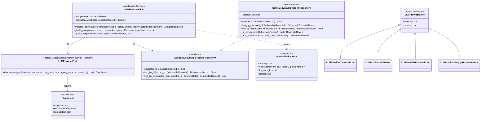

# 詳細設計書 — deliverable-template / ai-validation

> feature: `deliverable-template` / sub-feature: `ai-validation`
> 親 spec: [`../feature-spec.md`](../feature-spec.md) §9 受入基準 16〜17 / §確定 R1-G
> 関連: [`basic-design.md`](basic-design.md) / [`../domain/detailed-design.md`](../domain/detailed-design.md)（§確定 F: Fail Secure / §確定 A09: ログ制約）/ [`../../external-review-gate/domain/detailed-design.md`](../../external-review-gate/domain/detailed-design.md)（7 段階 save() 実装パターン継承元）/ [`../../llm-client/infrastructure/basic-design.md`](../../llm-client/infrastructure/basic-design.md)（LLMProviderPort・ClaudeCodeLLMClient・LLMProviderError 定義元）

## 本書の役割

本書は **階層 3: モジュール（sub-feature）の詳細設計**（Module-level Detailed Design）を凍結する。[`basic-design.md`](basic-design.md) で凍結されたモジュール基本設計を、実装直前の **構造契約・確定文言・キー構造** として詳細化する。実装 PR は本書を改変せず参照する。設計変更が必要なら本書を先に更新する PR を立てる。

**書くこと**: 各クラスの属性・型・制約 / §確定事項（業務ルールの実装方針展開）/ MSG 確定文言 / DBスキーマ詳細。
**書かないこと**: ソースコードそのもの / 業務ルールの議論（`feature-spec.md §確定 R1-G` 凍結済み）。

## 記述ルール（必ず守ること）

詳細設計に**疑似コード・サンプル実装（python/ts/sh/yaml 等の言語コードブロック）を書かない**。
ソースコードと二重管理になりメンテナンスコストしか生まない。
必要なのは「構造契約（属性名・型・制約）」と「確定文言（メッセージ文字列）」と「実装の意図（なぜこの API 形になるか）」であり、コードそのものは実装 PR で書く。

## クラス設計（詳細）

### Application Service: ValidationService

| 属性 | 型 | 制約 | 意図 |
|----|----|----|----|
| `_llm_provider` | `LLMProviderPort` | DI で注入、None 不可 | Protocol 差し替えを可能にする（DIP）。`ClaudeCodeLLMClient` / `CodexLLMClient` が concrete 実装（CLI subprocess）|
| `_repository` | `AbstractDeliverableRecordRepository` | DI で注入、None 不可 | DB 差し替えを可能にする（DIP）|

**ふるまい**:

`validate_deliverable(record, criteria) -> DeliverableRecord`:
1. 各 `criterion` に対して `_build_prompt(record.content, criterion)` を呼び `tuple[list[dict], str]`（messages, system）を取得
2. `await self._llm_provider.chat(messages=messages, system=system, session_id=None)` を呼び `ChatResult` を取得
3. `_parse_response(result.response)` で `(ValidationStatus, reason)` を抽出し `CriterionValidationResult` を収集
4. `new_record = record.derive_status(tuple(results))` を呼び §確定 R1-G で overall status を導出
5. `await self._repository.save(new_record)` で永続化
6. `new_record` を返す

UNCERTAIN / FAILED 時の ExternalReviewGate 生成は行わない（**D-3 確定**: 責務分離）

`_build_prompt(content, criterion) -> tuple[list[dict], str]`: §確定 B の構造化プロンプトを構築。`(messages, system)` のタプルを返す。`messages` は `[{"role": "user", "content": ...}]` の 1 要素リスト。`system` は評価者ロール指示の固定文字列。

`_parse_response(raw: str) -> tuple[ValidationStatus, str]`: `raw` が空文字の場合は即 `LLMValidationError(kind='parse_failed')` raise。それ以外は `json.loads(raw)` → `status` / `reason` フィールド抽出。`json.JSONDecodeError` / キー不在の場合も `kind='parse_failed'` raise。**PENDING 防御**: `status` フィールドの値が `"PENDING"` の場合も `LLMValidationError(kind='parse_failed')` raise（期待スキーマは `"PASSED"` / `"FAILED"` / `"UNCERTAIN"` のみ。LLM が内部状態語を返した場合の多層防御）。

### Infrastructure: SqliteDeliverableRecordRepository

| メソッド | 説明 |
|---------|------|
| `save(record)` | 4 段階 delete-then-insert パターン（DELETE results → DELETE record → INSERT record → INSERT results）。Tx 境界は呼び元が `async with session.begin():` で管理。`save()` 自身は `commit()` / `rollback()` を呼ばない |
| `find_by_id(record_id)` | `deliverable_records` + `criterion_validation_results` を JOIN して1件取得。`_from_orm` でデシリアライズ |
| `find_by_deliverable_id(deliverable_id)` | `deliverable_id` で最新1件取得（`created_at DESC LIMIT 1`）|
| `_to_orm(record)` | `DeliverableRecord` → `(deliverable_records 行, [criterion_validation_results 行])` のタプルに変換 |
| `_from_orm(row, result_rows)` | ORM 行 → `DeliverableRecord` に変換（`model_validate` 経由で不変条件再検査）|

**不変条件**:
- `save()` は冪等。既存 `id` の record が存在する場合は DELETE → INSERT で完全上書き（4 段階 delete-then-insert パターン）
- `save()` は呼び元 Tx（`async with session.begin():` で開始済み）の participant として動作。`session.commit()` / `session.rollback()` を自身では呼ばない
- トランザクション外での直接呼び出しは禁止（ACID 保証は呼び元 Tx に委譲）

### Domain Exception: LLMValidationError

| 属性 | 型 | 制約 | 意図 |
|----|----|----|----|
| `message` | `str` | 必須 | 人間可読のエラーメッセージ（MSG-AIVM-001 / MSG-AIVM-002 の展開済み文字列）|
| `kind` | `Literal["llm_call_failed", "parse_failed"]` | 必須 | エラー種別。`llm_call_failed`: `LLMProviderError` サブクラス起源 / `parse_failed`: JSON パース失敗起源 |
| `llm_error_kind` | `str` | 必須（`parse_failed` 時は `""`）| `LLMProviderError` サブクラス識別。値域: `"timeout"` / `"auth"` / `"process_error"` / `"empty_response"` / `""` |
| `provider` | `str` | 必須 | `llm_call_failed` 時: `LLMProviderError.provider`（`"claude-code"` / `"codex"`）を `exc.provider` で取得。`parse_failed` 時: `self._llm_provider.provider`（`LLMProviderPort.provider: str` property）で取得。両経路とも実装者が迷わない凍結済み取得経路（ヘルスバーグ欠陥D解消）|

**旧設計との差分**: 旧設計の `+detail: dict`（untyped）を廃止し、上記 4 フィールドに型付けして置換（ラムス欠陥2解消）。

## 確定事項（先送り撤廃）

### 確定 A: ValidationStatus 導出アルゴリズム（§確定 R1-G 実装展開）

親 `feature-spec.md §確定 R1-G` を `DeliverableRecord.derive_status()` の実装方針として展開する。

`derive_status(criterion_results: tuple[CriterionValidationResult, ...]) -> DeliverableRecord` の導出規則:

1. `required=True` の criterion のみを抽出してフィルタ
2. 導出規則（§確定 R1-G）:
   - `required=True` の criterion に `status=FAILED` が 1 件以上存在する → overall `FAILED`
   - `required=True` の criterion に `status=UNCERTAIN` が 1 件以上かつ `FAILED` が 0 件 → overall `UNCERTAIN`
   - `required=True` の criterion が全件 `status=PASSED`（または criteria が空）→ overall `PASSED`
   - 評価未実施（`criterion_results` が渡されない状態）→ `PENDING`
3. `required=False` の criterion は overall status 計算に影響しない（参考情報として `criterion_results` には含む）

**実装上の注意**: `derive_status` は純粋関数として実装する。外部状態・副作用を持たない。domain Aggregate への infrastructure Port 注入（旧 `validate_criteria(criteria, llm_port)` パターン）は DDD 違反のため廃止済み。

### 確定 B: LLM 構造化プロンプト構造（Prompt Injection T1 対策）

`ValidationService._build_prompt()` が構築する `tuple[list[dict], str]`（messages, system）の構造:

| 引数 | 内容 | Injection 対策 |
|-----|------|---------------|
| `system: str` | 評価者としての役割指示 + 出力フォーマット指定（JSON: `{"status": "PASSED\|FAILED\|UNCERTAIN", "reason": "<str>"}` のみ出力するよう指示）| ユーザー入力を含まない固定テキスト。実行時に変更不可 |
| `messages: list[dict]`（1 要素）| `[{"role": "user", "content": "<criterion block>\n--- BEGIN CONTENT ---\n{content}\n--- END CONTENT ---"}]` | content を delimiter で囲みスコープを限定 |

`messages[0]["content"]` の構造:

| ブロック | 位置 | 内容 | Injection 対策 |
|---------|------|------|---------------|
| Criterion block | 先頭 | `criterion.description` + `required: true/false` | content より前に配置。criterion は固定テキストに近い（テンプレート定義）|
| Content block | 後続 | `--- BEGIN CONTENT ---` / `{content}` / `--- END CONTENT ---` の delimiter で囲む | delimiter によるスコープ限定 |

**凍結事項**:
- `system` のテキストは実装 PR で確定（設計書では構造のみ凍結）
- Content delimiter は `--- BEGIN CONTENT ---` / `--- END CONTENT ---` 固定
- `LLMProviderPort.chat()` に渡す引数: `messages=[{"role": "user", "content": ...}]`, `system=<固定テキスト>`, `session_id=None`（各 criterion の評価は独立、セッション継続不要）
- LLM 応答（`ChatResult.response`）の期待 JSON schema: `{"status": "PASSED" | "FAILED" | "UNCERTAIN", "reason": "<str, 0〜1000文字>"}`

### 確定 C: LLMProviderPort DI とプロバイダ管理

`ValidationService` は `LLMProviderPort` を **DI で受け取るだけ** であり、プロバイダ選択・設定・認証を一切管理しない。

| 項目 | 旧設計（PR #147 クローズ済み）| 新設計 |
|-----|--------------------------|------|
| DI 構造 | 2段階（ValidationService → AbstractLLMValidationPort → AbstractLLMClient）| 1段階（ValidationService → LLMProviderPort 直接）|
| LLM 呼び出し | `LLMValidationAdapter` が `anthropic` / `openai` SDK を直接使用 | `ClaudeCodeLLMClient` / `CodexLLMClient` が CLIサブプロセスで呼び出し（§確定 LC-A）|
| プロバイダ設定 | `BAKUFU_LLM_VALIDATION_PROVIDER` / `BAKUFU_LLM_VALIDATION_API_KEY` 環境変数 | `LLMClientConfig`（llm-client feature）が一元管理。ai-validation は関与しない |
| Port インターフェース | `AbstractLLMClient.complete(messages, max_tokens) -> LLMResponse` | `LLMProviderPort.chat(messages, system, ...) -> ChatResult` |
| 廃止クラス | `AbstractLLMValidationPort`（domain/ports/）/ `LLMValidationAdapter`（infrastructure/llm_validation/）/ `LLMValidationConfig` | — |

**Fail Secure 規約**:
- `_llm_provider` が None の場合は `LLMValidationError` を即 raise。評価をバイパスして PASSED を返すことを禁止
- `LLMProviderError` サブクラスは即 `LLMValidationError(kind='llm_call_failed')` に変換（握り潰し禁止）

### 確定 D: 4 段階 delete-then-insert パターン詳細

`SqliteDeliverableRecordRepository.save()` の実装は delete-then-insert の 4 段階で行う:

| ステップ | 操作 | 目的 |
|---------|------|------|
| 1 | `DELETE FROM criterion_validation_results WHERE deliverable_record_id=record.id` | 旧評価結果削除（FK 制約のため child 先に削除）|
| 2 | `DELETE FROM deliverable_records WHERE id=record.id` | 旧レコード削除 |
| 3 | `INSERT INTO deliverable_records VALUES (...)` | 新レコード挿入 |
| 4 | `INSERT INTO criterion_validation_results VALUES (...) * N` | 新評価結果挿入（N 件）|

**SQLite 制約による設計根拠**:
- SQLite は `SELECT ... FOR UPDATE`（行レベル排他ロック）をサポートしない。WAL モードの暗黙的トランザクション分離で代替する
- `BEGIN TRANSACTION` / `COMMIT` / `ROLLBACK` は呼び元 Application Service が `async with session.begin():` で管理する責務。`save()` 自身はこれらを呼ばない
- ロールバック: ステップ 1〜4 のいずれかで例外発生時は呼び元 Tx の `__aexit__` が自動 ROLLBACK し、`RepositoryError` にラップして伝播する

### 確定 E: ORM ファイル配置（SEC-1 解消）

ORM テーブル定義の配置先を変更し CI 自動スキャンの対象に含める:

| 項目 | 旧配置（CI スキャン範囲外）| 新配置（CI 自動スキャン対象）|
|-----|--------------------------|--------------------------|
| deliverable_records ORM | `infrastructure/orm/deliverable_record_tables.py` | `infrastructure/persistence/sqlite/tables/deliverable_records.py` |
| criterion_validation_results ORM | 同上（同ファイル内）| `infrastructure/persistence/sqlite/tables/criterion_validation_results.py` |

実装 PR は `scripts/ci/check_masking_columns.sh` の `NO_MASK_FILES` または `PARTIAL_MASK_FILES` に上記 2 ファイルを追加すること。

### 確定 F: produced_by の Optional 根拠（ヘルスバーグ中程度欠陥5解消）

`deliverable_records.produced_by` が `None` になる業務シナリオを明記する:

| シナリオ | 説明 |
|---------|------|
| 手動投稿 | API で人間が `content` を直接送信。エージェント ID が存在しない |
| バッチ処理 | 複数エージェントによる並列処理など、特定のエージェント ID を識別できない |
| システム生成 | 設定ファイル・テンプレートからの自動インポート。エージェントが介在しない |

`produced_by` を `NOT NULL` にすると上記3シナリオで `DeliverableRecord` が生成不能になるため `nullable` が業務要件上の必然。

## ユーザー向けメッセージの確定文言

[`basic-design.md §ユーザー向けメッセージ一覧`](basic-design.md) で ID のみ定義した MSG を、本書で **正確な文言** として凍結する。

### プレフィックス統一

| プレフィックス | 意味 |
|---|---|
| `[FAIL]` | 処理中止を伴う失敗 |
| `[OK]` | 成功完了 |
| `[SKIP]` | 冪等実行による省略 |
| `[WARN]` | 警告（処理は継続）|
| `[INFO]` | 情報提供（処理は継続）|

### MSG 確定文言表

| ID | 出力先 | 文言（必要なら 2 行構造）|
|---|---|---|
| MSG-AIVM-001 | `stderr` | `[FAIL] LLM validation call failed: provider={provider}, error={error_type}.` / `Next: Check LLM CLI availability and authentication status (claude / codex).` |
| MSG-AIVM-002 | `stderr` | `[FAIL] LLM validation response could not be parsed: expected JSON with 'status' and 'reason' fields.` / `Next: Check LLM model output format or update prompt structure in ValidationService._build_prompt.` |

**注意**:
- `{provider}` には `LLMProviderError.provider` の値（`"claude-code"` / `"codex"`）を展開
- `{error_type}` には例外クラス名のみ（`LLMProviderTimeoutError` / `LLMProviderAuthError` / `LLMProviderProcessError` / `LLMProviderEmptyResponseError` 等）を展開。スタックトレース・認証情報は含めない（§確定 A09 ログ制約）
- 旧設計の `{model}` プレースホルダは廃止（CLIサブプロセス方式では model 情報が ValidationService から不可視のため）

## データ構造（永続化キー）

### `deliverable_records` テーブル

| カラム | 型 | 制約 | 意図 |
|-------|---|------|------|
| `id` | `VARCHAR(36)` | PK, NOT NULL | `DeliverableRecordId`（UUID v4 文字列）|
| `deliverable_id` | `VARCHAR(36)` | NOT NULL, INDEX | Task Deliverable 参照 ID |
| `template_ref_template_id` | `VARCHAR(36)` | NOT NULL | `DeliverableTemplateRef.template_id` |
| `template_ref_version_major` | `INTEGER` | NOT NULL | `DeliverableTemplateRef.minimum_version.major` |
| `template_ref_version_minor` | `INTEGER` | NOT NULL | `DeliverableTemplateRef.minimum_version.minor` |
| `template_ref_version_patch` | `INTEGER` | NOT NULL | `DeliverableTemplateRef.minimum_version.patch` |
| `content` | `TEXT` | NOT NULL | `DeliverableRecord.content`（`MaskedText` 適用済み）|
| `task_id` | `VARCHAR(36)` | NOT NULL | `TaskId`（UUID 文字列）|
| `validation_status` | `VARCHAR(20)` | NOT NULL | `ValidationStatus` StrEnum 値（`PENDING` / `PASSED` / `FAILED` / `UNCERTAIN`）|
| `produced_by` | `VARCHAR(36)` | nullable | `AgentId`（UUID 文字列）。None になる業務シナリオは §確定 F 参照 |
| `created_at` | `DATETIME` | NOT NULL | UTC 生成日時 |
| `validated_at` | `DATETIME` | nullable | UTC 評価完了日時（PENDING 時は NULL）|

**インデックス**:
- `idx_deliverable_records_deliverable_id` ON `deliverable_id`
- `idx_deliverable_records_task_id` ON `task_id`
- `idx_deliverable_records_validation_status` ON `validation_status`

### `criterion_validation_results` テーブル

| カラム | 型 | 制約 | 意図 |
|-------|---|------|------|
| `id` | `VARCHAR(36)` | PK, NOT NULL | 評価結果エントリの一意 ID（UUID v4）|
| `deliverable_record_id` | `VARCHAR(36)` | NOT NULL, FK → `deliverable_records.id`, INDEX | 親 DeliverableRecord 参照 |
| `criterion_id` | `VARCHAR(36)` | NOT NULL | `AcceptanceCriterion.id`（UUID 文字列）|
| `status` | `VARCHAR(20)` | NOT NULL | `ValidationStatus` StrEnum 値 |
| `reason` | `TEXT` | NOT NULL | LLM が出力した評価理由（0〜1000 文字）|
| `created_at` | `DATETIME` | NOT NULL | UTC 評価実行日時 |

**インデックス**:
- `idx_criterion_validation_results_record_id` ON `deliverable_record_id`
- `idx_criterion_validation_results_criterion_id` ON `criterion_id`

**FK 制約**:
- `deliverable_record_id` → `deliverable_records.id` ON DELETE CASCADE

### Alembic migration 0015

| 項目 | 値 |
|-----|---|
| `revision` | `"0015_deliverable_records"` |
| `down_revision` | `"0014_external_review_gate_criteria"` |
| `upgrade` | `deliverable_records` テーブル作成 → `criterion_validation_results` テーブル作成（FK 順序）|
| `downgrade` | `criterion_validation_results` テーブル DROP → `deliverable_records` テーブル DROP（FK 逆順）|

## 設計判断の補足

### なぜ D-1: DeliverableRecord = 独立 Aggregate Root か

DDD の「定義とインスタンスの分離」原則に基づく。`DeliverableTemplate` / `AcceptanceCriterion` は **定義エンティティ**（不変の業務ルール）。`DeliverableRecord` は **運用エンティティ**（評価実行のライフサイクルを持つ）。独立 Aggregate にすることで各々の独立したライフサイクル・整合性境界を保証できる。

### なぜ D-2: 1段階 Port 設計か（旧 2段階廃止）

旧設計の `ValidationService → AbstractLLMValidationPort → AbstractLLMClient` は、`LLMValidationAdapter` が infrastructure 実装と LLM API client の両方を担う過剰な間接層だった。新設計では `ValidationService` が `LLMProviderPort` を直接 DI で受け取る。プロンプト構築・応答パースは `ValidationService` 内のプライベートメソッド（`_build_prompt` / `_parse_response`）として実装することで、application service の凝集度を高め、テスト容易性も向上する。

### なぜ D-3: ValidationService は ExternalReviewGate を生成しないか

Single Responsibility Principle（SRP）に基づく。`ValidationService` の責務は「DeliverableRecord を評価し評価済み record を返す」こと。UNCERTAIN/FAILED 時の対処はビジネスフロー（Task 完了フロー等）の責務であり、ValidationService が知るべきでない。呼び出し元が policy を持つことで変更を局所化できる。

### なぜ D-4: derive_status は純粋関数か（旧 validate_criteria との差分）

旧 `DeliverableRecord.validate_criteria(criteria, llm_port)` は domain Aggregate が infrastructure Port を受け取る DDD 違反。新 `derive_status(criterion_results)` は事前に収集済みの結果 tuple を受け取り新 DeliverableRecord を返す純粋関数。LLM 呼び出しは application service 層（ValidationService）の責務に移動し、domain 層は純粋な状態導出のみを担う。

## API エンドポイント詳細

該当なし — 理由: 本 sub-feature は application / infrastructure 層のみ。HTTP API エンドポイントは将来の `deliverable-template/http-api` sub-feature で扱う。

## 出典・参考

- LLMProviderPort Protocol（llm-client feature）: `backend/src/bakufu/application/ports/llm_provider_port.py`
- LLMProviderError 階層（llm-client feature）: `LLMProviderError(message, provider)` / `LLMProviderTimeoutError` / `LLMProviderAuthError` / `LLMProviderProcessError` / `LLMProviderEmptyResponseError`
- ChatResult（llm-client feature）: `ChatResult(response: str, session_id: str | None, compacted: bool)`
- 参照実装: `kkm-horikawa/ai-team` の `claude_code_client.py` / `codex_cli_client.py`（chat() インターフェース元）: https://github.com/kkm-horikawa/ai-team
- Claude Code CLI: `claude -p <prompt> --system-prompt <system> --model <model> --output-format stream-json --verbose --tools ""`
- Codex CLI: `codex exec --json --skip-git-repo-check --ephemeral --dangerously-bypass-approvals-and-sandbox <prompt>`（`--dangerously-bypass-approvals-and-sandbox` の技術的根拠・リスク評価・緩和策は [llm-client feature §確定 SEC5](../../llm-client/infrastructure/basic-design.md) を参照）
- tech-stack.md §確定 LC-A（LLMProviderPort 採用根拠）: `docs/design/tech-stack.md`
- OWASP Top 10 2021 A03 Injection（Prompt Injection 対策設計根拠）: https://owasp.org/Top10/A03_2021-Injection/
- Domain-Driven Design: Aggregates（定義とインスタンスの分離）: https://martinfowler.com/bliki/DDD_Aggregate.html
- SQLAlchemy 2.0 Core Transactions: https://docs.sqlalchemy.org/en/20/core/connections.html
- Alembic migration tutorial: https://alembic.sqlalchemy.org/en/latest/tutorial.html
