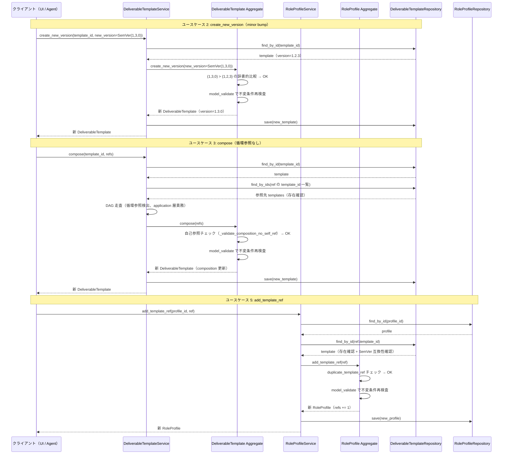
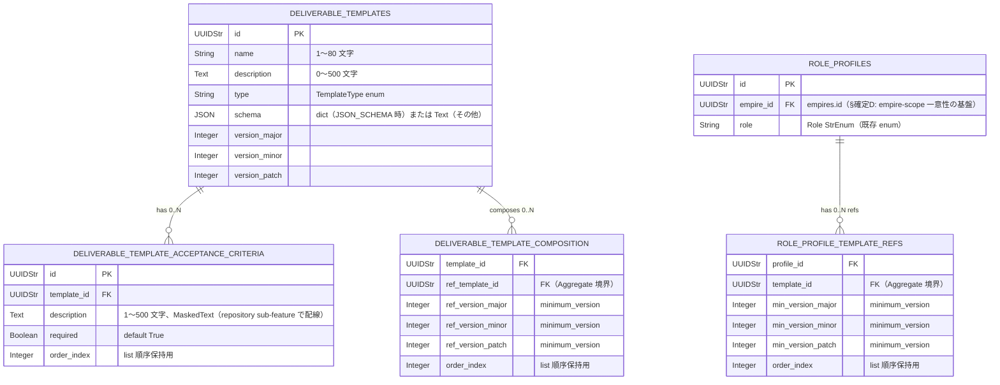

# 基本設計書 — deliverable-template / domain

> feature: `deliverable-template` / sub-feature: `domain`
> 親 spec: [../feature-spec.md](../feature-spec.md) §9 受入基準 1〜17
> 関連: [`docs/design/domain-model/aggregates.md`](../../../design/domain-model/aggregates.md) §DeliverableTemplate / §RoleProfile / §DeliverableRecord（Issue #123 追加）/ [`../../task/`](../../task/)（参照先 Aggregate）/ [`../../workflow/`](../../workflow/)（Role enum 参照元）/ [`../ai-validation/`](../ai-validation/)（ai-validation sub-feature）

## §モジュール契約（機能要件）

| 要件ID | 概要 | 入力 | 処理 | 出力 | エラー時 | 親 spec 参照 |
|--------|------|------|------|------|---------|-------------|
| REQ-DT-001 | DeliverableTemplate 構築 | id / name（1〜80文字）/ description（0〜500文字）/ type（TemplateType）/ schema（dict または str）/ acceptance_criteria（tuple[AcceptanceCriterion, ...]）/ version（SemVer）/ composition（tuple[DeliverableTemplateRef, ...]）| Pydantic 型バリデーション → model_validator で不変条件検査（①name 文字数 ②description 文字数 ③TemplateType=JSON_SCHEMA 時の schema が dict であること ④SemVer の各フィールドが 0 以上の整数 ⑤AcceptanceCriterion.description が 1 文字以上 ⑥composition の自己参照非存在（`_validate_composition_no_self_ref`））| valid な DeliverableTemplate インスタンス | 型違反: `pydantic.ValidationError` / 不変条件違反: `DeliverableTemplateInvariantViolation` | §9 AC#1, 2 |
| REQ-DT-002 | バージョン作成（create_new_version）| 現 DeliverableTemplate + new_version（SemVer）| 新 SemVer が現バージョンより大きいことを検査（(new.major, new.minor, new.patch) > (cur.major, cur.minor, cur.patch) の辞書的比較）→ 全属性をコピーし version のみ更新した新 DeliverableTemplate を model_validate 経由で構築 | 新 DeliverableTemplate インスタンス（version のみ更新、その他属性は引き継ぎ） | `DeliverableTemplateInvariantViolation(kind='version_not_greater')` | §9 AC#4 |
| REQ-DT-003 | テンプレート合成（compose）| 現 DeliverableTemplate + refs（tuple[DeliverableTemplateRef, ...]）| ①refs の各 template_id が現 DeliverableTemplate の id と異なること（自己参照検出）を不変条件 `_validate_composition_no_self_ref` で担保 ②推移的循環参照の検出は application 層責務（MVP では Issue #117 スコープ）③`acceptance_criteria` は引き継がない（§確定B）→ composition を refs で置換した新インスタンスを model_validate 経由で構築 | 新 DeliverableTemplate インスタンス（composition 更新、acceptance_criteria は引き継がれない） | `DeliverableTemplateInvariantViolation(kind='composition_self_ref')` | §9 AC#5, 6 |
| REQ-DT-004 | RoleProfile 構築 | id / empire_id（EmpireId）/ role（Role StrEnum）/ deliverable_template_refs（tuple[DeliverableTemplateRef, ...]）| Pydantic 型バリデーション → model_validator で不変条件検査（①deliverable_template_refs 内の template_id 重複なし ②各 DeliverableTemplateRef の minimum_version が有効な SemVer）| valid な RoleProfile インスタンス | `RoleProfileInvariantViolation` | §9 AC#5 |
| REQ-DT-005 | テンプレート参照追加・削除（add_template_ref / remove_template_ref）| add: RoleProfile + ref（DeliverableTemplateRef）/ remove: RoleProfile + template_id（DeliverableTemplateId）| add: ①既存 deliverable_template_refs に同一 template_id が存在しないことを検査 → refs に追加した新リストで RoleProfile 再構築 / remove: ①指定 template_id が deliverable_template_refs に存在することを検査 → 該当 ref を除いた新リストで RoleProfile 再構築 | 新 RoleProfile インスタンス | add: `RoleProfileInvariantViolation(kind='duplicate_template_ref')` / remove: `RoleProfileInvariantViolation(kind='template_ref_not_found')` | §9 AC#6, 7 |
| REQ-DT-006 | 不変条件検査（各 Aggregate・VO 共通）| 各 Aggregate / VO の現状属性 | ①DeliverableTemplate: name 1〜80 文字 / description 0〜500 文字 / TemplateType=JSON_SCHEMA 時は schema が dict / SemVer 各フィールド非負整数 / AcceptanceCriterion.description 1〜500 文字 / AcceptanceCriterion.id 重複なし / composition の自己参照なし（`_validate_composition_no_self_ref`） ②RoleProfile: deliverable_template_refs の template_id 重複なし ③SemVer: major / minor / patch が 0 以上の整数 ④AcceptanceCriterion: description が 1 文字以上 500 文字以下 | None（検査通過） | `DeliverableTemplateInvariantViolation` または `RoleProfileInvariantViolation`（kind で違反種別識別） | §9 AC#2, 4, 5 |
| REQ-DT-007 | DeliverableRecord 構築（Issue #123 ai-validation sub-feature で使用）| id / deliverable_id（DeliverableId — 評価対象 Task 成果物の参照 ID）/ template_ref（DeliverableTemplateRef）/ content（str, 0文字以上）/ task_id（TaskId）/ validation_status（ValidationStatus, デフォルト PENDING）/ criterion_results（tuple[CriterionValidationResult, ...], デフォルト空 tuple）/ produced_by（AgentId, optional）/ created_at（datetime UTC）| Pydantic 型バリデーション → model_validator で ① criterion_results 内の ValidationStatus が有効値であること ② validation_status が criterion_results と矛盾しないこと（PENDING かつ criterion_results 非空の場合は invalid）を検査 | valid な DeliverableRecord インスタンス | `pydantic.ValidationError` / `DeliverableRecordInvariantViolation` | §9 AC#16 |
| REQ-DT-008 | AI 検証実行（validate_criteria ふるまい）| DeliverableRecord（self）+ criteria（tuple[AcceptanceCriterion, ...]）+ llm_port（AbstractLLMValidationPort）| 各 AcceptanceCriterion について `llm_port.evaluate(content, criterion)` を呼び CriterionValidationResult を収集 → §確定 R1-G のルールで overall ValidationStatus を導出 → 新 DeliverableRecord（criterion_results 更新、validation_status 更新、validated_at 設定）を返す（pre-validate 方式） | 新 DeliverableRecord インスタンス | `LLMValidationError`（infrastructure 層起源。ai-validation sub-feature で定義）| §9 AC#16, 17 |

## 記述ルール（必ず守ること）

基本設計に**疑似コード・サンプル実装（python/ts/sh/yaml 等の言語コードブロック）を書かない**。
ソースコードと二重管理になりメンテナンスコストしか生まない。
必要なのは構造契約（クラス・モジュール・データの関係）であり、実装の細部は [detailed-design.md](detailed-design.md) で凍結する。

## モジュール構成

| 機能 ID | モジュール | ディレクトリ | 責務 |
|--------|----------|------------|------|
| REQ-DT-001〜003 | `DeliverableTemplate` Aggregate Root | `backend/src/bakufu/domain/deliverable_template/deliverable_template.py` | DeliverableTemplate の属性・不変条件・create_new_version / compose ふるまい |
| REQ-DT-004〜005 | `RoleProfile` Aggregate Root | `backend/src/bakufu/domain/deliverable_template/role_profile.py` | RoleProfile の属性・不変条件・add_template_ref / remove_template_ref / get_all_acceptance_criteria ふるまい |
| REQ-DT-006 | 不変条件 helper | `backend/src/bakufu/domain/deliverable_template/invariant_validators.py` | DeliverableTemplate / RoleProfile 両 Aggregate の不変条件 helper 関数群（ExternalReviewGate 同パターン）|
| REQ-DT-001, 004 | `DeliverableTemplateInvariantViolation` / `RoleProfileInvariantViolation` 例外 | `backend/src/bakufu/domain/exceptions.py`（既存ファイル更新）| 2 行エラー構造（6 兄弟と同パターン）|
| 共通（型）| `TemplateType` StrEnum | `backend/src/bakufu/domain/value_objects/enums.py`（既存ファイル更新）| MARKDOWN / JSON_SCHEMA / OPENAPI / CODE_SKELETON / PROMPT の 5 値 |
| REQ-DT-007 | `DeliverableRecord` Aggregate Root | `backend/src/bakufu/domain/deliverable_template/deliverable_record.py`（新規）| DeliverableRecord の属性・不変条件・validate_criteria ふるまい |
| REQ-DT-007 | `DeliverableRecordId` | `backend/src/bakufu/domain/value_objects/identifiers.py`（既存ファイル更新）| UUID ラッパー ID 型 |
| REQ-DT-007, 008 | `ValidationStatus` StrEnum | `backend/src/bakufu/domain/value_objects/enums.py`（既存ファイル更新）| PENDING / PASSED / FAILED / UNCERTAIN の 4 値 |
| REQ-DT-007, 008 | `CriterionValidationResult` VO | `backend/src/bakufu/domain/value_objects/template_vos.py`（既存ファイル更新）| criterion_id / status / reason の frozen VO |
| REQ-DT-007 | `DeliverableRecordInvariantViolation` 例外 | `backend/src/bakufu/domain/exceptions/deliverable_template.py`（既存ファイル更新）| 2 行エラー構造（既存兄弟例外と同パターン）|
| REQ-DT-008 | `AbstractLLMValidationPort` | `backend/src/bakufu/domain/ports/llm_validation_port.py`（新規）| LLM 検証の domain port インターフェース（§確定 F、§確定 C の JSON Schema validator と同パターン）|
| 共通（型）| `DeliverableTemplateId` / `RoleProfileId` | `backend/src/bakufu/domain/value_objects/identifiers.py`（既存ファイル更新）| UUID ラッパー ID 型（既存 ID 型と同パターン）|
| 共通（VO）| `SemVer` / `DeliverableTemplateRef` / `AcceptanceCriterion` | `backend/src/bakufu/domain/value_objects/template_vos.py`（新規ファイル）| Pydantic v2 frozen VO 3 種 |
| 公開 API | re-export | `backend/src/bakufu/domain/deliverable_template/__init__.py` | `DeliverableTemplate` / `RoleProfile` / `DeliverableTemplateInvariantViolation` / `RoleProfileInvariantViolation` / `TemplateType` / `SemVer` / `DeliverableTemplateRef` / `AcceptanceCriterion` を re-export |

```
ディレクトリ構造（本 feature で追加・変更されるファイル）:

.
├── backend/
│   ├── src/
│   │   └── bakufu/
│   │       └── domain/
│   │           ├── deliverable_template/          # 新規ディレクトリ
│   │           │   ├── __init__.py
│   │           │   ├── deliverable_template.py    # DeliverableTemplate Aggregate Root
│   │           │   ├── role_profile.py            # RoleProfile Aggregate Root
│   │           │   └── invariant_validators.py    # 不変条件ヘルパー
│   │           ├── exceptions.py                  # 既存更新: DeliverableTemplateInvariantViolation / RoleProfileInvariantViolation 追加
│   │           └── value_objects/
│   │               ├── enums.py                   # 既存更新: TemplateType 追加
│   │               ├── identifiers.py             # 既存更新: DeliverableTemplateId / RoleProfileId 追加
│   │               └── template_vos.py            # 新規: SemVer / DeliverableTemplateRef / AcceptanceCriterion
│   └── tests/
│       ├── factories/
│       │   ├── deliverable_template.py            # 新規: DeliverableTemplateFactory / RoleProfileFactory / SemVerFactory / AcceptanceCriterionFactory
│       │   └── template_vos.py                    # 新規: DeliverableTemplateRefFactory
│       └── domain/
│           └── deliverable_template/
│               ├── __init__.py
│               └── test_deliverable_template/     # 新規ディレクトリ（500 行ルール、最初から分割）
│                   ├── __init__.py
│                   ├── test_construction.py       # DeliverableTemplate 構築 + 不変条件
│                   ├── test_versioning.py         # create_new_version bump_type 全パターン
│                   ├── test_composition.py        # compose 正常系 + 自己参照 異常系 / §確定B: acceptance_criteria 非継承確認
│                   ├── test_role_profile.py       # RoleProfile 構築 + add / remove ふるまい
│                   └── test_value_objects.py      # SemVer / DeliverableTemplateRef / AcceptanceCriterion VO
└── docs/
    └── features/
        └── deliverable-template/                  # 本 feature 設計書群
```

## クラス設計（概要）

```mermaid
classDiagram
    class DeliverableTemplate {
        <<Aggregate Root>>
        +id: DeliverableTemplateId
        +name: str
        +description: str
        +type: TemplateType
        +schema: dict | str
        +acceptance_criteria: tuple~AcceptanceCriterion~
        +version: SemVer
        +composition: tuple~DeliverableTemplateRef~
        +create_new_version(new_version: SemVer) DeliverableTemplate
        +compose(refs: tuple) DeliverableTemplate
    }

    class RoleProfile {
        <<Aggregate Root>>
        +id: RoleProfileId
        +empire_id: EmpireId
        +role: Role
        +deliverable_template_refs: tuple~DeliverableTemplateRef~
        +add_template_ref(ref) RoleProfile
        +remove_template_ref(template_id) RoleProfile
        +get_all_acceptance_criteria(lookup) list~AcceptanceCriterion~
    }

    class TemplateType {
        <<StrEnum>>
        MARKDOWN
        JSON_SCHEMA
        OPENAPI
        CODE_SKELETON
        PROMPT
    }

    class SemVer {
        <<Value Object, frozen>>
        +major: int
        +minor: int
        +patch: int
        +is_compatible_with(other) bool
    }

    class DeliverableTemplateRef {
        <<Value Object, frozen>>
        +template_id: DeliverableTemplateId
        +minimum_version: SemVer
    }

    class AcceptanceCriterion {
        <<Value Object, frozen>>
        +id: UUID
        +description: str
        +required: bool
    }

    class DeliverableTemplateId {
        <<UUID VO>>
    }

    class RoleProfileId {
        <<UUID VO>>
    }

    class DeliverableTemplateInvariantViolation {
        +message: str
        +detail: dict
        +kind: str
    }

    class RoleProfileInvariantViolation {
        +message: str
        +detail: dict
        +kind: str
    }

    DeliverableTemplate --> TemplateType : has
    DeliverableTemplate --> SemVer : has
    DeliverableTemplate --> AcceptanceCriterion : owns 0..N
    DeliverableTemplate --> DeliverableTemplateRef : owns 0..N (composition)
    DeliverableTemplate --> DeliverableTemplateId : identified by
    DeliverableTemplateRef --> DeliverableTemplateId : references
    DeliverableTemplateRef --> SemVer : has (minimum_version)
    RoleProfile --> RoleProfileId : identified by
    RoleProfile --> DeliverableTemplateRef : owns 0..N
    DeliverableTemplate ..> DeliverableTemplateInvariantViolation : raises
    RoleProfile ..> RoleProfileInvariantViolation : raises

    class DeliverableRecord {
        <<Aggregate Root>>
        +id: DeliverableRecordId
        +deliverable_id: DeliverableId
        +template_ref: DeliverableTemplateRef
        +content: str
        +task_id: TaskId
        +validation_status: ValidationStatus
        +criterion_results: tuple~CriterionValidationResult~
        +produced_by: AgentId
        +created_at: datetime
        +validated_at: datetime
        +validate_criteria(criteria, llm_port) DeliverableRecord
    }
    class ValidationStatus {
        <<StrEnum>>
        PENDING
        PASSED
        FAILED
        UNCERTAIN
    }
    class CriterionValidationResult {
        <<Value Object, frozen>>
        +criterion_id: UUID
        +status: ValidationStatus
        +reason: str
    }
    class AbstractLLMValidationPort {
        <<interface>>
        +evaluate(content: str, criterion: AcceptanceCriterion) CriterionValidationResult
    }
    class DeliverableRecordInvariantViolation {
        +message: str
        +detail: dict
        +kind: str
    }
    DeliverableRecord --> DeliverableTemplateRef : template_ref
    DeliverableRecord --> ValidationStatus : has
    DeliverableRecord "1" --> "0..*" CriterionValidationResult : criterion_results
    DeliverableRecord --> DeliverableRecordId : identified by
    DeliverableRecord ..> AbstractLLMValidationPort : uses（validate_criteria）
    DeliverableRecord ..> DeliverableRecordInvariantViolation : raises
    CriterionValidationResult --> ValidationStatus : has
```



**凝集のポイント**:

- `DeliverableTemplate` および `RoleProfile` は frozen（Pydantic v2 `model_config.frozen=True`）
- `create_new_version` / `compose` / `add_template_ref` / `remove_template_ref` は**すべて新インスタンスを返す**（pre-validate 方式、ExternalReviewGate 同パターン）
- `SemVer` / `DeliverableTemplateRef` / `AcceptanceCriterion` の 3 VO はすべて frozen（Pydantic v2 `model_config.frozen=True`）
- `SemVer.is_compatible_with(other)` は「major バージョンが一致するか」を純粋関数として実装
- `TemplateType=JSON_SCHEMA` 時の `schema` 型検証（dict であること）は `invariant_validators.py` の helper 関数として独立
- 循環参照（推移的）DAG 検査の完全な実施は **application 層責務**（Issue #117 スコープ）。domain Aggregate は自己参照の形式的不変条件（`_validate_composition_no_self_ref`）のみ担保する
- `Role` enum は **既存の StrEnum を参照するのみ**（本 feature では新規定義しない）
- `get_all_acceptance_criteria()` は `deliverable_template_refs` を展開するためのふるまいであり、参照先 DeliverableTemplate の実体解決は **application 層責務**（domain 層は ref の構造のみ保持）
- `DeliverableTemplateId` / `RoleProfileId` の参照整合性は **application 層責務**（Aggregate 内では参照のみ保持）
- **他 Aggregate の具体クラスを一切 import しない**（Aggregate 境界保護）

## 依存関係

本 feature の domain 層が依存するモジュール（既存）:

| 依存先 | 理由 |
|--------|------|
| `bakufu.domain.value_objects.identifiers`（既存）| `TaskId` / `AgentId` 等の既存 ID 型パターンを踏襲して `DeliverableTemplateId` / `RoleProfileId` を追加 |
| `bakufu.domain.value_objects.enums`（既存）| `Role` StrEnum（既存）を参照。`TemplateType` を本 feature で追加 |
| `bakufu.domain.exceptions`（既存）| `DeliverableTemplateInvariantViolation` / `RoleProfileInvariantViolation` を本 feature で追加 |

本 feature の domain 層に依存するモジュール（将来）:

| 依存元（予定）| 理由 |
|-------------|------|
| `deliverable-template/repository`（将来 sub-feature）| Aggregate の永続化 |
| `deliverable-template/http-api`（将来 sub-feature）| HTTP API エンドポイント |
| `deliverable-template/ai-validation`（Issue #123）| `DeliverableRecord` / `ValidationStatus` / `AbstractLLMValidationPort` を使用 |
| `task/domain`（参照のみ）| task が DeliverableTemplate を参照する場合の連携（application 層経由）|

## 処理フロー

### ユースケース 1: DeliverableTemplate 構築（DeliverableTemplateService.create 経由）

1. application 層 `DeliverableTemplateService.create(name, description, type, schema, acceptance_criteria, version, composition)` が呼ばれる
2. `type=JSON_SCHEMA` の場合、`schema` が dict 型であることを application 層で事前確認（domain 層でも不変条件として二重検査）
3. `composition` に自己参照が含まれないことを application 層で確認（自己の id はまだ未生成のため、application 層で uuid4() を先行生成して検査）
4. `DeliverableTemplate(id=uuid4(), name=name, ..., version=SemVer(major=0, minor=1, patch=0), composition=composition)` を構築
5. Pydantic 型バリデーション → `model_validator(mode='after')` で REQ-DT-006 の不変条件 5 種が走る
6. valid なら `DeliverableTemplateRepository.save(template)`（後続 repository sub-feature）

### ユースケース 2: バージョン作成（create_new_version）

1. application 層が `template.create_new_version(new_version=SemVer(1, 3, 0))` を呼ぶ（呼び元が新 SemVer を計算して渡す）
2. Aggregate 内:
   - `new_version` を `(new.major, new.minor, new.patch)` > `(cur.major, cur.minor, cur.patch)` の辞書的比較で検査
   - 現バージョン以下の場合は `kind='version_not_greater'`（MSG-DT-003）を raise
   - 検査通過後、全属性をコピーし `version=new_version` で新 `DeliverableTemplate` を `model_validate` 経由で構築（不変条件再検査）
3. 新インスタンスを返す
4. application 層が `DeliverableTemplateRepository.save(new_template)` を呼ぶ

### ユースケース 3: テンプレート合成（compose）

1. application 層が `template.compose(refs)` を呼ぶ
2. application 層が refs の各 `template_id` に対応する DeliverableTemplate が存在することを `DeliverableTemplateRepository.find_by_id()` で確認（参照整合性、application 層責務）
3. application 層が refs を起点に完全な依存グラフを走査し循環参照の不在を確認（DAG 検査、application 層責務）
4. Aggregate 内:
   - `refs` に `self.id` が含まれないことを検査（自己参照禁止、`kind='composition_self_ref'`）
   - `composition=refs` で全属性をコピーした新 `DeliverableTemplate` を構築（`acceptance_criteria` は引き継がない、§確定B）
5. 新インスタンスを返す

### ユースケース 4: RoleProfile 構築（RoleProfileService.create 経由）

1. application 層 `RoleProfileService.create(role, deliverable_template_refs)` が呼ばれる
2. application 層が `deliverable_template_refs` の各 `template_id` が実在することを確認（参照整合性、application 層責務）
3. `RoleProfile(id=uuid4(), role=role, deliverable_template_refs=deliverable_template_refs)` を構築
4. Pydantic 型バリデーション → model_validator で不変条件（template_id 重複なし）検査
5. valid なら `RoleProfileRepository.save(profile)`（後続 repository sub-feature）

### ユースケース 5: テンプレート参照追加・削除（add_template_ref / remove_template_ref）

1. application 層が `profile.add_template_ref(ref)` を呼ぶ
2. application 層が `ref.template_id` の DeliverableTemplate が存在し、`ref.minimum_version` との互換性（SemVer.is_compatible_with）を確認（application 層責務）
3. Aggregate 内:
   - `deliverable_template_refs` に同一 `template_id` が存在しないことを検査（`kind='duplicate_template_ref'`）
   - refs に追加した新リストで `RoleProfile` を再構築
4. 新インスタンスを返す
5. `remove_template_ref(template_id)` では指定 `template_id` の存在を検査（`kind='template_ref_not_found'`）後、該当 ref を除いた新リストで再構築

## シーケンス図



## エラーハンドリング方針

| 例外種別 | 処理方針 | ユーザーへの通知 |
|---------|---------|----------------|
| `DeliverableTemplateInvariantViolation(kind='schema_format_invalid')` | application 層で catch、HTTP API 層で 422 Unprocessable Entity | MSG-DT-001 |
| `DeliverableTemplateInvariantViolation(kind='composition_self_ref')` | application 層で catch、422 にマッピング | MSG-DT-002 |
| `DeliverableTemplateInvariantViolation(kind='version_not_greater')` | application 層で catch、422 にマッピング | MSG-DT-003 |
| `RoleProfileInvariantViolation(kind='duplicate_template_ref')` | application 層で catch、409 Conflict | MSG-DT-004 |
| `RoleProfileInvariantViolation(kind='template_ref_not_found')` | application 層で catch、404 Not Found | MSG-DT-005 |
| `DeliverableRecordInvariantViolation(kind='invalid_validation_state')` | application 層で catch、500 Internal（構築時の矛盾は呼び元バグ）| MSG-DT-006 |
| `pydantic.ValidationError` | application 層で catch、422 にマッピング | 汎用 Pydantic エラー |
| その他 | 握り潰さない、application 層へ伝播 | 汎用エラーメッセージ |

全例外の `detail` フィールドには機密情報を含めない（A09 ホワイトリスト制約。detailed-design.md §確定A09 参照）。

全 `DeliverableTemplateInvariantViolation` / `RoleProfileInvariantViolation` は `[FAIL] ...` + `Next: ...` の 2 行構造（業務ルール、兄弟 feature 同パターン）。

## MSG 一覧（ID のみ、確定文言は detailed-design.md で凍結）

| ID | 概要 | `kind` 値 | 例外型 |
|----|-----|----------|-------|
| MSG-DT-001 | JSON_SCHEMA/OPENAPI タイプで schema が無効な JSON Schema | `schema_format_invalid` | `DeliverableTemplateInvariantViolation` |
| MSG-DT-002 | compose 自己参照禁止違反 | `composition_self_ref` | `DeliverableTemplateInvariantViolation` |
| MSG-DT-003 | create_new_version で new_version が現バージョン以下 | `version_not_greater` | `DeliverableTemplateInvariantViolation` |
| MSG-DT-004 | add_template_ref 重複参照違反 | `duplicate_template_ref` | `RoleProfileInvariantViolation` |
| MSG-DT-005 | remove_template_ref 参照未発見 | `template_ref_not_found` | `RoleProfileInvariantViolation` |
| MSG-DT-006 | DeliverableRecord 構築時の validation_status と criterion_results の矛盾 | `invalid_validation_state` | `DeliverableRecordInvariantViolation` |

## セキュリティ設計

### 脅威モデル

本 feature 範囲では以下の 4 件。詳細な信頼境界は [`docs/design/threat-model.md`](../../../design/threat-model.md)。

| 想定攻撃者 | 攻撃経路 | 保護資産 | 対策 |
|-----------|---------|---------|------|
| **T1: schema フィールドへの任意データ混入** | TemplateType=MARKDOWN の DeliverableTemplate の schema フィールドに任意の dict を渡して解釈させる | テンプレートの型整合性 | TemplateType=JSON_SCHEMA 時のみ schema が dict であることを不変条件で強制。MARKDOWN / PROMPT 等の場合は str 型を期待し、Pydantic 型強制でガード |
| **T2: 循環参照による無限ループ攻撃** | compose で相互参照するテンプレート群を登録 → application 層の DAG 走査で無限ループを誘発 | サービス可用性 | domain Aggregate は自己参照の形式的不変条件（`composition_self_ref`）のみ担保。MVP ではシャロー解決のみ（§確定B）。推移的循環参照の完全 DAG 検査は Issue #117 スコープ |
| **T3: SemVer 偽造によるバージョン互換性迂回** | major=0 / minor=INT_MAX のような極端な値で is_compatible_with を迂回 | バージョン互換性保証 | SemVer の各フィールドを 0 以上の整数に限定する不変条件（REQ-DT-006）で Pydantic 型強制。INT_MAX 等の攻撃は Python の int 型上限がないため許容するが、表示・永続化層で上限を設ける（repository sub-feature で凍結）|
| **T4: acceptance_criteria.description への secret 混入** | LLM 出力の受入基準説明文に API key / webhook URL を含めて永続化 → ログ経由で漏洩 | API key / webhook token | Aggregate 内では raw 保持（domain 層責務外）。Repository 永続化前マスキング必須（repository sub-feature で実施）|

### OWASP Top 10 対応

| # | カテゴリ | 対応状況 |
|---|---------|---------|
| A01 | Broken Access Control | 該当なし（domain 層。アクセス制御は application 層責務）|
| A02 | Cryptographic Failures | **適用**: `acceptance_criteria[*].description` / `schema` の永続化前マスキング（後続 repository sub-feature で配線）|
| A03 | Injection | **適用**: Pydantic 型強制 + TemplateType StrEnum による列挙値制限 + name / description の文字数バリデーション |
| A04 | Insecure Design | **適用**: pre-validate 方式 / frozen model / DAG 検査（application 層）/ 5 種不変条件の多重防衛 |
| A05 | Security Misconfiguration | 該当なし（domain 層）|
| A06 | Vulnerable and Outdated Components | Pydantic v2 / pyright（`dev-workflow/audit` ジョブで横断管理）|
| A07 | Auth Failures | 該当なし（domain 層。認証・認可は application 層責務）|
| A08 | Data Integrity Failures | **適用**: frozen model / pre-validate / composition 自己参照・RoleProfile refs 重複・AcceptanceCriterion id 重複・型整合性の 5 種不変条件による多重防衛 |
| A09 | Logging Failures | **適用**: `DeliverableTemplateInvariantViolation` / `RoleProfileInvariantViolation` の例外ログに secret が混入しないよう、acceptance_criteria.description 等は長さ情報のみを detail に含める（detailed-design.md で凍結）|
| A10 | SSRF | **適用（Issue #123 追加）**: `DeliverableRecord.validate_criteria` が `AbstractLLMValidationPort` 経由で外部 LLM API を呼ぶ。Port 自体は URL を受け取らず固定エンドポイントのみ。infrastructure `LLMValidationAdapter` が環境変数で事前設定されたエンドポイントのみ使用（ai-validation sub-feature §確定 C 参照）|

## ER 図

該当なし — 理由: 本 feature は domain 層のみで永続化スキーマは含まない。永続化は将来の `deliverable-template/repository` sub-feature で扱う。参考の概形:



masking 対象（将来の repository sub-feature 責務、本 PR スコープ外）:
- `deliverable_template_acceptance_criteria.description`: `MaskedText`
- `deliverable_templates.schema`（TEXT 型の場合）: `MaskedText`

## アーキテクチャへの影響

- `docs/design/domain-model/aggregates.md` への変更: §DeliverableTemplate および §RoleProfile を**本 PR で追加**（未記載のため）
- `docs/design/domain-model/value-objects.md` への変更: §列挙型一覧に `TemplateType` 行を追加。§SemVer / §DeliverableTemplateRef / §AcceptanceCriterion の構造定義を追加
- `docs/design/domain-model/identifiers.md` への変更: `DeliverableTemplateId` / `RoleProfileId` の ID 型定義を追加
- 既存 feature への波及: なし。task / external-review-gate / internal-review-gate 等は本 feature を import しない（依存方向: deliverable_template → 既存 ID 型 + Role enum のみ）
- `Role` enum の参照: 既存 `bakufu.domain.value_objects.enums.Role`（StrEnum）を本 feature が参照するが、変更はしない。Role 定義の変更が必要な場合は `workflow` feature の担当

## 外部連携

該当なし — 理由: domain 層のみ。HTTP API / Webhook 等の外部通信は将来の sub-feature で扱う。

| 連携先 | 目的 | プロトコル | 認証 | タイムアウト / リトライ |
|-------|------|----------|-----|--------------------|
| 該当なし | — | — | — | — |

## UX 設計

該当なし — 理由: domain 層、UI なし。テンプレート管理 UI は将来の `deliverable-template/http-api` および UI sub-feature で扱う。

| シナリオ | 期待される挙動 |
|---------|------------|
| 該当なし | — |

**アクセシビリティ方針**: 該当なし。
