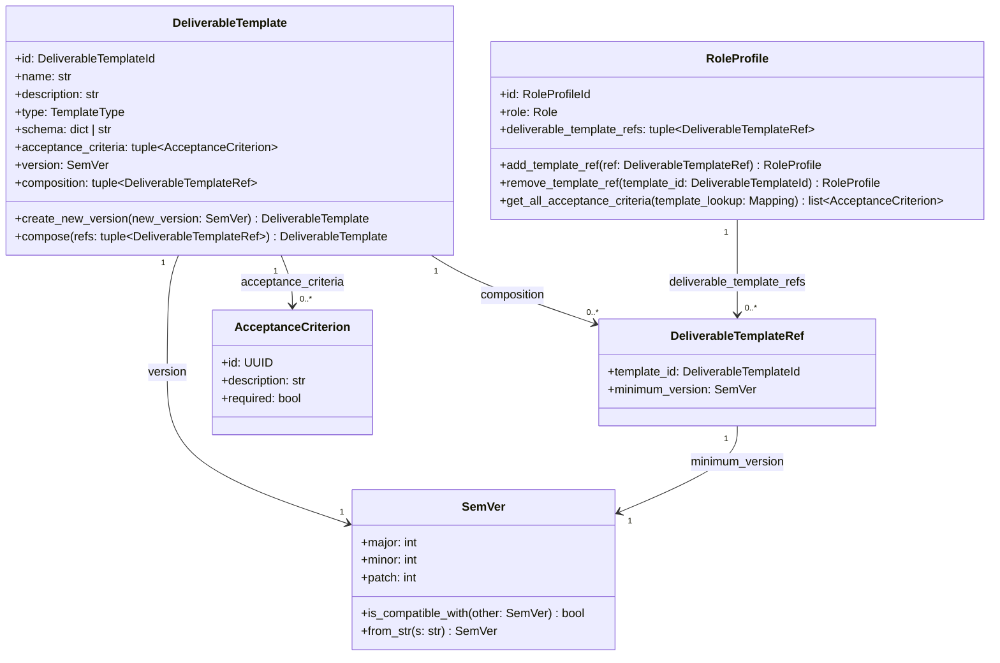

# 詳細設計書 — deliverable-template / domain

> feature: `deliverable-template` / sub-feature: `domain`
> 親 spec: [../feature-spec.md](../feature-spec.md)
> 関連: [basic-design.md](basic-design.md) / [`../../../design/domain-model/aggregates.md`](../../../design/domain-model/aggregates.md) §DeliverableTemplate / §RoleProfile / [`../../external-review-gate/domain/detailed-design.md`](../../external-review-gate/domain/detailed-design.md) §確定 A（pre-validate 方式継承元）

## 記述ルール（必ず守ること）

詳細設計に**疑似コード・サンプル実装（python/ts/sh/yaml 等の言語コードブロック）を書かない**。
ソースコードと二重管理になりメンテナンスコストしか生まない。
必要なのは「構造契約（属性名・型・制約）」と「確定文言（メッセージ文字列）」と「実装の意図」。

## クラス設計（詳細）

### Aggregate Root: DeliverableTemplate

| 属性 | 型 | 制約 | 意図 |
|----|----|----|----|
| `id` | `DeliverableTemplateId`（UUIDv4）| 不変 | 一意識別 |
| `name` | `str` | 1〜80 文字、NFC 正規化 | テンプレート名称（表示用）|
| `description` | `str` | 0〜500 文字 | テンプレート説明 |
| `type` | `TemplateType` | `MARKDOWN / JSON_SCHEMA / OPENAPI / CODE_SKELETON / PROMPT`（StrEnum 5 値）| テンプレート種別 |
| `schema` | `dict \| str` | `type` が `JSON_SCHEMA` / `OPENAPI` のとき `dict`、それ以外のとき `str`（**§確定 A** + **§確定 C** 参照）| テンプレート本体 |
| `acceptance_criteria` | `tuple[AcceptanceCriterion, ...]` | 0 件以上、frozen via tuple、各 `description` 1 文字以上 | 成果物受入基準セット |
| `version` | `SemVer` | major/minor/patch 各 0 以上 | セマンティックバージョン（不変 VO）|
| `composition` | `tuple[DeliverableTemplateRef, ...]` | 0 件以上、自己参照禁止（**§確定 B** 参照）| DAG 参照（他テンプレートへの直接参照のみ）|

`model_config`:
- `frozen = True`
- `arbitrary_types_allowed = False`
- `extra = 'forbid'`

**不変条件（model_validator(mode='after')）**: 4 種

1. `_validate_schema_format` — `type` が `JSON_SCHEMA` または `OPENAPI` のとき `schema` は有効な JSON Schema dict でなければならない（Validation Port 経由、**§確定 C** 参照）。構築時に Fail Fast。
2. `_validate_composition_no_self_ref` — `composition` 内のいずれの `DeliverableTemplateRef.template_id` も `self.id` と一致してはならない。
3. `_validate_version_non_negative` — `SemVer` の `major` / `minor` / `patch` がすべて 0 以上。
4. `_validate_acceptance_criteria_non_empty_descriptions` — `acceptance_criteria` 内の各 `AcceptanceCriterion.description` が 1 文字以上。

**ふるまい**（全 2 種、すべて新インスタンス返却、pre-validate 方式、**§確定 A**）:
- `create_new_version(new_version: SemVer) -> DeliverableTemplate`: 現バージョンより大きい `new_version` を受け取り、同内容で `version` のみ更新したコピーを返す。`new_version <= current version`（major.minor.patch の辞書的比較）の場合は `DeliverableTemplateInvariantViolation(kind='version_not_greater')` を raise。
- `compose(refs: tuple[DeliverableTemplateRef, ...]) -> DeliverableTemplate`: `composition` に `refs` を設定した新インスタンスを返す。`acceptance_criteria` は引き継がない（**§確定 B** 参照）。自己参照チェックは `model_validator` が担保。

### Aggregate Root: RoleProfile

| 属性 | 型 | 制約 | 意図 |
|----|----|----|----|
| `id` | `RoleProfileId`（UUIDv4）| 不変 | 一意識別 |
| `role` | `Role`（StrEnum）| 不変、既存 Enum 値を使用（新 Aggregate ではない） | Empire 内の役割（**§確定 D** 参照）|
| `deliverable_template_refs` | `tuple[DeliverableTemplateRef, ...]` | 0 件以上、`template_id` 重複禁止 | 役割に紐づくテンプレート参照リスト |

`model_config`:
- `frozen = True`
- `arbitrary_types_allowed = False`
- `extra = 'forbid'`

**不変条件（model_validator(mode='after')）**: 1 種

1. `_validate_no_duplicate_refs` — `deliverable_template_refs` 内のすべての `template_id` が一意。重複があれば `RoleProfileInvariantViolation(kind='duplicate_template_ref')` を raise。

**ふるまい**（全 3 種、すべて新インスタンス返却、pre-validate 方式、**§確定 A**）:
- `add_template_ref(ref: DeliverableTemplateRef) -> RoleProfile`: `ref` を末尾に追加した新インスタンスを返す。`ref.template_id` が既存 `deliverable_template_refs` 内に存在する場合は `RoleProfileInvariantViolation(kind='duplicate_template_ref')` を raise（MSG-DT-004）。
- `remove_template_ref(template_id: DeliverableTemplateId) -> RoleProfile`: 指定 `template_id` を除いた新インスタンスを返す。見つからない場合は `RoleProfileInvariantViolation(kind='template_ref_not_found')` を raise（MSG-DT-005）。Fail Fast。
- `get_all_acceptance_criteria(template_lookup: Mapping[DeliverableTemplateId, DeliverableTemplate]) -> list[AcceptanceCriterion]`: `deliverable_template_refs` を `template_lookup` で解決し、各テンプレートの `acceptance_criteria` を union（`id` で重複排除）して返す。`required=True` の基準を先頭、`required=False` の基準を後続に並べる。**ドメインサービス化しない（§確定 E 参照）**。

### VO: SemVer（`domain/value_objects.py` 新規追加）

| 属性 | 型 | 制約 | 意図 |
|----|----|----|----|
| `major` | `int` | 0 以上 | メジャーバージョン番号 |
| `minor` | `int` | 0 以上 | マイナーバージョン番号 |
| `patch` | `int` | 0 以上 | パッチバージョン番号 |

`model_config`: frozen / extra='forbid' / arbitrary_types_allowed=False。

| メソッド | 引数 | 戻り値 | 動作 |
|----|----|----|----|
| `is_compatible_with` | `other: SemVer` | `bool` | `self.major == other.major` を返す（major 一致 = API 互換） |
| `__str__` | — | `str` | `"{major}.{minor}.{patch}"` 形式の文字列を返す |
| `from_str`（classmethods）| `s: str` | `SemVer` | `"1.2.3"` 形式を parse して `SemVer` を返す。形式不正・非負数違反時は `ValueError` を raise |

**比較ロジック**（`create_new_version` で使用）: major → minor → patch の辞書的順序で大小比較。`major.minor.patch` のいずれかが大きければ「大きい」とみなす（Python tuple 比較と同等、`(major, minor, patch)` として比較）。

### VO: DeliverableTemplateRef（`domain/value_objects.py` 新規追加）

| 属性 | 型 | 制約 | 意図 |
|----|----|----|----|
| `template_id` | `DeliverableTemplateId`（UUIDv4）| 不変 | 参照先テンプレートの ID |
| `minimum_version` | `SemVer` | 不変 | 参照時に要求する最低バージョン |

`model_config`: frozen / extra='forbid' / arbitrary_types_allowed=False。

### VO: AcceptanceCriterion（`domain/value_objects.py` 新規追加）

| 属性 | 型 | 制約 | 意図 |
|----|----|----|----|
| `id` | `UUID` | UUIDv4 | 基準の一意識別（重複排除キー）|
| `description` | `str` | 1〜500 文字 | 受入基準の説明テキスト |
| `required` | `bool` | デフォルト `True` | 必須基準か任意基準かの区別 |

`model_config`: frozen / extra='forbid' / arbitrary_types_allowed=False。

### Enum 追加（`domain/value_objects.py`）

| Enum | 値 | 用途 |
|---|---|---|
| `TemplateType` | `MARKDOWN / JSON_SCHEMA / OPENAPI / CODE_SKELETON / PROMPT` | `DeliverableTemplate.type` |

`StrEnum` として実体化。`JSON_SCHEMA` および `OPENAPI` の場合のみ `schema` に対して JSON Schema バリデーションを実施（`_validate_schema_format` 不変条件）。

### Exception: DeliverableTemplateInvariantViolation（`domain/exceptions.py` 追記）

| 属性 | 型 | 制約 |
|----|----|----|
| `kind` | `str` | 違反種別（`'schema_format_invalid'` / `'composition_self_ref'` / `'version_not_greater'` 等）|
| `message` | `str` | MSG-DT-NNN 由来の文言（R1-F 2 行構造）|
| `detail` | `dict[str, object]` | 違反の文脈情報 |

`Exception` 継承。`domain/exceptions.py` の既存例外と統一フォーマット。`super().__init__` 前に `message` を確定済み文言で設定する。

### Exception: RoleProfileInvariantViolation（`domain/exceptions.py` 追記）

| 属性 | 型 | 制約 |
|----|----|----|
| `kind` | `str` | 違反種別（`'duplicate_template_ref'` / `'template_ref_not_found'` 等）|
| `message` | `str` | MSG-DT-NNN 由来の文言（R1-F 2 行構造）|
| `detail` | `dict[str, object]` | 違反の文脈情報 |

`Exception` 継承。`domain/exceptions.py` の既存例外と統一フォーマット。

## 確定事項（先送り撤廃）

### 確定 A: pre-validate 方式（全 Aggregate、external-review-gate §確定 E 継承）

**採用方針: pre-validate 方式**（Pydantic frozen model + model_validator、`model_copy(update=...)` 不採用）

`DeliverableTemplate` / `RoleProfile` のふるまいはすべて以下の手順で実装する:

| ステップ | 内容 |
|---|---|
| 1 | 前提条件チェック（`kind` が判明している場合は早期 raise）|
| 2 | 入力値の正規化（NFC 等）|
| 3 | `self.model_dump(mode='python')` で現状を dict 化 |
| 4 | dict 内の該当属性を新値で更新 |
| 5 | `DeliverableTemplate.model_validate(updated_dict)` / `RoleProfile.model_validate(updated_dict)` を呼ぶ — `model_validator(mode='after')` が走る |
| 6 | 失敗時は `ValidationError` を各 `InvariantViolation` に変換して raise（pre-validate なので元インスタンスは変更されない）|

`model_copy(update=...)` は採用しない（`model_validator` が再実行されないため、不変条件をすり抜ける経路が生まれる。他 Aggregate と同一方針）。

### 確定 B: composition はシャロー解決のみ（再帰解決不採用）

`DeliverableTemplate.composition` は**直接参照のみ**（1 段階）を保持する。再帰的な transitive 解決は `RoleProfile.get_all_acceptance_criteria` の責務として位置づける。

| 分担 | 責務 |
|---|---|
| `DeliverableTemplate.compose` | 直接 refs を `composition` フィールドに設定するのみ |
| `RoleProfile.get_all_acceptance_criteria` | `template_lookup` を使って refs を 1 段階解決、各テンプレートの `acceptance_criteria` を union |
| `acceptance_criteria` の継承 | `compose` は `acceptance_criteria` を引き継がない（composition は構造的なもの、criteria union は RoleProfile 責務）|

この設計により、`DeliverableTemplate` は composition の DAG 構造を保持しつつ、cycles の検出（自己参照禁止は不変条件で担保）と再帰解決コストの両方をシンプルに管理できる。transitive 解決が必要になった場合は application 層サービスで実装し、domain を汚染しない。

### 確定 C: JSON Schema バリデーションは Validation Port パターン（domain → infrastructure 直接依存は不採用）

`_validate_schema_format` が呼び出す JSON Schema バリデーションは、domain 層に **AbstractJSONSchemaValidator インターフェース** を置き、infrastructure 層に実装するパターンを採用する。

| レイヤ | 配置内容 |
|---|---|
| `domain/ports/json_schema_validator.py` | `AbstractJSONSchemaValidator` インターフェース（抽象基底クラス）|
| `infrastructure/validation/json_schema_validator.py` | `AbstractJSONSchemaValidator` の具体実装（`jsonschema` ライブラリ等を使用）|
| `domain/deliverable_template/` | `_validate_schema_format` 内で `AbstractJSONSchemaValidator` を呼び出す（DI 経由）|

この設計により:

- domain 層から infrastructure パッケージへの直接 import が発生しない（依存方向を保つ）
- JSON Schema バリデーション実装をテスト時に差し替え可能（テスト用スタブを DI）
- `infrastructure/validation/json_schema_validator.py` は純粋関数として実装（同一入力 → 同一出力、副作用なし）

### 確定 D: RoleProfile の一意性保証は application 層責務

`RoleProfile.role`（`Role` enum 値）は Empire スコープで一意（1 Empire 内で 1 Role 値につき 1 RoleProfile のみ）。ただしこの一意性は **application / repository 層が担保**し、domain 層では制約しない。

| 分担 | 責務 |
|---|---|
| `domain/role_profile/` | `_validate_no_duplicate_refs`（refs の重複禁止）のみ管理 |
| `application/role_profile_service.py` | RoleProfile 作成時に同一 Empire + 同一 Role の既存 RoleProfile を `RoleProfileRepository.find_by_role` で確認してから生成 |
| `infrastructure/repository/role_profile_repository.py` | `(empire_id, role)` に一意制約（DB レベル）|

`Role` は既存の StrEnum を参照するのみで、新しい Aggregate として定義しない。

### 確定 E: get_all_acceptance_criteria はドメインサービス化しない（Tell, Don't Ask）

`RoleProfile.get_all_acceptance_criteria` は `RoleProfile` 自身のメソッドとして実装する（ドメインサービスに切り出さない）。

| 比較観点 | RoleProfile 自身のメソッド（採用）| ドメインサービス（不採用）|
|---|---|---|
| Tell, Don't Ask | 呼び元が「criteria を取得する方法」を知る必要がない | 呼び元がサービスを知り、引数を組み立てる必要がある |
| 凝集性 | 「自分の refs から criteria を集める」ロジックが RoleProfile に収まる | criteria 集約ロジックがモデルの外に散在 |
| テスト容易性 | `template_lookup` を引数で渡すため DI 可能、テスト容易 | 差はほぼない |
| 導入コスト | メソッド追加のみ | サービスクラス新設が必要 |

`Mapping[DeliverableTemplateId, DeliverableTemplate]` を引数として受け取ることで、`RoleProfile` は `DeliverableTemplateRepository` に直接依存せず、domain 純粋性を保つ。

## MSG 確定文言表

各メッセージは **「失敗内容（What）」+「次に何をすべきか（Next Action）」の 2 行構造**（R1-F、room §確定 I 踏襲）。

### プレフィックス統一

| プレフィックス | 意味 |
|---|---|
| `[FAIL]` | 処理中止を伴う失敗 |

### MSG 確定文言一覧

| ID | 例外型 | 文言（1 行目: failure / 2 行目: next action） |
|----|------|----|
| MSG-DT-001 | `DeliverableTemplateInvariantViolation(kind='schema_format_invalid')` | `[FAIL] Template schema is not valid JSON Schema.` / `Next: Provide a valid JSON Schema object (https://json-schema.org/).` |
| MSG-DT-002 | `DeliverableTemplateInvariantViolation(kind='composition_self_ref')` | `[FAIL] Template cannot include itself in composition.` / `Next: Remove self-referential template_id from composition list.` |
| MSG-DT-003 | `DeliverableTemplateInvariantViolation(kind='version_not_greater')` | `[FAIL] New version must be greater than current version {current}.` / `Next: Use a version greater than {current} (MAJOR.MINOR.PATCH format).` |
| MSG-DT-004 | `RoleProfileInvariantViolation(kind='duplicate_template_ref')` | `[FAIL] Template reference {template_id} already exists in this RoleProfile.` / `Next: Remove the duplicate before adding a new reference.` |
| MSG-DT-005 | `RoleProfileInvariantViolation(kind='template_ref_not_found')` | `[FAIL] Template reference {template_id} not found in this RoleProfile.` / `Next: Verify the template_id and retry.` |

##### 「Next:」行の役割（フィードバック原則、他 Aggregate 踏襲）

- 例外 message / API レスポンスの `error.next_action` / CLI stderr 2 行目に**同一文言**
- i18n 入口、Phase 2 で 2 キー × 言語数で翻訳テーブル
- テスト側で `assert "Next:" in str(exc)` を CI 物理保証

メッセージ中の `{...}` は f-string 形式のプレースホルダ（例外生成時に埋める）。

## 不変条件ヘルパー詳細

### `_validate_schema_format`（DeliverableTemplate）

| 条件 | 動作 |
|---|---|
| `type` が `MARKDOWN` / `CODE_SKELETON` / `PROMPT` | `schema` が `str` であることを確認するのみ（JSON Schema チェック不要）|
| `type` が `JSON_SCHEMA` または `OPENAPI` | `schema` が `dict` であることを確認後、`AbstractJSONSchemaValidator.validate(schema)` を呼び出す |
| バリデーション失敗 | `DeliverableTemplateInvariantViolation(kind='schema_format_invalid')` を raise（MSG-DT-001）、構築時 Fail Fast |
| バリデーション成功 | そのまま通過 |

### `_validate_composition_no_self_ref`（DeliverableTemplate）

| 条件 | 動作 |
|---|---|
| `composition` が空 tuple | そのまま通過 |
| `composition` 内にいずれかの `ref.template_id == self.id` | `DeliverableTemplateInvariantViolation(kind='composition_self_ref')` を raise（MSG-DT-002）|
| 自己参照なし | そのまま通過 |

### `_validate_version_non_negative`（DeliverableTemplate）

| 条件 | 動作 |
|---|---|
| `version.major` / `version.minor` / `version.patch` のいずれかが 0 未満 | `DeliverableTemplateInvariantViolation(kind='version_non_negative')` を raise |
| すべて 0 以上 | そのまま通過（0.0.0 は有効）|

この制約は `SemVer` VO 自体の Pydantic 型制約（`ge=0`）とも二重で保護されるが、`model_validator` 側でも明示的にチェックする（Fail Fast 徹底）。

### `_validate_acceptance_criteria_non_empty_descriptions`（DeliverableTemplate）

| 条件 | 動作 |
|---|---|
| `acceptance_criteria` が空 tuple | そのまま通過（0 件は許容）|
| いずれかの `AcceptanceCriterion.description` が空文字列 | `DeliverableTemplateInvariantViolation(kind='acceptance_criteria_empty_description')` を raise |
| 全件 1 文字以上 | そのまま通過 |

`AcceptanceCriterion` VO 自体にも `description` の最小長制約（1 文字以上）を Pydantic 型で設定するが、`DeliverableTemplate` の `model_validator` でも再確認する（多層防御）。

### `_validate_no_duplicate_refs`（RoleProfile）

| 条件 | 動作 |
|---|---|
| `deliverable_template_refs` が空 tuple | そのまま通過 |
| 同一 `template_id` を持つ `DeliverableTemplateRef` が 2 件以上 | `RoleProfileInvariantViolation(kind='duplicate_template_ref')` を raise（MSG-DT-004 の kind を流用）|
| 全件 `template_id` が一意 | そのまま通過 |

実装上は `len(refs) == len({ref.template_id for ref in refs})` で O(n) チェック。

### `create_new_version` のバージョン比較ロジック

| 比較結果 | 動作 |
|---|---|
| `(new.major, new.minor, new.patch) > (cur.major, cur.minor, cur.patch)` | 新インスタンス生成（pre-validate）|
| 等しいまたは小さい | `DeliverableTemplateInvariantViolation(kind='version_not_greater')` を raise（MSG-DT-003）|

バージョン比較は Python tuple 比較（辞書的順序）と同等。`major` > `minor` > `patch` の優先順位。

### `get_all_acceptance_criteria` の union ロジック

| 手順 | 内容 |
|---|---|
| 1 | `deliverable_template_refs` を順に走査 |
| 2 | 各 `ref.template_id` で `template_lookup` から `DeliverableTemplate` を取得 |
| 3 | 各テンプレートの `acceptance_criteria` を収集 |
| 4 | `AcceptanceCriterion.id` で重複排除（同一 `id` の criterion が複数テンプレートに存在する場合、最初に出現したものを保持）|
| 5 | `required=True` の基準を先頭グループ、`required=False` の基準を後続グループに並べる |
| 6 | 各グループ内の順序は走査順を保持 |

`template_lookup` に存在しない `template_id` を参照している場合の動作は application 層が事前保証する（domain 層では `KeyError` をそのまま伝播、application 層で `TemplateNotFoundError` に変換）。

## ファイル別 実装方針

| ファイル | 内容 | 備考 |
|---|---|---|
| `domain/deliverable_template/__init__.py` | `DeliverableTemplate` Aggregate Root | frozen Pydantic v2 model、4 不変条件、2 ふるまい |
| `domain/role_profile/__init__.py` | `RoleProfile` Aggregate Root | frozen Pydantic v2 model、1 不変条件、3 ふるまい |
| `domain/value_objects.py`（既存更新）| `SemVer` / `DeliverableTemplateRef` / `AcceptanceCriterion` / `TemplateType` 追加 | 既存 VO ファイルへの追記 |
| `domain/exceptions.py`（既存更新）| `DeliverableTemplateInvariantViolation` / `RoleProfileInvariantViolation` 追加 | 既存例外ファイルへの追記、他 Aggregate 例外と統一フォーマット |
| `domain/ports/json_schema_validator.py`（新規）| `AbstractJSONSchemaValidator` インターフェース定義 | **§確定 C** Validation Port パターン |
| `infrastructure/validation/json_schema_validator.py`（新規）| `AbstractJSONSchemaValidator` 具体実装 | 純粋関数、`jsonschema` ライブラリ使用 |

### `domain/deliverable_template/__init__.py` の実装要点

- Pydantic `model_config = ConfigDict(frozen=True, extra='forbid', arbitrary_types_allowed=False)`
- `model_validator(mode='after')` で 4 不変条件を順序通り実行
- `AbstractJSONSchemaValidator` は DI 経由（コンストラクタ引数 or module-level デフォルト実装）
- `create_new_version` / `compose` はともに `model_validate` 経由（pre-validate）

### `domain/role_profile/__init__.py` の実装要点

- Pydantic `model_config = ConfigDict(frozen=True, extra='forbid', arbitrary_types_allowed=False)`
- `model_validator(mode='after')` で `_validate_no_duplicate_refs` を実行
- `add_template_ref` は `model_validate` 経由（pre-validate）、`remove_template_ref` も同様
- `get_all_acceptance_criteria` は純粋メソッド（`Mapping` 引数受け取り、副作用なし）

### `domain/ports/json_schema_validator.py` の実装要点

- Python `abc.ABC` + `@abc.abstractmethod` で定義
- インターフェース名: `AbstractJSONSchemaValidator`
- メソッド: `validate(schema: dict) -> None`（無効なら例外、有効なら `None` 返却）
- domain 層から import される唯一の窓口

## テスト戦略への対応（UTマトリクス）

テストファイルは最初から分割構成で作成する（task PR #42 / external-review-gate §確定 K 教訓継承）。500 行ルール厳守、各ファイル 200 行目安。

| テストファイル | 責務 |
|---|---|
| `test_deliverable_template/test_construction.py` | `DeliverableTemplate` 構築 + Pydantic 型検査 + frozen + extra='forbid' + `TemplateType` 5 値 |
| `test_deliverable_template/test_invariants.py` | 4 不変条件 helper（schema_format / composition_self_ref / version_non_negative / criteria_descriptions）+ MSG 文言照合 + Next: hint 物理保証 |
| `test_deliverable_template/test_behaviors.py` | `create_new_version`（正常系・version 比較境界値）+ `compose`（正常系・自己参照 NG・criteria 引き継ぎなし確認）|
| `test_role_profile/test_construction.py` | `RoleProfile` 構築 + Pydantic 型検査 + frozen + extra='forbid' |
| `test_role_profile/test_behaviors.py` | `add_template_ref`（正常系・重複 NG）+ `remove_template_ref`（正常系・未発見 NG）+ `get_all_acceptance_criteria`（union / 重複排除 / required 優先順）|
| `test_value_objects/test_semver.py` | `SemVer` 構築・比較・`from_str`・`is_compatible_with`・`__str__` |

### UTマトリクス（主要テストケース）

| TC ID | 対象 | シナリオ | 期待結果 |
|---|---|---|---|
| TC-UT-DT-001 | `DeliverableTemplate` 構築 | `type=JSON_SCHEMA`, 有効な JSON Schema dict | 構築成功 |
| TC-UT-DT-002 | `_validate_schema_format` | `type=JSON_SCHEMA`, 無効な schema | `DeliverableTemplateInvariantViolation(kind='schema_format_invalid')` + MSG-DT-001 文言 |
| TC-UT-DT-003 | `_validate_schema_format` | `type=MARKDOWN`, `schema` が `str` | 構築成功（JSON Schema チェックなし）|
| TC-UT-DT-004 | `_validate_composition_no_self_ref` | `composition` に自己 ID を含む | `DeliverableTemplateInvariantViolation(kind='composition_self_ref')` + MSG-DT-002 文言 |
| TC-UT-DT-005 | `_validate_composition_no_self_ref` | `composition` が空 tuple | 構築成功 |
| TC-UT-DT-006 | `create_new_version` | `new_version > current` | 新インスタンス返却、`version` のみ更新 |
| TC-UT-DT-007 | `create_new_version` | `new_version == current` | `DeliverableTemplateInvariantViolation(kind='version_not_greater')` + MSG-DT-003 文言 |
| TC-UT-DT-008 | `create_new_version` | `new_version < current` | 同上 |
| TC-UT-DT-009 | `compose` | 他テンプレートへの refs を渡す | `composition` に refs が設定された新インスタンス、`acceptance_criteria` は引き継がれない |
| TC-UT-DT-010 | `compose` | 自己参照を含む refs を渡す | `DeliverableTemplateInvariantViolation(kind='composition_self_ref')` |
| TC-UT-RP-001 | `RoleProfile` 構築 | 重複なし refs | 構築成功 |
| TC-UT-RP-002 | `_validate_no_duplicate_refs` | 同一 `template_id` の ref を 2 件 | `RoleProfileInvariantViolation(kind='duplicate_template_ref')` + MSG-DT-004 文言 |
| TC-UT-RP-003 | `add_template_ref` | 新規 ref を追加 | 末尾に ref が追加された新インスタンス |
| TC-UT-RP-004 | `add_template_ref` | 既存 `template_id` の ref を追加 | `RoleProfileInvariantViolation(kind='duplicate_template_ref')` + MSG-DT-004 文言 |
| TC-UT-RP-005 | `remove_template_ref` | 存在する `template_id` を削除 | ref を除いた新インスタンス |
| TC-UT-RP-006 | `remove_template_ref` | 存在しない `template_id` | `RoleProfileInvariantViolation(kind='template_ref_not_found')` + MSG-DT-005 文言 |
| TC-UT-RP-007 | `get_all_acceptance_criteria` | 複数テンプレート、重複 criterion あり | 重複排除済みリスト、`required=True` 先頭 |
| TC-UT-RP-008 | `get_all_acceptance_criteria` | `required=False` のみの criteria | 全件後続グループとして返却 |
| TC-UT-SV-001 | `SemVer.from_str` | `"1.2.3"` | `SemVer(major=1, minor=2, patch=3)` |
| TC-UT-SV-002 | `SemVer.from_str` | `"invalid"` | `ValueError` |
| TC-UT-SV-003 | `SemVer.is_compatible_with` | 同 major, 異なる minor | `True` |
| TC-UT-SV-004 | `SemVer.is_compatible_with` | 異なる major | `False` |
| TC-UT-SV-005 | MSG 文言 Next: 行 | MSG-DT-001〜005 全件 | `assert "Next:" in str(exc)` |

## データ構造（永続化キー）

該当なし — 理由: 本 feature は domain 層のみで永続化スキーマは含まない。永続化は別途 `feature/deliverable-template-repository` で扱う。

## API エンドポイント詳細

該当なし — 理由: 本 feature は domain 層のみ。API は `feature/http-api` で凍結する。

## Known Issues

### 申し送り #1: JSON Schema バリデーション実装の DI 配線

`AbstractJSONSchemaValidator` の具体実装を `DeliverableTemplate` の不変条件チェックに DI する配線方式（コンストラクタ注入 / module-level グローバル / Context Var 等）は application 層の設計確定後に決定する。domain 層は Port インターフェースのみを依存し、具体実装には依存しない（**§確定 C**）。

### 申し送り #2: composition の transitive 解決

現設計はシャロー解決（**§確定 B**）。将来的に「`DeliverableTemplate` が参照する `DeliverableTemplate` の composition も再帰的に解決したい」ニーズが生じた場合は、application 層サービスで transitive 解決を実装し、domain 層（`RoleProfile.get_all_acceptance_criteria`）は 1 段階解決のままとする。domain の変更なしで対応可能な設計になっている。

### 申し送り #3: `RoleProfile` の Empire スコープ一意性 DB 制約

**§確定 D** 通り、`(empire_id, role)` の一意制約は DB レベルで担保する責務。`feature/deliverable-template-repository` PR でマイグレーションファイルに一意制約を追加する。

## 出典・参考

- [Pydantic v2 — model_validator / model_validate](https://docs.pydantic.dev/latest/concepts/validators/) — pre-validate 方式
- [Pydantic v2 — frozen models](https://docs.pydantic.dev/latest/concepts/models/)
- [JSON Schema 公式仕様](https://json-schema.org/) — MSG-DT-001 参照先
- [Python abc — abstractmethod](https://docs.python.org/3/library/abc.html) — Validation Port パターン実装
- [`docs/design/domain-model/aggregates.md`](../../../design/domain-model/aggregates.md) — DeliverableTemplate / RoleProfile 凍結済み設計
- [`docs/design/domain-model/value-objects.md`](../../../design/domain-model/value-objects.md) — TemplateType / AcceptanceCriterion 凍結済み列挙
- [`docs/features/external-review-gate/domain/detailed-design.md`](../../external-review-gate/domain/detailed-design.md) §確定 E — pre-validate 方式・frozen model 設計の先例
- [`docs/features/task/detailed-design.md`](../../task/detailed-design.md) §確定 A-2 — 専用 method 分離 dispatch 表パターンの先例
- [`docs/features/room/detailed-design.md`](../../room/detailed-design.md) §確定 I — 例外型統一規約 + MSG 2 行構造の先例
