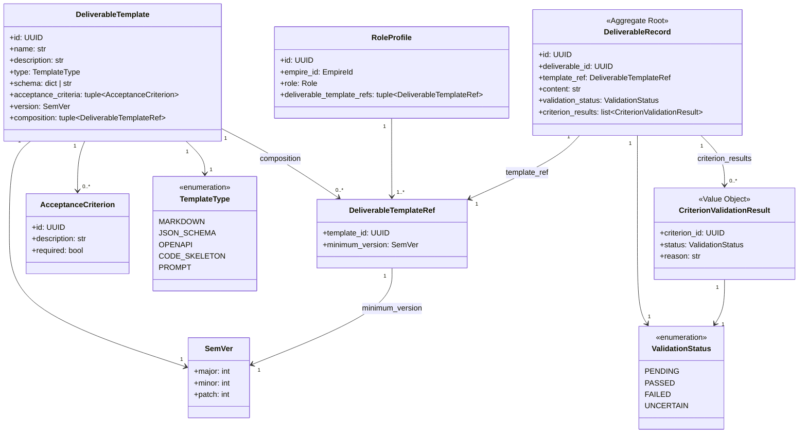

# 業務仕様書（feature-spec）— DeliverableTemplate

> feature: `deliverable-template`（業務概念単位）
> sub-features: [`domain/`](domain/) | `repository/`（Issue #119） | `http-api/`（Issue #122） | `ai-validation/`（Issue #123） | `template-library/`（Issue #124）
> 関連 Issue: [#107 feat(deliverable-template): DeliverableTemplate feature](https://github.com/bakufu-dev/bakufu/issues/107) / [#115 feat(deliverable-template-domain): DeliverableTemplate domain Aggregate (107-A)](https://github.com/bakufu-dev/bakufu/issues/115) / [#116 feat(role-profile): RoleProfile (107-B)](https://github.com/bakufu-dev/bakufu/issues/116) / [#117 feat(stage-required-deliverables): Stage.required_deliverables (107-C)](https://github.com/bakufu-dev/bakufu/issues/117) / [#118 feat(json-schema-validation): JSON Schema validation (107-D)](https://github.com/bakufu-dev/bakufu/issues/118) / [#119 feat(deliverable-template-repository): Repository (107-E)](https://github.com/bakufu-dev/bakufu/issues/119) / [#120 feat(room-matching): Room matching (107-F)](https://github.com/bakufu-dev/bakufu/issues/120) / [#121 feat(external-review-gate-integration): ExternalReviewGate integration (107-G)](https://github.com/bakufu-dev/bakufu/issues/121) / [#122 feat(deliverable-template-http-api): HTTP API (107-H)](https://github.com/bakufu-dev/bakufu/issues/122) / [#123 feat(ai-validation): AI validation (107-I)](https://github.com/bakufu-dev/bakufu/issues/123) / [#124 feat(template-library): Template library (107-J)](https://github.com/bakufu-dev/bakufu/issues/124) / [#125 feat(e2e-tests): E2E tests (107-K)](https://github.com/bakufu-dev/bakufu/issues/125)
> 凍結済み設計: [`docs/design/domain-model/aggregates.md`](../../design/domain-model/aggregates.md) §DeliverableTemplate / §RoleProfile / [`docs/design/domain-model/value-objects.md`](../../design/domain-model/value-objects.md) §SemVer / §DeliverableTemplateRef / §AcceptanceCriterion / [`docs/design/domain-model/value-objects.md`](../../design/domain-model/value-objects.md) §列挙型一覧（TemplateType）

## 本書の役割

本書は **DeliverableTemplate という業務概念全体の業務仕様** を凍結する。bakufu 全体の要求分析（[`docs/analysis/`](../../analysis/)）を DeliverableTemplate という業務概念で具体化し、ペルソナ（個人開発者 CEO）から見て **観察可能な業務ふるまい** を実装レイヤー（domain / repository / http-api / ai-validation / template-library）に依存せず定義する。V モデル正規工程では **要件定義（業務）** 相当（システムテスト ↔ [`system-test-design.md`](system-test-design.md)）。

各 sub-feature（[`domain/`](domain/) / `repository/` / `http-api/` 等）は本書を **業務根拠の真実源** として参照する。各 sub-feature は本書の業務ルール R1-X を実装方針 §確定 A〜Z として展開し、本書には逆流させない（本書の更新は別 PR で先行する）。

**書くこと**:
- ペルソナ（CEO）が DeliverableTemplate / RoleProfile という業務概念で達成できるようになる行為（ユースケース）
- 業務ルール（不変条件・SemVer 互換性・循環参照禁止・JSON Schema 検証・RoleProfile 1:1 制約・composition 合成・エラー2行構造、すべての sub-feature を貫く凍結）
- E2E で観察可能な事象としての受入基準（業務概念全体）
- sub-feature 間の責務分離マップ（実装レイヤー対応）

**書かないこと**（sub-feature の設計書へ追い出す）:
- 採用技術スタック（Pydantic / SQLAlchemy / jsonschema 等） → sub-feature の `basic-design.md`
- 実装方式の比較・選定議論（検証タイミング・TypeDecorator 等） → sub-feature の `detailed-design.md`
- 内部 API 形・メソッド名・属性名・型 → sub-feature の `basic-design.md` / `detailed-design.md`
- sub-feature 内のテスト戦略（IT / UT） → sub-feature の `test-design.md`（E2E のみ親 [`system-test-design.md`](system-test-design.md) で扱う）
- pyright / ruff / カバレッジ等の CI 品質基準 → §10 開発者品質基準 / sub-feature の `test-design.md §カバレッジ基準`

## 1. この feature の位置付け

bakufu MVP 拡張要件「AI 協業における成果物の品質基準を、テンプレートとして定義・再利用できる」を Aggregate モデルで実現する。Stage が完了条件として参照する成果物定義を **独立 Aggregate Root**（DeliverableTemplate / RoleProfile）として管理し、Room・Stage・ExternalReviewGate の各 Aggregate が参照できるようにする。

DeliverableTemplate の業務的なライフサイクルは複数の実装レイヤーを跨ぐ:

| レイヤー | sub-feature | Issue | 業務観点での役割 |
|---|---|---|---|
| domain | [`domain/`](domain/) | #115, #116 | DeliverableTemplate / RoleProfile Aggregate の不変条件・SemVer 管理・composition 合成・JSON Schema 検証を Aggregate 内で保証 |
| domain（Stage 統合） | — | #117 | Stage.deliverable_template（廃止）→ Stage.required_deliverables（DeliverableTemplateRef のリスト）への移行（別 Issue で実施） |
| domain（JSON Schema） | — | #118 | TemplateType=JSON_SCHEMA / OPENAPI 時の schema フィールド Fail Fast 検証 |
| repository | `repository/` | #119 | テンプレート / RoleProfile の状態を再起動跨ぎで保持（永続化） |
| room-matching | — | #120 | Room 作成時に DeliverableTemplateRef をスナップショット取込み（SemVer 固定） |
| external-review-gate 統合 | — | #121 | Gate の AcceptanceCriteria 評価に DeliverableTemplate を活用 |
| http-api | `http-api/` | #122 | CEO が DeliverableTemplate / RoleProfile を CRUD できる HTTP エンドポイント |
| ai-validation | `ai-validation/` | #123 | AI が AcceptanceCriterion を自動評価し PASS / FAIL を判定 |
| template-library | `template-library/` | #124 | 組織共通テンプレートの初期セット提供（バンドル） |
| e2e | — | #125 | 全 sub-feature 横断の E2E テスト |

本書はこれら全レイヤーを貫く **業務概念単位の凍結文書** であり、各 sub-feature は本書を引用して実装契約を凍結する。

### ドメインモデル概観

## 2. 人間の要求

> Issue #107（feat: deliverable-template feature）:
>
> bakufu において AI Agent が生成する成果物（Deliverable）の **品質基準・形式・受入条件** を、再利用可能なテンプレートとして定義・管理できるようにする。テンプレートは MARKDOWN / JSON_SCHEMA / OPENAPI / CODE_SKELETON / PROMPT の 5 種類の形式をサポートし、それぞれ対応する検証ルールを持つ。テンプレートはセマンティックバージョニング（SemVer）で管理され、MAJOR 変更は後方互換性を破壊する。RoleProfile は Role（StrEnum 値）に対して DeliverableTemplate のリストを関連付ける。Stage は required_deliverables として DeliverableTemplateRef のリストを持ち、完了条件とする。ExternalReviewGate は Gate 生成時の AcceptanceCriteria を snapshot として取込み、AI または人間が評価する。

## 3. 背景・痛点

### 現状の痛点

1. **成果物の品質基準が定義できない**: 現行の Stage は `deliverable_template: str`（単純な文字列フィールド）のみを持つ。形式・構造・受入条件を Aggregate として表現する手段がなく、AI Agent が何を生成すべきかを機械可読な形で伝えられない。
2. **Role ごとの期待成果物が暗黙化している**: CEO が「このロールはこういう成果物を出す」という知識を持っていても、システムに記録されていないため、Room 作成のたびに手動で同じ設定を繰り返す必要がある。
3. **テンプレートのバージョン管理がない**: テンプレート定義を更新すると過去の Room に影響が出うる。SemVer 管理と Room 作成時スナップショット取込みがないと、テンプレート改定のたびに稼働中の Room が破損するリスクがある。
4. **複合テンプレートを段階的に定義できない**: 「API ドキュメント + コードスケルトン」のように複数テンプレートを合成して新テンプレートを定義したいが、現行では不可能。単一形式のテンプレートしか表現できない。
5. **AcceptanceCriterion が機械可読でない**: ExternalReviewGate の審査基準が自然言語のみで記述されており、AI による自動評価（PASS / FAIL 判定）ができない。

### 解決されれば変わること

- `feature/deliverable-template-repository`（Issue #119）が Aggregate VO 構造を真実源として SQLite 配線可能になる
- Stage.required_deliverables（Issue #117）が DeliverableTemplateRef のリストを保持し、Room 作成時にバージョン固定スナップショットとして取込まれる
- ExternalReviewGate（Issue #121）が Gate 生成時に AcceptanceCriteria を snapshot として取込み、AI または CEO が評価できる経路が成立する
- RoleProfile（Issue #116）により Role ごとの期待成果物リストを事前定義し、Room 作成時の自動適用が可能になる
- AI 自動評価（Issue #123）が AcceptanceCriterion 単位で PASS / FAIL を判定し、CEO レビュー前に品質チェックが自動化される

### ビジネス価値

- bakufu の核心思想「AI 協業による品質向上」を、**機械可読な品質基準（AcceptanceCriterion）** として Aggregate 単位で表現する。CEO が明示した受入条件を AI が自動評価し、人間レビューのスループットを向上させる。
- **テンプレートの再利用**: 組織共通の成果物定義をテンプレートライブラリとしてバンドルし、プロジェクト間で一貫した品質基準を適用できる。
- **SemVer 管理による安全な進化**: テンプレートを更新しても過去の Room の品質基準は変わらない。MAJOR 変更（後方互換性破壊）は明示的にバージョンを上げる必要があるため、意図せぬ破壊的変更を防止できる。

## 4. ペルソナ

| ペルソナ名 | 役割 | 観察主体 | 達成したいゴール |
|-----------|------|---------|---------------|
| 個人開発者 CEO（堀川さん想定） | DeliverableTemplate / RoleProfile を定義・管理 | GitHub / Docker / CLI 日常使用 | テンプレートを定義し、Room 作成時に自動適用して、AI Agent の成果物品質を安定させる |
| 後続 Issue 担当（バックエンド開発者） | `feature/deliverable-template-repository`（Issue #119）/ Stage 統合（Issue #117）等の実装者 | DDD 経験あり | 設計書を素直に実装するだけ、Aggregate 境界違反を犯さない |
| 監査担当（CEO 自身が兼務） | RoleProfile / テンプレートバージョン履歴を確認 | CLI / SQL 操作可能 | どのバージョンのテンプレートで Room を作成したかを追跡 |

bakufu システム全体のペルソナは [`docs/analysis/personas.md`](../../analysis/personas.md) を参照。

##### ペルソナ別ジャーニー（個人開発者 CEO）

1. **テンプレート定義**: CEO が DeliverableTemplate を作成（type / schema / AcceptanceCriterion / SemVer 付き）。必要なら複数テンプレートを composition で合成し複合テンプレートを作成。
2. **RoleProfile 定義**: CEO が Role（例: ENGINEER）に対して DeliverableTemplateRef のリストを設定。Room 作成時に当該 Role のエージェントが参照する成果物テンプレートが確定する。
3. **Room 作成・SemVer 固定**: CEO が Room を作成すると、Stage.required_deliverables の DeliverableTemplateRef に記録された minimum_version に基づき、テンプレートのスナップショットが取込まれる。以降のテンプレート更新は当該 Room に影響しない。
4. **AI 自動評価**: Agent が成果物を生成すると、AcceptanceCriterion に対する AI 評価が実行され PASS / FAIL が記録される。required=true の基準で FAIL があれば CEO にエスカレーション。
5. **CEO レビュー**: ExternalReviewGate で CEO が成果物を確認。snapshot に取込まれた AcceptanceCriteria と AI 評価結果を参照し、approve / reject を判断する。

## 5. ユースケース

| UC ID | ペルソナ | ユーザーストーリー | 優先度 | 主担当 sub-feature |
|-------|---------|-----------------|-------|------|
| UC-DT-001 | CEO | DeliverableTemplate を定義できる（type / schema / AcceptanceCriterion / SemVer 付き） | 必須 | domain（#115） |
| UC-DT-002 | CEO | 既存テンプレートに新バージョンを作成できる（SemVer 管理、MAJOR 変更で後方互換性を明示的に破壊） | 必須 | domain（#115） |
| UC-DT-003 | CEO | 複数テンプレートを合成（composition）して複合テンプレートを作成できる（AcceptanceCriteria が union される） | 必須 | domain（#115） |
| UC-DT-004 | CEO | RoleProfile を定義できる（Role StrEnum 値 × DeliverableTemplateRef のリスト）。同一 Role に対して RoleProfile は 1 件のみ存在できる | 必須 | domain（#116） |
| UC-DT-005 | CEO | DeliverableTemplate / RoleProfile の定義がアプリ再起動を跨いで保持される（永続化） | 必須 | repository（#119） |

## 6. スコープ

### In Scope

- DeliverableTemplate 業務概念全体で観察可能な業務ふるまい（UC-DT-001〜005）
- RoleProfile の定義・1:1 制約の保証
- SemVer 管理・composition 合成・循環参照防止の業務ルール
- JSON Schema 形式の Fail Fast 検証（TemplateType=JSON_SCHEMA / OPENAPI 時）
- ふるまいの呼び出し失敗時に観察される拒否シグナル（業務ルール違反）
- Stage.required_deliverables への統合（Issue #117、別 Issue で実施）
- Room 作成時の DeliverableTemplateRef スナップショット取込み（Issue #120）
- ExternalReviewGate への AcceptanceCriteria 取込み統合（Issue #121）
- 業務概念単位の E2E 検証戦略 → [`system-test-design.md`](system-test-design.md)

### Out of Scope（参照）

- DeliverableTemplate / RoleProfile HTTP API → `http-api/` sub-feature（Issue #122）
- AI による AcceptanceCriterion 自動評価 → `ai-validation/` sub-feature（Issue #123）
- 組織共通テンプレートライブラリのバンドル → `template-library/` sub-feature（Issue #124）
- CEO レビュー UI → 将来の `deliverable-template/ui/` sub-feature（未起票）
- application 層 `DeliverableTemplateService` の実装 → 後続 Issue（未起票）
- `stage_id` / `room_id` の参照整合性検証 → application 層の責務
- DeliverableRecord（Stage 完了成果物）の実装 → 後続 Issue（未起票）

## 7. 業務ルールの確定（要求としての凍結）

### 確定 R1-A: SemVer 管理と後方互換性凍結

DeliverableTemplate は SemVer（major.minor.patch）でバージョン管理される。MAJOR 変更（major が増加するバージョンアップ）は後方互換性を破壊する変更であることを宣言する。

| 凍結項目 | 内容 |
|---|---|
| **(1) Room 作成時スナップショット固定** | Room 作成時に DeliverableTemplateRef（template_id + minimum_version）として記録されたテンプレートのバージョンは固定される。以降にテンプレートが更新されても、当該 Room の Stage.required_deliverables が参照するテンプレート定義は変わらない |
| **(2) MAJOR 変更の明示性** | major が増加するバージョンアップは後方互換性を破壊することを明示する（例: 1.x.x → 2.0.0）。既存の Room が minimum_version=1.x.x を参照している場合、2.0.0 へは自動更新されない |
| **(3) minimum_version の解釈** | DeliverableTemplateRef.minimum_version は「この minimum_version 以上の同 MAJOR 系列のバージョンを受け入れる」と解釈する。別 MAJOR のテンプレートは受け入れない |

### 確定 R1-B: composition 内の循環参照禁止（DAG 制約）

DeliverableTemplate の composition フィールドに指定する DeliverableTemplateRef は、当該 DeliverableTemplate 自身を参照してはならない（直接循環）。また推移的な循環参照（A → B → A）も禁止される。composition の参照グラフは DAG（有向非循環グラフ）でなければならない。

Aggregate 構築時に DAG 検証を行い、循環が検出された場合は Fail Fast でエラーを返す。application 層が全テンプレートグラフを展開して検証する責務を持つ（推移的循環は domain 単体では検出できないため）。

### 確定 R1-C: JSON Schema 形式の Fail Fast 検証

TemplateType が JSON_SCHEMA または OPENAPI の場合、schema フィールドは有効な JSON Schema 形式でなければならない。Aggregate 構築時（DeliverableTemplate 生成・更新時）に schema の構文検証を行い、無効な場合は Fail Fast でエラーを返す（後工程まで無効な schema が伝播することを防ぐ）。

TemplateType が MARKDOWN / CODE_SKELETON / PROMPT の場合、schema フィールドは文字列（自然言語によるガイドライン・プロンプト文字列）であり、形式検証は行わない。

### 確定 R1-D: RoleProfile の 1:1 制約（1 Role に 1 件のみ）

1 つの Role（StrEnum 値）に対して RoleProfile は 1 件のみ存在できる。同一の Role 値を持つ RoleProfile を 2 件以上作成しようとした場合は業務エラーとして拒否される。制約の検証は application 層（Repository 問合せ後）で行う。domain 層は Role 値の一意性を宣言し、application 層がリポジトリを参照して一意性を保証する。

### 確定 R1-G: AI 検証（ai-validation）の判定規則（Issue #123 で凍結）

DeliverableRecord は DeliverableTemplate に紐づく AcceptanceCriteria を LLM が評価した結果を保持する。全 AcceptanceCriterion の評価が終了後、以下のルールで `validation_status` を決定する（**D-1 / D-3 設計決定確定**）:

| 判定条件 | validation_status |
|---|---|
| `required=true` の基準が 1 件でも `FAILED` | `FAILED` |
| `required=true` の基準に `UNCERTAIN` があり `FAILED` がない | `UNCERTAIN` |
| `required=true` の基準が全て `PASSED`（または criteria が空）| `PASSED` |
| 評価未実施 | `PENDING` |

`required=false` の基準の FAIL / UNCERTAIN は `validation_status` に影響しない（参考情報として `criterion_results` に記録）。

判定結果 `UNCERTAIN` および `FAILED` の場合は、呼び出し元 ApplicationService（Task 完了フロー等）が ExternalReviewGate を生成して CEO レビューにエスカレーションする責務を持つ（ValidationService 自体は Gate を生成しない — 責務分離）。

### 確定 R1-E: RoleProfile による AcceptanceCriteria の union

`RoleProfile.get_all_acceptance_criteria` が `deliverable_template_refs` の各参照先テンプレートの AcceptanceCriteria を union して受入条件セットを返す。DeliverableTemplate.compose は **composition（構造参照）のみを設定するふるまいであり、AcceptanceCriteria は引き継がない**（§確定B）。

| 凍結項目 | 内容 |
|---|---|
| **(1) union の責務** | AcceptanceCriteria の union は `RoleProfile.get_all_acceptance_criteria` の責務。compose ふるまいは composition フィールドを更新するのみで AcceptanceCriteria を合成しない |
| **(2) union の順序** | `deliverable_template_refs` リストの順序に従い、先頭から順に AcceptanceCriteria を収集する。同一 id が複数テンプレートに存在する場合は最初に出現したものを保持し、重複は黙って除外する（エラーにしない） |
| **(3) required の優先** | `required=True` の AcceptanceCriterion を先頭グループ、`required=False` の基準を後続グループに配置して返す。各グループ内の順序は走査順を保持する |

### 確定 R1-F: エラーメッセージは 2 行構造（`[FAIL] 失敗事実` + `Next: 行動`）

全業務ルール違反エラーは「失敗事実（1 行目）+ 次に何をすべきか（2 行目）」の 2 行構造で提供する（room §確定 I / external-review-gate §確定 R1-G 踏襲）。

例:
- 1 行目: `[FAIL] DeliverableTemplate の composition に循環参照が検出されました（A → B → A）。`
- 2 行目: `Next: composition フィールドから循環を引き起こす DeliverableTemplateRef を除去してください。`

## 8. 制約・前提

| 区分 | 内容 |
|-----|------|
| 既存運用規約 | GitFlow / Conventional Commits（[`CONTRIBUTING.md`](../../../CONTRIBUTING.md)） |
| ライセンス | MIT |
| 対象 OS | Windows 10 21H2+ / macOS 12+ / Linux glibc 2.35+ |
| ネットワーク | 該当なし — DeliverableTemplate / RoleProfile 業務概念は外部通信を持たない（ai-validation sub-feature は外部 LLM API を呼ぶが、本書のスコープ外） |
| 依存 feature（domain 開始時点） | empire / workflow / agent / room / directive / task / external-review-gate M1 マージ済み |
| 依存 feature（repository 開始時点） | domain M1（#115, #116）マージ済み / [`feature/persistence-foundation`](../persistence-foundation/) マージ済み |
| Role StrEnum の据え置き | 設計決定①案 A として確定。Role は既存の StrEnum を据え置き、新規 Aggregate（RoleProfile）を追加することでインパクトを最小化する |
| Stage.deliverable_template 廃止 | 設計決定②として確定。Stage.deliverable_template フィールドは廃止し Stage.required_deliverables（DeliverableTemplateRef のリスト）に統合する。別 Issue #117 で実施。本書は廃止後の状態を業務仕様として記述する |
| 命名規約の凍結 | `DeliverableTemplate`（テンプレ定義 Aggregate）/ `DeliverableRecord`（Stage 完了成果物、別 Issue）の命名は設計決定③として確定 |

実装技術スタック（Python 3.12 / Pydantic v2 / SQLAlchemy 2.x async / Alembic / jsonschema / pyright strict / pytest）は各 sub-feature の `basic-design.md §依存関係` に集約する。

## 9. 受入基準（観察可能な事象）

| # | 基準 | 紐付く UC | 検証方法 |
|---|------|---------|---------|
| 1 | CEO が有効な DeliverableTemplate を生成でき、type / schema / AcceptanceCriterion / SemVer が付与された状態で取得できる | UC-DT-001 | TC-UT-DT-001（[`domain/test-design.md`](domain/test-design.md)） |
| 2 | TemplateType=MARKDOWN / CODE_SKELETON / PROMPT の場合、schema フィールドに任意の文字列を設定でき、形式検証なしで受理される | UC-DT-001 | TC-UT-DT-002 |
| 3 | TemplateType=JSON_SCHEMA または OPENAPI の場合、schema フィールドに有効な JSON Schema を設定すると受理される。無効な JSON Schema を設定すると Aggregate 構築時に Fail Fast でエラーが返される（業務ルール R1-C） | UC-DT-001 | TC-UT-DT-003, TC-UT-DT-004 |
| 4 | CEO が既存テンプレートに新バージョン（SemVer）を作成できる。major の増加はそれ以前のバージョンと後方互換性がないことを表す（業務ルール R1-A） | UC-DT-002 | TC-UT-DT-005, TC-UT-DT-006 |
| 5 | composition に自分自身の template_id を含む DeliverableTemplate を作成しようとすると、Aggregate 構築時に Fail Fast でエラーが返される（直接循環禁止、業務ルール R1-B） | UC-DT-003 | TC-UT-DT-007 |
| 6 | composition に複数の有効な DeliverableTemplateRef を設定した複合テンプレートを作成できる。compose ふるまいは composition（構造参照）のみを設定し AcceptanceCriteria は引き継がない（§確定B）。RoleProfile.get_all_acceptance_criteria が composition メンバーの AcceptanceCriteria を union して返す（業務ルール R1-E） | UC-DT-003 | TC-UT-DT-023（compose 正常系）/ TC-UT-DT-025（§確定B: criteria 非継承を物理確認）/ TC-UT-RP-010〜012（get_all_acceptance_criteria の union / dedup / ordering を物理確認）|
| 7 | RoleProfile.get_all_acceptance_criteria の union で同一 id の AcceptanceCriterion が複数の参照先テンプレートに存在する場合、最初に出現したものを保持して重複は除外する（エラーにしない、業務ルール R1-E (2)） | UC-DT-004 | TC-UT-RP-011 |
| 8 | RoleProfile.get_all_acceptance_criteria の結果は required=True の AcceptanceCriterion を先頭に、required=False の基準を後続に配置する（業務ルール R1-E (3)） | UC-DT-004 | TC-UT-RP-012 |
| 9 | CEO が RoleProfile を定義できる（Role StrEnum 値 × DeliverableTemplateRef のリスト付き）。同一 Role 値を持つ RoleProfile が既に存在する場合は作成が拒否される（業務ルール R1-D） | UC-DT-004 | TC-UT-DT-012, TC-UT-DT-013 |
| 10 | 既存 RoleProfile の deliverable_template_refs を更新できる（DeliverableTemplateRef の追加・削除） | UC-DT-004 | TC-UT-DT-014 |
| 11 | AcceptanceCriterion の required=true の基準が全て PASS である DeliverableTemplate 評価結果は合格とみなされ、required=false の基準は FAIL でも合格とみなされる | UC-DT-001〜003 | TC-UT-DT-015 |
| 12 | 業務ルール違反のエラーメッセージには `[FAIL]` 行（失敗事実）と `Next:` 行（次の行動）の 2 行構造が含まれる（業務ルール R1-F） | UC-DT-001〜004 | TC-UT-DT-016〜020 |
| 13 | DeliverableTemplateRef.minimum_version に指定した SemVer より大きいバージョンの同 MAJOR 系列テンプレートは「参照可能」と判定される。異なる MAJOR 系列のテンプレートは「参照不可」と判定される（業務ルール R1-A (3)） | UC-DT-002 | TC-UT-DT-021, TC-UT-DT-022 |
| 14 | DeliverableTemplate / RoleProfile の状態がアプリ再起動を跨いで永続化される（Aggregate 内容・AcceptanceCriteria・composition が再起動後に構造的等価で復元、業務ルール R1-A (1)） | UC-DT-005 | TC-E2E-DT-001（[`system-test-design.md`](system-test-design.md)） |
| 15 | composition を持つ DeliverableTemplate を永続化し、再起動後に復元した場合、composition メンバーへの参照（template_id + minimum_version）が保全されており、union 後の AcceptanceCriteria が再起動前と構造的等価である | UC-DT-005 | TC-E2E-DT-002 |
| 16 | Agent が成果物を生成した後、ValidationService が DeliverableRecord を生成し、AcceptanceCriterion 単位で LLM 評価が実行される。各 criterion の結果（PASSED / FAILED / UNCERTAIN）が `criterion_results` に記録される（業務ルール R1-G） | UC-DT-001〜003 | TC-UT-AIVM-001〜（[`ai-validation/test-design.md`](ai-validation/test-design.md)）|
| 17 | `required=true` の AcceptanceCriterion が 1 件でも FAILED の場合、DeliverableRecord.validation_status が FAILED になる。required=true の基準に UNCERTAIN があり FAILED がない場合は UNCERTAIN。全必須基準が PASSED なら PASSED（業務ルール R1-G） | UC-DT-001〜003 | TC-UT-AIVM-002（status 導出ロジック全パターン）|

E2E（受入基準 14〜15）は [`system-test-design.md`](system-test-design.md) で詳細凍結。受入基準 1〜13 は domain sub-feature の IT / UT で検証（[`domain/test-design.md`](domain/test-design.md)）。

**注**: 推移的な循環参照検証（R1-B の推移的循環禁止）は、domain 単体では全グラフが不可視なため application 層が責務を持つ。domain 層は直接循環（自己参照）のみを Fail Fast で検証する。

## 10. 開発者品質基準（CI 担保、業務要求ではない）

各 sub-feature の `basic-design.md §モジュール契約` / `test-design.md §カバレッジ基準` で個別に管理する。本書では業務要求のみ凍結。

参考: domain は `domain/deliverable_template/` / `domain/role_profile/` カバレッジ 95% 以上、repository は実装ファイル群で 90% 以上を目標としているが、これは sub-feature 側の凍結事項。pyright strict pass / ruff 警告ゼロも sub-feature 側で保証する。

## 11. 開放論点 (Open Questions)

| # | 論点 | 現在の状態 | 担当 sub-feature |
|---|------|-----------|----------------|
| OQ-2 | DeliverableRecord（Stage 完了成果物 Aggregate）の設計・命名は本 feature に含めるか別 Issue か | 設計決定③として命名のみ凍結（DeliverableRecord）。実装 Issue は別途起票予定 | 未起票 |
| OQ-3 | ~~ai-validation（Issue #123）の PASS / FAIL 判定結果を DeliverableTemplate / AcceptanceCriterion に書き込むか、別 Aggregate（DeliverableRecord 等）に保持するか~~ **【確定】** DeliverableRecord は DeliverableTemplate / AcceptanceCriterion とは独立した新規 Aggregate Root（設計決定③の延長）。PASS / FAIL / UNCERTAIN 結果は `DeliverableRecord.criterion_results: tuple[CriterionValidationResult, ...]` に保持し、DeliverableTemplate / AcceptanceCriterion は変更しない。理由: DeliverableTemplate は不変な「定義」であり、実行時の評価結果で汚染すべきでない（DDD: 定義とインスタンスの分離）。評価結果は DeliverableRecord という独立した運用エンティティが保持する（Issue #123 ai-validation sub-feature で実装） | **確定済み**（Issue #123 設計 D-1）|
| OQ-4 | template-library（Issue #124）のバンドルテンプレートを DB seed として提供するか、アプリ起動時の自動生成として提供するか | 未決定。template-library sub-feature の設計で確定する | template-library（#124） |

## 12. sub-feature 一覧とマイルストーン

| sub-feature | Issue | マイルストーン | 依存 sub-feature | 主な業務観点 |
|---|---|---|---|---|
| 107-A: DeliverableTemplate domain | #115 | M1 | — | DeliverableTemplate Aggregate・SemVer・AcceptanceCriterion・composition・Fail Fast 検証 |
| 107-B: RoleProfile | #116 | M1 | #115 | RoleProfile Aggregate・Role 1:1 制約・DeliverableTemplateRef |
| 107-C: Stage.required_deliverables | #117 | M1 | #115 | Stage.deliverable_template 廃止・required_deliverables への移行 |
| 107-D: JSON Schema validation | #118 | M1 | #115 | TemplateType=JSON_SCHEMA / OPENAPI 時の schema 検証強化 |
| 107-E: Repository | #119 | M2 | #115, #116, persistence-foundation | DeliverableTemplate / RoleProfile 永続化（SQLite） |
| 107-F: Room matching | #120 | M2 | #119 | Room 作成時の DeliverableTemplateRef スナップショット取込み・SemVer 固定 |
| 107-G: ExternalReviewGate 統合 | #121 | M2 | #119, external-review-gate | Gate 生成時の AcceptanceCriteria snapshot 取込み |
| 107-H: HTTP API | #122 | M3 | #119 | DeliverableTemplate / RoleProfile CRUD エンドポイント |
| 107-I: AI validation | #123 | M3 | #119 | AcceptanceCriterion の AI 自動評価（PASS / FAIL） |
| 107-J: Template library | #124 | M3 | #119 | 組織共通テンプレートのバンドル提供 |
| 107-K: E2E tests | #125 | M3 | #115〜#124 全件 | 全 sub-feature 横断 E2E テスト |

## 13. 扱うデータと機密レベル

| 区分 | 内容 | 機密レベル |
|-----|------|----------|
| DeliverableTemplate.id | UUID 識別子 | 低 |
| DeliverableTemplate.name / description | テンプレート名・説明（自然言語） | 低 |
| DeliverableTemplate.type | TemplateType 列挙値（MARKDOWN 等） | 低 |
| DeliverableTemplate.schema | JSON Schema 定義 または ガイドライン文字列 | 低（CEO が意図的に記述する品質基準。secret 混入リスクは低と判断） |
| DeliverableTemplate.acceptance_criteria | AcceptanceCriterion のリスト（UUID + 自然言語 + required フラグ） | 低（同上） |
| DeliverableTemplate.version | SemVer（major.minor.patch） | 低 |
| DeliverableTemplate.composition | DeliverableTemplateRef のリスト（template_id + minimum_version） | 低 |
| RoleProfile.id | UUID 識別子 | 低 |
| RoleProfile.role | Role StrEnum 値 | 低 |
| RoleProfile.deliverable_template_refs | DeliverableTemplateRef のリスト | 低 |
| 永続化テーブル | `deliverable_templates` / `acceptance_criteria` / `deliverable_template_compositions` / `role_profiles` / `role_profile_template_refs` | 低〜中（schema フィールドの内容に依存。現時点で masking 対象なし） |

**注**: DeliverableTemplate.schema / acceptance_criteria.description は CEO が意図的に記述する品質基準であり、secret の混入リスクは低と判断する（機密レベル「低」）。masking 対象の追加が必要と判断された場合は別 Issue で対応する。

## 14. 非機能要求

| 区分 | 要求 |
|-----|------|
| パフォーマンス | 不変条件検査（composition DAG 検証 / AcceptanceCriteria union）は O(N × M)（N = composition 深さ、M = 各テンプレートの AcceptanceCriteria 件数）。実用的な規模（composition 深さ ≤ 5、AcceptanceCriteria ≤ 50 件）で 1ms 未満を目標とする。永続化層 50ms 未満を目標 |
| 可用性 | 永続化層の WAL モード + crash safety（[`feature/persistence-foundation`](../persistence-foundation/) 担保）により、書き込み中のクラッシュでも Aggregate 状態が破損しない |
| 保守性 | pyright strict pass / ruff 警告ゼロ / カバレッジ domain 95% 以上 / repository 90% 以上（各 sub-feature の `test-design.md §カバレッジ基準` で管理） |
| 可搬性 | 純 Python のみ（domain 層）。OS / ファイルシステム依存なし（SQLite はクロスプラットフォーム）。JSON Schema 検証ライブラリは jsonschema または同等品を sub-feature の `basic-design.md §依存関係` で選定 |
| セキュリティ | DeliverableTemplate.schema に組織内部の品質基準が含まれる場合があるため、HTTP API レスポンスは認証済み CEO のみがアクセスできる設計とする（http-api sub-feature の責務）。現時点で masking 対象フィールドなし（§13 参照） |
| 拡張性 | TemplateType 列挙値の追加は MINOR バージョンアップで対応可能な設計とする。新たな TemplateType 追加時に既存 DeliverableTemplate の動作を破壊しないこと |
