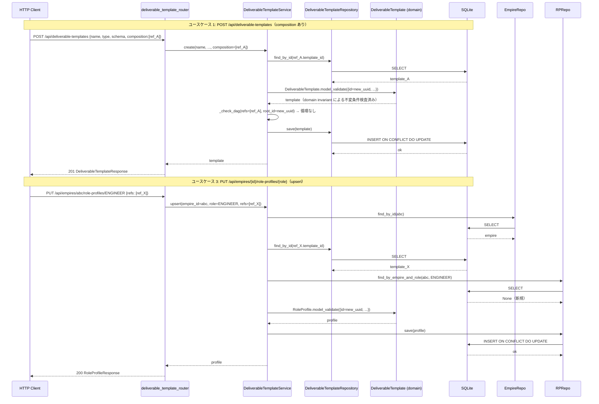
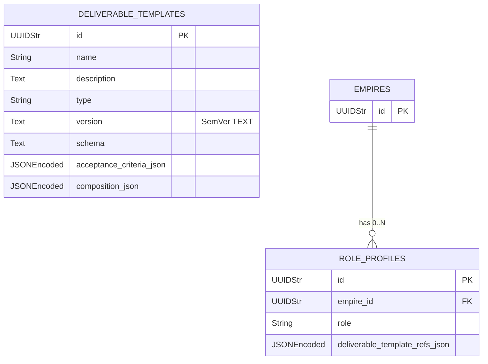

# 基本設計書 — deliverable-template / http-api

> feature: `deliverable-template` / sub-feature: `http-api`
> 親業務仕様: [`../feature-spec.md`](../feature-spec.md) §5 UC-DT-001〜005 / §7 業務ルール R1-A〜F / §9 受入基準
> 関連: [`../domain/basic-design.md`](../domain/basic-design.md) / [`../repository/basic-design.md`](../repository/basic-design.md) / [`../../http-api-foundation/http-api/basic-design.md`](../../http-api-foundation/http-api/basic-design.md)
> 凍結済み設計参照: [`docs/design/architecture.md §interfaces レイヤー詳細`](../../../design/architecture.md) / [`docs/design/threat-model.md`](../../../design/threat-model.md)

## 記述ルール（必ず守ること）

基本設計に**疑似コード・サンプル実装（python/ts/sh/yaml 等の言語コードブロック）を書かない**。
ソースコードと二重管理になりメンテナンスコストしか生まない。
必要なのは構造契約（クラス・モジュール・データの関係）であり、実装の細部は [detailed-design.md](detailed-design.md) で凍結する。

## §モジュール契約（機能要件）

本 sub-feature が提供するモジュールの入出力契約を凍結する。各 REQ は親 [`../feature-spec.md §5`](../feature-spec.md) ユースケース UC-DT-NNN と対応する（孤児要件を作らない）。

### REQ-DT-HTTP-001: DeliverableTemplate 作成（POST /api/deliverable-templates）

| 項目 | 内容 |
|-----|-----|
| 入力 | `DeliverableTemplateCreate`（name 1〜80文字 / description 0〜500文字 / type TemplateType / schema dict\|str / acceptance_criteria list[AcceptanceCriterionCreate] / version SemVerCreate(optional, default 0.1.0) / composition list[DeliverableTemplateRefCreate](optional, default [])） |
| 処理 | `DeliverableTemplateService.create()` → ①各 composition ref の template_id が実在することを `DeliverableTemplateRepository.find_by_id` で確認 → ②`DeliverableTemplate.model_validate({...})` で Aggregate 構築（domain invariant による自己参照チェック・不変条件 R1-A〜C 検査が先行）→ ③composition の推移的 DAG 走査を `_check_dag` で検出（application 層責務、R1-B。自己参照は domain invariant が ②で先行検出するため、③では推移的循環・深度超過・ノード超過のみを担当）→ `async with session.begin():` `DeliverableTemplateRepository.save(template)` |
| 出力 | HTTP 201, `DeliverableTemplateResponse` |
| エラー時 | ref template 不在 → `DeliverableTemplateNotFoundError`（MSG-DT-HTTP-002, 422, kind="composition_ref"）/ 自己参照（MSG-DT-002, domain raises: model_validate ②で先行検出）→ 422 / DAG 推移的循環・深度超過・ノード超過 → `CompositionCycleError`（MSG-DT-HTTP-003a/003b/003c, 422）/ schema 形式不正（MSG-DT-001, domain raises）→ 422 / Pydantic 形式違反 → 422 |
| 親 spec 参照 | UC-DT-001, UC-DT-003 |

### REQ-DT-HTTP-002: DeliverableTemplate 一覧取得（GET /api/deliverable-templates）

| 項目 | 内容 |
|-----|-----|
| 入力 | なし（クエリパラメータなし） |
| 処理 | `DeliverableTemplateService.find_all()` → `DeliverableTemplateRepository.find_all()` で全件取得（**ORDER BY name ASC**、アルファベット昇順で返却。同一 name は id ASC でさらにソート） |
| 出力 | HTTP 200, `DeliverableTemplateListResponse`（空リストも 200） |
| エラー時 | 該当なし |
| 親 spec 参照 | UC-DT-001 |

### REQ-DT-HTTP-003: DeliverableTemplate 単件取得（GET /api/deliverable-templates/{template_id}）

| 項目 | 内容 |
|-----|-----|
| 入力 | パスパラメータ `template_id: str`（UUID v4 形式） |
| 処理 | `DeliverableTemplateService.find_by_id(template_id)` → `DeliverableTemplateRepository.find_by_id(template_id)` → None なら `DeliverableTemplateNotFoundError` raise |
| 出力 | HTTP 200, `DeliverableTemplateResponse` |
| エラー時 | 不在 → `DeliverableTemplateNotFoundError`（MSG-DT-HTTP-001, 404）/ UUID 形式不正 → Pydantic 422 |
| 親 spec 参照 | UC-DT-001 |

### REQ-DT-HTTP-004: DeliverableTemplate 更新（PUT /api/deliverable-templates/{template_id}）

| 項目 | 内容 |
|-----|-----|
| 入力 | パスパラメータ `template_id: str` + `DeliverableTemplateUpdate`（name / description / type / schema / acceptance_criteria / version / composition 全フィールド必須） |
| 処理 | `DeliverableTemplateService.update(template_id, ...)` → ①`find_by_id` で現状取得（不在なら 404）→ ②提供 version が現バージョン未満の場合は拒否（§確定 B、MSG-DT-HTTP-004, 422）→ ③version が現バージョン超の場合は `template.create_new_version(new_version)` で新インスタンス生成、同一の場合は `model_validate` で直接再構築 → ④composition の DAG 走査と各 ref 存在確認 → ⑤`async with session.begin():` `save(updated_template)` |
| 出力 | HTTP 200, 更新済み `DeliverableTemplateResponse` |
| エラー時 | 不在 → 404（MSG-DT-HTTP-001, kind="primary"）/ version 降格 → 422（MSG-DT-HTTP-004）/ version_not_greater（MSG-DT-003, domain raises）→ 422 / composition 循環・上限超過 → 422（MSG-DT-HTTP-003a/003b/003c）/ ref 不在 → 422（MSG-DT-HTTP-002, kind="composition_ref"）|
| 親 spec 参照 | UC-DT-002, UC-DT-003 |

### REQ-DT-HTTP-005: DeliverableTemplate 削除（DELETE /api/deliverable-templates/{template_id}）

| 項目 | 内容 |
|-----|-----|
| 入力 | パスパラメータ `template_id: str` |
| 処理 | `DeliverableTemplateService.delete(template_id)` → `find_by_id` で存在確認（不在なら 404）→ `async with session.begin():` `DeliverableTemplateRepository.delete(template_id)` |
| 出力 | HTTP 204 No Content |
| エラー時 | 不在 → `DeliverableTemplateNotFoundError`（MSG-DT-HTTP-001, 404） |
| 親 spec 参照 | UC-DT-001 |

**dangling ref 設計判断（確定）**: 削除前に「他テンプレートの composition や RoleProfile の deliverable_template_refs から被参照されているか」を確認する被参照チェックは **MVP スコープ外**（YAGNI）とする。`composition_json` / `deliverable_template_refs_json` は JSON 格納で FK 制約がないため、削除後に dangling ref が残存しうる。dangling ref は参照解決時（Room 作成 / ExternalReviewGate 取込み等）に application 層が「参照先テンプレートが見つからない」エラーとして検出する責務を持つ（将来 Issue で被参照チェック API を追加予定）。MVP では削除リクエストへのブロックなし・204 返却を**設計として明示的に選択**する。

### REQ-RP-HTTP-001: RoleProfile 一覧取得（GET /api/empires/{empire_id}/role-profiles）

| 項目 | 内容 |
|-----|-----|
| 入力 | パスパラメータ `empire_id: str`（UUID v4 形式） |
| 処理 | `RoleProfileService.find_all_by_empire(empire_id)` → `EmpireRepository.find_by_id(empire_id)` で Empire 存在確認（不在なら 404）→ `RoleProfileRepository.find_all_by_empire(empire_id)` |
| 出力 | HTTP 200, `RoleProfileListResponse`（空リストも 200） |
| エラー時 | Empire 不在 → `EmpireNotFoundError`（MSG-RP-HTTP-003, 404） |
| 親 spec 参照 | UC-DT-004 |

### REQ-RP-HTTP-002: RoleProfile 単件取得（GET /api/empires/{empire_id}/role-profiles/{role}）

| 項目 | 内容 |
|-----|-----|
| 入力 | パスパラメータ `empire_id: str` + `role: str`（Role StrEnum 値） |
| 処理 | `RoleProfileService.find_by_empire_and_role(empire_id, role)` → `RoleProfileRepository.find_by_empire_and_role(empire_id, role)` → None なら `RoleProfileNotFoundError` |
| 出力 | HTTP 200, `RoleProfileResponse` |
| エラー時 | 不在 → `RoleProfileNotFoundError`（MSG-RP-HTTP-001, 404）/ role 不正値 → Pydantic 422 |
| 親 spec 参照 | UC-DT-004 |

### REQ-RP-HTTP-003: RoleProfile upsert（PUT /api/empires/{empire_id}/role-profiles/{role}）

| 項目 | 内容 |
|-----|-----|
| 入力 | パスパラメータ `empire_id: str` + `role: str`（Role StrEnum 値）+ `RoleProfileUpsertRequest`（deliverable_template_refs: list[DeliverableTemplateRefCreate]） |
| 処理 | `RoleProfileService.upsert(empire_id, role, refs)` → ①`EmpireRepository.find_by_id(empire_id)` で Empire 存在確認（不在なら 404）→ ②各 ref の template_id が実在することを `DeliverableTemplateRepository.find_by_id` で確認（不在なら 422）→ ③`RoleProfileRepository.find_by_empire_and_role(empire_id, role)` で既存確認 → ④既存あり: 既存 id を保持し `RoleProfile.model_validate({...全 refs 置換...})` で再構築、なし: `RoleProfile(id=uuid4(), ...)` 新規構築 → ⑤`async with session.begin():` `RoleProfileRepository.save(profile)`（§確定 C、R1-D） |
| 出力 | HTTP 200, `RoleProfileResponse` |
| エラー時 | Empire 不在 → 404（MSG-RP-HTTP-003）/ ref template 不在 → 422（MSG-RP-HTTP-002, kind="role_profile_ref"）/ role 不正値 → Pydantic 422 / `RoleProfileInvariantViolation`（重複 ref 等）→ 422 |
| 親 spec 参照 | UC-DT-004 |

### REQ-RP-HTTP-004: RoleProfile 削除（DELETE /api/empires/{empire_id}/role-profiles/{role}）

| 項目 | 内容 |
|-----|-----|
| 入力 | パスパラメータ `empire_id: str` + `role: str` |
| 処理 | `RoleProfileService.delete(empire_id, role)` → `find_by_empire_and_role` で存在確認（不在なら 404）→ `async with session.begin():` `RoleProfileRepository.delete(profile.id)` |
| 出力 | HTTP 204 No Content |
| エラー時 | 不在 → `RoleProfileNotFoundError`（MSG-RP-HTTP-001, 404） |
| 親 spec 参照 | UC-DT-004 |

## モジュール構成

| 機能 ID | モジュール | ディレクトリ | 責務 |
|--------|----------|------------|------|
| REQ-DT-HTTP-001〜005 | `DeliverableTemplateService` | `backend/src/bakufu/application/services/deliverable_template_service.py` | DeliverableTemplate CRUD + DAG 検査（新規） |
| REQ-RP-HTTP-001〜004 | `RoleProfileService` | `backend/src/bakufu/application/services/role_profile_service.py` | RoleProfile upsert / delete + 参照整合性確認（新規） |
| 横断 | `DeliverableTemplateNotFoundError` / `RoleProfileNotFoundError` / `CompositionCycleError` | `backend/src/bakufu/application/exceptions/deliverable_template_exceptions.py` | application 層例外型（新規） |
| REQ-DT-HTTP-001〜005 | `DeliverableTemplateRepository` Protocol 拡張 | `backend/src/bakufu/application/ports/deliverable_template_repository.py`（既存追記） | `delete(id: DeliverableTemplateId) → None` メソッド追加 |
| REQ-RP-HTTP-004 | `RoleProfileRepository` Protocol 拡張 | `backend/src/bakufu/application/ports/role_profile_repository.py`（既存追記） | `delete(id: RoleProfileId) → None` メソッド追加 |
| REQ-DT-HTTP-001〜005 | `deliverable_template_router` | `backend/src/bakufu/interfaces/http/routers/deliverable_template.py` | DeliverableTemplate CRUD エンドポイント（5本、新規） |
| REQ-RP-HTTP-001〜004 | `role_profile_router` | `backend/src/bakufu/interfaces/http/routers/role_profile.py` | RoleProfile empire-scoped エンドポイント（4本、新規） |
| 横断 | `DeliverableTemplateSchemas` | `backend/src/bakufu/interfaces/http/schemas/deliverable_template.py` | Pydantic v2 リクエスト / レスポンスモデル（新規） |
| 横断 | `RoleProfileSchemas` | `backend/src/bakufu/interfaces/http/schemas/role_profile.py` | Pydantic v2 リクエスト / レスポンスモデル（新規） |
| 横断 | `dependencies.py` 拡張 | `backend/src/bakufu/interfaces/http/dependencies.py`（既存追記） | `get_deliverable_template_service` / `get_role_profile_service` DI ファクトリ追加 |
| 横断 | `error_handlers.py` 拡張 | `backend/src/bakufu/interfaces/http/error_handlers.py`（既存追記） | `DeliverableTemplateNotFoundError`（`kind` 属性で分岐: `"primary"`→404 / `"composition_ref"` / `"role_profile_ref"`→422）/ `RoleProfileNotFoundError`（404）/ `CompositionCycleError`（422）→ `ErrorResponse` ハンドラ追加 |
| REQ-DT-HTTP-005 | `SqliteDeliverableTemplateRepository` 拡張 | `backend/src/bakufu/infrastructure/persistence/sqlite/repositories/deliverable_template_repository.py`（既存追記） | `delete(id)` 実装追加 |
| REQ-RP-HTTP-004 | `SqliteRoleProfileRepository` 拡張 | `backend/src/bakufu/infrastructure/persistence/sqlite/repositories/role_profile_repository.py`（既存追記） | `delete(id)` 実装追加 |
| REQ-RP-HTTP-001, 003 | `EmpireRepository` Protocol（既存）| `backend/src/bakufu/application/ports/empire_repository.py`（既存参照のみ、変更なし）| `RoleProfileService` が Empire 存在確認に使用（`find_by_id` のみ）|
| 横断 | `ErrorDetail` Schema 拡張 | `backend/src/bakufu/interfaces/http/schemas/common.py`（既存追記）| `detail: dict[str, object] \| None = None` フィールド追加（§確定 G、既存ハンドラへの影響なし）|

```
本 sub-feature で追加・変更されるファイル:

backend/
├── src/bakufu/
│   ├── application/
│   │   ├── exceptions/
│   │   │   └── deliverable_template_exceptions.py  # 新規: 3 例外型
│   │   ├── ports/
│   │   │   ├── deliverable_template_repository.py  # 既存追記: delete() 追加
│   │   │   └── role_profile_repository.py          # 既存追記: delete() 追加
│   │   └── services/
│   │       ├── deliverable_template_service.py     # 新規: DeliverableTemplateService
│   │       └── role_profile_service.py             # 新規: RoleProfileService
│   ├── infrastructure/persistence/sqlite/
│   │   └── repositories/
│   │       ├── deliverable_template_repository.py  # 既存追記: delete() 実装追加
│   │       └── role_profile_repository.py          # 既存追記: delete() 実装追加
│   └── interfaces/http/
│       ├── dependencies.py                         # 既存追記: 2 DI ファクトリ追加
│       ├── error_handlers.py                       # 既存追記: 3 ハンドラ追加
│       ├── routers/
│       │   ├── deliverable_template.py             # 新規: 5 エンドポイント
│       │   └── role_profile.py                     # 新規: 4 エンドポイント
│       └── schemas/
│           ├── deliverable_template.py             # 新規
│           └── role_profile.py                     # 新規
└── tests/
    └── integration/                                # 既存パターン: tests/integration/test_*_http_api/
        ├── test_deliverable_template_http_api/     # 新規（test_agent_http_api 等と同一階層）
        │   ├── __init__.py
        │   ├── conftest.py                         # ASGITransport + session_factory 直接注入（tests/integration/conftest.py 共通フィクスチャ引き継ぎ）
        │   ├── test_create.py
        │   ├── test_read.py
        │   ├── test_update.py
        │   └── test_delete.py
        └── test_role_profile_http_api/             # 新規（同一階層）
            ├── __init__.py
            ├── conftest.py
            ├── test_upsert.py
            └── test_read_delete.py
```

## クラス設計（概要）

```mermaid
classDiagram
    class DeliverableTemplateRouter {
        <<FastAPI APIRouter>>
        +POST /api/deliverable-templates
        +GET /api/deliverable-templates
        +GET /api/deliverable-templates/{id}
        +PUT /api/deliverable-templates/{id}
        +DELETE /api/deliverable-templates/{id}
    }
    class RoleProfileRouter {
        <<FastAPI APIRouter>>
        +GET /api/empires/{empire_id}/role-profiles
        +GET /api/empires/{empire_id}/role-profiles/{role}
        +PUT /api/empires/{empire_id}/role-profiles/{role}
        +DELETE /api/empires/{empire_id}/role-profiles/{role}
    }
    class DeliverableTemplateService {
        -_dt_repo: DeliverableTemplateRepository
        +create(name, description, type, schema, acceptance_criteria, version, composition) DeliverableTemplate
        +find_all() list~DeliverableTemplate~
        +find_by_id(id) DeliverableTemplate
        +update(id, name, description, type, schema, acceptance_criteria, version, composition) DeliverableTemplate
        +delete(id) None
        -_check_dag(refs, root_id) None
    }
    class RoleProfileService {
        -_rp_repo: RoleProfileRepository
        -_dt_repo: DeliverableTemplateRepository
        -_empire_repo: EmpireRepository
        +find_all_by_empire(empire_id) list~RoleProfile~
        +find_by_empire_and_role(empire_id, role) RoleProfile
        +upsert(empire_id, role, refs) RoleProfile
        +delete(empire_id, role) None
    }
    class DeliverableTemplateRepository {
        <<Protocol>>
        +find_by_id(id) DeliverableTemplate | None
        +find_all() list~DeliverableTemplate~
        +save(template) None
        +delete(id) None
    }
    class RoleProfileRepository {
        <<Protocol>>
        +find_by_empire_and_role(empire_id, role) RoleProfile | None
        +find_all_by_empire(empire_id) list~RoleProfile~
        +save(role_profile) None
        +delete(id) None
    }
    class DeliverableTemplateCreate {
        <<Pydantic BaseModel>>
        +name: str
        +description: str
        +type: TemplateType
        +schema: dict or str
        +acceptance_criteria: list
        +version: SemVerCreate
        +composition: list
    }
    class DeliverableTemplateResponse {
        <<Pydantic BaseModel>>
        +id: str
        +name: str
        +description: str
        +type: str
        +schema: dict or str
        +acceptance_criteria: list
        +version: SemVerResponse
        +composition: list
    }
    class RoleProfileUpsertRequest {
        <<Pydantic BaseModel>>
        +deliverable_template_refs: list
    }
    class RoleProfileResponse {
        <<Pydantic BaseModel>>
        +id: str
        +empire_id: str
        +role: str
        +deliverable_template_refs: list
    }

    DeliverableTemplateRouter --> DeliverableTemplateService : uses (DI)
    RoleProfileRouter --> RoleProfileService : uses (DI)
    DeliverableTemplateService --> DeliverableTemplateRepository : uses (Port)
    RoleProfileService --> RoleProfileRepository : uses (Port)
    RoleProfileService --> DeliverableTemplateRepository : uses (参照整合性確認)
    RoleProfileService --> EmpireRepository : uses (Empire 存在確認)
    DeliverableTemplateRouter ..> DeliverableTemplateCreate : deserializes
    DeliverableTemplateRouter ..> DeliverableTemplateResponse : serializes
    RoleProfileRouter ..> RoleProfileUpsertRequest : deserializes
    RoleProfileRouter ..> RoleProfileResponse : serializes
```

**凝集のポイント**:

- `DeliverableTemplateService` / `RoleProfileService` は application 層。Router 内に業務ロジックを書かない（http-api-foundation 規律）
- Router 内に `try/except` を書かない。例外は `error_handlers.py` の専用ハンドラが HTTP ステータスに変換
- DAG 走査（推移的循環参照検出）は `DeliverableTemplateService._check_dag()` に閉じる。domain Aggregate は直接自己参照のみ担保
- RoleProfile の 1:1 制約（R1-D）は PUT を upsert 設計にすることで自然に保証。DB の `UNIQUE(empire_id, role)` が最終防衛線
- `delete()` は両 Repository Protocol に新規追加。SQLite 実装（`DELETE WHERE id = :id`）も本 PR で追記

## 依存関係

| 区分 | 依存 | バージョン方針 | 備考 |
|---|---|---|---|
| ランタイム | Python 3.12+ | pyproject.toml | 既存 |
| HTTP フレームワーク | FastAPI / Pydantic v2 / httpx | pyproject.toml | http-api-foundation で確定済み |
| DI パターン | `get_session()` / `SessionDep` | http-api-foundation 確定E | `dependencies.py` に 2 DI ファクトリ追記 |
| domain | `DeliverableTemplate` / `RoleProfile` / `DeliverableTemplateId` / `RoleProfileId` / `SemVer` / `DeliverableTemplateRef` / `AcceptanceCriterion` / `TemplateType` / `DeliverableTemplateInvariantViolation` / `RoleProfileInvariantViolation` | PR #127 実装済み | domain sub-feature |
| repository | `DeliverableTemplateRepository` Protocol / `RoleProfileRepository` Protocol / `SqliteDeliverableTemplateRepository` / `SqliteRoleProfileRepository` | PR #134 実装済み | repository sub-feature |
| empire | `EmpireRepository` Protocol / `SqliteEmpireRepository` | 既存 M2 確定 | Empire 存在確認用（RoleProfileService 依存） |
| 基盤 | http-api-foundation（ErrorResponse / lifespan / CSRF / CORS / generic_exception_handler）| M3-A 確定 | 全 error handler / app.state.session_factory 引き継ぎ |

## 処理フロー

### ユースケース 1: DeliverableTemplate 作成（POST /api/deliverable-templates）

1. Router が `DeliverableTemplateCreate` を Pydantic でデシリアライズ（422 on 失敗）
2. `get_deliverable_template_service()` DI で `DeliverableTemplateService` を取得
3. `DeliverableTemplateService.create(name, description, type, schema, acceptance_criteria, version, composition)` 呼び出し
4. composition の各 ref.template_id について `DeliverableTemplateRepository.find_by_id` で存在確認（MSG-DT-HTTP-002）
5. `DeliverableTemplate.model_validate({id: uuid4(), ...})` で Aggregate 構築（domain invariant による自己参照検出・不変条件検査が先行）
6. `_check_dag(refs, root_id)` で推移的循環参照を DFS + 経路スタックで検出（MSG-DT-HTTP-003。`root_id` は新規生成 uuid を渡す。詳細は [detailed-design.md §確定 D](detailed-design.md)）
7. `async with session.begin():` `DeliverableTemplateRepository.save(template)`
8. HTTP 201, `DeliverableTemplateResponse` を返す

### ユースケース 2: DeliverableTemplate 更新（PUT /api/deliverable-templates/{id}）

1. `DeliverableTemplateService.find_by_id(template_id)` → None なら `DeliverableTemplateNotFoundError` → 404
2. 提供 version < 現 version: `DeliverableTemplateVersionDowngradeError`（MSG-DT-HTTP-004）→ 422
3. 全フィールドで `model_validate({id: existing_id, ...all_new_values})` にて新インスタンス生成（domain invariant による version_not_greater・自己参照・不変条件検査が先行）
4. composition の DAG 走査と各 ref 存在確認（`_check_dag` で推移的循環・深度超過・ノード超過を DFS + 経路スタックで検出）
5. `async with session.begin():` `DeliverableTemplateRepository.save(updated_template)`
6. HTTP 200, 更新済み `DeliverableTemplateResponse`

### ユースケース 3: RoleProfile upsert（PUT /api/empires/{empire_id}/role-profiles/{role}）

1. `EmpireRepository.find_by_id(empire_id)` → None なら `EmpireNotFoundError` → 404
2. 各 ref.template_id について `DeliverableTemplateRepository.find_by_id` で存在確認（MSG-RP-HTTP-002）
3. `RoleProfileRepository.find_by_empire_and_role(empire_id, role)` で既存確認
4. 既存あり: 既存 id を保持して `RoleProfile.model_validate({id: existing.id, empire_id, role, deliverable_template_refs: new_refs})` で再構築
5. 既存なし: `RoleProfile.model_validate({id: uuid4(), empire_id, role, deliverable_template_refs: new_refs})` で新規構築
6. `async with session.begin():` `RoleProfileRepository.save(profile)`（UPSERT で 1:1 制約を DB レベルでも保証）
7. HTTP 200, `RoleProfileResponse`

### ユースケース 4: DeliverableTemplate 削除（DELETE）

1. `find_by_id` → None なら 404
2. `async with session.begin():` `DeliverableTemplateRepository.delete(template_id)`
3. HTTP 204 No Content

### ユースケース 5: RoleProfile 削除（DELETE /api/empires/{empire_id}/role-profiles/{role}）

1. `find_by_empire_and_role(empire_id, role)` → None なら 404
2. `async with session.begin():` `RoleProfileRepository.delete(profile.id)`
3. HTTP 204 No Content

## シーケンス図



## アーキテクチャへの影響

- **`docs/design/architecture.md`**: 変更なし（http-api-foundation で `routers/` 配置は明示済み）
- **`docs/design/tech-stack.md`**: 変更なし
- **`../repository/basic-design.md`**: `DeliverableTemplateRepository` / `RoleProfileRepository` に `delete()` メソッドを追加する。本 PR のアーキテクチャ上の追加であり、同一 PR 内で repository 設計書も更新する
- 既存 feature への波及: `dependencies.py` / `error_handlers.py` への追記は既存ハンドラを変更しない。`empire_service.py` 等への変更なし。`EmpireRepository` は既存の Protocol を読み取り専用で使用（`find_by_id` のみ）

## 外部連携

該当なし — 理由: interfaces/http 層内に閉じる。外部システムへの HTTP リクエストは発生しない。ai-validation（Issue #123）との連携は別 sub-feature の責務。

| 連携先 | 目的 | プロトコル | 認証 | タイムアウト / リトライ |
|-------|------|----------|-----|---------------------|
| 該当なし | — | — | — | — |

## UX 設計

| シナリオ | 期待される挙動 |
|---------|------------|
| テンプレートが 0 件で GET /api/deliverable-templates | `{"items": [], "total": 0}` を返す（エラーではない）|
| 存在しない template_id で GET /api/deliverable-templates/{id} | `{"error": {"code": "not_found", ...}}` で 404 |
| composition に自分自身の id を指定して POST | domain が `composition_self_ref` を detect → 422（MSG-DT-002）|
| 推移的循環参照（A→B→A）を含む composition で POST | service の DAG 走査が検出 → 422（MSG-DT-HTTP-003a）|
| 存在しない empire_id で GET role-profiles | `EmpireNotFoundError` → 404（MSG-RP-HTTP-003）|
| 同一 role で 2 回 PUT role-profiles | 2 回目も 200 で返す（upsert、冪等性保証）|

**アクセシビリティ方針**: 該当なし（HTTP API のため）。

## セキュリティ設計

### 脅威モデル

詳細な信頼境界は [`docs/design/threat-model.md`](../../../design/threat-model.md)。本 feature 範囲では以下の脅威を扱う。

| 想定攻撃者 | 攻撃経路 | 保護資産 | 対策 |
|-----------|---------|---------|------|
| **T1: CSRF 経由での DeliverableTemplate 改ざん** | ブラウザ経由の不正 POST / PUT / DELETE | テンプレート定義の整合性 | http-api-foundation 確定D: CSRF Origin 検証ミドルウェア（Origin 不一致なら 403）|
| **T2: UUID パスインジェクション** | `template_id` / `empire_id` に不正値を注入 | DB 整合性 | Pydantic の `UUID` 型強制（422 on 不正形式）+ SQLAlchemy ORM バインドパラメータ（SQL injection 防止）|
| **T3: スタックトレース露出** | 500 エラーレスポンスへの内部情報混入 | 内部実装情報 | http-api-foundation の `generic_exception_handler` が `internal_error` のみ返す |
| **T4: schema フィールド経由の任意 JSON 注入** | type=JSON_SCHEMA 時に巨大な schema を送信してメモリ枯渇誘発 | サービス可用性 | Request body サイズ上限（http-api-foundation 確定済み）。schema フィールドの内容検証は domain 不変条件（R1-C）に委譲 |
| **T5: composition DAG 爆発（DoS）** | 多段 composition を持つテンプレート群を作成し DAG 走査で CPU 消費 | サービス可用性 | `_check_dag` に最大深度 / 最大ノード数ガード（§確定 D）|

### OWASP Top 10 対応

| # | カテゴリ | 対応状況 |
|---|---------|---------|
| A01 | Broken Access Control | loopback バインド（`127.0.0.1:8000`）+ CSRF Origin 検証（http-api-foundation 確定D）|
| A02 | Cryptographic Failures | feature-spec §13 が全カラムを機密レベル「低」と判断。masking 対象なし（repository sub-feature 確定済み） |
| A03 | Injection | SQLAlchemy ORM 経由（raw SQL 不使用）+ Pydantic UUID 型強制 |
| A04 | Insecure Design | domain の frozen Aggregate（pre-validate）で不整合状態を防止。application Service が業務ルール検査を統括 |
| A05 | Security Misconfiguration | http-api-foundation の lifespan / CORS 設定を引き継ぐ |
| A06 | Vulnerable Components | 依存 CVE は CI `pip-audit` で監視（http-api-foundation 確定済み） |
| A07 | Auth Failures | MVP 設計上 意図的な認証なし（loopback バインドで代替）|
| A08 | Data Integrity Failures | domain frozen Aggregate + Repository UPSERT + DB UNIQUE 制約（R1-D）の多重防衛 |
| A09 | Logging Failures | **操作監査**: MVP は loopback バインドで認証なし（個人開発 CEO 1 人が使用）のため操作者の特定が不可能。操作 audit log（誰が・いつ・何を変更したか）は **MVP スコープ外**とする。将来の認証実装時に Service 層で audit log テーブルへの書き込みを追加する（別 Issue）。スタックトレースはレスポンスに含めない（T3 対策）。`ErrorResponse.detail` に機密情報を含めない（feature-spec §13 の業務判断、機密レベル「低」）|
| A10 | SSRF | 該当なし（外部 URL fetch なし） |

## ER 図

該当なし — 理由: 本 sub-feature は新規テーブルを追加しない。`deliverable_templates` / `role_profiles` は repository sub-feature（PR #134）で既に作成済み。`delete()` は `DELETE WHERE id = :id` のみで参照するテーブルを変更しない。



**masking 対象カラム**: なし（repository sub-feature §REQ-DTR-006 CI 三層防衛で物理保証済み）

## エラーハンドリング方針

| 例外種別 | 発生箇所 | 処理方針 | HTTP ステータス |
|---------|---------|---------|---------------|
| `DeliverableTemplateNotFoundError` | `DeliverableTemplateService`（find_by_id / ref 確認時）/ `RoleProfileService`（ref 確認時）| `error_handlers.py` 専用ハンドラが `kind` を参照: `"primary"`→404 / `"composition_ref"` / `"role_profile_ref"`→422 | 404 or 422（`kind` 依存）|
| `RoleProfileNotFoundError` | `RoleProfileService`（find_by_empire_and_role 結果 None 時）| 専用ハンドラ → 404 | 404 |
| `EmpireNotFoundError`（既存）| `RoleProfileService`（empire 存在確認 None 時）| 既存 empire ハンドラ → 404 | 404 |
| `CompositionCycleError` | `DeliverableTemplateService._check_dag()`（推移的循環検出）| 専用ハンドラ → 422 | 422 |
| `DeliverableTemplateVersionDowngradeError` | `DeliverableTemplateService.update()`（version 降格検出）| 専用ハンドラ → 422 | 422 |
| `DeliverableTemplateInvariantViolation` | domain `DeliverableTemplate`（不変条件違反）| 専用ハンドラ → 422 | 422 |
| `RoleProfileInvariantViolation` | domain `RoleProfile`（不変条件違反）| 専用ハンドラ → 422 | 422 |
| `RequestValidationError` | FastAPI Pydantic（入力形式不正）| http-api-foundation の既存ハンドラ | 422 |
| その他例外 | どこでも | http-api-foundation の `generic_exception_handler` | 500（スタックトレース非露出）|

Router 内に `try/except` は書かない（http-api-foundation 規律）。

## MSG 一覧（ID のみ、確定文言は detailed-design.md で凍結）

| ID | 種別 | 概要 | HTTP ステータス | 例外型 |
|----|------|------|---------------|-------|
| MSG-DT-HTTP-001 | エラー（不在）| DeliverableTemplate が見つからない | 404 | `DeliverableTemplateNotFoundError` |
| MSG-DT-HTTP-002 | エラー（参照不在）| composition ref の template が存在しない | 422 | `DeliverableTemplateNotFoundError` |
| MSG-DT-HTTP-003a | エラー（DAG 循環: 推移的）| composition に推移的循環参照が検出された（reason=transitive_cycle）| 422 | `CompositionCycleError` |
| MSG-DT-HTTP-003b | エラー（DAG 上限: 深度）| composition 参照深度が上限（10）を超えた（reason=depth_limit）| 422 | `CompositionCycleError` |
| MSG-DT-HTTP-003c | エラー（DAG 上限: ノード数）| composition 参照ノード数が上限（100）を超えた（reason=node_limit）| 422 | `CompositionCycleError` |
| MSG-DT-HTTP-004 | エラー（version 降格）| PUT 提供 version が現 version 未満 | 422 | `DeliverableTemplateVersionDowngradeError` |
| MSG-RP-HTTP-001 | エラー（不在）| RoleProfile が見つからない | 404 | `RoleProfileNotFoundError` |
| MSG-RP-HTTP-002 | エラー（参照不在）| deliverable_template_refs の template が存在しない | 422 | `DeliverableTemplateNotFoundError` |
| MSG-RP-HTTP-003 | エラー（Empire 不在）| Empire が見つからない | 404 | `EmpireNotFoundError`（既存） |
