# 詳細設計書 — deliverable-template / http-api

> feature: `deliverable-template` / sub-feature: `http-api`
> 親業務仕様: [`../feature-spec.md`](../feature-spec.md) §7 業務ルール R1-A〜F / §9 受入基準
> 関連: [`basic-design.md`](basic-design.md) / [`../domain/detailed-design.md`](../domain/detailed-design.md) / [`../repository/detailed-design.md`](../repository/detailed-design.md)

## 本書の役割

本書は **階層 3: deliverable-template / http-api の詳細設計** を凍結する。[`basic-design.md`](basic-design.md) で凍結したモジュール構造・REQ 契約を、実装直前の **構造契約・確定文言・リクエスト/レスポンス型** として詳細化する。実装 PR は本書を改変せず参照する。設計変更が必要なら本書を先に更新する PR を立てる。

## 記述ルール（必ず守ること）

詳細設計に **疑似コード・サンプル実装（python/ts/sh/yaml 等の言語コードブロック）を書かない**。
必要なのは「構造契約（属性名・型・制約）」と「確定文言（メッセージ文字列）」と「実装の意図（なぜこの API 形になるか）」のみ。

## クラス設計（詳細）

```mermaid
classDiagram
    class DeliverableTemplateService {
        -_dt_repo: DeliverableTemplateRepository
        +create(name: str, description: str, type: TemplateType, schema: dict | str, acceptance_criteria: tuple~AcceptanceCriterion~, version: SemVer, composition: tuple~DeliverableTemplateRef~) DeliverableTemplate
        +find_all() list~DeliverableTemplate~
        +find_by_id(id: DeliverableTemplateId) DeliverableTemplate
        +update(id: DeliverableTemplateId, name: str, description: str, type: TemplateType, schema: dict|str, acceptance_criteria: tuple~AcceptanceCriterion~, version: SemVer, composition: tuple~DeliverableTemplateRef~) DeliverableTemplate
        +delete(id: DeliverableTemplateId) None
        -_check_dag(refs: tuple~DeliverableTemplateRef~, root_id: DeliverableTemplateId) None
    }
    class RoleProfileService {
        -_rp_repo: RoleProfileRepository
        -_dt_repo: DeliverableTemplateRepository
        -_empire_repo: EmpireRepository
        +find_all_by_empire(empire_id: EmpireId) list~RoleProfile~
        +find_by_empire_and_role(empire_id: EmpireId, role: Role) RoleProfile
        +upsert(empire_id: EmpireId, role: Role, refs: tuple~DeliverableTemplateRef~) RoleProfile
        +delete(empire_id: EmpireId, role: Role) None
    }
    class DeliverableTemplateNotFoundError {
        +message: str
        +template_id: str | None
        +kind: Literal
    }
    class RoleProfileNotFoundError {
        +message: str
        +empire_id: str
        +role: str
    }
    class CompositionCycleError {
        +message: str
        +reason: Literal
        +cycle_path: list~str~
    }
    class DeliverableTemplateVersionDowngradeError {
        +message: str
        +current_version: str
        +provided_version: str
    }
```

### Service: `DeliverableTemplateService`

| 属性 | 型 | 制約 | 意図 |
|-----|---|------|------|
| `_dt_repo` | `DeliverableTemplateRepository` | コンストラクタで注入 | DI 経由の Repository Port |

**ふるまい**:
- `create(...)`: uuid4() で id を生成し、各 ref の存在確認後 → `model_validate` で Aggregate 構築（domain invariant による自己参照チェック・不変条件が先行検出）→ `_check_dag` で推移的循環・深度超過・ノード超過を検出 → `save`
- `find_by_id(id)`: `_dt_repo.find_by_id(id)` → None なら `DeliverableTemplateNotFoundError(template_id=str(id))` raise
- `update(id, ...)`: find_by_id → version 降格チェック（§確定 B）→ `model_validate` で全フィールド再構築（domain invariant による version_not_greater・自己参照チェック・不変条件が先行検出）→ `_check_dag` で推移的循環・深度超過・ノード超過を検出 → `save`
- `delete(id)`: find_by_id（不在なら 404 相当）→ `_dt_repo.delete(id)`
- `_check_dag(refs, root_id)`: DFS + 経路スタック（ancestor set）で refs を走査。`depth`（現在深度）/ `visited`（全訪問済みノード、再訪問抑制用）/ `path`（現在の探索経路上の祖先集合）は関数内部の局所状態（外部 API シグネチャには露出しない）。depth が §確定 D の上限超で `CompositionCycleError(reason="depth_limit")` raise。訪問ノード数が上限超で `CompositionCycleError(reason="node_limit")` raise。`template_id` が `path`（現在の探索経路上の祖先集合）に含まれる場合は `CompositionCycleError(reason="transitive_cycle")` raise。合法な菱形 DAG（A→B, A→C, B→C のように同一ノードへの複数経路）は `visited` による再訪問スキップで正しく通過する（`visited` と `path` の役割を分離することが正確な循環検出の鍵）

### Service: `RoleProfileService`

| 属性 | 型 | 制約 | 意図 |
|-----|---|------|------|
| `_rp_repo` | `RoleProfileRepository` | コンストラクタで注入 | RoleProfile 永続化 Port |
| `_dt_repo` | `DeliverableTemplateRepository` | コンストラクタで注入 | ref の参照整合性確認 |
| `_empire_repo` | `EmpireRepository` | コンストラクタで注入 | Empire 存在確認 |

**ふるまい**:
- `find_by_empire_and_role(empire_id, role)`: `_rp_repo.find_by_empire_and_role(empire_id, role)` → None なら `RoleProfileNotFoundError(empire_id, role)` raise
- `upsert(empire_id, role, refs)`: empire 確認 → 各 ref 確認 → 既存検索 → id 決定 → `RoleProfile.model_validate({...})` → `save`
- `delete(empire_id, role)`: `find_by_empire_and_role` → `_rp_repo.delete(profile.id)`

### Application Exceptions

| クラス | 属性 | 意図 |
|-------|------|------|
| `DeliverableTemplateNotFoundError` | `message: str` / `template_id: str \| None` / `kind: Literal["primary", "composition_ref", "role_profile_ref"]` | `kind="primary"`: 直接 find_by_id で不在（→404）。`kind="composition_ref"`: composition ref 確認時に不在（→422）。`kind="role_profile_ref"`: RoleProfile ref 確認時に不在（→422）。`error_handlers.py` 専用ハンドラが `kind` を参照して HTTP ステータスを決定する |
| `RoleProfileNotFoundError` | `message: str` / `empire_id: str` / `role: str` | find_by_empire_and_role が None の時に raise |
| `CompositionCycleError` | `message: str` / `reason: Literal["transitive_cycle", "depth_limit", "node_limit"]` / `cycle_path: list[str]` | DAG 走査で推移的循環または上限超過を検出した時に raise。`reason` で原因を型安全に識別。`cycle_path` は `reason="transitive_cycle"` の時のみ UUID 文字列の列（**内部ログ専用**。セキュリティレビューにより HTTP レスポンスには含めない。OWASP A05: クライアントが直接参照していない中間ノード UUID の漏洩を防止）、`reason="depth_limit"` / `"node_limit"` の時は空リスト `[]` |
| `DeliverableTemplateVersionDowngradeError` | `message: str` / `current_version: str` / `provided_version: str` | PUT で提供 version < 現 version の時に raise |

## 確定事項（先送り撤廃）

### 確定 A: Service の DI 配線

`DeliverableTemplateService` は `get_deliverable_template_service(session: SessionDep)` ファクトリで生成する。`SqliteDeliverableTemplateRepository(session)` を渡してコンストラクタで注入。`RoleProfileService` は `get_role_profile_service(session: SessionDep)` で同様に生成し、`SqliteDeliverableTemplateRepository` / `SqliteRoleProfileRepository` / `SqliteEmpireRepository` の 3 Repository を注入する。

Router の依存関数シグネチャ: `service: Annotated[DeliverableTemplateService, Depends(get_deliverable_template_service)]`。

根拠: `dependencies.py` の既存パターン（`get_empire_service` 等）に準拠。

### 確定 B: PUT の version 制約

PUT リクエストで提供された version（SemVer）が現在保存されている version より **小さい**（辞書的比較で (new.major, new.minor, new.patch) < (cur.major, cur.minor, cur.patch)）場合、`DeliverableTemplateVersionDowngradeError` を raise して 422 を返す。現 version と **同一**、または現 version より**大きい**場合は `model_validate({id: existing_id, version: new_version, ...})` で全フィールドを直接再構築する（domain の `version_not_greater` 不変条件は `model_validate` 内で検査される）。

根拠: テンプレート version の意味的整合性保護（業務ルール R1-A）。PUT 体は全フィールド必須（部分更新は PATCH、但し本 MVP では PUT のみ提供）。

### 確定 C: RoleProfile PUT は Upsert 設計（idempotent）

PUT /api/empires/{empire_id}/role-profiles/{role} は冪等な Upsert とする。同一 (empire_id, role) ペアで複数回 PUT しても同一の `id` が保持される（既存 id を引き継いだ `model_validate` 再構築 → `save` → Repository の UPSERT）。`id` は最初の PUT 時に uuid4() で生成し、以降は同一 id を使用する。

根拠: 業務ルール R1-D「同一 Role に 1 件のみ」と REST PUT の冪等性を自然に両立させる設計。DB の `UNIQUE(empire_id, role)` 制約が最終防衛線として機能する。

### 確定 D: `_check_dag` の上限ガード

DAG 走査の **最大深度は 10**、**最大訪問ノード数は 100** とする。上限超過時は `CompositionCycleError` を raise する。`depth` / `visited` / `path` / `node_count` は `_check_dag` 内部の局所状態であり、外部呼び出しシグネチャ `_check_dag(refs, root_id)` には含まれない。

**`node_count` のセマンティクス（確定）**: `node_count` は **ユニークノード数**（`visited` check 後にインクリメント）とする。同一ノードへの複数経路訪問（合法な菱形 DAG でのノード再訪問）はカウントしない。初期値は `1`（root ノードを 1 ノードとしてカウント）。合法な菱形 DAG が実際のユニークノード数 ≤ 100 でも `node_limit` で誤 reject されないよう、`visited` によるスキップ後はインクリメントを行わない。

**`visited` と `path` の役割分離（循環検出の必須条件）**: `visited`（全訪問済みノードの再訪問抑制）と `path`（現在の探索経路上の祖先集合）の役割を分離することが正確な循環検出の設計上の必須条件である。合法な菱形 DAG で `visited` だけを循環判定に使うと同一ノードへの複数経路を誤って循環と判定するため、循環判定は必ず `path` に対して行う。

| 超過種別 | `reason` 値 | `cycle_path` |
|---------|-----------|------------|
| 推移的循環参照検出 | `"transitive_cycle"` | 循環を示す UUID 文字列列 |
| 深度上限（10）超過 | `"depth_limit"` | `[]`（空リスト）|
| ノード数上限（100）超過 | `"node_limit"` | `[]`（空リスト）|

根拠: 悪意ある DoS（T5 脅威）の緩和。実用的なテンプレート合成の深度・規模はこれらの上限に達しない（feature-spec §14 に「composition 深さ ≤ 5」の性能目標あり）。`reason` を型付き `Literal` にすることで消費側コードの分岐を型安全に記述できる（中6指摘対応）。

### 確定 E: `delete()` の Repository Protocol 追加方針

`DeliverableTemplateRepository` / `RoleProfileRepository` 両 Protocol に `async def delete(self, id: ...) -> None` を追加する（本 PR で `application/ports/` の既存ファイルを追記更新）。SQLite 実装（`SqliteDeliverableTemplate/RoleProfileRepository`）も同 PR で追記更新する。実装は `DELETE FROM {table} WHERE id = :id` 1 文。存在しない id を指定した場合は何も起きない（no-op、Service 層で事前確認済み）。

根拠: Service の `delete()` が Repository に delete を委譲する Clean Architecture 規律。Service 内で raw SQL / session を直接操作しない。

### 確定 F: Router 登録先（app.include_router）

`deliverable_template_router` は prefix=`/api` で `app` に登録（他 router と同じパターン）。`role_profile_router` も同様に prefix=`/api` で登録し、エンドポイントパスに `/empires/{empire_id}/role-profiles` を含む。既存 `empire_router` との衝突はない（empire_router は `/empires` CRUD のみ、role-profiles サブリソースは本 PR で追加）。

根拠: http-api-foundation で確定した URL 規則（`/api/{resource}`）への準拠。empire-scoped RoleProfile は REST サブリソースとして自然な設計。

### 確定 G: エラーレスポンスフォーマットと `ErrorDetail` 拡張

本 PR で `backend/src/bakufu/interfaces/http/schemas/common.py` の `ErrorDetail` に **`detail: dict[str, object] | None = None`** フィールドを追加する。現在 `ErrorDetail` は `code: str` / `message: str` のみで `model_config = ConfigDict(extra="forbid")`。`detail` フィールドを追加することで本 feature のエラーが `template_id` / `cycle_path` / `reason` 等の非機密情報を構造的に返せるようになる。

**既存ハンドラへの影響**: `detail` フィールドのデフォルト値は `None` のため、既存の empire / room / agent / task 等のハンドラは `detail` を省略でき、後方互換が保たれる。`extra="forbid"` は維持する（フィールド追加は schema 変更だが既存クライアントへの影響なし）。

エラーレスポンス全体フォーマット: `{"error": {"code": str, "message": str, "detail": dict[str, object] | None}}`

`code` は snake_case の短縮名（例: `not_found` / `composition_cycle` / `version_downgrade`）。`detail` には `reason` 等の構造化情報を含める。`cycle_path`（DAG 走査で検出した中間ノードの UUID 列）は **HTTP レスポンスから除外し内部ログに限定**する（セキュリティレビュー指摘対応、OWASP A05: クライアントが直接参照していない中間ノード UUID の漏洩を防止）。スタックトレースは絶対に含めない（A09 対策）。

## 設計判断の補足

### なぜ RoleProfile の PUT を Upsert にするか

業務ルール R1-D「1 Role に 1 件のみ」と REST の PUT（冪等）を組み合わせると Upsert が最も自然。POST で「作成のみ」にすると既存の RoleProfile 更新時の操作が複雑化する。CEO ユーザーの観点では「ENGINEER 用の refs をこれにする」という PUT 語義が直感的。

### なぜ `delete()` を Service 内で no-op にしないか

`find_by_id` → None → 404 を先行させる（Fail Fast）。DB に存在しない id への DELETE を silently 無視するより、404 で明示的に知らせる方がバグ発見が早い。

### なぜ `resolved` / `versions` エンドポイントを MVP スコープ外にするか

ジェンセン決定（YAGNI）。composition 展開（resolved）は DAG 全走査が必要で実装コストが高い割に MVP では CEO が直接確認できる。バージョン一覧（versions）は同一 name で複数 id が存在する場合の一覧で、現在の Repository 設計（id 基点の UPSERT）では自然にサポートできない。

## ユーザー向けメッセージの確定文言

[`basic-design.md §MSG 一覧`](basic-design.md) で ID のみ定義した MSG を本書で凍結する。

### プレフィックス統一

| プレフィックス | 意味 |
|---|---|
| `[FAIL]` | 処理中止を伴う失敗 |
| `[OK]` | 成功完了 |
| `[WARN]` | 警告（処理は継続） |

### MSG 確定文言表

| ID | code | 出力先 | 文言（1 行目 / 2 行目） |
|----|------|--------|------------------------|
| MSG-DT-HTTP-001 | `not_found` | JSON レスポンス body | `[FAIL] DeliverableTemplate が見つかりません。` / `Next: template_id を確認し、存在するテンプレートを指定してください。` |
| MSG-DT-HTTP-002 | `ref_not_found` | JSON レスポンス body | `[FAIL] composition に指定された DeliverableTemplate が存在しません（id: {template_id}）。` / `Next: 存在するテンプレートの id を指定してください。` |
| MSG-DT-HTTP-003a | `composition_cycle` | JSON レスポンス body | `[FAIL] composition に推移的な循環参照が検出されました。` / `Next: 循環を引き起こす DeliverableTemplateRef を composition から除去してください。` |
| MSG-DT-HTTP-003b | `composition_cycle` | JSON レスポンス body | `[FAIL] composition の参照深度が上限（10）を超えました。` / `Next: composition の参照ネストを減らしてください（上限: depth 10）。` |
| MSG-DT-HTTP-003c | `composition_cycle` | JSON レスポンス body | `[FAIL] composition の参照ノード数が上限（100）を超えました。` / `Next: composition に含まれるテンプレート数を減らしてください（上限: 100 ノード）。` |
| MSG-DT-HTTP-004 | `version_downgrade` | JSON レスポンス body | `[FAIL] 提供 version（{provided_version}）が現在の version（{current_version}）より小さいです。` / `Next: 現在の version 以上の SemVer を指定してください。` |
| MSG-RP-HTTP-001 | `not_found` | JSON レスポンス body | `[FAIL] RoleProfile が見つかりません（empire: {empire_id}, role: {role}）。` / `Next: PUT /api/empires/{empire_id}/role-profiles/{role} で先に作成してください。` |
| MSG-RP-HTTP-002 | `ref_not_found` | JSON レスポンス body | `[FAIL] deliverable_template_refs に指定された DeliverableTemplate が存在しません（id: {template_id}）。` / `Next: 存在するテンプレートの id を指定してください。` |
| MSG-RP-HTTP-003 | `not_found` | JSON レスポンス body | `[FAIL] Empire が見つかりません（id: {empire_id}）。` / `Next: empire_id を確認してください。` |

domain 層の確定文言（MSG-DT-001〜005）は [`../domain/detailed-design.md §MSG 確定文言表`](../domain/detailed-design.md) を参照。本書はそれらを再定義しない（引用のみ）。

## データ構造（リクエスト / レスポンス）

### `SemVerCreate` / `SemVerResponse`

| フィールド | 型 | 必須 | 制約 | 意図 |
|----------|---|------|------|------|
| `major` | `int` | ○ | 0 以上 | SemVer major |
| `minor` | `int` | ○ | 0 以上 | SemVer minor |
| `patch` | `int` | ○ | 0 以上 | SemVer patch |

### `AcceptanceCriterionCreate`

| フィールド | 型 | 必須 | 制約 | 意図 |
|----------|---|------|------|------|
| `id` | `str`（UUID v4）| × | 省略時は uuid4() を自動生成（§確定 H）| AcceptanceCriterion の識別子 |
| `description` | `str` | ○ | 1〜500 文字 | 受入条件の説明文 |
| `required` | `bool` | × | default `true` | 必須判定フラグ |

### `AcceptanceCriterionResponse`

| フィールド | 型 | 意図 |
|----------|---|------|
| `id` | `str`（UUID v4）| AcceptanceCriterion 識別子 |
| `description` | `str` | 受入条件の説明文 |
| `required` | `bool` | 必須判定フラグ |

### `DeliverableTemplateRefCreate`

| フィールド | 型 | 必須 | 制約 | 意図 |
|----------|---|------|------|------|
| `template_id` | `str`（UUID v4）| ○ | — | 参照先 DeliverableTemplate の id |
| `minimum_version` | `SemVerCreate` | ○ | — | 参照可能な最小 SemVer |

### `DeliverableTemplateRefResponse`

| フィールド | 型 | 意図 |
|----------|---|------|
| `template_id` | `str`（UUID v4）| 参照先 DeliverableTemplate の id |
| `minimum_version` | `SemVerResponse` | 参照可能な最小 SemVer |

### `DeliverableTemplateCreate`（POST リクエスト Body）

| フィールド | 型 | 必須 | 制約 | 意図 |
|----------|---|------|------|------|
| `name` | `str` | ○ | 1〜80 文字 | テンプレート名 |
| `description` | `str` | ○ | 0〜500 文字 | テンプレート説明 |
| `type` | `str`（`TemplateType` 値）| ○ | 5 値のいずれか | テンプレート種別 |
| `schema` | `dict \| str` | ○ | type=JSON_SCHEMA/OPENAPI 時は dict、それ以外は str | JSON Schema または自然言語ガイドライン |
| `acceptance_criteria` | `list[AcceptanceCriterionCreate]` | × | default `[]` | 受入基準リスト |
| `version` | `SemVerCreate` | × | default `{"major": 0, "minor": 1, "patch": 0}` | 初期 SemVer |
| `composition` | `list[DeliverableTemplateRefCreate]` | × | default `[]` | 合成参照リスト |

### `DeliverableTemplateUpdate`（PUT リクエスト Body）

`DeliverableTemplateCreate` と同一スキーマ。全フィールド必須（省略なし）。version の省略不可とすることで意図しないデフォルト値適用を防ぐ（§確定 B）。

| フィールド | 型 | 必須 | 制約 |
|----------|---|------|------|
| `name` | `str` | ○ | 1〜80 文字 |
| `description` | `str` | ○ | 0〜500 文字 |
| `type` | `str` | ○ | TemplateType 5 値 |
| `schema` | `dict \| str` | ○ | — |
| `acceptance_criteria` | `list[AcceptanceCriterionCreate]` | ○ | — |
| `version` | `SemVerCreate` | ○ | 現 version 以上（§確定 B）|
| `composition` | `list[DeliverableTemplateRefCreate]` | ○ | — |

### `DeliverableTemplateResponse`（201 / 200 レスポンス）

| フィールド | 型 | 意図 |
|----------|---|------|
| `id` | `str`（UUID v4）| テンプレート識別子 |
| `name` | `str` | テンプレート名 |
| `description` | `str` | テンプレート説明 |
| `type` | `str` | TemplateType 値（文字列）|
| `schema` | `dict \| str` | JSON Schema または自然言語ガイドライン |
| `acceptance_criteria` | `list[AcceptanceCriterionResponse]` | 受入基準リスト |
| `version` | `SemVerResponse` | SemVer |
| `composition` | `list[DeliverableTemplateRefResponse]` | 合成参照リスト |

### `DeliverableTemplateListResponse`（GET 一覧 200 レスポンス）

| フィールド | 型 | 意図 |
|----------|---|------|
| `items` | `list[DeliverableTemplateResponse]` | テンプレート一覧 |
| `total` | `int` | 件数 |

### `RoleProfileUpsertRequest`（PUT リクエスト Body）

| フィールド | 型 | 必須 | 制約 | 意図 |
|----------|---|------|------|------|
| `deliverable_template_refs` | `list[DeliverableTemplateRefCreate]` | ○ | 空リスト可 | RoleProfile に紐付く全参照（完全置換） |

### `RoleProfileResponse`（200 レスポンス）

| フィールド | 型 | 意図 |
|----------|---|------|
| `id` | `str`（UUID v4）| RoleProfile 識別子 |
| `empire_id` | `str`（UUID v4）| 所属 Empire |
| `role` | `str` | Role StrEnum 値（文字列）|
| `deliverable_template_refs` | `list[DeliverableTemplateRefResponse]` | 参照リスト |

### `RoleProfileListResponse`（GET 一覧 200 レスポンス）

| フィールド | 型 | 意図 |
|----------|---|------|
| `items` | `list[RoleProfileResponse]` | RoleProfile 一覧 |
| `total` | `int` | 件数 |

## API エンドポイント詳細

### POST /api/deliverable-templates

| 項目 | 内容 |
|-----|-----|
| 用途 | 新規 DeliverableTemplate の作成（REQ-DT-HTTP-001）|
| 認証 | なし（MVP: loopback バインドで代替）|
| リクエスト Body | `DeliverableTemplateCreate`（Content-Type: application/json）|
| 成功レスポンス | `201 Created` + `DeliverableTemplateResponse` |
| 失敗レスポンス | `422 Unprocessable Entity`（Pydantic / 不変条件 / DAG 循環 / ref 不在）|
| 副作用 | `deliverable_templates` テーブルに 1 行追加 |

### GET /api/deliverable-templates

| 項目 | 内容 |
|-----|-----|
| 用途 | DeliverableTemplate 全件取得（REQ-DT-HTTP-002）|
| 認証 | なし |
| リクエスト Body | なし |
| 成功レスポンス | `200 OK` + `DeliverableTemplateListResponse`（空リストも 200）|
| 失敗レスポンス | 該当なし |
| 副作用 | なし（読み取り専用）|

### GET /api/deliverable-templates/{template_id}

| 項目 | 内容 |
|-----|-----|
| 用途 | DeliverableTemplate 単件取得（REQ-DT-HTTP-003）|
| 認証 | なし |
| リクエスト Body | なし |
| 成功レスポンス | `200 OK` + `DeliverableTemplateResponse` |
| 失敗レスポンス | `404 Not Found`（MSG-DT-HTTP-001）/ `422`（UUID 形式不正）|
| 副作用 | なし |

### PUT /api/deliverable-templates/{template_id}

| 項目 | 内容 |
|-----|-----|
| 用途 | DeliverableTemplate 全フィールド更新（REQ-DT-HTTP-004）。version 変更でバージョン管理（R1-A）|
| 認証 | なし |
| リクエスト Body | `DeliverableTemplateUpdate`（全フィールド必須）|
| 成功レスポンス | `200 OK` + 更新済み `DeliverableTemplateResponse` |
| 失敗レスポンス | `404`（MSG-DT-HTTP-001）/ `422`（version 降格 MSG-DT-HTTP-004 / DAG 循環・上限超過 MSG-DT-HTTP-003a/003b/003c / ref 不在 MSG-DT-HTTP-002 / 不変条件違反）|
| 副作用 | `deliverable_templates` テーブルの該当行を UPSERT |

### DELETE /api/deliverable-templates/{template_id}

| 項目 | 内容 |
|-----|-----|
| 用途 | DeliverableTemplate 削除（REQ-DT-HTTP-005）|
| 認証 | なし |
| リクエスト Body | なし |
| 成功レスポンス | `204 No Content` |
| 失敗レスポンス | `404 Not Found`（MSG-DT-HTTP-001）|
| 副作用 | `deliverable_templates` テーブルの該当行を削除 |

### GET /api/empires/{empire_id}/role-profiles

| 項目 | 内容 |
|-----|-----|
| 用途 | Empire の RoleProfile 全件取得（REQ-RP-HTTP-001）|
| 認証 | なし |
| リクエスト Body | なし |
| 成功レスポンス | `200 OK` + `RoleProfileListResponse`（空リストも 200）|
| 失敗レスポンス | `404`（Empire 不在 MSG-RP-HTTP-003）|
| 副作用 | なし |

### GET /api/empires/{empire_id}/role-profiles/{role}

| 項目 | 内容 |
|-----|-----|
| 用途 | Empire × Role の RoleProfile 単件取得（REQ-RP-HTTP-002）|
| 認証 | なし |
| リクエスト Body | なし |
| 成功レスポンス | `200 OK` + `RoleProfileResponse` |
| 失敗レスポンス | `404`（MSG-RP-HTTP-001）/ `422`（role 不正値）|
| 副作用 | なし |

### PUT /api/empires/{empire_id}/role-profiles/{role}

| 項目 | 内容 |
|-----|-----|
| 用途 | RoleProfile の Upsert（REQ-RP-HTTP-003）。冪等。R1-D（1 Role 1 件）を自然に保証 |
| 認証 | なし |
| リクエスト Body | `RoleProfileUpsertRequest`（deliverable_template_refs 完全置換）|
| 成功レスポンス | `200 OK` + `RoleProfileResponse` |
| 失敗レスポンス | `404`（Empire 不在 MSG-RP-HTTP-003）/ `422`（ref 不在 MSG-RP-HTTP-002 / role 不正値 / 不変条件違反）|
| 副作用 | `role_profiles` テーブルを UPSERT（UNIQUE(empire_id, role) 制約）|

### DELETE /api/empires/{empire_id}/role-profiles/{role}

| 項目 | 内容 |
|-----|-----|
| 用途 | RoleProfile 削除（REQ-RP-HTTP-004）|
| 認証 | なし |
| リクエスト Body | なし |
| 成功レスポンス | `204 No Content` |
| 失敗レスポンス | `404`（MSG-RP-HTTP-001）|
| 副作用 | `role_profiles` テーブルの該当行を削除 |

## 確定事項の追補

### 確定 H: `AcceptanceCriterionCreate.id` のデフォルト生成

`AcceptanceCriterionCreate.id` は省略可能（Pydantic: `id: UUID = Field(default_factory=uuid4)`）。省略時は Schema 層で uuid4() を自動生成する。同一リクエスト内で id が重複した場合は domain の `AcceptanceCriterion id 重複禁止` 不変条件が 422 を返す。

根拠: 受入基準の id を毎回生成させると API 使用者の負担が高い。省略可能にすることで UX 改善（機能要件 DRY）。

### 確定 I: `schema` フィールドのシリアライズ / デシリアライズ（HTTP API 層）

`DeliverableTemplateResponse.schema` の型は `dict | str`。type=JSON_SCHEMA/OPENAPI の場合は dict 形式で返却し、それ以外は str 形式で返却する。FastAPI の `response_model` は `Union[dict, str]` として扱い、リクエスト側も同様に type の値に応じて dict / str を受け付ける（repository sub-feature §確定 D との整合）。

**Pydantic v2 `schema` フィールド衝突対応（確定）**: Pydantic v2 の `BaseModel` は `schema` という名前の**クラスメソッド**を持つ。`DeliverableTemplateCreate.schema: dict | str` / `DeliverableTemplateResponse.schema: dict | str` を定義すると同名の属性衝突が発生する。domain `DeliverableTemplate.schema` と同パターンで `# type: ignore[override]` アノテーションを付与して実装する。または Pydantic v2 の `model_config = ConfigDict(populate_by_name=True)` + `Field(alias="schema")` で宣言し、内部フィールド名を `schema_value` として回避することも可能だが、一貫性の観点から **`# type: ignore[override]` を選択**する（domain 実装との統一）。

根拠: domain `DeliverableTemplate.schema: dict | str` の型をそのまま HTTP レスポンスに反映する（無駄な変換なし、DRY）。実装者が `schema` フィールド定義時に pyright エラーでハマらないよう、対応策を本書で凍結する。

## 出典・参考

- FastAPI 公式: https://fastapi.tiangolo.com/tutorial/bigger-applications/ — Router 分割パターン
- Pydantic v2 公式: https://docs.pydantic.dev/latest/concepts/models/ — BaseModel / `model_validate` / Union 型
- OWASP Top 10 2021: https://owasp.org/Top10/ — A03 Injection / A08 Data Integrity / A09 Logging
- 業務ルール根拠: [`../feature-spec.md §7`](../feature-spec.md) R1-A〜F（本書はここを引用して展開する）
