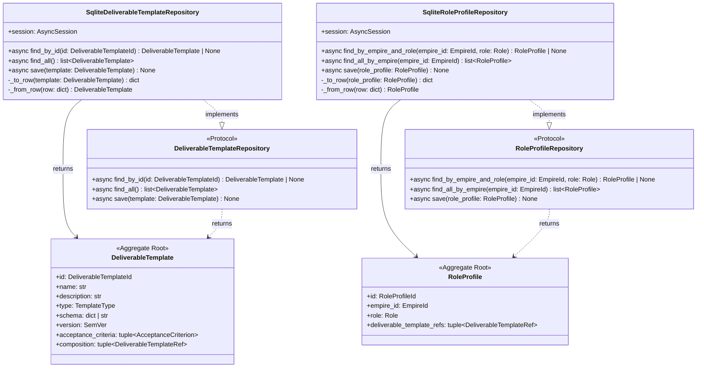
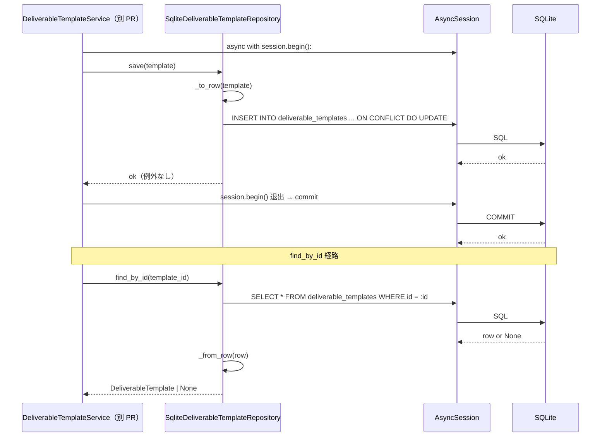
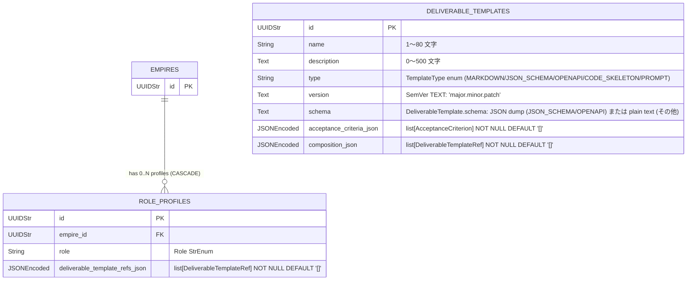

# 基本設計書

> feature: `deliverable-template` / sub-feature: `repository`
> 親業務仕様: [`../feature-spec.md`](../feature-spec.md)
> 関連: [`../../empire/repository/`](../../empire/repository/) **テンプレート真実源** / [`../../workflow/repository/`](../../workflow/repository/) **partial-mask テンプレート参照** / [`../domain/`](../domain/)（domain 設計済み PR #127）

## 記述ルール（必ず守ること）

基本設計に**疑似コード・サンプル実装（python/ts/sh/yaml 等の言語コードブロック）を書かない**。
ソースコードと二重管理になりメンテナンスコストしか生まない。
必要なのは構造契約（クラス・モジュール・データの関係）であり、実装の細部は [detailed-design.md](detailed-design.md) で凍結する。

## §モジュール契約（機能要件）

本 sub-feature が満たすべき機能要件を凍結する。親 [`../feature-spec.md`](../feature-spec.md) §5 UC-DT-005 および §9 受入基準 AC#14〜15 をここで実装レベルに展開する。

### REQ-DTR-001: DeliverableTemplateRepository Protocol 定義

| 項目 | 内容 |
|-----|-----|
| 入力 | なし（Protocol 定義） |
| 処理 | `find_by_id(id: DeliverableTemplateId) → DeliverableTemplate \| None` / `find_all() → list[DeliverableTemplate]` / `save(template: DeliverableTemplate) → None` の 3 メソッドを `async def` で宣言 |
| 出力 | Protocol クラス（`application/ports/deliverable_template_repository.py`） |
| エラー時 | 定義エラーは import 時に静的検査（pyright strict）で検出 |

### REQ-DTR-002: SqliteDeliverableTemplateRepository 実装

| 項目 | 内容 |
|-----|-----|
| 入力 | `AsyncSession`（コンストラクタ）、`DeliverableTemplateId` または `DeliverableTemplate` インスタンス（各メソッド） |
| 処理 | Protocol 3 メソッドを SQLite + SQLAlchemy 2.x AsyncSession で実装。`save()` は `deliverable_templates` 1 テーブルへの UPSERT（§確定 B）。`find_by_id()` / `find_all()` は SELECT + `_from_row` で Aggregate 再構築。`schema` カラムは type 判別でシリアライズ（§確定 D） |
| 出力 | `DeliverableTemplate \| None`（find_by_id）/ `list[DeliverableTemplate]`（find_all）/ None（save） |
| エラー時 | `sqlalchemy.IntegrityError` / `sqlalchemy.OperationalError` / `pydantic.ValidationError` を上位伝播（握り潰し禁止） |

### REQ-DTR-003: RoleProfileRepository Protocol 定義

| 項目 | 内容 |
|-----|-----|
| 入力 | なし（Protocol 定義） |
| 処理 | `find_by_empire_and_role(empire_id: EmpireId, role: Role) → RoleProfile \| None` / `find_all_by_empire(empire_id: EmpireId) → list[RoleProfile]` / `save(role_profile: RoleProfile) → None` の 3 メソッドを `async def` で宣言 |
| 出力 | Protocol クラス（`application/ports/role_profile_repository.py`） |
| エラー時 | 定義エラーは import 時に静的検査（pyright strict）で検出 |

### REQ-DTR-004: SqliteRoleProfileRepository 実装

| 項目 | 内容 |
|-----|-----|
| 入力 | `AsyncSession`（コンストラクタ）、`EmpireId` / `Role` / `RoleProfile` インスタンス（各メソッド） |
| 処理 | Protocol 3 メソッドを SQLite + SQLAlchemy 2.x AsyncSession で実装。`save()` は `role_profiles` 1 テーブルへの UPSERT（§確定 B）。`find_by_empire_and_role()` / `find_all_by_empire()` は WHERE 句 + `_from_row` で Aggregate 再構築。`deliverable_template_refs_json` は JSONEncoded（§確定 G） |
| 出力 | `RoleProfile \| None`（find_by_empire_and_role）/ `list[RoleProfile]`（find_all_by_empire）/ None（save） |
| エラー時 | `UNIQUE(empire_id, role)` 違反時は `IntegrityError` を上位伝播（application 層が 409 にマッピング） |

### REQ-DTR-005: Alembic 0012 マイグレーション

| 項目 | 内容 |
|-----|-----|
| 入力 | Alembic upgrade head コマンド |
| 処理 | `0012_deliverable_template_aggregate.py` revision で `deliverable_templates` / `role_profiles` の 2 テーブル + UNIQUE 制約を追加。`down_revision="0011_stage_required_deliverables"` で chain 一直線 |
| 出力 | 2 テーブル追加済みの SQLite DB |
| エラー時 | `downgrade` は逆順で 2 テーブル削除（`role_profiles` → `deliverable_templates` の順） |

### REQ-DTR-006: CI 三層防衛拡張

| 項目 | 内容 |
|-----|-----|
| 入力 | `scripts/ci/check_masking_columns.sh`（Layer 1）/ `backend/tests/architecture/test_masking_columns.py`（Layer 2） |
| 処理 | Layer 1: `deliverable_templates` / `role_profiles` 両テーブルに `MaskedJSONEncoded` / `MaskedText` が存在しないことを明示 assert（masking 対象なし登録）。Layer 2: arch test parametrize に 2 テーブルを追加（empire-repository §確定 E テンプレート準拠） |
| 出力 | CI pass / fail |
| エラー時 | 将来 PR が誤って Masked* を追加した場合、Layer 2 が検出して CI ブロック |

**masking 対象なし根拠**: 親 [`../feature-spec.md §13`](../feature-spec.md) が両 Aggregate の全カラムを機密レベル「低」と判定し、「masking 対象の追加が必要と判断された場合は別 Issue で対応する」と明示している。domain/basic-design.md §ER 図注記の "MaskedText（将来 repository sub-feature で配線）" は業務判断前の暫定メモであり、本 PR で feature-spec §13 の業務判定に従い `MaskedText` は不使用とする。

### REQ-DTR-007: storage.md 逆引き表更新

| 項目 | 内容 |
|-----|-----|
| 入力 | `docs/design/domain-model/storage.md` |
| 処理 | §逆引き表に `deliverable_templates`（masking 対象なし）/ `role_profiles`（masking 対象なし）の 2 行を追加 |
| 出力 | 更新済み `storage.md` |
| エラー時 | 該当なし |

## モジュール構成

| 機能 ID | モジュール | ディレクトリ | 責務 |
|--------|----------|------------|------|
| REQ-DTR-001 | `DeliverableTemplateRepository` Protocol | `backend/src/bakufu/application/ports/deliverable_template_repository.py` | Repository ポート定義（empire-repo §確定 A テンプレート準拠） |
| REQ-DTR-002 | `SqliteDeliverableTemplateRepository` | `backend/src/bakufu/infrastructure/persistence/sqlite/repositories/deliverable_template_repository.py` | SQLite 実装、§確定 B + §確定 D〜F |
| REQ-DTR-003 | `RoleProfileRepository` Protocol | `backend/src/bakufu/application/ports/role_profile_repository.py` | Repository ポート定義（同上） |
| REQ-DTR-004 | `SqliteRoleProfileRepository` | `backend/src/bakufu/infrastructure/persistence/sqlite/repositories/role_profile_repository.py` | SQLite 実装、§確定 B + §確定 G〜H |
| REQ-DTR-005 | Alembic 0012 revision | `backend/alembic/versions/0012_deliverable_template_aggregate.py` | 2 テーブル追加、`down_revision="0011_stage_required_deliverables"` |
| REQ-DTR-006 | CI 三層防衛拡張（Layer 1） | `scripts/ci/check_masking_columns.sh`（既存更新） | 2 テーブルを masking 対象なしで明示登録 |
| REQ-DTR-006 | CI 三層防衛拡張（Layer 2） | `backend/tests/architecture/test_masking_columns.py`（既存更新） | parametrize に 2 テーブル追加 |
| REQ-DTR-007 | storage.md 逆引き表更新 | `docs/design/domain-model/storage.md`（既存更新） | 2 行追加（masking 対象なし） |
| 共通 | tables/deliverable_templates.py | `backend/src/bakufu/infrastructure/persistence/sqlite/tables/deliverable_templates.py` | 新規 |
| 共通 | tables/role_profiles.py | `backend/src/bakufu/infrastructure/persistence/sqlite/tables/role_profiles.py` | 新規 |

```
ディレクトリ構造（本 feature で追加・変更されるファイル）:

.
├── backend/
│   ├── alembic/
│   │   └── versions/
│   │       └── 0012_deliverable_template_aggregate.py     # 新規: 2 テーブル追加
│   ├── src/
│   │   └── bakufu/
│   │       ├── application/
│   │       │   └── ports/
│   │       │       ├── deliverable_template_repository.py # 新規: Protocol
│   │       │       └── role_profile_repository.py         # 新規: Protocol
│   │       └── infrastructure/
│   │           └── persistence/
│   │               └── sqlite/
│   │                   ├── repositories/
│   │                   │   ├── deliverable_template_repository.py  # 新規: Sqlite実装
│   │                   │   └── role_profile_repository.py          # 新規: Sqlite実装
│   │                   └── tables/
│   │                       ├── deliverable_templates.py   # 新規
│   │                       └── role_profiles.py           # 新規
│   └── tests/
│       ├── architecture/
│       │   └── test_masking_columns.py                    # 既存更新: 2 テーブル追加
│       └── infrastructure/
│           └── persistence/
│               └── sqlite/
│                   └── repositories/
│                       ├── test_deliverable_template_repository/  # 新規ディレクトリ
│                       │   ├── __init__.py
│                       │   └── test_crud.py               # ヤン・ルカン担当（test-design.md）
│                       └── test_role_profile_repository/  # 新規ディレクトリ
│                           ├── __init__.py
│                           └── test_crud.py               # ヤン・ルカン担当（test-design.md）
├── scripts/
│   └── ci/
│       └── check_masking_columns.sh                       # 既存更新: 2 テーブル追加（対象なし）
└── docs/
    ├── design/
    │   └── domain-model/
    │       └── storage.md                                  # 既存更新: 2 行追加
    └── features/
        └── deliverable-template/
            └── repository/                                 # 本 feature 設計書群
```

## クラス設計（概要）



**凝集のポイント**:

- 両 Protocol は `application` 層に配置。domain は永続化を知らない
- 両 `Sqlite*Repository` は `infrastructure` 層。Protocol を**型レベルで満たす**（`@runtime_checkable` なし、duck typing）
- domain ↔ row 変換は private method `_to_row()` / `_from_row()` で Repository に閉じる
- `save()` は 1 テーブルへの UPSERT（子テーブルなし）。子コレクション（acceptance_criteria / composition / deliverable_template_refs）は JSONEncoded カラムにシリアライズ
- `DeliverableTemplate.schema` は `type` カラム（TemplateType）を判別キーとして Text でシリアライズ・デシリアライズ（§確定 D）
- SemVer は `"major.minor.patch"` 形式の TEXT で永続化（§確定 E）
- 呼び出し側 service が `async with session.begin():` で UoW 境界を管理。Repository は session を受け取るのみ

## データモデル

2 テーブル。詳細は [`detailed-design.md §データ構造（永続化キー）`](detailed-design.md)。

| テーブル | 主要属性 |
|---|---|
| `deliverable_templates` | `id` PK / `name` / `description` / `type` / `version` TEXT "1.2.3" / `schema` Text（§確定 D）/ `acceptance_criteria_json` JSONEncoded / `composition_json` JSONEncoded |
| `role_profiles` | `id` PK / `empire_id` FK→empires / `role` / `deliverable_template_refs_json` JSONEncoded / UNIQUE(empire_id, role) |

**masking 対象カラム**: なし（feature-spec §13 の業務判断に従い CI 三層防衛で物理保証、REQ-DTR-006）

## 依存関係

| 区分 | 依存 | 備考 |
|---|---|---|
| ランタイム | Python 3.12+ | 既存 |
| Python 依存 | SQLAlchemy 2.x / Alembic | 既存 |
| ドメイン | `DeliverableTemplate` / `DeliverableTemplateId` / `RoleProfile` / `RoleProfileId` / `EmpireId` / `Role` / `SemVer` / `DeliverableTemplateRef` / `AcceptanceCriterion` | PR #127 実装済み |
| インフラ | `Base` / `UUIDStr` / `JSONEncoded` / `AsyncSession` | 既存 |
| 外部サービス | 該当なし | infrastructure 層のため外部通信なし |

## 処理フロー

### ユースケース 1: DeliverableTemplate の保存（save 経路）

1. application 層 `DeliverableTemplateService.create(...)` が `DeliverableTemplate` Aggregate を構築
2. service が `async with session.begin():` で UoW 境界を開く
3. service が `DeliverableTemplateRepository.save(template)` を呼ぶ
4. `SqliteDeliverableTemplateRepository.save(template)` が以下を実行:
   - `_to_row(template)` で `deliverable_templates_row: dict` に変換（schema シリアライズ §確定 D、SemVer TEXT §確定 E、JSON カラム §確定 F）
   - `INSERT INTO deliverable_templates (...) ON CONFLICT (id) DO UPDATE SET ...`（UPSERT）
5. `session.begin()` ブロック退出で commit、例外なら rollback

### ユースケース 2: DeliverableTemplate の取得（find_by_id 経路）

1. application 層が `DeliverableTemplateRepository.find_by_id(template_id)` を呼ぶ
2. `SqliteDeliverableTemplateRepository.find_by_id(template_id)` が以下を実行:
   - `SELECT * FROM deliverable_templates WHERE id = :id` で行を取得（不在なら None を返す）
   - `_from_row(row)` で `DeliverableTemplate` を構築（schema デシリアライズ §確定 D、SemVer 復元 §確定 E、JSON カラム復元 §確定 F）
3. valid な `DeliverableTemplate` を返却

### ユースケース 3: RoleProfile の保存・取得（save / find 経路）

1. application 層が `RoleProfileRepository.save(role_profile)` を呼ぶ
2. `SqliteRoleProfileRepository.save(role_profile)` が `_to_row(role_profile)` → UPSERT（§確定 B）
3. `find_by_empire_and_role(empire_id, role)`:
   - `SELECT * FROM role_profiles WHERE empire_id = :empire_id AND role = :role` → `_from_row` で復元
4. `find_all_by_empire(empire_id)`:
   - `SELECT * FROM role_profiles WHERE empire_id = :empire_id ORDER BY role` → `_from_row` で復元

## シーケンス図



## アーキテクチャへの影響

- `docs/design/domain-model/storage.md` への変更: §逆引き表に `deliverable_templates` / `role_profiles` の 2 行追加（masking 対象なし、REQ-DTR-007）
- `docs/design/domain-model/aggregates.md` への変更: なし（domain PR #127 で既に追加済み）
- `docs/design/tech-stack.md` への変更: なし
- 既存 feature への波及:
  - `feature/persistence-foundation` の上に乗る、追加要件なし
  - `feature/deliverable-template/domain`（PR #127 マージ済み）の domain 層 Aggregate を import するのみ、domain 設計書は変更しない
  - `feature/empire/repository` の `empires` テーブルへの FK（`role_profiles.empire_id → empires.id`）が新たに追加される

## 外部連携

該当なし — 理由: infrastructure 層（SQLite Repository）に閉じる。外部システムへの通信は発生しない。

| 連携先 | 目的 | プロトコル | 認証 | タイムアウト / リトライ |
|-------|------|----------|-----|--------------------|
| 該当なし | — | — | — | — |

## UX 設計

該当なし — 理由: UI を持たない infrastructure 層。

| シナリオ | 期待される挙動 |
|---------|------------|
| 該当なし | — |

**アクセシビリティ方針**: 該当なし（UI なし）。

## セキュリティ設計

### 脅威モデル

詳細な信頼境界は [`docs/design/threat-model.md`](../../../design/threat-model.md)。本 feature 範囲では以下の 2 件。

| 想定攻撃者 | 攻撃経路 | 保護資産 | 対策 |
|-----------|---------|---------|------|
| **T1: Masked* 誤追加（後続 PR の事故）** | 後続 PR の実装者が `schema` / `acceptance_criteria_json` を `MaskedText` / `MaskedJSONEncoded` と誤判断して追加 | masking 整合性（BUG-PF-001: 過剰マスキング防止） | CI 三層防衛 Layer 1（grep guard）+ Layer 2（arch test）で 2 テーブルを「masking 対象なし」として明示登録（REQ-DTR-006）。feature-spec §13 の業務判断を設計書で凍結 |
| **T2: UNIQUE(empire_id, role) 制約違反による同一 Role の RoleProfile 重複** | 競合 Tx で同一 Role の `save()` が並走 → DB 制約違反 | RoleProfile 1:1 制約（feature-spec 業務ルール R1-D） | SQLite の UNIQUE 制約が最終防衛線。`IntegrityError` を application 層に伝播し 409 Conflict にマッピング（service 層が `find_by_empire_and_role` 事前チェック + Tx 内で 2 重防衛） |

### OWASP Top 10 対応

| # | カテゴリ | 対応状況 |
|---|---------|---------|
| A01 | Broken Access Control | 該当なし（infrastructure 層、認可は別 feature） |
| A02 | Cryptographic Failures | **適用**: 両 Aggregate の全カラムは feature-spec §13 が「機密レベル低」と判断。masking 不要（REQ-DTR-006 CI 三層防衛で物理保証）。将来 secret 混入リスクが高まった場合は別 Issue で `MaskedText` / `MaskedJSONEncoded` を追加する |
| A03 | Injection | **適用**: SQLAlchemy ORM + Core バインドパラメータで SQL injection 防御。raw SQL 文字列は使わない |
| A04 | Insecure Design | **適用**: Repository ポート分離（依存方向 domain ← application ← infrastructure）+ UPSERT 原子性 |
| A05 | Security Misconfiguration | M2 永続化基盤の PRAGMA 強制（defensive=ON 等）の上に乗る、追加要件なし |
| A06 | Vulnerable Components | SQLAlchemy 2.x / Alembic / aiosqlite（pip-audit で監視） |
| A07 | Auth Failures | 該当なし |
| A08 | Data Integrity Failures | **適用**: `role_profiles` の UNIQUE(empire_id, role) 制約で RoleProfile 1:1 業務ルール R1-D を DB レベルで物理保証。Tx 原子性（WAL）で半端更新を防止 |
| A09 | Logging Failures | **適用**: `_from_row` 内の `pydantic.ValidationError` は DB 破損として上位伝播。acceptance_criteria.description 等の自然言語フィールドは feature-spec §13 の業務判断に従い audit_log に raw で記録（secret 混入リスク低）。将来リスク再評価が必要な場合は別 Issue |
| A10 | SSRF | 該当なし |

## ER 図



UNIQUE 制約:

- `role_profiles(empire_id, role)`: 同一 Empire 内で同 Role 値の RoleProfile の重複を禁止（業務ルール R1-D）

**masking 対象カラム**: なし（feature-spec §13 の業務判断、CI 三層防衛で物理保証）

## エラーハンドリング方針

| 例外種別 | 処理方針 | ユーザーへの通知 |
|---------|---------|----------------|
| `sqlalchemy.IntegrityError`（UNIQUE 違反: `role_profiles(empire_id, role)`） | application 層に伝播、409 Conflict にマッピング | application 層 / HTTP API の MSG（別 feature） |
| `sqlalchemy.IntegrityError`（FK 違反: `role_profiles.empire_id → empires.id`） | application 層に伝播、404 / 422 にマッピング | 同上 |
| `sqlalchemy.OperationalError`（接続切断、ロック timeout） | application 層に伝播、503 にマッピング | 同上 |
| `pydantic.ValidationError`（`_from_row` 内 Aggregate 構築時） | Repository 内で catch せず application 層に伝播、データ破損として扱う | application 層 / HTTP API の MSG |
| その他 | 握り潰さない、application 層へ伝播 | 汎用エラーメッセージ |

**Repository 内で明示的な commit / rollback はしない**: 呼び出し側 service が `async with session.begin():` で UoW 境界を管理。これにより 1 Tx 内で複数 Repository を呼ぶシナリオに対応。
