# 詳細設計書

> feature: `deliverable-template` / sub-feature: `repository`
> 関連: [basic-design.md](basic-design.md) / [`docs/features/persistence-foundation/detailed-design.md`](../../persistence-foundation/detailed-design.md) / [`docs/features/empire/repository/detailed-design.md`](../../empire/repository/detailed-design.md) テンプレート真実源

## 記述ルール（必ず守ること）

詳細設計に**疑似コード・サンプル実装（python/ts/sh/yaml 等の言語コードブロック）を書かない**。
ソースコードと二重管理になりメンテナンスコストしか生まない。
必要なのは「構造契約（属性名・型・制約）」と「確定文言（メッセージ文字列）」と「実装の意図」。

## クラス設計（詳細）

```mermaid
classDiagram
    class DeliverableTemplateRepository {
        <<Protocol>>
        +async find_by_id(id: DeliverableTemplateId) DeliverableTemplate | None
        +async find_all() list~DeliverableTemplate~
        +async save(template: DeliverableTemplate) None
    }
    class SqliteDeliverableTemplateRepository {
        +session: AsyncSession
        +async find_by_id(id: DeliverableTemplateId) DeliverableTemplate | None
        +async find_all() list~DeliverableTemplate~
        +async save(template: DeliverableTemplate) None
        -_to_row(template: DeliverableTemplate) dict
        -_from_row(row: dict) DeliverableTemplate
    }
    class RoleProfileRepository {
        <<Protocol>>
        +async find_by_empire_and_role(empire_id: EmpireId, role: Role) RoleProfile | None
        +async find_all_by_empire(empire_id: EmpireId) list~RoleProfile~
        +async save(role_profile: RoleProfile) None
    }
    class SqliteRoleProfileRepository {
        +session: AsyncSession
        +async find_by_empire_and_role(empire_id: EmpireId, role: Role) RoleProfile | None
        +async find_all_by_empire(empire_id: EmpireId) list~RoleProfile~
        +async save(role_profile: RoleProfile) None
        -_to_row(role_profile: RoleProfile) dict
        -_from_row(row: dict) RoleProfile
    }
```

### Protocol: DeliverableTemplateRepository（`application/ports/deliverable_template_repository.py`）

| メソッド | 引数 | 戻り値 | 制約 |
|----|----|----|----|
| `find_by_id(id: DeliverableTemplateId)` | DeliverableTemplateId | `DeliverableTemplate \| None` | 不在時 None。SQLAlchemy 例外は上位伝播 |
| `find_all()` | なし | `list[DeliverableTemplate]` | `ORDER BY name ASC` で決定論的順序保証（§確定 I）。0 件の場合は空リスト |
| `save(template: DeliverableTemplate)` | DeliverableTemplate | None | `deliverable_templates` テーブルへの UPSERT（§確定 B）。子テーブルなし |

`@runtime_checkable` は付与しない（empire-repository §確定 A テンプレート、duck typing）。

### Protocol: RoleProfileRepository（`application/ports/role_profile_repository.py`）

| メソッド | 引数 | 戻り値 | 制約 |
|----|----|----|----|
| `find_by_empire_and_role(empire_id: EmpireId, role: Role)` | EmpireId, Role | `RoleProfile \| None` | 不在時 None。UNIQUE 制約により最大 1 件 |
| `find_all_by_empire(empire_id: EmpireId)` | EmpireId | `list[RoleProfile]` | `ORDER BY role ASC` で決定論的順序保証（§確定 I）。0 件の場合は空リスト |
| `save(role_profile: RoleProfile)` | RoleProfile | None | `role_profiles` テーブルへの UPSERT（§確定 B）。`role_profile.empire_id` を UPSERT WHERE 条件に含める |

`@runtime_checkable` は付与しない（同上）。

### Class: SqliteDeliverableTemplateRepository（`infrastructure/persistence/sqlite/repositories/deliverable_template_repository.py`）

| 属性 | 型 | 制約 |
|----|----|----|
| `session` | `AsyncSession` | コンストラクタで注入、Tx 境界は外側 service が管理 |

| 関数 | 引数 | 戻り値 | 制約 |
|----|----|----|----|
| `__init__(session: AsyncSession)` | session | None | session を保持するだけ、Tx は開かない |
| `find_by_id(id)` | DeliverableTemplateId | `DeliverableTemplate \| None` | `SELECT * FROM deliverable_templates WHERE id = :id` → 不在なら None → `_from_row` で構築 |
| `find_all()` | なし | `list[DeliverableTemplate]` | `SELECT * FROM deliverable_templates ORDER BY name ASC` → `[_from_row(row) for row in rows]`（§確定 I） |
| `save(template)` | DeliverableTemplate | None | `_to_row(template)` → `INSERT ... ON CONFLICT (id) DO UPDATE SET ...`（§確定 B） |
| `_to_row(template)` | DeliverableTemplate | `dict[str, Any]` | schema シリアライズ（§確定 D）+ SemVer TEXT（§確定 E）+ JSON カラム（§確定 F）の変換を担う |
| `_from_row(row)` | `dict[str, Any]` | `DeliverableTemplate` | schema デシリアライズ（§確定 D）+ SemVer 復元（§確定 E）+ JSON カラム復元（§確定 F）。生 dict 直渡しは禁止（§確定 F 理由参照） |

### Class: SqliteRoleProfileRepository（`infrastructure/persistence/sqlite/repositories/role_profile_repository.py`）

| 属性 | 型 | 制約 |
|----|----|----|
| `session` | `AsyncSession` | コンストラクタで注入、Tx 境界は外側 service が管理 |

| 関数 | 引数 | 戻り値 | 制約 |
|----|----|----|----|
| `__init__(session: AsyncSession)` | session | None | session を保持するだけ、Tx は開かない |
| `find_by_empire_and_role(empire_id, role)` | EmpireId, Role | `RoleProfile \| None` | `SELECT * FROM role_profiles WHERE empire_id = :empire_id AND role = :role` → 不在なら None → `_from_row` で構築 |
| `find_all_by_empire(empire_id)` | EmpireId | `list[RoleProfile]` | `SELECT * FROM role_profiles WHERE empire_id = :empire_id ORDER BY role ASC` → `[_from_row(row) for row in rows]`（§確定 I） |
| `save(role_profile)` | RoleProfile | None | `_to_row(role_profile)` → `INSERT ... ON CONFLICT (id) DO UPDATE SET ...`（§確定 B）。`UNIQUE(empire_id, role)` 違反は `IntegrityError` として上位伝播（§確定 H） |
| `_to_row(role_profile)` | RoleProfile | `dict[str, Any]` | `deliverable_template_refs_json` JSONEncoded 変換を担う（§確定 G） |
| `_from_row(row)` | `dict[str, Any]` | `RoleProfile` | `deliverable_template_refs_json` 復元を担う（§確定 G）。生 dict 直渡しは禁止 |

### Tables（infrastructure/persistence/sqlite/tables/）

| テーブル | モジュール | 主要カラム |
|----|----|----|
| `deliverable_templates` | `tables/deliverable_templates.py`（新規） | `id: UUIDStr PK` / `name: String(80) NOT NULL` / `description: Text NOT NULL` / `type: String(32) NOT NULL` / `version: String(20) NOT NULL` / `schema: Text NOT NULL` / `acceptance_criteria_json: JSONEncoded NOT NULL` / `composition_json: JSONEncoded NOT NULL` |
| `role_profiles` | `tables/role_profiles.py`（新規） | `id: UUIDStr PK` / `empire_id: UUIDStr FK CASCADE` / `role: String(32) NOT NULL` / `deliverable_template_refs_json: JSONEncoded NOT NULL` / UNIQUE(empire_id, role) |

すべて `bakufu.infrastructure.persistence.sqlite.base.Base` を継承。

## 確定事項（先送り撤廃）

### 確定 A: Repository ポート配置 — empire-repository §確定 A 踏襲

`application/ports/{aggregate}_repository.py` の命名規則に従う。

| Aggregate | Protocol ファイル | 担当 PR |
|---|---|---|
| DeliverableTemplate | `application/ports/deliverable_template_repository.py` | **本 PR** |
| RoleProfile | `application/ports/role_profile_repository.py` | **本 PR** |

Protocol 定義の規約は empire-repository §確定 A（async def / @runtime_checkable なし / domain 型のみ）に完全準拠する。

### 確定 B: `save()` 戦略 — UPSERT（子テーブルなし）

`DeliverableTemplate` / `RoleProfile` は acceptance_criteria / composition / deliverable_template_refs をそれぞれ JSON カラムにシリアライズするため、**子テーブルは存在しない**。empire-repository の delete-then-insert（子テーブルを全件削除→再挿入）パターンとは異なり、1 テーブルへの UPSERT のみで完結する。

##### `SqliteDeliverableTemplateRepository.save()` 手順（凍結）

| 順 | 操作 | SQL（概要） |
|---|---|---|
| 1 | deliverable_templates UPSERT | `INSERT INTO deliverable_templates (id, name, description, type, version, schema, acceptance_criteria_json, composition_json) VALUES (...) ON CONFLICT (id) DO UPDATE SET name=EXCLUDED.name, description=EXCLUDED.description, type=EXCLUDED.type, version=EXCLUDED.version, schema=EXCLUDED.schema, acceptance_criteria_json=EXCLUDED.acceptance_criteria_json, composition_json=EXCLUDED.composition_json` |

##### `SqliteRoleProfileRepository.save()` 手順（凍結）

| 順 | 操作 | SQL（概要） |
|---|---|---|
| 1 | role_profiles UPSERT | `INSERT INTO role_profiles (id, empire_id, role, deliverable_template_refs_json) VALUES (...) ON CONFLICT (id) DO UPDATE SET empire_id=EXCLUDED.empire_id, role=EXCLUDED.role, deliverable_template_refs_json=EXCLUDED.deliverable_template_refs_json` |

**注**: `ON CONFLICT (id)` を使用する理由: `id` は不変の Aggregate 識別子。application 層が既存 RoleProfile を `find_by_empire_and_role` で取得して `role` を変更した場合（同一 `id`、別 `role`）も UPSERT で自然に処理される。一方、同一 `(empire_id, role)` で別 `id` の insert を試みると `UNIQUE(empire_id, role)` 違反として `IntegrityError` が発生し、application 層の 1:1 制約チェックをすり抜けた並走バグを検出できる（§確定 H）。

##### Tx 境界の責務分離

`save()` は **明示的な commit / rollback をしない**（empire-repository §確定 B テンプレート）。呼び出し側 service が `async with session.begin():` で UoW 境界を管理する。

### 確定 C: domain ↔ row 変換 — Repository クラス内 private method

`_to_row()` / `_from_row()` を各 Repository クラスの private method として配置する（empire-repository §確定 C テンプレート）。

- `_to_row(aggregate)` は `dict[str, Any]` を返す（SQLAlchemy Core `insert().values(row)` に渡す形式）
- `_from_row(row)` は `dict[str, Any]` を受け取り Aggregate を返す（SQLAlchemy `Row` オブジェクトは `.mapping` 経由で dict に変換して渡す）
- Aggregate の不変条件は `model_validate` 経由で再走る（Repository は再 validate しない契約だが、構築は valid な状態で行われる）

### 確定 D: schema カラムシリアライズ契約（type 判別）

`DeliverableTemplate.schema` は `dict[str, object] | str` の Union 型。DB カラム名は `schema`（Text NOT NULL）。

##### `_to_row` での schema シリアライズ

| template.type | template.schema の Python 型 | DB 格納値（Text） |
|---|---|---|
| `TemplateType.JSON_SCHEMA` | `dict[str, object]` | `json.dumps(template.schema)` |
| `TemplateType.OPENAPI` | `dict[str, object]` | `json.dumps(template.schema)` |
| `TemplateType.MARKDOWN` | `str` | そのまま格納（plain text） |
| `TemplateType.CODE_SKELETON` | `str` | そのまま格納（plain text） |
| `TemplateType.PROMPT` | `str` | そのまま格納（plain text） |

##### `_from_row` での schema デシリアライズ

| row['type'] | row['schema'] の格納値 | _from_row での変換 |
|---|---|---|
| `'JSON_SCHEMA'` / `'OPENAPI'` | JSON 文字列（`json.dumps` した dict） | `json.loads(row['schema'])` → `dict` |
| `'MARKDOWN'` / `'CODE_SKELETON'` / `'PROMPT'` | plain text 文字列 | そのまま `str` として使用 |

**設計根拠**: `type` カラムが判別キーとして機能するため、NULL 可能な 2 カラム設計（`schema_dict` / `schema_text`）より単純。`json.dumps` 済みの文字列が plain text と混在するが、`type` による一意の分岐で曖昧性なし。

### 確定 E: SemVer 永続化契約（TEXT "major.minor.patch"）

`DeliverableTemplate.version` は `SemVer` VO（`major: int`, `minor: int`, `patch: int`）。DB カラム `version` は `String(20) NOT NULL`（TEXT 型）。

| 操作 | 変換 | 根拠 |
|---|---|---|
| `_to_row` | `str(template.version)` → `"1.2.3"` 形式 | `SemVer.__str__` が `f"{major}.{minor}.{patch}"` を返す（domain 実装済み） |
| `_from_row` | `SemVer.from_str(row['version'])` → `SemVer` | `SemVer.from_str` が `"1.2.3"` を解析する class method（domain 実装済み）。解析失敗は DB 破損として `ValueError` を上位伝播 |

3 カラム分割（`version_major` / `version_minor` / `version_patch`）は採用しない。TEXT 1 カラムの方が可読性が高く、`SemVer.from_str` が既に提供されているため冗長な変換ロジック不要。

### 確定 F: acceptance_criteria_json / composition_json シリアライズ契約

`DeliverableTemplate.acceptance_criteria: tuple[AcceptanceCriterion, ...]` および `DeliverableTemplate.composition: tuple[DeliverableTemplateRef, ...]` は JSONEncoded カラムに格納する。

##### `_to_row` シリアライズ（acceptance_criteria_json）

| 変換操作 | 結果 |
|---|---|
| `[c.model_dump(mode='json') for c in template.acceptance_criteria]` | `list[dict]` — JSONEncoded が `json.dumps` して Text に格納 |

各 `AcceptanceCriterion` の `id` フィールド（UUID 型）は `model_dump(mode='json')` により文字列にシリアライズされる。

##### `_from_row` 復元（acceptance_criteria_json）

| 操作 | 理由 |
|---|---|
| `json.loads(row['acceptance_criteria_json'])` → `list[dict]` → `[AcceptanceCriterion.model_validate(d) for d in ...]` → `tuple(...)` | **生 dict 直渡し禁止**: `model_validate` を経由することで AcceptanceCriterion の UUID 型変換（`str` → `UUID`）が保証される。生 dict を `DeliverableTemplate.model_validate({'acceptance_criteria': [...raw dicts...], ...})` に渡すと Pydantic が `str` → `UUID` 変換を試みるが、Aggregate 全体の model_validate のネスト変換に依存するより VO 単位で明示的に変換する方が障害局所化が明確（workflow §確定 H 同パターン） |

##### `_to_row` シリアライズ（composition_json）

| 変換操作 | 結果 |
|---|---|
| `[r.model_dump(mode='json') for r in template.composition]` | `list[dict]` — `[{"template_id": "...", "minimum_version": {"major": 1, "minor": 0, "patch": 0}}, ...]` 形式 |

##### `_from_row` 復元（composition_json）

| 操作 | 形式 |
|---|---|
| `json.loads(row['composition_json'])` → `list[dict]` → `[DeliverableTemplateRef.model_validate(d) for d in ...]` → `tuple(...)` | `tuple[DeliverableTemplateRef, ...]` |

**`DeliverableTemplate` 全体の `_from_row` 変換フロー**:

| DB カラム | Python 型変換 | Aggregate フィールド |
|---|---|---|
| `id` (TEXT) | `DeliverableTemplateId(UUID(row['id']))` | `id: DeliverableTemplateId` |
| `name` (TEXT) | そのまま `str` | `name: str` |
| `description` (TEXT) | そのまま `str` | `description: str` |
| `type` (TEXT) | `TemplateType(row['type'])` | `type: TemplateType` |
| `version` (TEXT "1.2.3") | `SemVer.from_str(row['version'])` | `version: SemVer` |
| `schema` (TEXT) | `json.loads(...)` or そのまま（§確定 D） | `schema: dict \| str` |
| `acceptance_criteria_json` (JSONEncoded) | `tuple(AcceptanceCriterion.model_validate(d) for d in ...)` | `acceptance_criteria: tuple[AcceptanceCriterion, ...]` |
| `composition_json` (JSONEncoded) | `tuple(DeliverableTemplateRef.model_validate(d) for d in ...)` | `composition: tuple[DeliverableTemplateRef, ...]` |

最終的に `DeliverableTemplate.model_validate({...})` に渡して Aggregate を構築する。

### 確定 G: deliverable_template_refs_json シリアライズ契約（RoleProfile）

`RoleProfile.deliverable_template_refs: tuple[DeliverableTemplateRef, ...]` は `deliverable_template_refs_json: JSONEncoded` カラムに格納する（§確定 F の composition_json と同パターン）。

##### `_to_row` シリアライズ

| 変換操作 | 結果 |
|---|---|
| `[r.model_dump(mode='json') for r in role_profile.deliverable_template_refs]` | `[{"template_id": "...", "minimum_version": {"major": 1, "minor": 0, "patch": 0}}, ...]` |

##### `_from_row` 復元

| 操作 | 形式 |
|---|---|
| `json.loads(row['deliverable_template_refs_json'])` → `list[dict]` → `[DeliverableTemplateRef.model_validate(d) for d in ...]` → `tuple(...)` | `tuple[DeliverableTemplateRef, ...]` |

**`RoleProfile` 全体の `_from_row` 変換フロー**:

| DB カラム | Python 型変換 | Aggregate フィールド |
|---|---|---|
| `id` (TEXT) | `RoleProfileId(UUID(row['id']))` | `id: RoleProfileId` |
| `empire_id` (TEXT) | `EmpireId(UUID(row['empire_id']))` | `empire_id: EmpireId` |
| `role` (TEXT) | `Role(row['role'])` | `role: Role` |
| `deliverable_template_refs_json` (JSONEncoded) | `tuple(DeliverableTemplateRef.model_validate(d) for d in ...)` | `deliverable_template_refs: tuple[DeliverableTemplateRef, ...]` |

最終的に `RoleProfile.model_validate({...})` に渡して Aggregate を構築する。

### 確定 H: UNIQUE(empire_id, role) DB 制約と IntegrityError 伝播

`role_profiles` テーブルの `UNIQUE(empire_id, role)` 制約は業務ルール R1-D（同一 Role に 1 件のみ）の DB レベルの最終防衛線。

| 状況 | 動作 |
|---|---|
| 同一 Empire 内で同 Role の新規 `save()` | `INSERT ... ON CONFLICT (id)` で `id` が異なる場合 `UNIQUE(empire_id, role)` 違反 → `sqlalchemy.IntegrityError` を application 層に伝播 |
| 既存 RoleProfile の `save()`（同 id） | `ON CONFLICT (id) DO UPDATE SET ...` で `empire_id` / `role` も上書き。`UNIQUE(empire_id, role)` は id 不変の前提では違反しない |
| 競合 Tx（並走 insert） | SQLite のファイルロック + WAL で直列化。後発 Tx が `IntegrityError` → application 層が 409 Conflict にマッピング |

**application 層の 2 重防衛**: service が `find_by_empire_and_role(empire_id, role)` で事前チェック → 存在時は業務エラー → 不在確認後に `save()` → 競合 Tx をすり抜けた場合は DB 制約が最終防衛。

### 確定 I: ORDER BY での決定論的順序保証（empire-repository §BUG-EMR-001 踏襲）

SQLite は `ORDER BY` を明示しない場合、行スキャン順（INSERT 順 / PAGE 順）が返り値の順序になる保証がない。

| メソッド | ORDER BY | 根拠 |
|---|---|---|
| `SqliteDeliverableTemplateRepository.find_all()` | `ORDER BY name ASC` | テンプレート一覧は名前順が自然。決定論的順序でテスト比較を可能にする |
| `SqliteRoleProfileRepository.find_all_by_empire(empire_id)` | `ORDER BY role ASC` | Role は StrEnum 値（大文字）。アルファベット昇順が自然かつ決定論的 |

`find_by_id` / `find_by_empire_and_role` は単一行の取得のため ORDER BY 不要。

### 確定 J: CI 三層防衛の DeliverableTemplate / RoleProfile 拡張

empire-repository §確定 E テンプレートに従う。

##### Layer 1: grep guard（`scripts/ci/check_masking_columns.sh`）

| 登録内容 | 期待結果 |
|---|---|
| `deliverable_templates` テーブル宣言ファイルに `MaskedJSONEncoded` / `MaskedText` が登場しないこと | grep ゼロヒット → pass |
| `role_profiles` テーブル宣言ファイルに同上 | 同上 |

##### Layer 2: arch test（`backend/tests/architecture/test_masking_columns.py`）

| 入力 | 期待 assertion |
|---|---|
| `Base.metadata.tables['deliverable_templates']` | 全カラムの `column.type.__class__` が `MaskedJSONEncoded` でも `MaskedText` でもない（= `String` / `UUIDStr` / `Text` / `JSONEncoded` のみ） |
| `Base.metadata.tables['role_profiles']` | 同上（= `String` / `UUIDStr` / `JSONEncoded` のみ） |

##### Layer 3: storage.md 逆引き表更新（REQ-DTR-007）

`docs/design/domain-model/storage.md` §逆引き表に「masking 対象なし」行 2 件を追加。

### 確定 K: Alembic 0012 revision 方針

| 項目 | 内容 |
|---|---|
| revision id | `"0012_deliverable_template_aggregate"` |
| down_revision | `"0011_stage_required_deliverables"` |
| upgrade 操作 | `op.create_table('deliverable_templates', ...)` → `op.create_table('role_profiles', ...)` の順 |
| downgrade 操作 | `op.drop_table('role_profiles')` → `op.drop_table('deliverable_templates')` の逆順（FK を持つ `role_profiles` を先に削除） |
| MVP 時データ | 本番データなし。DEFAULT '[]' のみで充足（データ変換不要） |

**SQLite DROP COLUMN 保証**: `requires-python = ">=3.12"` により Python 3.12 同梱 SQLite は 3.42.0 以上が保証（3.35.0+ が DROP COLUMN サポートの最低要件、大幅に上回るため追加要件なし）。本 revision では DROP COLUMN は不使用（新規テーブル追加のみ）のため非該当。

## データ構造（永続化キー）

### `deliverable_templates` テーブル

| カラム | 型 | 制約 | 意図 |
|----|----|----|----|
| `id` | `UUIDStr` | PK, NOT NULL | DeliverableTemplateId |
| `name` | `String(80)` | NOT NULL | テンプレート名（1〜80 文字、domain 不変条件で保証） |
| `description` | `Text` | NOT NULL | テンプレート説明（0〜500 文字） |
| `type` | `String(32)` | NOT NULL | TemplateType enum 値（"MARKDOWN" / "JSON_SCHEMA" / "OPENAPI" / "CODE_SKELETON" / "PROMPT"）|
| `version` | `String(20)` | NOT NULL | SemVer TEXT 形式（"major.minor.patch"、例: "1.2.3"）|
| `schema` | `Text` | NOT NULL | DeliverableTemplate.schema フィールド: JSON_SCHEMA / OPENAPI 時は `json.dumps(dict)`、その他は plain text（§確定 D） |
| `acceptance_criteria_json` | `JSONEncoded` | NOT NULL DEFAULT '[]' | `list[AcceptanceCriterion]` の JSON シリアライズ（§確定 F） |
| `composition_json` | `JSONEncoded` | NOT NULL DEFAULT '[]' | `list[DeliverableTemplateRef]` の JSON シリアライズ（§確定 F） |

masking 対象カラム: **なし**（feature-spec §13 業務判断、CI 三層防衛で物理保証）

### `role_profiles` テーブル

| カラム | 型 | 制約 | 意図 |
|----|----|----|----|
| `id` | `UUIDStr` | PK, NOT NULL | RoleProfileId |
| `empire_id` | `UUIDStr` | FK → `empires.id` ON DELETE CASCADE, NOT NULL | 所属 Empire（empire-scope の一意性基盤） |
| `role` | `String(32)` | NOT NULL | Role StrEnum 値（文字列、例: "ENGINEER" / "REVIEWER"） |
| `deliverable_template_refs_json` | `JSONEncoded` | NOT NULL DEFAULT '[]' | `list[DeliverableTemplateRef]` の JSON シリアライズ（§確定 G） |
| UNIQUE | `(empire_id, role)` | — | 業務ルール R1-D: 同一 Empire 内で同 Role の RoleProfile は 1 件のみ（§確定 H） |

masking 対象カラム: **なし**（同上）

### Alembic 0012 revision キー構造（`0012_deliverable_template_aggregate.py`）

revision id: `"0012_deliverable_template_aggregate"`（固定）
down_revision: `"0011_stage_required_deliverables"`

| 操作 | 対象 |
|----|----|
| `op.create_table('deliverable_templates', ...)` | 8 カラム |
| `op.create_table('role_profiles', ...)` | 4 カラム + UNIQUE(empire_id, role) + FK → empires.id ON DELETE CASCADE |

`downgrade()` は `op.drop_table` で逆順実行（FK を持つ `role_profiles` から先に削除）。

## Known Issues

該当なし（Issue #119 スコープ開始時点で既知の問題なし）。

## 設計判断の補足

### なぜ子テーブルを使わず JSONEncoded カラムに集約するか

empire-repository では `empire_room_refs` / `empire_agent_refs` の子テーブルを delete-then-insert で管理したが、本 Repository では acceptance_criteria / composition / deliverable_template_refs を JSONEncoded カラムに格納する。

| 観点 | 子テーブル方式 | JSONEncoded 方式（採用） |
|---|---|---|
| 正規化 | ◎ 正規化、個別 AcceptanceCriterion の集計クエリが容易 | △ 非正規化、JSON カラムの中身は SQL 集計不可 |
| 実装複雑性 | ✗ delete-then-insert + 3〜5 テーブル | ◎ 1 テーブル UPSERT のみ |
| MVP ユースケース | AcceptanceCriterion 単位の集計クエリなし（application 層が全件ロード後に処理） | ◎ ユースケースに過不足なし |
| 将来拡張性 | ◎ 個別 ID での UPDATE / SELECT が容易 | △ JSON 展開が必要（YAGNI 原則で将来 Issue） |

**MVP 判断**: UC-DT-005（永続化）の要件は「再起動を跨いで Aggregate が復元できること」のみ。AcceptanceCriterion 単位の SQL クエリは Issue #107 スコープ外。YAGNI 原則により子テーブルは作成しない。将来 AI 評価（Issue #123）や集計が必要になった段階で別 Alembic revision で子テーブルを追加できる。

### なぜ schema カラム名を `schema` にするか（`body` ではなく）

domain ER 図（`domain/basic-design.md §ER 図`）および domain Aggregate のフィールド名（`DeliverableTemplate.schema`）との一貫性を優先する。SQLite は `schema` を列名として予約していない。SQLAlchemy `mapped_column` の属性名として `schema` を使用しても `Base` クラスとの衝突はない。一方、`body` は REST API の "request body" と混同されやすい。

### なぜ `save(role_profile: RoleProfile)` に empire_id を別引数で渡さないか

`RoleProfile` Aggregate は `empire_id: EmpireId` を属性として保持する（`role_profile.py` 実装済み、PR #127 確認済み）。`save(role_profile, empire_id)` のように empire_id を引数で渡す設計は:
- 属性の二重管理（`role_profile.empire_id` と引数 `empire_id` が食い違うバグの可能性）
- Protocol の引数が domain 層の Aggregate 型のみ（empire-repository §確定 A 規約）から逸脱

`save(role_profile: RoleProfile)` とし、`_to_row` 内で `role_profile.empire_id` を参照するのが正しい設計。

## ユーザー向けメッセージの確定文言

該当なし — 理由: Repository は内部 API、ユーザー向けメッセージは application 層 / HTTP API 層が定義する。Repository は SQLAlchemy 例外（IntegrityError 等）を上位伝播するのみ。

## API エンドポイント詳細

該当なし — 理由: 本 feature は infrastructure 層のみ。HTTP API は `feature/deliverable-template/http-api`（Issue #122）で凍結する。

## 出典・参考

- [SQLAlchemy 2.0 — async / AsyncEngine / AsyncSession](https://docs.sqlalchemy.org/en/20/orm/extensions/asyncio.html)
- [SQLAlchemy 2.0 — INSERT with ON CONFLICT](https://docs.sqlalchemy.org/en/20/dialects/sqlite.html#insert-on-conflict)
- [Alembic Tutorial](https://alembic.sqlalchemy.org/en/latest/tutorial.html)
- [Python typing.Protocol](https://docs.python.org/3/library/typing.html#typing.Protocol)
- [`docs/features/empire/repository/detailed-design.md`](../../empire/repository/detailed-design.md) — §確定 A〜F テンプレート真実源
- [`docs/features/workflow/repository/detailed-design.md`](../../workflow/repository/detailed-design.md) — §確定 H JSONEncoded / MaskedJSONEncoded パターン参照
- [`docs/features/deliverable-template/feature-spec.md`](../feature-spec.md) — §13 機密レベル業務判断の真実源
- [`docs/features/deliverable-template/domain/basic-design.md`](../domain/basic-design.md) — Aggregate 属性・VO 構造の真実源
- [`docs/features/persistence-foundation/`](../../persistence-foundation/) — M2 永続化基盤（JSONEncoded / MaskedJSONEncoded TypeDecorator）
- [`docs/design/domain-model/storage.md`](../../../design/domain-model/storage.md) — 逆引き表（本 PR で 2 行追加）
