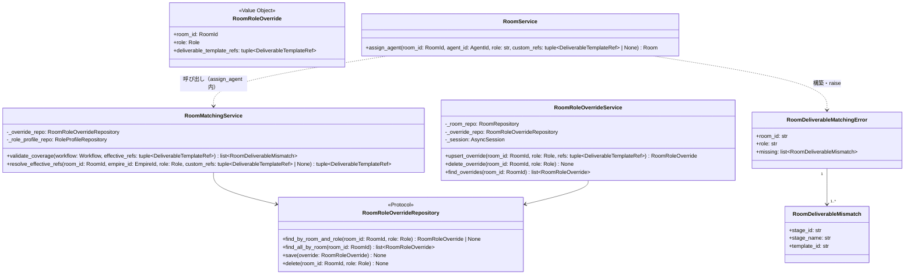

# 基本設計書 — deliverable-template / room-matching

> feature: `deliverable-template` / sub-feature: `room-matching`
> 親業務仕様: [`../feature-spec.md`](../feature-spec.md) §7 業務ルール R1-A / §9 受入基準
> 関連: [`../domain/basic-design.md`](../domain/basic-design.md) / [`../repository/basic-design.md`](../repository/basic-design.md) / [`../../room/http-api/basic-design.md`](../../room/http-api/basic-design.md) / [`../../workflow/domain/basic-design.md`](../../workflow/domain/basic-design.md)
> 関連 Issue: [#120 feat(room-matching): Room matching (107-F)](https://github.com/bakufu-dev/bakufu/issues/120)
> 凍結済み設計参照: [`docs/design/architecture.md §application レイヤー詳細`](../../../design/architecture.md)

## 記述ルール（必ず守ること）

基本設計に**疑似コード・サンプル実装（python/ts/sh/yaml 等の言語コードブロック）を書かない**。
ソースコードと二重管理になりメンテナンスコストしか生まない。
必要なのは構造契約（クラス・モジュール・データの関係）であり、実装の細部は [detailed-design.md](detailed-design.md) で凍結する。

## §モジュール契約（機能要件）

本 sub-feature が提供するモジュールの入出力契約を凍結する。各 REQ は親 [`../../room/feature-spec.md §5`](../../room/feature-spec.md) ユースケース UC-RM-015〜017 および [`../feature-spec.md §5`](../feature-spec.md) UC-DT-006 と対応する。

### REQ-RM-MATCH-001: Agent 役割割り当て時マッチング検証

| 項目 | 内容 |
|-----|-----|
| 入力 | `workflow: Workflow`（Room に採用済み Workflow）/ `effective_refs: tuple[DeliverableTemplateRef, ...]`（有効 ref 集合 — Room オーバーライドまたは Empire RoleProfile から導出済み。空タプルは「このロールがテンプレを提供しない」と等価） |
| 処理 | 全 Stage を走査し、各 Stage の `required_deliverables` のうち `optional=False` のものについて、`req.template_ref.template_id` が `effective_refs` の `template_id` 集合に含まれるかを検査する。不足している (`template_id`, `stage_id`, `stage_name`) のすべてを収集して返却する（Fail Fast 原則 §確定 C）。全 Stage で充足されていれば空リストを返す。純粋関数（I/O なし） |
| 出力 | `list[RoomDeliverableMismatch]`（空リストは充足を示す） |
| エラー時 | 該当なし。呼び出し元（`RoomService.assign_agent`）が不足リストから `RoomDeliverableMatchingError(room_id, role, missing)` を構築して raise する |
| 親 spec 参照 | UC-RM-015, R1-11 |

### REQ-RM-MATCH-002: 有効 refs 解決（effective refs 取得）

| 項目 | 内容 |
|-----|-----|
| 入力 | `room_id: RoomId` / `empire_id: EmpireId` / `role: Role` / `custom_refs: tuple[DeliverableTemplateRef, ...] \| None`（リクエスト時のオーバーライド指定。None は「デフォルト解決」）|
| 処理 | 優先順位（§確定 B）に従い有効 refs を決定する: ①`custom_refs is not None` → `custom_refs` を即返却 ②`RoomRoleOverrideRepository.find_by_room_and_role(room_id, role)` が存在 → その `deliverable_template_refs` を返却 ③`RoleProfileRepository.find_by_empire_and_role(empire_id, role)` が存在 → その `deliverable_template_refs` を返却 ④いずれも存在しない → 空タプルを返却 |
| 出力 | `tuple[DeliverableTemplateRef, ...]`（有効 refs） |
| エラー時 | 該当なし（全ケースで値を返す。マッチング失敗は REQ-RM-MATCH-001 で検出） |
| 親 spec 参照 | UC-RM-015, UC-RM-016 |

### REQ-RM-MATCH-003: Room レベル RoleProfile オーバーライド upsert

| 項目 | 内容 |
|-----|-----|
| 入力 | `room_id: RoomId` / `role: Role` / `deliverable_template_refs: tuple[DeliverableTemplateRef, ...]`（空タプルは「このロールは Room 内でテンプレを提供しない」を明示的に宣言する有効値） |
| 処理 | ①`RoomRepository.find_by_id` で Room 存在確認（不在 → `RoomNotFoundError`）② `archived` 確認（archived → `RoomArchivedError`）③ `RoomRoleOverride(room_id, role, deliverable_template_refs)` を構築（template_id 重複時 → `RoomRoleOverrideInvariantViolation`）→ `async with session.begin(): RoomRoleOverrideRepository.save(override)` |
| 出力 | `RoomRoleOverride`（保存済みオーバーライド） |
| エラー時 | Room 不在 → 404 / アーカイブ済み → 409 / template_id 重複 → 422 |
| 親 spec 参照 | UC-RM-016 |

### REQ-RM-MATCH-004: Room レベル RoleProfile オーバーライド削除

| 項目 | 内容 |
|-----|-----|
| 入力 | `room_id: RoomId` / `role: Role` |
| 処理 | ①Room 存在確認（不在 → `RoomNotFoundError`）② `archived` 確認 ③`RoomRoleOverrideRepository.delete(room_id, role)` — 存在しない場合は no-op |
| 出力 | None |
| エラー時 | Room 不在 → 404 / アーカイブ済み → 409 |
| 親 spec 参照 | UC-RM-016 |

### REQ-RM-MATCH-005: Room レベル RoleProfile オーバーライド一覧取得

| 項目 | 内容 |
|-----|-----|
| 入力 | `room_id: RoomId` |
| 処理 | Room 存在確認 → `RoomRoleOverrideRepository.find_all_by_room(room_id)` |
| 出力 | `list[RoomRoleOverride]`（空リストも正常） |
| エラー時 | Room 不在 → 404 |
| 親 spec 参照 | UC-RM-017 |

## モジュール構成

本 sub-feature で追加・変更するモジュール一覧。

| 機能 ID | モジュール | ディレクトリ | 責務 |
|--------|----------|------------|------|
| REQ-RM-MATCH-001〜002 | `RoomMatchingService` | `backend/src/bakufu/application/services/room_matching_service.py`（新規）| マッチング検証ロジック（`validate_coverage` / `resolve_effective_refs`）|
| REQ-RM-MATCH-003〜005 | `RoomRoleOverrideService` | `backend/src/bakufu/application/services/room_role_override_service.py`（新規）| オーバーライド CRUD（`upsert_override` / `delete_override` / `find_overrides`）|
| REQ-RM-MATCH-001〜005 | `RoomRoleOverride` VO | `backend/src/bakufu/domain/room/value_objects.py`（既存追記）| `(room_id, role, deliverable_template_refs)` の不変 VO。template_id 重複不変条件を持つ |
| REQ-RM-MATCH-001〜005 | `RoomRoleOverrideRepository` Port | `backend/src/bakufu/application/ports/room_role_override_repository.py`（新規）| `find_by_room_and_role` / `find_all_by_room` / `save` / `delete` |
| REQ-RM-MATCH-001 | `RoomDeliverableMatchingError` | `backend/src/bakufu/application/exceptions/room_exceptions.py`（既存追記）| マッチング失敗例外。`missing: list[RoomDeliverableMismatch]` を保持 |
| REQ-RM-MATCH-001 | `RoomDeliverableMismatch` | 同上 | `(stage_id: str, stage_name: str, template_id: str)` — 不足情報の単位 |
| REQ-RM-MATCH-003 | `RoomRoleOverrideInvariantViolation` | `backend/src/bakufu/domain/exceptions.py`（既存追記）| `RoomRoleOverride` VO の不変条件違反（template_id 重複）を表すドメイン例外。`RoomInvariantViolation` / `RoleProfileInvariantViolation` と同ファイルに並列追加。既存 `room_invariant_violation_handler` を拡張して HTTP 422 に変換する |
| 横断 | `SqliteRoomRoleOverrideRepository` | `backend/src/bakufu/infrastructure/persistence/sqlite/repositories/room_role_override_repository.py`（新規）| `room_role_overrides` テーブルへの UPSERT / SELECT / DELETE |
| 横断 | Alembic migration | `backend/alembic/versions/{rev}_add_room_role_overrides.py`（新規）| `room_role_overrides` テーブル追加（§確定 D）|
| 連携更新 | `RoomService.assign_agent` | `backend/src/bakufu/application/services/room_service.py`（既存更新）| Agent 割り当て前に `RoomMatchingService.validate_coverage` を呼び出す。`custom_refs` パラメータと `_override_repo: RoomRoleOverrideRepository` 依存を追加（§確定 G ステップ 9 で直接 UPSERT）|

```
本 sub-feature で追加・変更されるファイル:

backend/
└── src/bakufu/
    ├── domain/
    │   └── room/
    │       └── value_objects.py             # 既存追記: RoomRoleOverride VO 追加（template_id 重複不変条件含む）
    ├── application/
    │   ├── ports/
    │   │   └── room_role_override_repository.py  # 新規: RoomRoleOverrideRepository Protocol
    │   ├── exceptions/
    │   │   └── room_exceptions.py           # 既存追記: RoomDeliverableMatchingError / RoomDeliverableMismatch
    │   └── services/
    │       ├── room_matching_service.py     # 新規: RoomMatchingService（validate_coverage / resolve_effective_refs）
    │       ├── room_role_override_service.py  # 新規: RoomRoleOverrideService（upsert_override / delete_override / find_overrides）
    │       └── room_service.py              # 既存更新: assign_agent に custom_refs + matching check を追加
    └── infrastructure/persistence/sqlite/
        ├── repositories/
        │   └── room_role_override_repository.py  # 新規: SqliteRoomRoleOverrideRepository
        └── models/
            └── room.py                      # 既存追記: RoomRoleOverrideModel ORM モデル追加

backend/alembic/versions/
└── {rev}_add_room_role_overrides.py         # 新規: room_role_overrides テーブル migration

docs/features/deliverable-template/room-matching/
├── basic-design.md                          # 本ファイル
├── detailed-design.md                       # 詳細設計
└── test-design/                             # テスト設計（IT / UT）
    ├── index.md
    ├── it.md
    └── ut.md
```

## クラス設計（概要）



## 依存関係

| 区分 | 依存 | バージョン方針 | 備考 |
|---|---|---|---|
| domain | `RoomRoleOverride` VO（`room/value_objects.py` 追記） | M1 確定済み + 本 PR 追記 | `DeliverableTemplateRef` / `Role` は既存 VO。template_id 重複不変条件を追加 |
| application port | `RoomRoleOverrideRepository` Protocol（新規） | 本 PR 新規 | `SqliteRoomRoleOverrideRepository` が実装 |
| application port | `RoleProfileRepository`（既存） | #122 PR で確定済み | empire-level RoleProfile 取得に使用 |
| application port | `WorkflowRepository`（既存） | workflow M2 確定済み | Workflow.stages 取得に使用 |
| application port | `RoomRepository`（既存） | room M2 確定済み | Room / empire_id 取得に使用 |
| domain exception | `RoomDeliverableMatchingError`（room_exceptions.py 追記） | 本 PR 新規 | http-api error_handler が 422 に変換 |
| infrastructure | `SqliteRoomRoleOverrideRepository`（新規） | 本 PR 新規 | Alembic migration と同時追加 |
| infrastructure | Alembic migration（新規） | 本 PR 新規 | `room_role_overrides` テーブル追加 |

## セキュリティ設計

| 脅威 | 説明 | 対策 |
|------|------|------|
| **T1: custom_refs 肥大化による DoS** | `AgentAssignRequest.custom_refs` に無制限の要素を送信し、マッチング処理の走査コストを過負荷にする | `AgentAssignRequest` の Pydantic モデルで `custom_refs` の最大要素数を制限する（`Field(max_length=N)`）。超過時は FastAPI が 422 を返し application 層に到達しない |
| **T2: ON DELETE CASCADE の波及削除** | 将来の Room 物理削除実装時に `room_role_overrides` テーブルが連鎖削除され、意図しないデータ消失が起きる | MVP では Room は論理削除（`archived=True`）のみのため cascade は現時点で発火しない。物理削除を実装する際は cascade 影響範囲を必須レビュー項目とする（§確定 D に明記）|
| **T3: 不正 role 文字列の永続化** | パスパラメータまたはリクエスト Body の `role` に `Role` StrEnum 外の文字列を送信し、不正なデータを `room_role_overrides` テーブルに書き込む | http-api endpoint で `role: str` を受け取った直後に `Role(role)` 変換を試みる。変換失敗時は `InvalidRoleError` → 422 を返し永続化しない（[`../../room/http-api/basic-design.md §REQ-RM-HTTP-008/009`](../../room/http-api/basic-design.md) でエラーテーブルに明記）|
