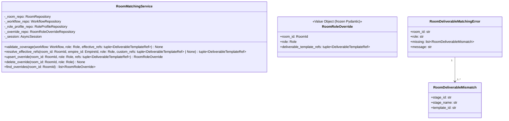

# 詳細設計書 — deliverable-template / room-matching

> feature: `deliverable-template` / sub-feature: `room-matching`
> 親業務仕様: [`../feature-spec.md`](../feature-spec.md) §7 業務ルール R1-A / §9 受入基準
> 関連: [`basic-design.md`](basic-design.md) / [`../domain/detailed-design.md`](../domain/detailed-design.md) / [`../../room/http-api/detailed-design.md`](../../room/http-api/detailed-design.md)
> 関連 Issue: [#120 feat(room-matching): Room matching (107-F)](https://github.com/bakufu-dev/bakufu/issues/120)

## 本書の役割

本書は **階層 3: deliverable-template / room-matching の詳細設計** を凍結する。[`basic-design.md`](basic-design.md) で凍結したモジュール構造・REQ 契約を、実装直前の **構造契約・アルゴリズム・確定文言** として詳細化する。実装 PR は本書を改変せず参照する。設計変更が必要なら本書を先に更新する PR を立てる。

## 記述ルール（必ず守ること）

詳細設計に **疑似コード・サンプル実装（python/ts/sh/yaml 等の言語コードブロック）を書かない**。
必要なのは「構造契約（属性名・型・制約）」と「確定文言（メッセージ文字列）」と「実装の意図（なぜこの設計になるか）」のみ。

## クラス設計（詳細）



### Service: `RoomMatchingService`

| 属性 | 型 | 制約 | 意図 |
|-----|---|------|------|
| `_room_repo` | `RoomRepository` | コンストラクタで注入 | Room 存在確認 + empire_id 取得 |
| `_workflow_repo` | `WorkflowRepository` | コンストラクタで注入 | Workflow.stages 取得 |
| `_role_profile_repo` | `RoleProfileRepository` | コンストラクタで注入 | empire-level RoleProfile 参照 |
| `_override_repo` | `RoomRoleOverrideRepository` | コンストラクタで注入 | Room-level オーバーライド参照 |
| `_session` | `AsyncSession` | コンストラクタで注入 | write 操作の Unit-of-Work 境界 |

**ふるまい:**

`validate_coverage(workflow, role, effective_refs)`:
- 全 `workflow.stages` を順次走査する
- 各 Stage について `required_deliverables` の中から `optional=False` のものを抽出する（§確定 E）
- 各必須 deliverable について `req.template_ref.template_id` が `effective_refs` の template_id セットに含まれるかを判定する（§確定 A）
- 不足を発見しても即時 raise せず、全 Stage を走査し **すべての不足** を収集する（§確定 C: Fail Fast は即時失敗ではなく全不足の一括報告）
- 不足が 1 件以上あれば `RoomDeliverableMatchingError(room_id=..., role=..., missing=[...])` を raise
- 純粋関数（I/O なし）— テスト容易性のため非同期にしない

`resolve_effective_refs(room_id, empire_id, role, custom_refs)`:
- §確定 B の優先順位に従い effective refs を非同期で取得する
- custom_refs が None でない場合は即座に返す（I/O なし）
- custom_refs が None の場合: `_override_repo.find_by_room_and_role` → ヒットすればその `deliverable_template_refs` を返す
- 不在の場合: `_role_profile_repo.find_by_empire_and_role` → ヒットすればその `deliverable_template_refs` を返す
- それも不在の場合: 空タプル `()` を返す（§確定 B）

`upsert_override(room_id, role, refs)`:
- Room 存在確認（不在 → `RoomNotFoundError`）/ archived 確認（→ `RoomArchivedError`）
- `RoomRoleOverride(room_id=room_id, role=role, deliverable_template_refs=refs)` を構築
- `async with self._session.begin(): _override_repo.save(override)` で UPSERT
- 保存済み `RoomRoleOverride` を返す

`delete_override(room_id, role)`:
- Room 存在確認 → `async with self._session.begin(): _override_repo.delete(room_id, role)`
- 存在しないオーバーライドへの delete は no-op（エラーなし）

`find_overrides(room_id)`:
- Room 存在確認 → `_override_repo.find_all_by_room(room_id)` を返す（read-only、begin 不要）

### Domain VO: `RoomRoleOverride`

| 属性 | 型 | 制約 | 意図 |
|-----|---|------|------|
| `room_id` | `RoomId` | 必須 | Room スコープの識別子 |
| `role` | `Role` | 必須（StrEnum 値）| オーバーライド対象ロール |
| `deliverable_template_refs` | `tuple[DeliverableTemplateRef, ...]` | 空タプル可（明示的な「提供なし」を表現）| この Room 内でこの Role が提供する template refs |

**配置**: `backend/src/bakufu/domain/room/value_objects.py` に `AgentMembership` / `PromptKit` と並列追記する。
**設計根拠**: `RoomRoleOverride` は Room bounded context に属する VO。複雑な不変条件を持たない（`deliverable_template_refs` 内の `template_id` 重複チェックはしない — 空リストも合法な意図的宣言であり、不整合は後続タスクで検出）。frozen Pydantic モデルとして実装する。

### Application Exception: `RoomDeliverableMatchingError`

| 属性 | 型 | 意図 |
|-----|---|------|
| `room_id` | `str` | 対象 Room の文字列表現 |
| `role` | `str` | 検証対象 Role の文字列表現 |
| `missing` | `list[RoomDeliverableMismatch]` | 不足 deliverable の全リスト（1 件以上保証）|
| `message` | `str` | 2 行構造 (§確定 F) の確定文言 |

### Application Exception helper: `RoomDeliverableMismatch`

| 属性 | 型 | 意図 |
|-----|---|------|
| `stage_id` | `str` | 不足が検出された Stage の UUID 文字列 |
| `stage_name` | `str` | CEO に意味のある Stage 名（デバッグ / エラーメッセージ用）|
| `template_id` | `str` | 充足されていない DeliverableTemplate の UUID 文字列 |

### Repository Protocol: `RoomRoleOverrideRepository`

| メソッド | シグネチャ | 意図 |
|---------|-----------|------|
| `find_by_room_and_role` | `(room_id: RoomId, role: Role) -> RoomRoleOverride \| None` | UNIQUE(room_id, role) なので 0 または 1 件 |
| `find_all_by_room` | `(room_id: RoomId) -> list[RoomRoleOverride]` | Room 内全オーバーライド（ORDER BY role ASC）|
| `save` | `(override: RoomRoleOverride) -> None` | UPSERT。既存があれば `deliverable_template_refs_json` を UPDATE |
| `delete` | `(room_id: RoomId, role: Role) -> None` | 該当行を DELETE。不在は no-op |

## 確定事項（先送り撤廃）

### §確定 A: カバレッジ判定ルール

有効 refs が Stage の required_deliverable を「カバーしている」とは、`effective_refs` の中に `template_id` が等しい `DeliverableTemplateRef` が存在することを指す。`minimum_version` の比較は行わない。

**理由**: `minimum_version` の互換性チェック（実際の template version が minimum_version 以上かどうか）は Task 完了時の deliverable 提出段階で行う関心事であり、Room 編成時の責務ではない。Room 編成時は「このロールがそのテンプレートを提供する能力を持つか」のみを検証する。earliest 互換性チェックを Room 編成時に強制すると、テンプレートのパッチバージョンアップのたびに Room 再編成が必要になり過剰な制約となる（YAGNI）。

### §確定 B: effective_refs 優先順位（3 段階フォールバック）

| 優先順位 | 条件 | 使用する refs |
|---------|------|-------------|
| 1 | `custom_refs is not None`（リクエスト時に明示指定）| `custom_refs` を直接使用。空タプルも有効（「このロールはテンプレを提供しない」の明示宣言）|
| 2 | `RoomRoleOverride` が存在（この Room × Role のオーバーライド設定あり）| `override.deliverable_template_refs` を使用 |
| 3 | `RoleProfile` が存在（Empire レベルのデフォルト設定あり）| `role_profile.deliverable_template_refs` を使用 |
| 4 | いずれも存在しない | 空タプル `()` を返す。必須 deliverable が存在する Stage があればマッチング検証で失敗する |

**理由**: Room 固有のオーバーライドを Empire デフォルトより優先することで、CEO が Room ごとに異なる deliverable セットを割り当てられる（例: 新人向け Room は通常 RoleProfile より少ないテンプレート）。`custom_refs` をさらに優先するのは、リクエスト時の一過性指定（その場限りのオーバーライド）を既存設定より上位に置くことで、永続的な設定変更なしに動作検証できるようにするため。

### §確定 C: Fail Fast 詳細報告（全不足を一括収集）

`validate_coverage` は第一の不足を発見した時点で即時 raise しない。全 Stage の全 required_deliverable（optional=False）を走査し、不足しているもの全件を `missing: list[RoomDeliverableMismatch]` に収集してから `RoomDeliverableMatchingError` を raise する。

**理由**: Stage が複数ある場合（典型的な Vモデル開発室は 13 Stage）、1 件ずつ修正 → エラー確認のサイクルを繰り返すことは CEO にとって非効率。全不足を一括で提示することで、RoleProfile の修正方針を1回で把握できる。

### §確定 D: DB スキーマ（room_role_overrides テーブル）

| カラム | 型 | 制約 | 意図 |
|-------|---|------|------|
| `room_id` | `VARCHAR(36)` | NOT NULL, FK → `rooms.id` ON DELETE CASCADE | Room を親とする依存関係 |
| `role` | `VARCHAR(64)` | NOT NULL | Role StrEnum 値（`ENGINEER` / `REVIEWER` 等） |
| `deliverable_template_refs_json` | `TEXT` | NOT NULL, DEFAULT `'[]'` | `DeliverableTemplateRef` リストを JSON 配列にシリアライズ（`template_id` + `minimum_version`）|
| `created_at` | `DATETIME` | NOT NULL, DEFAULT CURRENT_TIMESTAMP | 監査 |
| `updated_at` | `DATETIME` | NOT NULL, DEFAULT CURRENT_TIMESTAMP | 監査 |

**PRIMARY KEY**: `(room_id, role)`（`UNIQUE(room_id, role)` で UPSERT 対象）

**外部キー設計**: `rooms.id` に対して `ON DELETE CASCADE` を設定し、Room アーカイブ後の物理削除が発生した場合（将来）にオーバーライドが孤立しないようにする。現 MVP では Room は論理削除のみのため cascade は保険的設計。

**serialization 方針**: `deliverable_template_refs_json` は `[{"template_id": "<uuid>", "minimum_version": {"major": N, "minor": N, "patch": N}}, ...]` の JSON 文字列。既存の `composition_json` / `deliverable_template_refs_json`（role_profiles テーブル）と同一の serialization 規約に従う（deliverable-template repository §確定 B 踏襲）。

### §確定 E: マッチング対象は `optional=False` のみ

`Stage.required_deliverables` の中で `optional=True` の `DeliverableRequirement` はマッチング検証の対象外とする。

**理由**: `optional=True` は「提出が期待されるが必須ではない」を意味する（`workflow/feature-spec.md §7 確定 R1-17`）。Room 編成時にオプション deliverable の提供能力まで強制すると、柔軟な Role 編成を阻害する。オプション deliverable の提出は Task 完了時の加点要素として扱う（将来の Task completion 設計の責務）。

### §確定 F: エラーメッセージ 2 行構造

全例外メッセージは feature-spec.md §7 確定 R1-F（2 行構造）に従う。

| ID | 確定文言 |
|---|---------|
| MSG-RM-MATCH-001 | 1 行目: `[FAIL] Room {room_id} の役割 {role} は {N} 件の必須成果物テンプレートを提供できません。不足: {stage_name} → {template_id}[, ...]`（不足件数と対象 stage/template を列挙）/ 2 行目: `Next: RoleProfile の deliverable_template_refs にテンプレートを追加するか、Room レベルのオーバーライドを設定してください（PUT /api/rooms/{room_id}/role-overrides/{role}）。` |

HTTP レスポンス形式（error_handler 経由）:
```
{
  "error": {
    "code": "deliverable_matching_failed",
    "message": "<MSG-RM-MATCH-001 の 1 行目>",
    "detail": {
      "role": "<role>",
      "missing": [
        {"stage_id": "<uuid>", "stage_name": "<name>", "template_id": "<uuid>"},
        ...
      ]
    }
  }
}
```

**注**: `missing` の詳細（stage_id / stage_name / template_id）は HTTP レスポンスに含める。これらは参照整合性の観点でセキュリティリスクを持つ内部 UUID だが、Room 編成は認証済み CEO のみがアクセスできるエンドポイントであるため（http-api-foundation §認証方針）、CEO が修正に必要な情報を提示する利益がリスクを上回る判断とする。

### §確定 G: `RoomService.assign_agent` への integration

`RoomService.assign_agent(room_id, agent_id, role, custom_refs=None)` の処理フローに以下の 2 ステップを追加する:

| 変更 | 場所 | 内容 |
|-----|------|------|
| ステップ追加 | Agent 存在確認の直後（Room.add_member 呼び出しの前）| `empire_id = await _room_repo.find_empire_id_by_room_id(room_id)` → `workflow = await _workflow_repo.find_by_id(room.workflow_id)` → `effective_refs = await matching_svc.resolve_effective_refs(room_id, empire_id, role_enum, custom_refs)` → `matching_svc.validate_coverage(workflow, role_enum, effective_refs)` |
| パラメータ追加 | `assign_agent` シグネチャ | `custom_refs: tuple[DeliverableTemplateRef, ...] \| None = None` を末尾に追加 |
| オーバーライド保存 | `RoomRepository.save` の直後 | `if custom_refs is not None: await _override_repo.save(RoomRoleOverride(room_id, role_enum, custom_refs))` — UoW 内で同一トランザクションに含める |

**UoW 境界**: Room save + RoomRoleOverride save は同一 `async with self._session.begin():` ブロック内に含める。どちらか一方のみが永続化された不整合状態を防ぐ。

### §確定 H: `RoomMatchingService` の DI 配線

`get_room_matching_service(session: SessionDep)` ファクトリを `interfaces/http/dependencies.py` に追加する。以下の 4 Repository を注入する:
- `SqliteRoomRepository(session)`
- `SqliteWorkflowRepository(session)`
- `SqliteRoleProfileRepository(session)`
- `SqliteRoomRoleOverrideRepository(session)`

`RoomService` は `assign_agent` 内で `RoomMatchingService` を使用するため、`RoomService` の DI ファクトリ（`get_room_service`）に `RoomMatchingService` への依存を追加する。または、`RoomService.assign_agent` の内部で `RoomMatchingService` の logic を直接呼ぶかは detailed-design 実装者の判断に委ねる（§確定 G で十分な情報を与えている）。

## ユーザー向けメッセージ確定文言

| ID | HTTP ステータス | 確定文言（要点）| 発火条件 |
|---|--------------|-------------|---------|
| MSG-RM-MATCH-001 | 422 | `deliverable_matching_failed` — 不足 stage/template リスト付き | validate_coverage が missing >= 1 を検出 |
