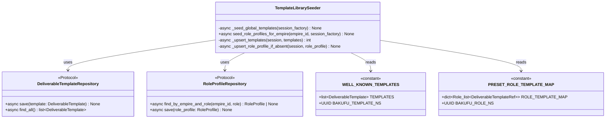
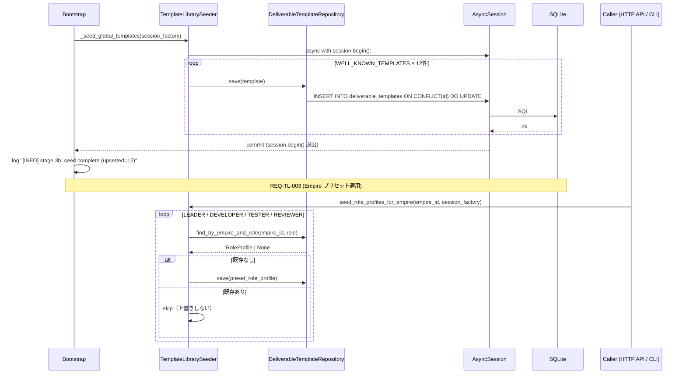
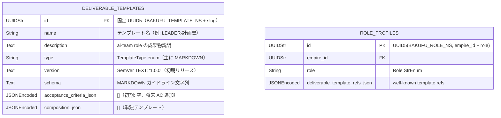

# 基本設計書

> feature: `deliverable-template` / sub-feature: `template-library`
> 親業務仕様: [`../feature-spec.md`](../feature-spec.md)
> 関連: [`../repository/`](../repository/)（DeliverableTemplateRepository / RoleProfileRepository Protocol）/ [`../domain/`](../domain/)（DeliverableTemplate / RoleProfile Aggregate）
> Issue: [#124 feat(deliverable-template): Bakufu Method 既定テンプレライブラリ整備（ai-team 移植）[107-J]](https://github.com/bakufu-dev/bakufu/issues/124)

## 記述ルール（必ず守ること）

基本設計に**疑似コード・サンプル実装（python/ts/sh/yaml 等の言語コードブロック）を書かない**。
ソースコードと二重管理になりメンテナンスコストしか生まない。
必要なのは構造契約（クラス・モジュール・データの関係）であり、実装の細部は [detailed-design.md](detailed-design.md) で凍結する。

## §モジュール契約（機能要件）

本 sub-feature が満たすべき機能要件を凍結する。親 [`../feature-spec.md`](../feature-spec.md) §6 Out of Scope（「組織共通テンプレートライブラリのバンドル → template-library sub-feature（Issue #124）」）および §11 OQ-4 解決（本 PR で確定）をここで実装レベルに展開する。

### REQ-TL-001: 既定 DeliverableTemplate 群のグローバル永続化（startup upsert）

| 項目 | 内容 |
|-----|-----|
| 入力 | アプリ起動イベント（Bootstrap）/ `async_sessionmaker[AsyncSession]` |
| 処理 | `WELL_KNOWN_TEMPLATES` 定数が保持する ai-team 5 ロール対応テンプレート群（§確定 A で定義）を `DeliverableTemplateRepository.save()` 経由で UPSERT する。各テンプレートは固定 UUID5 を持つため、再起動時でも同一 `id` に対して UPSERT が走り重複レコードを生成しない（冪等性）。Template 数: 12 件（§確定 A 参照） |
| 出力 | `deliverable_templates` テーブルに 12 件が保存済みの状態（初回: INSERT、2 回目以降: UPDATE で内容同期） |
| エラー時 | SQLAlchemy 例外（接続断・制約違反 等）は Bootstrap に伝播し起動を中断する。部分的な seed 失敗（一部テンプレートの UPSERT 失敗）も起動を中断する（Fail Fast） |

### REQ-TL-002: Bootstrap への組み込み（Alembic マイグレーション直後 Stage）

| 項目 | 内容 |
|-----|-----|
| 入力 | `Bootstrap.run()` 内でのステージシーケンス / `session_factory` |
| 処理 | `_stage_3_migrate()` 完了直後（Alembic でスキーマが最新化された後）、`_stage_4_pid_gc()` 実行前に `TemplateLibrarySeeder._seed_global_templates(session_factory)` を呼ぶ。Bootstrap の既存 8 ステージに割り込む形で「Stage 3b」として追加する（既存ステージ番号は変更しない） |
| 出力 | Bootstrap ログ: `[INFO] Bootstrap stage 3b: template-library seed complete (upserted=N)` |
| エラー時 | `BakufuConfigError` でラップして Bootstrap に伝播（起動中断）。DB スキーマ確定前（Stage 3 失敗後）は絶対に実行されないことをステージ順序で保証 |

### REQ-TL-003: 既定 RoleProfile プリセット関数（Empire スコープ）

| 項目 | 内容 |
|-----|-----|
| 入力 | `empire_id: EmpireId` / `async_sessionmaker[AsyncSession]` |
| 処理 | `PRESET_ROLE_TEMPLATE_MAP` 定数（§確定 B で定義: LEADER / DEVELOPER / TESTER / REVIEWER の 4 件）を受け取った `empire_id` で `RoleProfileRepository.save()` 経由で UPSERT する。`RoleProfile.id` は `UUID5(BAKUFU_ROLE_NS, f"{empire_id}:{role}")` で決定論的に生成（empire_id + role のペアで一意）。既存 RoleProfile が存在する場合は上書きしない（`find_by_empire_and_role()` 事前確認 + skip）|
| 出力 | 指定 Empire の `role_profiles` テーブルに LEADER / DEVELOPER / TESTER / REVIEWER の 4 件が存在する状態 |
| エラー時 | `RoleProfile` 1:1 制約違反（既に手動設定済み）は skip（上書きしない）。SQLAlchemy 例外は呼び出し元（HTTP API / CLI）に伝播 |

### REQ-TL-004: 冪等性の物理保証（固定 UUID5 + UPSERT）

| 項目 | 内容 |
|-----|-----|
| 入力 | 複数回の起動 / REQ-TL-003 の複数呼び出し |
| 処理 | `DeliverableTemplate.id` は `UUID5(BAKUFU_TEMPLATE_NS, "{role}-{slug}")` で生成（`BAKUFU_TEMPLATE_NS` = 固定 UUID、§確定 C で凍結）。同一 `name` / `schema` であれば常に同一 UUID が算出される。UPSERT の `ON CONFLICT (id) DO UPDATE SET ...` により DB レコードと定数が同期される。DB に 手動作成テンプレートが存在しても衝突しない（namespace 分離済み） |
| 出力 | 何回起動しても `deliverable_templates` の well-known レコード数は 12 件を超えない |
| エラー時 | 該当なし（UPSERT 自体が冪等保証機構） |

## モジュール構成

| 機能 ID | モジュール | ディレクトリ | 責務 |
|--------|----------|------------|------|
| REQ-TL-001 / REQ-TL-004 | `WELL_KNOWN_TEMPLATES` 定数 | `backend/src/bakufu/application/services/template_library/definitions.py` | ai-team 5 ロール向け 12 テンプレートの固定定義（DeliverableTemplate インスタンス群） |
| REQ-TL-003 | `PRESET_ROLE_TEMPLATE_MAP` 定数 | `backend/src/bakufu/application/services/template_library/definitions.py` | LEADER / DEVELOPER / TESTER / REVIEWER 4 ロール向けプリセット RoleProfile 定義（empire_id テンプレート） |
| REQ-TL-001 / REQ-TL-002 / REQ-TL-003 | `TemplateLibrarySeeder` | `backend/src/bakufu/application/services/template_library/seeder.py` | startup upsert + Empire 向けプリセット適用 |
| REQ-TL-002 | `Bootstrap._stage_3b_seed_template_library()` | `backend/src/bakufu/infrastructure/bootstrap.py`（既存更新） | `run()` シーケンスへの組み込み（Stage 3b） |

```
ディレクトリ構造（本 feature で追加・変更されるファイル）:

.
├── backend/
│   └── src/
│       └── bakufu/
│           ├── application/
│           │   └── services/
│           │       └── template_library/
│           │           ├── __init__.py                  # 新規
│           │           ├── definitions.py               # 新規: WELL_KNOWN_TEMPLATES / PRESET_ROLE_TEMPLATE_MAP
│           │           └── seeder.py                    # 新規: TemplateLibrarySeeder
│           └── infrastructure/
│               └── bootstrap.py                         # 既存更新: Stage 3b 追加
└── docs/
    └── features/
        └── deliverable-template/
            ├── feature-spec.md                          # 既存更新: OQ-4 解決 + AC 追加
            └── template-library/                        # 本 feature 設計書群
```

## クラス設計（概要）



**凝集のポイント**:

- `TemplateLibrarySeeder` は application 層に配置。`DeliverableTemplateRepository` / `RoleProfileRepository` の Protocol 経由で永続化し、infrastructure 実装に依存しない
- `definitions.py` はデータ定数のみを保持する純粋なモジュール。副作用なし
- Bootstrap の `_stage_3b_seed_template_library()` は `TemplateLibrarySeeder._seed_global_templates()` に委譲する（単一責任）
- UUID5 算出ロジックは `TemplateLibrarySeeder` 内に閉じ、namespace 定数（`BAKUFU_TEMPLATE_NS` / `BAKUFU_ROLE_NS`）は `definitions.py` で一元管理

## データモデル

既存テーブルへの UPSERT のみ。新規テーブル追加なし。

| テーブル | 操作 | 内容 |
|---|---|---|
| `deliverable_templates` | UPSERT（REQ-TL-001） | 12 件の固定 UUID5 テンプレートレコード（§確定 A）。再起動のたびに内容同期 |
| `role_profiles` | UPSERT または skip（REQ-TL-003） | Empire ごとに呼び出し。既存の RoleProfile がある場合は skip |

**Alembic migration**: 新規テーブルなし。スキーマ変更なし。Alembic revision 追加不要。

## 依存関係

| 区分 | 依存 | 備考 |
|---|---|---|
| ランタイム | Python 3.12+ | 既存（UUID5 は `uuid` 標準ライブラリ） |
| Python 依存 | SQLAlchemy 2.x / aiosqlite | 既存 |
| ドメイン | `DeliverableTemplate` / `DeliverableTemplateId` / `RoleProfile` / `RoleProfileId` / `EmpireId` / `Role` / `SemVer` / `DeliverableTemplateRef` / `AcceptanceCriterion` / `TemplateType` | PR #127 実装済み |
| Repository Protocol | `DeliverableTemplateRepository` / `RoleProfileRepository` | Issue #119 実装済み |
| インフラ | `Bootstrap`（既存）/ `AsyncSession` / `async_sessionmaker` | 既存 |
| 外部サービス | 該当なし | 起動時 SQLite 書き込みのみ |

## 処理フロー

### ユースケース 1: 起動時グローバルテンプレート seed（REQ-TL-001 / REQ-TL-002）

1. Bootstrap `run()` が `_stage_3_migrate()` 完了後に `_stage_3b_seed_template_library()` を呼ぶ
2. `_stage_3b_seed_template_library()` が `TemplateLibrarySeeder._seed_global_templates(session_factory)` に委譲
3. `TemplateLibrarySeeder` が `async with session.begin():` で Tx を開き、`WELL_KNOWN_TEMPLATES.TEMPLATES` を 1 件ずつ UPSERT
4. 全 12 件の UPSERT 完了後、Tx commit（`session.begin()` ブロック退出）
5. Bootstrap ログ: `[INFO] Bootstrap stage 3b: template-library seed complete (upserted=12)`

### ユースケース 2: Empire プリセット RoleProfile 適用（REQ-TL-003）

1. Empire 作成後（または CLI から）、`TemplateLibrarySeeder.seed_role_profiles_for_empire(empire_id, session_factory)` を呼ぶ
2. `TemplateLibrarySeeder` が各 Role（LEADER / DEVELOPER / TESTER / REVIEWER）に対して `RoleProfileRepository.find_by_empire_and_role()` で既存確認
3. 既存がなければ PRESET_ROLE_TEMPLATE_MAP の定義から `RoleProfile` を構築し `RoleProfileRepository.save()` で UPSERT
4. 既存がある場合は skip（上書きしない）

## シーケンス図



## アーキテクチャへの影響

- `docs/design/domain-model/storage.md` への変更: なし（新規テーブルなし）
- `docs/design/tech-stack.md` への変更: なし（既存スタック内）
- 既存 feature への波及:
  - `infrastructure/bootstrap.py`（既存更新）: `_stage_3b_seed_template_library()` 追加、`run()` メソッドへの組み込み
  - `feature/deliverable-template/repository`（Issue #119 実装済み）: Protocol を呼ぶだけで変更なし
  - `feature/deliverable-template/feature-spec.md`（本 PR で更新）: OQ-4 解決 + AC 追加

## 外部連携

該当なし — 理由: 起動時の SQLite 書き込みのみ。外部システムへの通信は発生しない。

| 連携先 | 目的 | プロトコル | 認証 | タイムアウト / リトライ |
|-------|------|----------|-----|--------------------|
| 該当なし | — | — | — | — |

## UX 設計

該当なし — 理由: UI を持たない application/infrastructure 層。起動ログに `[INFO] Bootstrap stage 3b: template-library seed complete (upserted=N)` を出力することでオペレーターへのフィードバックとする。

| シナリオ | 期待される挙動 |
|---------|------------|
| 該当なし | — |

**アクセシビリティ方針**: 該当なし（UI なし）。

## セキュリティ設計

### 脅威モデル

詳細な信頼境界は [`docs/design/threat-model.md`](../../../design/threat-model.md)。本 feature 範囲では以下の 2 件。

| 想定攻撃者 | 攻撃経路 | 保護資産 | 対策 |
|-----------|---------|---------|------|
| **T1: 既定テンプレートの意図しない上書き** | 起動のたびに UPSERT が走り手動編集内容が失われる | CEO が手動で加工した既定テンプレートの内容 | UPSERT の `DO UPDATE SET` はバージョン・内容を definitions.py 定義で上書きする仕様（§確定 D）。CEO が独自カスタマイズするには既定テンプレートの COPY を作成して別 UUID で保存することを案内する（REQ-TL-003 は skip 方式で上書きしない） |
| **T2: UUID5 衝突による CEO 作成テンプレートの UPSERT 上書き** | `BAKUFU_TEMPLATE_NS` と同一 UUID5 を持つテンプレートを CEO が手動作成 → 起動時 UPSERT で上書き | CEO 作成テンプレート | `BAKUFU_TEMPLATE_NS` は変更禁止の固定 UUID（definitions.py で管理）。UUID5 の出力空間は 2^122 ≒ 5×10^36 であり 12 件のテンプレートとの衝突確率は事実上ゼロ。万一衝突が発生した場合は UPSERT で definitions.py 定義が上書き勝ち（Fail Secure：既定テンプレートの整合性を優先） |

### OWASP Top 10 対応

| # | カテゴリ | 対応状況 |
|---|---------|---------|
| A01 | Broken Access Control | 該当なし（application 層内部、HTTP エンドポイント経由でない）。REQ-TL-003 の `seed_role_profiles_for_empire()` は Empire オーナー（CEO）のみ呼び出し可能。呼び出し経路（HTTP API / CLI）は呼び出し元が認可責務を持つ |
| A02 | Cryptographic Failures | **適用**: DeliverableTemplate.schema はテンプレート定義文字列（public 情報）。Secret を含まないことを definitions.py レビュー時に確認する（feature-spec §13 機密レベル「低」）|
| A03 | Injection | **適用**: SQLAlchemy ORM + Core バインドパラメータで SQL injection 防御。raw SQL 文字列は使わない |
| A04 | Insecure Design | **適用**: 起動時 seed は Alembic migration（Stage 3）後に実行。スキーマ確定前の write を防ぐ |
| A05 | Security Misconfiguration | M2 永続化基盤の PRAGMA 強制（WAL / foreign_keys / defensive=ON 等）の上に乗る、追加要件なし |
| A06 | Vulnerable Components | SQLAlchemy 2.x / aiosqlite（pip-audit で監視） |
| A07 | Auth Failures | 該当なし（startup 処理は認証不要） |
| A08 | Data Integrity Failures | **適用**: UPSERT の冪等性（固定 UUID5）により、起動回数によらず DB レコード数が一定に保たれる |
| A09 | Logging Failures | **適用**: Bootstrap stage 3b の完了ログ（upserted 件数）を必ず出力する。エラー時は `BakufuConfigError` でラップして Bootstrap の FATAL ログに乗せる |
| A10 | SSRF | 該当なし（外部通信なし） |

## ER 図

既存テーブルへの UPSERT のみ。新規テーブルなし。



**masking 対象カラム**: なし（feature-spec §13 の業務判断に従う）

## エラーハンドリング方針

| 例外種別 | 処理方針 | ユーザーへの通知 |
|---------|---------|----------------|
| `sqlalchemy.OperationalError`（DB 接続断・ロック timeout） | `BakufuConfigError` でラップして Bootstrap に伝播 → 起動中断 | Bootstrap FATAL ログ |
| `sqlalchemy.IntegrityError`（UNIQUE 違反 / FK 違反）| UPSERT 設計上は通常発生しない。発生した場合は `BakufuConfigError` でラップして Bootstrap に伝播 | Bootstrap FATAL ログ |
| 既存 RoleProfile の skip（REQ-TL-003）| エラーではない。INFO ログを出力して続行 | ログ: `[INFO] skip preset RoleProfile for {role} (already exists)` |
| `DeliverableTemplateInvariantViolation`（definitions.py の定義ミス）| `BakufuConfigError` でラップして起動中断。定義は PR レビューで検証必須 | Bootstrap FATAL ログ + 開発者向けスタックトレース |
| その他 | 握り潰さない。Bootstrap に伝播して起動中断 | Bootstrap FATAL ログ |
