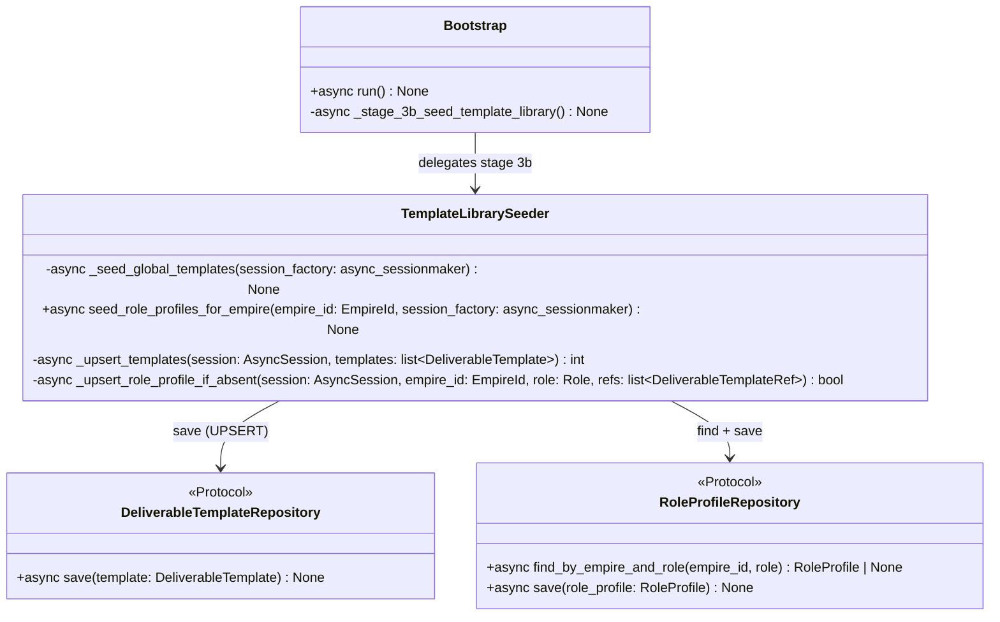

# 詳細設計書

> feature: `deliverable-template` / sub-feature: `template-library`
> 関連: [basic-design.md](basic-design.md) / [`docs/features/persistence-foundation/detailed-design.md`](../../persistence-foundation/) / [`docs/features/deliverable-template/repository/detailed-design.md`](../repository/detailed-design.md)

## 記述ルール（必ず守ること）

詳細設計に**疑似コード・サンプル実装（python/ts/sh/yaml 等の言語コードブロック）を書かない**。
ソースコードと二重管理になりメンテナンスコストしか生まない。
必要なのは「構造契約（属性名・型・制約）」と「確定文言（メッセージ文字列）」と「実装の意図」。

## クラス設計（詳細）

### Class: TemplateLibrarySeeder（`application/services/template_library/seeder.py`）

**設計原則**: application 層のサービスクラス。Repository Protocol のみに依存し、具体的な SQLite 実装を知らない。コンストラクタは持たず、全メソッドが `session_factory` を受け取る（UoW 境界を外部に開放せず、自らで `async with session.begin():` を管理する）。

| メソッド | 引数 | 戻り値 | 制約 |
|----|----|----|----|
| `_seed_global_templates(session_factory)` | `async_sessionmaker[AsyncSession]` | `None` | `WELL_KNOWN_TEMPLATES` 全 12 件を 1 トランザクションで UPSERT。1 件でも失敗したら全ロールバック（§確定 E）|
| `seed_role_profiles_for_empire(empire_id, session_factory)` | `EmpireId`, `async_sessionmaker[AsyncSession]` | `None` | LEADER / DEVELOPER / TESTER / REVIEWER の 4 件を処理。各 Role に対して `find_by_empire_and_role` で存在確認 → なければ save、あれば skip（§確定 F）|
| `_upsert_templates(session, templates)` | `AsyncSession`, `list[DeliverableTemplate]` | `int`（upserted 件数） | 各テンプレートに対して `SqliteDeliverableTemplateRepository(session).save(t)` を呼ぶ |
| `_upsert_role_profile_if_absent(session, empire_id, role, refs)` | `AsyncSession`, `EmpireId`, `Role`, `list[DeliverableTemplateRef]` | `bool`（True: saved / False: skipped） | 存在確認 → RoleProfile 構築 → save または skip |

### Module: definitions.py（`application/services/template_library/definitions.py`）

**設計原則**: 副作用のない純粋なデータ定数モジュール。`import` しても DB 接続や I/O は発生しない。`DeliverableTemplate.model_validate()` で構築済みの Aggregate インスタンスを保持する。

#### BAKUFU_TEMPLATE_NS（§確定 C）

固定 UUID（`uuid.UUID("ba4a2f00-cafe-1234-dead-beefcafe0001")`）。全 well-known テンプレートの UUID5 算出に使う名前空間。ソースコードで管理し、変更禁止（変更すると全テンプレートの UUID が変わり既存 DB レコードと乖離する）。

#### BAKUFU_ROLE_NS（§確定 C）

固定 UUID（`uuid.UUID("ba4a2f00-cafe-1234-dead-beefcafe0002")`）。Empire-scope RoleProfile の UUID5 算出に使う名前空間（empire_id + role を組み合わせる）。

#### WELL_KNOWN_TEMPLATES — 12 件の確定定義（§確定 A）

| slug | Role | name | type | version | 成果物の意図 |
|---|---|---|---|---|---|
| `leader-plan` | LEADER | 計画書 | MARKDOWN | 1.0.0 | タスクの背景・目標・スコープ・マイルストーンを記述する計画文書 |
| `leader-priority` | LEADER | 優先度判定レポート | MARKDOWN | 1.0.0 | 複数候補の優先順位を比較根拠とともに記述するレポート |
| `leader-stakeholder` | LEADER | ステークホルダ報告 | MARKDOWN | 1.0.0 | 進捗・リスク・決定事項を人間向けに要約する報告文書 |
| `dev-design` | DEVELOPER | 設計書 | MARKDOWN | 1.0.0 | システム設計・データモデル・コンポーネント構成を記述する設計文書 |
| `dev-adr` | DEVELOPER | ADR | MARKDOWN | 1.0.0 | Architecture Decision Record — 決定の背景・選択肢・根拠を記録 |
| `dev-acceptance` | DEVELOPER | 受入条件 | MARKDOWN | 1.0.0 | 機能の受入基準（Given / When / Then 形式推奨）を記述する文書 |
| `dev-impl-pr` | DEVELOPER | 実装 PR | MARKDOWN | 1.0.0 | Pull Request の概要・変更点・テスト方法・レビュー観点を記述 |
| `dev-lib-readme` | DEVELOPER | ライブラリ README | MARKDOWN | 1.0.0 | ライブラリの目的・インストール・使用例・API リファレンスを記述 |
| `tester-testdesign` | TESTER | テスト設計書 | MARKDOWN | 1.0.0 | テスト戦略・テストケース（TC-XX-NNN）・カバレッジ方針を記述 |
| `tester-report` | TESTER | テスト結果報告書 | MARKDOWN | 1.0.0 | テスト実施結果・バグ件数・品質評価を記述する報告文書 |
| `tester-regression` | TESTER | 回帰スイート定義 | MARKDOWN | 1.0.0 | 回帰テスト対象範囲・実行条件・合否基準を記述する文書 |
| `reviewer-review` | REVIEWER | コードレビュー報告 | MARKDOWN | 1.0.0 | コード品質・設計上の問題・改善提案を構造化して記述する報告 |

**注**: `品質メトリクス` および `改善提案` は Issue #124 の scope 説明にあるが、それぞれ `tester-report`（品質メトリクスを含む）および `reviewer-review`（改善提案を含む）に統合した。独立テンプレートとして分離する場合は MINOR バージョンアップ（v1.1.0）で追加する。

各テンプレートの `id` は `UUID5(BAKUFU_TEMPLATE_NS, slug)` で算出する（§確定 C）。`acceptance_criteria` は初期版では空（`()`）。将来 bakufu 自身の品質基準を Criterion として追加する際は MINOR バージョンアップで対応する。

#### PRESET_ROLE_TEMPLATE_MAP — 4 件の確定定義（§確定 B）

| Role | 参照テンプレート（minimum_version=1.0.0） |
|---|---|
| LEADER | 計画書 / 優先度判定レポート / ステークホルダ報告 |
| DEVELOPER | 設計書 / ADR / 受入条件 / 実装 PR / ライブラリ README |
| TESTER | テスト設計書 / テスト結果報告書 / 回帰スイート定義 |
| REVIEWER | コードレビュー報告 |

各 `DeliverableTemplateRef.minimum_version = SemVer(major=1, minor=0, patch=0)`。

### Class: Bootstrap — Stage 3b 追加（`infrastructure/bootstrap.py` 既存更新）

| 変更種別 | 変更内容 |
|---|---|
| メソッド追加 | `async _stage_3b_seed_template_library(self) -> None` を `_stage_3_migrate()` と `_stage_4_pid_gc()` の間に追加 |
| `run()` 更新 | `await self._stage_3_migrate()` の直後に `await self._stage_3b_seed_template_library()` を挿入 |
| ログ形式 | `[INFO] Bootstrap stage 3b/8: seeding template-library (N templates)...` / `[INFO] Bootstrap stage 3b/8: template-library seed complete (upserted=N)` |
| エラー時 | `TemplateLibrarySeeder` が raise した例外を `BakufuConfigError` でラップ（起動中断） |

`_stage_3b_seed_template_library()` は `session_factory` が `None` の場合（Stage 2 失敗時）を `pragma: no cover — stage ordering` でガードする（既存 Stage と同パターン）。

## 確定事項（先送り撤廃）

### 確定 A: WELL_KNOWN_TEMPLATES 12 件の定義（凍結）

§クラス設計の `WELL_KNOWN_TEMPLATES` テーブル参照。slug / Role / name / type / version / 成果物意図を凍結する。`acceptance_criteria` 初期値は空。`composition` は空（単独テンプレート）。バージョンは全件 `1.0.0`。

将来の変更ルール:
- 既存テンプレートへの AcceptanceCriterion 追加 → `minor` を +1（1.1.0）
- スキーマ構造の破壊的変更（TemplateType 変更等） → `major` を +1（2.0.0）
- テンプレートの削除は禁止（参照中の DeliverableTemplateRef が破損するリスクがある）

### 確定 B: PRESET_ROLE_TEMPLATE_MAP 4 件の定義（凍結）

§クラス設計の `PRESET_ROLE_TEMPLATE_MAP` テーブル参照。LEADER / DEVELOPER / TESTER / REVIEWER の 4 Role が対象。UX / SECURITY / ASSISTANT 等の他 Role は Issue #124 スコープ外（Post-MVP）。

将来 Role 追加時の手順:
1. `WELL_KNOWN_TEMPLATES` に対応 slug のテンプレートを追加（MINOR up）
2. `PRESET_ROLE_TEMPLATE_MAP` に新 Role エントリを追加
3. 新規 Empire へは自動適用、既存 Empire は既存 RoleProfile の skip 設定により影響なし

### 確定 C: 固定 UUID 名前空間（変更禁止）

| 定数 | 値 | 用途 |
|---|---|---|
| `BAKUFU_TEMPLATE_NS` | `UUID("ba4a2f00-cafe-1234-dead-beefcafe0001")` | `UUID5(BAKUFU_TEMPLATE_NS, slug)` で各テンプレートの id を生成 |
| `BAKUFU_ROLE_NS` | `UUID("ba4a2f00-cafe-1234-dead-beefcafe0002")` | `UUID5(BAKUFU_ROLE_NS, f"{empire_id}:{role.value}")` で RoleProfile id を生成 |

**変更禁止理由**: 名前空間を変更すると UUID5 の算出値が変わり、既存 DB レコードの `id` と乖離する。旧テンプレートが DB に孤立し、参照中の `DeliverableTemplateRef` が dangling reference になる。

**衝突安全性**: UUID5 の出力空間は 2^122 ≒ 5 × 10^36。12 件のテンプレートで誕生日問題が発生する確率は事実上ゼロ。CEO 作成テンプレートとの衝突可能性については basic-design.md §セキュリティ設計 T2 を参照。

### 確定 D: UPSERT は definitions.py 定義で上書き（§確定 E との組み合わせ）

`_seed_global_templates()` は `DO UPDATE SET name=EXCLUDED.name, description=EXCLUDED.description, ...` で全フィールドを上書きする。理由:

- bakufu バージョンアップ時にテンプレートの schema / description が更新された場合、起動時 UPSERT で DB を最新版に同期する必要がある
- CEO が well-known テンプレートを直接編集した場合、その変更は起動時に上書きされる。CEO が独自カスタマイズを保持したい場合は別 UUID の新規テンプレートを作成するフローを推奨する（HTTP API で POST /deliverable-templates）

**例外**: `acceptance_criteria_json` は初期 definitions では `[]` だが、CEO が手動で AcceptanceCriterion を追加した場合でも、次回起動時に `[]` で上書きされる。これは MVP 範囲の既知動作とする。将来、「ユーザー追加 AcceptanceCriterion を保持しつつ schema のみ同期」する精密 UPSERT が必要になった場合は MINOR バージョンアップで対応する（YAGNI）。

### 確定 E: _seed_global_templates の Tx 戦略（all-or-nothing）

12 件全体を 1 つの `async with session.begin():` ブロックで UPSERT する。1 件でも失敗した場合は全ロールバック → `BakufuConfigError` で Bootstrap 起動中断。

理由:
- 部分的な seed 状態（N 件成功、M 件失敗）は、既定 RoleProfile が参照するテンプレートが存在しない dangling reference 状態を生み出す
- Fail Fast: 起動失敗の方が、不整合な DB を持ち続けるより安全

### 確定 F: seed_role_profiles_for_empire のスキップ戦略

既存 RoleProfile が存在する場合は UPSERT せず skip する。理由:

- CEO が意図的に LEADER の RoleProfile を変更した場合、プリセット適用で上書きすることは CEO の業務判断を破壊する
- seed_role_profiles_for_empire はオプトイン（明示的呼び出し）。無意識の上書きリスクを避けるため skip が安全方向

**TOCTOU 対策**: `find_by_empire_and_role()` による存在確認と `save()` の間に別トランザクションが先行 INSERT するレースコンディション（TOCTOU）が理論上発生しうる。この場合、`UNIQUE(empire_id, role)` 制約違反 `IntegrityError` が raise される。`_upsert_role_profile_if_absent()` はこの `IntegrityError` を catch して skip 扱い（戻り値 `False`）にする。「既に存在する → skip」という意味論と一致するため安全方向の処理となる。

**運用ガイド**: 全プリセットを強制再適用したい場合は、対象 Role の RoleProfile を手動削除（HTTP DELETE）してから再呼び出しする。

### 確定 G: TemplateType は全件 MARKDOWN（MVP 範囲）

ai-team の ai-team-jp 暗黙知は自然言語ドキュメント。JSON_SCHEMA / OPENAPI / CODE_SKELETON / PROMPT は将来の拡張（MINOR バージョンアップ）で追加する。MVP では MARKDOWN + plain text schema（自然言語ガイドライン）で充足する。

### 確定 H: _seed_global_templates は Bootstrap のみが呼ぶ

`TemplateLibrarySeeder._seed_global_templates()` は Bootstrap `_stage_3b_seed_template_library()` からのみ呼ばれることを設計上の前提とする。HTTP API エンドポイントから外部公開しない（CEO が意図せず再 seed を走らせることで DB が上書きされるリスクを避ける）。`seed_role_profiles_for_empire()` は HTTP API / CLI から呼べる（オプトイン + skip 戦略のため安全）。

**プライベート化の強制**:
- メソッド名に単一アンダースコアプレフィックス（`_seed_global_templates`）を付与し、Python 慣習上 private であることを明示する
- `seeder.py` の `__all__` に `_seed_global_templates` を含めない（`TemplateLibrarySeeder` クラスのみ公開）
- 呼び出し元は `Bootstrap._stage_3b_seed_template_library()` に限定する設計を `basic-design.md §REQ-TL-002` で凍結済み

## データ構造（永続化キー）

新規テーブルなし。`deliverable_templates` / `role_profiles` テーブルは [`../repository/detailed-design.md §データ構造`](../repository/detailed-design.md) を参照。

### definitions.py の論理データ構造

| 定数名 | Python 型 | 生成タイミング | 内容 |
|---|---|---|---|
| `BAKUFU_TEMPLATE_NS` | `uuid.UUID` | import 時（即値） | 名前空間固定 UUID |
| `BAKUFU_ROLE_NS` | `uuid.UUID` | import 時（即値） | 名前空間固定 UUID |
| `WELL_KNOWN_TEMPLATES` | `tuple[DeliverableTemplate, ...]` | import 時（`model_validate` 呼び出し済み） | 12 件の構築済み Aggregate インスタンス |
| `PRESET_ROLE_TEMPLATE_MAP` | `dict[Role, list[DeliverableTemplateRef]]` | import 時（即値） | Role → DeliverableTemplateRef リストのマッピング |

`WELL_KNOWN_TEMPLATES` は module import 時に 12 件全件の `DeliverableTemplate.model_validate()` を実行する。definitions.py に不正なデータが含まれる場合、import 時に `DeliverableTemplateInvariantViolation` が発生してプロセスが落ちる（Fail Fast at import）。

## Known Issues

| # | 問題 | 影響範囲 | 対応方針 |
|---|------|---------|---------|
| KI-TL-001 | CEO が手動編集した well-known テンプレートの AcceptanceCriterion が再起動時に消える（§確定 D） | CEO が既定テンプレートをカスタマイズする場合 | MVP 範囲での既知動作。将来「ユーザー追加 AcceptanceCriterion 保持 + schema 同期」精密 UPSERT を別 Issue で対応（YAGNI） |

## 設計判断の補足

### なぜ startup event（Bootstrap Stage 3b）を採用したか

OQ-4 の決定（Issue #142 → ジェンセン 決定）。採用根拠:

1. **コード管理が正**: テンプレート定義はアプリ設定に近い性質。Git で追跡でき、PR レビューで変更が可視化される。Alembic data migration はデータ変更を SQL で記述するが、Pydantic Aggregate の不変条件チェックが通らない
2. **再起動整合性**: Alembic migration が HEAD に達した後に seed が走るため、DB スキーマとテンプレート定義の整合が常に保たれる
3. **Alembic 肥大化回避**: data migration（INSERT）を versions/ に入れると migration チェーンが長くなるほど "Alembic upgrade head" が遅くなる。テンプレート件数が増えるほど顕著になる
4. **冪等性**: UPSERT により再起動・再デプロイで副作用がない

採用しなかった代替案（Alembic data migration）の欠点:
- `0013_template_library_seed.py` のような data migration を書くと、domain Aggregate の不変条件（`DeliverableTemplate.model_validate()`）を bypass してデータを直接 SQL INSERT することになる。Pydantic モデルが変化した際に migration を遡及修正できない

### なぜ seed_role_profiles_for_empire を Bootstrap で自動実行しないか

`RoleProfile` は Empire スコープのため、「どの Empire に適用するか」が Bootstrap 時点では不明（複数 Empire が存在しうる）。Bootstrap はグローバル（全 Empire 共通）の `DeliverableTemplate` のみを seed し、Empire スコープの操作は呼び出し元（HTTP API / CLI）に委ねる。

将来 Empire 作成イベントをトリガーに自動適用する場合は、Outbox パターン（Stage 6: Outbox Dispatcher）経由で EventHandler として実装する（別 Issue）。

## ユーザー向けメッセージの確定文言

| 状況 | メッセージ |
|-----|---------|
| seed 完了（Bootstrap ログ） | `[INFO] Bootstrap stage 3b/8: template-library seed complete (upserted=12)` |
| seed 開始（Bootstrap ログ） | `[INFO] Bootstrap stage 3b/8: seeding template-library (12 templates)...` |
| RoleProfile skip（INFO ログ） | `[INFO] stage 3b: skip preset RoleProfile for {role} in empire {empire_id} (already exists)` |
| RoleProfile saved（INFO ログ） | `[INFO] stage 3b: saved preset RoleProfile for {role} in empire {empire_id}` |
| seed 失敗（FATAL ログ） | `[FAIL] Bootstrap stage 3b/8: template-library seed failed: {exc.__class__.__name__}: {exc}` |

## API エンドポイント詳細

`seed_role_profiles_for_empire()` の呼び出し経路（HTTP API エンドポイント）は Issue #124 スコープに含まれるが、具体的なエンドポイント設計（パス / リクエスト形式 / レスポンス形式）は [`../http-api/basic-design.md`](../http-api/basic-design.md)（Issue #122 実装済み）の拡張として別 PR で定義する。

本 PR（Issue #124）のスコープ: `TemplateLibrarySeeder.seed_role_profiles_for_empire()` のロジック実装のみ。HTTP エンドポイント配線は別 PR。

| エンドポイント | 状況 | 担当 |
|---|---|---|
| `POST /api/empires/{empire_id}/seed-templates` | 未実装（別 PR） | http-api 拡張 |

## 出典・参考

- [Python `uuid` 標準ライブラリ — uuid.uuid5](https://docs.python.org/3/library/uuid.html#uuid.uuid5)
- [SQLAlchemy 2.0 — INSERT with ON CONFLICT](https://docs.sqlalchemy.org/en/20/dialects/sqlite.html#insert-on-conflict)
- [`docs/features/deliverable-template/repository/detailed-design.md`](../repository/detailed-design.md) — §確定 B UPSERT パターン真実源
- [`docs/features/persistence-foundation/`](../../persistence-foundation/) — Bootstrap Stage パターン
- [`docs/features/deliverable-template/feature-spec.md`](../feature-spec.md) — §11 OQ-4 解決根拠（Issue #142 ジェンセン決定）
