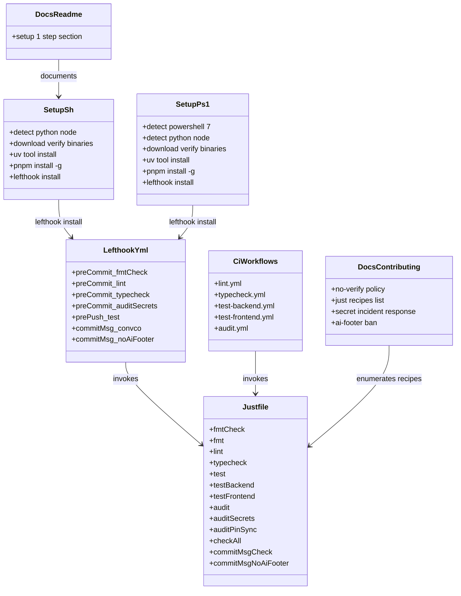
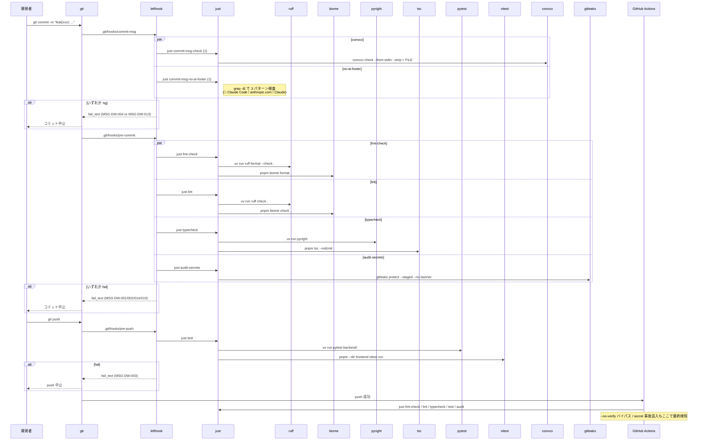
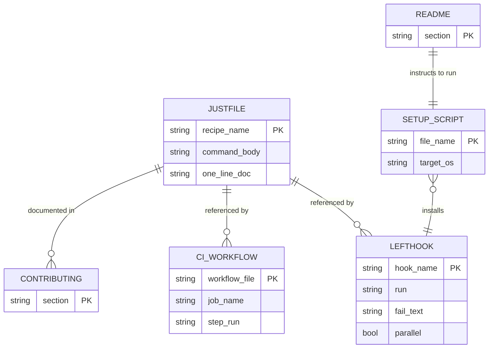

# 基本設計書 — dev-workflow / domain

> feature: `dev-workflow` / sub-feature: `domain`
> 親 spec: [`../feature-spec.md`](../feature-spec.md) §9 受入基準 1〜13 / §10 Q-1〜Q-6

## §モジュール契約（機能要件）

| 要件ID | 概要 | 入力 | 処理 | 出力 | エラー時 | 親 spec 参照 |
|--------|------|------|------|------|---------|-------------|
| REQ-DW-001 | フックツール導入（lefthook） | `lefthook install` または setup スクリプト経由 | `lefthook.yml` を読み `.git/hooks/{pre-commit,pre-push,commit-msg}` を生成 | フックが有効化された状態 | lefthook バイナリ未検出 → setup スクリプト案内つき exit 非 0 | §9 AC#1 |
| REQ-DW-002 | pre-commit フック | `git commit` 実行（`--no-verify` 非指定） | `just fmt-check` / `just lint` / `just typecheck` / `just audit-secrets` を並列実行 | 全成功: コミット続行 / 失敗: コミット中止 + MSG-DW-001/002/014/010 | exit 非 0 でコミット中止 | §9 AC#2, AC#11 |
| REQ-DW-003 | pre-push フック | `git push` 実行（`--no-verify` 非指定） | `just test` を実行（pytest + vitest） | 成功: push 続行 / 失敗: push 中止 + MSG-DW-003 | exit 非 0 で push 中止 | §9 AC#3 |
| REQ-DW-004 | commit-msg フック（Conventional Commits） | `.git/COMMIT_EDITMSG` | `convco check --from-stdin --strip < {1}` でメッセージを規約に照合 | 適合: 続行 / 不適合: 中止 + MSG-DW-004 | exit 非 0 | §9 AC#4 |
| REQ-DW-005 | タスクランナー導入（just） | `just <recipe>` または `just --list` | `justfile` を読み、該当レシピのコマンドを実行 | レシピ実行結果 / `just --list` は全 13 レシピを 1 行コメントつきで列挙 | レシピ未定義: just が usage 表示 exit 非 0 | §9 AC#10 |
| REQ-DW-006 | CI との単一実行経路化 | GitHub Actions workflow job の `run:` | lint / typecheck / test-backend / test-frontend / audit 5 ワークフローの直接ツール呼び出しを `just <recipe>` に置換 + `bash scripts/setup.sh --tools-only` を先頭ステップに追加 | ローカルフック / 手動 `just <recipe>` / CI が同一レシピ呼び出し経路で実行される状態 | `just` バイナリ未インストール: workflow ステップが fail | §9 AC#5 |
| REQ-DW-007 | setup スクリプト（Unix, `scripts/setup.sh`） | `bash scripts/setup.sh [--tools-only]` | (1) リポジトリルート検査 (2) python3/node ランタイム検査 (3) GitHub Releases バイナリ（uv/just/convco/lefthook/gitleaks）SHA256 検証導入 (4) `uv tool install` で ruff/pyright/pip-audit (5) `pnpm install -g` で biome/osv-scanner (6) `--tools-only` 非指定時のみ `lefthook install` (7) MSG-DW-005 表示 | exit 0 + MSG-DW-005 | 各ステップ失敗で即 exit（`set -euo pipefail`） | §9 AC#1, AC#6, AC#7 |
| REQ-DW-008 | setup スクリプト（Windows, `scripts/setup.ps1`） | `pwsh scripts/setup.ps1 [-ToolsOnly]`（PowerShell 7+ 必須） | ステップ 0: PowerShell 7+ 検査 → 以降は REQ-DW-007 と同等ロジックを PowerShell で表現 | REQ-DW-007 と同様 | REQ-DW-007 と同様 | §9 AC#1, AC#7 |
| REQ-DW-009 | 冪等性 | setup スクリプトの連続再実行 | 各ツールについて存在確認 → 存在時はスキップ / `lefthook install` は冪等 | 2 回目以降は MSG-DW-006 を出して 0 秒で完了 | 初回エラーは通常通り Fail Fast | §9 AC#6 |
| REQ-DW-010 | README / CONTRIBUTING 更新 | 設計確定 + Sub-issue C 完了後の PR | README.md §ビルド方法 / CONTRIBUTING.md §開発環境セットアップを更新 | setup 手順・`just` レシピ・`--no-verify` 禁止ポリシー・AI 生成フッター禁止ポリシーが追記された状態 | 該当なし（ドキュメント変更のみ） | §9 AC#9 |
| REQ-DW-011 | `--no-verify` バイパス検知 | GitHub への push | CI の lint / typecheck / test-backend / test-frontend / audit が同一レシピを再実行 | CI ランで結果が可視化される / 規約違反は PR レビューで却下 | CI ジョブが非 0 終了 → PR マージ不可 | §9 AC#8 |
| REQ-DW-012 | フック失敗時のメッセージ品質 | pre-commit / pre-push / commit-msg いずれかの失敗 | lefthook の `fail_text` で `[FAIL] <原因要約>` / `次のコマンド: just <recipe>` の **2 行固定構造**を静的文字列として定義 | stderr に最終 2 行が固定構造で出力 | 該当なし（メッセージ表示自体は exit コードに影響しない） | §9 AC#11 |
| REQ-DW-013 | Secret 混入検知 pre-commit フック | `git commit` 実行時の staged 差分 | `gitleaks protect --staged --no-banner` で staged 差分を汎用 secret パターンでスキャン | pass: コミット続行 / 検出: 中止 + MSG-DW-010 | exit 非 0 | §9 AC#12 |
| REQ-DW-014 | PowerShell 7+ 必須化 | `setup.ps1` 起動時の `$PSVersionTable.PSVersion` | `Major -lt 7` を検出したら Fail Fast + `winget install Microsoft.PowerShell` 案内 | 条件不一致: exit 非 0 + MSG-DW-011 / 条件一致: 後続ステップ続行 | 該当なし（Fail Fast 自体がエラー経路） | §9 AC#13 |
| REQ-DW-015 | 開発ツールバイナリの完全性検証 | setup スクリプト実行時（当該ツールが未インストールの場合） | (1) SHA256 ピン定数参照 (2) バイナリダウンロード (3) sha256sum/Get-FileHash で照合 (4) 不一致なら削除 + MSG-DW-012 + Fail Fast (5) 一致なら配置 | 検証成功: `~/.local/bin/` または `$env:USERPROFILE\.local\bin\` に配置 | MSG-DW-012 + 一時ファイル削除 | §10 Q-1 |
| REQ-DW-016 | 開発ワークフロー設定ファイルの CODEOWNERS 保護 | `.github/CODEOWNERS` への追記 | `/lefthook.yml` / `/justfile` / `/scripts/setup.sh` / `/scripts/setup.ps1` / `/scripts/ci/` を CODEOWNERS に登録 | 該当ファイルを含む PR でオーナーのレビュー要求が生成される | 該当なし | §10 Q-2 |
| REQ-DW-017 | Git 履歴からの secret リムーブ運用 | push 済みコミットに secret 混入が判明した場合 | CONTRIBUTING.md の該当節で 3 段階手順を規定: (a) **即 revoke**（該当キーを発行元で失効）(b) `git filter-repo --path <file> --invert-paths` で履歴から該当ファイルを除去し force-push を対象ブランチに対してのみ実施（`main` / `develop` は対象外、release 前の feature ブランチ限定）(c) GitHub Support に cache purge 依頼、secret scanning の alert を resolve | CONTRIBUTING.md §Secret 混入時の緊急対応 に手順が明文化された状態 | 該当なし（運用手順の文書化のみ） | §10 Q-3 |
| REQ-DW-018 | AI 生成フッターのコミットメッセージ混入禁止 | commit-msg フックから渡される `.git/COMMIT_EDITMSG` | `just commit-msg-no-ai-footer {1}` が case-insensitive な拡張正規表現で 3 パターン検査（🤖+Generated+Claude / Co-Authored-By:+@anthropic.com / Co-Authored-By:+\bClaude\b） | 非ヒット: exit 0 / ヒット: exit 非 0 + MSG-DW-013 | exit 非 0 | §10 Q-4 |

## 記述ルール（必ず守ること）

基本設計に**疑似コード・サンプル実装（python/ts/go等の言語コードブロック）を書くな**。
ソースコードと二重管理になりメンテナンスコストしか生まない。

## モジュール構成

本 feature は bakufu のドメインコード（`backend/` / `frontend/`）を追加せず、**リポジトリルート直下の設定ファイル群**と **`scripts/` のセットアップスクリプト**のみで構成される。`backend/` / `frontend/` には一切触れない。

| 機能ID | モジュール | ディレクトリ | 責務 |
|--------|----------|------------|------|
| REQ-DW-001, 002, 003, 004, 012, 013, 018 | `lefthook.yml` | リポジトリルート | Git フック定義（pre-commit / pre-push / commit-msg）と静的 `fail_text`（2 行構造）。commit-msg は `convco` と `no-ai-footer` の 2 コマンド並列 |
| REQ-DW-005, 018 | `justfile` | リポジトリルート | タスクランナー定義。fmt-check / fmt / lint / typecheck / test / test-backend / test-frontend / audit / audit-secrets / audit-pin-sync / check-all / commit-msg-check / commit-msg-no-ai-footer のレシピ集約 |
| REQ-DW-006 | `.github/workflows/*.yml`（新規 5 本） | `.github/workflows/` | CI ワークフロー（`lint` / `typecheck` / `test-backend` / `test-frontend` / `audit`）から `just <recipe>` を呼ぶ形に統一 |
| REQ-DW-007, 015 | `scripts/setup.sh` | `scripts/` | Unix 向けセットアップ。Python/Node ランタイム検知 → GitHub Releases バイナリ（`uv` / `just` / `convco` / `lefthook` / `gitleaks`）を SHA256 検証つきで配置 → `uv tool install` で Python ツール → `pnpm install -g` で Node ツール → `lefthook install` |
| REQ-DW-008, 014, 015 | `scripts/setup.ps1` | `scripts/` | Windows 向け。PowerShell 7+ 検査 → 以降は `setup.sh` と同等ロジック |
| REQ-DW-006（追加契約） | `scripts/ci/audit-pin-sync.sh` | `scripts/ci/` | `setup.sh` / `setup.ps1` の `<TOOL>_VERSION` / `<TOOL>_SHA256_*` 定数の同期検査。乖離があれば exit 非 0 |
| REQ-DW-010, 017, 018 | `README.md`, `CONTRIBUTING.md` | リポジトリルート | setup 1 ステップ、`--no-verify` 禁止ポリシー、Secret 混入時の緊急対応手順、AI 生成フッター禁止ポリシーを記載 |
| REQ-DW-011 | 既存 CI（`lint.yml` 他 5 本）| `.github/workflows/` | 同一 `just <recipe>` を CI 側でも再実行（バイパス検知） |
| REQ-DW-013 | `gitleaks` 設定（`.gitleaks.toml` は初期採用せずデフォルトルールのみ使用） | リポジトリルート | 汎用 secret パターン（API キー / AWS / GCP 等）の staged diff スキャン。除外ルールが必要になった時点で `.gitleaks.toml` を Sub-issue で追加（YAGNI） |
| REQ-DW-016 | `.github/CODEOWNERS` | `.github/` | `/lefthook.yml`、`/justfile`、`/scripts/setup.sh`、`/scripts/setup.ps1`、`/scripts/ci/` を保護対象に追記 |

```
ディレクトリ構造（本 feature で追加・変更されるファイル）:
.
├── lefthook.yml                         [新規, CODEOWNERS保護]
├── justfile                             [新規, CODEOWNERS保護]
├── scripts/
│   ├── setup.sh                         [新規, CODEOWNERS保護]
│   ├── setup.ps1                        [新規, CODEOWNERS保護]
│   └── ci/                              [新規, CODEOWNERS保護]
│       └── audit-pin-sync.sh            [新規: ピン同期検査]
├── .github/
│   ├── CODEOWNERS                       [編集: dev-workflow関連5パスを既存記述に追加]
│   └── workflows/
│       ├── lint.yml                     [新規: just fmt-check + just lint]
│       ├── typecheck.yml                [新規: just typecheck]
│       ├── test-backend.yml             [新規: just test-backend]
│       ├── test-frontend.yml            [新規: just test-frontend]
│       └── audit.yml                    [新規: just audit + just audit-secrets + just audit-pin-sync]
├── README.md                            [編集: setup 1ステップ / PowerShell 7+必須]
└── CONTRIBUTING.md                      [編集: --no-verify禁止 / Secret 混入時の緊急対応 / just レシピ一覧]
```

## クラス設計（概要）

本 feature はランタイムクラスを持たない。代わりに「設定ファイル間の参照関係」を同等の図として示す。



**凝集のポイント**:
- **`justfile` が単一の真実源**（SSoT）。フック / CI / 開発者手動操作のいずれも同じレシピを呼ぶ（DRY）
- **依存方向は一方向**: setup → lefthook → justfile、CI → justfile。`justfile` は他設定を参照しない最下層
- **ドキュメントは参照のみ**: README / CONTRIBUTING は設定ファイルを書き換えず、記述だけ同期する

## 処理フロー

### REQ-DW-001〜004, 012, 013, 014, 018: 開発者の通常フロー（コミットから push まで）

1. 開発者が作業ツリーでファイルを変更
2. `git add` → `git commit -m "feat(xxx): ..."`
3. `commit-msg` フックが発火 → **`just commit-msg-check {1}`（convco 検証）と `just commit-msg-no-ai-footer {1}`（AI 生成フッター検出）を並列実行**
4. convco 規約違反: MSG-DW-004 で中止 / AI フッター検出: MSG-DW-013 で中止（両方違反時は lefthook が両方の `fail_text` を表示）
5. 両者 OK: 続いて `pre-commit` フックが発火 → **`just fmt-check` / `just lint` / `just typecheck` / `just audit-secrets` を並列実行**（`parallel: true`）
6. fmt 違反: MSG-DW-001 で中止
7. lint 違反: MSG-DW-002 で中止
8. typecheck 違反: MSG-DW-014 で中止
9. secret 検出: MSG-DW-010 で中止。検出箇所は `file:line` 形式で stderr
10. 全成功: コミット完了
11. `git push` → `pre-push` フック発火 → `just test` 実行
12. テスト失敗: MSG-DW-003 で中止
13. テスト成功: push 実行 → GitHub Actions が同一 `just <recipe>` を再実行（`--no-verify` バイパス時の最終検知）

#### 再判定条件（typecheck の配置層）

設計時の判断: **pre-commit に typecheck を含める**。MVP 後にドメイン規模が拡大して以下のいずれかが観測された場合、本書を更新して typecheck を pre-push に移動する:

- pre-commit の所要時間が **5 秒**を超え、かつ typecheck 単体で **3 秒**を超える
- 開発者から「pre-commit が遅い」というフィードバックが 2 件以上 Issue で寄せられる

移動先候補は (a) pre-push に追加、または (b) `pyright --outputjson` で staged ファイル相当の差分のみ検査する形に切り替え（実装難度高、YAGNI）。

### REQ-DW-007〜009, 014, 015: 新規参画者のセットアップフロー

1. `git clone https://github.com/bakufu-dev/bakufu.git`
2. `cd bakufu`
3. Unix: `bash scripts/setup.sh` / **Windows: `pwsh scripts/setup.ps1`**（PowerShell 7+ 必須）を実行
4. **Windows のみ**: `setup.ps1` 冒頭で `$PSVersionTable.PSVersion.Major -lt 7` 検査 → 不一致なら MSG-DW-011 で Fail Fast、`winget install Microsoft.PowerShell` を案内
5. `.git/` 存在確認 → 無ければ MSG-DW-009 で Fail Fast
6. `python3 --version`（3.12+）/ `node --version`（20+）検査 → 失敗時は MSG-DW-008
7. **GitHub Releases バイナリ**（`uv` / `just` / `convco` / `lefthook` / `gitleaks`）をダウンロード（URL は `{VERSION}` と `{PLATFORM}` を setup スクリプトのピン定数から合成）→ `sha256sum` / `Get-FileHash` で実測値を取得 → setup スクリプトのピン値と照合 → 不一致なら MSG-DW-012 で Fail Fast、一致なら `~/.local/bin/`（Windows は `$env:USERPROFILE\.local\bin\`）へ配置
8. `uv tool install ruff pyright pip-audit` 実行（既にあれば MSG-DW-006）
9. `corepack enable` で `pnpm` 有効化 → `pnpm install -g @biomejs/biome osv-scanner` 実行
10. `lefthook install` 実行（`.git/hooks/` へラッパを配置、`--tools-only` 指定時はスキップ）
11. MSG-DW-005 を表示して exit 0

### REQ-DW-006, 011: CI 側の実行フロー

1. PR / push トリガで各ワークフローが起動
2. 共通ステップ: `actions/checkout@v4` → **`bash scripts/setup.sh --tools-only`**（lefthook install を skip して開発者ツールのみ配置）
3. ワークフロー固有ステップ: `just <recipe>`（例: `lint.yml` は `just fmt-check` と `just lint`）
4. いずれか失敗で job が fail。`--no-verify` でバイパスした場合もここで必ず検知

## シーケンス図



## アーキテクチャへの影響

`docs/design/tech-stack.md` に **§開発ワークフロー（Git フック / タスクランナー）** セクションを追加する（同一 PR で更新）。内容:

- 採用: `lefthook` / `just` / `convco` / `gitleaks` / `uv` / `ruff` / `pyright` / `biome` / `osv-scanner` の 9 ツール
- 不採用候補と却下根拠（pre-commit / husky / commitlint / mypy / eslint+prettier / flake8 / black / npm audit / safety / Makefile / npm scripts / tox / nox / core.hooksPath）
- セットアップ経路: `scripts/setup.{sh,ps1}` の 1 ステップ方式
- CI ワークフローとローカルフックが **同一 `just <recipe>` を参照**する DRY 原則
- 全ツールバイナリを **GitHub Releases + SHA256 検証で統一導入**する一貫性

`docs/design/domain-model.md` には影響しない（本 feature は配布バイナリに含まれない開発者ツールチェーンのみ）。

## 外部連携

| 連携先 | 目的 | 認証 | タイムアウト / リトライ |
|-------|------|-----|--------------------|
| GitHub Releases | `uv` / `just` / `convco` / `lefthook` / `gitleaks` バイナリの取得 | 不要（公開 release） | curl / Invoke-WebRequest のデフォルト。失敗時は Fail Fast で setup スクリプト中断 |
| pypi.org | `uv tool install` 経由で `ruff` / `pyright` / `pip-audit` を取得 | 不要（公開 registry） | uv のデフォルト。失敗時は Fail Fast |
| npmjs.com | `pnpm install -g` 経由で `biome` / `osv-scanner` を取得 | 不要（公開 registry） | pnpm のデフォルト。失敗時は Fail Fast |
| GitHub Actions ランナー | CI 側での同ツール導入（`scripts/setup.sh --tools-only` を inline 実行） | GitHub 自動 | actions/checkout@v4 のキャッシュ | actions/cache@v4 でキャッシュ可能（後続 Issue で導入） |

**外部サービスの増設なし**: bakufu は元々 GitHub / pypi.org / npmjs.com に依存しており、本 feature は新規外部依存を持ち込まない。

## UX設計

本 feature の UX は「**開発者が Git 操作を普段通り行うだけで、ローカル検証が自動で走る**」こと。以下の体験を必ず保証する。

| シナリオ | 期待される挙動 |
|---------|------------|
| clone 直後に `git commit` | `scripts/setup.{sh,ps1}` が未実行なら、README 冒頭に「先に setup スクリプトを実行してください」の明示がある。setup 1 回で以後は自動 |
| コミット失敗時 | 失敗した検査名（**fmt / lint / typecheck / audit-secrets / convco / no-ai-footer** の 6 種）と **次に打つべきコマンド** が MSG-DW-001/002/014/010/004/013 の **2 行構造**（`[FAIL] <要約>` / `次のコマンド: <復旧 1 行>`）で表示される。長文の ruff / biome / pyright / tsc / gitleaks 出力に埋もれない |
| push 失敗時 | 失敗テスト名と `just test` コマンドが案内される |
| `just` レシピ一覧 | `just` を引数なしで実行すると `just --list` が走り、全レシピが 1 行コメントつきで表示 |
| Windows 開発者 | **PowerShell 7+ 必須**。`setup.ps1` 冒頭で `$PSVersionTable.PSVersion.Major -lt 7` を検査し、未満なら即 Fail Fast（MSG-DW-011、`winget install Microsoft.PowerShell` を案内） |
| `--no-verify` 使用 | CONTRIBUTING に「原則禁止。やむを得ない場合は PR 本文で理由を明記し、CI で代替検証」と記載 |

**アクセシビリティ方針**: 本 feature は CLI のみ。色付け出力は `just` / `lefthook` / `ruff` / `biome` / `pyright` のデフォルトに従い、色非対応端末でも `[FAIL]` / `[OK]` 等のテキストラベルで識別できる状態を維持する。

## セキュリティ設計

### 脅威モデル

| 想定攻撃者 | 攻撃経路 | 保護資産 | 対策 |
|-----------|---------|---------|------|
| **T1: 悪意のある PR 作者（内部バイパス）** | `--no-verify` でローカルフックをバイパスし、lint 違反・脆弱依存追加・secret 経路追加を push | bakufu のコード品質 | 全 CI ワークフロー（`lint` / `typecheck` / `test-backend` / `test-frontend` / `audit`）が同一 `just <recipe>` を再実行。`just audit` は `pip-audit` + `osv-scanner` を常時実行、`just audit-secrets` は pre-commit で追加実行 |
| **T2: 悪意ある secret コミッタ（水際突破）** | API キー / OAuth トークン / `.env` / 秘密鍵 を誤ってコミット。push 後は git history に残留し GitHub CDN にキャッシュされ得る | 開発者秘密情報、bakufu のエンドユーザー OAuth トークン、bakufu インフラ資源 | **pre-commit で gitleaks を実行（REQ-DW-013）**。CI 側でも同一チェックを再実行。push 後判明時は REQ-DW-017 の緊急対応手順（即 revoke → `git filter-repo` → secret scanning resolve）|
| **T3: サプライチェーン攻撃者（pypi.org 経路）** | `ruff` / `pyright` / `pip-audit` の悪意あるバージョンを pypi.org に混入 | 開発者ローカル環境（配布バイナリは無関係） | `uv tool install` でバージョンピン（`pyproject.toml` の dev dependency）。`pip-audit` の `advisories` チェックでレジストリ監査 |
| **T4: サプライチェーン攻撃者（GitHub Releases 経路）** | `uv` / `just` / `convco` / `lefthook` / `gitleaks` のリリースアーティファクトを改ざん | 同上 | **setup スクリプト内の SHA256 ピン定数で完全性検証（REQ-DW-015）**。バージョン更新時は PR で SHA256 差分を明示し、CODEOWNERS レビュー必須 |
| **T5: 悪意あるフック / レシピ定義（内部改変）** | 他開発者が PR で `lefthook.yml` / `justfile` / `scripts/setup.{sh,ps1}` を改変し、任意コマンド実行・検知回避を仕込む | 他の開発者のローカル環境、secret 検知契約 | **`.github/CODEOWNERS` で上記 5 パスを保護対象に登録（REQ-DW-016）**。該当 PR は `@kkm-horikawa` のレビュー必須 |
| **T6: Git 履歴情報漏洩（事後）** | `--no-verify` または secret 検知すり抜け後に push 済みとなった secret | 同 T2 | CONTRIBUTING.md §Secret 混入時の緊急対応に `git filter-repo` 手順と GitHub secret scanning 連携を記載（REQ-DW-017）。`main` / `develop` の force-push は引き続き禁止、feature ブランチ限定で実施 |
| **T7: フック失敗メッセージでの情報漏洩** | `fail_text` に絶対パス・ユーザ名・環境変数値が含まれ、CI ログ（外部閲覧可能な場合あり）に露出 | ユーザプライバシー | `fail_text` は**静的文字列のみ**。`${variables}` や `{files}` による動的展開を禁止。検出ファイル名が必要な場合は gitleaks / ruff / biome 側の stdout に出し、`fail_text` は 2 行構造（要約 + 復旧コマンド）のみとする |
| **T8: 設定ファイル改変後の検知スキップ** | `lefthook.yml` から `audit-secrets` コマンドを削除する PR が merge されれば、以降 pre-commit で secret 検知が作動しない | bakufu の secret 混入防止契約 | T5 の CODEOWNERS 保護に加え、**CI 側で独立に `just audit-secrets` を再実行**（`audit.yml` に組込み）。ローカル検知が無効化されても CI 側で再検知、二重防護 |
| **T9: AI 生成フッターの混入** | コントリビュータ / エージェント（Claude Code 等）が `🤖 Generated with Claude Code` / `Co-Authored-By: Claude <noreply@anthropic.com>` 等の trailer を含むコミットを発行。コミット履歴に AI 生成の痕跡が残留 | コミット履歴の真実源性、オーナー方針（`@kkm-horikawa`）、将来的な企業利用でのコード所有権明確化要求 | **commit-msg フックで `just commit-msg-no-ai-footer` が 3 パターン（🤖 Generated with Claude / Co-Authored-By: @anthropic.com / Co-Authored-By: Claude）を case-insensitive 照合して reject**（REQ-DW-018）。CONTRIBUTING.md §AI 生成フッターの禁止に規約として明記。`--no-verify` バイパス時は人間のレビュワーと `@kkm-horikawa` が PR レビューで検知する（pre-receive hook 不在のため機械的遮断は不可能、Agent-C ペルソナ向けには CONTRIBUTING の明示で教示） |

### OWASP Top 10 対応

| # | カテゴリ | 対応状況 |
|---|---------|---------|
| A01 | Broken Access Control | **CODEOWNERS でワークフロー設定 5 パスを保護（REQ-DW-016、T5 対策）**。GitHub 側で feature ブランチ保護と合わせ、未承認変更を遮断 |
| A02 | Cryptographic Failures | **全開発ツールバイナリを SHA-256 で完全性検証（REQ-DW-015、T4 対策）**。暗号処理そのものは扱わないが、サプライチェーン完全性に暗号ハッシュを使用 |
| A03 | Injection | `justfile` レシピは静的コマンド列、ユーザ入力の埋め込みなし。`commit-msg-check` は `convco check --from-stdin --strip < FILE` に**ファイルパスのみ**を渡し、メッセージ本文はツール側で安全に処理。`fail_text` は静的文字列のみ（T7 対策） |
| A04 | Insecure Design | Fail Fast / DRY / Tell-Don't-Ask を基本原則として設計。secret 検知は **pre-commit + CI の二重防護**（T2・T8 対策） |
| A05 | Security Misconfiguration | `lefthook install` は `.git/hooks/` の既定パスに書き、`core.hooksPath` の変更を伴わない。他リポジトリへの影響なし。setup スクリプトは `set -euo pipefail` / `$ErrorActionPreference = 'Stop'` で Fail Fast |
| A06 | Vulnerable Components | `pip-audit` の `advisories` チェック、`osv-scanner` の OSV データベース横断スキャン、を `just audit` として統合。CI の `audit.yml` で常時実行。`uv` / `just` / `convco` / `lefthook` / `gitleaks` はバイナリ固定 + SHA256 検証 |
| A07 | Auth Failures | 該当なし — 理由: 本 feature は認証機構を持たない |
| A08 | Data Integrity Failures | `uv tool install` / `pnpm install -g` は lockfile / バージョン明示で依存解決を固定。バイナリは SHA-256 検証つきで配置（T4 対策）|
| A09 | Logging Failures | フック失敗メッセージは stderr に明示、**5 プレフィックス統一 `[FAIL] / [OK] / [SKIP] / [WARN] / [INFO]`**（詳細設計書 §プレフィックス統一）で視認性確保。CI ログは GitHub Actions 標準の保持ポリシーに従う。`fail_text` 動的展開禁止で PII 漏洩回避（T7 対策） |
| A10 | SSRF | 該当なし — 理由: 本 feature は外部 URL へのリクエストを動的に発行しない。GitHub Releases URL は setup スクリプトにハードコードで固定 |

## ER図

本 feature はデータベースエンティティを持たない。設定ファイル間の参照関係を簡易 ER 図として示す。



## エラーハンドリング方針

| 例外種別 | 処理方針 | ユーザーへの通知 |
|---------|---------|----------------|
| Python / Node ランタイム未検出または要件未満 | setup スクリプトが即 exit（`set -euo pipefail` / `$ErrorActionPreference = 'Stop'`） | MSG-DW-008（README §動作環境のセットアップ手順を案内） |
| GitHub Releases / pypi.org / npmjs.com への接続失敗（ネットワーク断・障害） | setup スクリプト中断、失敗ツール名を stderr に表示 | 「ネットワークを確認のうえ再実行してください」を追記 |
| バイナリ SHA256 不一致 | setup スクリプト中断、一時ファイル削除 | MSG-DW-012 |
| `lefthook install` 失敗（`.git/` 不在） | setup スクリプト中断 | MSG-DW-009 |
| pre-commit / pre-push / commit-msg 各失敗 | lefthook が exit 非 0 を git へ伝搬、git が操作を中止 | lefthook の `fail_text`（MSG-DW-001〜004, 010, 013, 014） |
| `just` レシピ未定義 | just が usage を表示、exit 非 0 | CI が fail → PR レビューで捕捉 |
| `justfile` / `lefthook.yml` パースエラー | ツールが構文エラーを stderr に表示 | 設定変更 PR の pre-commit 段階で fail（自己適用） |
