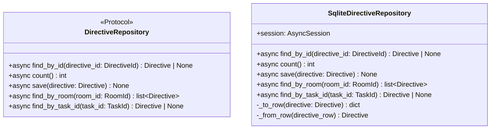

# 詳細設計書

> feature: `directive-repository`
> 関連: [basic-design.md](basic-design.md) / [`docs/features/empire-repository/detailed-design.md`](../empire-repository/detailed-design.md) **テンプレート真実源** / [`docs/features/room-repository/detailed-design.md`](../room-repository/detailed-design.md) **直近テンプレート** / [`docs/features/directive/detailed-design.md`](../directive/detailed-design.md)

## 記述ルール（必ず守ること）

詳細設計に**疑似コード・サンプル実装（python/ts/sh/yaml 等の言語コードブロック）を書かない**。
ソースコードと二重管理になりメンテナンスコストしか生まない。
必要なのは「構造契約（属性名・型・制約）」と「確定文言（メッセージ文字列）」と「実装の意図」。

## クラス設計（詳細）

### Protocol: DirectiveRepository（`application/ports/directive_repository.py`）

| メソッド | 引数 | 戻り値 | 制約 |
|----|----|----|----|
| `find_by_id(directive_id: DirectiveId)` | DirectiveId | `Directive \| None` | 不在時 None。SQLAlchemy 例外は上位伝播 |
| `count()` | なし | `int` | 全 Directive 数（empire-repo §確定 D 同 SQL `COUNT(*)` 契約） |
| `save(directive: Directive)` | Directive | None | `directives` テーブルに UPSERT（子テーブルなし、1 テーブル 1 行）。**標準 1 引数パターン**（§確定 R1-F）。commit / rollback は呼び出し元管理 |
| `find_by_room(room_id: RoomId)` | RoomId | `list[Directive]` | **第 4 method**、Room スコープ検索 ORDER BY created_at DESC（§確定 R1-D）。空の場合 `[]` |
| `find_by_task_id(task_id: TaskId)` | TaskId | `Directive \| None` | **第 5 method**、Task から発行元 Directive 逆引き（§確定 R1-D）。不在時 None |

`@runtime_checkable` は付与しない（empire-repo §確定 A）。

### Class: SqliteDirectiveRepository（`infrastructure/persistence/sqlite/repositories/directive_repository.py`）

| 属性 | 型 | 制約 |
|----|----|----|
| `session` | `AsyncSession` | コンストラクタで注入、Tx 境界は外側 service が管理 |

| 関数 | 引数 | 戻り値 | 制約 |
|----|----|----|----|
| `__init__(session: AsyncSession)` | session | None | session を保持するだけ、Tx は開かない |
| `find_by_id(directive_id)` | DirectiveId | `Directive \| None` | `SELECT * FROM directives WHERE id = :directive_id` → 不在なら None、存在すれば `_from_row` で構築。子テーブルなし（flat な 1 行 SELECT） |
| `count()` | なし | int | `select(func.count()).select_from(DirectiveRow)` で SQL `COUNT(*)`、`scalar_one()` で int 取得。**全行ロード + Python `len()` パターン禁止**（empire §確定 D） |
| `save(directive)` | Directive | None | §確定 R1-B の UPSERT（子テーブルなし、`directives` 1 テーブルのみ） |
| `find_by_room(room_id)` | RoomId | `list[Directive]` | `SELECT * FROM directives WHERE target_room_id = :room_id ORDER BY created_at DESC`。INDEX(target_room_id, created_at) が複合クエリを最適化 |
| `find_by_task_id(task_id)` | TaskId | `Directive \| None` | `SELECT id FROM directives WHERE task_id = :task_id LIMIT 1` で DirectiveId 取得 → 存在すれば `find_by_id(found_id)` 委譲（§確定 R1-D） |
| `_to_row(directive)` | Directive | `dict` | Directive → directives テーブル行 dict に変換（empire §確定 C）。`text` は `MaskedText.process_bind_param` 経由でマスキング、`task_id` は `None` or `str(uuid)` に変換 |
| `_from_row(directive_row)` | DirectiveRow | `Directive` | directives テーブル行 → Directive に変換（empire §確定 C）。`text` は `MaskedText.process_result_value` 経由でデマスキング、`task_id` は `None` or `TaskId` に変換 |

### Tables（既存 M2 永続化基盤の table モジュール群に追加）

| テーブル | モジュール | カラム |
|----|----|----|
| `directives` | `infrastructure/persistence/sqlite/tables/directives.py`（新規）| `id: UUIDStr PK` / **`text: MaskedText NOT NULL`** / `target_room_id: UUIDStr FK→rooms.id CASCADE NOT NULL` / `created_at: DateTime(timezone=True) NOT NULL` / `task_id: UUIDStr NULL`（FK なし、§確定 R1-C）/ **INDEX(target_room_id, created_at) 非 UNIQUE** |

すべて `bakufu.infrastructure.persistence.sqlite.base.Base` を継承。

##### `directives.created_at` の timezone 設計

| 採用 | 不採用 | 理由 |
|---|---|---|
| **`DateTime(timezone=True)`** | `DateTime` naive | directive domain §確定 A で `created_at: datetime` は **UTC tz-aware** と凍結（naive datetime は `pydantic.ValidationError`）。SQLAlchemy `DateTime(timezone=True)` で SQLite 上は ISO8601 文字列に保存。`_from_row` で復元される `Directive.created_at` は aware datetime で Pydantic 型バリデーションを通過 |
| | `DEFAULT CURRENT_TIMESTAMP` | `created_at` は application 層 `DirectiveService.issue()` が `datetime.now(UTC)` を引数渡し（directive §確定 で凍結）。DB 側 default は上書きリスク |

## 確定事項（先送り撤廃）

### 確定 R1-A: empire / workflow / agent / room テンプレート 100% 継承（再凍結）

empire-repository PR #29/#30 の §確定 A〜F + §Known Issues §BUG-EMR-001 規約 + workflow-repository PR #41 の §確定 E（CI 三層防衛 正のチェック）+ room-repository PR #47 を**そのまま継承**。本 PR で再議論しない項目:

| empire/workflow/room 確定 | 本 PR への適用 |
|---|---|
| empire §確定 A | `application/ports/directive_repository.py` 新規、Protocol、`@runtime_checkable` なし |
| empire §確定 B | `save()` で `directives` UPSERT のみ（子テーブルなし、1 テーブル 1 行）、Repository 内 commit/rollback なし |
| empire §確定 C | `_to_row` / `_from_row` を private method に閉じる |
| empire §確定 D | `count()` は SQL `COUNT(*)` 限定 |
| empire §確定 E | CI 三層防衛 Layer 1 + Layer 2 + Layer 3 全部に Directive テーブル明示登録 |
| workflow §確定 E（正のチェック）| `directives.text` の `MaskedText` 必須を grep + arch test で物理保証 |

### 確定 R1-B: `save()` UPSERT 手順（子テーブルなし版）

Directive は子テーブルを持たない flat な 5 属性 Aggregate。empire §確定 B の delete-then-insert パターンを **1 テーブル 1 行の UPSERT** に縮小して適用する:

| 順 | 操作 | SQL（概要） |
|---|---|---|
| 1 | directives UPSERT | `INSERT INTO directives (id, text, target_room_id, created_at, task_id) VALUES (...) ON CONFLICT (id) DO UPDATE SET text=..., target_room_id=..., created_at=..., task_id=...`（**`text` は `MaskedText.process_bind_param` 経由でマスキング**、`target_room_id` FK CASCADE が rooms 存在を物理確認） |

DELETE 段階なし（子テーブルがないため）。empire §確定 B の「DELETE → INSERT」のうち DELETE 相当は ON CONFLICT UPDATE に内包される。

##### Tx 境界の責務分離（再凍結）

`SqliteDirectiveRepository.save()` は **明示的な commit / rollback をしない**。呼び出し側 service が `async with session.begin():` で UoW 境界を管理（empire §確定 B 踏襲）。

### 確定 R1-C: `task_id` FK closure 申し送り（BUG-EMR-001 パターン）

`directives.task_id` は 0006 時点で nullable UUIDStr として宣言するが、**`tasks.id` への FK は張らない**。`tasks` テーブルは task-repository（後続 PR）で追加されるため、0006 時点での FK 追加は forward reference 問題になる。

| 申し送り先 | 内容 |
|---|---|
| task-repository PR | `op.batch_alter_table('directives')` で `create_foreign_key('fk_directives_task_id', 'tasks', ['task_id'], ['id'], ondelete='RESTRICT')` を追加する。SQLite は ALTER TABLE ADD CONSTRAINT 非サポートのため batch_alter 必須（[SQLite — ALTER TABLE](https://www.sqlite.org/lang_altertable.html) 参照） |
| ON DELETE の選択 | **RESTRICT**: Task が削除される時、当該 Task を参照している Directive が存在すれば削除を物理的に拒否する。Directive は Task 発行の証跡であり、Task が消えても Directive は audit trail として残すべき（SET NULL は `task_id NOT NULL` 設計でないため採用余地があるが、audit trail 保全の観点から RESTRICT を推奨） |

**§Known Issues でこの申し送りを明示する**（empire-repository §Known Issues §BUG-EMR-001 の記述形式を踏襲）。

### 確定 R1-D: `find_by_room` / `find_by_task_id` method 設計（§確定 R1-D の詳細凍結）

#### `find_by_room(room_id: RoomId) -> list[Directive]`

| 項目 | 値 | 根拠 |
|---|---|---|
| クエリ | `SELECT * FROM directives WHERE target_room_id = :room_id ORDER BY created_at DESC` | Room 内 directive を最新順で返却 |
| ORDER BY 方向 | **`created_at DESC`** | UI / CLI で「最新 CEO 指令が先頭」の自然な表示順 |
| INDEX 活用 | `INDEX(target_room_id, created_at)` 複合 INDEX の左端プリフィックスが `WHERE target_room_id = :room_id ORDER BY created_at DESC` をカバー | フルスキャンなし |
| 空 Room | `[]` 返却（NOT Found 扱いではなく空リスト） | 空配列と「Room 不在」は application 層が区別する責務 |
| 子テーブル | なし（flat な 1 行 SELECT のみ）| Directive は子テーブルを持たない |

#### `find_by_task_id(task_id: TaskId) -> Directive | None`

| 項目 | 値 | 根拠 |
|---|---|---|
| クエリ | `SELECT id FROM directives WHERE task_id = :task_id LIMIT 1` で DirectiveId 取得 → `find_by_id(found_id)` 委譲 | agent §確定 R1-F の `find_by_name` 委譲パターン踏襲 |
| LIMIT 1 | task_id は domain 設計で「1 Directive → 1 Task」のため重複なし。安全のために LIMIT 1 を付与 |
| task_id INDEX | 0006 時点では INDEX なし（task-repository PR で FK closure と同時に判断）。MVP 数十 Directive ではフルスキャンで十分（YAGNI） |

### 確定 R1-E: CI 三層防衛 Directive 拡張（§確定 R1-E の物理保証方式）

| Layer | 保証内容 | 実装方式 |
|---|---|---|
| Layer 1 grep guard | `tables/directives.py` の `text` カラム宣言行に `MaskedText` 必須 | `check_masking_columns.sh` に正のチェック追加: `grep -n "text" tables/directives.py` の出力に `MaskedText` が含まれることを assert |
| Layer 1 grep guard（負） | `tables/directives.py` の `text` 以外のカラムに `MaskedText` / `MaskedJSONEncoded` が登場しない | `check_masking_columns.sh` に負のチェック追加（過剰マスキング防止）|
| Layer 2 arch test | `directives.text` の `column.type.__class__ is MaskedText` | `test_masking_columns.py` の parametrize に `('directives', 'text', MaskedText)` 追加 |
| Layer 3 storage.md | §逆引き表に `directives.text: MaskedText` 行 | storage.md 直接更新（§確定 R1-F） |

### 確定 R1-F: `save(directive)` 標準 1 引数パターン（storage.md §確定 H 適用）

Directive は `target_room_id` を自身の属性として保持する（[directive/detailed-design.md §Aggregate Root: Directive](../directive/detailed-design.md)）。DB 永続化に必要な `target_room_id` は `directive.target_room_id` から直接取得できる。

[storage.md §Repository save() インターフェース設計パターン §判断ルール](../../architecture/domain-model/storage.md) 適用:

| 判断 | Aggregate | DB に必要な外部 ID | save() シグネチャ |
|---|---|---|---|
| 標準パターン | Directive | `target_room_id` → `directive.target_room_id` から取得可 | `save(directive: Directive) -> None` ✓ |
| 非対称パターン（不採用） | Room | `empire_id` → Room 属性になし | `save(room, empire_id)` — Directive には不要 |

Room の非対称パターン（`save(room, empire_id)`）は **採用しない**。Directive は自身が持つ `target_room_id` を Repository が参照できるため。

### 確定 R1-G: domain ↔ row 変換契約（empire §確定 C の Directive 適用）

#### `_to_row(directive: Directive) -> dict`

| Directive 属性 | directives カラム | 変換方式 |
|---|---|---|
| `directive.id` | `id` | `str(directive.id)` で UUIDStr に変換 |
| `directive.text` | `text` | `MaskedText.process_bind_param(directive.text, ...)` でマスキング（TypeDecorator が SQLAlchemy バインド時に自動適用） |
| `directive.target_room_id` | `target_room_id` | `str(directive.target_room_id)` で UUIDStr に変換 |
| `directive.created_at` | `created_at` | UTC aware datetime をそのまま渡す（`DateTime(timezone=True)` が ISO8601 変換） |
| `directive.task_id` | `task_id` | `None` or `str(directive.task_id)` で UUIDStr / NULL に変換 |

#### `_from_row(directive_row) -> Directive`

| directives カラム | Directive 属性 | 変換方式 |
|---|---|---|
| `row.id` | `id: DirectiveId` | `DirectiveId(UUID(row.id))` で型変換 |
| `row.text` | `text: str` | `MaskedText.process_result_value(row.text, ...)` でデマスキング（TypeDecorator が SQLAlchemy result 取得時に自動適用）|
| `row.target_room_id` | `target_room_id: RoomId` | `RoomId(UUID(row.target_room_id))` で型変換 |
| `row.created_at` | `created_at: datetime` | `DateTime(timezone=True)` が aware datetime として返却（`pytz.utc` または `timezone.utc`） |
| `row.task_id` | `task_id: TaskId \| None` | `None` or `TaskId(UUID(row.task_id))` で型変換 |

**注意**: `MaskedText` TypeDecorator は `process_bind_param` / `process_result_value` を SQLAlchemy が自動呼び出しする。`_to_row` / `_from_row` では **明示的に masking/demasking を呼ばない**（TypeDecorator が担当）。これが empire §確定 C の「呼び忘れ経路ゼロ」の物理保証。

## 設計判断の補足

### なぜ `save(directive, room_id)` の非対称パターンを採用しないか

Room は `empire_id` 属性を持たないため `save(room, empire_id)` の非対称パターンが必要だった。一方 Directive は `target_room_id` を Aggregate 自身が属性として持つ（[directive/detailed-design.md §Aggregate Root: Directive](../directive/detailed-design.md)）。`directive.target_room_id` を Repository が参照できるため、非対称パターン不要。[storage.md §確定 H](../../architecture/domain-model/storage.md) 判断ルール「Aggregate が DB 永続化に必要な外部 ID を属性として持つ場合は標準 1 引数パターン」を適用。

### なぜ `find_by_room` の ORDER BY を created_at DESC にするか

Room チャネルで CEO が発行した directive 一覧を表示する UI / CLI のユースケースを想定。最新 directive が先頭に表示される ORDER が「最新の指令を最優先」で確認する運用に合致。ASC だと古い指令が先頭になりスクロールが必要。 `INDEX(target_room_id, created_at)` は ASC / DESC どちらにも対応するため設計変更なし。

### なぜ子テーブルがないのに empire §確定 B を「適用」と書くか

empire §確定 B は「save() で delete-then-insert（子テーブル含む）」だが、Directive は **子テーブルを持たない**。「継承」の意味は「UPSERT（INSERT OR REPLACE）+ Repository 内 commit なし」の共通パターンを踏襲する、ということ。子テーブルの DELETE / INSERT ステップは「存在しない」のではなく「子テーブルがないため自動的に省略」される形。

### なぜ `task_id` INDEX を 0006 で追加しないか

`find_by_task_id` のクエリ頻度は `find_by_room` より低い（Task から Directive を逆引きするのは task-application の特定経路のみ）。MVP 数十 Directive ではフルスキャンが許容範囲内。task-repository PR で FK closure と同時に INDEX も判断する（YAGNI）。INDEX 追加は低コストな操作であり、後続 PR で簡単に追加できる。

### なぜ `target_room_id` FK を CASCADE にするか（RESTRICT でなく）

room-repository §確定 R1-B では `rooms.workflow_id` FK を RESTRICT にした。これは「Workflow は Room の参照先であって所有者ではない」から。Directive ↔ Room の関係は逆：**Room が Directive を「所有」する**（Room チャネルで発行された directive は Room のライフサイクルに従属）。Room が削除された（archive ではなく物理削除）場合、その Room の Directive は意味を失うため CASCADE が自然。RESTRICT にすると「Room を物理削除したい場合は先に全 Directive を消す」手順が application 層に必要になり、Room archive → 削除フローが複雑化する。

## ユーザー向けメッセージの確定文言

該当なし — 理由: Repository は内部 API。ユーザー向けメッセージは application 層（directive feature 設計書 §MSG-DR-NNN）で管理する。

### プレフィックス統一

| プレフィックス | 意味 |
|--------------|-----|
| `[FAIL]` | 処理中止を伴う失敗 |
| `[OK]` | 成功完了 |

### MSG 確定文言表

| ID | 出力先 | 文言 |
|----|------|------|
| 該当なし | — | Repository 層。MSG-DR-NNN 系（directive feature 設計書）が application 層で管理 |

## データ構造（永続化キー）

### `directives` テーブル

| カラム | 型 | 制約 | 意図 |
|-------|----|----|----|
| `id` | `UUIDStr` | PK, NOT NULL | DirectiveId（UUIDv4） |
| `text` | **`MaskedText`** | NOT NULL | Directive 本文（directive §確定 G 実適用、`process_bind_param` でマスキング） |
| `target_room_id` | `UUIDStr` | FK → `rooms.id` ON DELETE **CASCADE**, NOT NULL | 委譲先 Room（§確定 R1-B） |
| `created_at` | `DateTime(timezone=True)` | NOT NULL | UTC 発行時刻（application 層で生成して引数渡し）|
| `task_id` | `UUIDStr` | NULL（**FK なし**、§確定 R1-C BUG-EMR-001 パターン） | 紐付け済み Task（task-repository PR で FK closure 申し送り）|
| INDEX | `(target_room_id, created_at)` 非 UNIQUE | — | `find_by_room` の複合クエリを最適化（§確定 R1-D） |

**masking 対象カラム**: `directives.text` のみ（`MaskedText`、§確定 R1-E）。その他 4 カラムは masking 対象なし、CI 三層防衛で「対象なし」を明示登録。

### `0006_directive_aggregate.py`（Alembic revision 構造）

| 操作 | 内容 |
|---|---|
| `upgrade()` | `op.create_table('directives', ...)` + `op.create_index('ix_directives_room_created', 'directives', ['target_room_id', 'created_at'])` |
| `downgrade()` | `op.drop_index('ix_directives_room_created')` + `op.drop_table('directives')` |
| `revision` | `"0006_directive_aggregate"` |
| `down_revision` | `"0005_room_aggregate"` |

## API エンドポイント詳細

該当なし — 理由: 本 feature は infrastructure 層のみ。API は `feature/http-api` で凍結する。

## §Known Issues

### §BUG-DRR-001: `directives.task_id → tasks.id` FK 未追加（forward reference 問題）

| 項目 | 内容 |
|---|---|
| 状態 | **OPEN（申し送り中）** |
| 発生経緯 | 0006 時点で `tasks` テーブルは未存在（task-repository は後続 PR）。empire_room_refs の BUG-EMR-001 と同パターンの forward reference 問題 |
| 影響 | `directives.task_id` は nullable UUIDStr として存在するが、DB レベルの FK 参照整合性が保証されない。存在しない TaskId が task_id に保存された場合でも IntegrityError が発生しない |
| 対策（現状）| application 層 `DirectiveService.issue()` が `TaskRepository.find_by_id(task_id)` で存在確認してから `directive.link_task(task_id)` → `save()` を呼ぶ（application 層の参照整合性検査で補完） |
| **closure 責務** | **task-repository PR** が `tasks` テーブル追加後に `op.batch_alter_table('directives')` で `create_foreign_key('fk_directives_task_id', 'tasks', ['task_id'], ['id'], ondelete='RESTRICT')` を追加する。詳細は §確定 R1-C 参照 |

## 出典・参考

- [SQLite — ALTER TABLE](https://www.sqlite.org/lang_altertable.html) — batch_alter_table の必要性（SQLite は ALTER TABLE ADD CONSTRAINT 非サポート）
- [SQLite — Foreign Key Actions](https://www.sqlite.org/foreignkeys.html#fk_actions) — CASCADE / RESTRICT 挙動の確認
- [SQLAlchemy 2.x — ORM Declarative Mapping](https://docs.sqlalchemy.org/en/20/orm/declarative_tables.html) — DeclarativeBase / mapped_column の仕様
- [SQLAlchemy 2.x — Custom Types (TypeDecorator)](https://docs.sqlalchemy.org/en/20/core/custom_types.html#sqlalchemy.types.TypeDecorator) — `MaskedText` の TypeDecorator 配線方式
- [SQLAlchemy 2.x — DateTime type](https://docs.sqlalchemy.org/en/20/core/type_basics.html#sqlalchemy.types.DateTime) — timezone=True の挙動
- [Alembic — batch_alter_table](https://alembic.sqlalchemy.org/en/latest/batch.html) — SQLite 向け ALTER TABLE / FK 追加方法
- [`docs/features/empire-repository/detailed-design.md`](../empire-repository/detailed-design.md) §確定 A〜F — テンプレート真実源
- [`docs/features/room-repository/detailed-design.md`](../room-repository/detailed-design.md) — 直近テンプレート（§確定 R1-A〜L）
- [`docs/features/directive/detailed-design.md`](../directive/detailed-design.md) — Directive Aggregate 凍結済み設計
- [`docs/architecture/domain-model/storage.md`](../../architecture/domain-model/storage.md) §シークレットマスキング規則 — `MaskedText` の配線方式と CI 三層防衛の根拠
