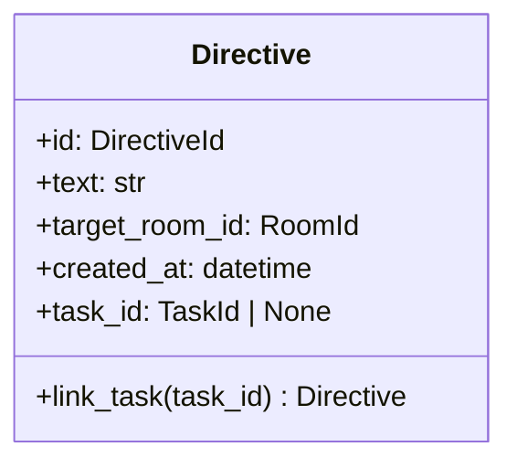

# 詳細設計書

> feature: `directive`
> 関連: [basic-design.md](basic-design.md) / [`docs/architecture/domain-model/aggregates.md`](../../architecture/domain-model/aggregates.md) §Directive

## 記述ルール（必ず守ること）

詳細設計に**疑似コード・サンプル実装（python/ts/sh/yaml 等の言語コードブロック）を書かない**。
ソースコードと二重管理になりメンテナンスコストしか生まない。
必要なのは「構造契約（属性名・型・制約）」と「確定文言（メッセージ文字列）」と「実装の意図」。

## クラス設計（詳細）

### Aggregate Root: Directive

| 属性 | 型 | 制約 | 意図 |
|----|----|----|----|
| `id` | `DirectiveId`（UUIDv4） | 不変 | 一意識別 |
| `text` | `str` | 1〜10000 文字（NFC 正規化のみ、strip しない — `Persona.prompt_body` / `PromptKit.prefix_markdown` と同規約） | CEO directive 本文（`$` プレフィックス含む正規化済みテキスト） |
| `target_room_id` | `RoomId`（UUIDv4） | 不変、参照のみ | 委譲先の部屋（参照整合性は application 層） |
| `created_at` | `datetime` | UTC、tz-aware（naive datetime は `pydantic.ValidationError`） | 発行時刻（application 層で生成して引数渡し） |
| `task_id` | `TaskId \| None`（UUIDv4 or None） | 一意遷移（None → 有効 TaskId のみ可、再リンク禁止） | 生成された Task の参照 |

`model_config`:
- `frozen = True`
- `arbitrary_types_allowed = False`
- `extra = 'forbid'`

**不変条件（model_validator(mode='after')）**:
1. `text` の NFC 正規化後の length が 1〜10000（`_validate_text_range`）
2. `task_id` 一意遷移（`_validate_task_link_immutable` — 既に有効 TaskId が設定されている状態への上書きは禁止。本不変条件は `link_task` ふるまい呼び出し経路でのみ発動する。コンストラクタ呼び出し時点では `task_id is None` または `任意の有効 TaskId` を許容、属性間の遷移を見るのは pre-validate 経路）

**不変条件（application 層責務、Aggregate 内では守らない）**:
- `target_room_id` の指す Room の存在 — `DirectiveService.issue()` が `RoomRepository.find_by_id` で確認
- `text` の `$` プレフィックス正規化 — `DirectiveService.issue()` で `raw_text` を `'$' + raw_text` 形式に統一（既に `$` で始まれば変更なし）

**ふるまい**:
- `link_task(task_id: TaskId) -> Directive`: `task_id` を有効 TaskId に遷移した**新 Directive インスタンス**を返す。`_validate_task_link_immutable` で既存リンクとの衝突を Fail Fast

### Exception: DirectiveInvariantViolation

| 属性 | 型 | 制約 |
|----|----|----|
| `message` | `str` | MSG-DR-NNN 由来の文言（webhook URL は `<REDACTED:DISCORD_WEBHOOK>` 化済み） |
| `detail` | `dict[str, object]` | 違反の文脈（webhook URL は `mask_discord_webhook_in` で再帰的に伏字化済み） |
| `kind` | `Literal['text_range', 'task_already_linked']` | 違反種別 |

`Exception` 継承。`domain/exceptions.py` の他の例外（empire / workflow / agent / room）と統一フォーマット。**`super().__init__` 前に `message` を `mask_discord_webhook` で、`detail` を `mask_discord_webhook_in` で伏字化する**（agent / workflow / room と同パターン、多層防御）。

## 確定事項（先送り撤廃）

### 確定 A: pre-validate 方式は Pydantic v2 model_validate 経由

`link_task` の手順:

1. `self.model_dump(mode='python')` で現状を dict 化
2. dict 内の `task_id` を新 TaskId で更新
3. `Directive.model_validate(updated_dict)` を呼ぶ — `model_validator` が走る
4. 失敗時は `ValidationError` を `DirectiveInvariantViolation` に変換して raise

empire / workflow / agent / room と同じパターン。`model_copy(update=...)` は採用しない（Pydantic v2 仕様で `validate=False` が既定のため不変条件再検査が走らない）。

### 確定 B: `text` の正規化パイプラインと長さ判定

`Persona.prompt_body` / `PromptKit.prefix_markdown` と同じく **NFC 正規化のみ、strip しない**:

#### 正規化パイプライン（順序固定）

1. 入力 `raw_text` を受け取る（application 層で `$` プレフィックス正規化済み）
2. `normalized = unicodedata.normalize('NFC', raw_text)` で NFC 正規化
3. `length = len(normalized)` で Unicode コードポイント数を計上（**strip は適用しない**）
4. 範囲判定（`1 <= length <= 10000`）
5. 通過時のみ属性として `normalized` を保持

#### `text` を strip しない理由

- CEO directive は複数段落 / 末尾改行を含む長文の可能性
- `'$ ブログ分析機能を作って\n\n要件:\n- GA4 経由\n- 月次集計'` のような構造を保持
- agent §確定 E §適用範囲表で `Persona.prompt_body` を strip しないと凍結した先例と同方針

### 確定 C: `task_id` 一意遷移の検査

`_validate_task_link_immutable`:

| 入力経路 | 元 `task_id` | 新 `task_id` | 判定 |
|---|---|---|---|
| コンストラクタ（初回構築） | （存在しない） | None | OK（未紐付け状態で生成） |
| コンストラクタ（直接構築、テスト等） | （存在しない） | 有効 TaskId | OK（既に紐付け済み状態で生成、永続化からの復元等） |
| `link_task(new_task_id)` | None | new_task_id | OK（None → 有効 TaskId への遷移） |
| `link_task(new_task_id)` | 既存有効 TaskId | new_task_id | NG → `DirectiveInvariantViolation(kind='task_already_linked', detail={'directive_id': self.id, 'existing_task_id': existing, 'attempted_task_id': new_task_id})` |

##### 「コンストラクタ経路では任意の TaskId を許容、`link_task` 経路でのみ再リンクを禁止する」実装方式

`link_task` ふるまい内で **「呼び出し時点の self.task_id が None であること」** を `_validate_task_link_immutable` で守る。コンストラクタ経路（`Directive(task_id=既存TaskId)` での直接構築）は permanent な値の代入であり、`task_id` 値の遷移ではないため許容する。

実装上は `link_task` ふるまいが `self.task_id is None` を直接検査してから `_rebuild_with_state` を呼ぶ:

| 段階 | 動作 |
|---|---|
| 1 | `if self.task_id is not None: raise DirectiveInvariantViolation(kind='task_already_linked', ...)` で Fail Fast |
| 2 | `self.model_dump()` で dict 化 → `task_id = new_task_id` に差し替え |
| 3 | `Directive.model_validate(updated_dict)` で再構築（`model_validator` が走るが、再リンク違反はもうここでは見ない、ふるまい入口で守った） |

これにより「Directive Repository が永続化済み有効 TaskId 持ちの Directive を復元する」経路と「`link_task` で再リンクを試みる」経路を分離して扱える。

### 確定 D: `link_task` ふるまいの返り値型

`link_task(task_id) -> Directive`（新インスタンス）。empire / workflow / agent / room と同じく frozen の制約上、状態変更は新インスタンス返却。

| 入力 Directive 状態 | 返り値 | オブジェクト同一性 |
|---|---|---|
| `task_id is None` | 新 `Directive`（`task_id = new_task_id`） | 別オブジェクト |
| `task_id == new_task_id`（同じ TaskId で再リンク） | `DirectiveInvariantViolation(kind='task_already_linked')` | 例外 |
| `task_id == 既存有効 TaskId（new_task_id と異なる）` | `DirectiveInvariantViolation(kind='task_already_linked')` | 例外 |

冪等性は持たない — 「同じ TaskId で 2 回 link_task を呼んでも OK」という設計を採用すると `_validate_task_link_immutable` の不変条件が複雑化する。**1 回のみ許可、2 回目は常に Fail Fast** の clear cut な契約を採用する（再リンクが必要な業務シナリオは MVP 範囲では存在しない、Phase 2 でも別 Directive 発行で対応する）。

### 確定 E: `DirectiveInvariantViolation` の webhook auto-mask

agent / workflow / room と同じく `DirectiveInvariantViolation.__init__` で:

1. `super().__init__` 前に `mask_discord_webhook(message)` を message に適用
2. `detail` に対し `mask_discord_webhook_in(detail)` を再帰的に適用
3. `kind` は enum 文字列のため mask 対象外
4. その後 `super().__init__(masked_message)` を呼ぶ

これにより `DirectiveInvariantViolation` の `str(exc)` / `exc.detail` のいずれを取り出しても webhook URL が伏字化済みであることを物理的に保証する（多層防御）。

#### `DirectiveInvariantViolation` で webhook が混入する経路

| 経路 | 例 |
|----|----|
| `Directive.text` の長さ違反 | CEO がチャット欄で webhook URL を含む 10001 文字超過の長文を送信 → 例外 detail に text の prefix が含まれる |
| `link_task` の再リンク違反 | webhook URL を含む既存 Directive で `link_task` を再呼び出し → 例外 detail に既存 directive 情報（id のみ、text は含めない） |

UI 側でも入力時マスキングを実装するが、本 Aggregate 層では「例外経路で漏れない」ことを単独で保証する責務を持つ。

### 確定 F: 例外型統一規約と「揺れ」の凍結（room §確定 I 踏襲）

| 違反種別 | 例外型 | 発生レイヤ | 凍結する `kind` 値 |
|---|---|---|---|
| 構造的不変条件違反 | `DirectiveInvariantViolation` | Aggregate `model_validator(mode='after')` または `link_task` ふるまい入口 | `text_range` / `task_already_linked` |
| 型違反 / 必須欠落 | `pydantic.ValidationError` | Pydantic 型バリデーション（`mode='after'` より前） | — |
| application 層の参照整合性違反 | `RoomNotFoundError` / `WorkflowNotFoundError` / `DirectiveNotFoundError` | `DirectiveService` / `RoomService` | — |

##### `link_task` ふるまいの例外型確定

`task_id` の型違反（None or UUIDv4 以外）は **Pydantic 型バリデーション**で `pydantic.ValidationError`（MSG-DR-003）。`link_task` 入口に到達する時点では既に valid な TaskId として渡される。`link_task` 内では `_validate_task_link_immutable` が `DirectiveInvariantViolation(kind='task_already_linked')`（MSG-DR-002）のみ raise する。

##### MSG ID と例外型の対応（凍結）

| MSG ID | 例外型 | kind |
|---|---|---|
| MSG-DR-001 | `DirectiveInvariantViolation` | `text_range` |
| MSG-DR-002 | `DirectiveInvariantViolation` | `task_already_linked` |
| MSG-DR-003 | `pydantic.ValidationError` | （型違反全般、kind 概念なし） |
| MSG-DR-004 | `RoomNotFoundError` | （application 層） |
| MSG-DR-005 | `WorkflowNotFoundError` | （application 層） |

### 確定 G: `target_room_id` 検証の責務分離（application 層、別 Issue）

`DirectiveService.issue(raw_text, target_room_id)` の application 層責務:

1. `text = raw_text if raw_text.startswith('$') else '$' + raw_text` で `$` プレフィックス正規化
2. `RoomRepository.find_by_id(target_room_id)` で Room 取得（不在なら `RoomNotFoundError(MSG-DR-004)` を Fail Fast）
3. Room の `archived == True` 検証（archived Room への directive 発行は禁止 — 本 PR スコープ外、`feature/directive-repository` または `feature/directive-application` で凍結）
4. `WorkflowRepository.find_by_id(room.workflow_id)` で Workflow 取得（不在なら `WorkflowNotFoundError(MSG-DR-005)`）
5. `Directive(...)` 構築 + `DirectiveRepository.save(directive)`
6. 同一 Tx 内で Task 構築 → `TaskRepository.save(task)` → `directive.link_task(task.id)` → `DirectiveRepository.save(updated_directive)`

ドメイン層の Directive はこの呼び出し前提で「自身では `target_room_id` の存在を検証しない」契約。

### 確定 H: 「Aggregate 内検査と application 層検査」の責務分離マトリクス

| 検査項目 | Aggregate 内 | application 層 |
|---|---|---|
| `text` 1〜10000 文字 | ✓（構造的、`_validate_text_range`） | ✗ |
| `task_id` 一意遷移 | ✓（構造的、`_validate_task_link_immutable`） | ✗ |
| `text` の `$` プレフィックス正規化 | ✗ | ✓（`DirectiveService.issue()` で正規化、§確定 R1-A / G） |
| `target_room_id` の Room 存在 | ✗ | ✓（外部知識、§確定 G） |
| Room の `workflow_id` の Workflow 存在 | ✗ | ✓（外部知識、§確定 G） |
| Task 生成と紐付けの 1 トランザクション | ✗ | ✓（複数 Aggregate にまたがるため、§確定 R1-B） |

## 設計判断の補足

### なぜ `target_room_id` 参照整合性を Aggregate 内で守らないか

`target_room_id` が指す Room の存在は Repository SELECT を要する集合知識。Aggregate 内では「`target_room_id` が UUID 型として valid」までしか守らない。Repository 経由で確認する application 層責務（empire の `archive_room` で `room_id` の存在を Aggregate 内で守るのと対称な分離方針、room §確定 R1-D 踏襲）。

### なぜ `spawn_task` ではなく `link_task` か

`aggregates.md` §Directive の「`spawn_task() -> Task`」は概念的な意図で、実装パターンとしては Aggregate 境界違反になる:

- Task は別 Aggregate Root のため、Directive 内で Task インスタンスを直接生成すると 1 Tx で 2 Aggregate 更新になる
- Aggregate Root のトランザクション境界（1 Tx で 1 Aggregate）を破壊する

`DirectiveService.issue()` の application 層が Task を生成し、Directive には `link_task(task_id)` で「生成済み Task の id を紐付ける」責務だけを残すことで、Aggregate 凝集境界を保つ。これは workflow の `Stage` 内 Entity が Workflow Aggregate に閉じ、Task との関係は別 Aggregate 経由で結ばれる設計と同方針。

### なぜ `task_id` を List にしないか

`aggregates.md` §Directive で「task_id: TaskId | None — 生成された Task（未着手なら None）」と単一参照で凍結済み。複数 Task は別 Directive で発行する設計（CEO が 2 つの directive を発行すれば Task が 2 件生成される）。MVP 範囲で「1 Directive → N Task」の業務シナリオは存在しない（YAGNI）。

### なぜ `created_at` を引数で受け取るか

`datetime.now(timezone.utc)` を Aggregate 内で自動生成すると freezegun 等での test 制御が必要になる。application 層で生成して引数渡しすることで Aggregate 自体は時刻に依存しない pure data になり、test 容易性が向上（`Directive(id=..., text=..., target_room_id=..., created_at=fixed_datetime, task_id=None)` で固定時刻を渡せる）。

### なぜ `task_id` 再リンクを冪等にしないか

「同じ TaskId で 2 回 link_task を呼んでも OK」という冪等設計は `_validate_task_link_immutable` の検査ロジックを複雑化する（既存 task_id と新 task_id を比較して同一なら no-op、異なれば Fail Fast）。**1 回のみ許可、2 回目は常に Fail Fast** の clear cut な契約のほうが構造が単純で、再リンクが必要な業務シナリオは存在しない（CEO が再発行したい場合は新規 Directive を発行する設計）。

## ユーザー向けメッセージの確定文言

### プレフィックス統一

| プレフィックス | 意味 |
|--------------|-----|
| `[FAIL]` | 処理中止を伴う失敗 |
| `[OK]` | 成功完了 |

### MSG 確定文言表

各メッセージは **「失敗内容（What）」+「次に何をすべきか（Next Action）」の 2 行構造**を採用する（§確定 F、room §確定 I 踏襲）。例外 message は改行（`\n`）区切りで 2 行を保持する。

| ID | 例外型 | 文言（1 行目: failure / 2 行目: next action） |
|----|------|----|
| MSG-DR-001 | `DirectiveInvariantViolation(kind='text_range')` | `[FAIL] Directive text must be 1-10000 characters (got {length})` / `Next: Trim directive content to <=10000 NFC-normalized characters; for richer prompts use multiple directives or attach a deliverable.` — `{length}` は §確定 B の正規化パイプライン（NFC 正規化のみ、strip しない）適用後の `len()` 値 |
| MSG-DR-002 | `DirectiveInvariantViolation(kind='task_already_linked')` | `[FAIL] Directive already has a linked Task: directive_id={directive_id}, existing_task_id={existing_task_id}` / `Next: Issue a new Directive instead of re-linking; one Directive maps to one Task by design.` |
| MSG-DR-003 | `pydantic.ValidationError`（Directive VO 構築時） | `[FAIL] Directive type validation failed: {field}={value!r}` / `Next: Verify field types — id/target_room_id are UUIDv4, created_at is tz-aware UTC datetime, task_id is UUIDv4 or None.` — Pydantic 標準のメッセージに 2 行構造を application 層でラップ |
| MSG-DR-004 | `RoomNotFoundError`（application 層） | `[FAIL] Target Room not found: room_id={room_id}` / `Next: Verify the room_id via GET /rooms; the room may have been archived or deleted.` |
| MSG-DR-005 | `WorkflowNotFoundError`（application 層） | `[FAIL] Workflow not found for Room: room_id={room_id}, workflow_id={workflow_id}` / `Next: Verify Room.workflow_id integrity; the Workflow may have been deleted while the Room references it.` |

##### 「Next:」行の役割（フィードバック原則）

- **発行レイヤを跨いで一貫**: 例外 message / API レスポンスの `error.next_action` フィールド / UI の Toast 2 行目 / CLI の stderr 2 行目に**同一文言**を流す
- **i18n 入口**: Phase 2 で UI 側 i18n を入れる際、`MSG-DR-NNN.failure` / `MSG-DR-NNN.next` の 2 キー × 言語数で翻訳テーブルが作れる
- **検証可能性**: test-design.md の TC-UT-DR-NNN で `assert "Next:" in str(exc)` を含めることで「hint 必須」を CI で物理保証する

メッセージは ASCII 範囲（プレースホルダ `{...}` は f-string 形式）。日本語化は UI 側 i18n（Phase 2）。本 feature の例外メッセージは英語固定。

## データ構造（永続化キー）

該当なし — 理由: 本 feature は domain 層のみで永続化スキーマは含まない。永続化は `feature/directive-repository` で扱う（M2 永続化基盤完了後）。

参考の概形:

| カラム | 型 | 制約 | 意図 |
|-------|----|----|----|
| `directives.id` | `UUIDStr` | PK | DirectiveId |
| `directives.text` | `MaskedText` | NOT NULL | masking 適用済み（`process_bind_param` で `MaskingGateway.mask()`、storage.md §逆引き表に `Directive.text` 行追加対象） |
| `directives.target_room_id` | `UUIDStr` | FK to `rooms.id` | 委譲先 Room |
| `directives.created_at` | `UTCDateTime` | NOT NULL | UTC 発行時刻 |
| `directives.task_id` | `UUIDStr` | NULL or FK to `tasks.id` | 紐付け済み Task |

## API エンドポイント詳細

該当なし — 理由: 本 feature は domain 層のみ。API は `feature/http-api` で凍結する。

## 出典・参考

- [Pydantic v2 — model_validator / model_validate](https://docs.pydantic.dev/latest/concepts/validators/) — pre-validate 方式の実装根拠
- [Pydantic v2 — frozen models](https://docs.pydantic.dev/latest/concepts/models/) — 不変モデルの挙動
- [Unicode Standard Annex #15: Unicode Normalization Forms](https://unicode.org/reports/tr15/) — NFC 正規化の仕様根拠
- [`docs/architecture/domain-model/aggregates.md`](../../architecture/domain-model/aggregates.md) — Directive 凍結済み設計
- [`docs/architecture/domain-model/storage.md`](../../architecture/domain-model/storage.md) — シークレットマスキング規則（`Directive.text` の Repository 永続化時に適用、`feature/directive-repository` で配線）
- [`docs/architecture/threat-model.md`](../../architecture/threat-model.md) — A02 / A04 / A09 対応根拠
- [`docs/features/agent/detailed-design.md`](../agent/detailed-design.md) §確定 D / E — 名前正規化パイプラインの先例
- [`docs/features/room/detailed-design.md`](../room/detailed-design.md) §確定 I — 例外型統一規約 + MSG 2 行構造の先例
