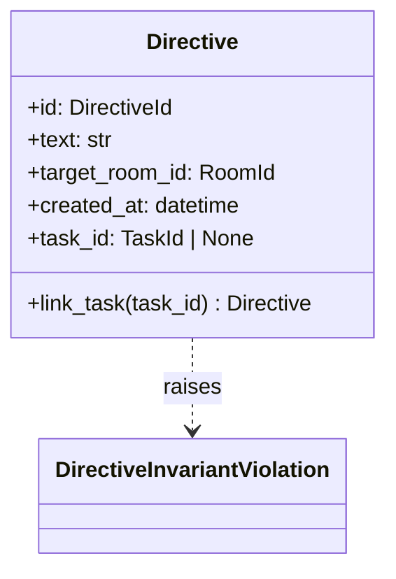
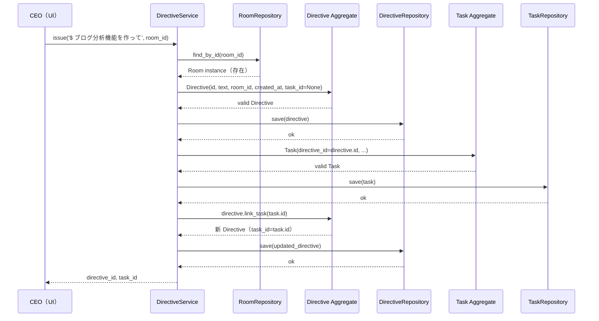
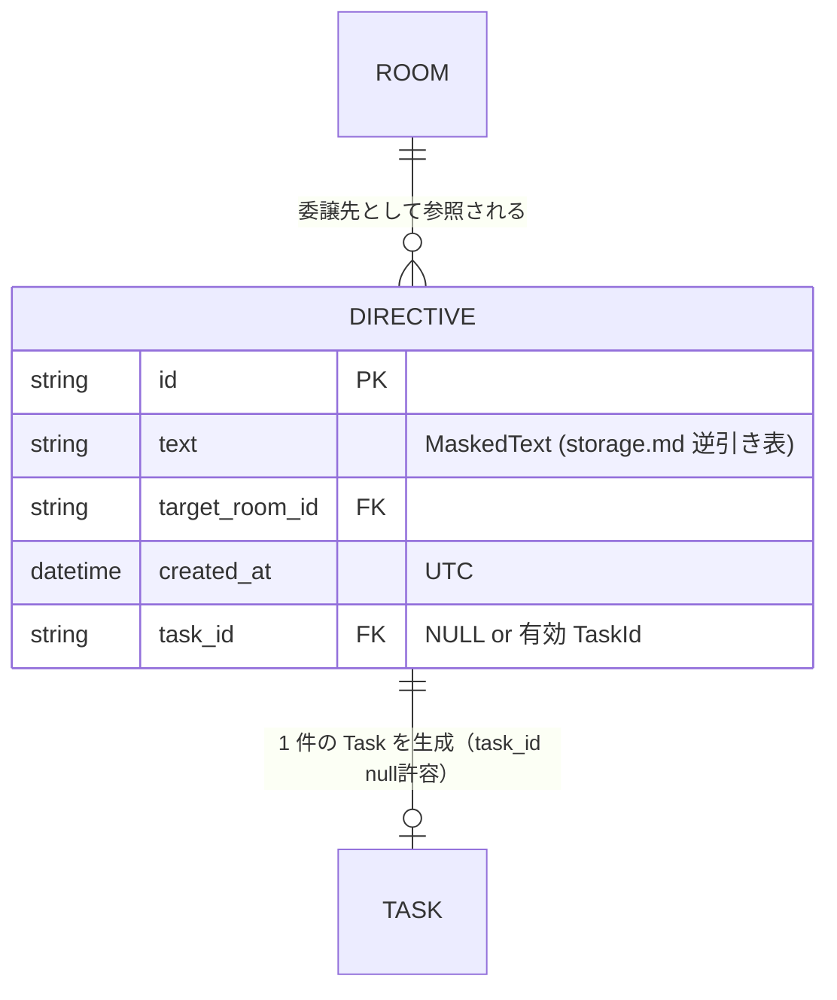

# 基本設計書 — directive / domain

> feature: `directive`
> sub-feature: `domain`
> 親 spec: [`../feature-spec.md`](../feature-spec.md) §9 受入基準 1〜7, 9
> 関連: [`docs/design/domain-model/aggregates.md`](../../../design/domain-model/aggregates.md) §Directive

## 記述ルール（必ず守ること）

基本設計に**疑似コード・サンプル実装（python/ts/sh/yaml 等の言語コードブロック）を書かない**。
ソースコードと二重管理になりメンテナンスコストしか生まない。
必要なのは構造契約（クラス・モジュール・データの関係）であり、実装の細部は [detailed-design.md](detailed-design.md) で凍結する。

## §モジュール契約（機能要件）

本 sub-feature が実装すべき機能要件は以下の通り（親 [`../feature-spec.md`](../feature-spec.md) §9 受入基準 1〜7, 9 を domain 実装観点で展開）。

| 要件 ID | 概要 | 入力 | 処理 | 出力 | エラー時 |
|---------|------|------|------|------|---------|
| REQ-DR-001 | Directive 構築 | `id: DirectiveId` / `text: str` / `target_room_id: RoomId` / `created_at: datetime`（UTC、tz-aware）/ `task_id: TaskId \| None`（既定 None） | Pydantic 型バリデーション → `model_validator(mode='after')` で不変条件検査（`text` 1〜10000 文字 NFC 正規化後・strip しない / `task_id` UUIDv4 or None / `created_at` tz-aware） | valid な `Directive` インスタンス（frozen） | `DirectiveInvariantViolation`（kind: `text_range`）/ `pydantic.ValidationError`（型違反） |
| REQ-DR-002 | Task 紐付け（link_task） | `task_id: TaskId`（生成済み Task の id） | 現状 `task_id` 確認 → None なら新 `task_id` を設定して `Directive.model_validate` で再構築（pre-validate 方式）。既に紐付け済みなら Fail Fast | 新 `Directive` インスタンス（pre-validate 方式で元 Directive は不変） | `DirectiveInvariantViolation`（kind: `task_already_linked`） |
| REQ-DR-003 | 不変条件検査 | Directive の現状属性 | `_validate_text_range`（NFC 後の length が 1〜10000）/ `_validate_task_link_immutable`（task_id 一意遷移）を順次実行 | 違反なしなら return（None） | `DirectiveInvariantViolation` を raise |

## モジュール構成

| 機能 ID | モジュール | ディレクトリ | 責務 |
|--------|----------|------------|------|
| REQ-DR-001〜003 | `Directive` Aggregate Root | `backend/src/bakufu/domain/directive/directive.py` | Directive の属性・不変条件・ふるまい |
| REQ-DR-003 | 不変条件 helper | `backend/src/bakufu/domain/directive/aggregate_validators.py` | `_validate_text_range` / `_validate_task_link_immutable` |
| REQ-DR-001 | `DirectiveInvariantViolation` 例外 | `backend/src/bakufu/domain/exceptions.py`（既存ファイル更新） | webhook auto-mask 強制（agent / workflow / room と同パターン） |
| 公開 API | re-export | `backend/src/bakufu/domain/directive/__init__.py` | `Directive` / `DirectiveInvariantViolation` を re-export |

```
ディレクトリ構造（本 feature で追加・変更されるファイル）:

.
├── backend/
│   ├── src/
│   │   └── bakufu/
│   │       └── domain/
│   │           ├── directive/                    # 新規ディレクトリ（room と同パターン）
│   │           │   ├── __init__.py               # 新規: 公開 API re-export
│   │           │   ├── directive.py              # 新規: Directive Aggregate Root
│   │           │   └── aggregate_validators.py   # 新規: _validate_* helper
│   │           └── exceptions.py                 # 既存更新: DirectiveInvariantViolation 追加
│   └── tests/
│       └── domain/
│           └── directive/
│               ├── __init__.py                   # 新規
│               └── test_directive.py             # 新規: ユニットテスト
└── docs/
    └── features/
        └── directive/                            # 本 feature 設計書群
```

## クラス設計（概要）



**凝集のポイント**:

- Directive 自身は frozen（Pydantic v2 `model_config.frozen=True`）
- 状態変更ふるまい（`link_task`）は新インスタンスを返す（pre-validate 方式）
- `text` の長さ・`task_id` の一意遷移は **Aggregate 内部で守る**（構造的不変条件）
- `target_room_id` 参照整合性 / `$` プレフィックス正規化は **application 層責務**（外部知識を要するため）

## 処理フロー

### ユースケース 1: Directive 発行（DirectiveService.issue）

1. application 層が `DirectiveService.issue(raw_text, target_room_id)` を呼び出す（UI / API 経由）
2. application 層が `text = raw_text if raw_text.startswith('$') else '$' + raw_text` で正規化（§確定 R1-A）
3. application 層が `RoomRepository.find_by_id(target_room_id)` で Room 存在検証（不在なら `RoomNotFoundError`）
4. application 層が Directive を構築（id / text / target_room_id / created_at / task_id=None）
5. Pydantic 型バリデーション → `model_validator(mode='after')` で `_validate_text_range` → `_validate_task_link_immutable` の順に走行
6. valid なら `DirectiveRepository.save(directive)` で永続化（永続化前に `text` のマスキング適用、Repository 層で TypeDecorator `MaskedText`）
7. 続けて Task 構築 → TaskRepository.save → directive.link_task(task_id) で紐付け（§確定 R1-B）

### ユースケース 2: Task 紐付け（link_task）

1. application 層が `DirectiveService.issue()` 内で Task 構築完了後に `directive.link_task(task_id)` を呼ぶ
2. Aggregate 内で `_rebuild_with_state(task_id=new_task_id)` 経由で dict を構築 → `model_validate` で再構築
3. `_validate_task_link_immutable` が `existing_task_id is not None` を検出した場合 `DirectiveInvariantViolation(kind='task_already_linked')` を Fail Fast
4. 通過なら新 Directive を返却。application 層が `DirectiveRepository.save(updated_directive)`

## シーケンス図



## アーキテクチャへの影響

- `docs/design/domain-model.md` への変更: なし（`mermaid classDiagram` の Directive は既存）
- `docs/design/domain-model/aggregates.md` への変更: なし（§Directive は既に凍結済み、本 feature は実装の追従）
- `docs/design/domain-model/storage.md` への変更: §シークレットマスキング規則 §逆引き表に `Directive.text` 行が追加される（**ただし本 feature では追記しない**。後続 `repository` sub-feature PR で永続化テーブル定義と同時に追記する責務分離）
- `docs/design/tech-stack.md` への変更: なし
- 既存 feature への波及: なし。empire / workflow / agent / room は本 feature を import しない（依存方向: directive → 既存 ID 型のみ）

## 外部連携

該当なし — 理由: domain 層のみのため外部システムへの通信は発生しない。

| 連携先 | 目的 | プロトコル | 認証 | タイムアウト / リトライ |
|-------|------|----------|-----|--------------------|
| 該当なし | — | — | — | — |

## UX 設計

該当なし — 理由: domain 層のため UI は持たない。CEO directive 発行 UI は `directive/ui/`（将来）で扱う。

| シナリオ | 期待される挙動 |
|---------|------------|
| 該当なし | — |

**アクセシビリティ方針**: 該当なし（UI なし）。

## セキュリティ設計

### 脅威モデル

本 feature 範囲では以下の 2 件。詳細な信頼境界は [`docs/design/threat-model.md`](../../../design/threat-model.md)。

| 想定攻撃者 | 攻撃経路 | 保護資産 | 対策 |
|-----------|---------|---------|------|
| **T1: Directive.text 経由の secret 漏洩** | CEO がチャット欄で webhook URL / API key を含むメッセージを `$` 付きで送信 → DB 永続化 → ログ・監査経路へ流出 | OAuth トークン / Discord webhook token / API key | Aggregate 内ではマスキングしない（生入力を保持して UI で読み返す経路を確保）。**永続化前の単一ゲートウェイ**（[`storage.md`](../../../design/domain-model/storage.md) §シークレットマスキング規則）で TypeDecorator `MaskedText` 経由で適用。後続 `repository` sub-feature PR で `directives.text` カラムを `MaskedText` 型として宣言する責務 |
| **T2: Directive.text に Discord webhook URL が混入した状態で `DirectiveInvariantViolation` を raise** | text 10001 文字超過 → 例外発生 → 例外 message / detail に webhook URL がそのまま埋め込まれログ / Discord 通知に流出 | Discord webhook token | `DirectiveInvariantViolation` の `__init__` で `mask_discord_webhook` + `mask_discord_webhook_in` を `super().__init__` 前に強制適用。agent / workflow / room と同パターン（多層防御） |

### OWASP Top 10 対応

| # | カテゴリ | 対応状況 |
|---|---------|---------|
| A01 | Broken Access Control | 該当なし（domain 層） |
| A02 | Cryptographic Failures | **適用**: 永続化前マスキング（`Directive.text`、後続 repository sub-feature PR で配線）+ 例外 auto-mask（DirectiveInvariantViolation） |
| A03 | Injection | 該当なし（Pydantic 型強制） |
| A04 | Insecure Design | **適用**: pre-validate 方式 / frozen model / `task_id` 一意遷移の構造的不変条件 |
| A05 | Security Misconfiguration | 該当なし |
| A06 | Vulnerable Components | Pydantic v2 / pyright |
| A07 | Auth Failures | 該当なし |
| A08 | Data Integrity Failures | **適用**: frozen model / pre-validate による不正状態の窓ゼロ化 |
| A09 | Logging Failures | **適用**: `DirectiveInvariantViolation` の auto-mask により例外ログから webhook URL が漏洩しない |
| A10 | SSRF | 該当なし（外部 URL fetch なし） |

## ER 図

該当なし — 理由: 本 sub-feature は domain 層のみで永続化スキーマは含まない。永続化は `repository` sub-feature で扱う。参考の概形:



## エラーハンドリング方針

| 例外種別 | 処理方針 | ユーザーへの通知 |
|---------|---------|----------------|
| `DirectiveInvariantViolation` | application 層で catch、HTTP API 層で 400 / 422 にマッピング（別 feature） | MSG-DR-001 / MSG-DR-002（kind: `text_range` / `task_already_linked`） |
| `pydantic.ValidationError` | 構築時の型違反。application 層で catch | MSG-DR-003（型違反全般） |
| `RoomNotFoundError` | application 層 `DirectiveService.issue()` の参照整合性違反、HTTP 404 にマッピング | MSG-DR-004 |
| `WorkflowNotFoundError` | 同上、Room の workflow_id を解決できない場合 | MSG-DR-005 |
| その他 | 握り潰さない、application 層へ伝播 | 汎用エラーメッセージ |
