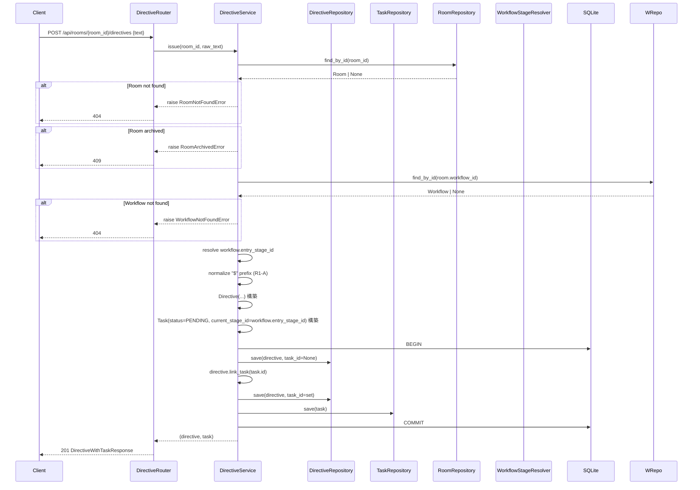
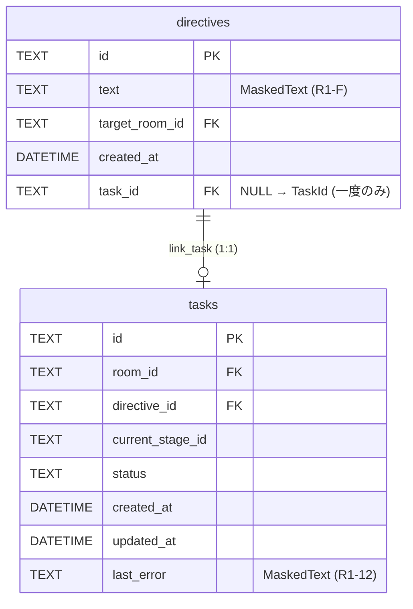

# 基本設計書

> feature: `directive` / sub-feature: `http-api`
> 関連 Issue: [#60 feat(task-http-api): Directive + Task lifecycle HTTP API (M3)](https://github.com/bakufu-dev/bakufu/issues/60)
> 関連: [`../feature-spec.md`](../feature-spec.md) / [`../domain/basic-design.md`](../domain/basic-design.md) / [`../repository/basic-design.md`](../repository/basic-design.md) / [`../../http-api-foundation/http-api/basic-design.md`](../../http-api-foundation/http-api/basic-design.md)
> 凍結済み設計参照: [`docs/design/architecture.md §interfaces レイヤー詳細`](../../../design/architecture.md) / [`docs/design/threat-model.md`](../../../design/threat-model.md)

## 記述ルール（必ず守ること）

基本設計に**疑似コード・サンプル実装（python/ts/sh/yaml 等の言語コードブロック）を書かない**。
ソースコードと二重管理になりメンテナンスコストしか生まない。
必要なのは構造契約（クラス・モジュール・データの関係）であり、実装の細部は [detailed-design.md](detailed-design.md) で凍結する。

## 実装前提（Issue #60 で充足済み）

本 sub-feature は以下の横断変更を同一 PR 内で充足する:

| 前提 | 対象ファイル | 内容 |
|-----|------------|------|
| **P-1: task_exceptions.py 新規作成** | `backend/src/bakufu/application/exceptions/task_exceptions.py` | `TaskNotFoundError` / `TaskStateConflictError` / `TaskAuthorizationError` を定義する |
| **P-2: TaskRepository.find_all_by_room 追加** | `backend/src/bakufu/application/ports/task_repository.py` | `find_all_by_room(room_id: RoomId) -> list[Task]` を Protocol に追加する |
| **P-3: DirectiveService.issue 実装** | `backend/src/bakufu/application/services/directive_service.py` | `WorkflowStageResolver` で entry stage を解決し、Directive + Task を atomic UoW で保存する |

## モジュール構成

本 sub-feature で追加・変更するモジュール一覧。

| 機能 ID | モジュール | ディレクトリ | 責務 |
|--------|----------|------------|------|
| REQ-DR-HTTP-001 | `directive_router` | `backend/src/bakufu/interfaces/http/routers/directives.py` | Directive 発行エンドポイント（1 本）|
| REQ-DR-HTTP-001 | `DirectiveService` | `backend/src/bakufu/application/services/directive_service.py` | `issue()` メソッドを肉付け（Directive + Task を atomic に生成）|
| REQ-DR-HTTP-001 | `DirectiveSchemas` | `backend/src/bakufu/interfaces/http/schemas/directive.py` | Pydantic v2 リクエスト / レスポンスモデル（新規ファイル）|
| 横断 | `directive 例外ハンドラ` | `backend/src/bakufu/interfaces/http/error_handlers.py`（既存追記）| `DirectiveInvariantViolation` → `ErrorResponse` 変換 |
| 横断 | `application 例外定義` | `backend/src/bakufu/application/exceptions/task_exceptions.py`（前提 P-1）| `TaskNotFoundError` / `TaskStateConflictError` |

```
本 sub-feature で追加・変更されるファイル:

backend/
└── src/bakufu/
    ├── application/
    │   ├── exceptions/
    │   │   └── task_exceptions.py              # 新規: TaskNotFoundError / TaskStateConflictError (P-1)
    │   ├── ports/
    │   │   └── task_repository.py              # 既存追記: find_all_by_room() 追加 (P-2)
    │   └── services/
    │       └── directive_service.py            # 既存追記: issue() メソッドを肉付け
    └── interfaces/http/
        ├── dependencies.py                     # 既存追記: get_directive_service() 追加
        ├── error_handlers.py                   # 既存追記: DirectiveInvariantViolation ハンドラ追加
        ├── routers/
        │   └── directives.py                   # 新規: POST /api/rooms/{room_id}/directives
        └── schemas/
            └── directive.py                    # 新規: Pydantic スキーマ群
```

## モジュール契約（機能要件）

本 sub-feature が提供するモジュールの入出力契約を凍結する。REQ-DR-HTTP-NNN は親 [`../feature-spec.md §5`](../feature-spec.md) ユースケース UC-DR-NNN と対応する（孤児要件なし）。

### REQ-DR-HTTP-001: Directive 発行 + Task 起票（POST /api/rooms/{room_id}/directives）

| 項目 | 内容 |
|---|---|
| 入力 | パスパラメータ `room_id: UUID` / リクエスト Body `DirectiveCreate`（`text: str`）|
| 処理 | `DirectiveService.issue(room_id, raw_text)` → 1) Room 存在確認（不在 → `RoomNotFoundError` 404）2) Room archived 確認（archived → `RoomArchivedError` 409）3) `WorkflowStageResolver.find_entry_stage_id(room.workflow_id)` で entry stage を Task 初期ステージとして解決 4) `$` プレフィックス正規化（R1-A: `text = raw_text if raw_text.startswith('$') else '$' + raw_text`）5) `Directive(id=uuid4(), text=text, target_room_id=room_id, created_at=now())` 構築（不変条件検査 → `DirectiveInvariantViolation` 422）6) `Task(id=uuid4(), room_id=room_id, directive_id=directive.id, current_stage_id=entry_stage_id, status=PENDING, ...)` 構築 7) `async with session.begin()`: `DirectiveRepository.save(directive)` + `directive.link_task(task.id)` + `DirectiveRepository.save(updated_directive)` + `TaskRepository.save(task)`（アトミック UoW）8) `DirectiveWithTaskResponse` を構築して返す |
| 出力 | HTTP 201, `DirectiveWithTaskResponse`（directive: DirectiveResponse + task: TaskResponse）|
| エラー時 | Room 不在 → 404 / Room archived → 409 / Directive 業務ルール違反 → 422 (MSG-DR-HTTP-001) / 不正 UUID → 422 |

## ユーザー向けメッセージ一覧

確定文言は [`detailed-design.md §MSG 確定文言表`](detailed-design.md) で凍結する。

| ID | 種別 | 条件 | HTTP ステータス |
|---|---|---|---|
| MSG-DR-HTTP-001 | エラー（検証）| `DirectiveInvariantViolation` の業務ルール違反本文（テキスト長超過等）| 422 |

## 依存関係

| 区分 | 依存 | バージョン方針 | 備考 |
|---|---|---|---|
| ランタイム | Python 3.12+ | pyproject.toml | 既存 |
| HTTP フレームワーク | FastAPI / Pydantic v2 / httpx | pyproject.toml | http-api-foundation で確定済み |
| DI パターン | `get_session()` / `get_directive_service()` | http-api-foundation 確定 | `dependencies.py` に `get_directive_service()` を追加 |
| application 例外 | `TaskNotFoundError` / `TaskStateConflictError` | 本 PR で新規定義（P-1）| `application/exceptions/task_exceptions.py` |
| domain | `Directive` / `DirectiveId` / `DirectiveInvariantViolation` / `Task` / `TaskId` / `TaskStatus` | M1 確定 | directive domain / task domain sub-feature |
| repository | `DirectiveRepository` Protocol / `TaskRepository` Protocol | M2 確定 + 本 PR で `find_all_by_room` 追加（P-2）| directive / task repository sub-feature |
| room 参照 | `RoomRepository.find_by_id` / `RoomRepository.find_empire_id_by_room_id` | room repository（Issue #33）確定 | Room 存在・archived 確認のため |
| room 例外 | `RoomNotFoundError` / `RoomArchivedError` | room http-api（Issue #57）確定 | Room 不在 / archived 確認のため |
| workflow 参照 | `WorkflowStageResolver.find_entry_stage_id` | workflow stage resolver | Room に紐付く Workflow の entry stage 解決のため。EXTERNAL_REVIEW Workflow は notify_channels が保存時にマスクされるため、Workflow 全体の再水和に依存しない |
| workflow 例外 | `WorkflowNotFoundError` | workflow application（Issue #52）確定 | Room.workflow_id が参照する Workflow 不在時の fail fast |
| masking | `application.security.masking.mask()` | http-api-foundation 確定（Issue #59 §確定I）| `text` / `prompt_body` 等フィールドの HTTP レスポンスマスキング（defense-in-depth）|
| 基盤 | http-api-foundation（ErrorResponse / lifespan / CSRF / CORS）| M3-A 確定（Issue #55）| 全 error handler / app.state.session_factory を引き継ぐ |

## クラス設計（概要）

```mermaid
classDiagram
    class DirectiveRouter {
        <<FastAPI APIRouter>>
        +POST /api/rooms/{room_id}/directives
    }
    class DirectiveService {
        -_directive_repo: DirectiveRepository
        -_task_repo: TaskRepository
        -_room_repo: RoomRepository
        -_session: AsyncSession
        +__init__(directive_repo, task_repo, room_repo, session)
        +issue(room_id, raw_text) tuple~Directive, Task~
    }
    class DirectiveRepository {
        <<Protocol>>
        +find_by_id(directive_id) Directive | None
        +find_by_room(room_id, empire_id) list~Directive~
        +save(directive) None
        +count() int
    }
    class TaskRepository {
        <<Protocol>>
        +find_by_id(task_id) Task | None
        +find_all_by_room(room_id) list~Task~
        +save(task) None
        +count() int
        +count_by_status(status) int
        +count_by_room(room_id) int
        +find_blocked() list~Task~
    }
    class RoomRepository {
        <<Protocol>>
        +find_by_id(room_id) Room | None
        +find_empire_id_by_room_id(room_id) EmpireId | None
        +save(room, empire_id) None
    }
    class DirectiveCreate {
        <<Pydantic BaseModel>>
        +text: str
    }
    class DirectiveResponse {
        <<Pydantic BaseModel>>
        +id: str
        +text: str
        +target_room_id: str
        +created_at: str
        +task_id: str | None
    }
    class TaskResponse {
        <<Pydantic BaseModel>>
        +id: str
        +room_id: str
        +directive_id: str
        +current_stage_id: str
        +status: str
        +assigned_agent_ids: list~str~
        +last_error: str | None
        +created_at: str
        +updated_at: str
    }
    class DirectiveWithTaskResponse {
        <<Pydantic BaseModel>>
        +directive: DirectiveResponse
        +task: TaskResponse
    }

    DirectiveRouter --> DirectiveService : uses (DI)
    DirectiveService --> DirectiveRepository : uses (Port)
    DirectiveService --> TaskRepository : uses (Port, 同一 UoW)
    DirectiveService --> RoomRepository : uses (Port, Room 存在確認)
    DirectiveService --> WorkflowStageResolver : uses (Port, entry stage 解決)
    DirectiveRouter ..> DirectiveCreate : deserializes
    DirectiveRouter ..> DirectiveWithTaskResponse : serializes
```

## 処理フロー

### ユースケース 1: Directive 発行 + Task 起票（POST /api/rooms/{room_id}/directives）

1. Router が `room_id: UUID` をパスパラメータとして受け取る（不正形式 → 422）
2. Router が `DirectiveCreate` を Pydantic でデシリアライズ（422 on 失敗）
3. `DirectiveService.issue(room_id, raw_text)` 呼び出し
4. Room 存在確認（`RoomRepository.find_by_id` → None → `RoomNotFoundError` → 404）
5. Room archived 確認（archived=True → `RoomArchivedError` → 409）
6. Workflow entry stage 存在確認（`WorkflowStageResolver.find_entry_stage_id(room.workflow_id)` → None → `WorkflowNotFoundError` → 404）
7. Workflow.entry_stage_id を Task.current_stage_id の初期値として解決
8. `$` プレフィックス正規化（業務ルール R1-A: 未付加なら自動付加）
9. `Directive(...)` 構築（R1-B〜G 不変条件検査 → `DirectiveInvariantViolation` → 422）
10. `Task(status=PENDING, current_stage_id=workflow.entry_stage_id, assigned_agent_ids=[], deliverables={}, ...)` 構築（`TaskInvariantViolation` → 422）
11. `async with session.begin()`:
   a) `DirectiveRepository.save(directive)`（task_id=None の初期状態で永続化）
   b) `directive.link_task(task.id)` → task_id 更新済み新インスタンス取得
   c) `DirectiveRepository.save(updated_directive)`（task_id セット済みで UPSERT）
   d) `TaskRepository.save(task)`
12. `DirectiveWithTaskResponse` を構築して HTTP 201 で返す



## エラーハンドリング方針

| 例外クラス | 発生源 | HTTP | ErrorResponse.code | メッセージ |
|----------|-------|------|--------------------|---------|
| `RoomNotFoundError` | DirectiveService | 404 | `not_found` | 既存ハンドラを再利用 |
| `RoomArchivedError` | DirectiveService | 409 | `conflict` | 既存ハンドラを再利用 |
| `WorkflowNotFoundError` | DirectiveService | 404 | `not_found` | 既存ハンドラを再利用 |
| `DirectiveInvariantViolation` | Directive domain | 422 | `validation_error` | MSG-DR-HTTP-001 |
| `TaskInvariantViolation` | Task domain | 422 | `validation_error` | Task 業務ルール違反本文 |
| Pydantic `ValidationError` | RequestBody | 422 | `validation_error` | Pydantic 標準 |
| 不正 UUID | パスパラメータ | 422 | `validation_error` | Pydantic 標準 |

## セキュリティ設計

### 脅威モデル

| 想定攻撃者 | 攻撃経路 | 保護資産 | 対策 |
|---|---|---|---|
| **T1: CSRF 経由での Directive 発行** | ブラウザ経由の不正 POST | Directive + Task の整合性 | http-api-foundation 確定D: CSRF Origin 検証ミドルウェア（Origin ヘッダ不一致なら 403）|
| **T2: スタックトレース露出** | 500 エラーレスポンスへのスタックトレース混入 | 内部実装情報 | http-api-foundation 確定A: generic_exception_handler が `internal_error` のみを返す |
| **T3: 不正 UUID によるパスインジェクション** | `room_id` に不正値を注入 | DB 整合性 | FastAPI `UUID` 型強制（422 on 不正形式）+ SQLAlchemy ORM（raw SQL 不使用）|
| **T4: Directive.text 経由での秘密情報漏洩（A02）** | CEO が API key / GitHub PAT / webhook URL を `text` に含めた場合、または DB への raw token 直接 INSERT バイパスが発生した場合、HTTP レスポンスに raw token が露出 | API key / GitHub PAT / webhook token | `DirectiveResponse.text` の `@field_serializer` が POST 全レスポンスパスで `application.security.masking.mask()` を呼び出す（mode 制限なし・冪等）。DB バイパス経路でも R1-F が独立防御として機能する（§確定A 凍結）|

### OWASP Top 10 対応

| # | カテゴリ | 対応状況 |
|---|---|---|
| A01 | Broken Access Control | loopback バインド（`127.0.0.1:8000`）+ CSRF Origin 検証（http-api-foundation 確定D）|
| A02 | Cryptographic Failures | **Directive.text**: `field_serializer` が POST 全レスポンスパスで `mask()` を呼び出す（T4 / §確定A 凍結）。DB 永続化前も MaskedText TypeDecorator で二重防御（R1-F）|
| A03 | Injection | SQLAlchemy ORM 経由（raw SQL 不使用）|
| A04 | Insecure Design | domain の pre-validate + frozen Directive で不整合状態を物理的に防止。atomic UoW で Directive + Task の整合性を保証 |
| A05 | Security Misconfiguration | http-api-foundation の lifespan / CORS 設定を引き継ぐ |
| A06 | Vulnerable Components | 依存 CVE は CI `pip-audit` で監視 |
| A07 | Auth Failures | MVP 設計上 意図的な認証なし（loopback バインドで代替）|
| A08 | Data Integrity Failures | `async with session.begin()` + UoW でアトミック永続化（Directive + Task）。部分失敗時は全体ロールバック |
| A09 | Logging Failures | 内部エラーは application 層でログ、スタックトレースはレスポンスに含めない |
| A10 | SSRF | 該当なし — Directive 業務概念は外部通信を持たない（LLM 送信は `feature/llm-adapter` 責務）|

## ER 図（影響範囲）


