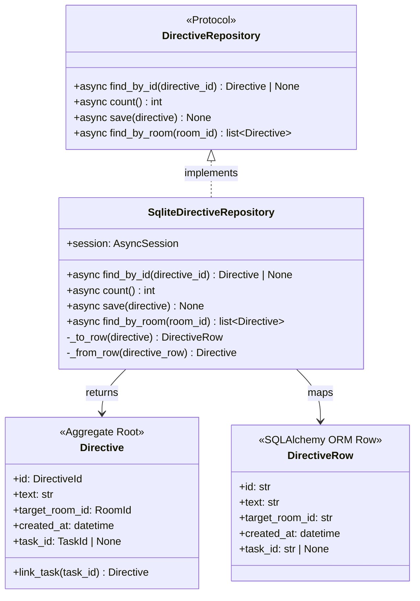
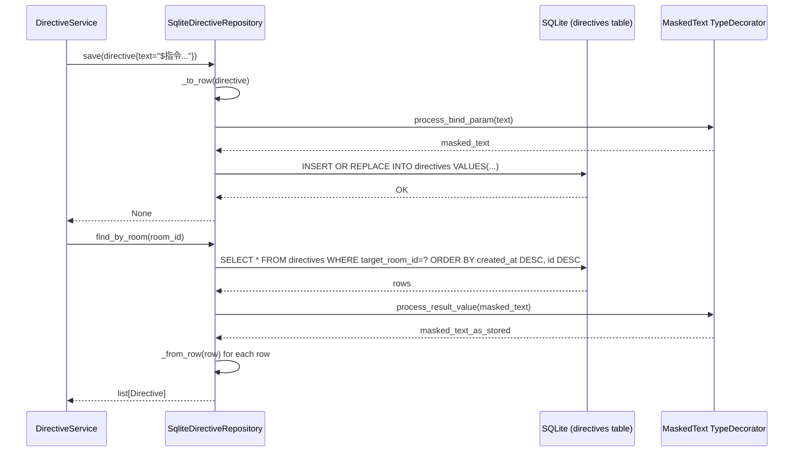
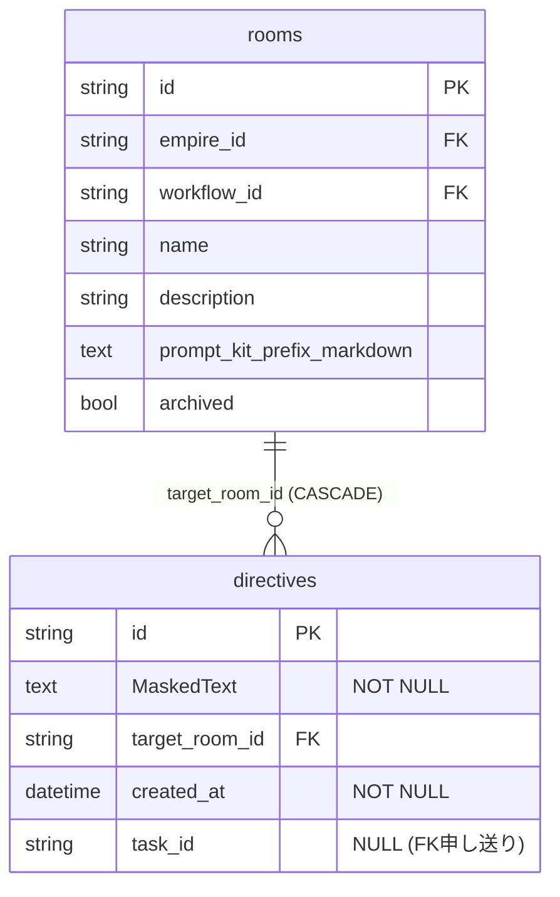

# 基本設計書 — directive / repository

> feature: `directive`
> sub-feature: `repository`
> 親 spec: [`../feature-spec.md`](../feature-spec.md) §9 受入基準 10, 11
> 関連: [`docs/features/empire-repository/`](../../empire-repository/) **テンプレート真実源** / [`docs/features/room-repository/`](../../room-repository/) **直近テンプレート** / [`../domain/basic-design.md`](../domain/basic-design.md)

## 記述ルール（必ず守ること）

基本設計に**疑似コード・サンプル実装（python/ts/sh/yaml 等の言語コードブロック）を書かない**。
ソースコードと二重管理になりメンテナンスコストしか生まない。
必要なのは構造契約（クラス・モジュール・データの関係）であり、実装の細部は [detailed-design.md](detailed-design.md) で凍結する。

## §モジュール契約（機能要件）

本 sub-feature が実装すべき機能要件は以下の通り（親 [`../feature-spec.md`](../feature-spec.md) §9 受入基準 10, 11 を repository 実装観点で展開）。

| 要件 ID | 概要 | 入力 | 処理 | 出力 | エラー時 |
|---------|------|------|------|------|---------|
| REQ-DRR-001 | DirectiveRepository Protocol 定義 | — | `typing.Protocol` で 4 method（`find_by_id` / `count` / `save` / `find_by_room`）を定義 | Protocol クラス | — |
| REQ-DRR-002 | SqliteDirectiveRepository 実装 | SQLite + AsyncSession | `find_by_id` / `count` / `save`（UPSERT）/ `find_by_room`（ORDER BY created_at DESC, id DESC） | Directive インスタンス / list / None | SQLAlchemy IntegrityError / OperationalError は上位伝播 |
| REQ-DRR-003 | Alembic 0006 revision | — | `directives` テーブル + INDEX + FK 1 件（rooms→directives CASCADE） | DDL 適用済み DB | — |
| REQ-DRR-004 | CI 三層防衛拡張（Layer 1 + 2） | — | `directives.text` の `MaskedText` 必須を grep + arch test で物理保証 | CI pass | CI 落下 |
| REQ-DRR-005 | storage.md 逆引き表更新 | — | `docs/design/domain-model/storage.md` §逆引き表に `directives.text: MaskedText` 行追加 | 更新済み storage.md | — |

## モジュール構成

| 機能 ID | モジュール | ディレクトリ | 責務 |
|--------|----------|------------|------|
| REQ-DRR-001 | `DirectiveRepository` Protocol | `backend/src/bakufu/application/ports/directive_repository.py` | Repository ポート定義（4 method、empire-repo の 3 method + §確定 R1-D の `find_by_room`。`find_by_task_id` は task-repository PR で申し送り） |
| REQ-DRR-002 | `SqliteDirectiveRepository` | `backend/src/bakufu/infrastructure/persistence/sqlite/repositories/directive_repository.py` | SQLite 実装、§確定 R1-A〜F |
| REQ-DRR-003 | Alembic 0006 revision | `backend/alembic/versions/0006_directive_aggregate.py` | 1 テーブル + INDEX + FK 1 件追加、`down_revision="0005_room_aggregate"` |
| REQ-DRR-004 | CI 三層防衛拡張 Layer 1 | `scripts/ci/check_masking_columns.sh`（既存ファイル更新）| Directive テーブル明示登録、`directives.text` の `MaskedText` 必須を assert（正のチェック）|
| REQ-DRR-004 | CI 三層防衛拡張 Layer 2 | `backend/tests/architecture/test_masking_columns.py`（既存ファイル更新）| parametrize に Directive テーブル追加 |
| REQ-DRR-005 | storage.md 逆引き表更新 | `docs/design/domain-model/storage.md`（既存ファイル更新）| Directive 関連 2 行追加 |
| 共通 | tables/directives.py | `backend/src/bakufu/infrastructure/persistence/sqlite/tables/` | 新規 1 ファイル（text は MaskedText、directive §確定 G 実適用） |

```
ディレクトリ構造（本 feature で追加・変更されるファイル）:

.
├── backend/
│   ├── alembic/
│   │   └── versions/
│   │       └── 0006_directive_aggregate.py             # 新規: 1 テーブル + INDEX + FK 1 件
│   ├── src/
│   │   └── bakufu/
│   │       ├── application/
│   │       │   └── ports/
│   │       │       └── directive_repository.py         # 新規: Protocol（4 method）
│   │       └── infrastructure/
│   │           └── persistence/
│   │               └── sqlite/
│   │                   ├── repositories/
│   │                   │   └── directive_repository.py # 新規: SqliteDirectiveRepository
│   │                   └── tables/
│   │                       └── directives.py           # 新規（text は MaskedText、directive §確定 G 実適用）
│   └── tests/
│       ├── infrastructure/
│       │   └── persistence/
│       │       └── sqlite/
│       │           └── repositories/
│       │               └── test_directive_repository/  # 新規ディレクトリ（500 行ルール対応）
│       │                   ├── __init__.py
│       │                   ├── test_protocol_crud.py
│       │                   ├── test_find_by_room.py
│       │                   ├── test_find_by_room_ordering.py  # ORDER BY created_at DESC, id DESC 決定論性テスト
│       │                   └── test_masking_text.py    # directive §確定 G 実適用専用テスト
│       └── architecture/
│           └── test_masking_columns.py                 # 既存更新: Directive テーブル parametrize 追加
├── scripts/
│   └── ci/
│       └── check_masking_columns.sh                    # 既存更新: Directive テーブル明示登録
└── docs/
    ├── design/
    │   └── domain-model/
    │       └── storage.md                              # 既存更新: 逆引き表に Directive 行追加
    └── features/
        └── directive/                                  # 本 feature 設計書群
```

## クラス設計（概要）



**凝集のポイント**:
- `DirectiveRepository` は `typing.Protocol` で定義。`@runtime_checkable` なし（empire §確定 A 踏襲）
- `SqliteDirectiveRepository` は `AsyncSession` を コンストラクタで受け取る（依存性注入、empire §確定 A パターン）
- `_to_row` / `_from_row` は private method に閉じる（empire §確定 C 踏襲）
- 子テーブルなし（Directive は flat な 5 属性 Aggregate）→ `_from_row` は 1 テーブルの 1 行のみ参照

## 処理フロー

### ユースケース 1: Directive 永続化（save）

1. application 層（`DirectiveService.issue()`）が `Directive(id=..., text=..., task_id=None)` を構築
2. `DirectiveRepository.save(directive)` を呼び出す
3. `_to_row(directive)` で `DirectiveRow` に変換（`text` は TypeDecorator `MaskedText` の `process_bind_param` でマスキング）
4. `directives` テーブルに UPSERT（INSERT OR REPLACE）
5. 成功: `None` 返却

### ユースケース 2: Directive 復元（find_by_id）

1. application 層が `DirectiveRepository.find_by_id(directive_id)` を呼び出す
2. `SELECT * FROM directives WHERE id = :directive_id` で `DirectiveRow` を取得
3. 不在: `None` 返却
4. 存在: `_from_row(row)` で `Directive` インスタンスに変換（`text` は TypeDecorator `MaskedText` の `process_result_value` でデマスキング）
5. `Directive` 返却

### ユースケース 3: Room 内 directive 一覧取得（find_by_room）

1. application 層（後続 directive-application）が `DirectiveRepository.find_by_room(room_id)` を呼び出す
2. `SELECT * FROM directives WHERE target_room_id = :room_id ORDER BY created_at DESC, id DESC` で `DirectiveRow` 一覧取得（BUG-EMR-001 規約: 複合 key で決定論的順序、`id` が tiebreaker）
3. INDEX(target_room_id, created_at) が複合クエリを最適化
4. 各行を `_from_row()` で `Directive` に変換
5. `list[Directive]` 返却（空の場合 `[]`）

### ユースケース 4: Directive の task_id 更新（save after link_task）

1. application 層が `directive.link_task(task_id)` で新 Directive インスタンスを取得
2. `DirectiveRepository.save(updated_directive)` を呼び出す
3. UPSERT で既存行の `task_id` カラムを更新
4. 成功: `None` 返却

## シーケンス図



## アーキテクチャへの影響

- `docs/design/domain-model/storage.md` への変更: §逆引き表に `directives.text: MaskedText` 行追加（本 PR で実施）
- `docs/design/tech-stack.md` への変更: なし（既存スタックのみ使用）
- 既存 feature への波及:
  - empire-repository: なし（BUG-EMR-001 は room-repository PR #47 で close 済み）
  - CI (`check_masking_columns.sh`, `test_masking_columns.py`): 既存ファイルに Directive テーブル追加
  - storage.md: 逆引き表更新のみ

## 外部連携

| 連携先 | 目的 | プロトコル | 認証 | タイムアウト / リトライ |
|-------|------|----------|-----|--------------------|
| 該当なし | infrastructure 層、外部通信なし | — | — | — |

## UX 設計

該当なし — 理由: UI を持たない（infrastructure 層 Repository）。

| シナリオ | 期待される挙動 |
|---------|------------|
| 該当なし | — |

**アクセシビリティ方針**: 該当なし。

## セキュリティ設計

### 脅威モデル

| 想定攻撃者 | 攻撃経路 | 保護資産 | 対策 |
|-----------|---------|---------|------|
| **T1: 内部脅威（DB 直接参照）** | SQLite ファイルへの直接アクセス / DB dump で `directives.text` を読み取り | CEO directive 本文（API key / webhook URL 混入の可能性） | `MaskedText` TypeDecorator で `process_bind_param` 時点でマスキング。DB に raw text が保存されない |
| **T2: ログ経由漏洩** | SQLAlchemy echo ログ / アプリログに bind param が出力される | Directive.text に混入した secret | `MaskedText` が bind param 生成前にマスキング → ログに masking 済みテキストが流れる |
| **T3: 実装漏れ（TypeDecorator 未適用）** | 後続 PR が `text` カラムを `Text` 型に変更 | Directive.text の masking 保証 | CI 三層防衛（grep guard + arch test + storage.md 逆引き表）が自動検出して PR ブロック |

### OWASP Top 10 対応

| # | カテゴリ | 対応状況 |
|---|---------|---------|
| A01 | Broken Access Control | 該当なし（infrastructure 層、アクセス制御は application / HTTP API 層） |
| A02 | Cryptographic Failures | **対応**: `directives.text` を `MaskedText` TypeDecorator でマスキング（AES ではなく `MaskingGateway.mask()` の pattern masking — secret pattern を `<REDACTED>` 化）|
| A03 | Injection | **対応**: SQLAlchemy ORM の parameterized query のみ使用、raw SQL 不使用 |
| A04 | Insecure Design | **対応**: TypeDecorator 強制 + CI 三層防衛で「マスキング忘れ」を設計レベルで排除 |
| A05 | Security Misconfiguration | 該当なし（外部接続なし） |
| A06 | Vulnerable Components | SQLAlchemy 2.x / Alembic を pyproject.toml で pin。CVE-2025-6965（SQLite < 3.50.2 メモリ破壊、CVSS 7.2-9.8）: SQLAlchemy ORM parameterized query 経由で直接 SQL 注入攻撃前提を物理遮断 + SQLite >= 3.50.2 ops 要件（tech-stack.md 凍結、room-repository PR #47 で確立済み）|
| A07 | Auth Failures | 該当なし（Repository 層、認証は別 feature） |
| A08 | Data Integrity Failures | **対応**: FK 制約（target_room_id → rooms.id CASCADE）+ 型制約 + NOT NULL で整合性保証 |
| A09 | Logging Failures | **対応**: `directives.text`（API key / webhook token を含み得る）を `MaskedText` でマスキングしてから bind param を生成するため、SQLAlchemy echo ログ / 監査ログ経路でも raw secret が漏洩しない |
| A10 | SSRF | 該当なし（外部通信なし）|

## ER 図



**§Known Issues**:
- `directives.task_id → tasks.id` FK は **task-repository PR で `op.batch_alter_table` 経由追加**（BUG-EMR-001 パターン、§確定 R1-C）。現時点で `tasks` テーブル未存在のため 0006 では FK なし

## エラーハンドリング方針

| 例外種別 | 処理方針 | ユーザーへの通知 |
|---------|---------|----------------|
| `sqlalchemy.IntegrityError`（FK 違反: target_room_id が存在しない rooms.id を参照） | 上位伝播（Repository は catch しない）| application 層が `DirectiveNotFoundError` / HTTP 404 にマッピング（別 feature） |
| `sqlalchemy.IntegrityError`（NOT NULL 違反: text / target_room_id / created_at が NULL）| 上位伝播 | application 層 Fail Fast（Directive Aggregate の不変条件で事前防止） |
| `sqlalchemy.OperationalError`（DB 接続失敗 / WAL ロックタイムアウト） | 上位伝播 | `BakufuStorageError`（infrastructure 層）→ HTTP 503（別 feature） |
