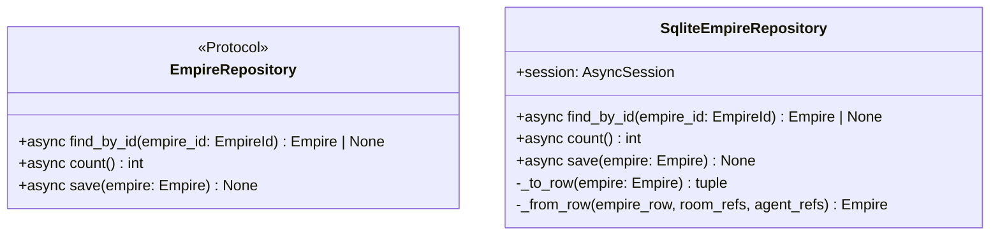

# 詳細設計書

> feature: `empire-repository`
> 関連: [basic-design.md](basic-design.md) / [`docs/features/persistence-foundation/detailed-design.md`](../persistence-foundation/detailed-design.md)

## 記述ルール（必ず守ること）

詳細設計に**疑似コード・サンプル実装（python/ts/sh/yaml 等の言語コードブロック）を書かない**。
ソースコードと二重管理になりメンテナンスコストしか生まない。
必要なのは「構造契約（属性名・型・制約）」と「確定文言（メッセージ文字列）」と「実装の意図」。

## クラス設計（詳細）

### Protocol: EmpireRepository（`application/ports/empire_repository.py`）

| メソッド | 引数 | 戻り値 | 制約 |
|----|----|----|----|
| `find_by_id(empire_id: EmpireId)` | EmpireId | `Empire \| None` | 不在時 None。SQLAlchemy 例外は上位伝播 |
| `count()` | なし | `int` | 全 Empire 数（シングルトン強制 application 層が利用、§確定 R1-D） |
| `save(empire: Empire)` | Empire | None | 同一 Tx 内で empires + empire_room_refs + empire_agent_refs を delete-then-insert（§確定 R1-B） |

`@runtime_checkable` は付与しない（Python 3.12 typing.Protocol の duck typing で十分）。

### Class: SqliteEmpireRepository（`infrastructure/persistence/sqlite/repositories/empire_repository.py`）

| 属性 | 型 | 制約 |
|----|----|----|
| `session` | `AsyncSession` | コンストラクタで注入、Tx 境界は外側 service が管理 |

| 関数 | 引数 | 戻り値 | 制約 |
|----|----|----|----|
| `__init__(session: AsyncSession)` | session | None | session を保持するだけ、Tx は開かない |
| `find_by_id(empire_id)` | EmpireId | `Empire \| None` | empires SELECT → 不在なら None。存在すれば empire_room_refs を `ORDER BY room_id` / empire_agent_refs を `ORDER BY agent_id` で SELECT（[basic-design.md](basic-design.md) §ユースケース 2 L127-128 が真実源、SQLite 内部スキャン順依存を排除して **list 順序を決定論的に再現**）→ `_from_row` で構築 |
| `count()` | なし | int | `SELECT count() FROM empires`（SQLAlchemy `func.count()` 経由）の結果。**全行ロード+ Python `len()` パターンは禁止**（後続 Repository PR が真似する場合に N+1 / メモリ無駄ロードを量産するため、§確定 D 補強で凍結） |
| `save(empire)` | Empire | None | §確定 R1-B の delete-then-insert |
| `_to_row(empire)` | Empire | `tuple[dict, list[dict], list[dict]]` | (empires_row, room_refs, agent_refs) に分離（§確定 R1-C） |
| `_from_row(empire_row, room_refs, agent_refs)` | dict, list[dict], list[dict] | Empire | VO 構造で復元（§確定 R1-C） |

### Tables（既存 M2 永続化基盤の table モジュール群に追加）

| テーブル | モジュール | カラム |
|----|----|----|
| `empires` | `infrastructure/persistence/sqlite/tables/empires.py`（新規） | `id: UUIDStr PK` / `name: String(80) NOT NULL` |
| `empire_room_refs` | `infrastructure/persistence/sqlite/tables/empire_room_refs.py`（新規） | `empire_id: UUIDStr FK CASCADE` / `room_id: UUIDStr` / `name: String(80)` / `archived: Boolean` / UNIQUE(empire_id, room_id) |
| `empire_agent_refs` | `infrastructure/persistence/sqlite/tables/empire_agent_refs.py`（新規） | `empire_id: UUIDStr FK CASCADE` / `agent_id: UUIDStr` / `name: String(40)` / `role: String(32)` / UNIQUE(empire_id, agent_id) |

すべて `bakufu.infrastructure.persistence.sqlite.base.Base` を継承。

## 確定事項（先送り撤廃）

### 確定 A: Repository ポート配置 — Aggregate 別ファイル分離（イーロン承認済み）

`application/ports/{aggregate}_repository.py` で各 Aggregate に独立した Protocol ファイルを配置する。

##### 配置ルール

| Aggregate | Protocol ファイル | 担当 PR |
|---|---|---|
| Empire | `application/ports/empire_repository.py` | **本 PR** |
| Workflow | `application/ports/workflow_repository.py` | `feature/workflow-repository`（後続）|
| Agent | `application/ports/agent_repository.py` | `feature/agent-repository`（後続）|
| Room | `application/ports/room_repository.py` | `feature/room-repository`（後続）|
| Directive | `application/ports/directive_repository.py` | `feature/directive-repository`（後続）|
| Task | `application/ports/task_repository.py` | `feature/task-repository`（後続）|
| ExternalReviewGate | `application/ports/external_review_gate_repository.py` | `feature/external-review-gate-repository`（後続）|

##### Protocol 定義の規約

- `class {Aggregate}Repository(typing.Protocol):` の形（`@runtime_checkable` なし）
- すべてのメソッドを `async def` で宣言（async-first）
- 戻り値型は `domain` 層の型のみ（infrastructure を import しない、依存方向の物理保証）
- 引数型は `domain` 層の VO（EmpireId / RoomRef / AgentRef 等）のみ

##### 後続 Repository PR のテンプレート責務

本確定 A は本 PR で凍結する**真実源**。後続 6 件 Repository PR は本確定を直接参照して同パターンで Protocol を追加する（同設計判断を再議論しない）。

### 確定 B: `save()` 戦略 — delete-then-insert（イーロン承認済み）

参照型カラム（`empire_room_refs` / `empire_agent_refs`）の更新は **同一 Tx 内で `DELETE WHERE empire_id=?` → 全件 `INSERT`**。

##### 手順（凍結、`SqliteEmpireRepository.save()` の内部）

| 順 | 操作 | SQL（概要） |
|---|---|---|
| 1 | empires UPSERT | `INSERT INTO empires (id, name) VALUES (...) ON CONFLICT (id) DO UPDATE SET name=EXCLUDED.name` |
| 2 | empire_room_refs DELETE | `DELETE FROM empire_room_refs WHERE empire_id = :empire_id` |
| 3 | empire_room_refs bulk INSERT | `INSERT INTO empire_room_refs (empire_id, room_id, name, archived) VALUES ...`（empire.rooms 件数分） |
| 4 | empire_agent_refs DELETE | `DELETE FROM empire_agent_refs WHERE empire_id = :empire_id` |
| 5 | empire_agent_refs bulk INSERT | `INSERT INTO empire_agent_refs (empire_id, agent_id, name, role) VALUES ...`（empire.agents 件数分） |

##### Tx 境界の責務分離

`SqliteEmpireRepository.save()` は **明示的な commit / rollback をしない**。呼び出し側 service が `async with session.begin():` で UoW 境界を管理する。これにより:

1. 複数 Repository を 1 Tx 内で呼ぶシナリオ（例: directive + task の同時保存）に対応
2. service 層がエラーハンドリングと Tx ライフサイクルを集約管理
3. Repository は session を受け取って SQL 発行するだけの単機能

##### 後続 Repository PR のテンプレート責務

本戦略は workflow / agent / room / directive / task / external-review-gate Repository でも採用する（**同パターン**）。各 Repository は自分の Aggregate Root に紐づく子テーブル（room_members / workflow_stages / workflow_transitions / agent_providers / agent_skills 等）を delete-then-insert で更新する。

### 確定 C: domain ↔ row 変換 — Repository クラス内 private method

`SqliteEmpireRepository` クラス内に `_to_row()` / `_from_row()` を private method として配置する。

##### `_to_row(empire: Empire)` 契約

| 入力 | 出力 |
|---|---|
| `Empire`（Aggregate Root インスタンス） | `tuple[dict, list[dict], list[dict]]` |

戻り値:
1. `empires_row: dict[str, Any]` — `{'id': ..., 'name': ...}`
2. `room_refs: list[dict[str, Any]]` — `[{'empire_id': ..., 'room_id': ..., 'name': ..., 'archived': ...}, ...]`
3. `agent_refs: list[dict[str, Any]]` — `[{'empire_id': ..., 'agent_id': ..., 'name': ..., 'role': ...}, ...]`

##### `_from_row(empire_row, room_refs, agent_refs)` 契約

| 入力 | 出力 |
|---|---|
| `empire_row: dict` / `room_refs: list[dict]` / `agent_refs: list[dict]` | `Empire` |

戻り値: `Empire(id=..., name=..., rooms=[RoomRef(...) for ...], agents=[AgentRef(...) for ...])`

Aggregate Root の不変条件は Empire 構築時の `model_validator(mode='after')` で再走（Repository は再 validate しない契約だが、構築は valid な状態で行われる）。

##### pyright strict pass のための型注釈

`_to_row` / `_from_row` の戻り値は明示的な型注釈を付与（`dict[str, Any]` / `Empire`）。SQLAlchemy の `Row` オブジェクトを直接返さず、dict に変換してから受け渡す（domain 層が SQLAlchemy に依存しないため）。

### 確定 D: シングルトン強制の責務分離（empire feature §確定 R1-B 踏襲）

Empire のシングルトン制約（bakufu インスタンスにつき 1 件）は **`EmpireService.create()` の application 層責務**（本 PR スコープ外、別 PR `feature/empire-application` で実装）。

本 PR では `EmpireRepository.count() -> int` メソッドを提供するのみ:

| 状況 | `count()` 戻り値 | application 層の判定 |
|---|---|---|
| Empire 0 件（初回起動） | 0 | OK、`save(new_empire)` を実行 |
| Empire 1 件（既存） | 1 | `EmpireAlreadyExistsError` を raise |
| Empire 2 件以上（不正状態） | 2+ | データ破損、Critical エラー |

「2 件以上」の検出は本 PR の `count()` で可能だが、検査ロジックは application 層に閉じる。

##### `count()` の実装契約（テンプレート責務、後続 6 件 Repository PR の真実源）

`count()` は **SQL レベルで `COUNT(*)` を発行する**実装に限定する。Python 側で全行ロードしてから `len()` を取る実装は**禁止**。

| 採用 | 不採用 | 理由 |
|---|---|---|
| `select(func.count()).select_from(EmpireRow)` で SQL `COUNT(*)` を発行、`scalar_one()` で int を取得 | `select(EmpireRow.id)` で全行を取得して Python `len(list(result.scalars().all()))` | 後続 Repository PR（workflow / agent / room / directive / task / external-review-gate）が `count()` を実装する際、本 PR の実装パターンを真似する。Workflow stages や Task deliverables は 100+ 件になり得るため、**全行ロード+ Python `len()` パターンが伝播すると N+1 / メモリ無駄ロードが量産される** |

**テンプレート PR の責務**: 本 PR の `count()` 1 行が将来の 6 件を決める。SQL レベル `COUNT(*)` を凍結することで、後続 Repository PR が機械的に同パターンを採用できる。

### 確定 E: CI 三層防衛の Empire 拡張

##### Layer 1: grep guard（`scripts/ci/check_masking_columns.sh`）

既存スクリプトに Empire テーブル群を**明示登録**:

| 登録内容 | 期待結果 |
|---|---|
| `empires` テーブルの宣言ファイル（`tables/empires.py`）に `MaskedJSONEncoded` / `MaskedText` が登場しないこと | grep でゼロヒット → pass |
| `empire_room_refs` 同上 | 同上 |
| `empire_agent_refs` 同上 | 同上 |

##### Layer 2: arch test（`backend/tests/architecture/test_masking_columns.py`）

既存 parametrize に 3 テーブル追加:

| 入力 | 期待 assertion |
|---|---|
| `Base.metadata.tables['empires']` | 全カラムの `column.type.__class__` が `MaskedJSONEncoded` でも `MaskedText` でもない（= `String` / `UUIDStr` のみ） |
| `Base.metadata.tables['empire_room_refs']` | 同上（`String` / `UUIDStr` / `Boolean` のみ） |
| `Base.metadata.tables['empire_agent_refs']` | 同上 |

##### Layer 3: storage.md 逆引き表更新（REQ-EMR-005）

`docs/architecture/domain-model/storage.md` §逆引き表に「Empire 関連カラム: masking 対象なし」行を追加（後続 Repository PR が誤って `MaskedText` を Empire に追加しないテンプレート）。

##### 後続 Repository PR のテンプレート責務

各 Aggregate Repository PR は本確定 E と同様、自分の Aggregate のテーブル群を Layer 1 + Layer 2 + Layer 3 に登録する責務を持つ。masking 対象カラムが**ある**場合は `MaskedJSONEncoded` / `MaskedText` を指定し、Layer 2 が assert する。masking 対象カラムが**ない**場合は本 PR と同様「対象なし」を明示登録する。

### 確定 F: テンプレート責務の凍結（後続 6 件 Repository PR の参照源）

本 PR は最小 Aggregate（Empire）でパターンを確立する**最適なテンプレート**。後続 6 件 Repository PR は本 PR の確定 A〜E を直接参照して実装する。

##### 後続 PR が参照するチェックリスト

| チェック項目 | 参照確定 |
|---|---|
| Repository ポートを `application/ports/{aggregate}_repository.py` で定義 | 確定 A |
| Protocol の各メソッドを `async def` で宣言 | 確定 A |
| `@runtime_checkable` を付与しない | 確定 A |
| SQLite 実装を `infrastructure/persistence/sqlite/repositories/{aggregate}_repository.py` で実装 | 確定 A / B |
| `save()` で参照型カラムを delete-then-insert で更新 | 確定 B |
| Tx 境界は service 層の責務、Repository 内で commit / rollback しない | 確定 B |
| domain ↔ row 変換は Repository クラス内 private method | 確定 C |
| Aggregate 集合知識の検査（シングルトン / 一意性等）は service 層責務 | 確定 D |
| CI 三層防衛 Layer 1 + Layer 2 に新テーブルを parametrize 追加 | 確定 E |
| storage.md §逆引き表に新テーブル行を追加（masking 対象あり / なしを明示） | 確定 E |
| Alembic revision を 1 つ追加（initial revision に含めない、各 Aggregate Repository PR が個別 revision を積む） | 確定 F |

##### Alembic revision の段階追加方針

| revision | 内容 | 担当 PR |
|---|---|---|
| `0001_init_audit_pid_outbox.py` | M2 永続化基盤の 3 テーブル + 2 トリガ | persistence-foundation #19（マージ済み） |
| `0002_empire_aggregate.py` | Empire 3 テーブル | **本 PR** |
| `0003_workflow_aggregate.py` | Workflow + Stage + Transition テーブル | `feature/workflow-repository`（後続） |
| `0004_agent_aggregate.py` | Agent + provider + skill テーブル | `feature/agent-repository`（後続） |
| `0005_room_aggregate.py` | Room + room_members テーブル | `feature/room-repository`（後続） |
| `0006_directive_aggregate.py` | Directive テーブル | `feature/directive-repository`（後続） |
| `0007_task_aggregate.py` | Task + Conversation + Deliverable テーブル | `feature/task-repository`（後続） |
| `0008_external_review_gate_aggregate.py` | ExternalReviewGate + AuditEntry テーブル | `feature/external-review-gate-repository`（後続） |

各 revision は前 revision に対する down_revision を明示し、Alembic head が一直線になるよう順序管理する（CI で head が分岐していないか検査）。

## Known Issues（既知の問題と決議）

実装段階・テスト段階で発見されたが本 PR スコープ内では完全解消しない問題を凍結する。各項目は Issue 起票 / 別 PR で完了させる。

### BUG-EMR-001 [LOW] [**RESOLVED in `feature/empire-repository-order-by`**] [**FK closure also RESOLVED in `feature/33-room-repository` Alembic 0005**]: `find_by_id` の `ORDER BY` 欠落と `_from_row` 経路の list 順序非決定性 + `empire_room_refs.room_id` FK 未配線

> **Status: Resolved (multi-stage).**
>
> **Stage 1**: `SqliteEmpireRepository.find_by_id` が
> `ORDER BY room_id` / `ORDER BY agent_id` を発行するように修正された
> (basic-design.md L127-128 の凍結に追従)。test 側は
> `sorted(empire.rooms, key=lambda r: r.room_id)` で「ORDER BY 契約物理保証」
> を assert する。
>
> **Stage 2 (FK closure)**: `empire_room_refs.room_id → rooms.id` の FK が
> `feature/33-room-repository` の Alembic 0005_room_aggregate revision で
> `op.batch_alter_table` 経由で物理追加された（room-repository §確定 R1-C / §確定 K）。
> これで `rooms` テーブル不在ゆえ FK を張らず参照のみ宣言した本 PR の暫定状態が
> 完全に closure された。
>
> 本節の歴史的経緯は、設計契約の整合性回復ワークフロー
> （Stage 1: ORDER BY 整合性 / Stage 2: 後続 PR 跨ぎの FK closure）の
> 監査証跡として保存する。

##### 観察された挙動（PR #29 ジェフレポート）

`SqliteEmpireRepository.find_by_id(empire_id)` の現実装（commit `5827c28`）が、`empire_room_refs` / `empire_agent_refs` の SELECT で `ORDER BY` 句を発行していない。SQLite 内部スキャン順依存のため、`Empire.rooms` / `Empire.agents` の list 順序が**保存時の順序と一致する保証がない**。

| 経路 | 順序の保証 |
|---|---|
| `save(empire)` → `find_by_id(empire.id)` → 復元 Empire | **list 順序が異なる可能性**（SQLite 内部スキャン順依存） |
| `Empire.rooms == [...]` 等価判定 | list の順序差で `==` が False になり得る |

##### 原因と設計書の片肺状態

| 文書 | 記述 | 状態 |
|---|---|---|
| [`basic-design.md`](basic-design.md) §ユースケース 2 L127-128 | `ORDER BY room_id` / `ORDER BY agent_id` を**設計上の正解**として明示 | ✓ 既凍結 |
| `detailed-design.md` §クラス設計 `find_by_id` 制約（本コミット前） | `ORDER BY` 言及なし | ✗ 片肺 |
| 実装 `empire_repository.py` find_by_id | `ORDER BY` を発行しない | ✗ 違反 |
| `test_empire_repository/` | set 比較 / membership 検証で workaround、list 順序差を隠蔽 | ✗ 物理保証なし |

basic-design.md は既に正解を凍結していたが、detailed-design.md と実装が追従しなかった。本コミットで detailed-design.md §クラス設計 `find_by_id` 制約に `ORDER BY room_id` / `ORDER BY agent_id` 言及を追加し、basic-design.md と再同期した。

##### 決議: 修正方針 (a) 採用 — Repository に `ORDER BY` を追加

| 候補 | 採否 | 理由 |
|---|---|---|
| **(a) Repository の `find_by_id` に `ORDER BY room_id` / `ORDER BY agent_id` を追加** | ✓ **採用** | basic-design.md L127-128 が既に「設計上の正解」として凍結済み、detailed-design.md と実装が追従するだけで整合性が回復。後続 Repository PR が同パターンを継承できるテンプレート責務 |
| (b) Empire VO の `rooms` / `agents` を `frozenset[RoomRef]` / `frozenset[AgentRef]` に変更 | ✗ 不採用 | empire feature #8 で `list[RoomRef]` / `list[AgentRef]` を凍結済み（順序を持つ）。VO レベルの破壊的変更で、empire 設計書 / 実装 / テストも追従修正が必要、影響範囲大。本問題は Repository 層の SQL 発行で解決可能 |
| (c) test 側の set 比較 workaround を恒久化 | ✗ 不採用 | 「list 順序が決定論的」という basic-design.md の凍結意図を放棄することになり、後続 Repository PR が「順序保証は test workaround で隠蔽してよい」という間違ったテンプレートを継承する |

##### 修正タスク（別 PR で完了）

本 PR ではドキュメント側の整合性回復（basic-design.md と detailed-design.md の再同期）のみ実施。コード側の修正は別 PR で行う:

| タスク | 担当 PR | 状態 |
|---|---|---|
| Repository 修正 | `feature/empire-repository-order-by` | ✓ 完了 — `find_by_id` の SELECT 文に `ORDER BY room_id` / `ORDER BY agent_id` を追加（commit 上記） |
| テスト修正 | 同上 | ✓ 完了 — `test_empire_repository/test_save_semantics.py` の set 比較 workaround を **`sorted(..., key=lambda r: r.room_id)` でソートした list 比較**に戻し、ORDER BY 契約を物理保証 |
| 申し送りクローズ | 同上 | ✓ 完了 — 本 §Known Issues §BUG-EMR-001 を「RESOLVED」に更新 |

##### 緊急度: LOW

- 機能影響なし（Empire VO の構造的等価性は維持される、list 内容の集合は同一）
- セキュリティ影響なし（順序非決定性で漏洩する情報なし）
- パフォーマンス影響なし（`ORDER BY` 追加のコストは無視できる）
- **後続 Repository PR が真似する経路として残ると有害**（テンプレート責務違反）→ 別 PR で確実にクローズする責務

##### 後続 Repository PR への申し送り

本 BUG-EMR-001 修正後、後続 6 件 Repository PR（workflow / agent / room / directive / task / external-review-gate）は **`find_by_id` の子テーブル SELECT 文に必ず `ORDER BY` を発行する**規約を遵守する。本 §Known Issues §BUG-EMR-001 のリストを真実源として参照。

## 設計判断の補足

### なぜ Repository ポートを application 層に置くか

clean architecture / DDD の依存方向は `domain ← application ← infrastructure`（外側が内側を知り、内側は外側を知らない）。Repository ポート（Protocol）を:

- **domain 層**に置くと、domain が永続化の存在を知ることになり依存方向違反
- **application 層**に置くと、domain は何も知らず、application が「永続化能力を抽象化したインターフェース」として Protocol を持ち、infrastructure が実装を提供する清潔な構造

これは Hexagonal Architecture の「ports and adapters」パターンと同じ（ports = Protocol、adapters = SqliteEmpireRepository）。

### なぜ `save()` を delete-then-insert にするか

差分計算（in-place 更新）は実装複雑性が高く、楽観排他なしではデータ破損のリスクがある。delete-then-insert は:

- 同一 Tx 内なら ATOMIC（half-update なし）
- 差分計算ロジック不要、シンプル
- N=100 程度のパフォーマンス劣化は MVP 範囲で無視できる
- 後続 Repository PR にも同パターンで適用可能

event sourcing は MVP 範囲外（YAGNI）、Outbox は別レイヤで結果整合を実現している。

### なぜ Repository 内で commit / rollback しないか

`async with session.begin():` を Repository 内で持つと:

- 1 Tx 内で複数 Repository を呼べない（Empire 保存 + Outbox 行追加を同一 Tx で行う場合等）
- service 層がエラーハンドリングを集約できない
- Repository が「自分の責務以外」を持つことになり、責務散在

呼び出し側 service が UoW 境界を管理することで、Repository は単機能（CRUD のみ）に閉じる。

### なぜ Empire テーブル群を CI 三層防衛に明示登録するか

Empire は masking 対象カラムを持たないため、**何もしないと CI が「Empire を検査していない」状態**になる。後続 PR が同 Aggregate に新カラムを追加した場合、masking 対象であるべきカラムを `String` で宣言しても検出できない。

明示登録により:

1. Empire 3 テーブルが grep / arch test の検査対象になる
2. 「対象なし」を期待結果として assert
3. 後続 PR が誤って `MaskedText` を Empire に追加すると Layer 2 で検出 → CI 落下

これは「明示的な空リスト」の防衛パターンで、後続 Aggregate Repository PR にも同方針で適用する。

## ユーザー向けメッセージの確定文言

該当なし — 理由: Repository は内部 API、ユーザー向けメッセージは application 層 / HTTP API 層が定義する。Repository は SQLAlchemy 例外（IntegrityError 等）を上位伝播するのみ。

## データ構造（永続化キー）

### `empires` テーブル

| カラム | 型 | 制約 | 意図 |
|----|----|----|----|
| `id` | `UUIDStr` | PK, NOT NULL | EmpireId |
| `name` | `String(80)` | NOT NULL | 表示名（Empire 内一意は application 層責務） |

### `empire_room_refs` テーブル

| カラム | 型 | 制約 | 意図 |
|----|----|----|----|
| `empire_id` | `UUIDStr` | FK → `empires.id` ON DELETE CASCADE, NOT NULL | 所属 Empire |
| `room_id` | `UUIDStr` | NOT NULL | Room への参照（FK は意図的に張らない、Room テーブルは別 Repository PR で追加） |
| `name` | `String(80)` | NOT NULL | RoomRef.name（表示用キャッシュ） |
| `archived` | `Boolean` | NOT NULL DEFAULT FALSE | RoomRef.archived |
| UNIQUE | `(empire_id, room_id)` | — | 同一 Empire 内で同 room_id の重複参照を禁止 |

##### Room テーブルへの FK を張らない理由（**※ FK closure 完了済み: `feature/33-room-repository` Alembic 0005**）

`empire_room_refs.room_id` を `rooms.id` への FK にすると、本 PR より先に rooms テーブルが存在する必要がある。room-repository は本 PR と並列着手中（room domain は #18 完了済みだが Repository は別 PR `feature/room-repository`）のため、本 PR では FK を張らず参照のみとする。

`feature/room-repository` PR で room テーブル定義時に **migration で FK を追加する**責務分離（後続 PR の Alembic revision で `op.create_foreign_key(...)` を実行）。

**※ FK closure 完了済み（2026-04 時点）**: 本 §に記載した「後続 PR で FK を追加する」責務分離は `feature/33-room-repository` の Alembic 0005_room_aggregate revision で実施完了。SQLite が ALTER TABLE ADD CONSTRAINT を直接サポートしないため、`op.batch_alter_table('empire_room_refs', recreate='always')` 経由で FK 追加（ON DELETE CASCADE）。BUG-EMR-001 Stage 2 として closure 監査証跡を §Known Issues に追記。

### `empire_agent_refs` テーブル

| カラム | 型 | 制約 | 意図 |
|----|----|----|----|
| `empire_id` | `UUIDStr` | FK → `empires.id` ON DELETE CASCADE, NOT NULL | 所属 Empire |
| `agent_id` | `UUIDStr` | NOT NULL | Agent への参照（FK は意図的に張らない、agent-repository PR で追加） |
| `name` | `String(40)` | NOT NULL | AgentRef.name（表示用キャッシュ） |
| `role` | `String(32)` | NOT NULL | AgentRef.role の enum string |
| UNIQUE | `(empire_id, agent_id)` | — | 同一 Empire 内で同 agent_id の重複参照を禁止 |

### Alembic 2nd revision キー構造（`0002_empire_aggregate.py`）

revision id: `0002_empire_aggregate`（固定）
down_revision: `0001_init_audit_pid_outbox`

| 操作 | 対象 |
|----|----|
| `op.create_table('empires', ...)` | 2 カラム |
| `op.create_table('empire_room_refs', ...)` | 4 カラム + UNIQUE |
| `op.create_table('empire_agent_refs', ...)` | 4 カラム + UNIQUE |

`downgrade()` は `op.drop_table` で逆順実行（CASCADE で子テーブルから先に削除）。

## API エンドポイント詳細

該当なし — 理由: 本 feature は infrastructure 層のみ。HTTP API は `feature/http-api` で凍結する。

## 出典・参考

- [SQLAlchemy 2.0 — async / AsyncEngine / AsyncSession](https://docs.sqlalchemy.org/en/20/orm/extensions/asyncio.html)
- [SQLAlchemy 2.0 — Imperative Mapping / Core](https://docs.sqlalchemy.org/en/20/orm/mapping_styles.html)
- [Alembic Tutorial](https://alembic.sqlalchemy.org/en/latest/tutorial.html) — migration / revision 管理
- [Python typing.Protocol](https://docs.python.org/3/library/typing.html#typing.Protocol) — `@runtime_checkable` なしの duck typing
- [Hexagonal Architecture (Ports and Adapters)](https://alistair.cockburn.us/hexagonal-architecture/) — Repository ポート配置の根拠
- [`docs/features/persistence-foundation/`](../persistence-foundation/) — M2 永続化基盤（PR #23 マージ済み）
- [`docs/features/empire/`](../empire/) — Empire domain 設計（PR #15 マージ済み）
- [`docs/architecture/domain-model/aggregates.md`](../../architecture/domain-model/aggregates.md) — Empire 凍結済み設計
- [`docs/architecture/domain-model/storage.md`](../../architecture/domain-model/storage.md) — 逆引き表（本 PR で Empire 行追加）
- [`docs/architecture/threat-model.md`](../../architecture/threat-model.md) — A04 / A08 対応根拠
