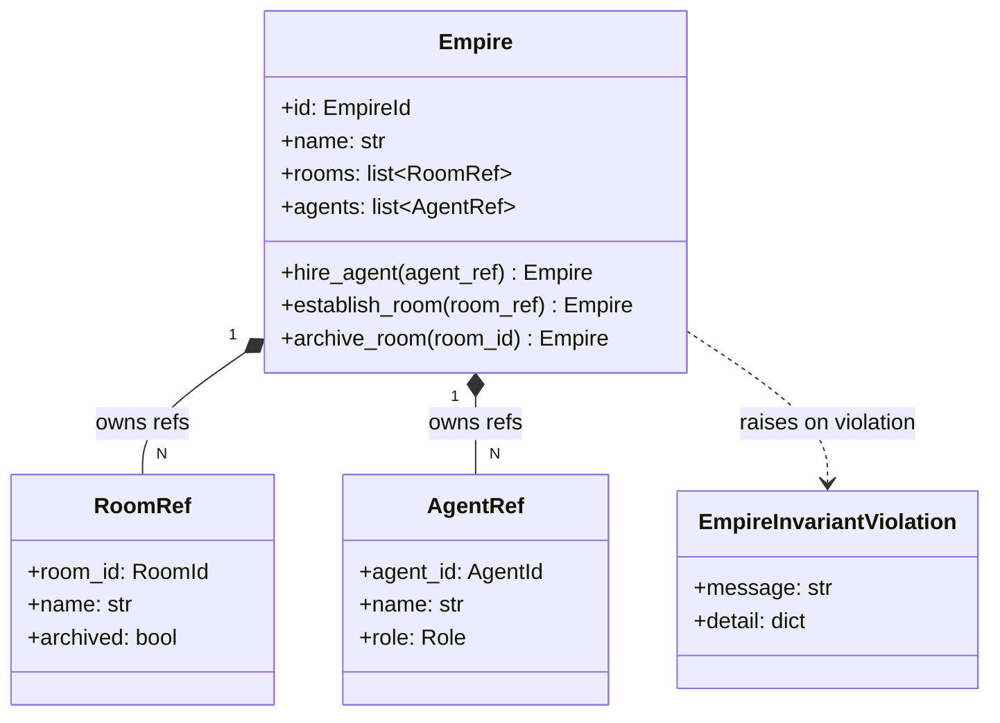
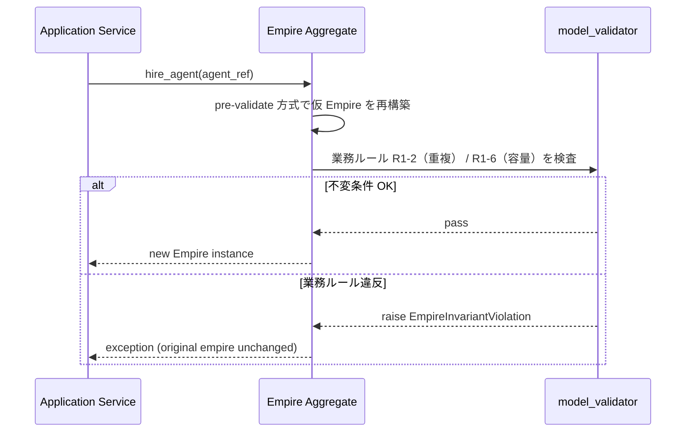
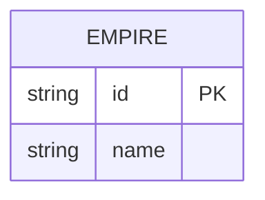

# 基本設計書

> feature: `empire`
> 関連: [requirements.md](requirements.md) / [`docs/design/domain-model/aggregates.md`](../../../design/domain-model/aggregates.md) §Empire

## 記述ルール（必ず守ること）

基本設計に**疑似コード・サンプル実装（python/ts/sh/yaml 等の言語コードブロック）を書かない**。
ソースコードと二重管理になりメンテナンスコストしか生まない。
必要なのは構造契約（クラス・モジュール・データの関係）であり、実装の細部は [detailed-design.md](detailed-design.md) で凍結する。

## モジュール構成

| 機能 ID | モジュール | ディレクトリ | 責務 |
|--------|----------|------------|------|
| REQ-EM-001〜005 | `Empire` Aggregate Root | `backend/src/bakufu/domain/empire.py` | Empire の属性・不変条件・ふるまい |
| REQ-EM-002, 003 | `RoomRef` / `AgentRef` Value Object | `backend/src/bakufu/domain/value_objects.py`（既存ファイル更新） | Empire 内に保持される参照 VO |
| REQ-EM-005 | `EmpireInvariantViolation` 例外 | `backend/src/bakufu/domain/exceptions.py`（既存ファイル更新） | ドメイン例外 |
| 共通 | ID 型 `EmpireId` / `RoomId` / `AgentId` / 列挙型 `Role` | `backend/src/bakufu/domain/value_objects.py`（既存定義） | 既存定義を参照、本 feature で追加なし |

```
ディレクトリ構造（本 feature で追加・変更されるファイル）:

.
└── backend/
    ├── src/
    │   └── bakufu/
    │       └── domain/
    │           ├── empire.py            # 新規: Empire Aggregate Root
    │           ├── value_objects.py     # 既存更新: RoomRef / AgentRef 追加
    │           └── exceptions.py        # 既存更新: EmpireInvariantViolation 追加
    └── tests/
        └── domain/
            └── test_empire.py           # 新規: ユニットテスト
```

## クラス設計（概要）



**凝集のポイント**:
- Empire は `rooms` / `agents` の参照リストの整合性に閉じる責務。Room / Agent の実体は別 Aggregate（参照のみ保持）
- `RoomRef` / `AgentRef` は frozen VO で構造的等価判定。Empire 自身も frozen（Pydantic v2 `model_config.frozen=True`）
- 状態変更ふるまい（`hire_agent` / `establish_room` / `archive_room`）は **新しい Empire を返す**（不変モデル）。呼び出し側は戻り値を受け取って参照を差し替える

## 処理フロー

### ユースケース 1: Empire 構築

1. application 層が `Empire(id=..., name=...)` を呼び出す
2. 入力バリデーション（型・必須・名前長範囲、業務ルール R1-1）を実施
3. 不変条件検査（業務ルール R1-1〜3, R1-6）を実施。初期は採用 / 設立リストが空のため重複・容量は自動成立
4. valid なら Empire インスタンスを返す。違反なら `EmpireInvariantViolation` を raise

### ユースケース 2: Agent 採用（hire_agent）

1. application 層が `empire.hire_agent(agent_ref)` を呼び出す
2. pre-validate 方式で「既採用一覧に追加された仮 Empire」を再構築（実装手順は [`detailed-design.md §確定 A`](detailed-design.md)）
3. 再構築の過程で不変条件検査が走り、`agent_id` の重複（業務ルール R1-2）と容量上限（R1-6）を検査
4. 通過時のみ仮 Empire を返す。違反なら `EmpireInvariantViolation` を raise（元 Empire は不変なので「ロールバック」不要）

### ユースケース 3: Room 設立（establish_room）

ユースケース 2 と同手順。`rooms` リストに対する pre-validate。

### ユースケース 4: Room アーカイブ（archive_room）

1. application 層が `empire.archive_room(room_id)` を呼び出す
2. 既設立一覧で `room_id` 一致する RoomRef を線形探索（[`detailed-design.md §確定 D`](detailed-design.md)）
3. 見つからない場合は `EmpireInvariantViolation` を raise（MSG-EM-004）
4. 見つかった場合は pre-validate 方式で対象 RoomRef の `archived=True` に置換した仮 Empire を再構築（[`detailed-design.md §確定 A`](detailed-design.md)）
5. 仮 Empire の不変条件検査を通過したら返す

## シーケンス図



## アーキテクチャへの影響

- `docs/design/domain-model.md` への変更: なし（凍結済み設計に従う実装のみ）
- `docs/design/tech-stack.md` への変更: なし
- 既存 feature への波及: `dev-workflow` 以外まだ存在しないため波及なし。ただし後続 `feature/agent` / `feature/workflow` / `feature/room` は Empire を参照しないため影響なし（Empire 側が他 Aggregate の参照型を持つ非対称構造）

## 外部連携

該当なし — 理由: domain 層のみのため外部システムへの通信は発生しない。

| 連携先 | 目的 | プロトコル | 認証 | タイムアウト / リトライ |
|-------|------|----------|-----|--------------------|
| 該当なし | — | — | — | — |

## UX 設計

該当なし — 理由: domain 層のため UI は持たない。Empire の UI は `feature/empire-ui`（Phase 2 以降）で扱う。

| シナリオ | 期待される挙動 |
|---------|------------|
| 該当なし | — |

**アクセシビリティ方針**: 該当なし（UI なし）。

## セキュリティ設計

### 脅威モデル

本 feature は domain 層のため、ほぼすべての攻撃面は HTTP API レイヤ / 添付配信レイヤで対処される（[`docs/design/threat-model.md`](../../../design/threat-model.md) 参照）。本 feature 範囲では以下の 2 件に絞る。

| 想定攻撃者 | 攻撃経路 | 保護資産 | 対策 |
|-----------|---------|---------|------|
| **T1: 不正な値での Aggregate 構築（バグ含む）** | application 層からの不正な引数（例: 81 文字の name） | Empire の整合性 | Pydantic v2 のフィールドバリデーション + `model_validator` で Fail Fast。pre-validate 方式で不正状態を一瞬たりとも持たない |
| **T2: 重複参照による DoS / メモリ肥大** | 同一 `agent_id` を繰り返し `hire_agent` する application バグ | Empire のメモリ・整合性 | 不変条件で重複を即拒否（O(N) 線形検査、N ≤ 100 想定で 1ms 未満） |

### OWASP Top 10 対応

| # | カテゴリ | 対応状況 |
|---|---------|---------|
| A01 | Broken Access Control | 該当なし（domain 層に認可境界なし、上位層責務） |
| A02 | Cryptographic Failures | 該当なし（暗号化責務なし） |
| A03 | Injection | 該当なし（domain 層は外部入力を直接扱わない、Pydantic 型強制で間接防御） |
| A04 | Insecure Design | **適用**: pre-validate 方式 + frozen model + `EmpireInvariantViolation` で不正状態の窓を物理的に閉じる |
| A05 | Security Misconfiguration | 該当なし（設定ファイルなし） |
| A06 | Vulnerable Components | Pydantic v2 / pyright を使用、依存監査は CI の `pip-audit` で実施 |
| A07 | Auth Failures | 該当なし（認証は別 feature） |
| A08 | Data Integrity Failures | **適用**: frozen model で不変性を強制、状態変更は新インスタンス生成 |
| A09 | Logging Failures | 該当なし（ログ出力は application 層責務） |
| A10 | SSRF | 該当なし（外部 URL fetch なし） |

## ER 図

該当なし — 理由: 本 feature は domain 層のみで永続化スキーマは含まない。Empire の永続化は `feature/persistence` で扱う。永続化スキーマの方針は [`docs/design/domain-model.md`](../../../design/domain-model.md) §残課題 を参照。



（参考: 永続化される際の概形のみ。詳細は別 feature で凍結。）

## エラーハンドリング方針

| 例外種別 | 処理方針 | ユーザーへの通知 |
|---------|---------|----------------|
| `EmpireInvariantViolation` | application 層で catch、HTTP API 層で 400 / 409 にマッピング（別 feature） | MSG-EM-001 〜 MSG-EM-005 |
| `pydantic.ValidationError` | Empire 構築時に発生（型不正・必須欠落）。application 層で catch | MSG-EM-001（汎用バリデーションエラー文言） |
| その他の例外 | 握り潰さない、application 層へ伝播。Backend ルートで 500 として記録 | 汎用エラーメッセージ |
