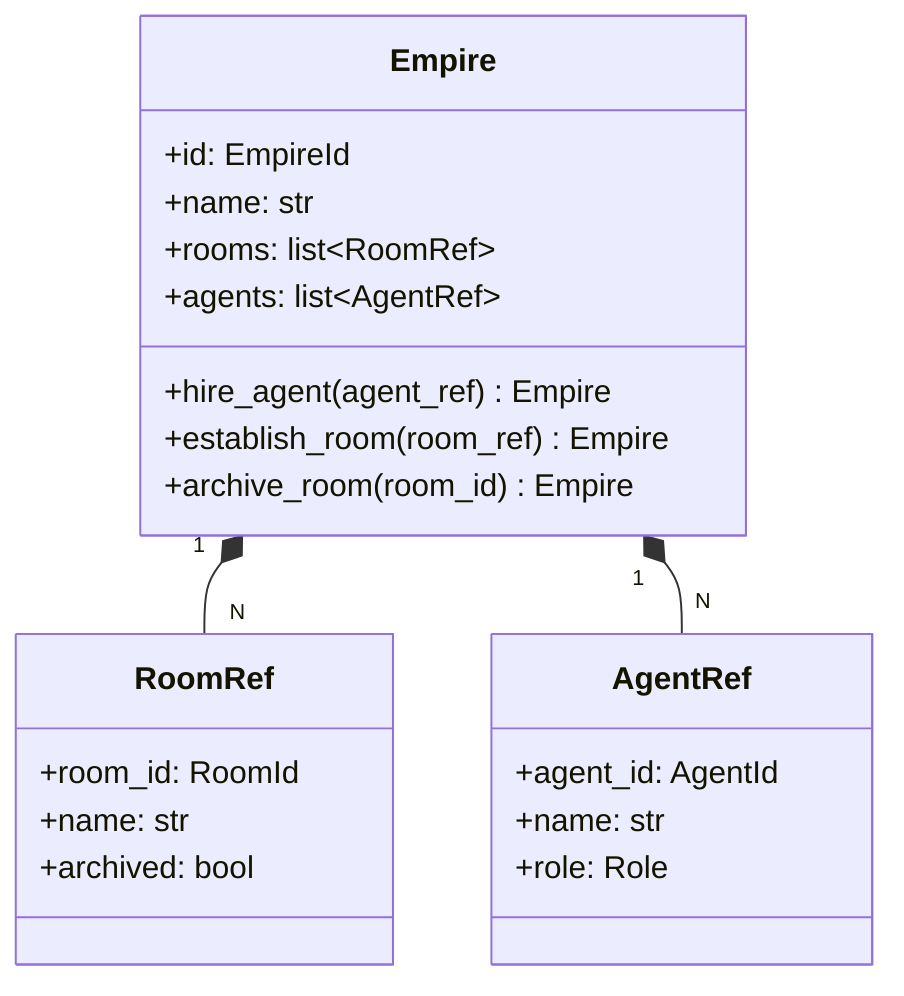

# 詳細設計書

> feature: `empire`
> 関連: [basic-design.md](basic-design.md) / [`docs/design/domain-model/aggregates.md`](../../../design/domain-model/aggregates.md) §Empire

## 記述ルール（必ず守ること）

詳細設計に**疑似コード・サンプル実装（python/ts/sh/yaml 等の言語コードブロック）を書かない**。
ソースコードと二重管理になりメンテナンスコストしか生まない。
必要なのは「構造契約（属性名・型・制約）」と「確定文言（メッセージ文字列）」と「実装の意図（なぜこの API 形になるか）」。

## クラス設計（詳細）

### Aggregate Root: Empire

| 属性 | 型 | 制約 | 意図 |
|----|----|----|----|
| `id` | `EmpireId`（UUIDv4） | 不変 | bakufu インスタンスの一意識別 |
| `name` | `str` | 1〜80 文字（Unicode コードポイント数）、前後空白除去後 | CEO が認識する表示名 |
| `rooms` | `list[RoomRef]` | 同一 `room_id` の重複なし、`len <= 100`（MVP 想定上限） | 編成された Room 参照 |
| `agents` | `list[AgentRef]` | 同一 `agent_id` の重複なし、`len <= 100`（MVP 想定上限） | 採用された Agent 参照 |

`model_config`:
- `frozen = True`（Pydantic v2 不変モデル）
- `arbitrary_types_allowed = False`
- `extra = 'forbid'`（未知フィールドを拒否）

**不変条件（Aggregate 内で守る）**:
- `name` は 1〜80 文字、前後空白除去後の長さで判定
- `agents` 内 `agent_id` の重複なし
- `rooms` 内 `room_id` の重複なし
- `len(agents)` および `len(rooms)` はそれぞれ 100 以下

**不変条件（application 層責務、Aggregate 内では守らない）**:
- bakufu インスタンスにつき Empire は 1 つ（シングルトン）— `EmpireService.create()` が `EmpireRepository.count() == 0` を確認

**ふるまい**:
- `hire_agent(agent_ref: AgentRef) -> Empire`: pre-validate 方式で `agents` に追加した新 Empire を返す
- `establish_room(room_ref: RoomRef) -> Empire`: pre-validate 方式で `rooms` に追加した新 Empire を返す
- `archive_room(room_id: RoomId) -> Empire`: 該当 RoomRef の `archived=True` に置換した新 Empire を返す。物理削除しない

### Value Object: RoomRef

| 属性 | 型 | 制約 |
|----|----|----|
| `room_id` | `RoomId`（UUIDv4） | 不変 |
| `name` | `str` | 1〜80 文字（Room.name と同一規格） |
| `archived` | `bool` | デフォルト False |

`model_config.frozen = True`。`__eq__` / `__hash__` は Pydantic 自動実装（`room_id` をキーとしない、全属性での構造的等価）。

### Value Object: AgentRef

| 属性 | 型 | 制約 |
|----|----|----|
| `agent_id` | `AgentId`（UUIDv4） | 不変 |
| `name` | `str` | 1〜40 文字（Agent.name と同一規格） |
| `role` | `Role`（列挙型） | LEADER / DEVELOPER / TESTER / REVIEWER / UX / SECURITY / ASSISTANT / DISCUSSANT / WRITER / SITE_ADMIN |

`model_config.frozen = True`。

### Exception: EmpireInvariantViolation

| 属性 | 型 | 制約 |
|----|----|----|
| `message` | `str` | MSG-EM-NNN 由来の文言 |
| `detail` | `dict[str, object]` | 違反の文脈（例: `{"agent_id": "...", "duplicate_with": "..."}`） |
| `kind` | `Literal['name_range', 'agent_duplicate', 'room_duplicate', 'room_not_found', 'capacity_exceeded']` | 違反の種別（test で文字列マッチに使用） |

`Exception` 継承。`domain/exceptions.py` の他の例外と統一フォーマット。

## 確定事項（先送り撤廃）

### 確定 A: pre-validate 方式の Pydantic v2 実装方針

業務ルール R1-1〜3 / R1-6（[`feature-spec.md §7`](../feature-spec.md)）で凍結された不変条件を、状態変更ふるまい呼び出しのたびに確実に再検査する実装方針を凍結する。

Pydantic v2 の `model_copy(update={...})` は `validate=False` がデフォルトのため、属性更新後に `model_validator(mode='after')` が再実行されない（[Pydantic v2 — model_copy](https://docs.pydantic.dev/latest/api/base_model/#pydantic.BaseModel.model_copy) 仕様）。本 feature では **`model_validate` を経由する** 形で再構築する。すなわち:

1. 現 Empire を `model_dump()` で dict 化
2. dict の該当キーを更新（`hire_agent` なら `agents` リスト、`establish_room` なら `rooms` リスト、`archive_room` なら対象 RoomRef の `archived` フラグ）
3. `Empire.model_validate(updated_dict)` で再構築 → `model_validator(mode='after')` が走り業務ルール R1-2 / R1-3 / R1-6 を再検査

これにより:
- **「変更が業務ルールを満たすことを保証してから返す」契約**（[`feature-spec.md §9 受入基準 4, 6, 8`](../feature-spec.md) の "既存編成は変化しない" を実装レベルで担保）
- 失敗時の元 Empire は変化していないため、application 層は明示的なロールバックを書く必要がない（不変モデルの帰結）

`model_copy(update={...})` を直接使わない理由は上記。`model_dump → model_validate` 経路で 1 回だけインスタンスを生成し、不変条件検査を通過したものだけが application 層に渡る。

### 確定 B: 名前バリデーションの Unicode 規約

**正規化パイプラインの順序を凍結する**:

1. 入力 `raw_name` を受け取る
2. `normalized = unicodedata.normalize('NFC', raw_name)` で NFC 正規化
3. `cleaned = normalized.strip()` で前後の ASCII 空白 + Unicode 空白（`\t` / `\n` / `　` 等）を除去
4. `length = len(cleaned)` で Unicode コードポイント数を計上
5. `1 <= length <= 80` を判定。違反なら `EmpireInvariantViolation(kind='name_range')` を raise
6. 通過なら `Empire.name = cleaned` として保持（生入力ではなく **NFC 正規化 + strip 済みの値**）

**MSG-EM-001 の `{length}` の意味**:

`{length}` は上記手順 4 の `len(cleaned)`、すなわち **NFC 正規化 + strip を適用した後の Unicode コードポイント数**。例:

| 入力 `raw_name` | NFC 後 | strip 後 `cleaned` | `{length}` |
|---|---|---|---|
| `'   '`（半角空白 3） | `'   '` | `''` | `0` |
| `'  a  '` | `'  a  '` | `'a'` | `1` |
| `'a' * 81` | 同上 | 同上 | `81` |
| `'テスト'`（合成形 3 文字） | `'テスト'`（合成形のまま、変化なし） | 同上 | `3` |
| `'テスト'`（分解形 6 コードポイント） | `'テスト'`（合成形 3 コードポイント） | 同上 | `3` |

これにより「空白のみ入力で `(got 0)`」「分解形 ASCII 単独でも合成形と同じ length」が保証される。これは Empire / Room / Agent の名前で共通の方針として固定する。

### 確定 C: rooms / agents の容量上限 100

MVP 想定規模での上限。`len > 100` で `EmpireInvariantViolation(kind='capacity_exceeded')`。Phase 2 で運用実績を見て調整する。

### 確定 D: 線形探索を採用

`archive_room` の `room_id` 検索は線形探索（O(N), N ≤ 100）。dict による O(1) 検索は採用しない（Pydantic frozen model の属性として list を保持する方が直感的、N=100 で線形でも 1μs 程度）。

## 設計判断の補足

### なぜ Empire のふるまいが新インスタンスを返すか

Pydantic v2 `frozen=True` の制約上、属性の in-place 更新は不可能。返り値で新 Empire を渡し、application 層が自身の参照を差し替える形になる。これは関数型プログラミング的なメリット（共有状態のバグが起きにくい、テストで before/after を独立して確認可能）も得られる。

### なぜ archive_room は物理削除しないか

bakufu の運用では「過去に存在した Room の履歴」が監査可能性に直結する。誤操作で archive した Room を復元できる経路（CLI / UI）も Phase 2 で提供予定。物理削除すると `audit_log` から参照される `room_id` が解決できなくなる。

### なぜ application 層でシングルトン強制をするか

「複数 Empire が存在しない」は **集合知識**であり、Empire 単一インスタンスからは観測できない。Repository 層で `count()` を取らないと判定できないため、Aggregate 内ではなく application 層責務とした（責務分離の原則）。

### なぜ name に Unicode NFC 正規化を入れるか

「テスト」（カタカナ）と「テスト」（合成形）が見分けにくい場合、内部表現を統一しないと後段の比較・検索で齟齬を生む。Empire 内では NFC を契約とし、UI / API レイヤでも入力時に NFC を強制する。

## ユーザー向けメッセージの確定文言

### プレフィックス統一

| プレフィックス | 意味 |
|--------------|-----|
| `[FAIL]` | 処理中止を伴う失敗 |
| `[OK]` | 成功完了 |
| `[SKIP]` | 冪等実行による省略 |
| `[WARN]` | 警告（処理は継続） |
| `[INFO]` | 情報提供（処理は継続） |

### MSG 確定文言表

| ID | 出力先 | 文言 |
|----|------|----|
| MSG-EM-001 | 例外 message / Toast | `[FAIL] Empire name must be 1-80 characters (got {length})` — `{length}` は §確定 B の正規化パイプライン（NFC 正規化 + `strip()`）適用後の `len()` 値（Unicode コードポイント数） |
| MSG-EM-002 | 例外 message / Toast | `[FAIL] Agent already hired: agent_id={agent_id}` |
| MSG-EM-003 | 例外 message / Toast | `[FAIL] Room already established: room_id={room_id}` |
| MSG-EM-004 | 例外 message / Toast | `[FAIL] Room not found in Empire: room_id={room_id}` |
| MSG-EM-005 | 例外 message / Toast | `[FAIL] Empire invariant violation: {detail}` |

メッセージ文字列は ASCII 範囲（プレースホルダ `{...}` は f-string 形式）。日本語化は UI 側 i18n リソースで行う（Phase 2）。本 feature の例外メッセージは英語固定。

## データ構造（永続化キー）

該当なし — 理由: 本 feature は domain 層のみで永続化スキーマは含まない。永続化マッピング（SQLAlchemy mapper）は `feature/persistence` で凍結する。

参考として、永続化される際の概形のみ示す（実装は別 feature）:

| カラム | 型 | 制約 | 意図 |
|-------|----|----|----|
| `id` | `UUID` | PK, NOT NULL | EmpireId |
| `name` | `VARCHAR(80)` | NOT NULL | 表示名 |

`rooms` / `agents` は別テーブル（`empire_room_refs` / `empire_agent_refs`）に正規化される想定。詳細は `feature/persistence` で確定。

## API エンドポイント詳細

該当なし — 理由: 本 feature は domain 層のみで HTTP API は含まない。API は `feature/http-api` で凍結する。

## 出典・参考

- [Pydantic v2 Models — frozen / model_config](https://docs.pydantic.dev/latest/concepts/models/) — frozen model の挙動
- [Pydantic v2 Validators — model_validator](https://docs.pydantic.dev/latest/concepts/validators/#model-validators) — `mode='after'` の実行タイミング
- [Pydantic v2 — model_copy / model_validate](https://docs.pydantic.dev/latest/api/base_model/#pydantic.BaseModel.model_validate) — pre-validate 方式の実装根拠
- [Domain-Driven Design Reference (Eric Evans, 2015)](https://www.domainlanguage.com/ddd/reference/) — Aggregate Root の責務範囲
- [`docs/design/domain-model/aggregates.md`](../../../design/domain-model/aggregates.md) — Empire 凍結済み設計
- [`docs/design/threat-model.md`](../../../design/threat-model.md) — 信頼境界 / OWASP Top 10
