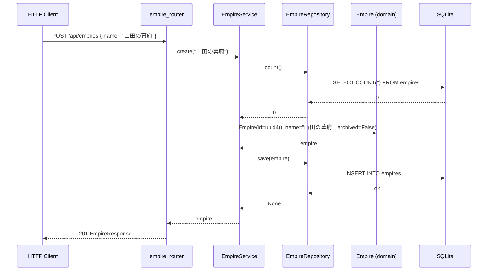
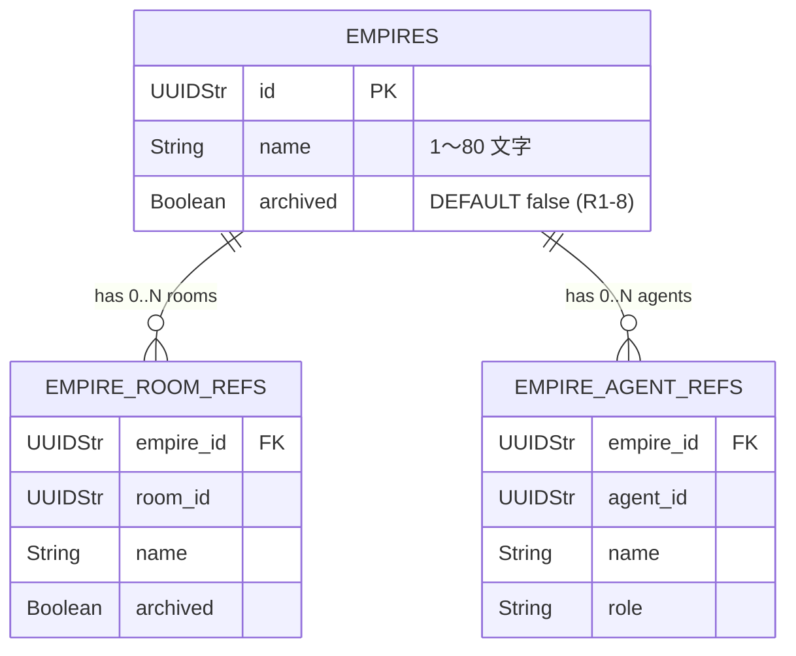

# 基本設計書

> feature: `empire` / sub-feature: `http-api`
> 関連 Issue: [#56 feat(empire-http-api): Empire HTTP API (M3-B)](https://github.com/bakufu-dev/bakufu/issues/56)
> 関連: [`../feature-spec.md`](../feature-spec.md) / [`../domain/basic-design.md`](../domain/basic-design.md) / [`../repository/basic-design.md`](../repository/basic-design.md) / [`../../http-api-foundation/http-api/basic-design.md`](../../http-api-foundation/http-api/basic-design.md)
> 凍結済み設計参照: [`docs/design/architecture.md §interfaces レイヤー詳細`](../../../design/architecture.md) / [`docs/design/threat-model.md`](../../../design/threat-model.md)

## 記述ルール（必ず守ること）

基本設計に**疑似コード・サンプル実装（python/ts/sh/yaml 等の言語コードブロック）を書かない**。
ソースコードと二重管理になりメンテナンスコストしか生まない。
必要なのは構造契約（クラス・モジュール・データの関係）であり、実装の細部は [detailed-design.md](detailed-design.md) で凍結する。

## モジュール構成

本 sub-feature で追加・変更するモジュール一覧。

| 機能 ID | モジュール | ディレクトリ | 責務 |
|--------|----------|------------|------|
| REQ-EM-HTTP-001〜005 | `empire_router` | `backend/src/bakufu/interfaces/http/routers/empire.py` | Empire CRUD エンドポイント（5本）|
| REQ-EM-HTTP-001〜005 | `EmpireService` | `backend/src/bakufu/application/services/empire_service.py` | http-api-foundation で骨格確定済み。本 sub-feature で `create / find_all / find_by_id / update / archive` メソッドを肉付け |
| REQ-EM-HTTP-001〜005 | `EmpireSchemas` | `backend/src/bakufu/interfaces/http/schemas/empire.py` | Pydantic v2 リクエスト / レスポンスモデル（新規ファイル）|
| 横断 | `empire 例外ハンドラ群` | `backend/src/bakufu/interfaces/http/error_handlers.py`（既存追記）| `EmpireInvariantViolation` / `EmpireAlreadyExistsError` / `EmpireArchivedError` / `EmpireNotFoundError` → `ErrorResponse` 変換 |
| REQ-EM-HTTP-002 | `EmpireRepository.find_all` 拡張 | `backend/src/bakufu/application/ports/empire_repository.py`（既存追記）| `find_all() → list[Empire]` メソッド追加（empire-repository PR でスコープ外だったため本 PR で追加）|
| REQ-EM-HTTP-002 | `SqliteEmpireRepository.find_all` 実装 | `backend/src/bakufu/infrastructure/persistence/sqlite/repositories/empire_repository.py`（既存追記）| `SELECT * FROM empires` で全行取得し Empire リスト返却 |
| UC-EM-010 | Empire domain 拡張 | `backend/src/bakufu/domain/empire.py`（既存追記）| `archived: bool = False` フィールド追加 / `archive()` メソッド追加（`archived=True` の新 Empire を返す）|
| UC-EM-010 | Alembic 3rd revision | `backend/alembic/versions/0003_empire_archived.py` | `empires` テーブルに `archived` カラム（Boolean, DEFAULT false）追加 |

```
本 sub-feature で追加・変更されるファイル:

backend/
├── alembic/versions/
│   └── 0003_empire_archived.py                          # 新規: empires.archived カラム追加
└── src/bakufu/
    ├── domain/
    │   └── empire.py                                    # 既存追記: archived フィールド / archive() メソッド
    ├── application/
    │   ├── ports/
    │   │   └── empire_repository.py                     # 既存追記: find_all() 追加
    │   ├── exceptions/
    │   │   └── empire_exceptions.py                     # 新規: EmpireNotFoundError / EmpireAlreadyExistsError / EmpireArchivedError
    │   └── services/
    │       └── empire_service.py                        # 既存追記: create / find_all / find_by_id / update / archive
    └── interfaces/http/
        ├── error_handlers.py                            # 既存追記: empire 例外ハンドラ群
        ├── routers/
        │   └── empire.py                               # 新規: POST/GET/PATCH/DELETE エンドポイント
        └── schemas/
            └── empire.py                               # 新規: EmpireCreate / EmpireUpdate / EmpireResponse / EmpireListResponse
```

## モジュール契約（機能要件）

本 sub-feature が提供するモジュールの入出力契約を凍結する。各 REQ-EM-HTTP-NNN は親 [`../feature-spec.md §5`](../feature-spec.md) ユースケース UC-EM-NNN と 1:1 または N:1 で対応する（孤児要件を作らない）。

### REQ-EM-HTTP-001: Empire 作成（POST /api/empires）

| 項目 | 内容 |
|---|---|
| 入力 | `EmpireCreate(name: str)`（1〜80 文字, 業務ルール R1-1）|
| 処理 | `EmpireService.create(name)` → `EmpireRepository.count()` でシングルトン検査（業務ルール R1-5）→ 既存あり: `EmpireAlreadyExistsError` raise → 新規構築 `Empire(id=uuid4(), name=name, archived=False)` → `EmpireRepository.save(empire)` |
| 出力 | HTTP 201, `EmpireResponse`（id / name / archived / rooms / agents）|
| エラー時 | R1-5 違反（既存 Empire あり）→ `EmpireAlreadyExistsError` → HTTP 409 `{"error": {"code": "conflict", "message": ...}}` (MSG-EM-HTTP-001) / Pydantic 422 name 範囲違反（http-api-foundation 確定A）|

### REQ-EM-HTTP-002: Empire 一覧取得（GET /api/empires）

| 項目 | 内容 |
|---|---|
| 入力 | なし（クエリパラメータなし）|
| 処理 | `EmpireService.find_all()` → `EmpireRepository.find_all()` で全 Empire 取得（シングルトンのため 0 件または 1 件）|
| 出力 | HTTP 200, `EmpireListResponse(items: list[EmpireResponse], total: int)`（空リストも 200 で返す）|
| エラー時 | 該当なし（0 件は空リストで 200）|

### REQ-EM-HTTP-003: Empire 単件取得（GET /api/empires/{empire_id}）

| 項目 | 内容 |
|---|---|
| 入力 | パスパラメータ `empire_id: str`（UUID v4 形式）|
| 処理 | `EmpireService.find_by_id(empire_id)` → `EmpireRepository.find_by_id(empire_id)` → 存在しない場合 `EmpireNotFoundError` raise |
| 出力 | HTTP 200, `EmpireResponse` |
| エラー時 | 不在 → `EmpireNotFoundError` → HTTP 404 `{"error": {"code": "not_found", "message": ...}}` (MSG-EM-HTTP-002) |

### REQ-EM-HTTP-004: Empire 更新（PATCH /api/empires/{empire_id}）

| 項目 | 内容 |
|---|---|
| 入力 | パスパラメータ `empire_id: str` + `EmpireUpdate(name: str \| None)`（None の場合は変更なし）|
| 処理 | `EmpireService.update(empire_id, name)` → `find_by_id` → アーカイブ済み検査（業務ルール R1-8）→ `Empire(... name=new_name)` 再構築（business rule R1-1 検査）→ `save` |
| 出力 | HTTP 200, 更新済み `EmpireResponse` |
| エラー時 | 不在 → HTTP 404 (MSG-EM-HTTP-002) / アーカイブ済み → `EmpireArchivedError` → HTTP 409 `{"error": {"code": "conflict", "message": ...}}` (MSG-EM-HTTP-003) / name 範囲違反 → HTTP 422 (http-api-foundation 確定A) |

### REQ-EM-HTTP-005: Empire 論理削除（DELETE /api/empires/{empire_id}）

| 項目 | 内容 |
|---|---|
| 入力 | パスパラメータ `empire_id: str` |
| 処理 | `EmpireService.archive(empire_id)` → `find_by_id` → `empire.archive()` → `EmpireRepository.save(archived_empire)` |
| 出力 | HTTP 204 No Content |
| エラー時 | 不在 → HTTP 404 (MSG-EM-HTTP-002) |

## ユーザー向けメッセージ一覧

確定文言は [`detailed-design.md §MSG 確定文言表`](detailed-design.md) で凍結する。

| ID | 種別 | 条件 | HTTP ステータス |
|---|---|---|---|
| MSG-EM-HTTP-001 | エラー（競合）| Empire が既に存在する（R1-5 違反）| 409 |
| MSG-EM-HTTP-002 | エラー（不在）| Empire が見つからない | 404 |
| MSG-EM-HTTP-003 | エラー（競合）| アーカイブ済み Empire への更新（R1-8 違反）| 409 |

## 依存関係

| 区分 | 依存 | バージョン方針 | 備考 |
|---|---|---|---|
| ランタイム | Python 3.12+ | pyproject.toml | 既存 |
| HTTP フレームワーク | FastAPI / Pydantic v2 / httpx | pyproject.toml | http-api-foundation で確定済み |
| DI パターン | `get_session()` / `get_empire_service()` | http-api-foundation 確定E | `dependencies.py` に `get_empire_repository()` / `get_empire_service()` を追記 |
| application 例外 | `EmpireNotFoundError` / `EmpireAlreadyExistsError` / `EmpireArchivedError` | 本 PR で新規定義 | `application/exceptions/empire_exceptions.py` |
| domain | `Empire` / `EmpireId` / `EmpireInvariantViolation` | M1 確定 | empire domain sub-feature（PR #15）|
| repository | `EmpireRepository` Protocol / `SqliteEmpireRepository` | M2 確定 + 本 PR で `find_all` 追記 | empire repository sub-feature（PR #25）|
| 基盤 | http-api-foundation（ErrorResponse / lifespan / CSRF / CORS）| M3-A 確定（PR #92/93）| 全 error handler / app.state.session_factory を引き継ぐ |

## クラス設計（概要）

```mermaid
classDiagram
    class EmpireRouter {
        <<FastAPI APIRouter>>
        +POST /api/empires
        +GET /api/empires
        +GET /api/empires/{id}
        +PATCH /api/empires/{id}
        +DELETE /api/empires/{id}
    }
    class EmpireService {
        -_repo: EmpireRepository
        +__init__(repo: EmpireRepository)
        +create(name: str) Empire
        +find_all() list~Empire~
        +find_by_id(empire_id: EmpireId) Empire
        +update(empire_id: EmpireId, name: str | None) Empire
        +archive(empire_id: EmpireId) None
    }
    class EmpireRepository {
        <<Protocol>>
        +find_by_id(empire_id) Empire | None
        +find_all() list~Empire~
        +count() int
        +save(empire) None
    }
    class EmpireCreate {
        <<Pydantic BaseModel>>
        +name: str
    }
    class EmpireUpdate {
        <<Pydantic BaseModel>>
        +name: str | None
    }
    class EmpireResponse {
        <<Pydantic BaseModel>>
        +id: str
        +name: str
        +archived: bool
        +rooms: list~RoomRefResponse~
        +agents: list~AgentRefResponse~
    }
    class EmpireListResponse {
        <<Pydantic BaseModel>>
        +items: list~EmpireResponse~
        +total: int
    }

    EmpireRouter --> EmpireService : uses (DI)
    EmpireService --> EmpireRepository : uses (Port)
    EmpireRouter ..> EmpireCreate : deserializes
    EmpireRouter ..> EmpireUpdate : deserializes
    EmpireRouter ..> EmpireResponse : serializes
    EmpireRouter ..> EmpireListResponse : serializes
```

## 処理フロー

### ユースケース 1: Empire 作成（POST /api/empires）

1. Router が `EmpireCreate` を Pydantic でデシリアライズ（422 on 失敗）
2. `get_empire_service()` DI で `EmpireService` を取得
3. `EmpireService.create(name)` 呼び出し
4. `EmpireRepository.count()` → count > 0 なら `EmpireAlreadyExistsError` → 409
5. `Empire(id=uuid4(), name=name, archived=False)` 構築（R1-1 失敗時 `EmpireInvariantViolation` → 422）
6. `async with session.begin()`: `EmpireRepository.save(empire)`
7. HTTP 201, `EmpireResponse` を返す

### ユースケース 2: Empire 一覧取得（GET /api/empires）

1. `EmpireService.find_all()` → `EmpireRepository.find_all()`
2. `list[Empire]` を `list[EmpireResponse]` にマップ
3. `EmpireListResponse(items=..., total=len(...))` で HTTP 200

### ユースケース 3: Empire 単件取得（GET /api/empires/{id}）

1. `EmpireService.find_by_id(empire_id)` → `EmpireRepository.find_by_id(empire_id)`
2. None なら `EmpireNotFoundError` → 404
3. `EmpireResponse` で HTTP 200

### ユースケース 4: Empire 更新（PATCH /api/empires/{id}）

1. `EmpireService.find_by_id(empire_id)` → None なら `EmpireNotFoundError` → 404
2. `empire.archived` が True なら `EmpireArchivedError` → 409
3. name が None でない場合は `Empire(..., name=new_name)` 再構築（R1-1 検査）
4. `async with session.begin()`: `EmpireRepository.save(updated)`
5. `EmpireResponse` で HTTP 200

### ユースケース 5: Empire 論理削除（DELETE /api/empires/{id}）

1. `EmpireService.archive(empire_id)` → `find_by_id` → None なら `EmpireNotFoundError` → 404
2. `empire.archive()` → `archived=True` の新 Empire を返す（domain の不変モデルに準拠）
3. `async with session.begin()`: `EmpireRepository.save(archived_empire)`
4. HTTP 204 No Content

## シーケンス図



## アーキテクチャへの影響

- **`docs/design/architecture.md`**: 変更なし（http-api-foundation で `routers/empire.py` の配置はすでに明示済み）
- **`docs/design/tech-stack.md`**: 変更なし
- **`empire/domain/basic-design.md`**: `archived: bool = False` フィールドと `archive()` メソッドの追加を本 PR で実施（domain 設計書の更新は別 PR で先行すべきだが、フィールド 1 件 + メソッド 1 件の最小変更として同一 PR に含める）
- **`empire/repository/basic-design.md`**: `find_all()` メソッド追加（同上）
- 既存 feature への波及: http-api-foundation の `error_handlers.py` に empire 専用ハンドラを追記するが、既存ハンドラ（HTTPException / ValidationError / generic）は変更しない

## 外部連携

| 連携先 | 目的 | プロトコル | 認証 | タイムアウト / リトライ |
|-------|------|----------|-----|---------------------|
| 該当なし | — | — | — | — |

## UX 設計

| シナリオ | 期待される挙動 |
|---------|------------|
| Empire 未作成で GET /api/empires | `{"items": [], "total": 0}` を返す（エラーではない）|
| 既存 Empire に POST /api/empires | `{"error": {"code": "conflict", "message": "Empire already exists."}}` で 409 |
| アーカイブ済み Empire に PATCH | `{"error": {"code": "conflict", "message": "Empire is archived and cannot be modified."}}` で 409 |

**アクセシビリティ方針**: 該当なし（HTTP API のため）。

## セキュリティ設計

### 脅威モデル

| 想定攻撃者 | 攻撃経路 | 保護資産 | 対策 |
|-----------|---------|---------|------|
| **T1: CSRF 経由での Empire 改ざん** | ブラウザ経由の不正 POST / PATCH / DELETE | Empire の状態整合性 | http-api-foundation 確定D: CSRF Origin 検証ミドルウェア（`Origin` ヘッダ不一致なら 403）|
| **T2: スタックトレース露出** | 500 エラーレスポンスへのスタックトレース混入 | 内部実装情報 | http-api-foundation 確定A: generic_exception_handler が `internal_error` のみを返す |
| **T3: 不正な UUID によるパスインジェクション** | `empire_id` に不正値を注入 | DB 整合性 | Pydantic の `UUID` 型強制（422 on 不正形式）+ SQLAlchemy ORM（SQL injection 防止）|

### OWASP Top 10 対応

| # | カテゴリ | 対応状況 |
|---|---------|---------|
| A01 | Broken Access Control | loopback バインド（`127.0.0.1:8000`）+ CSRF Origin 検証（http-api-foundation 確定D）|
| A02 | Cryptographic Failures | 該当なし（Empire データは非機密）|
| A03 | Injection | SQLAlchemy ORM 経由（raw SQL 不使用）|
| A04 | Insecure Design | domain の不変モデル（pre-validate + frozen Empire）で不整合状態を物理的に防止 |
| A05 | Security Misconfiguration | http-api-foundation の lifespan / CORS 設定を引き継ぐ |
| A06 | Vulnerable Components | 依存 CVE は CI `pip-audit` で監視（http-api-foundation 確定済み）|
| A07 | Auth Failures | MVP 設計上 意図的な認証なし（loopback バインドで代替）|
| A08 | Data Integrity Failures | delete-then-insert + UoW（repository sub-feature 確定済み）|
| A09 | Logging Failures | 内部エラーは application 層でログ、スタックトレースはレスポンスに含めない（T2 対策）|
| A10 | SSRF | 該当なし（外部 URL fetch なし）|

## ER 図

本 sub-feature で `empires` テーブルに `archived` カラムを追加する。



masking 対象カラム: **なし**（`archived` も非機密情報）。

## エラーハンドリング方針

| 例外種別 | 発生箇所 | 処理方針 | HTTP ステータス |
|---------|---------|---------|---------------|
| `EmpireNotFoundError` | EmpireService（`find_by_id` 結果 None 時）| `error_handlers.py` の専用ハンドラが HTTP 404 に変換 | 404 |
| `EmpireAlreadyExistsError` | EmpireService（`create` 時 R1-5 違反）| 同 409 に変換（MSG-EM-HTTP-001）| 409 |
| `EmpireArchivedError` | EmpireService（`update` 時 R1-8 違反）| 同 409 に変換（MSG-EM-HTTP-003）| 409 |
| `EmpireInvariantViolation` | domain Empire（名前範囲 / 重複 / 容量違反）| 同 422 に変換（MSG-EM-HTTP-004）|  422 |
| `RequestValidationError` | FastAPI Pydantic（入力形式不正）| http-api-foundation の既存ハンドラ | 422 |
| その他例外 | どこでも | http-api-foundation の generic_exception_handler | 500（スタックトレース非露出）|

Router 内に `try/except` は書かない（[`../../http-api-foundation/http-api/basic-design.md`](../../http-api-foundation/http-api/basic-design.md) 規律）。
